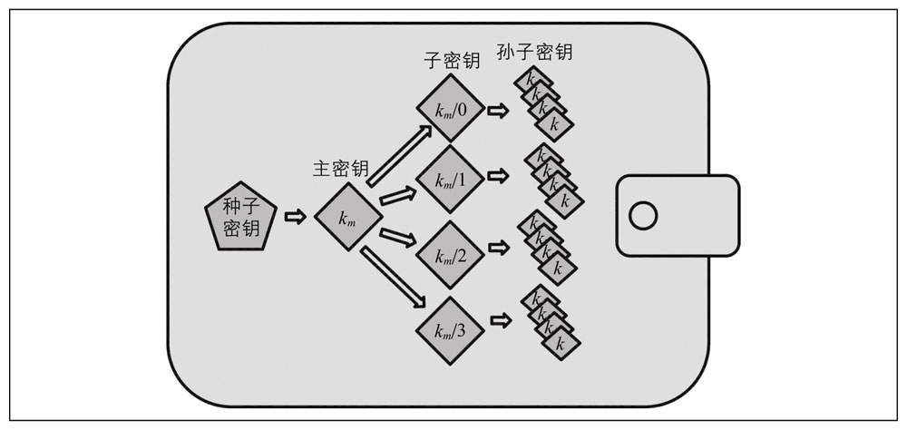
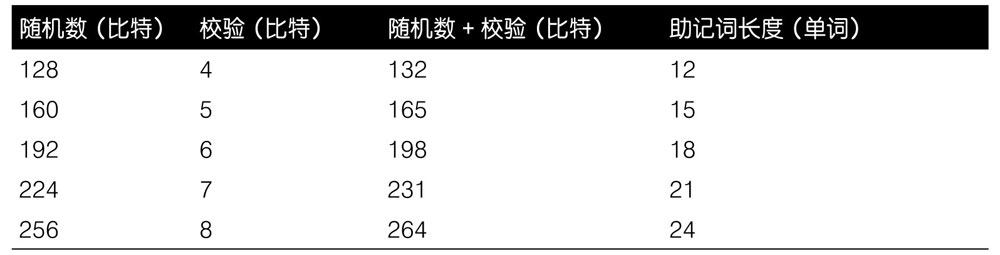
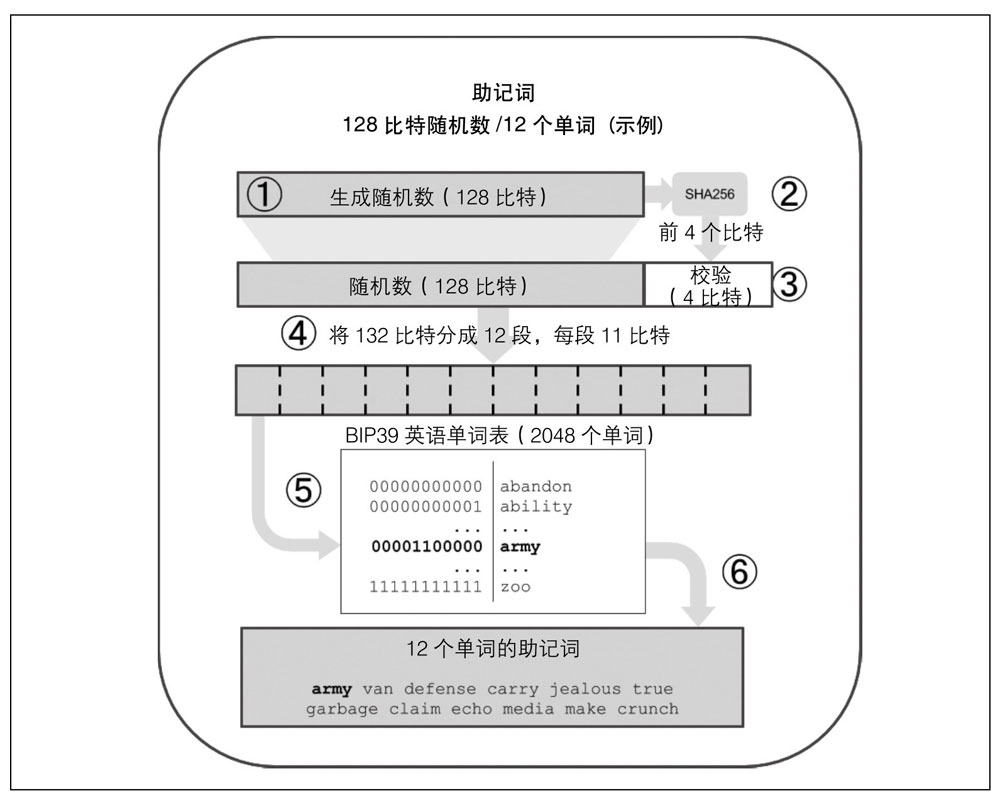
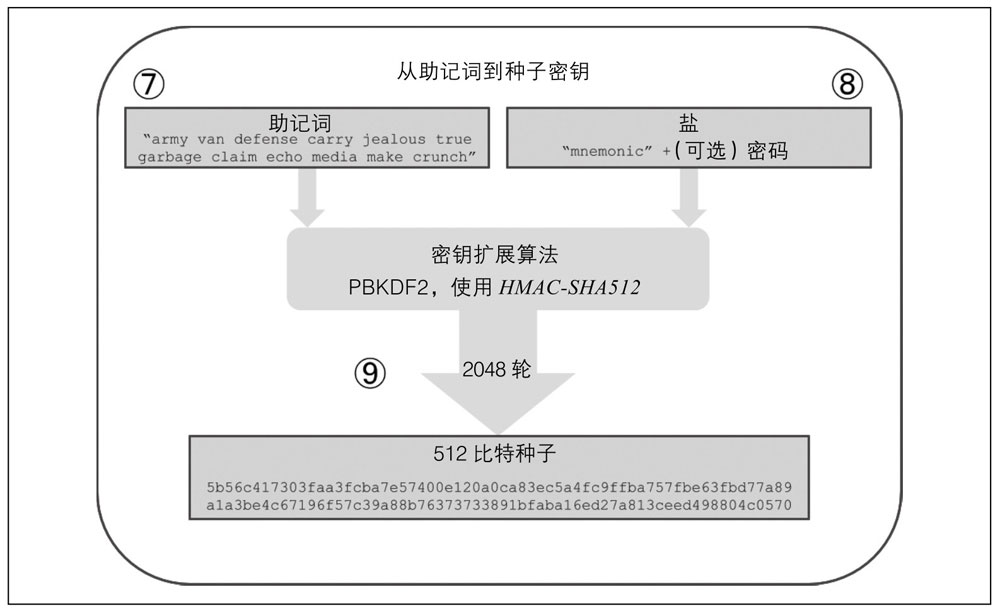
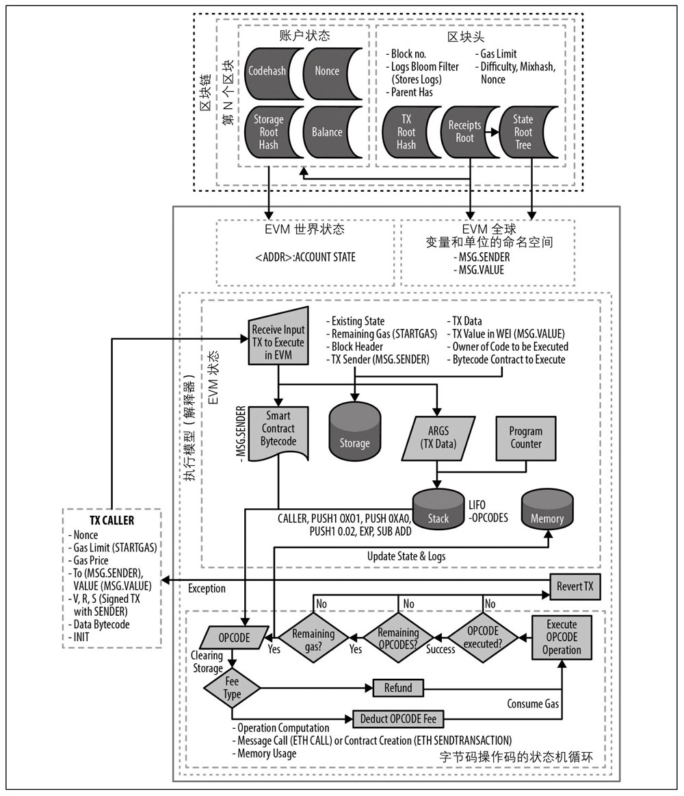
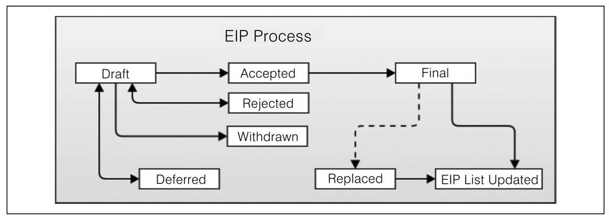

# 《精通以太坊》

!!! abstract "阅读信息"

    - **评分**：⭐️⭐️⭐️⭐️
    - **时间**：09/07/2022 → 09/26/2022
    - **读后感**：快速入门区块链及以太坊不可多得的好书

比特币可以看作一个分布式的共识状态机，交易导致一次全局范围的状态转换，改变了比特币的所有权。而以太坊跟踪的是一个通用目的的数据存储的状态转变。

区块链领域聚集了众多不同的知识：编程、信息安全、密码学、经济学、分布式系统、点对点网络，等等。

《黄皮书》作为以太坊的实现标准，让以太坊拥有众多客户端，避免了单一客户端被网络攻击的风险。而比特币则没有任何正式的定义规范文档，其标准主要来自 BitcoinCore 的代码实现。

[https://bitinfocharts.com/](https://bitinfocharts.com/) 列出了 bitcoin 和 ethereum 的当前区块总大小。

实际上，MetaMask 会在浏览器注入一个 web3 实例，作为可以连接到多个以太坊区块链的 RPC 客户端。

## 密码学

数字货币领域使用了 secp256k1 标准椭圆曲线的多个程序实现：

- [OpenSSL](https://www.openssl.org/)：程序库提供了非常丰富的密码学基础类库，包括完整的 secp256k1。例如，我们可以使用`EC_POINT_mul`来获得公钥。
- [libsecp256k1](https://github.com/bitcoin-core/secp256k1)：比特币核心使用的是 libsecp256k1，这是由 C 语言实现的 secp256k1 椭圆曲线和其他相关的密码学类库。该算法是从零开发的，旨在替代 OpenSSL。相比 OpenSSL，其在性能和安全性方面都更胜一筹

secp256k1 是非对称加密算法，keccak256 则是哈希算法。

## 地址

不同于比特币，比特币地址中包含了一个内置的校验器用于防止可能的错误地址输入。以太坊的地址是原生的十六进制数据，没有任何校验信息。

以太坊地址并不区分大小写，对于钱包软件来说，不论是包含大写字母还是小写字母格式的地址都是一样的。为了能够检测用户输入的地址是否错误，EIP-55 先将小写地址通过 keccak256 进行哈希，然后在将原地址与哈希值每位对齐，如果哈希值≥8，则将地址对应位大写。

如果用户不小心写错了某一位，小写地址经过哈希后就会得到完全不同的哈希值，从而无法得到 EIP-55 与原地址相同的结果，从而判断地址错误。

| Address | 0   | 0   | 1   | d   | 3   | f   | 1   | e   | f   | 8   | 2   | 7   | 5   | 5   | 2   | a   | e   | 1   | 1   | 1   | 4   | 0   | 2   | 7   | b   | d   | 3   | e   | c   | f   | 1   | f   | 0   | 8   | 6   | b   | a   | 0   | f   | 9   |                          |
| ------- | --- | --- | --- | --- | --- | --- | --- | --- | --- | --- | --- | --- | --- | --- | --- | --- | --- | --- | --- | --- | --- | --- | --- | --- | --- | --- | --- | --- | --- | --- | --- | --- | --- | --- | --- | --- | --- | --- | --- | --- | ------------------------ |
| Hash    | 2   | 3   | a   | 6   | 9   | c   | 1   | 6   | 5   | 3   | e   | 4   | e   | b   | b   | b   | 6   | 1   | 9   | b   | 0   | b   | 2   | c   | b   | 8   | a   | 9   | b   | a   | d   | 4   | 9   | 8   | 9   | 2   | a   | 8   | b   | 9   | 695d9a19d8f673ca991deae1 |
| EIP-55  | 0   | 0   | 1   | d   | 3   | F   | 1   | e   | f   | 8   | 2   | 7   | 5   | 5   | 2   | A   | e   | 1   | 1   | 1   | 4   | 0   | 2   | 7   | B   | D   | 3   | E   | C   | F   | 1   | f   | 0   | 8   | 6   | b   | A   | 0   | F   | 9   |                          |

## 钱包

钱包中只存储私钥，比特币或以太币存储于区块链上，用户用钱包中的私钥来签名交易。

钱包的分类：

- 非确定（随机）钱包：隐私保护较好，但需要小心保存每一个私钥，除简单的测试场景外，不推荐使用此类钱包。
- 确定性（种子密钥）钱包：确定性钱包或基于种子密钥的钱包，包含了从同一个种子密钥（或者叫主密钥）所派生的私钥。在确定性钱包中，种子密钥就可以用来恢复所有的派生密钥，因此在创建钱包时备份种子密钥就足以保护资金和智能合约的安全了。种子密钥也可以用来进行钱包的导出或者导入操作，一次性把钱包中的所有派生密钥在不同的钱包软件中迁移。
- 层级式确定性钱包（BIP32/BIP44）：HD 钱包（Hierarchical Deterministic Wallet，树状确定性钱包）可以保存用树状结构推导的多个密钥，比如一个私钥可以推导出一系列子密钥，每一个子密钥都可以推导出一系列孙子密钥，如此类推至于无穷。HD 钱包的两个好处：
    - 树形结构可以用来表示组织结构的含义，例如一组密钥专门用来收款，另外一组专门用来付款。也可以把这样的结构跟公司的组织架构对应，把树形结构的分支跟部门、区域、具体的职能或公司内部的账户分类相匹配。
    - HD 钱包的用户可以创建一系列公钥，这个过程不需要访问对应的私钥。这样就允许 HD 钱包被用在相对不安全的服务器上，或者专门用于收款，这时候钱包中不需要保存可以操作以太币的私钥信息。
      
      HD 钱包：从一个种子随机数中生成的一棵密钥树

钱包的标准：

- 基于 BIP-39 的助记词标准
- 基于 BIP-32 的层级式确定性钱包标准
- 基于 BIP-43 的多用途层级式确定性钱包结构
- 基于 BIP-44 的多币种和多账户钱包

随机数据的长度与助记词数量之间的关系

生成随机数并编码为助记词

从助记词到种子密钥

## 交易

**交易是唯一能够触发区块链状态改变**，或触发 EVM 上的合约执行的东西。以太坊是一个全局的单体状态机，交易是唯一能够让这台状态机向前推进并改变状态的东西。合约并不会自动运行。以太坊也不会在“后台”运行。所有这一切，都是由交易触发的。

在交易数据包的格式中，并不包含发起这个交易的外部账户的所谓“from”地址。这是因为发起交易的外部账户的公钥，可以经由椭圆曲线数字签名算法的 v, r, s 这三个组件计算得出。对应的外部账号的地址，也可以经由公钥推算得出。

与比特币协议使用的“未花费输出”（UTXO）机制相比，使用随机数对于基于账户的区块链协议实际上是至关重要的。

如果你按顺序创建了一系列交易，但其中一个没有得到确认，那么之后的所有交易都会“堵”住，等待这个缺失的交易。如果某个交易的`nonce`值不对，或者没有足够的 gas，就很可能会导致这样的堵车现象。为了疏通堵车，你必须创建一个正确的交易，并且使用缺失的那个 nonce 值。同样值得注意的是，一旦网络验证了“缺失”的交易，那么具有后续随机数的所有交易都会被广播，并逐渐变得有效；而且无法“撤回”任何交易！

如果你不小心创建了重复的交易，例如发出了两个具有相同 nonce 值的交易，但是收款地址或交易金额不同，那么其中一个会被确认，而另外一个会被拒绝。最先到达以太坊网络中确认节点的那个交易会被确认（这会相当随机）。

以太坊是一个允许并发操作（包含节点、客户端、去中心化应用），但通过共识强制维持单体状态的系统。

交易可以同时包括`value`和`data`，只有`value`、只有`data`或既没有`value`也没有`data`这几种情况都是正确且合法的。只包含`value`的交易是支付操作。只包含`data`的交易是针对合约的调用。既没有`value`也没有`data`的交易也许只是为了浪费`gas`，但也是允许的。

**`data`字段用于合约调用，`value`则用于外部账户交易**。

向合约注册地址 0x0 发送以太币，会销毁这部分以太币。

**合约注册交易中唯一需要的就是在`data`字段中包含经过编译的合约字节码。这个交易的唯一用处就是把合约注册到以太坊区块链上**。你可以在`value`字段中包含以太币，从而为新的合约设置起始余额，但这完全是可选的。如果你向合约注册地址发送了一笔只有 value（以太币）而没有 data 数据字段的交易，那么这比交易的效果和销毁以太币一样：没有新的合约可用，以太币却丢失了。

以太坊的多重签名通过合约实现。这种实现方式更加灵活，但合约的漏洞也更容易被攻击，破坏多重签名的安全性。

## 合约

外部账户就是一个账户，没有任何代码和状态存储与之关联，而合约账户则有其代码和数据状态存储。外部账户被交易控制，交易由来自现实世界中的私钥所创建并签名，并且是与协议独立的；**合约账户并没有私钥**，而是由它的智能合约代码进行预先控制。

智能合约编写最佳实践：

- 最小化/简单化：复杂性是安全性的敌人，越简单，越安全。
- 代码重用：遵循 DRY 原则，如果一个库或合约已经实现了你需要的大部分功能，那就去重用它
- 代码质量：智能合约的代码是不可更改的，每个 bug 都可能会导致资金的损失，合约开发是零容错的，一旦代码发布，就几乎无法再修复任何问题。
- 可读性和可审计性：合约代码应该简洁并易于理解，越容易理解也就越容易进行审计。
- 测试覆盖率：智能合约是运行在一个完全开放的环境中的，任何人都可以使用他们想定的任意输入数据来执行智能合约。永远不要假定像函数参数这样的输入数据是格式化好的、不会越界的或一定有正常目的的。

### Solidity

Solidity 安装完成后，可通过 `solc —version` 查看版本。

官方文档：[https://docs.soliditylang.org/en/stable/](https://docs.soliditylang.org/en/stable/)

Solidity 中 Gas 费相关问题：

- 避免动态尺寸数组：任何对动态数组的循环操作，都有触发高额 gas 消耗的风险
- 避免调用其他合约：调用其他合约，特别是那些 gas 消耗未知的合约，可能会产生高额的 gas 开销

重入攻击部分需要重新仔细阅读：

- [https://paper.seebug.org/1582/](https://paper.seebug.org/1582/)
- 学习完合约开发后第 9 章重新阅读

## 代币

区块链上的代币是指基于区块链的一种抽象资产，可以被持有并且用来代表资产、现金或访问权限。

基于区块链代币的一个非常重要的未来，就是用区块链内的资产替代区块链外的资产，因此可以消除对手方风险。

以太币是以太坊协议的内在动作，而代币则是以太坊平台上的智能合约。

用通俗的解释来说，代币就是非官方发行的某个领域内的货币，如 Q 币是在腾讯服务范围内交易，欢乐豆可以在斗地主游戏中交易，但现实生活中仍需要人民币交易。在以太坊的世界中，BNB 这样的代币，就像 Q 币与人民币的关系一样。

### ERC20

ERC20 是可替代性代币的标准，意味着 ERC20 代币的不同单元之间是可以互相交换的，代币并没有独特的属性。

**ERC20 标准定义了通过合约实现代币的通用接口，兼容此标准的所有代币都可以采用相同的方式被访问和使用**。

代币的行为模式跟以太币不一样。以太币使用`send`函数发送，任何合约中的可支付函数或者外部账户都可以接收以太币。代币使用`transfer`或`approve` & `transferFrom`函数发送，这些函数只存在于创建这个代币的合约中，（至少在 ERC20 标准中）并不会触发接收方合约中的任何可支付函数

### ERC721

ERC20 将所有者作为映射的主键，跟踪每个所有者的余额；而 ERC721 将契约 ID 作为映射的主键，跟踪每个契约 ID 及其所有者。

## 预言机

预言机为智能合约提供了至关重要的服务：它们将外部事实带入合约执行。当然，预言机也会带来很大的风险：如果它们是受信任的来源并且可能受到损害，可能导致它们提供的智能合约的执行受损。

在区块链的上下文中，预言机（oracle）是一个可以回答以太坊外部问题的系统。在理想情况下，预言机是**无信任的系统**，这意味着它们不需要被信任，因为它们是按照去中心化的原则运行的。

以太坊平台的一个关键组件是 EVM，它能够在分散网络中的任何节点上执行程序并更新受共识规则约束的以太坊状态。为了保持共识，EVM 的执行过程必须完全确定，并且仅基于以太坊状态和签名交易的共享上下文。

## 去中心化应用（DApp）

DApp 相比传统的中心化架构的优点：

- 永不停机：基于分布式区块链
- 透明：区块链信息是公开可审查的
- 抗审查：审查者无法修改任何数据，并且无法关停服务

由于昂贵的 Gas 费，智能合约不适合存储和处理大量数据，大多数 DApp 使用 IPFS 或以太坊的 Swarm 存储。

星际文件系统（IPFS）是一个去中心化的、内容可寻址的存储系统，它可以在 P2P 网络中分配存储的对象。“内容可寻址”意味着内容（文件）的每一小块都被哈希处理，并且这个哈希值可以标识文件。然后，你可以通过这个哈希值在 IPFS 的任何节点上将文件取回。

### ENS

可在 [https://app.ens.domains/](https://app.ens.domains/) 申请 ENS

## EVM

EVM 的架构和执行上下文

## 共识

共识机制的奖励只是工具，去中心化的安全性才是目的。

PoS 与 PoW 主要的区别在于 PoS 中的惩罚是**内生**于区块链的（例如失去质押的以太币），而 PoW 中的惩罚是**外生**的（例如让花在电力上的资金做了无用功）

## EIP

EIP 提案仓库地址：https://github.com/ethereum/EIPs/

