# 《图解密码技术》

!!! abstract "阅读信息"

    - **评分**：⭐️⭐️⭐️⭐️
    - **时间**：05/12/2022 → 08/18/2022
    - **读后感**：本书作为密码学方面备受好评的书籍，确实详细讲解了对称加密、非对称加密、散列、数字签名、消息摘要、随机数等常用密码学知识。本书在极力简化复杂数学推导，让初学者能够快速了解相关知识。

## 第 1 部分 密码

### 第 1 章 环游密码世界

#### 密码技术

- 对称加密
- 非对称加密，主要特点是：公钥加密，私钥解密；私钥加密，公钥解密
- 单向散列函数，如广泛应用的 MD5、SHA1 等，主要用于判断消息是否被篡改
- 消息认证码，目前在接口调用中较为流行，被调用方会签发 AppID 和 AppKey，请求方将 AppID 和 AppKey 编码，并生成一个哈希值，这不仅可以判断调用方是否被授权，同时可以判断消息是否完整
- 数字签名，主要用于消息的防篡改与抵赖，同时鉴别消息
- 伪随机数生成器，如 HTTPS 中的对称加密密钥生成

#### 密码与信息安全常识

- 不要使用保密的密码算法，被公开的加密算法更能经受住考验
- 使用低强度的密码比不进行任何加密更危险，错误的安全感让人在处理机密信息时麻痹大意
- 任何密码总有一天都会被破解，任何密码的破译只是时间问题，如果时间与金钱的投入已经远远大于密文的价值，则会让破译者知难而退
- 密码只是信息安全的一部分，系统的强度取决于其中最脆弱的一环，而这一环往往是人，通过社工手段相比直接破解密码会更容易

### 第 2 章 历史上的密码

#### 凯撒密码

凯撒密码：通过明文的平移进行加密，解密时反向平移解密。该方法需提前约定平移的位数，破解者可通过简单的暴力攻击破解

#### 简单替换

简单替换：如图所示，通过一张映射表将明文替换为密文，该映射表即为破译的关键。可通过分析密文中字词的出现频率，推断可能对应的明文，然后推导出映射表进行破解

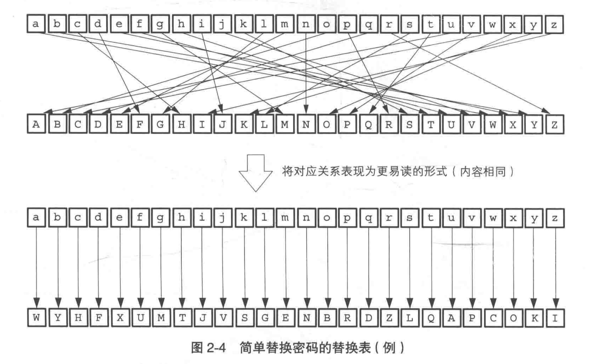

简单替换加密

密码系统中使用的密钥不能是认为选定的，而应该使用无法预测的随机数来生成。

### 第 3 章 对称密码

#### 一次性密码本

一次性密码本（One-time pad, OPT）是古典密码学中的一种加密算法，利用了异或的结合律性质`a ^ b = c, a ^ c = b, b ^ c = a`，将明文与一串随机的比特序列进行异或运算。

在理论上，OPT 具有完善保密性，其安全性已被香农在 1949 年通过数学方法证明。若要保证 OPT 的安全性，需满足以下 4 个条件：

1. 密钥长度不能小于明文的长度
2. 密钥必须是随机的
3. 密钥不能被重复使用
4. 密钥必须被通信双方秘密持有（通过 HTTPS 传输）

OPT 的实现方式主要分为 ：

- HOPT（HMAC-based One-time Password algorithm，基于 HMAC 的一次性密码算法）：基于事件同步，通过某一特定的事件次序及相同的种子值作为输入，通过 HASH 算法运算出一致的密码
- TOPT（Time-based One-Time Password，基于时间的一次性密码算法）：基于时间同步，基于客户端的动态口令和验证服务器的时间比对，一般每 30 秒产生一个新口令，为了避免网络延迟与时钟不同步问题，用户设备与服务器中的时钟必须大致同步（服务器一般会接受客户端时间延迟 30 秒的时间戳生成的一次性密码）。

在生活中，TOPT 被广泛应用，如二次验证的[Google Authenticator](https://github.com/google/google-authenticator)、银行或游戏的动态令牌，其工作原理是：

- 当用户开启 2FA 时，
    1. 服务器随机生成一个类似于『DPI45HKISEXU6HG7』的密钥，并且把这个密钥保存在数据库中；
    2. 同时在页面上显示一个二维码，内容是一个 URI 地址（`otpauth://totp/ 账号？secret = 密钥`），如`otpauth://totp/username@example.com?secret=DPI45HCEBCJK6HG7`；（该过程一定是基于 HTTPS 通信的）
    3. 客户端扫描二维码，把密钥『DPI45HKISEXU6HG7』保存在客户端。
- 当使用 2FA 验证时，
    1. 客户端每 30 秒使用密钥『DPI45HKISEXU6HG7』和时间戳通过一种『算法』生成一个 6 位数字的一次性密码，如『684060』
    2. 用户登陆时输入一次性密码『684060』。
    3. 服务器端使用保存在数据库中的密钥『DPI45HKISEXU6HG7』和时间戳通过同一种『算法』生成一个 6 位数字的一次性密码。如果算法相同、密钥相同，又是同一个时间（时间戳相同），那么客户端和服务器计算出的一次性密码是一样的。服务器验证时如果一样，就登录成功了。

#### DES 与 3DES

DES 已经被破解，不再安全。3DES 就是为了 DES 的强度，将 DES 重复 3 次所得到的加密算法。

由于 3DES 中加入了解密操作，因此具有兼容 DES 的特性（当 3DES 中所有的秘钥都相同时，就是普通的 DES，因为前两步的加密解密就是明文了）。

尽管 3DES 目前仍被银行等机构使用，但其处理速度不高，除了特别重视向下兼容性外，很少被用于新的用途。

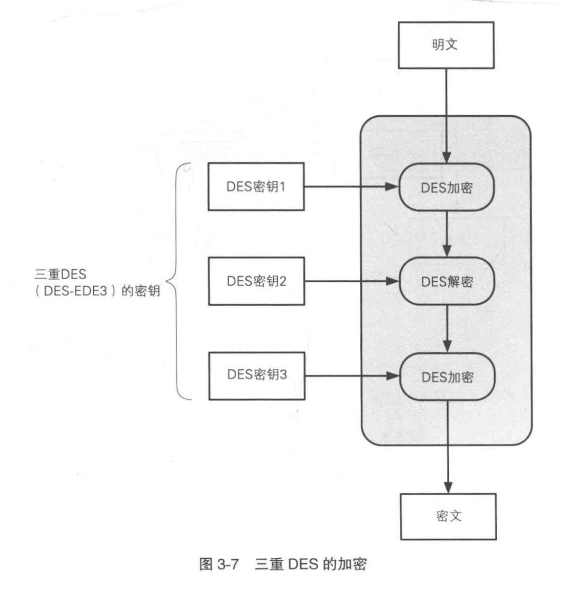

#### AES

AES 是为了取代 DES 而设计的。

AES 在 1999 年经过 NIST（National Institute of Standards and Technology
，美国国家标准技术研究所） 在全世界的选拔，最终有以下 5 种算法进入候选名单，最终 Rijndael 被选定为 AES 标准

- Rijndael（比利时密码学家 Joan Daemen 和 Vincent Rijmen）
- MARS（IBM 公司）
- RC6（RSA 公司）
- Serpent（Anderson, Biham, Knudsen）
- Twofish（Counterpane 公司）

### 第 4 章 分组密码的模式

DES 和 AES 都属于分组密码，他们只能加密固定长度的明文，如果需要加密任意长度的明文，就需要对分组密码进行迭代，而分组密码的迭代方法就称为分组密码的“模式”。

密码算法可以分为分组密码和流密码两种 。
分组密码 (block cipher) 是每次只能处理特定长度的一块数据 的一类密码算法，这里的 “一块”就称为分组 (block)。 此外，一个分组的比特数就称为分组长度 (blocklength)。

模式有很多种类，分组密码的主要模式有以下 5 种：

- ECB 模式：Electronic Code Book mode（电子密码本模式）
- CBC 模式：Cipher Block Chaining mode (密码分组链接模式）
- CFB 模式：Cipher FeedBack mode（密文反馈模式）
- OFB 模式：Output FeedBack mode （输出反馈模式）
- CTR 模式：CounTeR mode（计数器模式）

### 第 5 章 公钥密码

RSA 由其三位开发者，即 Ron Rivest、 Adi Shamir 和 Leonard Adleman 的姓氏的首字母组成的(Rivest-Shamir-Adleman)。

| 密钥对 | 公钥 | 数 E 和数 N       |
| ------ | ---- | ----------------- |
|        | 私钥 | 数 D 和数 N       |
| 加密   |      | $密文=明文^EmodN$ |
| 解密   |      | $明文=密文^DmodN$ |

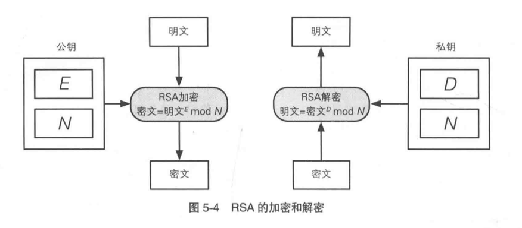

RSA 的加密和解密

根据上述 RSA 的原理，求 E、D、N 三个数就是生成密钥对，其步骤如下：

1. 求 $N$：用伪随机数生成器求 $p$ 和 $q$，$p$ 和 $q$ 都是质数，$N=p×q$求 L
2. 求 $L$：$L=1cm(p-1, q-1)$，$L$ 是 $p-1$ 和 $q-1$ 的最小公倍数
3. 求 $E$：$1 < E < L$，$gcd(E, L) = 1$；$E$ 和 $L$ 的最大公约数为 1（$E$ 和 $L$ 互质）
4. 求 $D$：$1 < E < L$，$E × D mod L = 1$

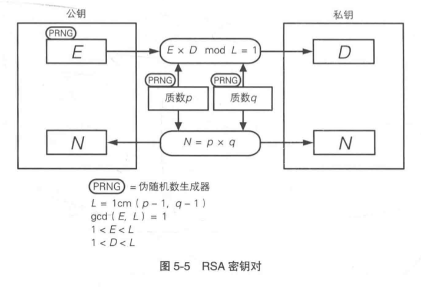

假设公钥$(E, N)=(5, 323)$，私钥$(D,N)=(29,323)$，当加密 123 时，$123^5mod323=225$，解密时，$225^{29}mod323=123$

### 第 6 章 混合密码系统

## 第 2 部分 认证

### 第 7 章 单向散列函数

单向散列函数也称为消息摘要函数、 哈希函数或者杂凑函数。

哈希碰撞是**无法避免**的，因为输入空间是远远大于输出空间的，相当于是将无限的输入映射到有限的输出中，所以无可避免不同的输入被映射到相同的输出中。

散列函数就是通过无限的输入，得到确定长度的输出，这个过程中一定是**有信息丢失**的，否则就是高效的压缩算法了。

散列函数中的盐是用来防御字典攻击的。

#### 散列函数

- MD4、MD5：MD 为 Message Digest 的缩写，目前均已不安全
- SHA（Secure Hash Algorithm） 家族
    - SHA-1：产生 160bits 的散列函数。SHA-1 在 2005 年已被攻破，目前除保持兼容性目的外，不推荐使用。输入数据长度为 $2^{64}-1$ bits
    - SHA-2：目前尚未被攻破，仍被广泛使用。输入数据长度为 $2^{128}-1$ bits
        - SHA-256
        - SHA-512
    - SHA-3：没有输入长度限制
        - Keccak

#### 应用

1. 检测软件是否被篡改
2. 基于口令的加密，如密码加盐哈希后存储
3. 消息认证码，如 API 接口签发的 AppID 和 AppKey
4. 数字签名，将内容哈希后使用私钥签名
5. 伪随机数生成器，如 AppKey 的生成

### 第 8 章 消息认证码

消息认证码（Message Authentication Code，MAC）

#### 消息认证码的应用

1. SWIFT（Society for Worldwide Interbank Financial Telecommunication，环球银行金融 电信协会）
2. IPsec
3. SSL/TLS

#### HMAC

HMAC（Hash-based Message Authentication Code，散列消息认证码）是一种通过特别计算方式之后产生的消息认证码（MAC），使用密码散列函数，同时结合一个加密密钥。它可以用来保证资料的完整性，同时可以用来作某个消息的身份验证。

根据 RFC 2104，HMAC 的数学公式为：

                                 $HMAC(K,m)=H((K'⊕opad) || H((K'⊕ipad) || m))$

其中：

- H 为密码散列函数（如 SHA 家族）
- K 为密钥（secret key）
- m 是要认证的消息
- K' 是从原始密钥 K 导出的另一个秘密密钥（如果 K 短于散列函数的输入块大小，则向右填充（Padding）零；如果比该块大小更长，则对 K 进行散列）
- || 代表串接
- ⊕ 代表异或（XOR）
- opad 是外部填充（0x5c5c5c…5c5c，一段十六进制常量）
- ipad 是内部填充（0x363636…3636，一段十六进制常量）

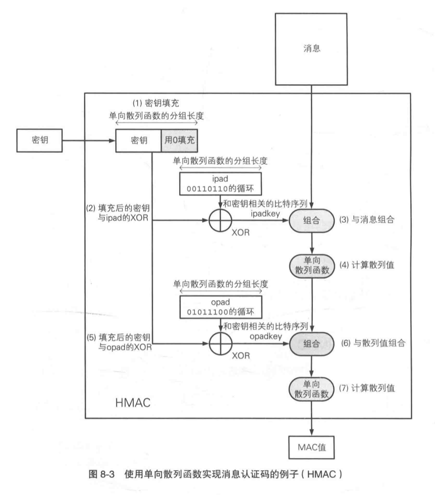

ipad 的 i 是 inner，opad 的 o 是 outer

#### 重放攻击

防御重放攻击的方法：

1. 序号：约定每次都对发送的消息赋予一个递增的编号(序号)，并且在计算 MAC 值时将序号也包 含在消息中 。比如 TCP 协议中**初始的序号是随机值**，以避免攻击
2. 时间戳：约定在发送消息时包含当前的时间。需要注意的是，这要求发送者和接收者的时钟必须一致，而且考虑到通信的延迟，**必须在时间的判断上留下缓冲**，于是多多少少还是会存在可以进行重放攻击的空间。
3. nonce：在通信之前，接收者先向发送者发送一个一次性的随机数 nonce。发送者在消息中包含这个 nonce 并计算 MAC 值。

### 第 9 章 数字签名

数字签名相关内容：[数字签名与 HTTPS](https://www.notion.so/HTTPS-a4b2a6dc75e94aafb00f710f3ed208b0?pvs=21)

#### 原理

数字签名工作原理如右图：

1. 用散列函数对文件进行散列，以防止内容被篡改
2. 使用私钥对散列结果加密，得到签名。由于私钥和散列结果确定，因此签名的结果也是确定的
3. 将**文件、公钥、签名**、所使用的**散列函数**公开
4. 使用者先使用散列函数对文件散列得到散列值，再使用公钥对签名进行解密，得到另一个散列值，两个散列值进行比较，如果值不同，则表明内容被篡改；如果公钥无法解密签名，则公钥或签名不正确

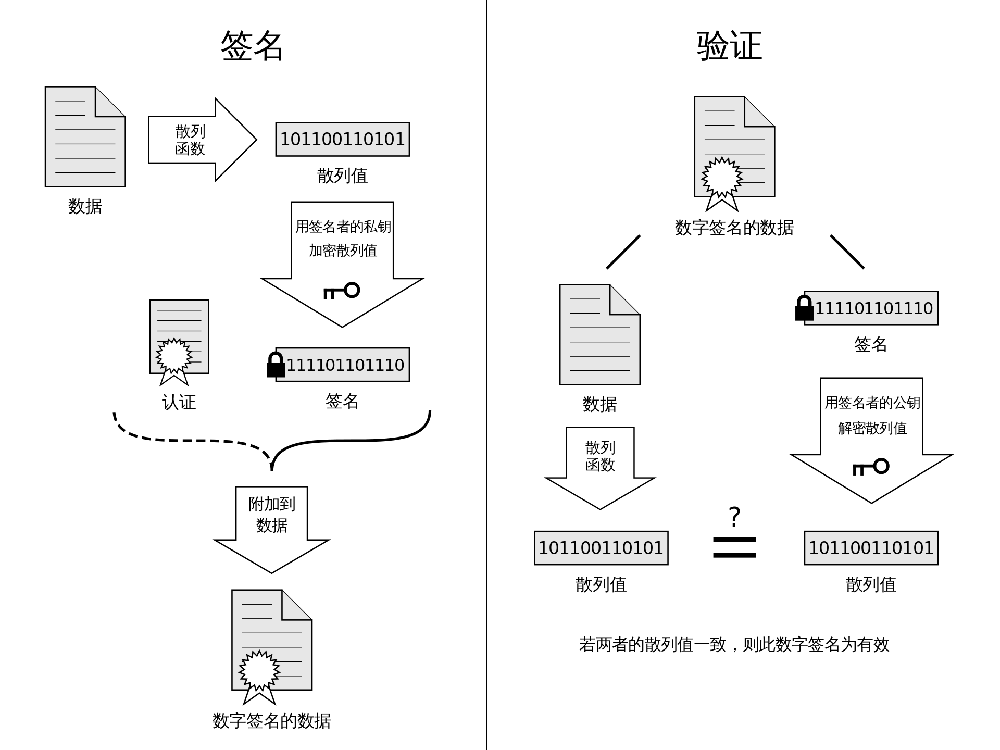

数字签名与验证图解

在数字签名过程中使用散列函数，一方面是利用了散列函数确定输入确定输出的特性，另一方面，也利用了其任意长度的输入有固定长度的简短输出的特性，这可以降低非对称加密的运算时间。

#### 应用

1. 安全信息公告： 防止公告信息被篡改
2. 软件下载：如 Android 中无法安装没有数字签名的 APP
3. 公钥证书
4. SSL/TLS

### 第 10 章 证书

#### 证书的申请与使用流程

CA（Certification Authority、 Certifying Authority，认证机构）

证书标准规范为 [X.509](https://zh.wikipedia.org/wiki/X.509)，其有多种格式，常用的有`.pem`、`.crt`、`.cer`

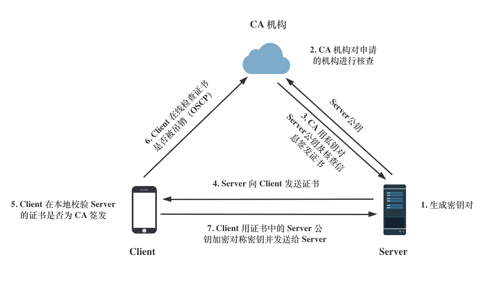

HTTPS 的证书流程图

#### PKI

PKI（Public Key Infrastructure，公钥基础设施）是一个总称，而并非指某一个单独的规范或规格，X.509 也是 PKI 的一种，甚至于在开发 PKI 程序时所使用的由各个公司编写的 API 和规格设计书也可以算是 PKI 的相关规格。

证书及 CA 机构存在的意义在于，通过可信的第三方认证，我们才能辨别对方的真实身份是否遭受篡改。正如我们为何会相信一张红色的人民币是具有一百元的购买能力，这是因为交易者都信任央行，如果没有信任，那只是一张废纸。

## 第 3 部分 密钥、随机数与应用技术

### 第 11 章 密钥

密码学用途的 伪随机数生成器必须是专门针对密码学用途而设计的。

#### Diffie-Hellman 密钥交换

虽然这种方法的名字 叫“ 密钥交换"，但实际上双方并没有真正交换密钥，而是通过计算生 成出了一个相同的共享秘钥 。 因此，这种方法也称为 Diffie-Hellman 密钥协商 ( Diffie-Hellman key agreement )。

有限域的离散对数问题的复杂度正是支撑 Diffie-Hellman 密钥交换算法的基础。

密钥协商步骤：

1. Alice 向 Bob 发送两个质数 P 和 G。P 必须是一个非常大的质数，而 G 则是一个和 P 相关的数。P 和 G 可以由 Alice 或 Bob 中的任意一方生成。
2. Alice 和 Bob 分别各自生成一个随机数 A 和 B，并自己持有
3. Alice 将 $G^AmodP$ 发送给 Bob
4. Bob 将 $G^BmodP$ 发送给 Alice
5. Alice 和 Bob 分别用对方发送的数计算$G^{A×B}modP$，从而双方得到一致的密钥

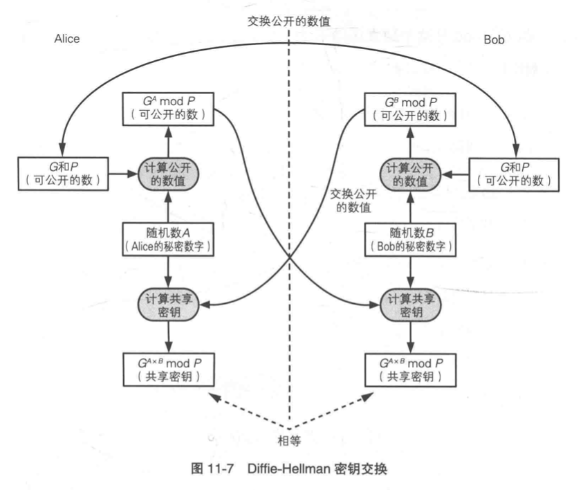

#### 椭圆曲线密码

椭圆曲线密码可以用比 RSA 更短的密钥来实现同等的强度。

在 SSL/TLS 中使用椭圆曲线密码时，如果选择 ECDHE_ECDSA 和 ECDHE_RSA 密钥交换算法，就可以获得前向安全性

妈咪说：[椭圆曲线](https://youtu.be/0_XmvNu0J40?t=180)

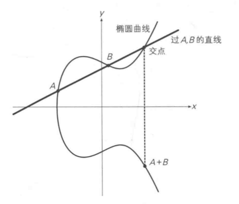

### 第 12 章 随机数

随机数的性质：

- 随机性：不存在统计学偏 差 ，是完全杂乱的数列
- 不可预测性：不能从过去的数列推测出下一个出现的数
- 不可重现性：除非将数列本身保存下来，否则不能重现相同的数列

#### 随机数与伪随机数

**软件只能生成伪随机数列**，这是因 为运行软件的计算机本身仅具备**有限的内部状态**。 而在内部状态相同的条件下，软件必然只能生成相同的数，因此软件所生成的数列在某个时刻一定会出现重复。

要生成具备不可重现性的随机数列，需要从不可重现的**物理现象中获取信息**，比如周围的温度和声音的变化、用户移动的鼠标的位置信息、键盘输入的时间间隔 、 放射线测最仪的输出值等。

#### 线性同余法

因为通过线性同余方法构建的伪随机数生成器的内部状态可以轻易地由其输出演算得知，所以**不可以将线性同余法用于密码技术**。很多伪随机数生成器的库函数都是采用线性同余法编写的 。 例如 C 语言的库函数 `rand`，以及 Java 的 `java.util.Random`类等 ，都采用了线性同余法 。 因此这些函数是不能用于密码技术的。`java.security.SecureRandom`是可用于安全用途的。

#### 单向散列函数

使用单向散列函数(如 SHA-1)可以编写出能够生成具备不可预测性的伪随机数列(即强伪随机数)的伪随机数生成器。

攻击者要预测下一个伪随机数，需要知道计数器的当前值。 这里输出的伪随机数列实际上相当于单向散列函数的散列值 。 也就是说，要想知道计数器的值，就需要破解单向散列函数的单向性，这是非常困难的，因此攻击者无法预测下一个伪随机数 。

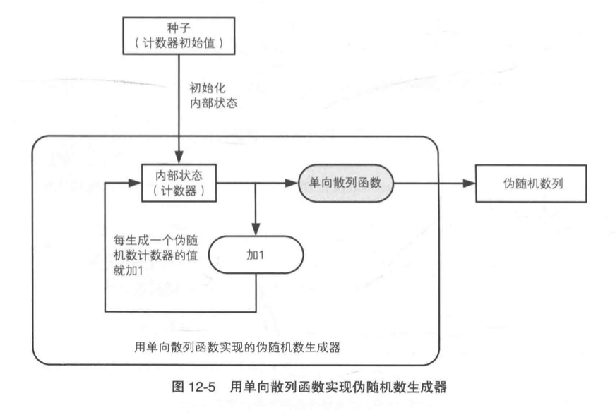

### 第 13 章 PGP

PGP（Pretty Good Privacy，很好的隐私）

GPG（GunPG，GNU Privacy Guard）是一款基于 OpenPGP 标准开发的密码学软件 \支持 加密 、 数字签名 、 密钥管理 、 S/MIME、 SSH 等多种功能 。

#### PGP 的功能

- 对称密码：支持 AES、3DES、Blowfish、Twofish
- 公钥密码：支持 RSA 和 ElGamal
- 数字签名：
    - 支持数字签名的生成和验证，也可以将数字签名附加到文件中，或者从文件中分离出数字签名
    - 支持 RSA、DSA、ECDSA、EdDSA
- 单向散列函数：
    - 可计算与显示消息的散列值
    - 支持 SHA-1、SHA-256、SHA-512、SHA-3。MD5 同样支持，但不推荐使用
- 证书：可生成 OpenGPG 中规定格式的证书，以及 与 X.509 规范兼容的证书。还可以颁发公钥的作废证明 (revocation certificate)，并可以使用 CRL 和 OSCP 对证书进行校验
- 压缩：支持 ZIP、ZLIB 等格式的压缩与解压缩
- 文本数据：将二进制数据和文本数据相互转换。例如，当不得不使用某些无法处理二进制数据的软件（邮件中的图片）进行通信时，可以将二进制数据转换成文本数据 (ASCII radix-64 格式)，这些软件就能够进行处理了
- 大文件的拆分和拼合：在文件过大无法通过邮件发送的情况下， PGP 可以将一个大文件拆分成多个文件，反过来大文件的拆分和拼合也可以将多个文件拼合成一个文件
- 钥匙串管理：PGP 可以管理所生成的密钥对以及从外部获取的公钥

#### GPG 的常用命令

<aside>
💡 From [https://www.youtube.com/watch?v=1vVIpIvboSg](https://www.youtube.com/watch?v=1vVIpIvboSg)

</aside>

```bash
// 列出所有密钥
gpg --list-keys

// 生成密钥
gpg --full-generate-key

// 修改密钥，如过期时间
gpg --edit-key username@example.com

// 修改密钥密码
gpg --passwd username@example.com

// GPG 2.1+ 版本会自动生成撤销证书
```

#### GPG vs OpenSSL

GPG 和 SSL 都可以加解密，二者有什么不同呢？这篇[博客](https://blog.yrpang.com/posts/23547/)给出了清晰的解释：

> GPG 与 SSL 背后对应的是两种不同的信任机制模型：GPG 的背后 PGP 模型是”**信任你信任的人所信任的人**”，而 HTTPS 背后的 PKI 模型则是”**信任权威机构信任的人**”。

GPG 主要应用于电子邮件加密，而 SSL 则主要应用于网络通信。

混合密码系统的特点：**用公钥密码加密会话密钥，用对称密码加密消息**。

#### 使用 GPG 签署 Git 提交

<aside>
💡 《Pro Git》文档：[https://git-scm.com/book/zh/v2/Git-工具-签署工作](https://git-scm.com/book/zh/v2/Git-%E5%B7%A5%E5%85%B7-%E7%AD%BE%E7%BD%B2%E5%B7%A5%E4%BD%9C)

</aside>

<aside>
💡 使用 GPG 签署 Git 提交教程：[https://www.youtube.com/watch?v=4166ExAnxmo](https://www.youtube.com/watch?v=4166ExAnxmo)

</aside>

当需要提交经 GPG 签署的 commit 时，只需要使用以下命令：

```bash
// 参数中增加 -S
$ git commit -a -m -S 'signed commit'
```

在`git merge` 与 `git pull` 可以使用 `--verify-signatures` 选项来检查并拒绝没有携带可信 GPG 签名的提交。

如果长期使用 GPG 签署 Git 提交，可在 `~/.gitconfig` 中进行如下配置，如果某次提交需要跳过 gpg 签名，则可以使用 `git commit —no-gpg-sign -m ""` 和 `git tag —no-sign v1.2.3`

```bash
# This is Git's per-user configuration file.
[user]
	name = username
	email = username@example.com
[commit]
	gpgsign = true
[tag]
	gpgSign = true
```

### 第 14 章 SSL/TLS

SSL/TLS 通信解决的三大问题：

1. 确保消息不会被窃听——对称加密（使用伪随机数生成器可避免对称密码的密钥被预测，同时使用非对称加密传输对称密钥）
2. 确保消息不会被篡改——散列函数
3. 确保通信方是真实的——数字签名

SSL/TLS 的应用：

- HTTPS
- SSH
- SFTP
- SMTP/POP3

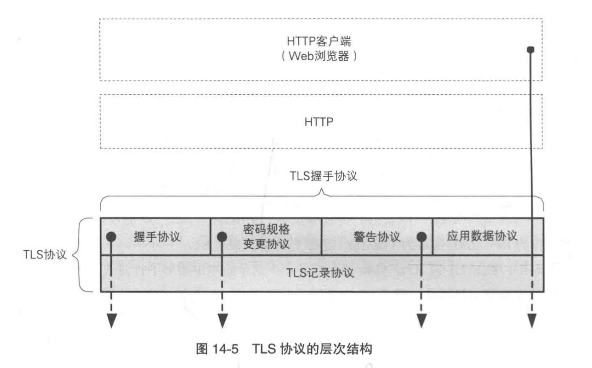

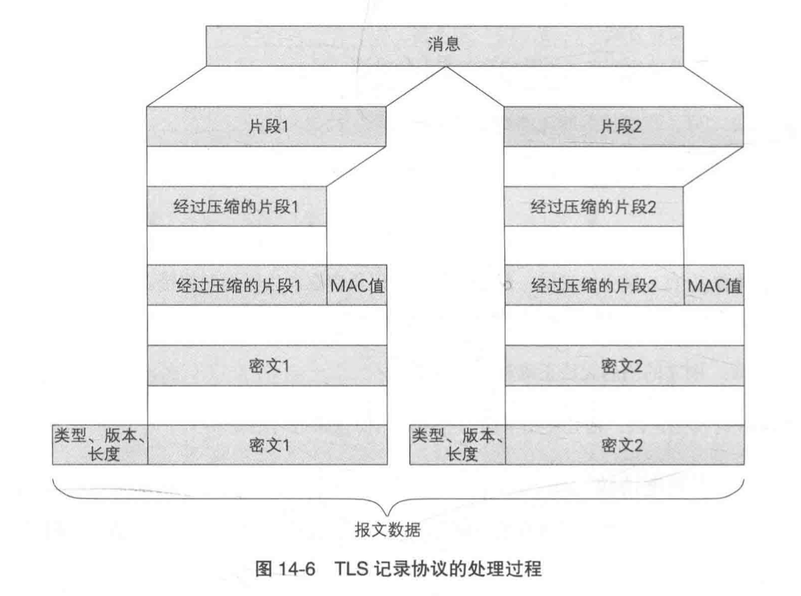

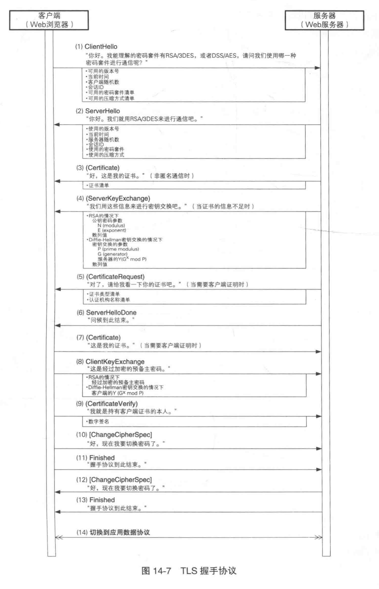

握手协议中的信息是在没有加密的情况下进行的

### 第 15 章 密码技术与现实社会

- 密钥是机密性的精华
- 散列值是完 整性的精华
- 认证符号 (MAC 值和签名)是认证的精华
- 种子是不可预测性的精华

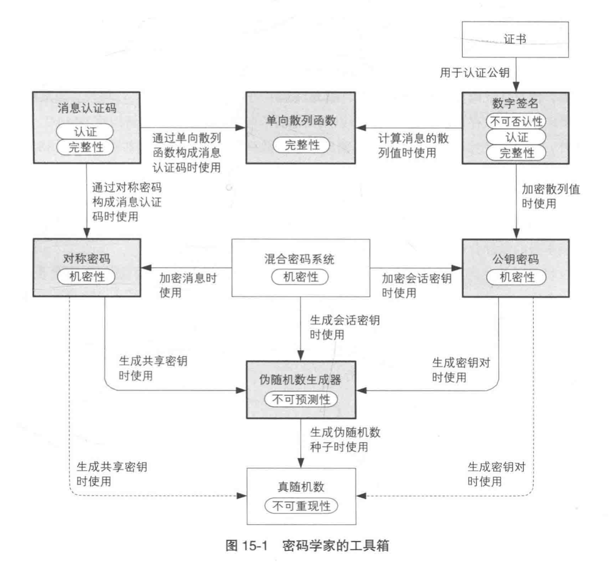
