# 《高性能MySQL》

!!! abstract "阅读信息"

    - **评分**：⭐️⭐️⭐️⭐️⭐️
    - **时间**：01/03/2022 → 01/26/2022
    - **读后感**：MySQL 必读书籍，解决了多年以来的很多困惑，如事务原理、主从同步原理、索引、分库分表等

## 第 1 章 MySQL 架构与历史

<figure align="center" markdown="span">
  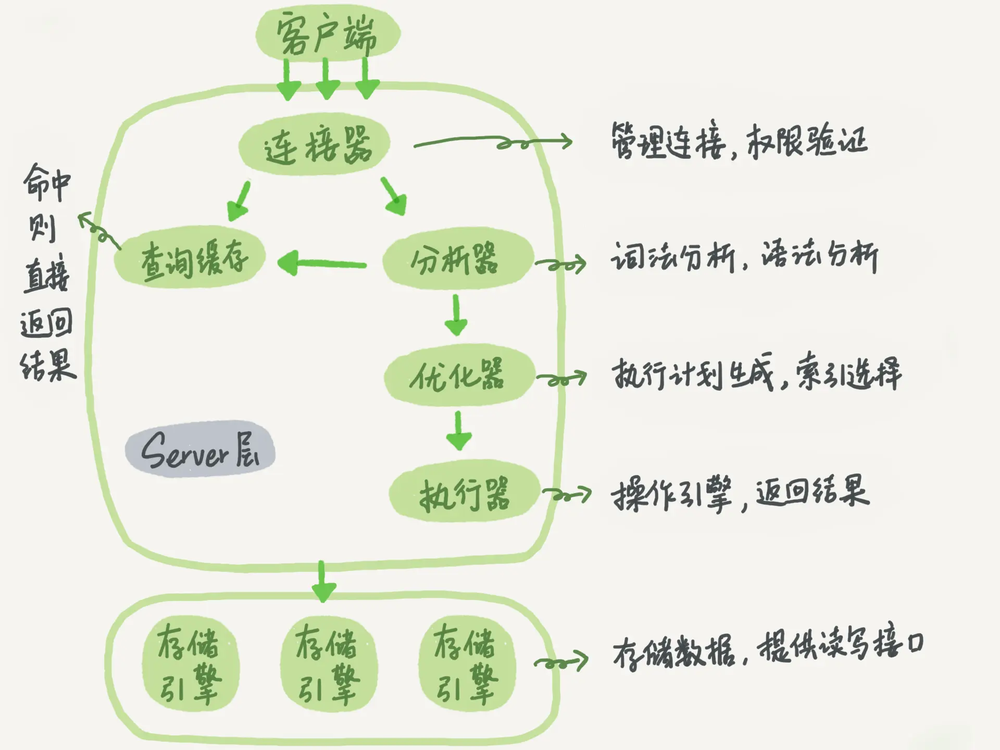{ width=60% }
</figure>

大体来说，MySQL可以分为 **Server 层和存储引擎层**。Server 层包括连接器、查询缓存、分析器、优化器、执行器等，涵盖 MySQL 的大多数核心服务功能，以及所有的内置函数（如日期、时间、数学和加密函数等），所有跨存储引擎的功能都在这一层实现，比如存储过程、触发器、视图等。而存储引擎层负责数据的存储和提取，这些接口屏蔽了不同存储引擎间的差异。其**架构模式是插件式**的，支持 InnoDB、MyISAM、Memory 等多个存储引擎。现在最常用的存储引擎是 InnoDB，它从 MySQL 5.5.5 版本开始成为了默认存储引擎。

对于 SELECT 语句，在解析查询前，服务器会先检查查询缓存。

### 锁

在给定资源内，锁定数据越少，系统的并发程度越高。**加锁也需要消耗资源**。锁的各种操作，包括获得锁，检查锁是否已经解除、释放等都会增加系统的开销。因此锁的策略就是在锁的开销和数据的安全性之间寻求平衡。

| 类型 | 开销 | 并发性 | 场景                                            | 其它                                                                                                  |
| ---- | ---- | ------ | ----------------------------------------------- | ----------------------------------------------------------------------------------------------------- |
| 表锁 | 小   | 低     | ① 修改表结构<br>② 更新数据未命中索引            | ① 写锁比读锁有更高的优先级<br>② 服务层会为诸如 ALTER TABLE 之类的语句使用表锁，而忽略存储引擎的锁机制 |
| 行锁 | 大   | 高     | ① 更新数据命中索引<br>② `select ... for update` | **行锁只在存储引擎层实现**，而 MySQL 服务层没有实现                                                   |

### 事务

ACID 表示：

- 原子性（atomicity）：一个事务必须被视为一个不可分割的最小工作单元，整个事务中的所有操作要么全部提交成功，要么全部失败回滚，对一个事务来说，不可能只执行其中的一部分操作
- 一致性（consistency）：数据库总是从一个一致性的状态转换到另一个一致性的状态
- 隔离性（isolation）：通常来说，一个事务所做的修改在最终提交以前，对其它事务是不可见的
- 持久性（durability）：一旦事务提交，则对其所做的修改就会永久保存到数据库中。此时即使系统崩溃，修改的数据也不会丢失

一个实现了 ACID 的数据库，相比没有实现 ACID 的数据库，通常会需要更强的 CPU 处理能力、更大的内存和更多的磁盘空间。

对于一些不需要事务的查询类应用，选择一个非事务型的存储引擎，可以获得更高的性能。

### 隔离级别

四种隔离级别：

| 隔离级别                                                                                                | 定义                                                             | 备注                                    | 脏读 | 不可重复读 | 幻读 | 加锁读 |
| ------------------------------------------------------------------------------------------------------- | ---------------------------------------------------------------- | --------------------------------------- | ---- | ---------- | ---- | ------ |
| 未提交读（Read Uncommitted）                                                                            | 事务中的修改，即使尚未提交，对其它事务也是可见的                 |                                         | ✓    | ✓          | ✓    | ✗      |
| 提交读（Read Committed）/不可重复读                                                                     | 当前事务中，可以查看到其它已提交事务的修改内容                   | 大多数数据库的默认隔离级别              | ✗    | ✓          | ✓    | ✗      |
| 可重复读(Repeatable Read)                                                                               | ① 在一个事务中，无论读取多少次，值都是一样的。                   |
| ② 当前事务中无法查看其它已提交事务的修改内容，这是通过快照实现的，undo log 中记录了事务变更前的历史数据 | ① MySQL 的默认隔离级别                                           |
| ② InnoDB 和 XtraDB 通过 MVCC 解决了幻读问题                                                             | ✗                                                                | ✗                                       | ✓    | ✗          |
| 可串行化(Serializable)                                                                                  | 在读取的每行数据上都加锁，所以可能导致**大量的超时和锁争用**问题 | ①通过强制事务串行执行，避免了幻读的问题 |
| ② **只有在非常需要确保数据的一致性并且可以接受没有并发的情况下，才考虑采用该级别**                      | ✗                                                                | ✗                                       | ✗    | ✓          |

隔离级别视频讲解： [https://www.bilibili.com/video/BV14L4y1B7mB](https://www.bilibili.com/video/BV14L4y1B7mB?p=7)

脏读：事务读取未提交的数据

幻读：在某个事务进行中，另一个事务操作了相同的数据，导致事务所看到的数据不一致的问题，就像产生了幻觉一样

未提交读有脏读和幻读的问题，提交读解决了脏读的问题，但幻读问题仍存在，可重复度在理论上并未解决幻读的问题，串行化才真正解决了幻读的问题。

<div align="center">
  <table>
    <tr>
      <td align="center"  style="vertical-align: bottom;">
        <br />
        <sub class="img-caption">脏读示例</sub><br />
      </td>
      <td align="center" style="vertical-align: bottom;">
        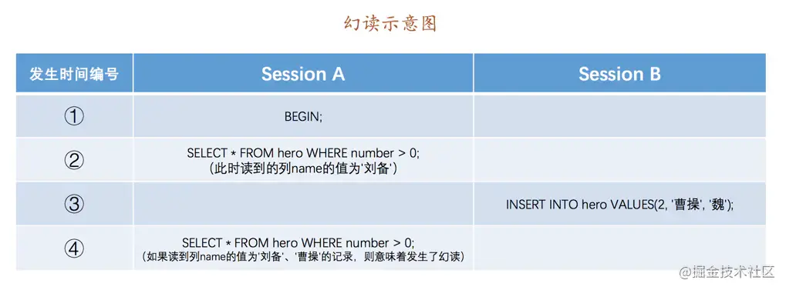<br />
        <sub class="img-caption">不可重复读示例</sub>
      </td>
    </tr>
	<tr>
      <td align="center"  style="vertical-align: bottom;">
        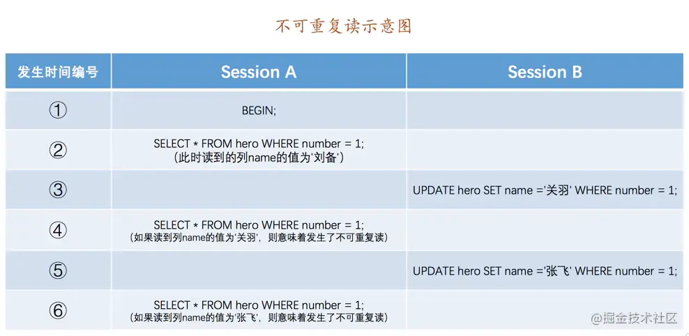<br />
        <sub class="img-caption">幻读示例</sub><br />
      </td>
      <td align="center" style="vertical-align: bottom;">
        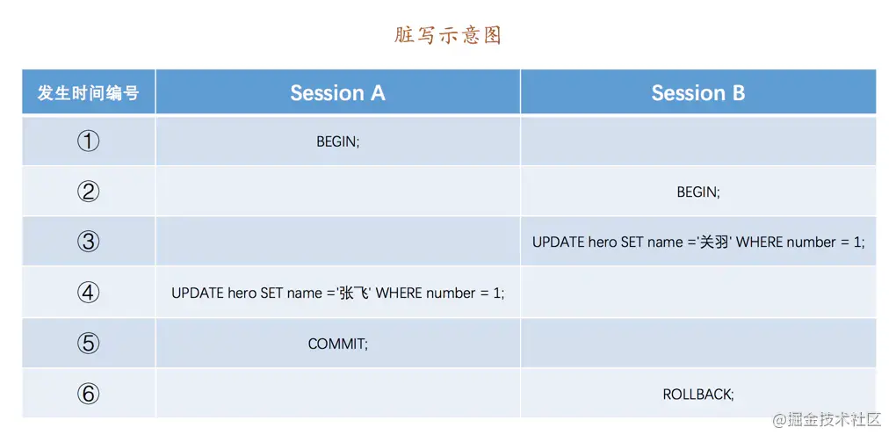<br />
        <sub class="img-caption">SessionB 的 ROLLBACK 操作使得 SessionA 的写入被撤销</sub>
      </td>
    </tr>
  </table>
</div>

### 多版本并发控制

可以认为 MVCC 是行级锁的一个变种，但它在**很多情况下避免了加锁操作**，因此开销更低。

MVCC 是通过保存数据在某个时间点的**快照**来实现的。

**每开始一个新的事务，系统版本号就会自动递增**。事务开始时刻的系统版本号会作为事务的版本号，用来和查询到的每行记录的版本号进行比较。

在 `InnoDB` 中，**每行记录实际上都包含了两个隐藏字段**：事务 id (`trx_id`) 和回滚指针 (`roll_pointer`)。假设`hero` 表中只有一行记录，当时插入的事务 id 为 80，然后两个事务 `id` 分别为 `100`、`200` 的事务对这条记录进行 `UPDATE` 操作。在**每次执行事务前，都会用 undo log 记录**，并用 `roll_pointer` 指向 `undo` 日志地址，版本链的头节点就是当前记录最新的值。**在事务执行中，通过遍历版本链中的每条记录，判断该记录是否对当前事务可见，从而实现事务的可见性和隔离级别**。 当事务执行失败时，就可以根据版本链恢复到任意历史记录。

<div align="center">
  <table>
    <tr>
      <td align="center"  style="vertical-align: bottom;">
        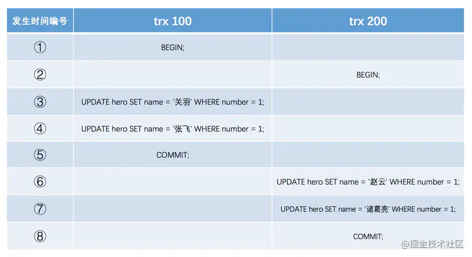<br />
        <sub class="img-caption">版本链结构</sub><br />
      </td>
      <td align="center" style="vertical-align: bottom;">
        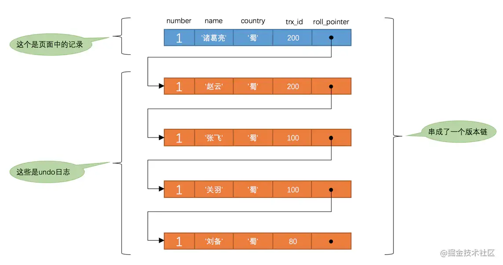<br />
        <sub class="img-caption">ReadView 隔离级别判断过程</sub>
      </td>
    </tr>
  </table>
</div>

**MVCC 只在可重复读和读提交两个隔离级别下工作**。

InnoDB正是由于其 MVCC 架构，导致其无法维护数据表的精确行数

在 InnoDB 的 MVCC 架构下，通过索引直接指向对象的所有版本，然后再根据可见性筛选当前事务的可见数据。

### 死锁

死锁是指两个或多个事务在同一资源上相互占用，并请求锁定对方占用的资源，从而导致恶性循环的现象。

```sql
# 死锁示例，事务 1 和事务 2 执行第一条 SQL 后相互占用对方的锁
事务 1
	START TRANSACTION;
	UPDATE StockPrice SET high = 45.50 WHERE stock_id = 4 and date = '2002-05-01';
	UPDATE StockPrice SET high = 19.80 WHERE stock_id = 3 and date = '2002-05-02';
	COMMIT;

事务 2
	START TRANSACTION;
	UPDATE StockPrice SET high = 20.12 WHERE stock_id = 3 and date = '2002-05-02';
	UPDATE StockPrice SET high = 47.20 WHERE stock_id = 4 and date = '2002-05-01';
	COMMIT;
```

死锁发生后，只有部分或完全回滚其中一个事务，才能打破死锁。**InnoDB 目前处理死锁的方法是将持有最少行级排它锁的事务进行回滚。**

死锁产生有双重原因：有些是因为真正的数据冲突，这种情况通常很难避免，但有些则完全是由于存储引擎的实现方式导致的（以同样的顺序执行语句，有些存储引擎会产生死锁，有些则不会）。

#### 事务日志

事务日志采用的是追加方式，因此写日志的操作是磁盘上一小块区域内的顺序 I/O。修改数据需要写两次磁盘。

性能提升的方式：

- **随机读写改顺序读写**
- **缓冲单条读写改批量读写**
- **单线程读写改并发读写**

WAL（Write Ahead Logging，预写日志）将随机的数据变为顺序的日志刷盘，并通过 buffer 批量写入数据，在同步时采用并发的方式。**MySQL 中的 redo log 即为 WAL 工作模式**。

MySQL 默认开启事务自动提交模式，即除非显式的开启事务（`BEGIN` 或 `START TRANSACTION`），否则每条 SOL 语句都会被当做一个单独的事务自动执行。使用 `BEGIN` 或 `START TRANSACTION` 开启一个事务之后，自动提交将保持禁用状态，直到使用 `COMMIT` 或 `ROLLBACK` 结束事务。

InnoDB 也支持特定语句的显示锁定，但不属于 SQL 规范，应该尽量避免使用，如：

```sql
SELECT ... LOCK IN SHARE MODE // 共享锁，行读锁
SELECT ... FOR UPDATE         // 排他锁，行写锁，对查询结果的每条数据添加排它锁
```

### InnoDB

MyISAM 和其它存储引擎中，行数是精确的，InnoDB 则是估算值

MyISAM 不支持事务和行级锁，并在**崩溃后无法安全恢复**

由于 InnoDB 的性能和自动崩溃恢复特性，使得它在非事务型存储的需求中也很流行。除非有非常特别的原因需要使用其他的存储引擎，否则应该优先考虑 InnoDB

InnoDB 的数据存储在表空间中

InnoDB 采用 MVCC 来支持高并发，并实现了四个标准的隔离级别。默认级别是可重复读，并**通过间隙锁策略防止幻读的出现**。间隙锁使得 InnoDB 不仅锁定查询涉及的行，还会对索引中的间隙进行锁定，以防止幻影行的插入。

InnoDB 是基于**聚簇索引**建立的，聚簇索引对主键查询有很高的性能，不过其**二级索引（非主键索引）中必须包含主键列**，因此主键列很大时，其它的所有索引都会很大。

Oracle 一开始收购了 InnoDB，之后又收购了 MySQL，并在 MySQL 5.5 中将默认存储引擎设置为 InnoDB。

在MyISAM引擎里面,自增值是被写在数据文件上的。而在InnoDB中,自增值是被记录在内存的。MySQL直到8.0版本，才给InnoDB表的自增值加上了持久化的能力，确保重启前后一个表的自增值不变。

自增主键不连续的原因：

1. 唯一索引冲突导致数据插入失败，但自增 ID 继续自增
2. 事务回滚

## 第 4 章 Schema 与数据类型优化

字段值选取的原则：

- 尽可能小的够用的类型
- 尽可能使用 MySQL 内置的数据类型，如 date、time、datetime 等存储时间，而不是 varchar；使用 int 存储 IP 而不是字符串
- **尽可能避免 null 列**。如果查询中包含可为 null 的列，对 MySQL 来说更难优化，因为 null 列使得索引、索引统计和值比较都更复杂。同时 null 列会占用更多的存储空间，在 MySQL 中也需要特殊处理。当 null 列被索引时，每个索引记录需要一个额外的字节。

TIMESTAMP 只使用 DATETIME 一半的存储空间，并会根据时区变化，具有特殊的自动更新能力。但 TIMESTAMP 允许的时间范围要小得多。

对存储计算来说,，INT(1) 和 INT(20) 是相同的。

`DECIMAL` 类型用于存储精确的小数。

浮点类型在存储相同范围的值时，通常比 `DECIMAL` 使用更少的空间。应该尽量只在小数进行精确计算时才使用 DECIMAL，将需要存储的货币根据小数的位数乘以相应的倍数。

对常见的ALTER TABLE 场景，能使用的技巧只有两种：

- 先在一台不提供服务的机器上执行 ALTER TABLE操作，然后和提供服务的主库进行切换；
- 影子拷贝：用要求的表结构创建一张和源表无关的新表，然后通过重命名和删表操作交换两张表

## 第 5 章 创建高性能的索引

在MySQL中，索引是在存储引擎层而不是服务层实现的。

### 索引类型

#### B-Tree 索引

索引除了查找外，还可以用于排序。

有效的索引：

- 最左前缀原则：一直向右匹配，直至范围查询（`>`、`<`、`between`、`like`）停止匹配，`in (a,b,c,d)` 是可以命中索引的
- `=` 与 `in` 字段可以乱序，查询优化器会优化索引，不影响索引效率
- 建立在 `JOIN`、`WHERE`、`ORDER BY` 字段上，并在区分度大的字段建立索引
- 使用覆盖索引，减少回表
- 当创建联合索引时，应当优先**把选择性高的列放在前边**，选择性可以通过 `select count(uid)/count(*) as selectivity, count(*) from users;` 判断
- 当不需要考虑排序和分组时，将选择性最高的列放在前面通常是很好的选择。此时索引的作用只是用于优化 WHERE 条件的查找，否则避免随机 I/O 和排序更重要

索引失效：

- 组合索引中存在 `null` 值的列
- 字符串不加引号
- 使用不等式条件 `!=`
- `or` 条件，可使用 `in` 替代
- `like` 以 `%` 开头
- `join` 字段类型不同，造成隐式转换
- 索引列使用函数或计算

#### 哈希索引

在 MySQL 中，只有 Memory 引擎显式支持哈希索引，这也是 Memory 引擎表的默认索引类型。

哈希索引的缺点：

- 索引只包含哈希值和行指针，而不存储字段值
- 索引数据并不是按照索引值顺序存储的，也就无法用于排序
- 索引不支持部分索引列匹配查找，因为哈希索引时钟是使用索引列的全部内容来计算哈希值的。如在（A, B）上简历哈希索引，如果查询只有 A 列，则无法命中该索引
- 索引只支持等值比较查询，包括`=`、`IN`、`<=>`，不支持任何范围查询
- 当出现哈希冲突时，存储引擎必须遍历链表中的所有行指针

#### 空间索引（R-Tree）

MyISAM 和 PostgreSQL 都支持空间索引，可用于地理数据存储

#### 全文索引

查找的是文本中的关键词，而不是直接比较索引中的值

### 索引的作用

索引根据数据量不同而发挥不同的作用：

- 小表：大部分情况下全表扫描更高效
- 中到大型表：索引非常有效
- 特大型表：通过分库分表，和元数据信息表（记录哪个用户的信息存储在哪个表中）

### 聚簇索引

<aside>
💡 聚簇索引：将索引与数据放在一起，找到索引也就找到了数据

</aside>

<aside>
💡 非聚簇索引：将索引与数据分开存放，索引指向数据的物理地址

</aside>

聚簇索引的数据行存放在索引的 leaf page 中，“聚簇”表示数据行和相邻的键值紧凑地存储在一起。

因为无法同时把数据行存放在两个不同的地方，所以**一个表只能有一个聚簇索引**（覆盖索引可以模拟多个聚簇索引）。**InnoDB 通过主键聚集数据，如果没有定义主键，InnoDB会选择一个唯一的非空索引代替。如果没有这样的索引，则会隐式定义一个主键来作为聚簇索引**。

InnoDB只聚集在同一个页面中的记录。包含相邻键值的页面可能会相距甚远。

聚簇索引的优点：

- 可以把相关数据保存在一起
- 数据访问更快。由于索引和数据保存在同一个 B-Tree 中，索引被加载到内存的同时数据也被加载到内存，相比非聚簇索引，减少了一次数据 I/O
- 使用覆盖索引扫描的查询可以直接使用页节点中的主键值

聚簇索引的缺点：

- 聚簇数据最大限度地提高了 I/O 密集型应用的性能，但如果数据全部存放在内存中，则访问数据的顺序就没那么重要了，聚簇索引也就没有什么优势了
- 插入速度严重依赖于插入顺序。**按照主键的顺序插入是加载数据到InnoDB表中最快的方式**。如果不是按主键顺序加载数据，则在加载完成后最好使用 `OPTIMIZE TABLE` 命令重新组织一下表
- **更新聚簇索引列的代价很高**，因为会强制InnoDB将每个被更新的行移动到新的位置
- 基于聚簇索引的表在插入新行或主键被更新导致需要移动行时，可能面临**页分裂**（page split）的问题
- 聚簇索引可能导致全表扫描变慢，尤其是**行比较稀疏**，或由于**页分裂导致数据存储不连续**时
- 二级索引（非聚簇索引）可能比想象的更大，因为在二级索引中的叶节点包含了主键列
- 二级索引访问需要两次索引查找，而不是一次。**对于InnoDB，自适应哈希索引**（由存储引擎自动完成；只保存热数据在内存中；利用哈希$O(1)$的复杂度，快速定位到叶节点，尤其在 B+ 树较深的时候）**能够减少两次查找的重复工作**

**二级索引叶节点保存的不是指向行的物理位置的指针，而是主键值**。这样的策略**减少了当出现行移动或数据页分裂时二级索引的维护工作**。

<div align="center">
  <table>
    <tr>
	  <td align="center"  style="vertical-align: bottom;">
        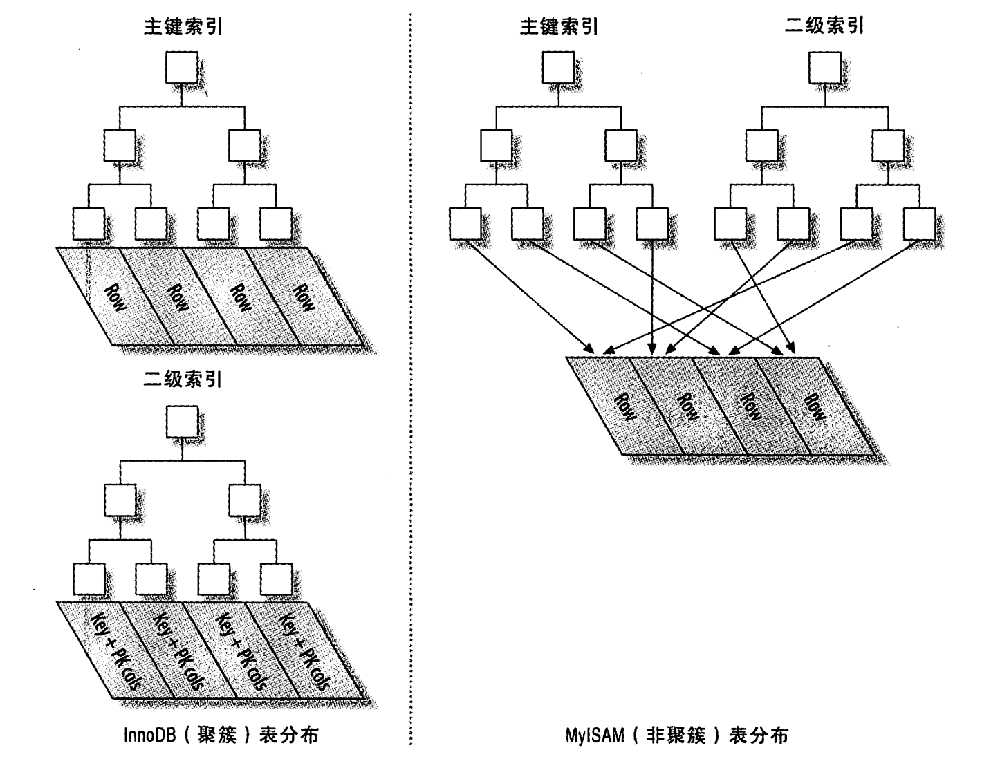<br />
        <sub class="img-caption">聚簇索引与非聚簇索引对比图</sub><br />
      </td>
      <td align="center"  style="vertical-align: bottom;">
        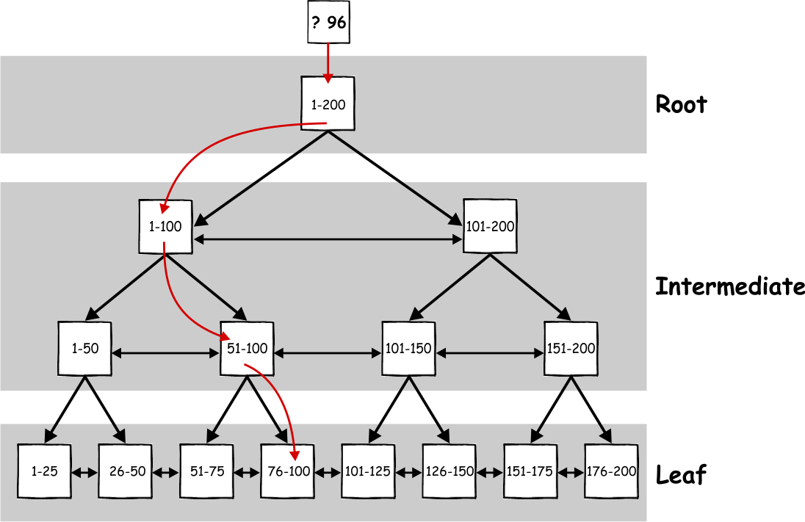<br />
        <sub class="img-caption">聚簇索引结构与搜索过程示例</sub><br />
      </td>
    </tr>
  </table>
</div>

InnoDB 三大关键特征：

- 插入缓冲（Insert Buffer）：将随机读写改为顺序读写
- 二次写 (Double Write)：Redo Log & Undo Log
- 自适应 Hash（Adaptive Hash index）：利用哈希$O(1)$的复杂度，快速定位到叶节点，尤其在 B+ 树较深的时候

最好避免随机的（不连续且值的分布范围非常大）聚簇索引，特别是对于 I/O 密集型的应用。例如，从性能的角度考虑，使用 UUID 来作为聚簇索引则会很糟糕：它使得聚簇索引的插入变得完全随机。

非顺序主键的缺点：

- 写入的目标页可能已经刷到磁盘上并从缓存中移除，或者是还没有被加载到缓存中，InnoDB 在插入之前不得不先找到并从磁盘读取目标页到内存中。这将导致大量的随机 I/O
- 因为写入是乱序的，InnoDB 不得不频繁地做页分裂操作，以便为新的行分配空间。页分裂会导致移动大量数据，一次插入最少需要修改三个页而不是一个页
- 由于频繁的页分裂，页会变得稀疏并被不规则地填充，所以最终数据会有碎片

顺序主键在高并发负载下，主键的上界可能成为“热点”，因为所有的插入都发生在这里，所以并发插入可能导致间隙锁竞争。

#### 覆盖索引

覆盖索引：索引中包含了所需查询字段的值

不是所有类型的索引都可以成为覆盖索引。覆盖索引必须要存储索引列的值，而哈希索引、空间索引和全文索引等都不存储索引列的值，所以 MySQL 只能使用 B-Tree 索引做覆盖索引

MyISAM 使用前缀压缩（如第一个值是“perform”，第二个值是“performance”，则第二个值的前缀压缩存储类似于“7,ance”这样的形式）来减少索引的大小，从而让更多的索引可以放入内存中，这在某些情况下可能极大地提高性能。

压缩索引使用更少的空间，代价则是某些操作更慢，如倒序扫描。

表中索引越多，则写入速度越慢。

尽可能只锁定需要操作的行，这不仅能减少锁的开销，同时锁定过多不需要的行会增加锁争用并减少并发性。

**InnoDB 在二级索引上使用共享（读）锁，但访问主键索引需要排它（写）锁**。这消除了使用覆盖索引的可能性，并且使得 `SELECT FOR UPDATE` 比 `LOCK IN SHARE MODE` 或非锁定查询要慢很多。

**只有当索引的列顺序和 ORDER BY 子句的顺序完全一致，并且所有列的排序方向都一样时，MySQL 才能够使用索引来对结果做排序。如果查询需要关联多张表，则只有当 ORDER BY 子句引用的字段全部为第一个表时，才能使用索引做排序**。

`ORDER BY` 子句同样需要满足索引的最左前缀原则，但有一种情况例外，就是前导列为常量。如

```sql
-- UNIQUE KEY retal_date (retal_date, inventory_id, customer_id)
EXPLAIN SELECT retal_id, staff_id FROM sakila.rental
WHERE retal_date = '2005-05-25'
ORDER BY inventory_id, customer_id
```

**尽可能将需要做范围查询的列放到索引的后面**，以便优化器能尽可能多的使用索引列。

尽可能避免多个范围的条件查找，可通过将其中一部分的范围查找转换为 `IN` 的等值查找。

当使用`LIMIT 100000, 10` 的查找时，无论如何创建索引，都无法降低因偏移量的增加而导致的 MySQL 花费大量时间扫描丢弃的数据，一个较好的办法是限制用户能够翻页的数量，这对用户体验影响不大，因为用户很少真正在乎第 10000 页的的搜索结果。另一个方式是在连续 ID 的前提下与 LIMIT 条件进行映射，利用索引减少扫描行数。

## 第 6 章 查询性能优化

慢查询的原因：

- 查询了不需要的数据，如多余的行、返回了不需要的列等
- 重复查询相同的数据，如评论区需要展示用户头像，用户多次评论时就需要反复查询，更好的方式是将此类数据缓存
- 扫描的行数与返回的行数是否接近
- `EXPLAIN` 中的访问类型 `type` 是否最优
- `EXPLAIN` 中的 `Extra` 是否使用了覆盖索引（`Extra` 中出现了 `Using index`），覆盖索引在 MySQL 服务器层完成。

explain 字段解释：[https://dev.mysql.com/doc/refman/8.0/en/explain-output.html](https://dev.mysql.com/doc/refman/8.0/en/explain-output.html)

对 MySQL 的查询缓存来说，如果表发生了变化，则缓存内容会被刷新，因此不会返回过期数据。查询缓存的煎茶是通过一个对大小写敏感的哈希查找实现的，及时有一个字节不同，也不会命中缓存结果。MySQL 8.0 已移除查询缓存功能。

优化慢查询的方式：

- 一个复杂查询与多个简单查询的平衡
- 将大查询切分查询，降低锁的争用。比如定期清除大量数据时，如果用一个大的语句一次性完成的话，则可能需要一次锁住很多数据、占满整个事务日志、耗尽系统资源、阻塞很多小的但重要的查询。讲一个大的 DELETE 语句切分成多个较小的查询可以尽可能地小地影响 MySQL 性能，同时还可以减少 MySQL 复制的延迟。
- 分解关联查询。在使用 IN 的关联查询中，IN 中的值越多，则扫描的行业越多，此时可以使用单条语句代替关联语句中的 IN

#### MySQL 的客户端与服务端的通信协议

MySQL 客户端与服务器间采用**半双工**的通信方式，这意味着在任何时刻，要么由服务器向客户端发送数据，要么是由客户端向服务器发送数据。这种方式让 MySQL 的通信简单快速，但也意味着**无法进行流量控制**：一但一端开始发送消息，另一端要接收完整的消息才能响应它。

对于一个MySQL 连接（或者说一个线程），任何时刻都有一个状态，该状态表示了 MySQL 当前正在做什么，有多种方式能查看当前的状态，最简单的是使用`SHOW FULL PROCESSLIST`，以下是状态说明：

| 状态                           | 说明                                                                                                                                                 |
| ------------------------------ | ---------------------------------------------------------------------------------------------------------------------------------------------------- |
| Sleep                          | 等待客户端新的请求                                                                                                                                   |
| Query                          | 正在执行查询或将结果发送给客户端                                                                                                                     |
| Locked                         | 正在等待表锁，由存储引擎实现的锁（如 InnoDB 的行锁）不会体现在这里                                                                                   |
| Analyzing and statistics       | 正在收集存储引擎的统计信息，并生成查询的执行计划                                                                                                     |
| Copying to tmp table [on disk] | 正在执行查询，并将结果集复制到临时表中，这种状态通常在做 GROUP BY、ORDER BY、UNION 操作。如果有"on disk"标记，则表示MySQL 正在将内存临时表放到磁盘上 |
| Sorting result                 | 正在对结果集排序                                                                                                                                     |
| Sending data                   | 表示多种情况：<br>① 在多个状态间传送数据<br>② 正在生成结果集<br>③ 在向客户端返回数据                                                                 |

#### MySQL 优化器

MySQL 的查询优化器是**基于成本实现**的，它将预测一个查询使用某种执行计划时的成本，并选择其中成本最小的一个。可通过`SHOW STATUS LIKE 'Last_query_cost';`来得知当前的查询成本，结果中的 value 优化器认为大概需要的数据页才能完成上边的查找

优化器可以处理的优化类型：

- 重新定义关联表的顺序
- 将外连接转换为内连接
- 使用等价变换规则。如`(1=1 AND a>5)`将被改写为 `a>5`
- 优化 `COUNT()`、`MAX()`、`MIN()`。查找最小和最大值时，只需查询对应 B-Tree 索引最左或最右的记录即可
- 预估并转化为常数表达式
- 覆盖索引扫描
- 子查询优化
- 提前终止查询。如使用`LIMIT`关键字。在联表查询时，`USING` 关键字能够替代 `ON` 关键字，并在查询结果中只显示一列 `ON` 字段
- 列表 `IN()` 的比较。**MySQL 会将`IN()`列表中的数据先进行排序，然后通过二分查找的方式来确定列表中的值是否满足条件**。

#### 排序

**当不能使用索引生成排序结果时，MySQL 需要自己进行排序，如果数据量小则在内存中进行，否则需要使用磁盘**。MySQL 将此过程统称为文件排序（filesort）。

如果需要排序的数据量小于“排序缓冲区”，MySQL 使用内存进行**快速排序**操作。如果内存不够，则会先将数据分块，对每个独立的块使用“快排”进行排序，并将各个块的排序结果存放在硬盘上，再将各个排好序的块进行合并，最后返回排序结果。

MySQL 在文件排序时需要使用的临时存储空间可能比想象的要大很多。因为 MySQL 在排序时，对每个排序记录都会分配一个足够长的定长空间来存放。这个定长空间必须足够长以容纳其中最长的字符串。

在关联查询时如果需要排序，MySQL 会分两种情况来处理。如果 ORDER BY 子句中的所有列都来自关联的第一个表，则 MySQL 在关联处理第一个表的时候就进行文件排序，EXPLAIN 中的 eXTRA 字段会有“Using filesort”。除此之外的情况，MySQL 都会先将关联结果存放到临时表中，然后再所有的关联结束后再进行文件排序，此时 Extra 中有`“Using temporary; Using filesort”`

MySQL 将结果集返回客户端是一个增量、逐步返回的过程，以避免服务端消耗过多的内存，并提升客户端的处理速度。

`FOR UPDATE` 和 `LOCK IN SHARE MODE` 主要控制 SELECT 语句的锁机制，但只对实现了行级锁的存储引擎有效。这两个提示会让某些优化无法正常使用，例如覆盖索引扫描。InnoDB 不能在不访问主键的情况下排他地锁定行，因为**行的版本信息保存在主键中**。

`FORCE INDEX` 和 `USE INDEX` 基本相同，除了一点：FORCE INDEX 会告诉优化器全表扫描的成本会远高于索引扫描，哪怕实际上该索引用处不大。

#### 优化特定类型的查询

COUNT 在统计列值时要求非空，即不统计 `NULL` 值。

当使用了 `COUNT(*)` 时，`*`并不会扩展为所有列，而会忽略所有列直接统计所有行数。如果希望统计行数，最好直接使用`COUNT(*)`，而不是指定列，这样意义清晰且性能更好。

在关联查询时，确保 `ON` 或 `USING` 子句中的列上有索引，除非有其它理由，否则**只需在关联顺序中的第二个表的相应列上创建索引**。

确保任何的 `GROUP BY` 和 `ORDER BY` 中的表达式只涉及到一个表中的列，这样 MySQL 才有可能使用索引来优化这个过程。

MySQL 在查询`LIMIT 10000, 20` 这样的查询时，需要查询 10020条记录然后只返回最后 20 条，前面的 10000 条将被丢弃，这样的代价非常高。可以通过将 `LIMIT` 查询转换为已知位置的查询，如主键 ID，或者记录上次读取数据的位置。

**很多时候，计算精确值的成本非常高，而计算近似值则非常简单，Google 的搜索结果总数也是近似值。**

## 第 7 章 外键约束、字符集和分布式事务

在数据量超大的时候，B-Tree索引就无法起作用了。

InnoDB 是目前 MySQL 中唯一支持外键的内置存储引擎。

使用外键时，通常要求每次在修改数据时都要在另一张表中多执行一次查找操作。当向子表中写入一条记录时，外键会对副表相应的记录加锁，以确保该记录不会在事务完成前被删除。这导致额外的锁等待，甚至会导致死锁，因为没有直接访问这些表，所以此类问题往往难以排查。

**如果只是使用外键做约束，通常在应用程序中实现会更好。**

## 第 8 章 MySQL 配置

在类 Unix 系统中，配置文件的位置一般在`/etc/my.cnf` 或`/etc/mysql/my.cnf`，如果无法确定配置文件路径，可以尝试以下操作：

```bash
$ which mysqld
/usr/local/bin/mysqld
$/usr/local/bin/mysqld --verbose --help | grep -A 1 'Default options'
Default options are read from the following files in the given order:
/etc/my.cnf /etc/mysql/my.cnf /usr/local/etc/my.cnf ~/.my.cnf
```

**MySQL 是单进程多线程的运行模式**

## 第 9 章 操作系统和硬件优化

如果没有足够的内存，MySQL 可能必须刷出缓存来腾出空间给需要的数据，然后再读回将刚刚刷新的数据。这本来是内存不足的问题，却出现了 I/O 容量不足。

32 位操作系统意味着不能使用大量的内存，任何一个单独的进程都不能寻址 4GB 以上的内存。

提升 I/O 的方式：

- 将随机 I/O 转换为顺序 I/O，因为**顺序 I/O 比随机 I/O 要快**
- 将随机 I/O 内容缓存，因为**随机 I/O 从缓存中受益最多**

WAL（预写日志）采用在内存中变更页面，而不马上刷新到磁盘上的策略，因为刷新磁盘通常需要随机 I/O，这非常慢。相反，如果把变化的记录写到一个连续的日志文件，这就很快了。

#### 固态硬盘

SDD 的特征：

- 可以迅速完成多次小单位的读取，但不能再擦除操作前改写单元，并且一次必须擦除一个大块（如 512KB）。擦除周期很缓慢，并最终磨损整个块。
- 垃圾收集保持一些块是干净的并且可以写入
- 其类型有 SLC（单层单元，每个单元存储 1bit 数据）、MLC（多层单元）、TLC（三层单元）

SSD 相比 HDD 的优点：

- 更好地**随机**/顺序读写性能
- 更好地支持**并发**

使用 SSD 的场景：

- 有大量随机 I/O 工作负载
- 单线程工作负载

有时问题在于内存和磁盘的比例。

#### 为备库选择硬件

在实际中，大多数人会有两种策略：

1. 主备使用相同的硬件
2. 主库购买新的硬件，备库使用主库淘汰的老硬件

| 等级   | 概要                 | 冗余 | 盘数      | 读快 | 写快           |
| ------ | -------------------- | ---- | --------- | ---- | -------------- |
| RAID0  | 便宜、快速、危险     | No   | N         | Yes  | Yes            |
| RAID1  | 高速读、简单、安全   | Yes  | 2（通常） | Yes  | No             |
| RAID5  | 安全（速度）成本折中 | Yes  | N+1       | Yes  | 依赖于最慢的盘 |
| RAID10 | 昂贵、高速、安全     | Yes  | 2N        | Yes  | Yes            |
| RAID50 | 为极大地数据存储服务 | Yes  | 2(N+1)    | Yes  | Yes            |

MySQL 创建的文件类型有：

- 数据和索引文件
- 事务日志文件
- 二进制日志文件
- 常规日志（如错误日志、查询日志和慢查询日志）
- 临时文件和临时表

| 文件系统      | 操作系统         | 支持日志  | 大目录    |
| ------------- | ---------------- | --------- | --------- |
| ext2          | GNU/Linux        | No        | No        |
| ext3          | GNU/Linux        | Opt(可选) | 可选/部分 |
| ext4          | GNU/Linux        | Yes       | Yes       |
| HFS Plus      | macOS            | Opt       | Yes       |
| JFS           | GNU/Linux        | Yes       | No        |
| NTFS          | Windows          | Yes       | Yes       |
| ReiserFS      | GNU/Linux        | Yes       | Yes       |
| UFS (Solaris) | Solaris          | Yes       | 可调      |
| UFS (FreeBSD) | FreeBSD          | No        | 可选/部分 |
| UFS2          | FreeBSD          | No        | 可选/部分 |
| XFS           | GNU/Linux        | Yes       | Yes       |
| ZFS           | Solaris，FreeBSD | Yes       | Yes       |

可以使用`show variables like '%slow_query_log%';`来查看慢日志路径

MySQL 每个连接使用一个线程，另外还有内部处理线程、特殊用途的线程，以及所有存储引擎创建的线程。

#### 内存交换

当操作系统因为没有足够的内存而将一些虚拟内存写到磁盘就会发生**内存交换**。**内存交换对操作系统中运行的进程是透明的，只有操作系统知道特定的虚拟内存地址是在物理内存还是硬盘**。

非常活跃的内存交换会导致整个操作系统变得无法响应，甚至无法登陆系统。为了避免 sshd 被杀掉导致无法登陆主机的问题，可以调整sshd进程的 `/proc/PID/oom_adj` 或 `/proc/PID/oom_score_adj`

#### 操作系统状态

判断机器是 CPU 密集型还是 I/O 密集型：

- CPU 密集型会在 `vmstat` 的 `us` 或 `sy` 列有很高的输出值
- I/O 密集型则因为 CPU 花费大量时间在等待 I/O 完成，所以 `vmstat` 的 b 列有很多非中断休眠状态，同时 `wa` 列值很高

判断发生大量内存交换：

- 在 `vmstat` 的 `swpd` 列或 `si` 和 `so` 列有很高的值

对 MySQL 有利的硬件优化：

- **更强的单核 CPU**
- **更大的内存，避免频繁的内存交换**
- **使用更新的 PCIe 标准**
- **大量随机 I/O 时使用 SSD**

## 第 10 章 复制

#### 复制的原理

MySQL 的复制由 3 个线程完成，其中主库 1 个，从库 2 个，一次复制过程分为 3 个步骤：

1. 在**提交事务更新前**，主库的**二进制转储线程**会将变更记录到二进制日志中，记录完成后，通知存储引擎提交事务。MySQL 是**按照事务提交的顺序而非语句的执行顺序来记录二进制日志**的。
2. 从库启动时，会通过 **I/O 线程**与主库建立连接，该线程不会对主库进行轮询，如果该线程追赶上了主库，它将进入休眠，直到主库发送信号通知其有新的事件产生，此时 I/O 线程将主库中的二进制日志复制到自己的中继日志中
3. 备库的 **SQL 线程**读取中继日志，将变更记录到备库中

<figure align="center" markdown="span">
  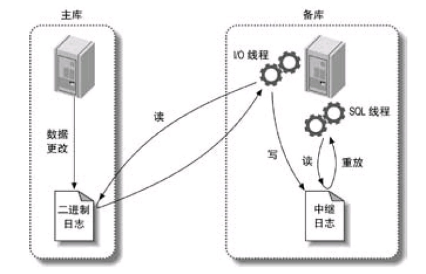{ width=60% }
	<figcaption>MySQL 主从复制原理图</figcaption>
</figure>

二进制转储线程可通过`SHOW PROCESSLIST`查看状态；

I/O 线程可通过`SHOW SLAVE STATUS`查看状态

MySQL 复制的两种方式：

| 复制方式           | 原理                                | 二进制日志格式 | 优点                                                       | 缺点                                                 |
| ------------------ | ----------------------------------- | -------------- | ---------------------------------------------------------- | ---------------------------------------------------- |
| 基于**语句的复制** | 把主库执行过的 SQL 在从库再执行一遍 | STATEMENT      | ① 足够简单，更新几兆数据的语句在二进制日志中只占几十个字节 | ① 数据准确性有依赖，如时间戳，可能导致数据主从不一致 |

② 更新必须是串行的，这需要更多的锁
③ 触发器或存储过程最好不要使用此方式 |
| 基于**行的复制** | 将实际变更的最终数据记录在二进制日志中 | ROW | ① 可以正确的复制每一行
② 几乎可以兼容任何场景，如 SQL 构造、触发器、存储过程
③ 不要求串行复制，可以减少锁
④ 有时无需像语句复制那样查询后更新，能更少的占用 CPU | ① 无法判断执行了哪些 SQL
② 一条SQL更新大量数据时会比语句复制更低效 |

这两种方式都是通过在主库记录二进制日志，再在从库重放日志的方式实现的异步数据复制。**MySQL 同时使用以上两种复制方式，并动态切换**，对应的二进制日志格式为 `MIXED`，MySQL 5.7.7 前默认格式是`STATEMENT`，之后默认是`ROW`。

复制文件说明：

- `msyql-bin.index`：用于记录磁盘上的二进制日志文件
- `mysql-relay-bin-index`：中继日志的索引文件
- `master.info`：保存了从库连接到主库所需要的信息，格式为纯文本
- `relay-log.info`：包含从库复制的二进制日志和中继日志坐标

#### 复制拓扑

<div align="center">
	<table>
		<tr>
			<td align="center"  style="vertical-align: bottom;">
				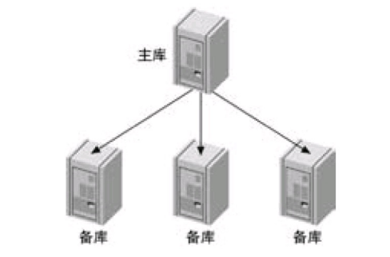<br />
				<sub class="img-caption">一主多从</sub><br />
			</td>
			<td align="center"  style="vertical-align: bottom;">
				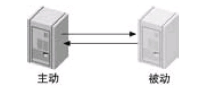<br />
				<sub class="img-caption">主动-被动模式下的双主复制</sub><br />
			</td>
			<td align="center"  style="vertical-align: bottom;">
				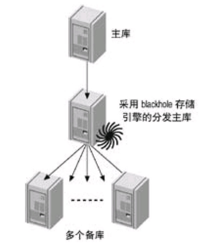<br />
				<sub class="img-caption">主库-分发库-多备</sub><br />
			</td>
		</tr>
	</table>
</div>

- 一主多从：当从库足够多时，会对主库造成很大的负载，因为每个从库都会在主库上创建一个线程。通过分发库则可解决此问题，但同时会导致从库无法替代主库，因为分发库的存在，导致从库与主库的二进制日志坐标不同。
- 主动-被动模式下的双主复制：该模式下，当主库被锁而导致性能急剧下降或意外关机时，可用被动库替代主库以保证服务。
- 主库-分发库-多备：为了解决“一主多从”模式下从库过多导致主库负载过大（每个从库开启一个线程）的问题，引入一个“分发库”（通常配置为只读，存储引擎可用 `BLACKHOLE` 以避免落盘）。分发库作为唯一的从库向主库请求二进制日志，并将其转换为自己的二进制日志，然后再分发给下游众多的备库。这样极大减轻了主库的压力，但代价是增加了整体架构的复杂度和数据同步的延迟。

#### 配置复制

创建复制账号：`GRANT REPLICATION SLAVE, REPLICATION CLIENT ON *.* TO repl@'192.168.1.%' IDENTIFIED BY 'p4ssword';`

#### 造成主从延时的原因

- 单线程同步
- 从库的 I/O 性能慢，可提升 CPU 和硬盘（SSD）改善
- 复制带宽受限
- 磁盘空间不足

## 第 12 章 高可用性

2 个 9 或 3 个 9 的可用性并不难，在设定更多可用时长目标前，应该衡量 ROI，因为其比例并不是线性的。

高可用性衡量标准：

- 平均失效时间（MTBF）
- 平均恢复时间（MTTR）

常见的故障原因：

- 磁盘空间不足
- 粗心的升级导致失败并遭遇一些 Bug
- 未经测试的变更直接线上运行
- 未确认备份是否可恢复
- 未正确监控 MySQL 的相关信息，过多的报警导致重要警报被忽视或淹没

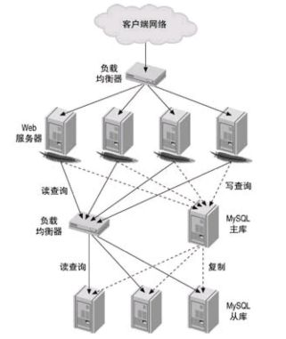{ align=right width=40%}
避免单点故障：

- 硬盘
- 交换机或路由器
- 电源
- 同一个数据中心

故障恢复的方案：

- 将备库或从库提升为主库
- 通过虚拟 IP 重定向到可用服务，但这依赖底层 ARP 缓存的更新
- 中间件

## 锁

**悲观锁：**总是假设最坏的情况，每次去拿数据的时候都认为别人会修改，所以每次在拿数据的时候都会上锁，这样别人想拿这个数据就会阻塞直到它解锁。

**乐观锁：**每次去拿数据的时候都认为别人不会修改，所以不会上锁，但是在更新的时候会判断一下在此期间别人有没有去更新这个数据，可以使用版本号等机制。乐观锁适用于多读的应用类型，这样可以提高吞吐量。乐观锁不能解决脏读的问题。乐观锁的实现机制是 CAS（Compare and Swap）

事务并发访问同一数据资源的情况主要分为`读-读`、`写-写`和`读-写`三种：

1. `读-读`：由于两个事务都进行只读操作，不会对记录造成任何影响，因此并发读完全允许。
2. `写-写`：这种情况下可能导致`脏写`问题，这是任何情况下都不允许发生的，因此只能通过**加锁**实现，也就是当一个事务需要对某行记录进行修改时，首先会先给这条记录加锁，如果加锁成功则继续执行，否则就排队等待，事务执行完成或回滚会自动释放锁。
3. `读-写`：这种情况下可能会产生`脏读`、`不可重复读`、`幻读`。最好的方案是**读操作利用多版本并发控制（`MVCC`），写操作进行加锁**。

意向锁可以认为是共享锁和排他锁在数据表上的标识，通过意向锁可以快速判断表中是否有记录被上锁，从而避免通过遍历的方式来查看表中有没有记录被上锁，提升加锁效率。

InnoDB 的行锁，是通过**锁住索引来实现的**，根据锁定范围的不同，行锁可以使用以下三种方式实现：

- 记录锁(Record Locks)：指聚簇索引中真实存放的数据，如图中的1、4、7、10。当我们使用唯一性的索引 (包括唯一索引和聚簇索引) 进行等值查询且精准匹配到一条记录时，此时就会直接将这条记录锁定。例如 `select * from t where id = 4 for update;` 就会将 `id=4` 的记录锁定。
- 间隙锁(Gap Locks) ：两个记录之间逻辑上尚未填入数据的部分，如图中的 (1,4)、(4,7) 等。**当我们使用等值查询或者范围查询，并且没有命中任何一条记录，此时就会将对应的间隙区间锁定**。例如 `select * from t where id = 3 for update;` 或者 `select * from t where id between (1, 4) for update;` 就会将 (1,4) 区间锁定。
- 临键锁(Next-Key Locks) ：指间隙加上它右边的记录组成的左开右闭区间。比图中的 (1,4]、(4,7] 等。临键锁就是记录锁 (Record Locks) 和间隙锁 (Gap Locks) 的结合，即除了锁住记录本身，还要再锁住索引之间的间隙。**当我们使用范围查询，并且命中了部分记录，此时锁住的就是临键区间**。**mysql 默认行锁类型就是临键锁**(Next-Key Locks)。当使用唯一性索引，等值查询匹配到一条记录的时候，临键锁 (Next-Key Locks) 会退化成记录锁；没有匹配到任何记录的时候，退化成间隙锁。

<div align="center">
  <table>
    <tr>
      <td align="center"  style="vertical-align: bottom;">
        <br />
        <sub class="img-caption">记录锁</sub><br />
      </td>
      <td align="center" style="vertical-align: bottom;">
        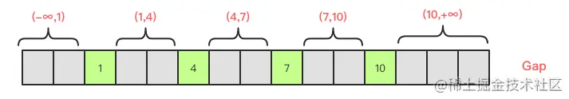<br />
        <sub class="img-caption">间隙锁</sub>
      </td>
	  <td align="center" style="vertical-align: bottom;">
        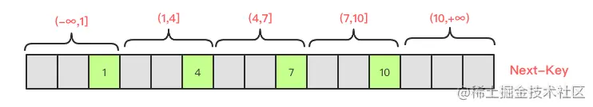<br />
        <sub class="img-caption">临键锁</sub>
      </td>
    </tr>
  </table>
</div>

通过 `SHOW PROCESSLIST` 可以查看到服务器级别的锁

通过 `SHOW ENGINE INNODB STATUS` 可以查看 InnoDB 中的锁信息

## MySQL 的日志

| 日志类型                       | 说明                                                                                 | 实现层   | 使用场景        |
| ------------------------------ | ------------------------------------------------------------------------------------ | -------- | --------------- |
| 重做日志（redo log）           | ① 在内存中的数据修改完成后，并在内存脏页刷到磁盘前，写入 redo 日志，以保证其崩溃恢复 |
| ② MySQL 中的 redo log 即为 WAL | 由 InnoDB引擎实现，所以 InnoDB 才具备了崩溃恢复，而 MyISAM 则不具备                  | 崩溃恢复 |
| 二进制日志（binlog）           | 在事务提交后，由服务层记录数据的变更操作。三种格式：`STATEMENT`、`ROW`、`MIXED`      | 服务层   | ① 主从复制      |
| ② 数据恢复                     |
| 回滚日志（undo log）           | ① 记录了每个事务的反向操作 SQL，以便在事务执行失败时撤销变更                         |
| ② MVCC                         |                                                                                      | 执行事务 |
| 中继日志（relay log）          | 从库的 I/O 线程写入                                                                  |          | 主从同步        |
| 慢查询日志（slow query log）   | 语句执行完，释放锁之前                                                               |          | 慢 SQL 问题排查 |
| 错误日志（errorlog）           |                                                                                      |          |                 |
| 一般查询日志（general log）    | 记录从客户端的连接和执行的语句                                                       |          |                 |

MySQL 中执行事务时的日志工作流程：

1. 将磁盘中需要修改的数据加载到 buffer pool 中，并修改数据的缓冲区拷贝
2. 写入 undo log 记录旧数据用于回滚，同时通过旧数据快照构成的版本链实现事务中数据的可见性
3. 写入 redo log buffer
4. redo log 持久化到硬盘中的 redo log file 文件，以保证数据的崩溃恢复。MySQL 通过循环的方式写入 redo log file。
5. 写入 bin log 日志，等待同步至从库
6. 写入事务 ID 到 redo log
7. 事务提交

<figure align="center" markdown="span">
  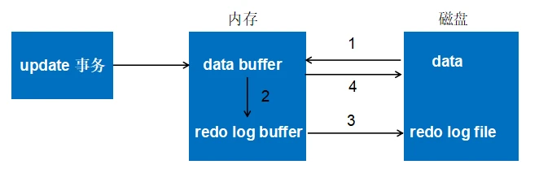{ width=60% }
	<figcaption>redo log 的工作流程</figcaption>
</figure>

在以上过程中，buffer pool 中的数据与磁盘不一致时，该缓冲页被称为**脏页**。 通常脏页会在系统空闲或关机前刷新到磁盘中，当一次修改较多数据导致缓冲区不足时，会导致系统强制将缓冲区中的数据刷新到磁盘中，以释放足够的空间。由于磁盘 I/O 的低效，导致刷脏页过程中系统响应较慢，可通过磁盘升级为 SSD 或通过调整以下参数优化：

- 调整`innodb_io_capacity`控制脏页刷新 I/O， 控制脏页比例（`Innodb_buffer_pool_pages_dirty`/`Innodb_buffer_pool_pages_total`）不超过 75%
- 调整`innodb_flush_neighbors` 控制是否刷新邻页的脏页，HDD 可设为 1，SSD 因较高的随机 I/O，可设为 0。MySQL 8.x 此值默认为 0
