# 《Redis开发与运维》

!!! abstract "阅读信息"

    - **评分**：⭐️⭐️⭐️⭐️
    - **时间**：12/01/2019 → 12/31/2019
    - **读后感**：Redis 是一款强有力的生产力工具，像一把瑞士军刀，只有你熟悉自己使用的工具，才能构建出一座坚固漂亮的大厦。使用什么工具决定了你的下限，但怎么使用工具决定了你的上限，你可以用 Redis 来做缓存，也可以用于流量削峰、抽奖、社交推荐。所有工具的背后都取决于人，创新产生价值。

## 第 1 章 初识 Redis

对于大部分数据库来说，插入行操作的执行速度非常快（插入行只会在硬盘文件末尾进行写入）。不过，对表里面的行进行更新却是一个速度相当慢的操作，因为这种更新除了会引起一次随机读之外，还可能会引起一次随机写。

### Redis 数据类型

- string(Bitmaps & HyperLogLog)
- hash
- list
- set
- zset

### Redis 提供的功能

- 键过期
- 发布订阅（消息系统）
- 事务
- 流水线（一批命令一次发送到 Redis，避免网络开销）
- Lua 脚本

### Redis 使用场景

- 缓存
- 排行榜
- 计数器（视频播放数，商品浏览量）
- 社交（共同好友、粉丝、点赞）
- 消息队列
- 共享 Session
- 限速（如，60s 获取一次手机验证码：`redis.set(phoneNum, 1, "EX 60", "NX")`）
- 使用哈希类型模拟关系型数据库（优点：用户信息内聚性较强，占用的键较少；缺点：哈希类型是稀疏的，难以做复杂的关系查询。注意：要控制哈希在 ziplist 和 hashtable 两种内部编码的转换，hashtable 会消耗更多的内存）

### 为什么 Redis 很快？

- 内存访问
- C 语言实现
- 单线程架构，避免线程切换与竞态产生的消耗
- I/O 多路复用模型（epoll）

安装软件时，为软件建立软连接是一种好习惯，避免将软件固定在指定版本上，有利于未来软件的版本升级。

Redis 借鉴了 Linux 对于版本号的命名规则：版本号第二位如果是奇数，则为非稳定版本（如 2.7、2.9、3.1），否则为稳定版本（如 2.6、2.8、3.0）

### Redis 可执行文件说明

| 命令                 | 含义                               |
| -------------------- | ---------------------------------- |
| `redis-server`       | 启动 Redis                         |
| `redis-cli`          | Redis 命令行客户端                 |
| `redis-cli shutdown` | 关闭 Redis                         |
| `redis-benchmark`    | Redis 基准测试工具                 |
| `redis-check-of`     | Redis AOF 持久化文件检测与修复工具 |
| `redis-check-dump`   | Redis RDB 持久化文件检测与修复工具 |
| `redis-sentinel`     | 启动 Redis Sentinel                |

### 启动 Redis 的3种方式

1. 默认配置(`redis-server`)
2. 运行配置(`redis-server --port 6380`)
3. 配置文件(`redis-server /opt/redis/redis.conf`)

Python 的 redis 高性能扩展是 hiredis，PHP 则是 phpredis。

## 第 2 章 API 的理解和使用

| 命令                                                                                                                                                                 | 选项                                                                                                                                                                                                                                                                                                                                                                                         | 返回值                                                                                                                | 含义                          | 复杂度                                                                                          | 备注                                                                                                                                                                                                                                                                                                                                                                                                                                                                   |
| -------------------------------------------------------------------------------------------------------------------------------------------------------------------- | -------------------------------------------------------------------------------------------------------------------------------------------------------------------------------------------------------------------------------------------------------------------------------------------------------------------------------------------------------------------------------------------- | --------------------------------------------------------------------------------------------------------------------- | ----------------------------- | ----------------------------------------------------------------------------------------------- | ---------------------------------------------------------------------------------------------------------------------------------------------------------------------------------------------------------------------------------------------------------------------------------------------------------------------------------------------------------------------------------------------------------------------------------------------------------------------- |
| `keys pattern`                                                                                                                                                       | pattern 使用的是 glob 风格的通配符                                                                                                                                                                                                                                                                                                                                                           |                                                                                                                       | 查看所有键                    | $O(n)$                                                                                          | 大量键时禁止使用                                                                                                                                                                                                                                                                                                                                                                                                                                                       |
| `dbsize`                                                                                                                                                             |                                                                                                                                                                                                                                                                                                                                                                                              | int（>=0）                                                                                                            | 键总数                        | $O(1)$                                                                                          | 不遍历键，直接读取内置键总数                                                                                                                                                                                                                                                                                                                                                                                                                                           |
| `exists key`                                                                                                                                                         |                                                                                                                                                                                                                                                                                                                                                                                              | intbool（存在为 1，否则为 0）                                                                                         | 检查键是否存在                |                                                                                                 |                                                                                                                                                                                                                                                                                                                                                                                                                                                                        |
| `del key [key ...]`                                                                                                                                                  |                                                                                                                                                                                                                                                                                                                                                                                              | int（成功删除的个数，若删除不存在的键，返回 0）                                                                       | 删除键                        | $O(k)$，𝑘为键的个数                                                                             |                                                                                                                                                                                                                                                                                                                                                                                                                                                                        |
| `expire key seconds`<br><br>`expireat key timestamp`<br><br>`pexpire key milliseconds`<br><br>`pexpireat key milliseconds-timestamp`                                 |                                                                                                                                                                                                                                                                                                                                                                                              | boolint（成功为 1，key 不存在或无法设置为 0）                                                                         | 键过期                        |                                                                                                 | 1. 无论使用哪种形式，在 Redis 内部最终使用的都是`pexpireat`；<br>2. 如果`expire key`的键不存在，返回 0;<br>3. 如果过期时间为负值，键会被立即删除，犹如使用了`del`;<br>4. `persist key`可以将键的过期时间清除；<br>5. **对于字符串类型键，执行`set`命令会去掉过期时间**;<br>6. Redis 不支持二级数据结构（哈希、列表）内部元素的过期功能，如不能对列表类型的一个元素做过期时间设置；<br>7. `setex`作为`set`+`expire`的组合，不但是原子执行，同时减少了一次网络通讯的时间 |
| `ttl key`<br>`pttl key`                                                                                                                                              |                                                                                                                                                                                                                                                                                                                                                                                              | int（>=0：键剩余过期时间；-1：键未设置过期时间；-2：键不存在）                                                        | 查看键剩余存活时间（秒/毫秒） |                                                                                                 |                                                                                                                                                                                                                                                                                                                                                                                                                                                                        |
| `type key`                                                                                                                                                           |                                                                                                                                                                                                                                                                                                                                                                                              | 键存在返回数据类型，不存在返回 none                                                                                   | 查看键的数据类型              |                                                                                                 |                                                                                                                                                                                                                                                                                                                                                                                                                                                                        |
| `rename key newkey`<br>`renamenx key newkey`                                                                                                                         |                                                                                                                                                                                                                                                                                                                                                                                              | 成功返回`OK`,失败为 0                                                                                                 | 键重命名                      |                                                                                                 | 1. 如果在重命名之前，键值已经存在，则值会被覆盖；<br>2. 由于重命名键期间会执行`del`删除旧键，如果键对应的值较大，可能会被阻塞                                                                                                                                                                                                                                                                                                                                          |
| `randomkey`                                                                                                                                                          |                                                                                                                                                                                                                                                                                                                                                                                              |                                                                                                                       | 随机返回一个键                |                                                                                                 |                                                                                                                                                                                                                                                                                                                                                                                                                                                                        |
| `move key db`<br><br>`dump key` + `restore key ttl value`<br><br><code>migrate host port key\|"" destination-db timeout [copy] [replace] [keys key [key ...]]</code> | `ttl`为 0 时表示无过期时间<br>`host`:目标主机<br>`port`:目标端口<br><code>key\|""</code>:迁移单个键指定键名，多个键则为空字符串<br>`destination-db`:目标 db 索引<br>`timeout`:迁移的超时时间（毫秒）<br>`copy`:不删除源键<br>`replace`:对目标 Redis 覆写操作。若未指定，源 Redis 和目标 Redis 存在同名键会报错<br>`keys key [key ...]`:迁移的键名                                            |                                                                                                                       | 迁移键                        |                                                                                                 | 方式二中，`dump`会将键值序列化，格式采用 RDB 格式，在目标 Redis 上，`restore`再将序列化的值复原<br><br>`migrate`实质上是`dump`、`restore`、`del`三个命令的组合。`migrate`具有原子性，只需在源 Redis 上执行即可，目标 Redis 完成`restore`后返回 OK，源 Redis 再根据`migrate`的对应选项决定是否在源 Redis 上删除对应的键                                                                                                                                                 |
| `scan cursor [match pattern] [count number]`                                                                                                                         | `cursor`：游标，第一次遍历从0开始，每次`scan`遍历完都会返回当前游标的值，直到游标值为0，表示遍历结束<br>`·match pattern`：模式匹配<br>`count number`：明每次要遍历的键个数，默认值是10，此参数可以适当增大                                                                                                                                                                                   |                                                                                                                       | 渐进式遍历                    |                                                                                                 | 如果在遍历过程中键发生了变化，则结果可能是不准确的；<br>`hscan` 解决 `hgetall` 的阻塞<br>`sscan`解决`smembers` 的阻塞<br>`zscan`解决`zrange` 的阻塞                                                                                                                                                                                                                                                                                                                    |
| `select dbIndex`                                                                                                                                                     |                                                                                                                                                                                                                                                                                                                                                                                              |                                                                                                                       | 切换数据库                    |                                                                                                 | 默认 16 个数据库(0~15)，未指定数据库时，默认为 0 数据库;<br>建议只使用 0 号数据库，避免多数据库的切换错误，以及故障排查困难。如果需要使用多数据库，可以在单机部署多个 Redis 实例，通过端口区分不同数据库                                                                                                                                                                                                                                                               |
| `flushdb`<br>`flushall`                                                                                                                                              |                                                                                                                                                                                                                                                                                                                                                                                              |                                                                                                                       | 清空当前 / 所有数据库         |                                                                                                 | 若数据库键值较多，可能引发阻塞                                                                                                                                                                                                                                                                                                                                                                                                                                         |
| **字符串 String**                                                                                                                                                    |                                                                                                                                                                                                                                                                                                                                                                                              |                                                                                                                       |                               |                                                                                                 |                                                                                                                                                                                                                                                                                                                                                                                                                                                                        |
| <code>set key value [ex seconds] [px milliseconds] [nx\|xx]</code>                                                                                                   | ex：设置秒级过期时间<br>px：设置毫秒级过期时间<br>nx：键不存在才能设置成功，用于添加<br>xx：键存在才能设置成功，用于更新                                                                                                                                                                                                                                                                     | 成功返回 OK，失败返回 0                                                                                               | 设置值                        | $O(1)$                                                                                          |                                                                                                                                                                                                                                                                                                                                                                                                                                                                        |
| `setex key seconds value`                                                                                                                                            |                                                                                                                                                                                                                                                                                                                                                                                              | 成功返回 OK，失败返回 0                                                                                               | 设定的值存在才会成功          |                                                                                                 |                                                                                                                                                                                                                                                                                                                                                                                                                                                                        |
| `setnx key value`                                                                                                                                                    |                                                                                                                                                                                                                                                                                                                                                                                              | 成功返回 OK，失败返回 0                                                                                               | 设定的值不存在才会成功        |                                                                                                 | 常用于分布式锁                                                                                                                                                                                                                                                                                                                                                                                                                                                         |
| `get key`                                                                                                                                                            |                                                                                                                                                                                                                                                                                                                                                                                              | 键存在时返回值，不存在返回 nil                                                                                        | 获取值                        | $O(1)$                                                                                          |                                                                                                                                                                                                                                                                                                                                                                                                                                                                        |
| `mset key value [key value ...]`                                                                                                                                     |                                                                                                                                                                                                                                                                                                                                                                                              | 成功返回 OK，失败返回 0                                                                                               | 批量设置值                    | $O(k)$，𝑘为键的个数                                                                             |                                                                                                                                                                                                                                                                                                                                                                                                                                                                        |
| `mget key [key ...]`                                                                                                                                                 |                                                                                                                                                                                                                                                                                                                                                                                              | 键存在时返回值，不存在返回 nil。结果按照传入键的顺序返回                                                              | 批量获取值                    | $O(k)$，𝑘为键的个数                                                                             |                                                                                                                                                                                                                                                                                                                                                                                                                                                                        |
| `incr key`                                                                                                                                                           |                                                                                                                                                                                                                                                                                                                                                                                              | 值不是整数，返回错误<br>值是整数，返回自增后结果<br>键不存在，按照值为 0 自增，返回结果为 1                           | 值自增                        | $O(1)$                                                                                          |                                                                                                                                                                                                                                                                                                                                                                                                                                                                        |
| `decr key`                                                                                                                                                           |                                                                                                                                                                                                                                                                                                                                                                                              | int                                                                                                                   | 值自减                        | $O(1)$                                                                                          |                                                                                                                                                                                                                                                                                                                                                                                                                                                                        |
| `incrby key increment`                                                                                                                                               |                                                                                                                                                                                                                                                                                                                                                                                              | int                                                                                                                   | 自增指定数字                  | $O(1)$                                                                                          |                                                                                                                                                                                                                                                                                                                                                                                                                                                                        |
| `decrby key decrement`                                                                                                                                               |                                                                                                                                                                                                                                                                                                                                                                                              | int                                                                                                                   | 自减指定数字                  | $O(1)$                                                                                          |                                                                                                                                                                                                                                                                                                                                                                                                                                                                        |
| `incrbyfloat key increment`                                                                                                                                          |                                                                                                                                                                                                                                                                                                                                                                                              | float                                                                                                                 | 自增浮点数                    | $O(1)$                                                                                          |                                                                                                                                                                                                                                                                                                                                                                                                                                                                        |
| `append key value`                                                                                                                                                   |                                                                                                                                                                                                                                                                                                                                                                                              | int（返回追加后的字符长度）                                                                                           | 向字符串尾部追加值            | $O(1)$                                                                                          |                                                                                                                                                                                                                                                                                                                                                                                                                                                                        |
| `strlen key`                                                                                                                                                         |                                                                                                                                                                                                                                                                                                                                                                                              | int（根据不同编码返回字符长度，如 UTF8 的“中国”返回值为 6）                                                           | 字符串长度                    | $O(1)$                                                                                          |                                                                                                                                                                                                                                                                                                                                                                                                                                                                        |
| `getset key value`                                                                                                                                                   |                                                                                                                                                                                                                                                                                                                                                                                              |                                                                                                                       | 设置并返回值                  |                                                                                                 |                                                                                                                                                                                                                                                                                                                                                                                                                                                                        |
| `setrange key offeset value`                                                                                                                                         |                                                                                                                                                                                                                                                                                                                                                                                              | int（返回字符长度）                                                                                                   | 设置指定位置的字符            | $O(1)$                                                                                          |                                                                                                                                                                                                                                                                                                                                                                                                                                                                        |
| `getrange key start end`                                                                                                                                             |                                                                                                                                                                                                                                                                                                                                                                                              | 返回截取的字符内容                                                                                                    | 获取部分字符串                | $O(n)$，𝑛 为字符串长度，由于获取字符串非常快，若字符串不是很长，可以视为$O(1)$                  |                                                                                                                                                                                                                                                                                                                                                                                                                                                                        |
| **哈希 Hash**                                                                                                                                                        |                                                                                                                                                                                                                                                                                                                                                                                              |                                                                                                                       |                               |                                                                                                 |                                                                                                                                                                                                                                                                                                                                                                                                                                                                        |
| `hset key field value`<br>`hget key field`                                                                                                                           |                                                                                                                                                                                                                                                                                                                                                                                              |                                                                                                                       | 设置值<br>获取值              | $O(1)$<br>$O(1)$                                                                                | 在 Redis 中，哈希类型是指键值本身又是一个键值对结构（形如 JSON）。哈希类型中的映射关系叫作field-value，注意这里的value是指field对应的值，不是键对应的值，请注意value在不同上下文的作用。                                                                                                                                                                                                                                                                               |
| `hdel key field [field ...]`                                                                                                                                         |                                                                                                                                                                                                                                                                                                                                                                                              | int （成功为删除的个数）                                                                                              | 删除 field                    | $O(k)$ ，𝑘是field个数                                                                           |                                                                                                                                                                                                                                                                                                                                                                                                                                                                        |
| `hlen key`                                                                                                                                                           |                                                                                                                                                                                                                                                                                                                                                                                              | int                                                                                                                   | 计算 field 个数               | $O(1)$                                                                                          |                                                                                                                                                                                                                                                                                                                                                                                                                                                                        |
| `hmset key field value[field value ...]`<br>`hmget key field [field ...]`                                                                                            |                                                                                                                                                                                                                                                                                                                                                                                              |                                                                                                                       | 批量设置或获取field-value     | $O(k)$ ，𝑘是field个数<br>$O(k)$ ，𝑘是field个数                                                  |                                                                                                                                                                                                                                                                                                                                                                                                                                                                        |
| `hexists key field`                                                                                                                                                  |                                                                                                                                                                                                                                                                                                                                                                                              | 存在为 1，否则为 0                                                                                                    | 判断field是否存在             | $O(1)$                                                                                          |                                                                                                                                                                                                                                                                                                                                                                                                                                                                        |
| `hsetnx key field value`                                                                                                                                             |                                                                                                                                                                                                                                                                                                                                                                                              |                                                                                                                       |                               | $O(1)$                                                                                          |                                                                                                                                                                                                                                                                                                                                                                                                                                                                        |
| `hkeys key`                                                                                                                                                          |                                                                                                                                                                                                                                                                                                                                                                                              |                                                                                                                       | 获取所有field                 | $O(n)$ ，𝑛 是field个数                                                                          | `hkeys` 叫 `hfields`更恰当                                                                                                                                                                                                                                                                                                                                                                                                                                             |
| `hvals key`                                                                                                                                                          |                                                                                                                                                                                                                                                                                                                                                                                              |                                                                                                                       | 获取所有value                 | $O(n)$ ，𝑛 是field个数                                                                          |                                                                                                                                                                                                                                                                                                                                                                                                                                                                        |
| `hgetall key`                                                                                                                                                        |                                                                                                                                                                                                                                                                                                                                                                                              |                                                                                                                       | 获取所有的field-value         | $O(n)$ ，𝑛 是field个数                                                                          | 在使用`hgetall`时，如果哈希元素个数比较多，可能会阻塞Redis。如果开发人员只需要获取部分field，可以使用`hmget`，如果一定要获取全部field-value，可以使用`hscan`命令，该命令会渐进式遍历哈希类型。                                                                                                                                                                                                                                                                         |
| `hincrby key field`<br>`hincrbyfloat key field`                                                                                                                      |                                                                                                                                                                                                                                                                                                                                                                                              |                                                                                                                       | 按指定值递增                  | $O(1)$<br>$O(1)$                                                                                |                                                                                                                                                                                                                                                                                                                                                                                                                                                                        |
| `hstrlen key field`                                                                                                                                                  |                                                                                                                                                                                                                                                                                                                                                                                              |                                                                                                                       | 计算value的字符串长度         | $O(1)$                                                                                          |                                                                                                                                                                                                                                                                                                                                                                                                                                                                        |
| **列表 List**                                                                                                                                                        |                                                                                                                                                                                                                                                                                                                                                                                              |                                                                                                                       |                               |                                                                                                 |                                                                                                                                                                                                                                                                                                                                                                                                                                                                        |
| `lpush key value [value ...]`<br>`rpush key value [value ...]`                                                                                                       |                                                                                                                                                                                                                                                                                                                                                                                              | int（成功插入元素个数）                                                                                               | 从左/右侧插入元素             | $O(k)$，𝑘 为元素个数                                                                            | 列表类型的两个特点：第一，列表中的元素是有序的（即，可以通过索引下标获取元素）；第二，列表中的元素可以是重复的                                                                                                                                                                                                                                                                                                                                                         |
| `lpop key`<br>`rpop key`                                                                                                                                             |                                                                                                                                                                                                                                                                                                                                                                                              |                                                                                                                       | 从列表左/右侧弹出元素         | $O(1)$                                                                                          |                                                                                                                                                                                                                                                                                                                                                                                                                                                                        |
| <code>linsert key before\|after pivot value</code>                                                                                                                   |                                                                                                                                                                                                                                                                                                                                                                                              | int（返回当前列表长度）                                                                                               | 向某个元素前或者后插入元素    | $O(n)$，𝑛 是 pivot 距离列表头或尾的距离                                                         |                                                                                                                                                                                                                                                                                                                                                                                                                                                                        |
| `lrange key start end`                                                                                                                                               |                                                                                                                                                                                                                                                                                                                                                                                              |                                                                                                                       | 获取指定范围内的元素列表      | $O(s+n)$，𝑠 是 start 偏移量，𝑛 是start 到 end 的范围                                            | 1. `lrange 0 -1` 可获取列表所有元素<br>2. end 包含了自身                                                                                                                                                                                                                                                                                                                                                                                                               |
| `lindex key index`                                                                                                                                                   |                                                                                                                                                                                                                                                                                                                                                                                              |                                                                                                                       | 获取列表指定索引下标的元素    | $O(n)$，𝑛 是索引的偏移量                                                                        |                                                                                                                                                                                                                                                                                                                                                                                                                                                                        |
| `llen key`                                                                                                                                                           |                                                                                                                                                                                                                                                                                                                                                                                              | int                                                                                                                   | 获取列表长度                  | $O(1)$                                                                                          |                                                                                                                                                                                                                                                                                                                                                                                                                                                                        |
| `lrem key count value`                                                                                                                                               |                                                                                                                                                                                                                                                                                                                                                                                              | count > 0，从左到右，删除最多 count 个元素<br>count < 0，从右到左，删除最多 count 绝对值个元素<br>count = 0，删除所有 | 删除指定元素                  | $O(n)$，𝑛 是列表长度                                                                            |                                                                                                                                                                                                                                                                                                                                                                                                                                                                        |
| `ltrim key start end`                                                                                                                                                |                                                                                                                                                                                                                                                                                                                                                                                              |                                                                                                                       | 按照索引范围修剪列表          | $O(n)$，𝑛 是要裁剪的元素总数                                                                    |                                                                                                                                                                                                                                                                                                                                                                                                                                                                        |
| `lset key index newValue`                                                                                                                                            |                                                                                                                                                                                                                                                                                                                                                                                              |                                                                                                                       | 修改指定索引下标的元素        | $O(n)$，𝑛 是索引的偏移量                                                                        |                                                                                                                                                                                                                                                                                                                                                                                                                                                                        |
| `blpop key [key ...] timeout`<br>`brpop key [key ...] timeout`                                                                                                       | `timeout` 为阻塞时间                                                                                                                                                                                                                                                                                                                                                                         |                                                                                                                       | 阻塞式弹出                    | $O(1)$                                                                                          | 如果有多个键，那么`brpop`会从左至右遍历键，一旦有一个键能弹出元素，客户端立即返回                                                                                                                                                                                                                                                                                                                                                                                      |
| **集合(Set)**                                                                                                                                                        |                                                                                                                                                                                                                                                                                                                                                                                              |                                                                                                                       |                               |                                                                                                 |                                                                                                                                                                                                                                                                                                                                                                                                                                                                        |
| `sadd key element [element ...]`                                                                                                                                     |                                                                                                                                                                                                                                                                                                                                                                                              | int（返回添加成功元素的个数）                                                                                         | 添加元素                      | $O(k)$，𝑘是元素个数                                                                             |                                                                                                                                                                                                                                                                                                                                                                                                                                                                        |
| `srem key element [element ...]`                                                                                                                                     |                                                                                                                                                                                                                                                                                                                                                                                              | int（返回删除成功元素的个数）                                                                                         | 删除元素                      | $O(k)$，𝑘是元素个数                                                                             |                                                                                                                                                                                                                                                                                                                                                                                                                                                                        |
| `scard key`                                                                                                                                                          |                                                                                                                                                                                                                                                                                                                                                                                              |                                                                                                                       | 计算元素个数                  | $O(1)$                                                                                          | 同`dbsize`类似，直接读取内置变量                                                                                                                                                                                                                                                                                                                                                                                                                                       |
| `sismember key element`                                                                                                                                              |                                                                                                                                                                                                                                                                                                                                                                                              | int（存在返回 1，否则为 0）                                                                                           | 判断元素是否在集合中          | $O(1)$                                                                                          |                                                                                                                                                                                                                                                                                                                                                                                                                                                                        |
| `srandmember key [count]`                                                                                                                                            |                                                                                                                                                                                                                                                                                                                                                                                              |                                                                                                                       | 随机从集合返回指定个数元素    | $O(count)$                                                                                      |                                                                                                                                                                                                                                                                                                                                                                                                                                                                        |
| `spop key`                                                                                                                                                           |                                                                                                                                                                                                                                                                                                                                                                                              |                                                                                                                       | 从集合随机弹出元素            | $O(1)$                                                                                          | `srandmember`和`spop`都是随机从集合选出元素，两者不同的是`spop`命令执行后，元素会从集合中删除，而`srandmember`不会。                                                                                                                                                                                                                                                                                                                                                   |
| `smembers key`                                                                                                                                                       |                                                                                                                                                                                                                                                                                                                                                                                              |                                                                                                                       | 获取所有元素，结果是无序的    | $O(n)$，𝑛是元素总数                                                                             | `smembers`和`lrange`、`hgetall`都属于比较重的命令，如果元素过多存在阻塞Redis的可能性，这时候可以使用`sscan`来完成                                                                                                                                                                                                                                                                                                                                                      |
| `sinter key [key ...]`                                                                                                                                               |                                                                                                                                                                                                                                                                                                                                                                                              |                                                                                                                       | 取交集                        | $O(m*k)$，𝑘是多个集合元素最少的个数，𝑚是键个数                                                  |                                                                                                                                                                                                                                                                                                                                                                                                                                                                        |
| `suinon key[key ...]`                                                                                                                                                |                                                                                                                                                                                                                                                                                                                                                                                              |                                                                                                                       | 取并集                        | $O(k)$，𝑘是多个集合元素个数和                                                                   |                                                                                                                                                                                                                                                                                                                                                                                                                                                                        |
| `sdiff key [key ...]`                                                                                                                                                |                                                                                                                                                                                                                                                                                                                                                                                              |                                                                                                                       | 取差集                        | $O(k)$，𝑘是多个集合元素个数和                                                                   |                                                                                                                                                                                                                                                                                                                                                                                                                                                                        |
| `sinterstore destination key [key ...]`<br>`suionstore destination key [key ...]`<br>`sdiffstore destination key [key ...]`                                          |                                                                                                                                                                                                                                                                                                                                                                                              |                                                                                                                       | 将交集、并集、差集的结果保存  |                                                                                                 |                                                                                                                                                                                                                                                                                                                                                                                                                                                                        |
| **有序集合（Zset）**                                                                                                                                                 |                                                                                                                                                                                                                                                                                                                                                                                              |                                                                                                                       |                               |                                                                                                 |                                                                                                                                                                                                                                                                                                                                                                                                                                                                        |
| `zadd key score member [score member ...]`                                                                                                                           |                                                                                                                                                                                                                                                                                                                                                                                              |                                                                                                                       | 添加成员                      | $O(k*log(n))$，𝑘是添加成员的个数，𝑛是当前有序集合成员个数                                       |                                                                                                                                                                                                                                                                                                                                                                                                                                                                        |
| `zcard key`                                                                                                                                                          |                                                                                                                                                                                                                                                                                                                                                                                              | int                                                                                                                   | 计算成员个数                  | $O(1)$                                                                                          |                                                                                                                                                                                                                                                                                                                                                                                                                                                                        |
| `zscore key member`                                                                                                                                                  |                                                                                                                                                                                                                                                                                                                                                                                              | int（成员不存在返回 nil）                                                                                             | 计算某个成员的分数            | $O(1)$                                                                                          |                                                                                                                                                                                                                                                                                                                                                                                                                                                                        |
| `zrank key member`<br>`zrevrank key member`                                                                                                                          |                                                                                                                                                                                                                                                                                                                                                                                              | 返回分数从低到高/从高到低的排名                                                                                       | 计算成员的排名                | $O(log(n))$，𝑛是当前有序集合成员个数                                                            |                                                                                                                                                                                                                                                                                                                                                                                                                                                                        |
| `zrem key member [member ...]`                                                                                                                                       |                                                                                                                                                                                                                                                                                                                                                                                              | 返回删除成员的个数                                                                                                    | 删除成员                      | $O(k*log(n))$，𝑘是删除成员的个数，𝑛是当前有序集合成员个数                                       |                                                                                                                                                                                                                                                                                                                                                                                                                                                                        |
| `zincrby key increment member`                                                                                                                                       |                                                                                                                                                                                                                                                                                                                                                                                              |                                                                                                                       | 增加成员的分数                | $O(log(n))$，𝑛是当前有序集合成员个数                                                            |                                                                                                                                                                                                                                                                                                                                                                                                                                                                        |
| `zrange key start end [withscores]`<br>`zrevrange key start end[withscores]`                                                                                         | `withscores`会同时返回成员分数                                                                                                                                                                                                                                                                                                                                                               | 返回分数从低到高/从高到低的排名                                                                                       | 返回指定排名范围的成员        | $O(log(n)+k)$，𝑘是要获取的成员个数，𝑛是当前有序集合成员个数                                     |                                                                                                                                                                                                                                                                                                                                                                                                                                                                        |
| `zrangebyscore key min max [withscores] [limit offset count]`<br>`zrevrangebyscore key max min [withscores][limit offset count]`                                     | `min`和`max`还支持开区间（小括号）和闭区间（中括号），`-inf`和`+inf`分别代表无限小和无限大                                                                                                                                                                                                                                                                                                   |                                                                                                                       | 返回指定分数范围的成员        | $O(log(n)+k)$，𝑘是要获取的成员个数，𝑛是当前有序集合成员个数                                     |                                                                                                                                                                                                                                                                                                                                                                                                                                                                        |
| `zcount key min max`                                                                                                                                                 |                                                                                                                                                                                                                                                                                                                                                                                              |                                                                                                                       | 返回指定分数范围成员个数      | $O(log(n))$，𝑛是当前有序集合成员个数                                                            |                                                                                                                                                                                                                                                                                                                                                                                                                                                                        |
| `zremrangebyrank key start end`                                                                                                                                      |                                                                                                                                                                                                                                                                                                                                                                                              |                                                                                                                       | 删除指定排名内的升序元素      | $O(log(n)+k)$，𝑘是要删除的成员个数，𝑛是当前有序集合成员个数                                     |                                                                                                                                                                                                                                                                                                                                                                                                                                                                        |
| `zremrangebyscore key min max`                                                                                                                                       |                                                                                                                                                                                                                                                                                                                                                                                              |                                                                                                                       | 删除指定分数范围的成员        | $O(log(n)+k)$，𝑘是要删除的成员个数，𝑛是当前有序集合成员个数                                     |                                                                                                                                                                                                                                                                                                                                                                                                                                                                        |
| <code>zinterstore destination numkeys key [key ...] [weights weight [weight ...]] [aggregate sum\|min\|max]</code>                                                   | `destination`：交集计算结果保存到这个键；<br>`numkeys`：需要做交集计算键的个数；<br>`key [key...]`：需要做交集计算的键；<br>`weights weight[weight...]`：每个键的权重，在做交集计算时，每个键中的每个 member 会将自己分数乘以这个权重，每个键的权重默认是1；<br><code>aggregate sum\|min\|max</code>：计算成员交集后，分值可以按照sum（和）、min（最小值）、max（最大值）做汇总，默认值是sum |                                                                                                                       | 取交集                        | $O(n * k)+O(m*log(m))$，𝑛是成员数最小的有序集合成员个数，𝑘是有序集合的个数，𝑚是结果集中成员个数 |                                                                                                                                                                                                                                                                                                                                                                                                                                                                        |
| <code>zunionstore destination numkeys key [key ...] [weights weight[weight ...]] [aggregate sum\|min\|max]</code>                                                    |                                                                                                                                                                                                                                                                                                                                                                                              |                                                                                                                       | 取并集                        | $O(n)+O(m*log(m))$，𝑛是所有有序集合成员个数和，𝑚是结果集中成员个数                              |                                                                                                                                                                                                                                                                                                                                                                                                                                                                        |

### 判断键不存在的方法

1. `exists` 返回 0
2. `del` 返回 0
3. `ttl` 返回 -2
4. `type` 返回 `none`
5. `get` 返回 `nil`

设计合理的键名，有助于防止键冲突和项目的可维护性，比较推荐的方式是使用“业务名:对象名:id:[属性]”作为键名。如果键名较长，可以在能描述键含义的前提下适当减少键的长度，从而减少由于键名过长而导致的内存浪费。

### 列表的四种操作类型

| 操作类型 | 操作                         |
| -------- | ---------------------------- |
| 添加     | `rpush` `lpush` `linsert`    |
| 查       | `lrange` `lindex` `llen`     |
| 删除     | `lpop` `rpop` `lrem` `ltrim` |
| 修改     | `lset`                       |
| 阻塞操作 | `blpop` `brpop`              |

### 列表的使用场景

- `lpush` + `lpop` = Stack（栈）
- `lpush` + `rpop` = Queue（队列）
- `lpush` + `ltrim` = Capped Collection（有限集合）
- `lpush` + `brpop` = Message Queue（消息队列）

### 集合的使用场景

- `sadd` = Tagging（标签）
- `spop/srandmember` = Random item（生成随机数，比如抽奖）
- `sadd` + `sinter`= Social Graph（社交需求）

### 列表、集合、有序集合的异同点

| 数据结构 | 是否允许重复元素 | 是否有序 | 有序实现方式 | 应用场景           |
| -------- | ---------------- | -------- | ------------ | ------------------ |
| 列表     | 是               | 是       | 索引下标     | 时间轴、消息队列等 |
| 集合     | 否               | 否       | 无           | 标签、社交等       |
| 有序集合 | 否               | 是       | 分值         | 排行榜、社交等     |

### Redis 数据结构与内部编码

- 字符串
    - int: 8个字节的长整型
    - embstr: <=39 Byte 的字符串
    - raw: >39 Byte 的字符串
- 哈希
    - ziplist: 当哈希类型元素个数小于 `hash-max-ziplist-entries` 配置（默认512个）、同时所有值都小于 `hash-max-ziplist-value` 配置（默认64字节）时，Redis 会使用 ziplist 作为哈希的内部实现，ziplist 使用更加紧凑的结构实现多个元素的连续存储，所以在 **节省内存方面比 hashtable 更加优秀**。
    - hashtable: 当哈希类型无法满足 ziplist 的条件时，Redis 会使用 hashtable 作为哈希的内部实现，因为此时 ziplist 的读写效率会下降，而 hashtable 的读写时间复杂度为 $O(1)$
- 列表
    - ziplist: 当列表元素个数小于 `list-max-ziplist-entries` 配置（默认512个）、同时每个元素值都小于 `list-max-ziplist-value` 配置（默认64字节）时，Redis 会使用 ziplist 来作为列表的内部实现来减少内存
    - linkedlist: 当无法满足ziplist条件时
- 集合
    - intset: 当集合中的元素都是整数且元素个数小于`set-maxintset-entries`配置（默认512个）时，Redis会选用intset来作为集合的内部实现，从而减少内存的使用。
    - hashtable: 无法满足intset时
- 有序集合
    - ziplist: 当有序集合的元素个数小于`zset-max-ziplistentries`配置（默认128个），同时每个元素的值都小于`zset-max-ziplist-value`配置（默认64字节）时，Redis会用ziplist来作为有序集合的内部实现来减少内存
    - skiplist: 当无法满足ziplist条件时（跳表[视频讲解](https://www.youtube.com/watch?v=m6m0pnsOzN4)）
      

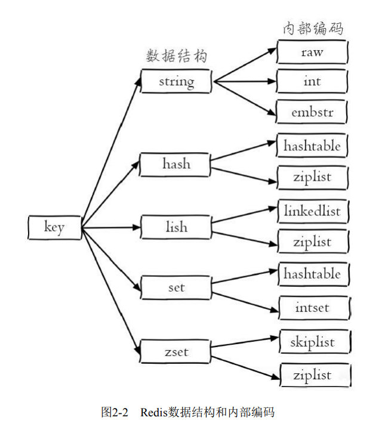{ align=left width=35% }
Redis 设计内部编码与外部结构有两个好处 ：

1. 改进内部编码而对外部数据结构和命令没有影响
2. 多种内部编码实现可以在不同场景下发挥各自的优势，如 ziplist 比较节省内存，但在列表元素较多的情况下，性能会有所下降，此时 Redis 会根据配置选项将列表类型的内部实现转换为 linkedlist。

可以通过`object encoding key`命令查询内部编码。

## 第 3 章 小功能大用处

### 慢查询

#### 慢查询配置

- `slowlog-log-slower-than` 执行时间阈值
    - 单位为微秒，默认 10,000，为 0 表示记录所有命令，<0 不记录任何命令
    - 在高并发场景下，需要将该值向下调整
- `slowlog-max-len`
    - Redis 使用列表结构存储慢查询日志，该参数为列表最大长度
    - 当列表达最大长度时，最早插入的命令会被从列表中移出
    - 可定时将慢查询日志持久化处理，便于排查故障

#### 慢查询命令

| 命令              | 选项          | 含义                       |
| ----------------- | ------------- | -------------------------- |
| `slowlog get [n]` | `n`: 指定条数 |                            |
| `slowlog len`     |               | 获取当前慢查询列表长度     |
| `slowlog reset`   |               | 重置日志，即清理慢查询列表 |

#### 慢查询日志结构

```bash
127.0.0.1:6379> slowlog get
1) 1) (integer) 666         # (1)!
   2) (integer) 1456786500  # (2)!
   3) (integer) 11615       # (3)!
   4) 1) "BGREWRITEAOF"     # (4)!
2) 1) (integer) 665
   2) (integer) 1456718400
   3) (integer) 12006
   4) 1) "SETEX"
      2) "video_info_200"
      3) "300"
      4) "2"
```

1. 日志标识 ID
2. 执行命令时的 时间戳
3. 命令耗时（单位：微秒）
4. 执行命令和参数

### Redis Shell

#### `redis-cli`

| 示例                                                                                                               | 选项                                                                                                                                                            | 备注                                                                                |
| ------------------------------------------------------------------------------------------------------------------ | --------------------------------------------------------------------------------------------------------------------------------------------------------------- | ----------------------------------------------------------------------------------- |
| `redis-cli -r 3 ping`                                                                                              | `-r`(repeat)：指定命令执行次数                                                                                                                                  |                                                                                     |
| `redis-cli -r 5 -i 1 ping`                                                                                         | `-i`(interval)：执行命令间隔时间，单位秒                                                                                                                        | `-i`必须与`-r`一同使用该选项不支持毫秒为单位，若想以 10ms 为间隔，可以使用`-i 0.01` |
| <code>echo "world" \| redis-cli -x set hello</code>                                                                | `-x`: 从 stdin 读取数据作为 `redis-cli`的最后一个参数                                                                                                           |                                                                                     |
|                                                                                                                    | `-c`(cluster): 连接 Redis cluster 时使用，可以防止 `moved` 和 `ask` 异常                                                                                        |                                                                                     |
|                                                                                                                    | `-a`(auth): 密码认证                                                                                                                                            |                                                                                     |
| `redis-cli --scan --pattern "app*"`                                                                                | `--scan` & `--pattern`: 于扫描指定模式的键                                                                                                                      |                                                                                     |
| `redis-cli --slave`                                                                                                | `--slave`选项是把当前客户端模拟成当前 Redis 节点的从节点，可以用来获取当前 Redis 节点的更新操作                                                                 |                                                                                     |
|                                                                                                                    | `--rdb`: 将 Redis 实例持久化                                                                                                                                    |                                                                                     |
|                                                                                                                    | `--pipe`: 将命令封装成Redis通信协议定义的数据格式，批量发送给Redis执行                                                                                          |                                                                                     |
| `redis-cli --bigkeys`                                                                                              | `--bigkeys`: 使用scan命令对Redis的键进行采样，从中找到内存占用比较大的键值，这些键可能是系统的瓶颈                                                              |                                                                                     |
|                                                                                                                    | `--eval`: 指定 Lua 脚本                                                                                                                                         |                                                                                     |
| `redis-cli -h {machineB} --latencyredis-cli -h {machineB} --latency-historyredis-cli -h {machineB} --latency-dist` | `--latency`: 测试目标 Redis 网络延时。仅返回一条结果`--latency-history`: 每间隔一定时间（可通过`-i`设定）返回结果`--latency-dist`: 以统计图表的方式输出统计信息 |                                                                                     |
| `redis-cli --stat`                                                                                                 | `--stat`: 实时获取 Redis 统计信息                                                                                                                               | `redis-cli info`也能查看系统信息                                                    |
| `redis-cli --no-raw get apple`                                                                                     | `--raw` & `--no-raw`: 是否格式化输出                                                                                                                            |                                                                                     |

#### `redis-server`

`redis-server --test-memory 1024` 可用于检测当前 OS 是否能稳定分配指定容量内存给 Redis，该命令通常用于压测。

#### `redis-benchmark`

该命令会对各类数据结构的命令进行测试，并给出性能指标。

- `-c`(client) 可指定客户端并发数（默认 50）
- `-n` 指定客户端请求总量（默认 100,000）
- `-q` 仅显示每秒接收请求数
- `-r`(random) 随机插入键，以进行基准测试
- `-P` 每个请求 pipeline 的数据量（默认为 1）
- `-k` 客户端是否使用`keepalive`，1 为使用，0 为不使用，默认为 1
- `-t` 对指定命令进行基准测试，如`redis-benchmark -t get,set -q`
- `--csv` 将结果按照 csv 格式输出

### Pipeline

由于 Redis 是单线程机制，当需要执行多条命令时，网络 I/O 成为了瓶颈，因此 pipeline 可将待执行命令“打包”，通过一次往返即可完成。

需要注意的是，如果 pipeline 数据量过大，将会导致网络阻塞。

### 事务与 Lua

Redis 中，将一组需要一起执行的事务命令放到`multi`(开始)和`exec`(结束)之间即可，如果要停止事务，可以使用`discard`。需要注意的是，Redis **不支持事务的回滚操作**（即使事务执行中出现错误，仍然会执行之后的命令），但可以通过 Lua 来实现回滚。

由于 Redis 是单进程的，因此 **支持隔离性**。

有些应用场景需要在事务之前，确保事务中的`key`没有被其他客户端修改过，才执行事务，否则不执行（类似乐观锁）。Redis提供了`watch`命令来解决这类问题。

Lua 的数据类型：

1. booleans(布尔)
2. numbers(数值)
3. strings(字符串)
4. tables(表格)

#### 在 Redis 中执行 Lua 的方法

方式一：`eval 脚本内容 key个数 key列表 参数列表`

方式二：先将 Lua 脚本加载入 Redis，得到该脚本的 SHA1，`evalsha`使用`SHA1`执行对应的脚本。这样可以重复批处理。

- 加载脚本：`redis-cli script load "$(cat lua_get.lua)"`
- 执行脚本：`evalsha 脚本SHA1值 key个数 key列表 参数列表`
- 判断脚本是否已经被加载：`scripts exists sha1 [sha1 …]`，返回存在的脚本个数
- 清除所有脚本：`script flush`
- 强制终止脚本：`script kill`。如果当前脚本正在写入，则该命令不会生效，此时要么等待脚本执行结束，要么使用`shutdown save`停止 Redis 服务

> Lua 脚本在 Redis 中是原子执行的，执行过程中不会插入其它命令。

### Bitmaps

Bitmaps本身不是一种数据结构，实际上它就是字符串，但是它可以对字符串的位进行操作。

| 命令                                  | 说明                                     | 备注                                                                                                                                                                                                                                                                   |
| ------------------------------------- | ---------------------------------------- | ---------------------------------------------------------------------------------------------------------------------------------------------------------------------------------------------------------------------------------------------------------------------- |
| `setbit key offset value`             | 设置值                                   | 很多应用的用户id以一个指定数字（例如10000）开头，直接将用户id和Bitmaps的偏移量对应势必会造成一定的浪费，通常的做法是每次做 `setbit` 操作时将用户id减去这个指定数字。在第一次初始化 Bitmaps 时，假如偏移量非常大，那么整个初始化过程执行会比较慢，可能会造成Redis的阻塞 |
| `gitbit key offset`                   | 获取值                                   |                                                                                                                                                                                                                                                                        |
| `bitcount key [start][end]`           | 获取Bitmaps指定范围值为1的个数           |                                                                                                                                                                                                                                                                        |
| `bitop operator destkey key[key....]` | Bitmaps间的运算                          | `bitop`是一个复合操作，它可以做多个Bitmaps的`and`、`or`、`not`、`xor`操作并将结果保存在`destkey`中                                                                                                                                                                     |
| `bitpos key targetBit [start] [end]`  | 计算Bitmaps中第一个值为targetBit的偏移量 |                                                                                                                                                                                                                                                                        |

当用户量很大时，使用 bitmaps 存储用户的活跃情况是非常好的一种方案，但活跃用户量较少时则不合理，大多数位都是 0。

### HyperLogLog

HyperLogLog并不是一种新的数据结构（实际类型为字符串类型），通过HyperLogLog可以利用极小的内存空间完成独立总数的统计，数据集可以是IP、Email、ID等。

| 命令                                        | 说明             | 备注 |
| ------------------------------------------- | ---------------- | ---- |
| `pfadd key element [element …]`             | 添加，成功返回 1 |      |
| `pfcount key [key …]`                       | 计算独立用户     |      |
| `pfmerge destkey sourcekey [sourcekey ...]` | 合并             |      |

相比于集合类型，HyperLogLog 内存占用量非常小，但是存在错误率，因此，在数据结构选型时，需要平衡误差与空间占用率。

### 发布订阅

| 命令                                                                  | 说明                     | 备注                                                                                                                                                                                                |
| --------------------------------------------------------------------- | ------------------------ | --------------------------------------------------------------------------------------------------------------------------------------------------------------------------------------------------- |
| `publish channel message`                                             | 发布消息，返回订阅者个数 |                                                                                                                                                                                                     |
| `subscribe channel [channel ...]`                                     | 订阅消息                 | 客户端在执行订阅命令之后进入了订阅状态，只能接收`subscribe`、`psubscribe`、`unsubscribe`、`punsubscribe`的四个命令新开启的订阅客户端，无法收到该频道之前的消息，因为Redis不会对发布的消息进行持久化 |
| `unsubscribe [channel [channel ...]]`                                 | 取消订阅                 |                                                                                                                                                                                                     |
| `psubscribe pattern [pattern...]punsubscribe [pattern [pattern ...]]` | 按照模式订阅和取消订阅   |                                                                                                                                                                                                     |
| `pubsub channels [pattern]`                                           | 查看活跃的频道           |                                                                                                                                                                                                     |
| `pubsub numsub [channel ...]`                                         | 查看频道订阅数           |                                                                                                                                                                                                     |
| `pubsub numpat`                                                       | 查看模式订阅数           |                                                                                                                                                                                                     |

### GEO

GEO底层由 zset 实现。

| 命令                                                                                                                                                                                                                                                                                              | 说明                                 | 备注                                                                                                                                                                                                                                                                                                                                                                                                                                                                                                                         |
| ------------------------------------------------------------------------------------------------------------------------------------------------------------------------------------------------------------------------------------------------------------------------------------------------- | ------------------------------------ | ---------------------------------------------------------------------------------------------------------------------------------------------------------------------------------------------------------------------------------------------------------------------------------------------------------------------------------------------------------------------------------------------------------------------------------------------------------------------------------------------------------------------------- |
| `geoadd key longitude latitude member [longitude latitude member ...]`                                                                                                                                                                                                                            | 增加地理位置信息。返回成功添加的个数 | 更新地理位置信息仍然可以使用该命令，但返回为 0。该命令同时支持多个地理位置添加                                                                                                                                                                                                                                                                                                                                                                                                                                               |
| `geopos key member [member ...]`                                                                                                                                                                                                                                                                  | 获取地理位置信息                     |                                                                                                                                                                                                                                                                                                                                                                                                                                                                                                                              |
| `geodist key member1 member2 [unit]`                                                                                                                                                                                                                                                              | 获取两个地理位置的距离               | `unit`为单位，分别为`m`(米)，`km`(公里)，`mi`(英里)，`ft`(尺)                                                                                                                                                                                                                                                                                                                                                                                                                                                                |
| <code>georadius key longitude latitude radiusm\|km\|ft\|mi [withcoord] [withdist] [withhash] [COUNT count] [asc\|desc] [store key] [storedist key]georadiusbymember key member radiusm\|km\|ft\|mi [withcoord] [withdist] [withhash] [COUNT count] [asc\|desc] [store key] [storedist key]</code> | 获取指定位置范围内的地理信息位置集合 | `georadius`和`georadiusbymember`两个命令的作用是一样的，都是以一个地理位置为中心算出指定半径内的其他地理信息位置，不同的是`georadius`命令的中心位置给出了具体的经纬度，`georadiusbymember`只需给出成员即可。其中<code>radiusm\|km\|ft\|mi</code>是必需参数，指定了半径`withcoord`:返回经纬度；`withdist`:返回离中心节点位置的距离；`withhash`:返回`geohash`；`COUNT count`:返回指定结果数量；<code>asc\|desc</code>:按距中心节点距离升序或降序；`store key`:将结果保存到指定键；`storedist key`:将距中心节点距离保存到指定键 |
| `geohash key member [member ...]`                                                                                                                                                                                                                                                                 | 获取geohash                          | Redis将所有地理位置信息的`geohash`存放在`zset`中，字符串越长，表示的位置更精确                                                                                                                                                                                                                                                                                                                                                                                                                                               |
| `zrem key member`                                                                                                                                                                                                                                                                                 | 删除地理位置信息                     |                                                                                                                                                                                                                                                                                                                                                                                                                                                                                                                              |

## 第 4 章 客户端

### 客户端常见异常

1. 无法从连接池获取到连接
    1. 连接池设置过小，默认为 8
    2. 客户端未正确使用连接池，如没有进行释放
    3. 存在慢查询操作
    4. Redis 服务造成命令执行过程阻塞
2. 客户端读写超时
    1. 读写时间设置过短
    2. 命令执行时间较长
    3. 网路异常
    4. Redis 自身发生阻塞
3. 客户端连接超时
    1. 超时时间过短
    2. Redis 发生阻塞，`tcp-backlog`已满，造成新的连接失败
    3. 网络异常
4. 客户端缓冲区异常
    1. 输出缓冲区满
    2. 长时间闲置连接被服务端主动断开
    3. 不正常并发读写
5. Lua 脚本正在执行
    1. 脚本正在执行，且执行时间超过了`lua-time-limit`，需等待脚本执行完成，或者使用`shutdown save`关闭 Redis 服务
6. Redis 正在加载持久化文件
7. Redis 使用的内存超过`maxmemory`配置
8. 客户端连接数过大
    1. 客户端：如果`maxclients`参数不是很小的话，应用方的客户端连接数基本不会超过`maxclients`，通常来看是由于应用方对于Redis客户端使用不当造成的。此时如果应用方是分布式结构的话，可以通过下线部分应用节点（例如占用连接较多的节点），使得Redis的连接数先降下来。从而让绝大部分节点可以正常运行，此时再通过查找程序bug或者调整`maxclients`进行问题的修复。
    2. 服务端：如果此时客户端无法处理，而当前Redis为高可用模式（例如Redis Sentinel和Redis Cluster），可以考虑将当前Redis做故障转移。

### 客户端案例分析

|                    | 现象                                                                                                                              | 原因分析                                                                                                                                                                                                                                                                                                                                                                                                                                                                                |
| ------------------ | --------------------------------------------------------------------------------------------------------------------------------- | --------------------------------------------------------------------------------------------------------------------------------------------------------------------------------------------------------------------------------------------------------------------------------------------------------------------------------------------------------------------------------------------------------------------------------------------------------------------------------------- |
| Redis内存陡增      | 服务端现象：Redis主节点内存陡增，几乎用满`maxmemory`，而从节点内存并没有变化<br>客户端现象：客户端产生了OOM异常，无法写入新的数据 | 从现象看，可能的原因有两个：<br>1. 确实有大量写入，但是主从复制出现问题：用`dbsize`查询Redis复制的相关信息，复制是正常的，主从数据基本一致。<br>2. 其他原因造成主节点内存使用过大：排查是否由客户端缓冲区造成主节点内存陡增，使用`info clients`命令查询，发现输出缓冲区不太正常，进一步通过`client list`命令找到`omem`不正常的连接，一般来说大部分客户端的`omem`为0（因为处理速度会足够快），于是通过<code>redis-cli client list \| grep -v "omem=0"</code>找到`omem`非零的客户端连接。 |
| 客户端周期性的超时 | 客户端现象：客户端出现大量周期性超时<br>服务端现象：服务端并没有明显的异常，只是有一些慢查询操作                                  | - 网络：查看网络连接正常<br>- Redis：查看 Redis 日志统计，未发现异常<br>- 客户端：慢查询与超时发生时间点吻合，推断由慢查询引起                                                                                                                                                                                                                                                                                                                                                          |

## 第 5 章 持久化

### RDB

- `save`命令：阻塞当前Redis服务器，直到RDB过程完成为止，对于内存比较大的实例会造成长时间阻塞，线上环境不建议使用。
- `bgsave`命令：Redis进程执行fork操作创建子进程，RDB持久化过程由子进程负责，完成后自动结束。阻塞只发生在fork阶段，一般时间很短。

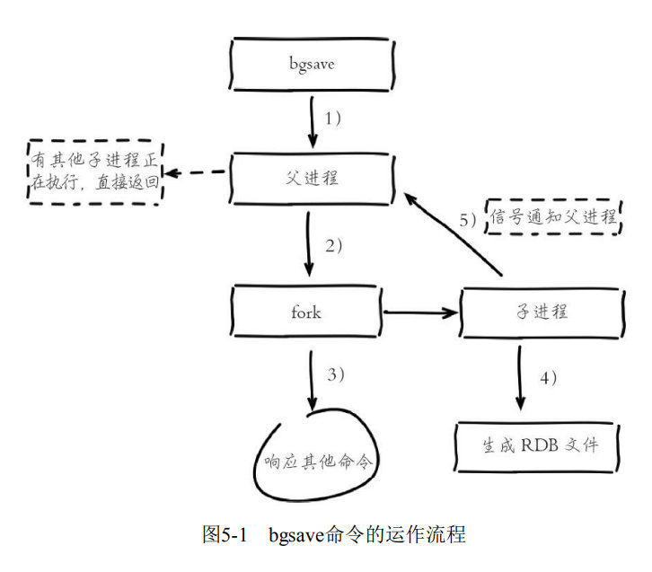{ align=right width=45% }
自动触发场景：

1. 使用save相关配置，如`save m n`。表示 m 秒内数据集存在 n 次修改时，自动触发 bgsave
2. 如果从节点执行全量复制操作，主节点自动执行 bgsave 生成RDB文件并发送给从节点
3. 执行`debug reload`命令重新加载Redis时，也会自动触发 save 操作
4. 默认情况下执行`shutdown`命令时，如果没有开启 AOF 持久化功能则自动执行 bgsave

如果Redis加载损坏的RDB文件时拒绝启动，此时可以使用Redis提供的`redis-check-dump`工具检测 RDB 文件并获取对应的错误报告。

#### RDB 的优缺点

RDB的优点：

- RDB是一个紧凑压缩的二进制文件，代表Redis在某个时间点上的数据快照。**非常适用于备份，全量复制等场景**。比如每6小时执行bgsave备份，并把RDB文件拷贝到远程机器或者文件系统中（如HDFS），用于灾难恢复。
- Redis加载RDB恢复数据远远快于AOF的方式。

RDB的缺点：

- RDB方式数据 **无法做到实时持久化/秒级持久化**。因为bgsave每次运行都要执行fork操作创建子进程，属于重量级操作，频繁执行成本过高。
- RDB文件使用特定二进制格式保存，Redis版本演进过程中有多个格式的RDB版本，存在老版本Redis服务无法兼容新版RDB格式的问题。

### AOF

AOF（Append Only File）持久化：以独立日志的方式记录每次写命令(类似于 MySQL 的 Binlog)，重启时再重新执行AOF文件中的命令达到恢复数据的目的。目前已经是Redis持久化的主流方式。

开启AOF功能需要设置配置：`appendonly yes`，默认不开启。AOF文件名通过`appendfilename`，配置设置，默认文件名是`appendonly.aof`。保存路径同 RDB 持久化方式一致，通过`dir`配置指定。

AOF缓冲区同步文件策略(参数`appendfsync`)

| 可配置值   | 说明                                                                                                             | 备注                 |
| ---------- | ---------------------------------------------------------------------------------------------------------------- | -------------------- |
| `always`   | 命令写入`aof_buf`后调用系统`fsync`操作同步到 AOF 文件，`fsync` 完成后线程返回                                    | 不建议               |
| `everysec` | 命令写入`aof_buf`后调用系统`write`操作，`write`完成后线程返回。`fsync`同步文件操作由专门线程每秒调用一次。       | 建议，为默认选项     |
| `no`       | 命令写入`aof_buf`后调用系统`write`操作，不对 AOF 文件做`fsync`同步，同步硬盘操作由 OS 负责，通常同步周期最长 30s | 数据安全无法得到保证 |

aof 重写过程可通过手动与自动方式触发。手动通过直接调用`bgrewriteaof`命令，自动方式则根据`auto-aof-rewrite-min-size`和`auto-aof-rewrite-percentage`的参数确定触发时机。

<div class="grid cards" markdown>
-  <figure>
    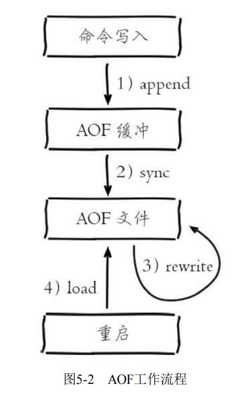
  </figure>
-  <figure>
    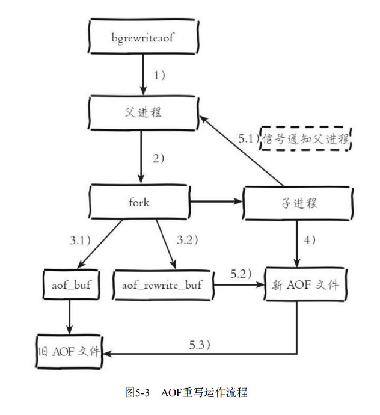
  </figure>
</div>

### 重启加载

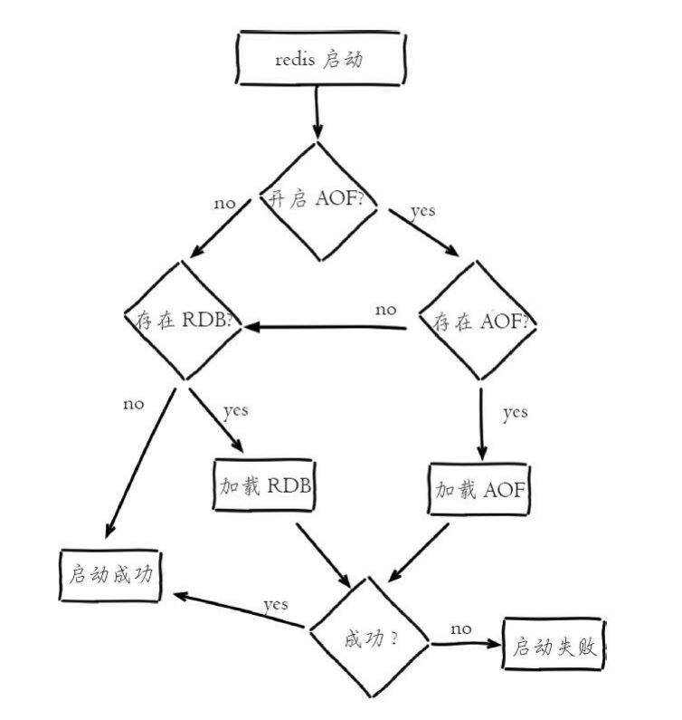{ align=right width=45% }
Redis 启动时会优先加载 AOF 文件，如果 AOF 不可加载，然后再加载 RDB 文件。其文件加载流程如图：

如果在加载 AOF 文件时发生错误，可以先进行备份，然后采用`redis-check-aof --fix`命令进行修复，修复后使用`diff -u`对比数据的差异，找出丢失的数据，有些可以人工修改补全。

AOF文件可能存在结尾不完整的情况，比如机器突然掉电导致AOF尾部文件命令写入不全。Redis为我们提供了`aof-load-truncated`配置来兼容这种情况，默认开启。加载AOF时，当遇到此问题时会忽略并继续启动，同时打印如下警告日志：

```
# !!! Warning: short read while loading the AOF file !!!
# !!! Truncating the AOF at offset 397856725 !!!
# AOF loaded anyway because aof-load-truncated is enabled
```

### 问题定位与优化

#### fork 操作

当 Redis 做 RDB 或 AOF 重写时，对于大多数操作系统来说 fork 是个重量级错误。fork操作耗时跟进程总内存量息息相关，如果使用虚拟化技术，特别是 Xen 虚拟机，fork 操作会更耗时。

对于高并发 Redis 实例，如果fork操作耗时在秒级别将拖慢 Redis 几万条命令执行，对线上应用延迟影响非常明显。正常情况下 fork 耗时应该是每 GB 消耗20毫秒左右。可以在`info stats`统计中查`latest_fork_usec`指标获取最近一次 fork 操作耗时，单位微秒。

改善fork操作的耗时：

1. 优先使用物理机或者高效支持fork操作的虚拟化技术，避免使用Xen。
2. 控制 Redis 实例最大可用内存，fork 耗时跟内存量成正比，线上建议每个 Redis 实例内存控制在 10GB 以内。
3. 合理配置 Linux 内存分配策略，避免物理内存不足导致 fork 失败。
4. 降低 fork 操作的频率，如适度放宽 AOF 自动触发时机，避免不必要的全量复制等。

#### 子进程开销监控和优化

#### CPU

- CPU开销分析。子进程负责把进程内的数据分批写入文件，这个过程属于CPU密集操作，通常子进程对单核CPU利用率接近90%.
- CPU消耗优化。Redis是CPU密集型服务，不要做绑定单核CPU操作。由于子进程非常消耗CPU，会和父进程产生单核资源竞争。
- 不要和其他CPU密集型服务部署在一起，造成CPU过度竞争。
- 如果部署多个Redis实例，尽量保证同一时刻只有一个子进程执行重写工作。

#### 硬盘开销

- 不要和其他高硬盘负载的服务部署在一起。如：存储服务、消息队列服务等。
- AOF重写时会消耗大量硬盘IO，可以开启配置`no-appendfsync-on-rewrite`，默认关闭。表示在AOF重写期间不做`fsync`操作。
- 当开启 AOF 功能的 Redis 用于高流量写入场景时，如果使用普通机械磁盘，写入吞吐一般在100MB/s左右，这时 Redis 实例的瓶颈主要在 AOF 同步硬盘上。
- 对于单机配置多个 Redis 实例的情况，可以配置不同实例分盘存储 AOF 文件，分摊硬盘写入压力。

> ⚠️ 配置no-appendfsync-on-rewrite=yes时，在极端情况下可能丢失整个AOF重写期间的数据，需要根据数据安全性决定是否配置。

#### AOF 追加阻塞

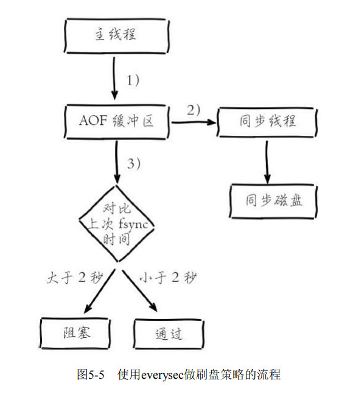{ align=right width=40% }
当 Redis 执行`fsync`同步时，如果系统硬盘繁忙，会造成 Redis 主线程的阻塞。

每当发生 AOF 追加阻塞事件发生时，在`info Persistence`统计中，`aof_delayed_fsync`指标会累加，查看这个指标方便定位 AOF 阻塞问题。AOF同步最多允许2秒的延迟，当延迟发生时说明硬盘存在高负载问题，可以通过监控工具如`iotop`，定位消耗硬盘IO资源的进程。

### 本章总结

- RDB使用一次性生成内存快照的方式，产生的文件紧凑压缩比更高，因此读取RDB恢复速度更快。由于每次生成RDB开销较大，**无法做到实时持久化，一般用于数据冷备和复制传输**。
- AOF通过追加写命令到文件实现持久化，通过`appendfsync`参数可以控制实时/秒级持久化。因为需要不断追加写命令，所以AOF文件体积逐渐变大，需要定期执行重写操作来降低文件体积。
- AOF重写可以通过`auto-aof-rewrite-min-size` 和 `auto-aof-rewritepercentage`参数控制自动触发，也可以使用`bgrewriteaof`命令手动触发。
- 子进程执行期间使用`copy-on-write`机制与父进程共享内存，避免内存消耗翻倍。AOF重写期间还需要维护重写缓冲区，保存新的写入命令避免数据丢失。

## 第 6 章 复制

### 建立复制

配置复制的三种方式

1. 在配置文件中加入`slaveof {masterHost} {masterPort}` 随Redis启动生效。
2. 在`redis-server`启动命令后加入`--slaveof {masterHost} {masterPort}` 生效。
3. 直接使用命令`slaveof {masterHost} {masterPort}`生效。

主从节点复制成功建立后，可以使用`info replication`命令查看复制相关状态。

### 断开复制

`slaveof`命令不但可以建立复制，还可以在从节点执行`slaveof no one`来断开与主节点复制关系。同时，`slaveof {newMasterIp} {newMasterPort}`还可以实现切主操作，更换主节点。

> ⚠️ 切主后从节点会清空之前所有的数据，线上人工操作时小心slaveof在错误的节点上执行或者指向错误的主节点。

对于数据比较重要的节点，主节点会通过设置`requirepass`参数进行密码验证，这时所有的客户端访问必须使用`auth`命令实行校验。

默认情况下，从节点使用`slave-read-only=yes`配置为只读模式。由于复制只能从主节点到从节点，对于从节点的任何修改主节点都无法感知，修改从节点会造成主从数据不一致。因此建议线上不要修改从节点的只读模式。

Redis为我们提供了`repl-disable-tcp-nodelay`参数用于控制是否关闭`TCP_NODELAY`，默认关闭，说明如下：

- 当关闭时，主节点产生的命令数据无论大小都会及时地发送给从节点，这样主从之间延迟会变小，但增加了网络带宽的消耗。适用于主从之间的网络环境良好的场景，如同机架或同机房部署。
- 当开启时，主节点会合并较小的TCP数据包从而节省带宽。默认发送时间间隔取决于Linux的内核，一般默认为40毫秒。这种配置节省了带宽但增大主从之间的延迟。适用于主从网络环境复杂或带宽紧张的场景，如跨机房部署。

### 拓扑

根据拓扑的复杂性，可分为三种：一主一从、一主多从、树状主从结构。

#### 一主一从

当应用写命令并发量较高且需要持久化时，可以只在从节点上开启AOF，这样既保证数据安全性同时也避免了持久化对主节点的性能干扰。但需要注意的是，当主节点关闭持久化功能时，如果主节点脱机要避免自动重启操作。因为主节点之前没有开启持久化功能自动重启后数据集为空，这时从节点如果继续复制主节点会导致从节点数据也被清空的情况，丧失了持久化的意义。安全的做法是在从节点上执行`slaveof no one`断开与主节点的复制关系，再重启主节点从而避免这一问题。

#### 一主多从

对于写并发量较高的场景，多个从节点会导致主节点写命令的多次发送从而过度消耗网络带宽，同时也加重了主节点的负载影响服务稳定性。

#### 树状主从结构

当主节点需要挂载多个从节点时为了避免对主节点的性能干扰，可以采用树状主从结构降低主节点压力。

### 原理

<figure markdown>
  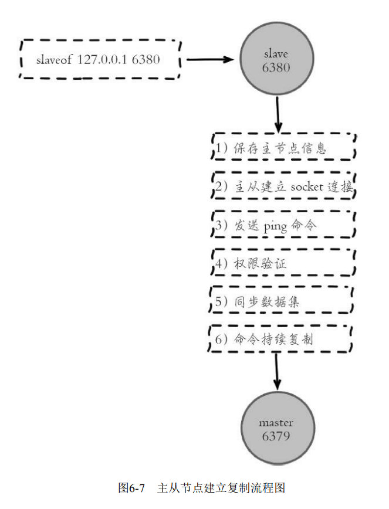{ width=60% }
</figure>

#### 数据同步

Redis 在初次复制时，会进行全量复制，之后便会根据主从节点的复制偏移量进行`psync`增量复制。

`psync`命令运行需要以下组件支持：

- 主从节点各自复制偏移量。
- 主节点复制积压缓冲区。
- 主节点运行id。

#### 复制偏移量

参与复制的主从节点都会维护自身复制偏移量。主节点在理完写入命令后，会把命令的字节长度做累加记录，统计信息在`info relication`中的`master_repl_offset`指标中，从节点会每秒钟上报自身的复制偏移量给主节点，因此主节点也会保存从节点的复制偏移量。从节点在接收到主节点发送的命令后，也会累加记录自身的偏移量。统计信息在`info relication`中的`slave_repl_offset`指标中。

可以通过主节点的统计信息，计算出`master_repl_offset_slave_offset`字节量，判断主从节点复制相差的数据量，根据这个差值判定当前复制的健康度。如果主从之间复制偏移量相差较大，则可能是网络延迟或命令阻塞等原因引起。

#### 复制积压缓冲区

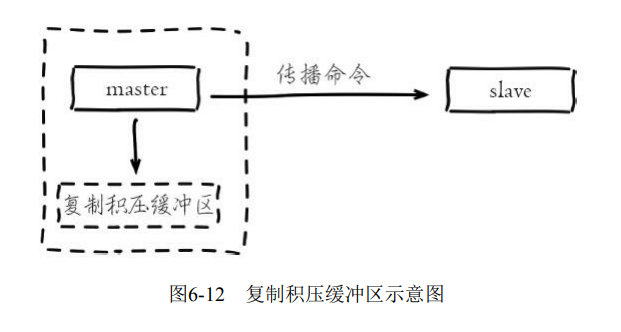{ align=right width=50% }
主节点响应从节点的同步时，不但会把命令发送给从节点，还会写入复制积压缓冲区。由于缓冲区本质上是先进先出的定长队列，所以能实现保存最近已复制数据的功能，用于部分复制和复制命令丢失的数据补救。复制缓冲区相关统计信息保存在主节点的`info replication`中。

#### 主节点运行ID

每个Redis节点启动后都会动态分配一个40位的十六进制字符串作为运行ID。运行ID的主要作用是用来唯一识别Redis节点，比如从节点保存主节点的运行ID识别自己正在复制的是哪个主节点。如果只使用ip+port的方式识别主节点，那么主节点重启变更了整体数据集（如替换RDB/AOF文件），从节点再基于偏移量复制数据将是不安全的，因此当运行ID变化后从节点将做全量复制。可以运行`info server`命令查看当前节点的运行ID。

当需要调优一些内存相关配置，例如：`hash-max-ziplist-value`等，这些配置需要Redis重新加载才能优化已存在的数据，这时可以使用`debug reload`命令重新加载 RDB 并保持运行 ID 不变，从而有效避免不必要的全量复制。

> debug reload命令会阻塞当前Redis节点主线程，阻塞期间会生成本地RDB快照并清空数据之后再加载RDB文件。因此对于大数据量的主节点和无法容忍阻塞的应用场景，谨慎使用。

#### psync 命令

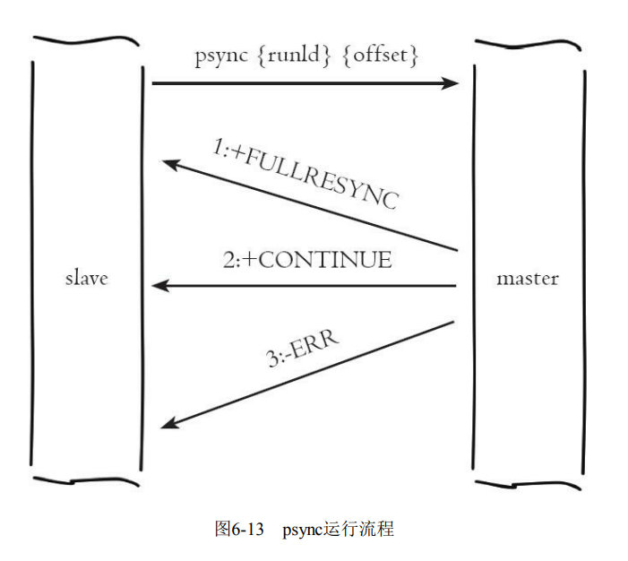{ align=right width=40% }

从节点使用`psync`命令完成部分复制和全量复制功能，命令格式：`psync {runId} {offset}`

主节点回复`+FULLRESYNC {runId} {offset}`会触发全量复制，`+CONTINUE`则触发增量复制。

#### 全量同步 & 增量同步

对于从节点开始接收RDB快照到接收完成期间，主节点仍然响应读写命令，因此主节点会把这期间写命令数据保存在复制客户端缓冲区内，当从节点加载完RDB文件后，主节点再把缓冲区内的数据发送给从节点，保证主从之间数据一致性。如果 RDB 文件过大，超过预设的 timeout，则会终止全量同步，并清除已下载临时文件。如果在高并发写的场景，主节点的缓冲区被写满，同样会导致同步的失败。

全量复制的主要时间开销在：

- 主节点 `bgsave` 时间
- RDB 文件网络传输时间
- 从节点清空数据时间
- 从节点加载 RDB 时间
- 可能的 AOF 重写时间

<div class="grid cards" markdown>
-  <figure>
    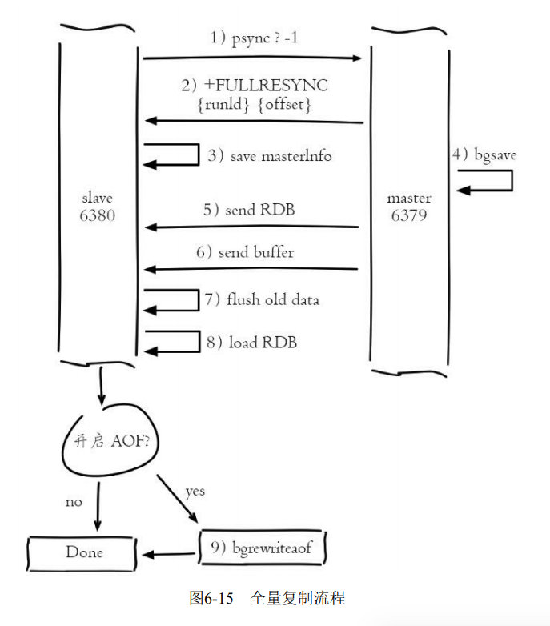
  </figure>
-  <figure>
    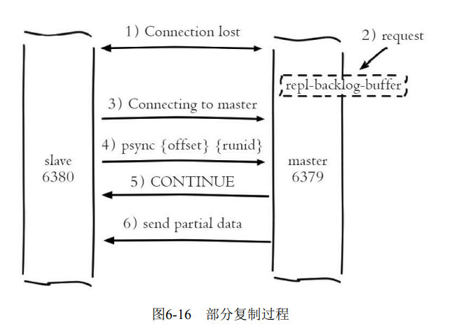
  </figure>
</div>

#### 心跳

主从心跳判断机制：

- 通过`client list`命令查看复制相关客户端信息，主节点的连接状态为`flags=M`，从节点连接状态为`flags=S`。
- 主节点默认每隔10秒对从节点发送`ping`命令，判断从节点的存活性和连接状态。可通过参数`repl-ping-slave-period`控制发送频率。
- 从节点在主线程中每隔1秒发送`replconf ack{offset}`命令，给主节点上报自身当前的复制偏移量。`replconf`命令主要作用如下：
    - 实时监测主从节点网络状态
    - 上报自身复制偏移量，检查复制数据是否丢失，如果从节点数据丢失，再从主节点的复制缓冲区中拉取丢失数据
    - 实现保证从节点的数量和延迟性功能，通过min-slaves-to-write、minslaves-max-lag参数配置定义

> 我们经常会遇到数据同步的问题，但如何在消耗最少的资源下保证数据的一致性是我们一直会遇到的问题，好在，很多成熟的 软件已经为我们提供了借鉴的方案，如 Git 的 hash chain，Redis 的 psync 偏移量增量复制与缓冲区，以及 MySQL 的binlog。没有最好的方案，只有最合适的方案，或许我们能从中得到启发，找到最适合自己的增量同步方式。

### 开发与运维中的问题

#### 数据延时

Redis复制数据的延迟由于异步复制特性是无法避免的，延迟取决于网络带宽和命令阻塞情况。需要业务场景允许短时间内的数据延迟。对于无法容忍大量延迟场景，可以编写外部监控程序监听主从节点的复制偏移量，当延迟较大时触发报警或者通知客户端避免读取延迟过高的从节点。

#### 读到过期数据

惰性删除：主节点将过期的键同步给从节点 定时删除：主节点轮询采样一定数量的键，当采样的键过期后，同步给从节点。 Redis 3.2+ 在从节点读取键时会校验是否过期以判断是否返回数据。

#### 从节点故障

下线故障节点。

> 当主节点优化空间不大时再考虑扩展。笔者建议大家在做读写分离之前，可以考虑使用Redis Cluster等分布式解决方案，这样不止扩展了读性能还可以扩展写性能和可支撑数据规模，并且一致性和故障转移也可以得到保证，对于客户端的维护逻辑也相对容易。

#### 规避全量复制

- 第一次建立复制：由于是第一次建立复制，从节点不包含任何主节点数据，因此必须进行全量复制才能完成数据同步。对于这种情况全量复制无法避免。当对数据量较大且流量较高的主节点添加从节点时，建议在低峰时进行操作，或者尽量规避使用大数据量的Redis节点。
- 节点运行ID不匹配：当主从复制关系建立后，从节点会保存主节点的运行ID，如果此时主节点因故障重启，那么它的运行ID会改变，从节点发现主节点运行ID不匹配时，会认为自己复制的是一个新的主节点从而进行全量复制。对于这种情况应该从架构上规避，比如提供故障转移功能。当主节点发生故障后，手动提升从节点为主节点或者采用支持自动故障转移的哨兵或集群方案。
- 复制积压缓冲区不足：当主从节点网络中断后，从节点再次连上主节点时会发送`psync {offset} {runId}`命令请求部分复制，**如果请求的偏移量不在主节点的积压缓冲区内，则无法提供给从节点数据，因此部分复制会退化为全量复制**。此时需要保证`repl_backlog_size > net_break_time*write_size_per_minute`以避免缓冲区不足引发的全量复制。

#### 规避复制风暴

#### 单主节点复制风暴

一般发生在主节点挂载多个从节点的场景。当主节点重启恢复后，从节点会发起全量复制流程，这时主节点就会为从节点创建RDB快照，如果在快照创建完毕之前，有多个从节点都尝试与主节点进行全量同步，那么其他从节点将共享这份RDB快照，同时向多个从节点发送RDB快照，可能使主节点的网络带宽消耗严重，造成主节点的延迟变大，极端情况会发生主从节点连接断开，导致复制失败。 解决方案可以减少主节点挂载的从节点数量，或者采用树形复制结构(这种树状结构也带来了运维的复杂性，增加了手动和自动处理故障转移的难度)。

#### 单机器复制风暴

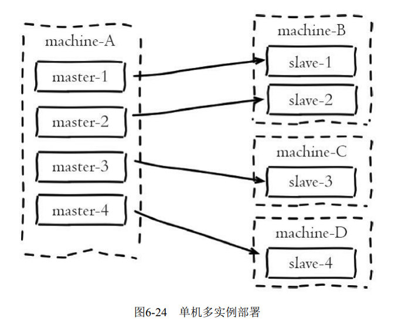{ align=right width=40% }

- 应该把主节点尽量分散在多台机器上，避免在单台机器上部署过多的主节点。
- 当主节点所在机器故障后提供故障转移机制，避免机器恢复后进行密集的全量复制。

## 第 7 章 阻塞

发生阻塞会有内在与外在原因：

- 内在原因：不合理地使用API或数据结构、CPU饱和、持久化阻塞等
- 外在原因：CPU竞争、内存交换、网络问题等

### 内因

#### 如何发现慢查询

执行`slowlog get {n}`获取最近的 n 条慢查询命令，线上实例建议设置为1毫秒便于及时发现毫秒级以上的命令。如果命令执行时间在毫秒级，则实例实际OPS只有1000左右。慢查询队列长度默认128，可适当调大。慢查询本身只记录了命令执行时间，不包括数据网络传输时间和命令排队时间，因此客户端发生阻塞异常后，可能不是当前命令缓慢，而是在等待其他命令执行。需要重点比对异常和慢查询发生的时间点，确认是否有慢查询造成的命令阻塞排队。

解决慢查询

- 修改为低算法度的命令，如`hgetall`改为`hmget`等，禁用`keys`、`sort`等命令。
- 调整大对象：缩减大对象数据或把大对象拆分为多个小对象，防止一次命令操作过多的数据。大对象拆分过程需要具体的业务决定，如用户好友集合存储在Redis中，有些热点用户会关注大量好友，这时可以按时间或其他维度拆分到多个集合中。

#### 如何发现大对象

Redis本身提供发现大对象的工具`redis-cli -h{ip} -p{port} bigkeys`。内部原理采用分段进行`scan`操作，把历史扫描过的最大对象统计出来便于分析优化，

#### CPU饱和

使用`top`命令很容易识别出对应Redis进程的CPU使用率。CPU饱和是非常危险的，将导致Redis无法处理更多的命令，严重影响吞吐量和应用方的稳定性。对于这种情况，首先判断当前Redis的并发量是否达到极限，建议使用统计命令`redis-cli -h{ip} -p{port} --stat`获取当前Redis使用情况，该命令每秒输出一行统计信息。

#### 持久化阻塞

持久化引起主线程阻塞的操作主要有：

- fork阻塞
  fork 阻塞可以执行`info stats`命令获取到`latest_fork_usec`指标，表示Redis最近一次fork操作耗时，如果耗时很大，比如超过1秒，则需要做出优化调整，如避免使用过大的内存实例和规避fork缓慢的操作系统等。
- AOF刷盘阻塞
  AOF刷盘阻塞主要是硬盘压力引起，可以查看Redis日志识别出这种情况。硬盘压力可能是Redis进程引起的，也可能是其他进程引起的，可以使用`iotop`查看具体是哪个进程消耗过多的硬盘资源。
- HugePage写操作阻塞
  子进程在执行重写期间利用Linux写时复制技术降低内存开销，因此只有写操作时Redis才复制要修改的内存页。对于开启Transparent HugePages的操作系统，每次写命令引起的复制内存页单位由4K变为2MB，放大了512倍，会拖慢写操作的执行时间，导致大量写操作慢查询。例如简单的incr命令也会出现在慢查询中。关于Transparent HugePages的细节见第12章的12.1节“Linux配置优化”。

> Redis 对阻塞问题的说明：https://redis.io/topics/latency

### 外因

#### CPU 竞争

进程竞争：Redis是典型的CPU密集型应用，不建议和其他多核CPU密集型服务部署在一起。当其他进程过度消耗CPU时，将严重影响Redis吞吐量。可以通过`top`、`sar`等命令定位到CPU消耗的时间点和具体进程，这个问题比较容易发现，需要调整服务之间部署结构。 绑定CPU：部署Redis时为了充分利用多核CPU，通常一台机器部署多个实例。常见的一种优化是把Redis进程绑定到CPU上，用于降低CPU频繁上下文切换的开销。但当Redis父进程创建子进程进行RDB/AOF重写时，如果做了CPU绑定，会与父进程共享使用一个CPU。子进程重写时对单核CPU使用率通常在90%以上，父进程与子进程将产生激烈CPU竞争，极大影响Redis稳定性。因此对于开启了持久化或参与复制的主节点不建议绑定CPU。

#### 内存交换

内存交换（swap）对于Redis来说是非常致命的，Redis保证高性能的一个重要前提是所有的数据在内存中。如果操作系统把Redis使用的部分内存换出到硬盘，由于内存与硬盘读写速度差几个数量级，会导致发生交换后的Redis性能急剧下降。

判断 Redis 是否内存交换的方法：

1. 查询 Redis 的进程号：`# redis-cli -p 6379 info server | grep process_id` // process_id:4476
2. 根据进程号查询内存交换信息：`# cat /proc/4476/smaps | grep Swap` 如果交换量都是0KB或者个别的是4KB，则是正常现象，说明Redis进程内存没有被交换。

预防 Redis 的内存交换

- 保证机器可用内存充足
- 确保所有 Redis 实例设置最大可用内存(maxmemory)
- 降低系统使用swap优先级，如`echo10>/proc/sys/vm/swappiness`

#### 网络问题

Redis连接拒绝：Redis通过maxclients参数控制客户端最大连接数，默认10000。当Redis连接数大于`maxclients`时会拒绝新的连接进入，`info stats`的`rejected_connections`统计指标记录所有被拒绝连接的数量。客户端访问Redis时尽量采用NIO长连接或者连接池的方式。Redis 默认不会主动关闭长时间闲置连接或检查关闭无效的TCP连接，因此会导致Redis连接数快速消耗且无法释放的问题，此时可设置`tcp-keepalive`和`timeout`参数让Redis主动检查和关闭无效连接。

连接溢出：OS 一般会对进程使用的资源做限制，其中一项是对进程可打开最大文件数控制，默认 1024，对需要支撑高并发的 Redis 需要调大该限制。

常见的物理拓扑按网络延迟由快到慢可分为：同物理机>同机架>跨机架>同机房>同城机房>异地机房。但它们容灾性正好相反。

## 第 8 章 理解内存

内存消耗可以分为进程自身消耗和子进程消耗。

### 内存消耗

#### 内存消耗统计

通过`info memory`命令获取内存相关指标，指标说明如下表：

| 属性名                    | 属性说明                                                      |
| ------------------------- | ------------------------------------------------------------- |
| `used_memory`             | Redis分配器分配的内存总量，也就是内部存储的所有数据内存占用量 |
| `used_memory_human`       | 以可读的格式返回`used memory`                                 |
| `used_memory_rss`         | 从操作系统的角度显示Redis进程占用的物理内存总量               |
| `used_memory_peak`        | 内存使用的最大值，表示`used memory`的峰值                     |
| `used_memory_peak_human`  | 以可读的格式返回`used_memory_peak`                            |
| `used_memory_lua`         | Lua 引擎所消耗的内存大小                                      |
| `mem_fragmentation_ratio` | `used_memory_rss/used_memory`比值，表示内存碎片率             |
| `mem_allocator`           | Redis 所使用的内存分配器，默认为 jemalloc                     |

当`mem_fragmentation_ratio > 1`时，说明`used_memory_rss-used_memory`多出的部分内存并没有用于数据存储，而是被内存碎片所消耗，如果两者相差很大，说明碎片率严重。 当`mem_fragmentation_ratio < 1`时，这种情况一般出现在操作系统把Redis内存交换（Swap）到硬盘导致，出现这种情况时要格外关注，由于硬盘速度远远慢于内存，Redis性能会变得很差，甚至僵死。

#### 内存消耗划分

内存碎片问题虽然是所有内存服务的通病，但是jemalloc针对碎片化问题专门做了优化，一般不会存在过度碎片化的问题，正常的碎片率（`mem_fragmentation_ratio`）在1.03左右。但是当存储的数据长短差异较大时，以下场景容易出现高内存碎片问题：

- 频繁做更新操作，例如频繁对已存在的键执行`append`、`setrange`等更新操作。
- 大量过期键删除，键对象过期删除后，释放的空间无法得到充分利用，导致碎片率上升。

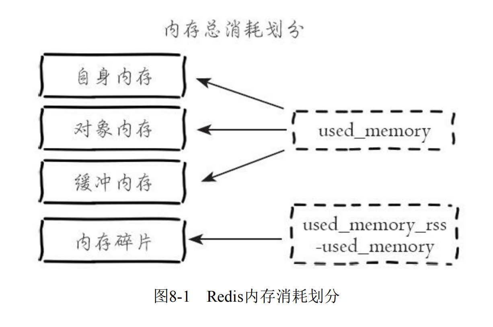{ align=right width=40% }

出现高内存碎片问题时常见的解决方式如下：

- 数据对齐：在条件允许的情况下尽量做数据对齐，比如数据尽量采用数字类型或者固定长度字符串等，但是这要视具体的业务而定，有些场景无法做到。
- 安全重启：重启节点可以做到内存碎片重新整理，因此可以利用高可用架构，如Sentinel或Cluster，将碎片率过高的主节点转换为从节点，进行安全重启。

#### 子进程内存消耗

- Redis产生的子进程并不需要消耗1倍的父进程内存，实际消耗根据期间写入命令量决定，但是依然要预留出一些内存防止溢出。
- 需要设置`sysctl vm.overcommit_memory = 1`允许内核可以分配所有的物理内存，防止Redis进程执行fork时因系统剩余内存不足而失败。
- 排查当前系统是否支持并开启THP，如果开启，建议关闭，防止`copy-onwrite`期间内存过度消耗。如果在高并发写的场景下开启THP，子进程内存消耗可能是父进程的数倍，极易造成机器物理内存溢出，从而触发SWAP或OOM killer。

### 内存管理

Redis主要通过控制内存上限和回收策略实现内存管理。

#### 设置内存上限

Redis使用`maxmemory`参数限制最大可用内存。需要注意，`maxmemory`限制的是Redis实际使用的内存量，也就是`used_memory`统计项对应的内存。由于内存碎片率的存在，实际消耗的内存可能会比`maxmemory`设置的更大，实际使用时要小心这部分内存溢出。通过设置内存上限可以非常方便地实现一台服务器部署多个Redis进程的内存控制。比如一台24GB内存的服务器，为系统预留4GB内存，预留4GB空闲内存给其他进程或Redis fork进程，留给Redis16GB内存，这样可以部署4个`maxmemory=4GB`的Redis进程。得益于Redis单线程架构和内存限制机制，即使没有采用虚拟化，不同的Redis进程之间也可以很好地实现CPU和内存的隔离性，

#### 动态调整内存上限

Redis的内存上限可以通过`config set maxmemory`进行动态修改。该方式过于简单，推荐使用哨兵或者集群来处理。

Redis默认无限使用服务器内存，为防止极端情况下导致系统内存耗尽，建议所有的Redis进程都要配置`maxmemory`。

#### 内存回收策略

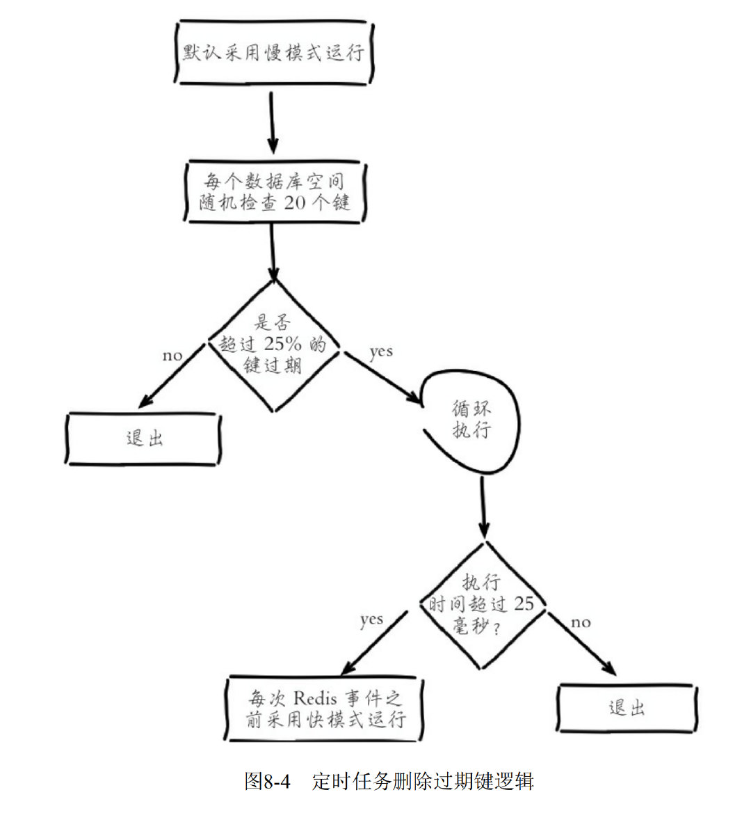{ align=right width=40% }
Redis的内存回收机制分为删除过期的键对象，与内存使用达到maxmemory上限时触发内存溢出控制策略。

Redis所有的键都可以设置过期属性，内部保存在过期字典中。由于进程内保存大量的键，维护每个键精准的过期删除机制会导致消耗大量的CPU，对于单线程的Redis来说成本过高，因此Redis采用惰性删除和定时任务删除机制实现过期键的内存回收。

<div style="clear: both;"></div>

Redis 的内存溢出有 6 种控制策略，可通过`config set maxmemory-policy {policy}`配置

1. noeviction：默认策略，不会删除任何数据，拒绝所有写入操作并返回客户端错误信息（error）OOM command not allowed when used memory，此时 Redis 只响应读操作。
2. volatile-lru：根据 LRU 算法删除设置了超时属性（expire）的键，直到腾出足够空间为止。如果没有可删除的键对象，回退到 noeviction 策略。
3. allkeys-lru：根据 LRU 算法删除键，不管数据有没有设置超时属性，直到腾出足够空间为止。
4. allkeys-random：随机删除所有键，直到腾出足够空间为止。
5. volatile-random：随机删除过期键，直到腾出足够空间为止。
6. volatile-ttl：根据键值对象的 ttl 属性，删除最近将要过期数据。如果没有，回退到 noeviction 策略。

频繁执行回收内存成本很高，会导致 Redis 的性能下降，如果当前Redis有从节点，回收内存操作对应的删除命令会同步到从节点，导致写放大的问题。

### 内存优化

#### redisObject对象

Redis存储的所有值对象在内部定义为redisObject结构体，内部结构如图：

<figure markdown>
  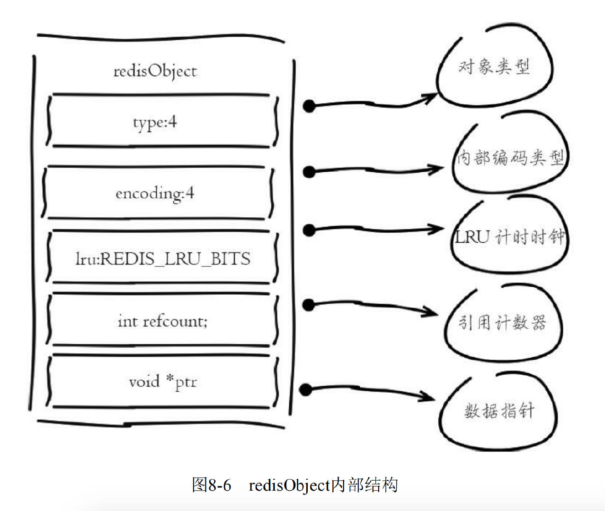{ width=50% }
</figure>

- type字段：表示当前对象使用的数据类型，可以使用`type {key}`命令查看对象所属类型
- encoding 字段：Redis内部编码类型
- lru 字段：记录对象最后一次被访问的时间，当配置了`maxmemory`和`maxmemory-policy=volatile-lru`或者`allkeys-lru`时，用于辅助LRU算法删除键数据。可以使用`object idletime {key}`命令在不更新lru字段情况下查看当前键的空闲时间。
- refcount字段：记录当前对象被引用的次数，用于通过引用次数回收内存，当`refcount=0`时，可以安全回收当前对象空间。
- `*ptr`字段：与对象的数据内容相关，如果是整数，直接存储数据；否则表示指向数据的指针。Redis在3.0之后对值对象是字符串且长度<=39字节的数据，内部编码为`embstr`类型，字符串`sds`和`redisObject`一起分配，从而 **只要一次内存操作即可**。

#### 缩减键值对象

降低Redis内存使用最直接的方式就是缩减键（key）和值（value）的长度。

- key长度：如在设计键时，在完整描述业务情况下，键值越短越好。如`user：{uid}：friends：notify：{fid}`可以简化为`u：{uid}：fs：nt：{fid}`
- value长度：值对象缩减比较复杂，常见需求是把业务对象序列化成二进制数组放入Redis。首先应该 **在业务上精简业务对象，去掉不必要的属性避免存储无效数据**。其次在序列化工具选择上，应该 **选择更高效的序列化工具来降低字节数组大小**。值对象除了存储二进制数据之外，通常还会使用通用格式存储数据比如：json、xml等作为字符串存储在Redis中。这种方式优点是方便调试和跨语言，但是同样的数据相比字节数组所需的空间更大，在内存紧张的情况下，可以使用通用压缩算法压缩json、xml后再存入Redis，从而降低内存占用，例如使用GZIP压缩后的json可降低约60%的空间。（当频繁压缩解压json等文本数据时，开发人员需要考虑压缩速度和计算开销成本，这里推荐使用Google的Snappy压缩工具，在特定的压缩率情况下效率远远高于GZIP等传统压缩工具，且支持所有主流语言环境。）

#### 字符串优化

Redis没有采用原生C语言的字符串类型而是自己实现了字符串结构，内部简单动态字符串（simple dynamic string，SDS）。

Redis自身实现的字符串结构有如下特点：

- $O(1)$时间复杂度获取：字符串长度、已用长度、未用长度。
- 可用于保存字节数组，支持安全的二进制数据存储。
- 内部实现空间预分配机制，降低内存再分配次数。
- 惰性删除机制，字符串缩减后的空间不释放，作为预分配空间保留。

字符串之所以采用预分配的方式是防止修改操作需要不断重分配内存和字节数据拷贝。但同样也会造成内存的浪费。我们需要尽量减少字符串频繁修改操作如`append`、`setrange`可能导致的预分配容量翻倍（内存碎片率上升）的问题。

<figure markdown>
  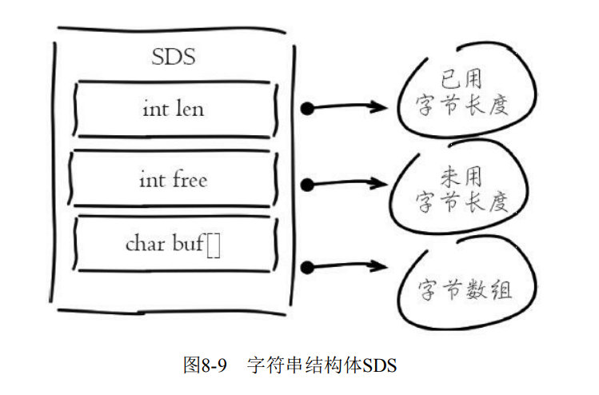{ width=60% }
</figure>

字符串重构：指 **不一定把每份数据作为字符串整体存储，像json这样的数据可以使用hash结构，使用二级结构存储也能帮我们节省内存**。同时可以使用`hmget`、`hmset`命令支持字段的部分读取修改，而不用每次整体存取。如下面的json数据：

```json
{
    "vid": "413368768",
    "title": "搜狐屌丝男士",
    "videoAlbumPic": "http://photocdn.sohu.com/60160518/vrsa_ver8400079_ae433_pic26.jpg",
    "pid": "6494271",
    "type": "1024",
    "playlist": "6494271",
    "playTime": "468"
}
```

测试内存表现

| 数据量 | key    | 存储类型 | value        | 配置                      | 内存占用 |
| ------ | ------ | -------- | ------------ | ------------------------- | -------- |
| 200w   | 20字节 | string   | json 字符串  | 默认                      | 612.2M   |
| 200w   | 20字节 | hash     | key-value 对 | 默认                      | 1.88G    |
| 200w   | 20字节 | hash     | key-value 对 | hash-max-ziplist-value:66 | 535.60M  |

根据测试结构，第一次默认配置下使用hash类型，内存消耗不但没有降低反而比字符串存储多出2倍，而调整`hash-max-ziplist-value=66`之后内存降低为535.60M。因为json的`videoAlbumPic`属性长度是65，而`hash-max-ziplist-value`默认值是64，Redis采用`hashtable`编码方式，反而消耗了大量内存。调整配置后hash类型内部编码方式变为`ziplist`，相比字符串更省内存且支持属性的部分操作。

#### 编码优化

| 类型   | 编码方式   | 数据结构                 |
| ------ | ---------- | ------------------------ |
| string | raw        | 动态字符串编码           |
|        | embstr     | 优化内存分配的字符串编码 |
|        | int        | 整数编码                 |
| hash   | hashtable  | 散列表编码               |
|        | ziplist    | 压缩列表编码             |
| list   | linkedlist | 双向链表编码             |
|        | ziplist    | 压缩列表编码             |
|        | quicklist  |                          |
| set    | hashtable  | 散列表编码               |
|        | intset     | 整数集合编码             |
| zset   | skiplist   | 跳跃表编码               |
|        | ziplist    | 压缩列表编码             |

Redis 对一种数据结构实现多种编码方式主要原因是Redis作者想通过不同编码实现效率和空间的平衡。比如当我们的存储只有10个元素的列表，当使用双向链表数据结构时，必然需要维护大量的内部字段如每个元素需要：前置指针，后置指针，数据指针等，造成空间浪费，如果采用连续内存结构的压缩列表（ziplist），将会节省大量内存，而由于数据长度较小，存取操作时间复杂度即使为 $O(n^2)$ 性能也可满足需求。

| 类型 | 编码       | 决定条件                                                                                                                                                                      |
| ---- | ---------- | ----------------------------------------------------------------------------------------------------------------------------------------------------------------------------- |
| hash | ziplist    | 满足所有条件：value 最大空间（字节）<= `hash-max-ziplist-valuefield` 个数 <= `hash-max-ziplist-entries`                                                                       |
|      | hashtable  | 满足任意条件：value 最大空间（字节）> `hash-max-ziplist-valuefield` 个数 > `hash-max-ziplist-entries`                                                                         |
| list | ziplist    | 满足所有条件：value 最大空间（字节）<= `list-max-ziplist-value`链表长度 <= `list-max-ziplist-entries`                                                                         |
|      | linkedlist | 满足任意条件：value 最大空间（字节）> `list-max-ziplist-value`链表长度 > `list-max-ziplist-entries`                                                                           |
|      | quicklist  | list-max-ziplist-size：表示最大压缩空间或长度最大空间使用[-5-1]范围配置，默认-2 表示 8KB正整数表示最大压缩长度 <br>list-compress-depth：表示最大压缩深度，默认为 0 表示不压缩 |
| set  | intset     | 满足所有条件：元素必须为整数集合长度 <= `set-max-intset-entries`                                                                                                              |
|      | hashtable  | 满足任意条件：元素非整数类型集合长度 > `set-max-ziplist-entries`                                                                                                              |
| zset | ziplist    | 满足所有条件：value 最大空间（字节）<= `zset-max-ziplist-value`有序集合长度 <= `zset-max-ziplist-entries`                                                                     |
|      | skiplist   | 满足任意条件：value 最大空间（字节）> `zset-max-ziplist-value`有序集合长度 > `zset-max-ziplist-entries`                                                                       |

ziplist编码主要目的是为了节约内存，因此所有数据都是采用线性连续的内存结构。ziplist编码是应用范围最广的一种，可以分别作为hash、list、zset类型的底层数据结构实现。其内部结构如图：

<figure markdown>
  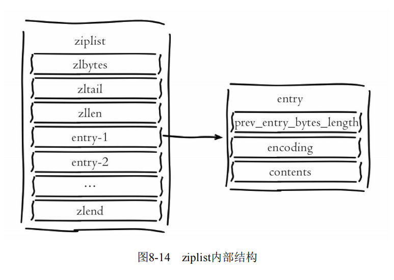{ width=50% }
</figure>

ziplist特点如下：

- 内部表现为数据紧凑排列的一块连续内存数组。
- 可以模拟双向链表结构，以 $O(1)$ 时间复杂度入队和出队。
- 新增删除操作涉及内存重新分配或释放，加大了操作的复杂性。(**ziplist压缩编码的原则：追求空间和时间的平衡**)
- 读写操作涉及复杂的指针移动，最坏时间复杂度为 $O(n^2)$。
- **适合存储小对象和长度有限的数据**。

> 我们可以看到，Redis 通过多种手段来保障性能，如单线程、epoll、基于内存操作、内存预分配、自动切换合理的数据结构等，作者在这方便做了很多的努力，所以才会有很多O(1)复杂度方法，日后才能大行其道，这其中我们可以借鉴的经验俯拾皆是，足见作者是一个有追求的 coder，相信 Redis 的源码会给与我们更多的启发。

#### 控制键的数量

对于存储相同的数据内容利用Redis的数据结构(如hash)降低外层键的数量，也可以节省大量内存。

建议使用Redis存储大量数据时，把内存优化环节加入到前期设计阶段，否则数据大幅增长后，开发人员需要面对重新优化内存所带来开发和数据迁移的双重成本。**当Redis内存不足时，首先考虑的问题不是加机器做水平扩展，应该先尝试做内存优化，当遇到瓶颈时，再去考虑水平扩展**。即使对于集群化方案，垂直层面优化也同样重要，避免不必要的资源浪费和集群化后的管理成本。

### 优化总结

内存是相对宝贵的资源，通过合理的优化可以有效地降低内存的使用量，内存优化的思路包括

- 精简键值对大小，使用高效二进制序列化工具。
- 使用对象共享池优化小整数对象。
- 数据优先使用整数，比字符串类型更节省空间。
- 优化字符串使用，避免预分配造成的内存浪费。
- 使用`ziplist`压缩编码优化`hash`、`list`等结构，注重效率和空间的平衡。
- 使用`intset`编码优化整数集合。
- 使用`ziplist`编码的`hash`结构降低小对象链规模。

## 第 9 章 哨兵

### 基础概念

主从模式下存在的问题：

1. 主节点宕机的故障转移需要人工介入恢复（👉 哨兵）
2. 主节点的写能力与存储能力受到单机的限制（👉 集群）

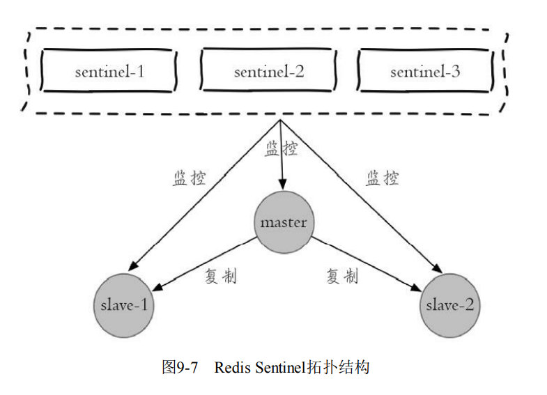{ align=right width=40% }
Redis Sentinel 具有以下几个功能：

- 监控：Sentinel节点会定期检测Redis数据节点、其余Sentinel节点是否可达。
- 通知：Sentinel节点会将故障转移的结果通知给应用方。
- 主节点故障转移：实现从节点晋升为主节点并维护后续正确的主从关系。
- 配置提供者：在Redis Sentinel结构中，客户端在初始化的时候连接的是Sentinel节点集合，从中获取主节点信息。

### 部署

从节点的部署与主节点的基本一致，只是添加了`slaveof`配置。 可通过`info replication`命令查看从节点或所属主节点。

哨兵节点配置信息如下：

```bash
redis-sentinel-26379.conf
port 26379                                                      // 哨兵默认端口
daemonize yes
logfile "26379.log"                                             // 日志文件
dir /opt/soft/redis/data
sentinel monitor mymaster 127.0.0.1 6379 2                      // 该哨兵监控 mymaster 127.0.0.1 6379 的主节点，同时需要 2 个哨兵判断故障才会进行故障转移。故障判定参数 quorum 建议设置为哨兵节点数量的一般加 1，同时该参数还与哨兵节点的领导者选举有关，至少需要有 `max(quorum, num(sentinels)/2 + 1)`个节点参与选举，才能选出哨兵领导者
sentinel down-after-milliseconds mymaster 30000                 // 监控节点的超时时间
sentinel parallel-syncs mymaster 1                              // 用于限制一次故障转移后，每次向新的主节点发起复制操作的从节点个数。同时向主节点发起复制，必然会对主机诶单所在机器造成网络与磁盘开销
sentinel failover-timeout mymaster 180000                       // 故障转移超时时间
# sentinel auth-pass <master-name> <password>
# sentinel notification-script <master-name> <script-path>      // 在故障转移期间的告警事件脚本
# sentinel client-reconfig-script <master-name> <script-path>   // 在故障转移结束后的事件脚本
```

启动Sentinel节点的命令：`redis-sentinel`或`redis-server redis-sentinel-26379.conf --sentinel`。 可通过`info sentinel`命令查看哨兵节点信息 哨兵节点会通过主节点发现从节点以及其它哨兵节点，从而实现对所有节点的监控。

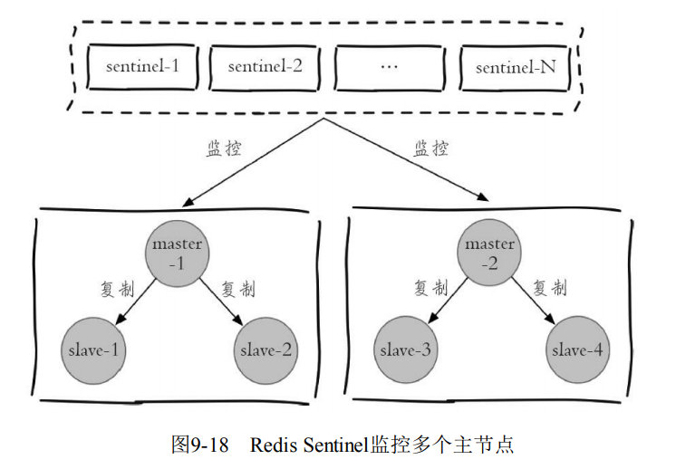{ align=right width=40% }
部署技巧

- 哨兵节点不应该部署在同一台物理机上
- 部署至少三个且奇数个哨兵节点
- 如果哨兵节点集合监控的是同一个业务的多个主节点集合，那么采用一套哨兵节点监控多个主从节点，否则采用多个哨兵节点监控多个主从节点的方案。

### 哨兵节点的 API

| 命令                                                  | 说明                                                                                                                                                                                          |
| ----------------------------------------------------- | --------------------------------------------------------------------------------------------------------------------------------------------------------------------------------------------- |
| `sentinel masters`                                    | 展示所有被监控的主节点状态以及相关统计信息                                                                                                                                                    |
| `sentinel master <master name>`                       | 展示指定`<master name>`的主节点状态以及相关的统计信息                                                                                                                                         |
| `sentinel slaves <master name>`                       | 展示指定`<master name>`的从节点状态以及相关的统计信息                                                                                                                                         |
| `sentinel sentinels <master name>`                    | 展示指定`<master name>`的Sentinel节点集合（不包含当前Sentinel节点）                                                                                                                           |
| `sentinel get-master-addr-by-name <master name>`      | 返回指定`<master name>`主节点的IP地址和端口                                                                                                                                                   |
| `sentinel reset <pattern>`                            | 当前Sentinel节点对符合`<pattern>`（通配符风格）主节点的配置进行重置，包含清除主节点的相关状态（例如故障转移），重新发现从节点和Sentinel节点。                                                 |
| `sentinel failover <master name>`                     | 对指定`<master name>`主节点进行强制故障转移（没有和其他Sentinel节点“协商”），当故障转移完成后，其他Sentinel节点按照故障转移的结果更新自身配置，这个命令在Redis Sentinel的日常运维中非常有用。 |
| `sentinel ckquorum <master name>`                     | 检测当前可达的Sentinel节点总数是否达到`<quorum>`的个数                                                                                                                                        |
| `sentinel flushconfig`                                | 将Sentinel节点的配置强制刷到磁盘上，这个命令Sentinel节点自身用得比较多，对于开发和运维人员只有当外部原因（例如磁盘损坏）造成配置文件损坏或者丢失时，这个命令是很有用的。                      |
| `sentinel remove <master name>`                       | 取消当前Sentinel节点对于指定`<master name>`主节点的监控。                                                                                                                                     |
| `sentinel monitor <master name> <ip> <port> <quorum>` | 与配置文件中的含义是完全一样                                                                                                                                                                  |
| `sentinel set <master name>`                          | 动态修改Sentinel节点配置选项。注意：该命令只会对当前节点有效，且修改成功后会立即生效                                                                                                          |
| `sentinel is-master-down-by-addr`                     | Sentinel节点之间用来交换对主节点是否下线的判断，根据参数的不同，还可以作为Sentinel领导者选举的通信方式                                                                                        |

Redis Sentinel 客户端基本实现原理：

1. 遍历Sentinel节点集合获取一个可用的Sentinel节点(Sentinel节点之间可以共享数据)，所以可以从任意一个Sentinel节点获取主节点信息

2. 通过`sentinel get-master-addr-by-name master-name`这个API来获取对应主节点的相关信息

3. 验证当前获取的“主节点”是真正的主节点(通过 `role` 或者 `info replication` 判定)，这样做的目的是为了防止故障转移期间主节点的变化

4. 保持和Sentinel节点集合的“联系”，时刻获取关于主节点的相关“信息”

### Redis Sentinel 的实现原理

#### 三个定时监控任务

1. 每隔10秒，每个Sentinel节点会向主节点和从节点发送`info`命令获取最新的拓扑结构。该任务的作用表现在：
    1. 通过向主节点执行`info`命令，获取从节点的信息
    2. 当有新的从节点加入时都可以立刻感知出来
    3. 节点不可达或者故障转移后，可以通过`info`命令实时更新节点拓扑信息。
2. 每隔2秒，每个Sentinel节点会向Redis数据节点的`__sentinel__：hello`频道上发送该Sentinel节点对于主节点的判断以及当前Sentinel节点的信息，同时每个Sentinel节点也会订阅该频道，来了解其他Sentinel节点以及它们对主节点的判断，所以这个定时任务可以完成以下两个工作：
    1. 发现新的Sentinel节点：通过订阅主节点的`__sentinel__：hello`了解其他的Sentinel节点信息，如果是新加入的Sentinel节点，将该Sentinel节点信息保存起来，并与该Sentinel节点创建连接。
    2. Sentinel节点之间交换主节点的状态，作为后面客观下线以及领导者选举的依据。Sentinel节点publish的消息格式：`<Sentinel节点IP> <Sentinel节点端口> <Sentinel节点runId> <Sentinel节点配置版本> <主节点名字> <主节点Ip> <主节点端口> <主节点配置版本>`
3. 每隔1秒，每个Sentinel节点会向主节点、从节点、其余Sentinel节点发送一条ping命令做一次心跳检测，来确认这些节点当前是否可达。这个定时任务是节点失败判定的重要依据。

<div class="grid cards" markdown>
-  <figure>
    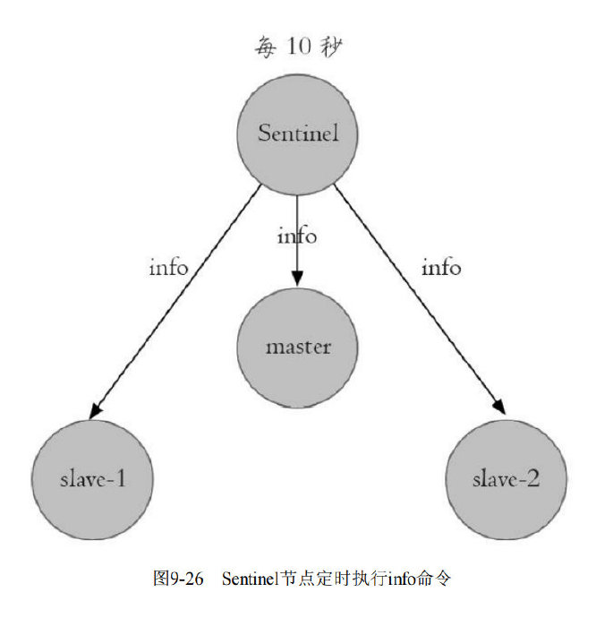
  </figure>
-  <figure>
    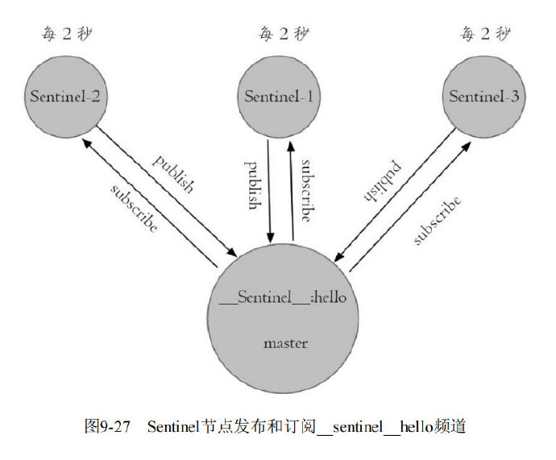
  </figure>
-  <figure>
    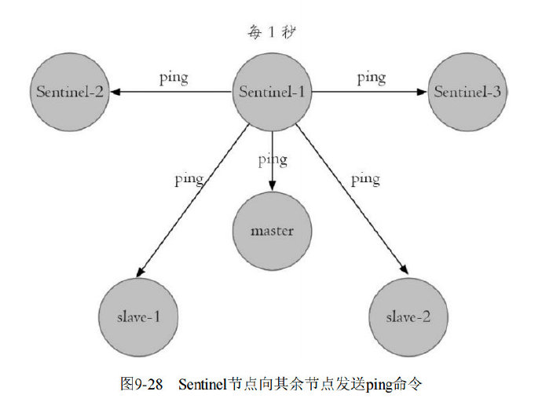
  </figure>
</div>

#### 主观下线与客观下线

- 主观下线：单个哨兵节点判断主节点超过`down-after-milliseconds`时，该哨兵节点即认为该主节点已下线
- 客观下线：为了防止主观下线的误判，因此还需要发送`过sentinel ismaster-down-by-addr`命令向其他Sentinel节点询问对主节点的判断，当超过`<quorum>`个数，即判定该主节点确实已下线

#### 领导者 Sentinel 节点选举

**Redis 使用了 [Raft 算法](https://raft.github.io/) 实现领导者选举**。该算法的思路为：每个节点均有选举与被选举资格，且每个节点有且只有 1 票。当哨兵节点完成主观下线后，向其它哨兵节点询问客观下线时，会提议自身作为哨兵领导者，若被询问者尚未投票，则取得该被询问者的票数，如果询问者的票数大于等于 $max(quorum, num(sentinels)/2 + 1)$，则该询问者成为领导，选举结束，同时终止其它节点的询问。

Raft 作为一致性协议，提供了以下几个重要的功能：

1. Leader 选举
2. 成员变更
3. 日志复制

!!! Tip

    Raft 还被用于：

    - 分布式KV：etcd、Consul
    - 分布式数据库：TiDB、CockroachDB

#### 故障转移

故障转移的具体步骤如下：

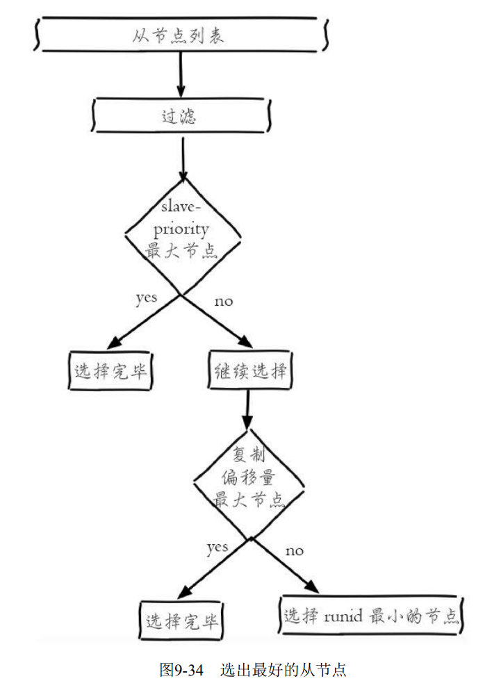{ align=right width=40% }

1. 在从节点列表中选出一个节点作为新的主节点，选择方法如下
    1. 过滤：“不健康”（主观下线、断线）、5秒内没有回复过Sentinel节点ping响应、与主节点失联超过`down-after-milliseconds * 10`秒。
    2. 选择`slave-priority`（从节点优先级）最高的从节点列表，如果存在则返回，不存在则继续。
    3. 选择复制偏移量最大的从节点（复制的最完整），如果存在则返回，不存在则继续。
    4. 选择runid最小的从节点。
2. Sentinel领导者节点会对第一步选出来的从节点执行`slaveof no one命`令让其成为主节点
3. Sentinel领导者节点会向剩余的从节点发送命令，让它们成为新主节点的从节点，复制规则和`parallel-syncs`参数有关
4. Sentinel节点集合会将原来的主节点更新为从节点，并保持着对其关注，当其恢复后命令它去复制新的主节点。

### 开发与运维问题

模拟故障的方式：

- 方法一，强制杀掉对应节点的进程号，这样可以模拟出宕机的效果。
- 方法二，使用Redis的`debug sleep`命令，让节点进入睡眠状态，这样可以模拟阻塞的效果。
- 方法三，使用Redis的`shutdown`命令，模拟正常的停掉Redis。

Sentinel节点只支持如下命令：`ping`、`sentinel`、`subscribe`、`unsubscribe`、`psubscribe`、`punsubscribe`、`publish`、`info`、`role`、`client`、`shutdown`。

## 第 10 章 集群

### 数据分布

常见的分区规则有哈希分区与顺序分区两种。Redis 集群采用了哈希分区。

| 分区方式 | 特点                                                 | 代表产品                             |
| -------- | ---------------------------------------------------- | ------------------------------------ |
| 哈希分区 | ・离散度好<br>・数据分布业务无关<br>・无法顺序访问   | Redis Cluster<br>Cassandra<br>Dynamo |
| 顺序分区 | ・离散度易倾斜<br>・数据分布业务相关<br>・可顺序访问 | Bigtable<br>HBase<br>Hypertable      |

#### 常见的哈希分区规则

- 节点取余
    - 使用特定的数据，如Redis的键或用户ID，再根据节点数量N使用公式：`hash(key)%N`计算出哈希值，用来决定数据映射到哪一个节点上。这种方案存在一个问题：当节点数量变化时，如扩容或收缩节点，数据节点映射关系需要重新计算，会导致数据的重新迁移。常用于数据库的分库分表规则，一般采用预分区的方式，提前根据数据量规划好分区数。
- 一致性哈希分区
    - 一致性哈希分区（Distributed Hash Table）实现思路是为系统中每个节点分配一个token，范围一般在0~2，这些token构成一个哈希环。数据读写执行节点查找操作时，先根据key计算hash值，然后顺时针找到第一个大于等于该哈希值的token节点
      32
    - 一致性哈希分区存在几个问题：
        1. 加减节点会造成哈希环中部分数据无法命中，需要手动处理或者忽略这部分数据，因此 **一致性哈希常用于缓存场景**
        2. 当使用少量节点时，节点变化将大范围影响哈希环中数据映射，因此这种方式 **不适合少量数据节点的分布式方案**
        3. 普通的一致性哈希分区在增减节点时需要增加一倍或减去一半节点才能保证数据和负载的均衡。
- 虚拟分区槽
    - 虚拟槽分区巧妙地使用了哈希空间，使用分散度良好的哈希函数把所有数据映射到一个固定范围的整数集合中，整数定义为槽（slot），计算公式为`slot=CRC16(key)&16383`。如Redis Cluster槽范围是0~16383。**槽是集群内数据管理和迁移的基本单位**。采用大范围槽的主要目的是为了方便数据拆分和集群扩展。每个节点会负责一定数量的槽

Redis 虚拟槽分区的特点：

- 解耦数据和节点之间的关系，简化了节点扩容和收缩难度。
- 节点自身维护槽的映射关系，不需要客户端或者代理服务维护槽分区元数据。
- 支持节点、槽、键之间的映射查询，用于数据路由、在线伸缩等场景。

#### 集群功能限制

1. key批量操作支持有限。如mset、mget，目前只支持具有相同slot值的key执行批量操作。对于映射为不同slot值的key由于执行mget、mget等操作可能存在于多个节点上因此不被支持。
2. key事务操作支持有限。同理只支持多key在同一节点上的事务操作，当多个key分布在不同的节点上时无法使用事务功能。
3. key作为数据分区的最小粒度，因此不能将一个大的键值对象如hash、list等映射到不同的节点。
4. 不支持多数据库空间。单机下的Redis可以支持16个数据库，集群模式下只能使用一个数据库空间，即db0。
5. 复制结构只支持一层，从节点只能复制主节点，不支持嵌套树状复制结构。

### 集群搭建

搭建集群需要三个步骤：

1. 准备节点
    - Redis集群一般由多个节点组成，**节点数量至少为6个才能保证组成完整高可用的集群**。每个节点需要开启配置cluster-enabled yes，让Redis运行在集群模式下。建议为集群内所有节点统一目录，一般划分三个目录：conf、data、log，分别存放配置、数据和日志相关文件。
    - 节点 ID 用于唯一标识集群内一个节点，之后很多集群操作都要借助于节点ID来完成。需要注意是，节点ID不同于运行ID。节点ID在集群初始化时只创建一次，节点重启时会加载集群配置文件进行重用，而Redis的运行ID每次重启都会变化。在节点6380执行`cluster nodes`命令获取集群节点状态。
    - Redis 自动维护集群配置文件，不要手动修改，防止节点重启时产生集群信息错误。
2. 节点握手
    - 由客服端发起命令`cluster meet {ip} {port}`建立连接，该命令为异步命令。
    - 节点建立握手后，集群此时处于下线状态，所有的数据读写都被禁止。可以通过`cluster info`查看当前集群状态。
3. 分配槽
    - 通过`cluster addslots`命令为节点分配槽。作为一个完整的集群，每个负责处理槽的节点应该具有从节点，保证当它出现故障时可以自动进行故障转移。集群模式下，Reids节点角色分为主节点和从节点。首次启动的节点和被分配槽的节点都是主节点，从节点负责复制主节点槽信息和相关的数据。使用`cluster replicate{nodeId}`命令让一个节点成为从节点。

由于手动创建集群过于繁琐，且随着集群规模的扩大会加大复杂度与运维成本，因此可以通过`redis-trib.rb`来搭建集群，该工具支持集群创建、检查、修复、均衡等命令行工具。

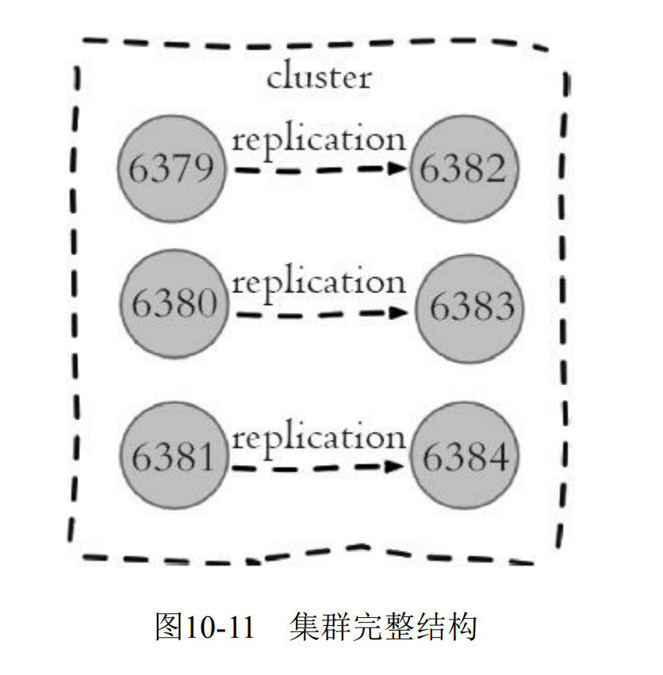{ align=right width=40% }
当集群创建完成后，我们还需要进行完整性检查。集群完整性指所有的槽都分配到存活的主节点上，只要16384个槽中有一个没有分配给节点则表示集群不完整。可以使用`redis-trib.rb check`命令检测之前创建的两个集群是否成功，`check`命令只需要给出集群中任意一个节点地址就可以完成整个集群的检查工作。当持有槽的主节点下线时，从故障发现到自动完成转移期间整个集群是不可用状态，对于大多数业务无法容忍这种情况，因此建议将参数`cluster-require-full-coverage`配置为no，当主节点故障时只影响它负责槽的相关命令执行，不会影响其他主节点的可用性。

### 节点通信

常见的元数据维护方式分为：集中式和P2P方式。Redis集群采用P2P的Gossip（流言）协议，Gossip协议工作原理就是节点彼此不断通信交换信息，一段时间后所有的节点都会知道集群完整的信息，这种方式类似流言传播。其通信过程如下：

1. 集群中的每个节点都会单独开辟一个TCP通道，用于节点之间彼此通信，通信端口号在基础端口上加10000。
2. 每个节点在固定周期内通过特定规则选择几个节点发送ping消息。
3. 接收到ping消息的节点用pong消息作为响应。

> 我们经常在网络中使用 ping 作为探活命令，使用 pong 作为响应，这个两个词在一次正好为 ping-pong 乒乓球，可以理解为发送方发出去的球得到响应才认为对方存活。不知道创建这一对命令的人是否也是基于这个理念创建的。

常用的Gossip消息可分为：ping消息、pong消息、meet消息、fail消息等。

- meet 消息：用于通知新节点加入
- ping 消息：用于检测节点是否在线和交换彼此状态信息。ping 消息发送封装了自身节点和部分其他节点的状态数据。
- pong 消息：作为响应消息回复给发送方确认消息正常通信。pong消息内部封装了自身状态数据。节点也可以向集群内广播自身的pong消息来通知整个集群对自身状态进行更新。
- fail 消息：当节点判定集群内另一个节点下线时，会向集群内广播一个fail消息，其他节点接收到fail消息之后把对应节点更新为下线状态。

所有消息格式划分为消息头和消息体。消息头包含发送节点自身状态数据（如节点id、槽映射、节点标识（主从角色，是否下线）等），接收节点根据消息头就可以获取到发送节点的相关数据；消息体则包含了发送节点所了解的其他节点信息。消息的类型则根据消息头的 type 属性区分。

=== "消息头 clusterMsg 结构"

    ```C
    typedef struct {
        char sig[4];                            /* 信号标示 */
        uint32_t totlen;                        /* 消息总长度 */
        uint16_t ver;                           /* 协议版本*/
        uint16_t type;                          /* 消息类型,用于区分meet,ping,pong等消息 */
        uint16_t count;                         /* 消息体包含的节点数量，仅用于meet,ping,ping消息类型*/
        uint64_t currentEpoch;                  /* 当前发送节点的配置纪元 */
        uint64_t configEpoch;                   /* 主节点/从节点的主节点配置纪元 */
        uint64_t offset;                        /* 复制偏移量 */
        char sender[CLUSTER_NAMELEN];           /* 发送节点的nodeId */
        unsigned char myslots[CLUSTER_SLOTS/8]; /* 发送节点负责的槽信息 */
        char slaveof[CLUSTER_NAMELEN];          /* 如果发送节点是从节点，记录对应主节点的nodeId */
        uint16_t port;                          /* 端口号 */
        uint16_t flags;                         /* 发送节点标识,区分主从角色，是否下线等 */
        unsigned char state;                    /* 发送节点所处的集群状态 */
        unsigned char mflags[3];                /* 消息标识 */
        union clusterMsgData data               /* 消息正文 */;
    } clusterMsg;
    ```

=== "消息体 clusterMsgData 结构"

    ```C
    typedef struct {
        char nodename[CLUSTER_NAMELEN];          /* 节点的nodeId */
        uint32_t ping_sent;                      /* 最后一次向该节点发送ping消息时间 */
        uint32_t pong_received;                  /* 最后一次接收该节点pong消息时间 */
        char ip[NET_IP_STR_LEN];                 /* IP */
        uint16_t port;                           /* port*/
        uint16_t flags;                          /* 该节点标识 */
    } clusterMsgDataGossip;
    ```

如果节点间频繁通信，则会加重带宽和计算的负担，过慢又会导致信息更新不及时，因此Redis集群的Gossip协议需要兼顾信息交换实时性和成本开销。

<div class="grid cards" markdown>
-  <figure>
    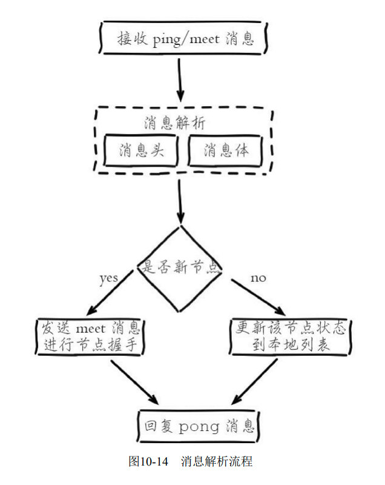
    <figcaption>消息解析流程</figcaption>
  </figure>
-  <figure>
    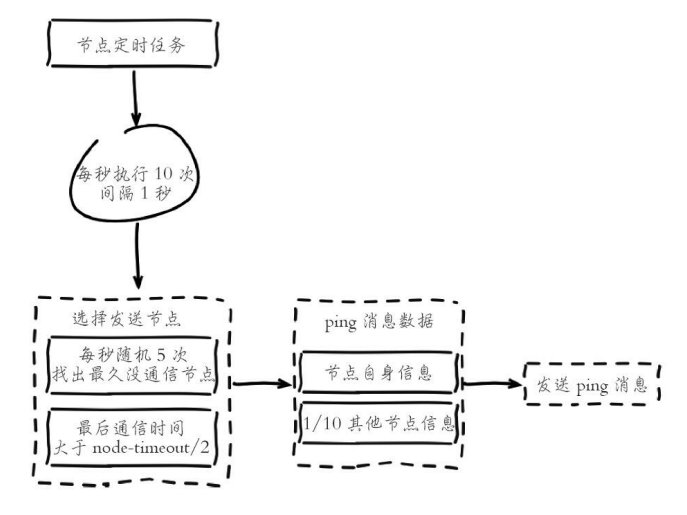
    <figcaption>Gossip 通信流程</figcaption>
  </figure>
</div>

从Gossip的通信机制中我们看到，影响带宽的主要因素在于通信的节点数与发送的消息数据量，因此，我们从这两方面进行优化：

- 选择发送消息的节点数量：集群内每个节点维护定时任务默认每秒执行10次，每秒会随机选取5个节点找出最久没有通信的节点发送ping消息，用于保证Gossip信息交换的随机性。每100毫秒都会扫描本地节点列表，如果发现节点最近一次接受pong消息的时间大于`cluster_node_timeout/2`，则立刻发送ping消息，防止该节点信息太长时间未更新。根据以上规则得出每个节点每秒需要发送ping消息的数量`=1+10*num（node.pong_received>cluster_node_timeout/2`，因此`cluster_node_timeout`参数对消息发送的节点数量影响非常大。当我们的带宽资源紧张时，可以适当调大这个参数。
- 消息数据量：消息头主要占用空间的字段是`myslots[CLUSTER_SLOTS/8]`，占用2KB，这块空间占用相对固定。消息体携带数据量跟集群的节点数息息相关，更大的集群每次消息通信的成本也就更高，因此对于Redis集群来说并不是大而全的集群更好。

### 集群伸缩

集群的水平伸缩的上层原理：**集群伸缩 = 槽和数据在节点之间的移动**。

<figure markdown>
  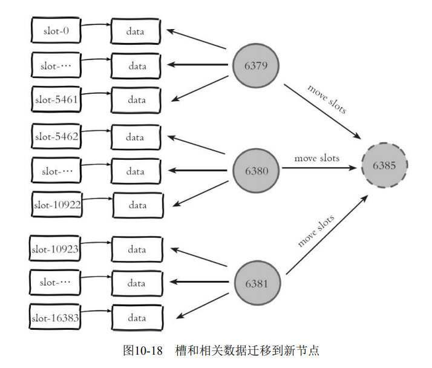{ width=60% }
</figure>

#### 扩容集群

槽迁移数据流程如下：

1. 对目标节点发送`cluster setslot {slot} importing {sourceNodeId}`命令，让目标节点准备导入槽的数据。
2. 对源节点发送`cluster setslot {slot} migrating {targetNodeId}`命令，让源节点准备迁出槽的数据。
3. 源节点循环执行`cluster getkeysinslot {slot} {count}`命令，获取count个属于槽`{slot}`的键。
4. 在源节点上执行`migrate {targetIp} {targetPort} "" 0 {timeout} keys {keys...}`命令，把获取的键通过流水线机制批量迁移到目标节点。
5. 重复执行步骤3和步骤4直到槽下所有的键值数据迁移到目标节点。
6. 向集群内所有主节点发送`cluster setslot {slot} node {targetNodeId}`命令，通知槽分配给目标节点。为了保证槽节点映射变更及时传播，需要遍历发送给所有主节点更新被迁移的槽指向新节点。

<figure markdown>
  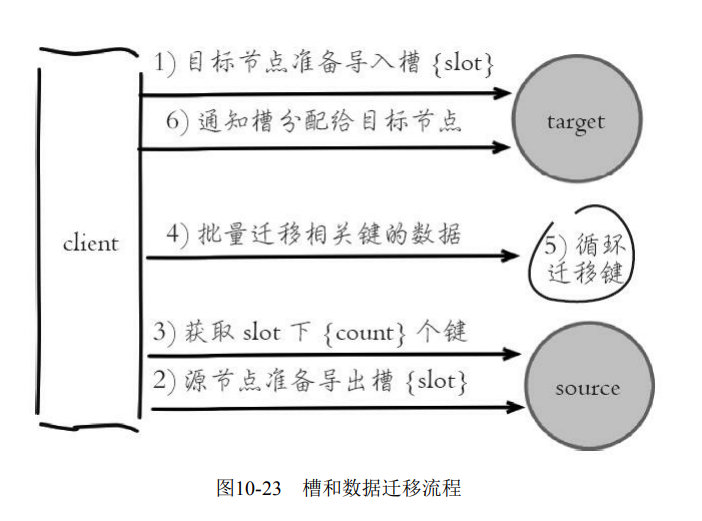{ width=60% }
</figure>

`redis-trib`槽重分片功能命令如下：`redis-trib.rb reshard host:port --from <arg> --to <arg> --slots <arg> --yes --timeout <arg> --pipeline <arg>`

- `host:port`：必传参数，集群内任意节点地址，用来获取整个集群信息。
- `--from`：制定源节点的id，如果有多个源节点，使用逗号分隔，如果是all源节点变为集群内所有主节点，在迁移过程中提示用户输入。
- `--to`：需要迁移的目标节点的id，目标节点只能填写一个，在迁移过程中提示用户输入。
- `--slots`：需要迁移槽的总数量，在迁移过程中提示用户输入。
- `--yes`：当打印出reshard执行计划时，是否需要用户输入yes确认后再执行`reshard`。
- `--timeout`：控制每次migrate操作的超时时间，默认为60000毫秒。
- `--pipeline`：控制每次批量迁移键的数量，默认为10。

迁移之后建议使用`redis-trib.rb rebalance`命令检查节点之间槽的均衡性。

#### 收缩集群

1. 首先需要确定下线节点是否有负责的槽，如果是，需要把槽迁移到其他节点，保证节点下线后整个集群槽节点映射的完整性。
2. 当下线节点不再负责槽或者本身是从节点时，就可以通知集群内其他节点忘记下线节点，当所有的节点忘记该节点后可以正常关闭。

下线节点需要把自己负责的槽迁移到其他节点，原理与之前节点扩容的迁移槽过程一致。在此不做赘述。

<div class="grid cards" markdown>
-  <figure>
    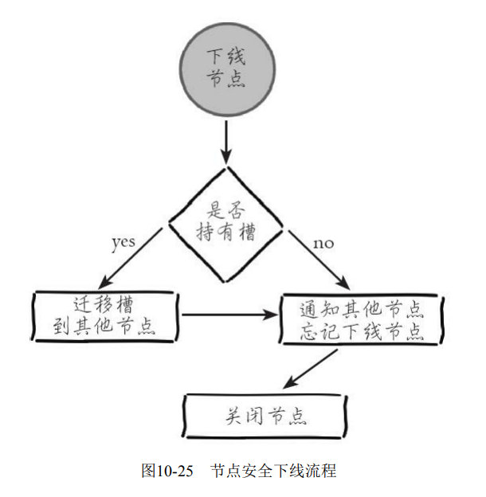
  </figure>
-  <figure>
    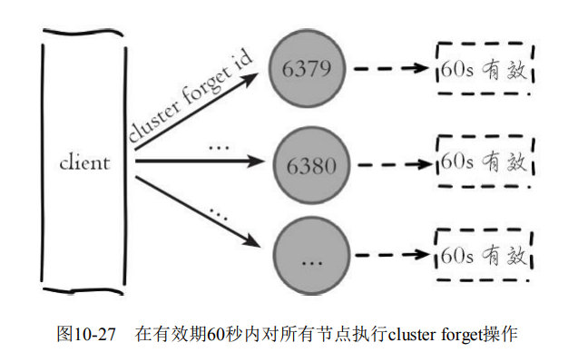
  </figure>
</div>

由于集群内的节点不停地通过Gossip消息彼此交换节点状态，因此需要通过一种健壮的机制让集群内所有节点忘记下线的节点。也就是说让其他节点不再与要下线节点进行Gossip消息交换。Redis提供了`cluster forget{downNodeId}`命令实现该功能。（此处的Gossip对忘记节点造成了阻碍）

当节点接收到`cluster forget{down NodeId}`命令后，会把nodeId指定的节点加入到禁用列表中，在禁用列表内的节点不再发送Gossip消息。禁用列表有效期是60秒，超过60秒节点会再次参与消息交换。也就是说当第一次forget命令发出后，我们有60秒的时间让集群内的所有节点忘记下线节点。线上操作不建议直接使用`cluster forget`命令下线节点，需要跟大量节点命令交互，实际操作起来过于繁琐并且容易遗漏forget节点。建议使用`redistrib.rb del-node{host:port}{downNodeId}`命令，内部实现的伪代码如下：

```python
def delnode_cluster_cmd(downNode):
    # 下线节点不允许包含slots
    if downNode.slots.length != 0
        exit 1
    end
    # 向集群内节点发送cluster forget
    for n in nodes:
        if n.id == downNode.id:
            # 不能对自己做forget操作
            continue;
        # 如果下线节点有从节点则把从节点指向其他主节点
        if n.replicate && n.replicate.nodeId == downNode.id :
            # 指向拥有最少从节点的主节点
            master = get_master_with_least_replicas();
            n.cluster("replicate",master.nodeId);
        #发送忘记节点命令
        n.cluster('forget',downNode.id)
# 节点关闭
downNode.shutdown();
```

当下线主节点具有从节点时需要把该从节点指向到其他主节点，因此对于主从节点都下线的情况，建议先下线从节点再下线主节点，防止不必要的全量复制。

### 请求路由

#### 请求重定向

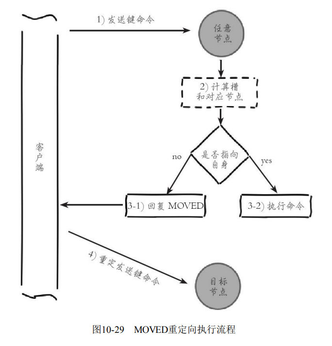{ align=right width=40% }
在集群模式下，Redis接收任何键相关命令时首先计算键对应的槽，再根据槽找出所对应的节点，如果节点是自身，则处理键命令；否则回复MOVED重定向错误，通知客户端请求正确的节点。这个过程称为MOVED重定向。

可以通过`cluster keyslot{key}`命令返回key所对应的槽，该命令采用`key_hash_slot()`函数实现。 使用`redis-cli`命令时，可以加入`-c`参数支持自动重定向，简化手动发起重定向操作。

<div style="clear: both;"></div>

键命令执行步骤主要分两步：计算槽，查找槽所对应的节点。

1. Redis首先需要计算键所对应的槽。根据键的有效部分使用CRC16函数计算出散列值，再取对16383的余数，使每个键都可以映射到0~16383槽范围内。
2. 节点对于判定键命令是执行还是MOVED重定向，都是借助`slots [CLUSTER_SLOTS]`数组实现。根据MOVED重定向机制，客户端可以随机连接集群内任一Redis获取键所在节点，这种客户端又叫Dummy（傀儡）客户端，它优点是代码实现简单，对客户端协议影响较小，只需要根据重定向信息再次发送请求即可。但是它的弊端很明显，每次执行键命令前都要到Redis上进行重定向才能找到要执行命令的节点，额外增加了IO开销，这不是Redis集群高效的使用方式。正因为如此通常集群客户端都采用另一种实现：Smart（智能）客户端。Smart客户端通过在内部维护slot→node的映射关系，本地就可实现键到节点的查找，从而保证IO效率的最大化，而MOVED重定向负责协助Smart客户端更新slot→node映射。

##### hash_tag

hash_tag 允许用 key 的部分字符串来计算 hash。当一个 key 包含 {} 的时候，就不对整个 key 做 hash，而仅对 {} 包括的字符串做 hash。

在集群模式下使用mget等命令优化批量调用时，键列表必须具有相同的slot，否则会报错。这时可以利用hash_tag让不同的键具有相同的slot达到优化的目的。命令如下：

```bash
127.0.0.1:6385> mget user:10086:frends user:10086:videos
(error) CROSSSLOT Keys in request don't hash to the same slot
127.0.0.1:6385> mget user:{10086}:friends user:{10086}:videos
1) "friends"
2) "videos"
```

Pipeline同样可以受益于hash_tag，由于Pipeline只能向一个节点批量发送执行命令，而相同slot必然会对应到唯一的节点，降低了集群使用Pipeline的门槛。

#### ASK 重定向

当slot对应的数据从源节点到目标节点迁移过程中，客户端需要做到智能识别，保证键命令可正常执行。例如当一个slot数据从源节点迁移到目标节点时，期间可能出现一部分数据在源节点，而另一部分在目标节点。

<div class="grid cards" markdown>
-  <figure>
    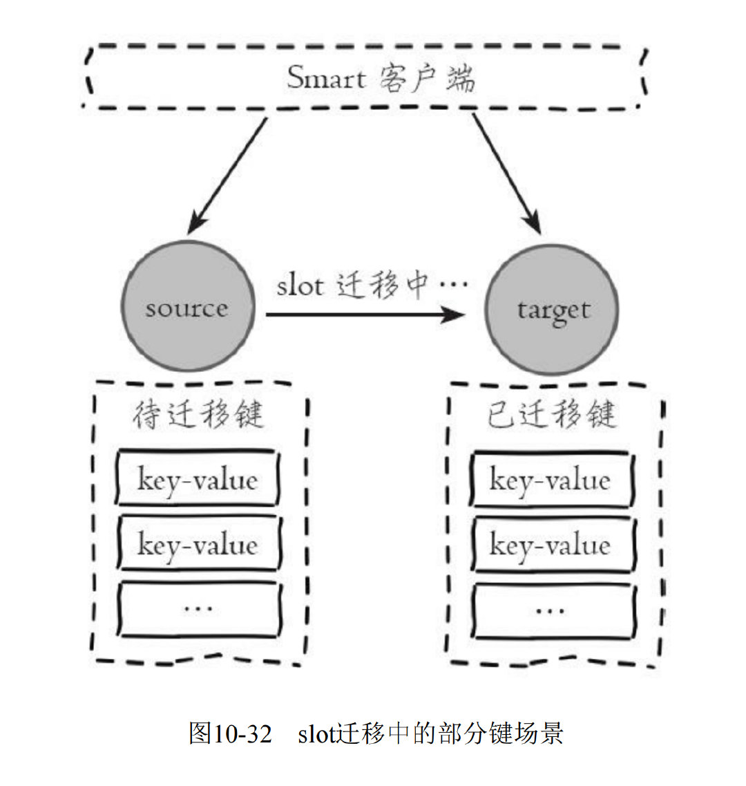
  </figure>
-  <figure>
    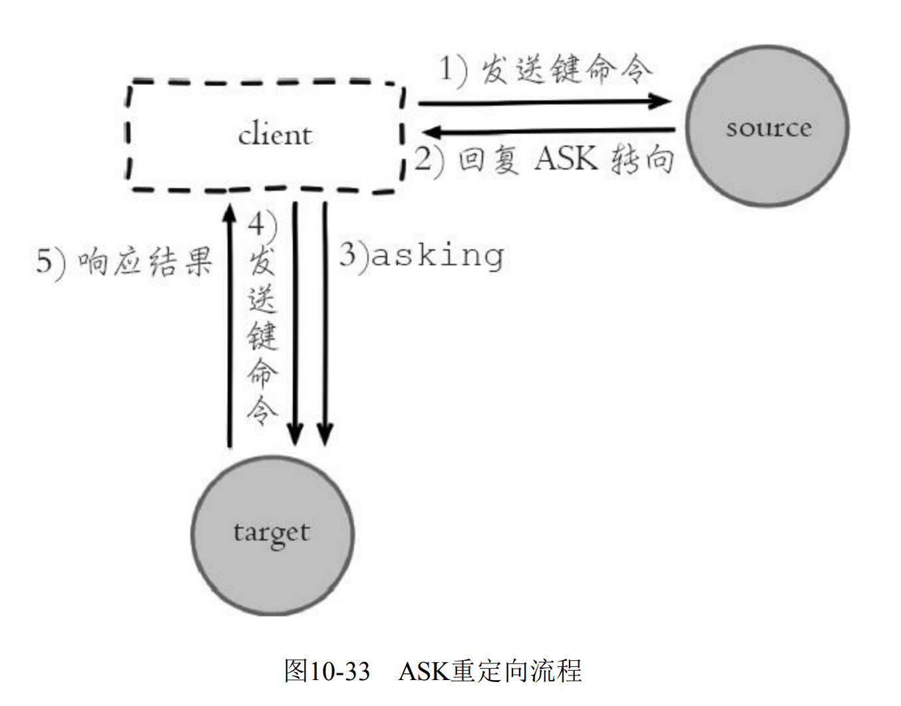
  </figure>
</div>

ASK与MOVED虽然都是对客户端的重定向控制，但是有着本质区别。ASK重定向说明集群正在进行slot数据迁移，客户端无法知道什么时候迁移完成，因此只能是临时性的重定向，客户端不会更新slots缓存。但是MOVED重定向说明键对应的槽已经明确指定到新的节点，因此需要更新slots缓存。

为了支持ASK重定向，源节点和目标节点在内部的clusterState结构中维护当前正在迁移的槽信息，用于识别槽迁移情况。

- 如果键所在的槽由当前节点负责，但键不存在则查找`migrating_slots_to`数组查看槽是否正在迁出，如果是返回ASK重定向。
- 如果客户端发送`asking`命令打开了`CLIENT_ASKING`标识，则该客户端下次发送键命令时查找`importing_slots_from`数组获取`clusterNode`，如果指向自身则执行命令。
    - 需要注意的是，asking命令是一次性命令，每次执行完后客户端标识都会修改回原状态，因此每次客户端接收到ASK重定向后都需要发送asking命令。
- ASK重定向对单键命令支持得很完善。当槽处于迁移状态时，批量操作会受到影响。

使用smart客户端批量操作集群时，需要评估`mget/mset`、Pipeline等方式在slot迁移场景下的容错性，防止集群迁移造成大量错误和数据丢失的情况。

集群环境下对于使用批量操作的场景，建议优先使用Pipeline方式，在客户端实现对ASK重定向的正确处理，这样既可以受益于批量操作的IO优化，又可以兼容slot迁移场景。

### 故障转移

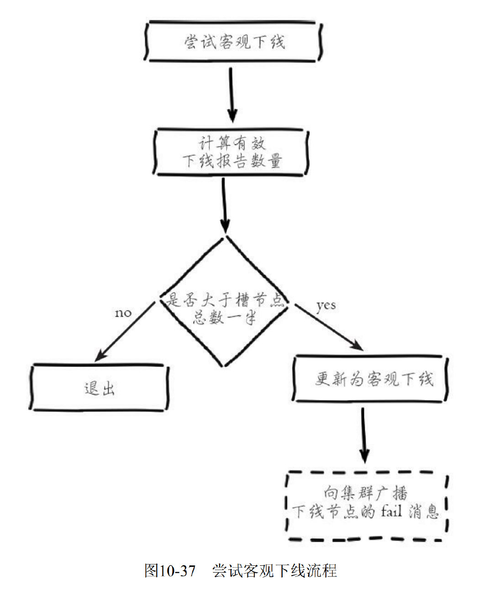{ align=right width=40% }
当某个节点被主观下线后，ping/pong消息的消息体会携带集群1/10的其他节点状态数据在集群内传播。当半数以上持有槽的主节点都标记某个节点是主观下线时，触发客观下线流程。

每个下线报告都存在有效期(`cluster-node-time*2`)，每次在尝试触发客观下线时，都会检测下线报告是否过期，对于过期的下线报告将被删除。

如果在`cluster-node-time*2`时间内无法收集到一半以上槽节点的下线报告，那么之前的下线报告将会过期，也就是说主观下线上报的速度追赶不上下线报告过期的速度，那么故障节点将永远无法被标记为客观下线从而导致故障转移失败。因此不建议将`cluster-node-time`设置得过小。

故障恢复流程： 资格检查 -> 准备选举时间 -> 发起选举 -> 选举投票 -> 替换主节点

投票作废：每个配置纪元代表了一次选举周期，如果在开始投票之后的`cluster-node-timeout*2`时间内从节点没有获取足够数量的投票，则本次选举作废。从节点对配置纪元自增并发起下一轮投票，直到选举成功为止。

故障转移时间：`failover-time(毫秒) ≤ cluster-node-timeout + cluster-node-timeout/2 + 1000`

### 集群运维

集群倾斜

- 数据倾斜
    - 节点和槽分配严重不均。可以使用 `redis-trib.rb info{host:ip}` 进行定位
    - 不同槽对应键数量差异过大。键通过 CRC16 哈希函数映射到槽上，正常情况下槽内键数量会相对均匀。但当大量使用 hash_tag 时，会产生不同的键映射到同一个槽的情况。特别是选择作为 hash_tag 的数据离散度较差时，将加速槽内键数量倾斜情况。通过命令 `cluster countkeysinslot{slot}` 可以获取槽对应的键数量，识别出哪些槽映射了过多的键。再通过命令 `clustergetkeysinslot{slot}{count}` 循环迭代出槽下所有的键。从而发现过度使用 hash_tag 的键。
    - 集合对象包含大量元素。
    - 内存相关配置不一致。
- 请求倾斜
    - 合理设计键，热点大集合对象做拆分或使用 hmget 替代 hgetall 避免整体读取。
    - 不要使用热键作为 hash_tag，避免映射到同一槽。
    - 对于一致性要求不高的场景，客户端可使用本地缓存减少热键调用。

集群模式下从节点不接受任何读写请求，发送过来的键命令会重定向到负责槽的主节点上。当需要使用从节点分担主节点读压力时，可以使用`readonly`命令打开客户端连接只读状态。`readonly`命令是连接级别生效，因此每次新建连接时都需要执行`readonly`开启只读状态。执行`readwrite`命令可以关闭连接只读状态。

## 第 11 章 缓存设计

### 缓存更新策略

| 缓存更新策略          | 使用场景                                                                                                                                                               | 一致性                                                                                                                      | 维护成本                                                                                                                                |
| --------------------- | ---------------------------------------------------------------------------------------------------------------------------------------------------------------------- | --------------------------------------------------------------------------------------------------------------------------- | --------------------------------------------------------------------------------------------------------------------------------------- |
| LRU/LFU/FIFO 算法剔除 | 剔除算法通常用于缓存使用量超过了预设的最大值时候，如何对现有的数据进行剔除。                                                                                           | 要清理哪些数据是由具体算法决定，开发人员只能决定使用哪种算法，所以数据的一致性是最差的。                                    | 算法不需要开发人员自己来实现，通常只需要配置最大`maxmemory`和对应的策略即可。开发人员只需要知道每种算法的含义，选择适合自己的算法即可。 |
| 超时剔除              | 如果业务可以容忍一段时间内，缓存层数据和存储层数据不一致，那么可以为其设置过期时间。如一个视频的描述信息，可以容忍几分钟内数据不一致，但是涉及交易方面的业务则不适用。 | 一段时间窗口内存在一致性问题。                                                                                              | 只需设置`expire`过期时间即可，维护成本较低。                                                                                            |
| 主动更新              | 应用方对于数据的一致性要求高，需要在真实数据更新后，立即更新缓存数据。                                                                                                 | 一致性最高，但如果主动更新发生了问题，那么这条数据很 likely 很长时间不会更新，所以 **建议结合超时剔除一起使用效果会更好**。 | 维护成本较高，开发者需要自己来完成更新，并保证更新操作的正确性。                                                                        |

最佳实践：

1. 低一致性业务建议配置最大内存和淘汰策略的方式使用。
2. 高一致性业务可以结合使用超时剔除和主动更新，这样即使主动更新出了问题，也能保证数据过期时间后删除脏数据。

### 缓存穿透

缓存穿透是指查询一个根本不存在的数据，缓存层和存储层都不会命中。造成缓存穿透的基本原因有两个：

1. 自身业务代码或者数据出现问题
2. 一些恶意攻击、爬虫等造成大量空命中

#### 缓存穿透的解决方案

<div class="grid cards" markdown>
-  <figure>
    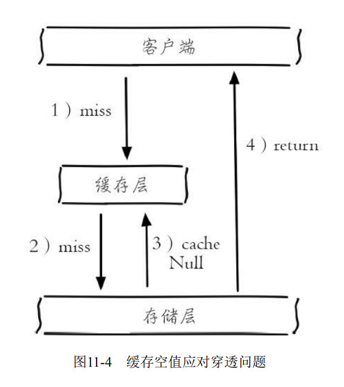
  </figure>
-  <figure>
    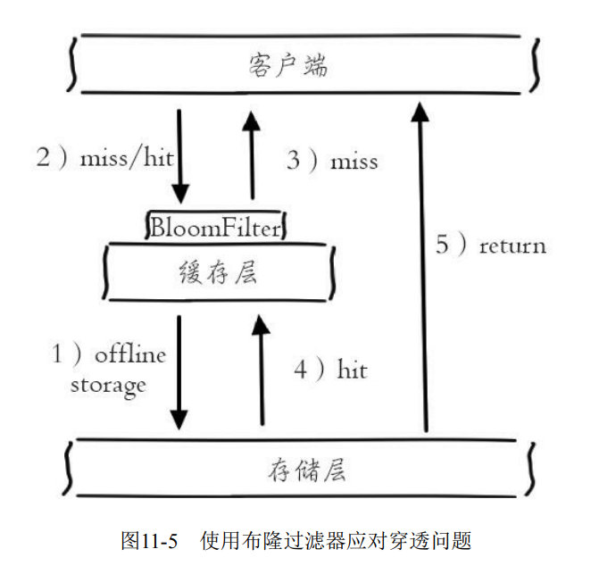
  </figure>
</div>

##### 缓存空对象

缓存空对象会有两个问题：

1. 空值做了缓存，意味着缓存层中存了更多的键，需要更多的内存空间（如果是攻击，问题更严重），比较有效的方法是针对这类数据设置一个较短的过期时间，让其自动剔除。
2. 缓存层和存储层的数据会有一段时间窗口的不一致，可能会对业务有一定影响。例如过期时间设置为5分钟，如果此时存储层添加了这个数据，那此段时间就会出现缓存层和存储层数据的不一致，此时可以利用消息系统或者其他方式清除掉缓存层中的空对象。

```java
String get(String key) {
    // 从缓存中获取数据
    String cacheValue = cache.get(key);
    // 缓存为空
    if (StringUtils.isBlank(cacheValue)) {
        // 从存储中获取
        String storageValue = storage.get(key);
        cache.set(key, storageValue);
        // 如果存储数据为空，需要设置一个过期时间(300秒)
        if (storageValue == null) {
            cache.expire(key, 60 * 5);
        }
        return storageValue;
    } else {
        // 缓存非空
        return cacheValue;
    }
}
```

##### 布隆过滤器拦截

如图所示，在访问缓存层和存储层之前，将存在的key用布隆过滤器提前保存起来，做第一层拦截。例如：一个推荐系统有4亿个用户id，每个小时算法工程师会根据每个用户之前历史行为计算出推荐数据放到存储层中，但是最新的用户由于没有历史行为，就会发生缓存穿透的行为，为此可以将所有推荐数据的用户做成布隆过滤器。如果布隆过滤器认为该用户id不存在，那么就不会访问存储层，在一定程度保护了存储层。

> 可以利用 Redis 的 Bitmaps 实现布隆过滤器。类似开源方案可查看 https://github.com/erikdubbelboer/redis-lua-scaling-bloom-filter

| 解决缓存穿透 | 适用场景                                    | 维护成本                                               |
| ------------ | ------------------------------------------- | ------------------------------------------------------ |
| 缓存空对象   | ・数据命中不高<br> ・数据频繁变化，实时性高 | ・代码维护简单<br>・需要过多的缓存空间<br>・数据不一致 |
| 布隆过滤器   | ・数据命中不高<br>・数据相对固定，实时性低  | ・代码维护复杂<br>・缓存空间占用少                     |

### 无底洞优化

无底洞是指，采用分布式提升缓存的能力，但分布式架构又引发了`mget`等批量操作命令的多次网络连接造成的性能下降。因此，更多的节点不代表更高的性能，所谓“无底洞”就是说投入越多不一定产出越多。但是分布式又是不可以避免的，因为访问量和数据量越来越大，一个节点根本抗不住，所以如何高效地在分布式缓存中批量操作是一个难点。

<div class="grid cards" markdown>
-  <figure>
    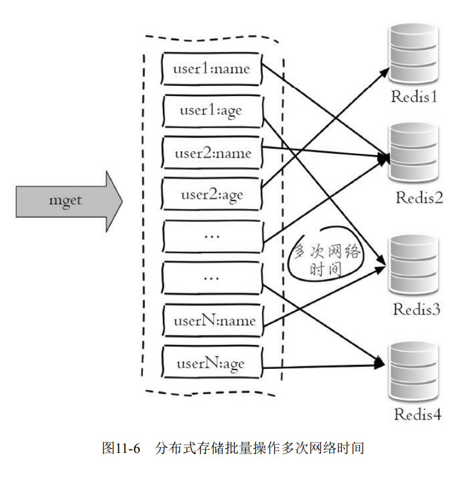
  </figure>
-  <figure>
    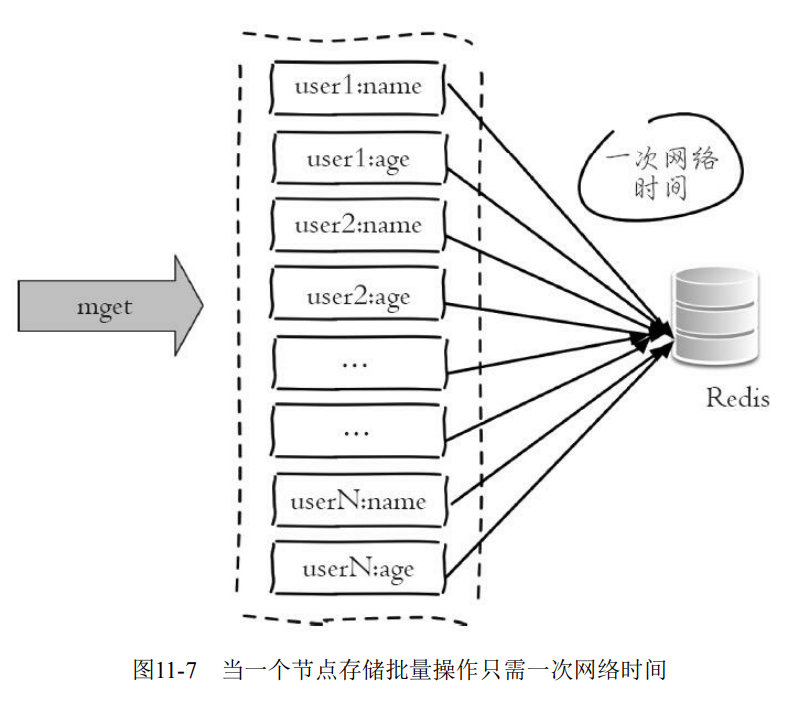
  </figure>
</div>

无底洞问题的优化方案：

- 命令本身的优化，例如优化 SQL 语句等。
- 减少网络通信次数。
    - 客户端 n 次 get (串行执行)：n 次网络 + n 次 get 命令本身。
        - 即逐次执行 n 个 get 命令，这种操作时间复杂度较高，但实现也最简单。
    - 客户端 1 次 pipeline get (串行 I/O)：1 次网络 + n 次 get 命令本身。
        - Redis Cluster 使用 CRC16 算法计算出散列值，再取对 16383 的余数就可以算出 slot 值，同时 Smart 客户端会保存 slot 和节点的对应关系，有了这两个数据就可以将属于同一个节点的 key 进行归档，得到每个节点的 key 子列表，之后对每个节点执行 mget 或者 Pipeline 操作，它的操作时间 = node 次网络时间 + n 次命令时间，网络次数是 node 的个数，很明显这种方案比第一种要好很多，但是如果节点数太多，还是有一定的性能问题。
    - 客户端 1 次 mget (并行 I/O)：1 次网络 + 1 次 mget 命令本身。
        - 此方案是将方案 2 中的最后一步改为多线程执行，网络次数虽然还是节点个数，但由于使用多线程网络时间变为 $O (1)$，这种方案会增加编程的复杂度。其操作时间为：`max_slow(node网络时间)+n次命令时间`
    - Redis Cluster 的 `hash_tag` 可以将多个 key 强制分配到一个节点上，它的操作时间 = 1 次网络时间 + n 次命令时间。
- 降低接入成本，例如客户端使用长连 / 连接池、NIO (Non-blocking I/O) 等。

<div class="grid cards" markdown>
-  <figure>
    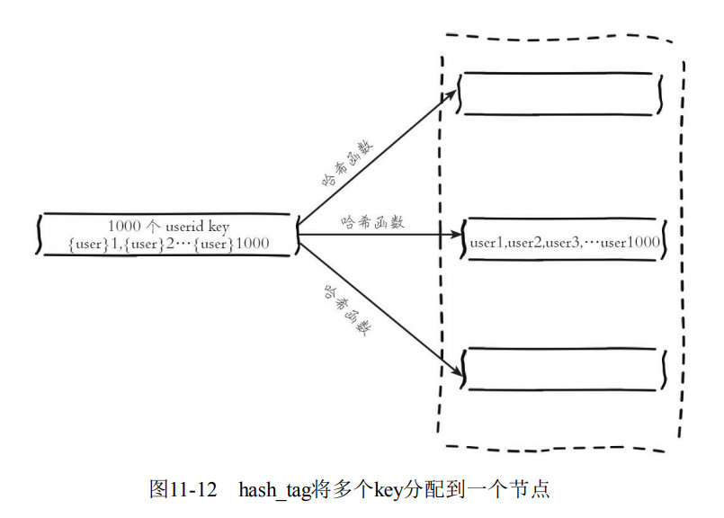
  </figure>
-  <figure>
    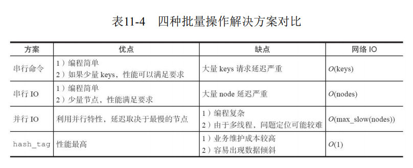
  </figure>
</div>

### 雪崩优化

缓存雪崩：如果缓存层由于某些原因不能提供服务，于是所有的请求都会达到存储层，存储层的调用量会暴增，造成存储层也会级联宕机的情况。

优化方案如下：

1. 保证缓存层服务高可用性。Redis Sentinel 和 Redis Cluster 都实现了高可用。
   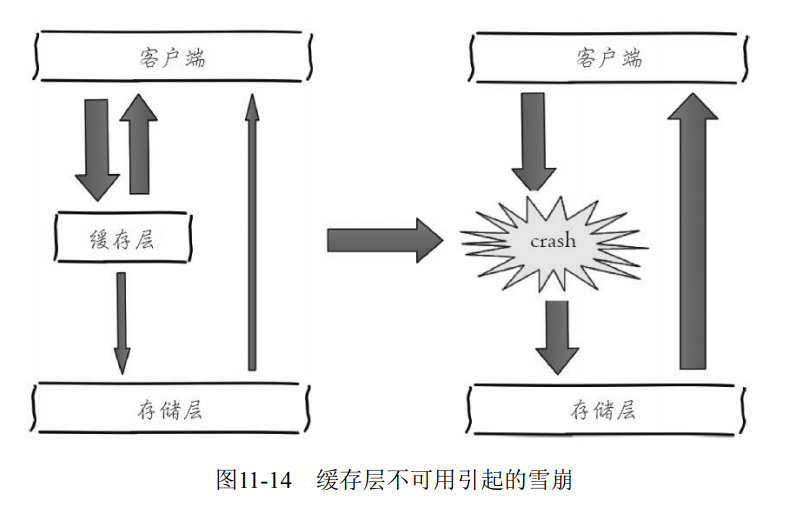{ align=right width=40% }
2. 依赖隔离组件为后端限流并降级。作为并发量较大的系统，假如有一个资源不可用，可能会造成线程全部阻塞在这个资源上，造成整个系统不可用。降级机制在高并发系统中是非常普遍的：比如推荐服务中，如果个性化推荐服务不可用，可以降级补充热点数据，不至于造成前端页面是开天窗。在实际项目中，我们需要对重要的资源（例如 Redis、MySQL、HBase、外部接口）都进行隔离，让每种资源都单独运行在自己的线程池中，即使个别资源出现了问题，对其他服务没有影响。
3. 提前演练。在项目上线前，演练缓存层宕掉后，应用以及后端的负载情况以及可能出现的问题，在此基础上做一些预案设定。

### 热点key重建优化

在缓存失效的瞬间，有大量线程来重建缓存，造成后端负载加大，甚至可能会让应用崩溃。

解决热点 key 重建的思路：

- 减少重建缓存的次数。
- 数据尽可能一致。
- 较少的潜在危险。

#### 解决方案

#### 互斥锁(mutex key)

此方法只允许一个线程重建缓存，其他线程等待重建缓存的线程执行完，重新从缓存获取数据即可。

```java
String get(String key) {
    // 从Redis中获取数据
    String value = redis.get(key);
    // 如果value为空，则开始重构缓存
    if (value == null) {
        // 只允许一个线程重构缓存，使用nx，并设置过期时间ex
        String mutexKey = "mutext:key:" + key;
        if (redis.set(mutexKey, "1", "ex 180", "nx")) {
            // 从数据源获取数据
            value = db.get(key);
            // 回写Redis，并设置过期时间
            redis.setex(key, timeout, value);
            // 删除key_mutex
            redis.delete(mutexKey);
        }
        // 其他线程休息50毫秒后重试
        else {
            Thread.sleep(50);
            get(key);
        }
    }
    return value;
}
```

#### 永不过期

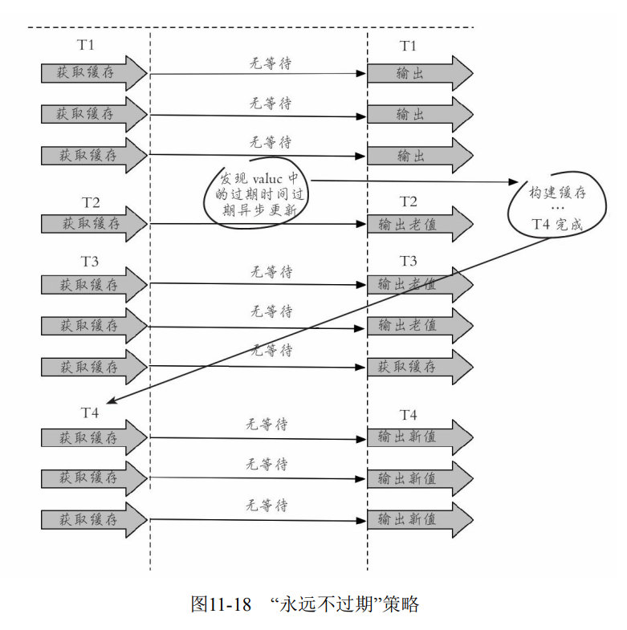{ align=right width=40% }
永不过期包含两层含义：

- 从缓存层面来看，确实没有设置过期时间，所以不会出现热点 key 过期后产生的问题，也就是 “物理” 不过期。
- 从功能层面来看，为每个 value 设置一个逻辑过期时间，当发现超过逻辑过期时间后，会使用单独的线程去构建缓存。

作为一个并发量较大的应用，在使用缓存时有三个目标：

1. 加快用户访问速度，提高用户体验。
2. 降低后端负载，减少潜在的风险，保证系统平稳。
3. 保证数据“尽可能”及时更新。

两种热点key的解决方法：

| 解决方案     | 优点                         | 缺点                                                           |
| ------------ | ---------------------------- | -------------------------------------------------------------- |
| 简单分布式锁 | ・思路简单 <br> ・保证一致性 | ・代码复杂度增大<br>・存在死锁的风险<br>・存在线程池阻塞的风险 |
| 永不过期     | ・基本杜绝热点key问题        | ・不保证一致性<br>・逻辑过期时间增加代码维护成本和内存成本     |

## 第 12 章 Devops 的陷阱

### Redis 攻击

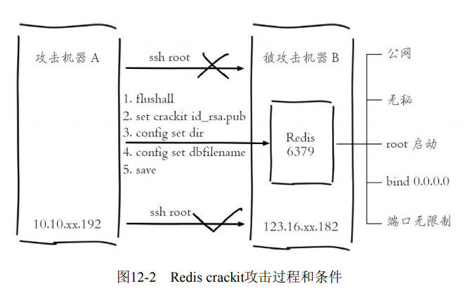{ align=right width=40% }
攻击者充分利用 Redis 的 dir 和 `dbfilename` 两个配置可以使用 `config set` 动态设置，以及 RDB 持久化的特性，将自己的公钥写入到目标机器的 `/root/.ssh/authotrized_keys` 文件中，从而实现了对目标机器的攻陷。攻击过程如图。

### 命令重写

Redis 中提供了`rename-command`命令来重命名命令，我们可以通过该命令将一些危险命令改写，如`keys`、`flushall/flushdb`、`save`、`debug`(`debug reload`会重启 Redis)、`config`、`shutdown`。同时，`rename-command`不支持`config set`，如果AOF和RDB文件包含了rename-command之前的命令，Redis将无法启动。

`rename-command`的最佳实践：

- 对于一些危险的命令（例如 flushall），不管是内网还是外网，一律使用 `rename-command` 配置
- 建议第一次配置 Redis 时，就应该配置 `rename-command`，因为 `renamecommand` 不支持 `config set`。
- 如果涉及主从关系，一定要保持主从节点配置的一致性，否则存在主从数据不一致的可能性。

### 防火墙

可以使用防火墙限制输入和输出的IP或者IP范围、端口或者端口范围。

很多开发者在一开始看到bind的这个配置时都是这么认为的：指定Redis只接收来自于某个网段IP的客户端请求，但 **事实上bind指定的是Redis和哪个网卡进行绑定**，和客户端是什么网段没有关系。

- 如果机器有外网 IP，但部署的 Redis 是给内部使用的，建议去掉外网网卡或者使用 bind 配置限制流量从外网进入。
- 如果客户端和 Redis 部署在一台服务器上，可以使用回环地址（127.0.0.1）。
- bind 配置不支持 `config set`，所以尽可能在第一次启动前配置好

### bigkey

危害：

- 内存空间不均匀
- 超时阻塞
- 网络拥塞

bigkey的存在并不是完全致命的，如果这个bigkey存在但是几乎不被访问，那么只有内存空间不均匀的问题存在，相对于另外两个问题没有那么重要紧急，但是如果bigkey是一个热点key（频繁访问），那么其带来的危害不可想象，所以在实际开发和运维时一定要密切关注bigkey的存在。

### 查找热点 Key

| 方案   | 优点                                         | 缺点                                                                        |
| ------ | -------------------------------------------- | --------------------------------------------------------------------------- |
| 客户端 | 实现简单                                     | · 内存泄露隐患· 维护成本高<br>· 只能统计单个客户端                          |
| 代理   | 代理是客户端和服务端的桥梁，实现最方便最系统 | 增加代理端的成本部署开发                                                    |
| 服务端 | 实现简单                                     | · monitor 本身的使用成本和危害，只能短时间使用<br>· 只能统计单个 Redis 节点 |
| 机器   | 对于客户端和服务端无侵入和影响               | 需要专业的运维团队开发，并且增加了机器的部署成本                            |

---

Redis 中值得我们关注的地方：

- 基础数据类型
- 主从复制
- 哨兵
- 集群
- 如何做到高性能、低复杂度
- 如何保障主从、哨兵、集群的数据一致性
