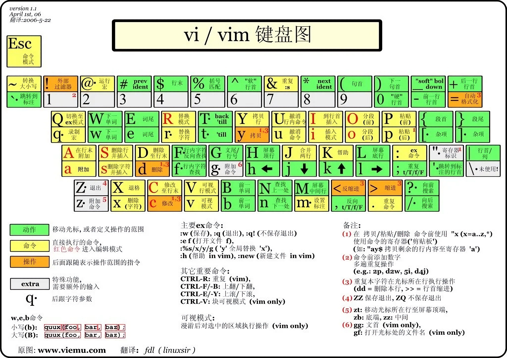

# 《Vim 实用技巧》（第 2 版）

!!! abstract "阅读信息"

    - **评分**：⭐️⭐️⭐️⭐️⭐️
    - **时间**：6/4/2026 → 6/15/2026
    - **读后感**：学习 Vim 的必读书目。一次投入，终生受益！学习 Vim 最好的时代已经到来，让 AI 帮你搞定复杂的配置与繁多的操作命令，你只需要专注于编程，剩下的交给 Vim！



??? question "为什么要学习 Vim / Neovim？"

    每位开发者都值得投入时间深入学习 Vim 的核心操作。在当今的开发生态下，结合现代化的 Neovim 与开箱即用的发行版（如 LazyVim），能够让你的编码效率实现质的飞跃。

    过去，Neovim 的配置门槛较高，繁琐的插件安装与易错的调试过程常常让新手望而却步，热情在挫败感中消磨殆尽。然而，随着 AI 技术的普及，现在我们完全可以将复杂的配置与排错工作交给 AI 助手。这极大地降低了上手难度，让快速构建专属开发环境变得轻松自如。

    面对 Vim 庞杂的命令体系，初学者也大可不必焦虑。在学习初期，借助 AI 实时解答命令用法，不仅能快速跨越陡峭的学习曲线，还能在实践中迅速建立肌肉记忆。

    将 Neovim 作为主力编辑器的优势显而易见：

    1. **打造稳定且跨越时代的开发利器**：它是永久免费的终端神器，无需因为潮流更迭而频繁迁移或重新适应各种臃肿的商业 IDE。
    2. **实现真正的“双手不离键盘”**：熟练后，编码、调试、单元测试乃至 HTTP 请求测试等日常操作均可通过键盘高效完成，让思维与代码实现无缝衔接。
    3. **洞悉现代编辑器底层机制**：折腾配置的过程，也是深入理解 LSP（Language Server Protocol）、DAP（Debugging Adapter Protocol）、Treesitter 语法树等 IDE 核心技术的绝佳机会。

??? tip "Vim 的核心“语法”"

    Vim 的核心操作逻辑可以总结为一套优雅的“语法”：`[次数] + [动词/操作] + [名词/范围]`（即 `[count] + [operation] + motion/text object`）。掌握了这个公式，你就能像说话一样组合出无穷无尽的操作指令。

    - **动词（操作）**：代表你想做什么，如

        - `d` (Delete / Cut)：删除（或剪切）
        - `c` (Change)：修改（删除并自动进入插入模式）
        - `y` (Yank)：复制
        - `v` (Visual)：选中（进入可视模式）
        - `>` / `<` (Indent / Outdent)：向右 / 向左缩进

    - **名词（范围）**：代表操作的作用对象，主要分为“物理移动”和“文本对象”两类：

        - **物理移动 (Motions)**：
            - `w` (word)：移动到下一个单词开头
            - `e` (end of word)：移动到当前或下一个单词的结尾
            - `b` (back)：回退到上一个单词的开头
            - `$`：移动到行尾
            - `0`：移动到行首
            - `f/` (find)：向后查找并移动到下一个 `/` 字符处（可替换为任意字符）
        - **文本对象 (Text Objects)**：通常由 `i` (inner, 内部) 或 `a` (around, 包含周围/边界) 组合对象标识构成，如
            - `iw` / `aw`：一个单词的内部 / 包含其后空格的整个单词
            - `ip` / `ap`：一个段落的内部 / 包含前后空行的整个段落
            - `i"` / `a"`：双引号内部的文本 / 包含双引号本身的完整内容
            - `i(` / `a(`：圆括号内部的文本 / 包含圆括号本身的完整内容
            - `it` / `at`：HTML/XML 标签 (Tag) 内部的文本 / 包含首尾标签的完整内容

??? info "学习路线"

    Vim 的学习是一个循序渐进的过程，可以分为以下三个阶段。不必追求一步到位，每完成一个阶段都会带来明显的效率提升。

    **第一阶段：基础生存（入门）**

    目标是能够用 Vim 独立完成日常编辑任务，不再依赖鼠标。

    - **五种模式**：牢固区分普通模式 (Normal)、插入模式 (Insert)、可视模式 (Visual)、命令行模式 (Command-line) 和替换模式 (Replace) 的用途与切换方式（`i`、`<Esc>`、`v`、`:`）。
    - **基本移动**：掌握 `h/j/k/l` 字符级移动，`w/b/e` 单词级移动，`0/$` 行首行尾，`gg/G` 文件首尾，以及 `{/}` 段落间跳转。
    - **核心编辑语法**：理解并练习 `[count] + [verb] + [noun]` 的组合公式（如 `d2w`、`ci"`），这是 Vim 一切高效操作的根基。
    - **基础增删改查**：熟练使用 `x`、`dd`、`yy`、`p`、`u`（撤销）、`<C-r>`（重做）以及 `/` 查找与 `n/N` 翻查。
    - **保存与退出**：`:w`、`:q`、`:wq`、`:q!` 等命令行操作。

    **第二阶段：进阶提升（核心）**

    这也是《Vim 实用技巧》一书中反复强调的精髓，是区分 Vim 新手与高手的分水岭。

    - **点命令 (The Dot Command)**：微观层面的自动化。`.` 能够重复上一次的修改操作。构建"可重复"的编辑序列，是核心思维定式（即"一击移动，一击执行"）。
    - **寄存器 (Registers)**：Vim 强大的剪贴板系统。除了默认的无名寄存器，还需掌握命名寄存器（`"a`-`"z`，用于长期存储）、系统剪贴板（`"+`，与外部交互）、黑洞寄存器（`"_`，用于彻底删除不污染剪贴板）以及表达式寄存器（`"=`，可当作计算器使用）。
    - **宏 (Macros)**：宏观层面的自动化。通过 `q` 录制一系列复杂的击键动作，并可在多处（甚至跨文件）完美重放（`@`），是应对大规模代码格式化和重复性劳动的终极武器。
    - **模式匹配与替换 (Search and Substitute)**：熟练掌握 `/` 查找与 `:s` 替换。结合 Vim 强大的正则表达式（以及 `\v` Very Magic 模式），能够在重构代码时提供极高的精确度和效率。
    - **跳转列表与标记 (Jumps and Marks)**：利用 `m` 设定局部或全局标记（Marks），或使用 `<C-o>` 和 `<C-i>` 在跳转列表 (Jumplist) 中穿梭，实现代码阅读时的快速"折返跑"。
    - **多文件与工作区管理**：彻底理清**缓冲区 (Buffers)**（内存中打开的文件）、**窗口 (Windows)**（可见的视图分割）和**标签页 (Tabs)**（窗口的集合）这三者的关系，能让你在处理大型项目时游刃有余。

    **第三阶段：精通内化（长期）**

    此阶段没有终点，核心是将 Vim 的思维方式完全内化，使其成为本能。

    - **打磨个人配置**：基于 LazyVim 等发行版，按需定制快捷键、插件与工作流，打造真正属于自己的"神器"。
    - **命令行工具联动**：将 Vim 与 `grep`、`sed`、`awk`、`git` 等命令行工具深度整合，发挥文本处理的极限威力。
    - **LSP 与现代开发工作流**：熟练配置与使用代码补全、诊断、重构（重命名、引用查找）等 IDE 级功能。
    - **持续输出与迭代**：通过阅读他人的 `dotfiles`、参与社区、记录自己的常用技巧，在实践中不断打磨与精进。

## Normal 模式

### 光标移动

#### 行跳转

| 指令                             | 说明                                  |
| -------------------------------- | ------------------------------------- |
| `h` / `j` / `k` / `l`            | 实际行左 / 下 / 上 / 右               |
| `gj` / `gk` / `g0` / `g^` / `g$` | 按屏幕行移动                          |
| `gg` / `G`                       | 跳到第一行 / 最后一行                 |
| `{line}gg` / `{line}G`           | 跳到指定行                            |
| `(` / `)`                        | 跳转到上 / 下一句的开头               |
| `{` / `}`                        | 跳转到上 / 下一段落/函数/代码块的开头 |
| `gf`                             | 跳转到光标下的文件名（go to file）    |
| `gd` / `gD`                      | 跳转到局部/全局定义                   |
| `<Ctrl-]>`                       | 跳转到光标下关键字的定义处            |

#### 词跳转

| 指令                   | 说明                                                      |
| ---------------------- | --------------------------------------------------------- |
| `w` / `b`              | 跳到下 / 上一单词开头                                     |
| `e` / `ge`             | 跳到下 / 上一单词结尾                                     |
| `W` / `B` / `E` / `gE` | 在连续非空字符（字串）间跳转                              |
| `0` / `^` / `$`        | 跳到行首 / 行首非空字符 / 行尾                            |
| `%`                    | 跳到匹配的配对符号                                        |
| `*` / `#`              | 向后 / 向前精确搜索光标所在词                             |
| `g*` / `g#`            | 向后 / 向前部分匹配包含光标所在词的文本                   |
| `f{char}` / `F{char}`  | 向后 / 向前跳到当前行某字符上，`;` / `,` 正向或反向继续跳 |
| `t{char}` / `T{char}`  | 向后 / 向前跳到指定字符的**前**一个位置（till）           |

#### 翻页

| 指令                | 说明                             |
| ------------------- | -------------------------------- |
| `zz` / `zt` / `zb`  | 光标行设为屏幕居中 / 顶部 / 底部 |
| `Ctrl+u` / `Ctrl+d` | 向上 / 向下半屏滚动              |
| `Ctrl+b` / `Ctrl+f` | 向上 / 向下整屏滚动              |

#### 标记

| 指令                             | 说明                                                             |
| -------------------------------- | ---------------------------------------------------------------- |
| `m{mark}`                        | 标记当前位置，`a-z` 局部（缓冲区内），`A-Z` 全局（跨文件跨会话） |
| `` `{mark} ``                    | 跳转到指定标记                                                   |
| ``` `` ``` / `` `. `` / `` `^ `` | 上次跳转前 / 修改 / 插入的位置                                   |
| `` `[ `` / `` `] ``              | 上次修改或复制的起始 / 结束位置                                  |
| `` `< `` / `` `> ``              | 上次高亮选区的起始 / 结束位置                                    |

### 页面内搜索

| 指令         | 说明                  |
| ------------ | --------------------- |
| `/{pattern}` | 向后查找，支持正则    |
| `?{pattern}` | 向前查找              |
| `n` / `N`    | 向后 / 向前跳转匹配项 |

### 操作符与动作

语法：`[count] + Operator + Motion/TextObject`，操作符连按两次作用于当前行（如 `dd`、`yy`）。操作符详见[文本变换](#%E6%96%87%E6%9C%AC%E5%8F%98%E6%8D%A2)，Motion 详见[词跳转](#%E8%AF%8D%E8%B7%B3%E8%BD%AC)与[页面内搜索](#%E9%A1%B5%E9%9D%A2%E5%86%85%E6%90%9C%E7%B4%A2)，TextObject 详见[文本对象](#%E6%96%87%E6%9C%AC%E5%AF%B9%E8%B1%A1)。

| 指令                                            | 说明                                                          |
| ----------------------------------------------- | ------------------------------------------------------------- |
| `.`                                             | 重复上一个操作                                                |
| `u` / `Ctrl+r`                                  | 撤销 / 重做                                                   |
| `r{char}`                                       | 替换光标下一个字符后返回 Normal 模式                          |
| `R`                                             | 进入 Replace 模式，持续替换字符直到 `<Esc>`                   |
| `<Ctrl-o>` / `<Ctrl-i>`                         | 跳到跳转列表中较旧 / 较新的位置（`<Ctrl-i>` 与 `<Tab>` 等价） |
| `:set relativenumber` / `:set norelativenumber` | 开启 / 关闭相对行号                                           |

### 文本对象

| 指令                              | 说明                                                                                                                    |
| --------------------------------- | ----------------------------------------------------------------------------------------------------------------------- |
| `[count]{operator}{i\|a}{object}` | `i`=内容，`a`=包含边界；对象：`w/W`（词）、`s`（句）、`p`（段）、`{}`、`[]`、`()`、`<>`、`'`、`"`、`t`（HTML/XML 标签） |
| 括号类文本对象别名                | `b`=`)`、`B`=`}`、`r`=`]`、`a`=`>`，如 `dab`=`da)`、`diB`=`di}`                                                         |

### 文本变换

| 指令                | 说明                                                        |
| ------------------- | ----------------------------------------------------------- |
| `gu` / `gU` / `g~`  | 转小写 / 转大写 / 翻转大小写                                |
| `J` / `gJ`          | 将下一行合并到当前行，并在两部分文本之间插入一个/不插入空格 |
| `gwip`              | 根据 `textwidth` 自动折行                                   |
| `Ctrl+a` / `Ctrl+x` | 增加 / 减少数字                                             |
| `g<Ctrl+a>`         | 创建递增序列                                                |
| `<` / `>`           | 左 / 右缩进                                                 |

## Insert 模式

| 指令      | 说明                                                 |
| --------- | ---------------------------------------------------- |
| `i` / `a` | 在光标前 / 后插入                                    |
| `I` / `A` | 在行首 / 行尾插入                                    |
| `o` / `O` | 在当前行下方 / 上方插入新行                          |
| `s` / `S` | 删除光标字符 / 当前行后进入插入模式。`S` 等同于 `cc` |

**插入模式内 Ctrl 快捷键**

| 指令                    | 说明                                                                 |
| ----------------------- | -------------------------------------------------------------------- |
| `<Ctrl-w>`              | 删除光标前的单词                                                     |
| `<Ctrl-t>` / `<Ctrl-d>` | 向右/向左缩进（宽度由 `shiftwidth` 控制），无论光标在哪儿都能缩进    |
| `<Ctrl-n>` / `<Ctrl-p>` | 自动补全：下一个/上一个匹配项                                        |
| `<Ctrl-r>{x}`           | 插入寄存器 `x` 的内容                                                |
| `<Ctrl-o>{cmd}`         | 临时切换到 Normal 模式执行一条命令后返回（可用于插入模式的快速执行） |

## Visual 模式

| 指令       | 说明                                   |
| ---------- | -------------------------------------- |
| `v`        | 字符选择模式                           |
| `V`        | 行选择模式                             |
| `<Ctrl-v>` | 列（块）可视模式                       |
| `gv`       | 重选上次的高亮选区                     |
| `o` / `O`  | 光标在选区首尾之间移动                 |
| `.`        | 重复可视模式的操作（如 `>.` 多次缩进） |

## Command 模式

### 基础命令

| 指令                                       | 说明                           |
| ------------------------------------------ | ------------------------------ |
| `:w`                                       | 保存文件                       |
| `:q`                                       | 退出                           |
| `:q!`                                      | 不保存强制退出                 |
| `:wq` / `ZZ`                               | 保存并退出                     |
| `:n`                                       | 跳到第 n 行（同 `ngg` / `nG`） |
| `:set list` / `:set nolist` / `:set list!` | 显示 / 隐藏 / 切换隐藏字符     |
| `:h {command}`                             | 查看命令文档                   |
| `:w !sudo tee %`                           | 修改 root 文件时强制保存文件   |

### 历史命令

| 指令                        | 说明                                                  |
| --------------------------- | ----------------------------------------------------- |
| `@:`                        | 执行上一次命令行命令                                  |
| `@@`                        | 第一次 `@:` 后，继续用 `@@` 重复                      |
| `:` 后按 `<Up>`             | 查找最近命令，可输入前缀过滤                          |
| `q:`                        | 打开历史命令窗口，`j/k` 选择，`Enter` 执行，`:q` 退出 |
| `:!!`                       | 重复执行上一次外部 shell 命令                         |
| `:changes`                  | 列出本次会话的所有变更                                |
| `q/` / `q?` / `q:`          | 打开正向查找 / 反向查找 / 命令的历史窗口              |
| `/<Up>` / `?<Up>` / `:<Up>` | 打开最近的正向 / 反向查找 / 命令历史                  |

### 范围操作

**range 地址语法**：`行号`、`$`（末行）、`.`（当前行）、`%`（全文）、`'<`/`'>`（选区首尾）、`/{pattern}/`（匹配行），支持偏移如 `.+3`、`$-3`。

| 指令                                                  | 说明                                                                                                                                                                      |
| ----------------------------------------------------- | ------------------------------------------------------------------------------------------------------------------------------------------------------------------------- |
| `:[range] delete/yank [x]`                            | 删除 / 复制（到寄存器 x）                                                                                                                                                 |
| `:[range] copy/move {addr}`（简写 `:t` / `:m`）       | 复制 / 移动到 addr 行后；`:6t.` 把第 6 行复到当前行下；`:t.` 复制当前行；`:t$` 复到文末                                                                                   |
| `:[range] normal {commands}`                          | 对 range 内每行执行 Normal 模式命令                                                                                                                                       |
| `:[range1] g/{pattern}/[range2][cmd]`                 | 对含 pattern 的行执行 Ex 命令；range1 限定检索范围（默认全文），range2 限定执行范围；如 `:g/TODO/d`、`:g/{pat}/.,+2d`、`:g/{pattern}/yank A` （把所有匹配行追加到寄存器） |
| `:[range1] v/{pattern}/[range2][cmd]`（或 `global!`） | 反转 global，对**不含** pattern 的行执行；如 `:v/href/d` 只保留匹配行                                                                                                     |
| `:[range] s/{pattern}/{string}/[flags]`               | 替换；flags：`g`=全行、`i`=忽略大小写、`c`=逐个确认（`y/n/a`）、`n`=只计数；`&` 重复上次替换                                                                              |

### Shell 命令

| 指令                    | 说明                                  |
| ----------------------- | ------------------------------------- |
| `:! {cmd}`              | 执行 shell 命令                       |
| `:shell`                | 临时启动交互式 shell，`exit` 返回 Vim |
| `:read !{cmd}`          | 执行 cmd，将标准输出插入光标下方      |
| `:[range] write !{cmd}` | 以 range 为标准输入执行 cmd           |
| `:[range]!{filter}`     | 用外部程序过滤指定 range              |

### 命令行编辑

| 指令                                          | 说明                    |
| --------------------------------------------- | ----------------------- |
| `<Ctrl+b>` / `<Ctrl+e>` 或 `<Home>` / `<End>` | 跳到命令文本开头 / 结尾 |
| `<Shift+←>` / `<Shift+→>`                     | 命令行逐词跳转          |

## 寄存器

> 寄存器可以**剪切**（delete）、复制（yank，`c`已经分配给 change）、粘贴（put），也可以录制宏。

| 指令                      | 说明                                                                                    |
| ------------------------- | --------------------------------------------------------------------------------------- |
| `"{register}`             | 指定要使用的寄存器                                                                      |
| `""`                      | 无名寄存器（默认），`x`、`s`、`d`、`c`、`y` 等操作均写入此处                            |
| `"_`                      | 黑洞寄存器，`"_d{motion}` 执行真正的删除，不覆盖无名寄存器                              |
| `"0`                      | 复制专用寄存器，只有 `y{motion}` 才写入，比无名寄存器稳定                               |
| `"+`                      | 系统剪贴板，插入模式下用 `<Ctrl-r>+` 粘贴                                               |
| `"a`-`"z` / `"A`-`"Z`     | 有名寄存器，小写覆写，大写追加                                                          |
| `"=`                      | 表达式寄存器（可用作计算器）                                                            |
| `"%` / `"#` / `".` / `":` | 只读：当前文件名 / 轮换文件名 / 上次插入文本 / 上次 Ex 命令；插入模式下 `<Ctrl-r>` 使用 |
| `:reg {register}`         | 查看寄存器内容                                                                          |
| `q{register}q`            | 录制空宏以清空有名寄存器                                                                |

!!! tip "文件名修饰符"

    命令行中使用 `"%` 或 `"#` 时可以用文件名修饰符：

    - `:p` 绝对路径
    - `:t` 文件名
    - `:r` 去后缀
    - `:e` 后缀名
    - `:h` 目录路径

## 宏

| 指令              | 说明                                           |
| ----------------- | ---------------------------------------------- |
| `q{register}`     | 开始录制（小写覆写，大写追加，如 `qa` / `qA`） |
| `q`               | 停止录制                                       |
| `@{register}`     | 回放一次                                       |
| `{N}@{register}`  | 回放 N 次（遇错即停，可指定较大次数）          |
| `@@`              | 重复上次回放                                   |
| `:put {register}` | 把寄存器的宏内容倒出到 buffer（用于编辑宏）    |
| `"{register}dd`   | 把 buffer 中编辑好的宏存入寄存器               |

## Buffer / Window / Tab

### Buffer

| 指令                   | 说明                                  |
| ---------------------- | ------------------------------------- |
| `:bprev` / `:bnext`    | 上 / 下一个 buffer                    |
| `:bfirst` / `:blast`   | 第一个 / 最后一个 buffer              |
| `:buffer {n}`          | 跳转到编号 n 的 buffer                |
| `:buffer {name}`       | 根据名称跳转                          |
| `:bdelete` / `:5,10bd` | 删除 buffer / 删除编号 5~10 的 buffer |

### Window

| 指令                             | 说明                                                       |
| -------------------------------- | ---------------------------------------------------------- |
| `<Ctrl-w>s` / `<Ctrl-w>v`        | 水平 / 垂直切分窗口                                        |
| `<Ctrl-w><Ctrl-w>` / `<Ctrl-w>w` | 在窗口间循环切换                                           |
| `<Ctrl-w>h/j/k/l`                | 切换到左 / 下 / 上 / 右的窗口                              |
| `<Ctrl-w>c`                      | 关闭活动窗口                                               |
| `<Ctrl-w>o`                      | 关闭其他所有窗口                                           |
| `<Ctrl-w>=`                      | 所有窗口等宽等高                                           |
| `<Ctrl-w>_` / `<Ctrl-w>|`       | 最大化活动窗口高度 / 宽度，前加数字可指定大小 |

### Tab

| 指令                                   | 说明                             |
| -------------------------------------- | -------------------------------- |
| `:tabnew [filename]`                   | 新建 tab                         |
| `:tcd`                                 | 设置当前 tab 的工作目录          |
| `gt` / `gT`                            | 切换到下一个 / 上一个 tab        |
| `{n}gt`                                | 切换到第 n 个 tab                |
| `:tabn {n}` / `:tabfirst` / `:tablast` | 切换到第 n / 第一 / 最后一个 tab |
| `:tabmove {n}`                         | 移动 tab 到位置 n                |
| `:tabc` / `:tabclose`                  | 关闭当前 tab                     |

### 查找

| 指令                                | 说明                    |
| ----------------------------------- | ----------------------- |
| `/` / `?`                           | 正向 / 反向查找         |
| `n` / `N`                           | 下一个 / 上一个匹配     |
| `:set hlsearch` / `:set nohlsearch` | 永久开启 / 关闭搜索高亮 |
| `:nohlsearch` / `:nohls` / `:hls!`  | 临时关闭搜索高亮        |

### Quickfix

| 指令                                       | 说明                            |
| ------------------------------------------ | ------------------------------- |
| `:cnext` / `:cprev` / `:cfirst` / `:clast` | 跳转到下 / 上 / 第一 / 最后一项 |
| `:cc {N}`                                  | 跳转到第 N 项                   |
| `:copen` / `:cclose`                       | 打开 / 关闭 quickfix 窗口       |

## 细节与陷阱

### 行为规律

- 添加括号时，**左侧括号**在内容两侧加空格，**右侧括号**不加空格。例如：`(foo)` 用 `[` 变为 `[ foo ]`，用 `]` 变为 `[foo]`。
- 字符查找时，f{c} 落在字符上；t{c} 落在字符前一格（till）
- `D`, `C`, `Y` 分别等价于 `d$`, `c$`, `y$`

### 场景对比

**重复上一次操作**

| 场景                 | 正向重复            | 反向重复    |
| -------------------- | ------------------- | ----------- |
| Normal 修改          | `.`                 | `u`（撤销） |
| 字符查找 f/F/t/T     | `;`                 | `,`         |
| 搜索 `/` 和 `?` 匹配 | `n`                 | `N`         |
| 宏回放               | `@@`                | —           |
| Ex 命令              | `@:`，之后用 `@@`   | —           |
| 替换 `:s`            | `&`（重复上次替换） | —           |

**跳到首 / 尾**

| 场景     | 首                      | 尾                      |
| -------- | ----------------------- | ----------------------- |
| 文件行   | `gg`                    | `G`                     |
| 当前行   | `0` / `^` / `g0` / `g^` | `$` / `g$`              |
| 高亮选区 | `o`（切换到另一端）     | `O`（块模式：切换对角） |
| 搜索匹配 | `ggn`（从头开始跳）     | `GN`（从尾反向跳）      |

### 易混淆

- `.` 在 **Normal 模式**下表示重复上一次修改，在 **Command 模式**（Ex 地址）下表示当前行（如 `:.,$d`），在**正则表达式**中表示匹配任意单个字符
- `%` 在 **Command 模式**下作范围地址时表示全文所有行（如 `:%s/foo/bar/g`），作文件名符号时表示当前文件路径（如 `:w !sudo tee %`），在 **Normal 模式**下表示跳到匹配的配对符号（括号、引号等）
- `b` 在 **Normal 模式**下作 Motion 时表示向后移动一个单词，作文本对象时是 `)` 的别名（如 `dab`=`da)`）
- `*` 在 **Normal 模式**下表示向后精确搜索光标所在词，在**正则表达式**中表示匹配前一个字符零次或多次

## 学习资料

- [Vim 视频教程](https://b23.tv/BV1s4421A7he)
- [多语言 Vim CheatSheet](https://vim.rtorr.com/)
- [ViEmu Vim Cheat Sheet](https://hilltopsw.com/blog/wp-content/uploads/2016/12/vi-vim-tutorial.pdf)
