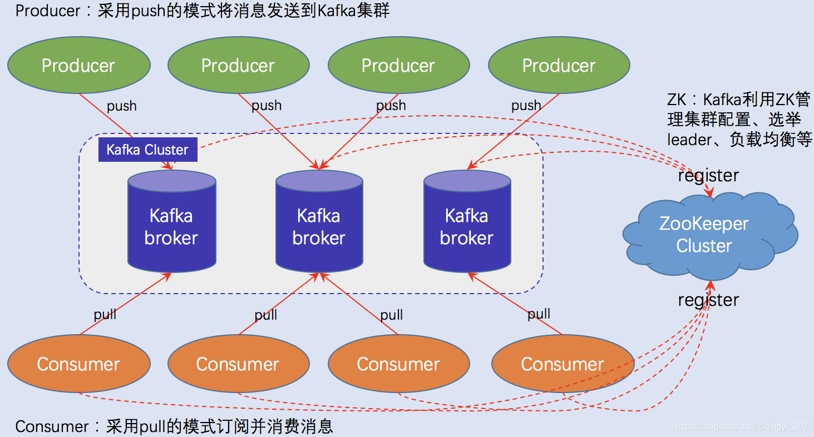
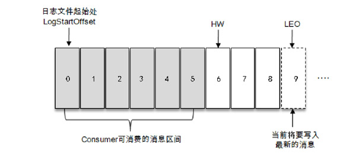
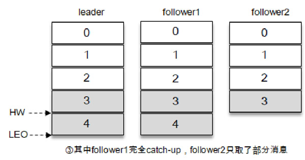
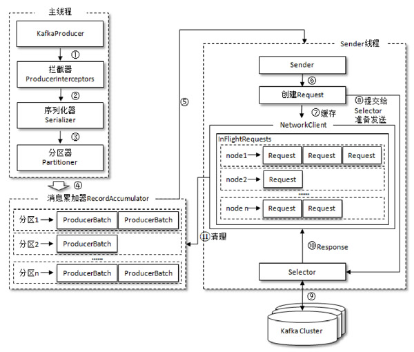
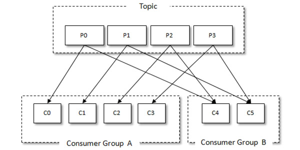
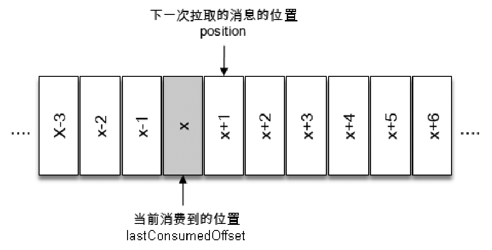
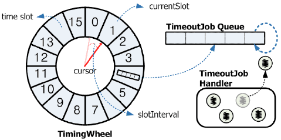

# 《深入理解Kafka》

!!! abstract "阅读信息"

    - **评分**：⭐️⭐️⭐️⭐️
    - **时间**：03/24/2022 → 03/28/2022
    - **读后感**：学习 Kafka 的推荐书籍，详细解释了 Kafka 的基础概念和原理，如生产线程与发送线程、主题与分区、消费组与消费者、时间轮实现的定时任务、如何保证消息的顺序性和可靠性等

## 基础架构

Kafka 所扮演的角色：

1. 消息系统：系统解耦、冗余存储、流量削峰、缓冲、异步通信、扩展性、可恢复性等，同时实现了消息顺序性及回溯消费
2. 存储系统：消息持久化至磁盘，以支持重复消费及降低数据丢失
3. 流式处理平台：提供完整的流式处理类库，如窗口、连接、变换和聚合等

<figure markdown>
  { width=80% }
  <figcaption>Kafka 架构体系</figcaption>
</figure>

Kafka 由多个 Producer、Broker、Consumer和一个 ZooKeeper 组成，ZooKeeper 负责集群元数据的管理、选举操作等。Producer 将消息发送到 Broker，Broker 负责将收到的消息存储到磁盘中，而Consumer 负责从 Broker 订阅并消费消息。

!!! Note "Kafka 的一致性管理"

    Kafka 2.8 引入、3.0 开始逐渐默认使用 **KRaft**（Kafka Raft）模式来摆脱 ZooKeeper。4.0 已经完全淘汰 ZooKeeper，使用 KRaft 模式。

**生产者是线程安全的，消费者是非线程安全的，因为消费者有了状态。**

### 主题与分区

- 主题（Topic）：消息以主题为单位进行分类，生产者将消息发送到特定的主体，消费者订阅主题并进行消费。
- 分区（Partition）：主题是逻辑概念，每个主题可以有多个分区，但每个分区只能隶属于一个主题。分区在存储层面可以看作一个可**追加的日志**（Log）文件，消息在被追加到分区日志文件的时候都会分配一个特定的偏移量（offset）。**offset 是消息在分区中的唯一标识**，Kafka 通过它来保证消息在分区内的顺序性，不过 offset 不跨越分区，也就是说，**Kafka 保证的是分区有序而不是主题有序**。

Consumer 使用拉（Pull）模式从服务端拉取消息，并且保存消费的具体位置，当消费者宕机后恢复上线时可以根据之前保存的消费位置重新拉取需要的消息进行消费，这样就不会造成消息丢失。

### 分区同步

- AR（Assigned Replicas）表示分区内的所有副本，`AR=ISR+OSR`
- ISR（In-Sync Replicas）表示在同步延时在容忍范围内的副本
- OSR（Out-of-Sync Replicas）表示分区内滞后过多的副本
- Leader 负责维护 ISR 和 OSR 集合，默认情况下，当 Leader 副本发生故障时，只有在 ISR 集合中的副本才有资格被选举为新的 Leader，而在 OSR 集合中的副本则没有任何机会（不过这个原则也可以通过修改相应的参数配置来改变）

### HW 与 LEO

- HW（High Watermark，高水位），它标识了一个特定的消息偏移量（offset），消费者只能拉取到这个offset之前的消息
- LEO（Log End Offset），它标识当前日志文件中下一条待写入消息的 offset
- 如果不是所有的 follower 与 leader 完全同步，则 HW 与 LEO 不等，完全同步时则相等

- <figure>
    
    <figcaption>分区偏移量说明</figcaption>
  </figure>
- <figure>
    
    <figcaption>HW 与 LEO</figcaption>
  </figure>

Kafka 的复制机制既不是完全的同步复制，也不是单纯的异步复制。事实上，同步复制要求所有能工作的 follower 副本都复制完，这条消息才会被确认为已成功提交，这种复制方式极大地影响了性能。而在异步复制方式下，follower 副本异步地从 leader 副本中复制数据，数据只要被 leader 副本写入就被认为已经成功提交。在这种情况下，如果 follower 副本都还没有复制完而落后于 leader 副本，突然 leader 副本宕机，则会造成数据丢失。**Kafka 使用的这种 ISR 的方式则有效地权衡了数据可靠性和性能之间的关系**。

## 生产者

发送消息主要有三种模式：

- 发后即忘（fire-and-forget）：性能最高、可靠性最差
- 同步（sync）：性能最差、可靠性最好
- 异步（async）：平衡性能与可靠性

### 序列化器、分区器、拦截器

- 生产者需要用序列化器（Serializer）把对象转换成字节数组才能通过网络发送给Kafka。消费者需要用反序列化器（Deserializer）把从 Kafka 中收到的字节数组转换成相应的对象
- 如果消息`ProducerRecord`中指定了`partition`字段，则无需分区器（Partitioner），否则需要分区器为消息指定分区
- 拦截器（Interceptor）可用在生产者和消费者端。生产者拦截器既可以用来在消息发送前做一些准备工作，比如按照某个规则过滤不符合要求的消息、修改消息的内容等，也可以用来在发送回调逻辑前做一些定制化的需求，比如统计类工作。

<figure markdown>
  { width=80% }
  <figcaption>生产者客户端的整体架构</figcaption>
</figure>

如图所示，整个生产者客户端由两个线程协调运行，这两个线程分别为**主线程**和**发送线程**。在主线程中由 KafkaProducer 创建消息，然后通过可能的拦截器、序列化器和分区器的作用之后缓存到消息累加器（RecordAccumulator，也称为消息收集器）中，以便发送线程可以批量发送，进而减少网络传输的网络资源消耗，缓存大小可通过客户端参数`buffer.memory`配置，默认为 32MB。Sender 线程负责从 RecordAccumulator 中获取消息并将其发送到 Kafka 中。**如果生产者发送消息的速度超过发送到服务器的速度，则会导致生产者空间不足**。

消息收集器中为每个分区都维护了一个**双端队列**，队列中存储了ProducerBatch（消息批次），ProducerBatch中包含多个ProducerBatch，这样使字节的使用更加紧凑。**消息写入缓存时，追加到双端队列的尾部；Sender读取消息时，从双端队列的头部读取**。

元数据是指 Kafka 集群的元数据，这些元数据具体记录了集群中有哪些主题，这些主题有哪些分区，每个分区的 leader 副本分配在哪个节点上，follower 副本分配在哪些节点上，哪些副本在 AR、ISR 等集合中，集群中有哪些节点，控制器节点又是哪一个等信息。**元数据的更新操作由发送线程发起**。当需要更新元数据时，会先挑选出 leastLoadedNode，然后向这个 Node 发送 MetadataRequest 请求来获取具体的元数据信息。

### 生产者的重要参数

- `acks`：指定分区有多少个副本成功接收消息才被认为写入成功
    - `acks=1`（默认值）。生产者发送消息之后，只要分区的 leader 副本成功写入消息，那么它就会收到来自服务端的成功响应，否则收到错误响应，此时生产者可选择重发消息。`acks=1`，是消息可靠性和吞吐量之间的折中方案
    - `acks=0`。生产者发送消息之后不需要等待任何服务端的响应。此时可达最大吞吐量
    - `acks=-1` 或 `acks=all`。生产者在消息发送之后，需要等待 ISR 中的所有副本都成功写入消息之后才能够收到来自服务端的成功响应。在其他配置环境相同的情况下，`acks=-1（all）`可以达到最强的可靠性。但这并不意味着消息就一定可靠，因为 ISR 中可能只有 leader 副本，这样就退化成了`acks=1`的情况
- `max.request.size`：指定生产者客户端能发送的消息最大值，默认为 1MB。通常默认值足够满足大多数场景，修改时需要与其它参数联动。
- `retries`和`retry.backoff.ms`：分别用于设定重试次数（默认为 0）和重试间隔时间（默认为 100）
- `compression.type`：指定消息的压缩方式，默认为 `none`，可选的参数有 `gzip`、`snappy`、`lz4`。**如果对延时有要求，则不推荐对消息压缩**。
- `connections.max.idle.ms`：最大连接时间，默认为 540000ms（9min）
- `linger.ms`：指定生产者发送 ProducerBatch 之前等待更多消息（ProducerRecord）加入ProducerBatch 的时间，默认值为 0。增大这个参数的值会增加消息的延迟，但是同时能提升一定的吞吐量。该参数与 TCP 协议中的 Nagle 算法有异曲同工之妙。
- `receive.buffer.bytes`：设置 Socket 接收消息缓冲区的大小，默认为 32KB。如果设置为-1，则使用操作系统的默认值
- `send.buffer.bytes`：设置 Socket 发送消息缓冲区的大小，默认为 128KB。如果设置为-1，则使用操作系统的默认值
- `request.timeout.ms`：配置 Producer 等待请求响应的最长时间，默认值为 30000（ms）。请求超时之后可以选择进行重试。注意这个参数需要比 broker 端参数`replica.lag.time.max.ms`的值要大，这样可以减少因客户端重试而引起的消息重复的概率。

## 消费者

{ width=30% align=right }
当消息发布到主题后，只会被投递给订阅它的每个消费组中的一个消费者。每个消费者只能消费所分配到的分区中的消息。这种模式可以让整体的消费能力具备横向伸缩性。

消费组是逻辑概念，消费者是具体的消费线程。**在一个消费组内，一个分区最多只能被一个消费者消费**，这就意味着，如果消费者的数量大于分区的数量，多出来的消费者将处于空闲状态。因此，**消费组的并发能力由分区数和消费者数的较小值决定**（`Concurrency = min(Partitions, Consumers)`）。

{ width=30% align=left }

Kafka中的消费是基于拉模式的。消费位移存储在Kafka内部的主题`__consumer_offsets`中，消费者在消费完消息之后需要执行消费位移的提交。

### 消息投递模式

- 点对点（P2P，Point-to-Point）模式：基于队列，消息生产者发送消息到队列，消息消费者从队列中接收消息。
- 发布/订阅（Pub/Sub）模式：消息发布者将消息发布到某个主题，而消息订阅者从主题中订阅消息。主题使得消息的订阅者和发布者互相保持独立，不需要进行接触即可保证消息的传递，发布/订阅模式在消息的一对多广播时采用。

Kafka 同时支持两种消息投递模式：

- 如果所有的消费者都隶属于同一个消费组，那么所有的消息都会被均衡地投递给每一个消费者，即每条消息只会被一个消费者处理，这就相当于点对点模式的应用。
- 如果所有的消费者都隶属于不同的消费组，那么所有的消息都会被广播给所有的消费者，即每条消息会被所有的消费者处理，这就相当于发布/订阅模式的应用

Push 模式有较好的实时性，但需要流控机制确保 Broker 推送的消息不会压垮消费端。Pull 模式实时性较差，但消费端能根据自己的消费能力来控制消费速率。

### 消费者重平衡

Rebalance 是指消费组内的消费者共同参与，协商分配所订阅主题分区的过程。

- **触发条件**：
    1. 消费组内的成员发生变更（新消费者加入、离开或宕机）。
    2. 订阅的主题数量发生变更。
    3. 订阅的主题的分区数发生变更。
- **分配策略**：
    - `Range`：按主题对分区排序，将连续的分区分配给消费者。
    - `RoundRobin`：将所有分区和消费者按字典排序，然后轮询分配。
    - `Sticky`（粘性分配）：在尽量保证均衡的前提下，尽可能保留原有的分配关系，减少不必要的分区迁移。
- **Rebalance 风险**：重平衡期间，整个消费组会暂停消费（Stop-The-World），对系统吞吐量有极大影响。工程中应通过合理配置心跳超时（`session.timeout.ms`）和最大处理时间（`max.poll.interval.ms`）来避免无效的频繁 Rebalance。

## 时间轮

{ width=40% align=right }
**时间轮由环形数组和双向链表组成。环形数组用于存储时间，双向链表用于存储该时刻的任务队列**。时间轮与钟表类似，它是一个层级的结构（**层级时间轮**）。假设时间轮以 0 开始，共有 60 个时刻，每个时刻的间隔为 1s，则当我们有一个 60s 的任务需要执行时，将任务放入指定的时刻即可，但有 72s 的任务该如何放置呢？此时可以放在时间轮的第二层，也就是钟表的分钟刻度上，也就是放在第二层的第一个刻度上。当指针从 0 刻度转动一圈后，此时 72s 的任务只剩下 12s 的执行时间，就将该任务移动到下一层的对应的刻度，这样就能准确执行定时任务了。

当指针转动时，做了两件事：

1. 将高维度的任务**逐级降维**到最低维，如将小时、分钟的任务逐级降低，直至秒级
2. 取出最低维的任务执行

## 延时操作

延时任务与定时任务都可以通过时间轮来解决，延时任务是**相对时间**，定时任务是**绝对时间**。

原生的 Kafka 并不支持延时队列，RabbitMQ 和 RocketMQ 则支持延时队列。

延时队列用于：

1. 用户下单后有 15 分钟的支付时间
2. 用户订单结束 1 小时后，回收订单的专用虚拟号码

## 死信队列

由于某些原因消息无法被正确地投递，为了确保消息不会被无故地丢弃，就将其放入死信队列中。后续可通过分析死信队列以分析及改善系统。

在 RabbitMQ 中，死信一般通过 broker 端存入，而在 Kafka 中原本并无死信的概念，所以要根据应用情况选择合适的实现方式。

## 消息轨迹

消息轨迹指的是一条消息从生产者发出，经由 broker 存储，再到消费者消费的整个过程中，各个相关节点的状态、时间、地点等数据汇聚而成的完整链路信息。

## 消息回溯

一般消息在消费完成之后就被处理了，之后再也不能消费该条消息。但消息回溯则可以在消费者确认消费后将已消费的消息推入消息回溯区，当回溯区的消息达到最大生命周期时，就会永久删除。

## 消息幂等性

| 类型             | 消息重复 | 消息丢失 | 优势                                                         | 劣势                               | 适用场景                                                                 | 使用频率 |
| ---------------- | :------: | :------: | ------------------------------------------------------------ | ---------------------------------- | ------------------------------------------------------------------------ | :------: |
| **最多一次**     |    ✗     |    ✓     | 生产端发送消息后不用等待和处理服务端响应，消息发送速度会很快 | 网络或服务端有问题会造成消息的丢失 | 消息系统吞吐量大且对消息的丢失不敏感。例如，日志收集、用户行为收集等场景 |    低    |
| **最少一次**     |    ✓     |    ✗     | 生产端发送消息后需要等待和处理服务端响应，如果失败会重试     | 吞吐量较低，有重复发送的消息       | 消息系统吞吐量一般，但是绝不能丢消息，对于重复消息不敏感                 |   最高   |
| **有且仅有一次** |    ✗     |    ✗     | 消息不重复，消息不丢失，消息可靠性很好                       | 吞吐量较低、性能开销大             | 对消息的可靠性要求很高，同时可以容忍较小的吞吐量                         |   中等   |

!!! tip "工程实践中的选择"

    在实际的后端工程中，**“最少一次 (At least once) + 消费端自行实现业务幂等性”** 是最主流、最稳妥的解决方案（例如在数据库层面加唯一索引，或使用 Redis 记录处理状态）。
    虽然 Kafka 等中间件提供了“有且仅有一次（Exactly-once）”的事务支持，但由于其较高的性能开销，通常只在流式处理（如 Kafka Streams / Flink 计算）或对强一致性要求极高的特定场景才会使用。

精确一次是大多数 MQ 难以提供的。

Kafka 通过事务保证消息的原子性，以提供精确一次的能力。

## 优先级队列

优先级队列不同于先进先出队列，优先级高的消息具备优先被消费的特权，这样可以为下游提供不同消息级别的保证。优先级队列只有在 Broker 有消息堆积时才有意义。

## 流量控制

流量控制（flow control）是为了匹配发送方和接收方速度的匹配问题。常用的流控方法有`stop-and-wait`、滑动窗口和令牌桶等。

## 高可用与选主机制

Kafka 的高可用依赖于多副本和控制器的协调。

- **控制器（Controller）**：集群中会选举出一个 Broker 作为 Controller，它是集群管理的“大脑”，负责管理整个集群中所有分区和副本的状态。当某个 Broker 挂掉时，Controller 会负责为其上受影响的 Leader 副本重新选举。
- **Unclean Leader Election**：如果一个分区的 Leader 挂了，通常会从 ISR（同步副本集合）中选出一个新的 Leader。但如果 ISR 中的副本都挂了，是否允许从 OSR（不同步副本）中选举？
    - 如果允许（开启 Unclean 选举），系统可用性保住了，但会面临严重的数据丢失风险。
    - 如果不允许，分区将不可用，直到 ISR 中的副本恢复。这是一种可用性与一致性的权衡。

## 日志清理策略

为了防止磁盘被无限制撑爆，Kafka 提供了两类日志清理策略：

1. **日志删除（Log Retention/Delete）**：直接删除旧数据。可以通过时间配置（如 `log.retention.hours=168` 保留7天）或大小配置（如 `log.retention.bytes`）来触发删除机制。
2. **日志压缩（Log Compaction）**：针对某些具有相同 Key 的消息，Kafka 在后台会定期进行合并压缩，只保留该 Key 的最新一个 Value。这种机制非常适合场景如：系统状态同步、配置中心等。Kafka 内部用来存储消费位移的主题 `__consumer_offsets` 就是使用日志压缩策略来减小存储体积的。

## 高性能原理

Kafka 之所以能实现百万级 QPS 的惊人吞吐量，主要归功于以下三项核心设计：

1. **顺序写磁盘**：磁盘的随机读写极慢，但顺序写盘的速度甚至能匹敌内存的随机读写。Kafka 将消息作为追加日志（Append Log）持久化，省去了磁头寻址的开销。
2. **PageCache（页缓存）**：Kafka 没有在 JVM 进程内部维持大量的内存缓存，而是大量使用操作系统的 PageCache。数据写入时直接进入内核空间的页缓存，由操作系统决定何时刷盘，极大地降低了 JVM 的垃圾回收（GC）负担。
3. **零拷贝（Zero-Copy）**：传统文件读取到网络发送需要经过多次上下文切换和数据拷贝。Kafka 消费者拉取数据时，使用系统的 `sendfile` API，数据直接在内核态从 PageCache 传输到网卡缓冲区（NIC Buffer），也就是所谓的“零拷贝”，这让消费过程对 CPU 的消耗降到了最低。
