# 《网络是怎样连接的》

!!! abstract "阅读信息"

    - **评分**：⭐️⭐️⭐️⭐️
    - **时间**：09/05/2021 → 12/14/2021
    - **读后感**：本书最重要部分为第 2 章，其它章节可快速查阅

<aside>
💡 Keywords：三四握手、四次挥手、滑动窗口、拥塞控制、重传时间

</aside>

## 常见浏览器协议

<figure align="center">
   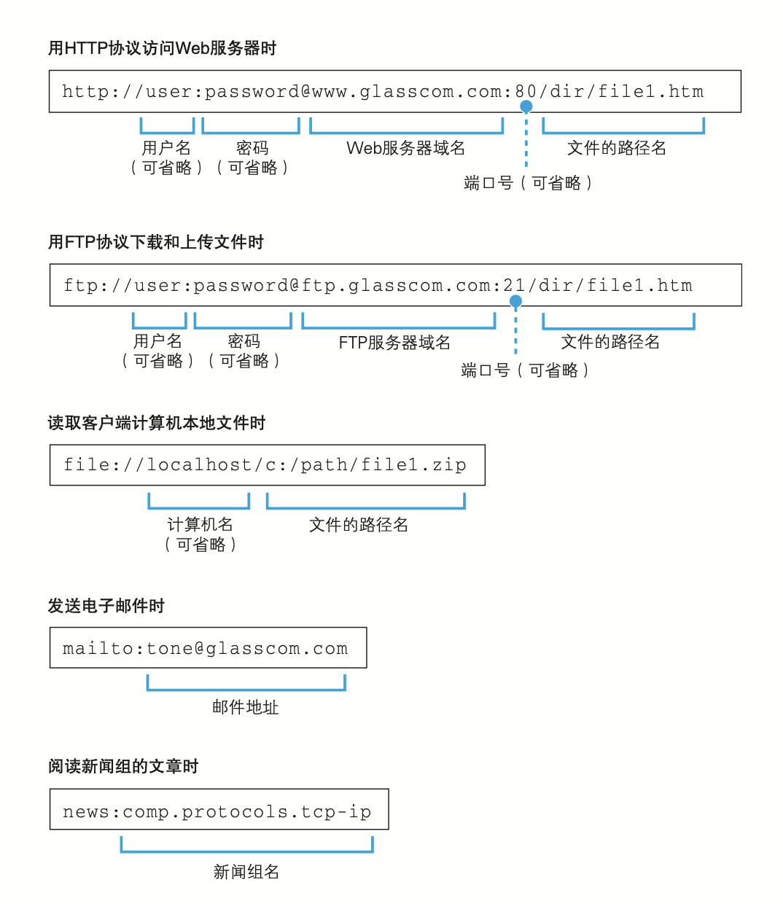
</figure>

浏览器是一个具备多种客户端功能的综合性客户端软件。除了 HTTP 浏览网页外，还支持 FTP 协议上传与下载文件，各种 APP 自定义协议打开本地软件等。

DNS 中的 MX 是 Mail Exchange 的缩写。

## TCP/IP

### 收发数据的 4 个阶段

<figure align="center">
   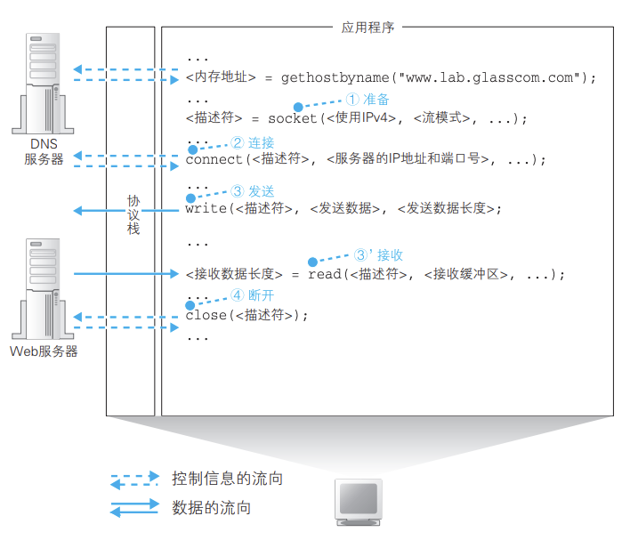
</figure>

1. 创建 socket（**创建**阶段）
    1. 描述符是用于标识不同 socket 的。IP 用于识别哪台计算机，而描述符则用于识别计算机上的哪个程序。
    2. 创建 socket 时，不仅要申请控制信息的空间，还要申请数据收发操作的缓冲区。
    3. 应用程序下是 socket，以建立连接，解析器则用于向 DNS 查询服务器 IP 地址。
2. 将管道连接到服务器的 socket 上（**连接**阶段）
    1. 描述符是用来在一台计算机内部识别套接字的机制，端口号则是用来让通信的另一方能够识别出套接字的机制。
    2. 既然确定连接对象的 socket 需要使用端口号，那么服务端如何得知客户端的 socket 端口号呢？其实，客户端在创建 socket 时，协议栈会为这个套接字随便分配一个端口号，并在接下来的连接过程中将端口号告知给服务端。
    3. 以太网的网线一直是连接状态，并不需要我们插拔网线，那建立连接是什么意思呢？**建立通信连接实际上是通信双方交换控制信息**。因为在连接阶段，由于数据收发还没有开始，网络包中没有实际的数据，只有控制信息。
    4. 如果连接建立完成，请求方突然因某种原因下线，比如停电，服务端此时如何处理呢？TCP 中还有一个**保活计时器**，**服务端每次收到一个请求方的数据包，就会更新保活计时（2h），如果保活计时器倒计时结束都未能收到新的数据包，则连续向请求方发送 10 个间隔为 75s 的探活报文段，如果请求方一直未能响应，则服务端关闭该连接。**Linux 的保活参数查看路径 `/proc/sys/net/ipv4/{tcp_keepalive_time|tcp_keepalive_intvl|tcp_keepalive_probes}`
3. 收发数据（**通信**阶段）
    1. 使用 `write()` 将消息写入消息通道，用 `read()` 从响应消息的缓冲区读取数据。
    2. 决定数据包是否发送有两个因素：
        1. 缓冲区是否已满（高效）。MTU 表示网络包的最大长度，在以太网中一般是 1500 字节，MTU 是包含头部的总长度。MSS 则是 MTU 减去头部后所容纳的数据长度。
         <figure align="center">
            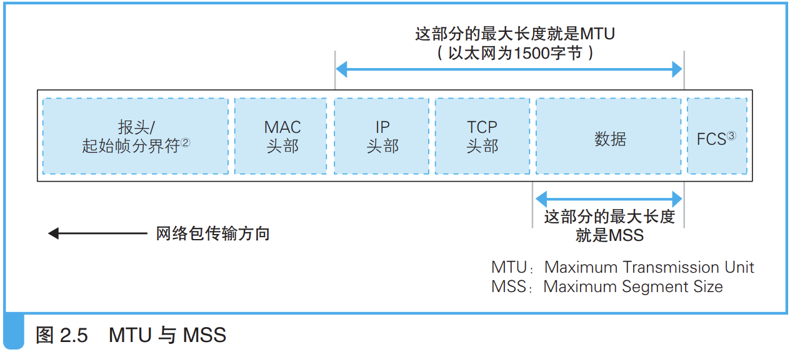
         </figure>
        2. 是否已到达时间（及时）

    3. 当发送较大的数据时，需要将数据拆分至不同的报文中。
    4. 使用 ACK 确认收到，在得到对方的确认之前，已发送的包都会保存再发送缓冲区内，如果对方超时没有返回 ACK 号，则重新发送该包。有了确认机制，才能保证 TCP 是可靠连接的。**ACK 确认机制非常强大，网卡、集线器、路由器都没有错误补偿机制，当检测到错误就直接丢弃相应的包，而 TCP 检测到对方未收到时，会自动重试，这样一来，应用程序只管发送数据即可**。但出现网络中断、服务器宕机等问题时，TCP 会在尝试几次后强制结束通信，并向应用程序报错。
    5. 实际发送时，为了提升效率，发送方并不是等待接收方的确认后才发送下一个数据包，而是根据接收方告知的接收能力（接收窗口）发送相应片段（发送窗口）的数据包，**当此窗口内数据包全部发送完成时仍未收到此窗口内的 ACK 包，则会在超时后重新发送此窗口内的数据包**。在发送窗口内的数据，**接收方只能对按序收到数据的最高序号给出确认**，因此前边有数据包丢失，则接收方无法给出确认，发送方在超时后则会将缓存区中的数据重新发送，直至收到确认。**接收方在响应发送方的 ACK 包的同时，也会告知接收方自己期望的接收窗口（初始窗口值在建立连接发送 ACK 时给出）**，发送方则根据此向前移动发送窗口，直至所有数据发送并确认完成。

        > TCP 规定，接收方 ACK 确认推迟的延时不应超过 0.5s。

        **发送窗口除了受接收窗口影响外，还受拥塞窗口影响，发送窗口取二者中的小者**。

        如果没有滑动窗口，当发送方每发送一个报文，需要等待接收方的 ACK 确认报文后才能发送下一个报文，等待这段时间白白浪费掉了，而滑动窗口则可以连续发送窗口内的数据，同时将多个连续 ACK 报文合并为一次，极大地提升了传输效率。**关于滑动窗口的讲解可查看[此视频](https://www.youtube.com/watch?v=0_xo-Aaahtg&t=32s)**

        <figure align="center">
           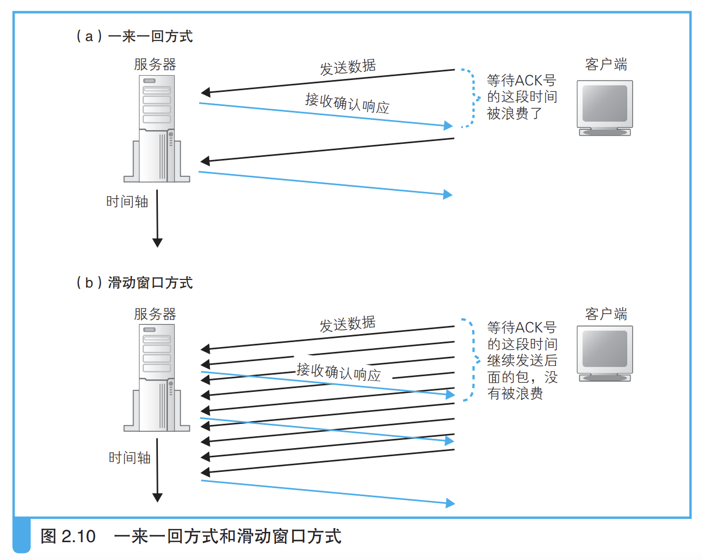
        </figure>

    6. TCP 可以动态调整 ACK 的超时时间。超时时间过短，触发的重发包会导致网络进一步阻塞，时间过长又会降低发送效率。重传时间是根据采集到的 RTT 样本根据公式计算的。 **超时重传时间可查看 [https://www.youtube.com/watch?v=AlRy3h1sYEw](https://www.youtube.com/watch?v=AlRy3h1sYEw)**
    7. 拥塞控制有 4 种算法： [https://www.youtube.com/watch?v=Xk2gMXuLmdg](https://www.youtube.com/watch?v=Xk2gMXuLmdg)
        1. 慢开始
        2. 拥塞避免（发生重传时发送速率直接掉底）
        3. 快重传（连续收到 3 个重复确认，重新发送丢失的报文，并适当降低发送速率）
        4. 快恢复

        <figure align="center">
           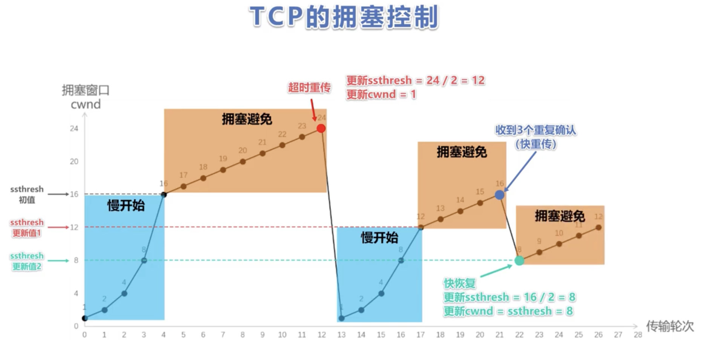
        </figure>

        [拥塞控制算法视频解析](https://www.bilibili.com/video/BV1c4411d7jb/?p=61&t=1173)

4. 断开管道并删除 socket（**断开**阶段）

<figure align="center">
   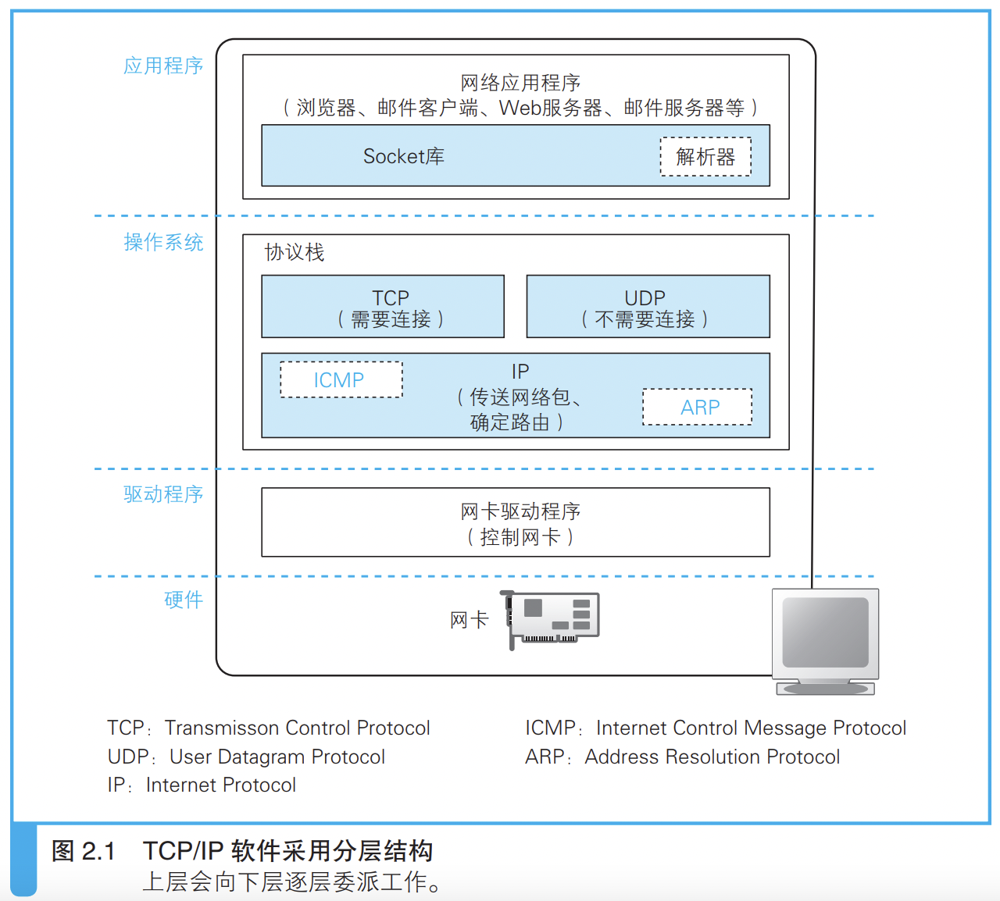
</figure>

协议栈在设计上允许任何一方先发起断开过程。

### TCP 报文格式

<figure align="center">
   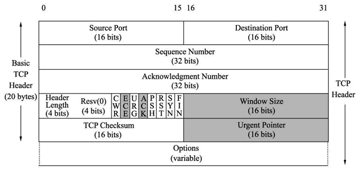
</figure>

TCP 报文的控制头部占 20 字节。首部格式可查看[此视频](https://www.youtube.com/watch?v=X4ts8x0onp4)

| 字段名称                     | 长度(bit) | 含义                                                                                                                                                                                                                                                                                                                                                                    |
| ---------------------------- | --------- | ----------------------------------------------------------------------------------------------------------------------------------------------------------------------------------------------------------------------------------------------------------------------------------------------------------------------------------------------------------------------- |
| 发送方端口号                 | 16        | 发送网络包的程序端口号                                                                                                                                                                                                                                                                                                                                                  |
| 接收方端口号                 | 16        | 网络包的接收方程序的端口号                                                                                                                                                                                                                                                                                                                                              |
| 序号（发送数据的顺序编号）   | 32        | 发送方告知接收方该网络包发送的数据相当于所有发送数据的第几个字节。实际通信中，序号是一个**随机数**，以避免攻击，在请求方发送 SYN 建立连接时，同时会告知服务方序号的随机值。                                                                                                                                                                                             |
| ACK 号（接收数据的顺序编号） | 32        | 接收方告知发送方已经收到了所有数据的第几个字节。ACK 是 acknowledge 的缩写                                                                                                                                                                                                                                                                                               |
| 数据偏移量                   | 4         | 表示数据部分的起始位置，也可以认为表示头部的长度                                                                                                                                                                                                                                                                                                                        |
| 保留                         | 6         | 保留字段，未使用                                                                                                                                                                                                                                                                                                                                                        |
| 控制位                       | 6         | URG：表示紧急指针字段有效<br>ACK：表示接收数据序号字段有效，一般表示数据已被接收方收到。因为网络中经常会发生错误，网络包也会发生丢失，因此双方在通信时必须通过 ACK 相互确认网络包是否已经送达。<br>PSH：表示告诉对方立即将该报文推送给上层，而非缓存起来<br>RST：强制断开连接，用于异常中断的情况<br>SYN：发送方和接收方相互确认序号，表示连接操作<br>FIN：表示断开连接 |
| 窗口                         | 16        | 接收方告知发送方窗口大小（即无需等待确认可一起发送的数据量）                                                                                                                                                                                                                                                                                                            |
| 校验和                       | 16        | 用于检查是否出现错误                                                                                                                                                                                                                                                                                                                                                    |
| 紧急指针                     | 16        | 表示应紧急处理的数据位置。当发送方有紧急数据时，可将紧急数据插队到发送缓存的最前面，并立刻封装到一个 TCP 报文段中进行发送，紧急指针会指出本报文段数据再和部分包含了多长的紧急数据，紧急数据之后是普通数据。                                                                                                                                                             |
| 可选字段                     | 可变长度  | 除了连接操作外，很少使用可选字段                                                                                                                                                                                                                                                                                                                                        |
| 数据                         | MTU       | MTU（Maximum Transmission Unit，最大传输单元）是指网络层能够传输的最大数据包大小（包含头部），以太网中通常为 1500 字节。超过 MTU 的数据包需要分片传输。                                                                                                                                                                                                                 |

### TCP 的三次握手与四次挥手

三次握手与四次挥手都是为了**在不可靠的信道上建立可靠的连接**。

<div class="grid cards" markdown>
-  <figure>
    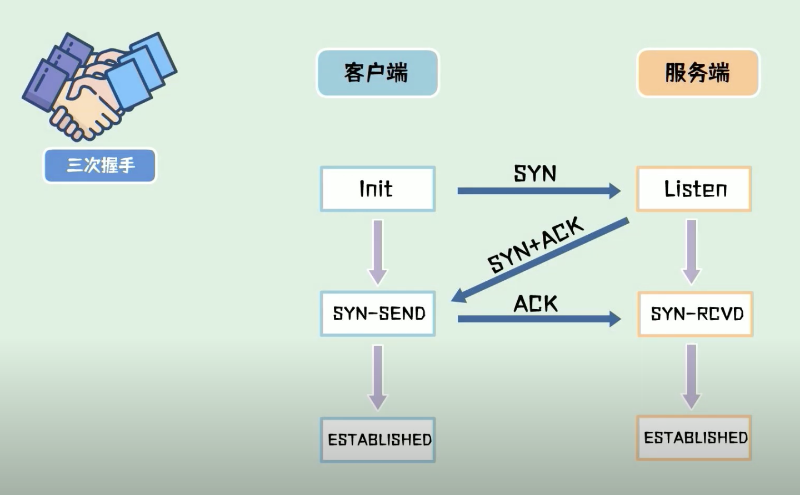
  </figure>
-  <figure>
    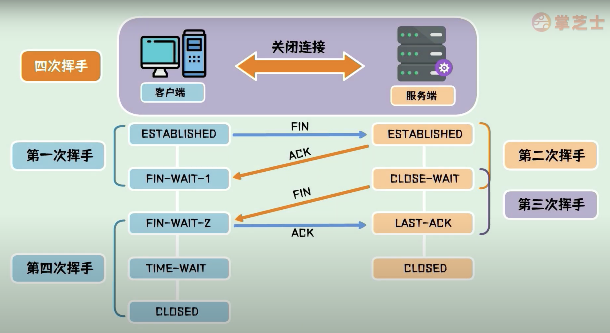
  </figure>
</div>

??? question "为什么不能用两次握手？[视频讲解](https://youtu.be/Iuvjwrm_O5g?t=143)"

    **场景一：旧 SYN 导致误建连接**

    客户端第一次发送 `SYN` 因网络拥塞长时间滞留，随后客户端重发 `SYN` 并完成一次正常连接。
    如果之前滞留的 `SYN` 又到达服务端，而协议只需两次握手，服务端可能再次建立连接，形成“客户端无感知、服务端多连接”的状态不一致。

    **场景二：服务端过早进入已连接状态**

    若只做两次握手，服务端在发出 `SYN+ACK` 后就认为连接已建立；但客户端可能根本没收到这个响应。
    此时服务端会维护一个实际上不存在的连接（半开连接），造成资源浪费，严重时可被利用发起 `SYN Flood` 攻击。

??? question "为什么客户端需要等待2MSL？[视频讲解](https://youtu.be/Iuvjwrm_O5g?t=340)"

    !!! tip "核心原因"
        主动关闭方进入 `TIME_WAIT` 并等待 2MSL，既是为了保证对端能正常关闭连接，也是为了避免旧连接的延迟报文干扰后续新连接。

    **原因一：确保最后 ACK 可达，帮助对端可靠关闭**

    主动关闭方发送最后一个 `ACK` 后，如果该包丢失，被动关闭方收不到确认，就会重传 `FIN`。
    主动关闭方在 `TIME_WAIT` 期间仍保留连接状态，因此还能重发 `ACK`，让对端最终进入关闭状态。

    **原因二：让旧连接报文在网络中自然消失，避免串线**

    等待 2MSL 可以覆盖“一个报文来回网络”的最大生存时间，确保旧连接中滞留的报文都过期失效。
    这样即使后续复用同一四元组（源 IP/端口 + 目的 IP/端口）建立新连接，也不容易被旧报文污染。

??? question "出现大量 `TIME_WAIT` 和 `CLOSE_WAIT` 时怎么处理？"

    **`TIME_WAIT` 过多（主动关闭方）**

    `TIME_WAIT` 是 TCP 正常机制，用于等待 2MSL 以保证连接可靠终止并避免旧报文干扰新连接。
    常见诱因是短连接过多、服务端主动断连过于频繁。
    处理思路：优先减少连接创建/销毁频率（连接池、Keep-Alive、长连接复用），并结合业务削峰限流；一般不建议为“清状态”而激进修改内核参数。

    **`CLOSE_WAIT` 过多（被动关闭方）**

    `CLOSE_WAIT` 表示本端已收到对方 `FIN`，但应用程序还没有调用 `close()` 结束本端连接。
    因此它通常不是网络问题，而是代码路径问题：异常分支未释放连接、阻塞导致未执行关闭、资源未正确回收等。
    处理思路：重点排查应用日志与连接生命周期，确保所有分支都能执行 `close/finally`，并检查数据库/HTTP 客户端是否正确归还连接。

    [这里](https://juejin.cn/post/6844903734300901390)有一个真实 `CLOSE_WAIT` 故障案例：服务端只开启事务却未 `commit/rollback`，导致连接无法及时释放，最终连接资源耗尽并出现 504。

[TCP 三次握手与四次挥手视频讲解](https://www.youtube.com/watch?v=Iuvjwrm_O5g)

### TCP 与 UDP 的应用场景

对数据可达性要求高的需要使用 TCP 协议，而语音、视频通话等可以容忍部分数据包丢失的场景可使用 UDP，对延时要求较高的服务也使用 UDP 协议，如在线游戏、直播、网络通话等。

### 端口号

TCP/IP 协议体系的传输层使用端口号区分应用层的不同进程，端口号的取值范围是 0~65535，分为以下 3 种类型：

- 熟知端口号：0~1023，IANA 把这些端口号指派给了 TCP/IP 中最重要的一些应用协议
- 登记端口号：1024~49151，为没有熟知端口号的应用程序使用，使用这类端口号必须在 IANA 等级，以防重复。
- 短暂端口号：49152~65535，给客户进程选择暂时使用，当服务器收到客户端报文后，即可知道客户端使用了动态端口号，通信结束后，这个端口号可供其它程序使用。

Linux 文件`/etc/services` 包含一张知名协议与对应端口间的映射表

### IPv4 数据包首部格式

[Youtube：IPv4 数据报的首部](https://www.youtube.com/watch?v=fZ9vq3MT2GQ)

可变部分后的填充部分是为了保证首部长度为 4 的整数倍。

TTL 最初是以秒为单位，路由器扣除报文在该路由器的处理时间，现代路由器很多处理报文时间小于 1s，因此修改为跳数，报文每经过一个路由器时该值减 1，以避免报文在环路中无限发送。

## 协议层

### OSI 模型

- IP 协议负责产生网络包，而网卡则负责完成实际的收发操作
- 网络层提供主机间的逻辑通信
- 传输层提供进程间的逻辑通信

!!! info "WebSocket 与 Socket"

    WebSocket 是应用层协议，Socket 是传输层协议。WebSocket 实现了在单个 TCP 连接上的全双工通信，适用于聊天、网络游戏等低延时场景。

<figure align="center">
   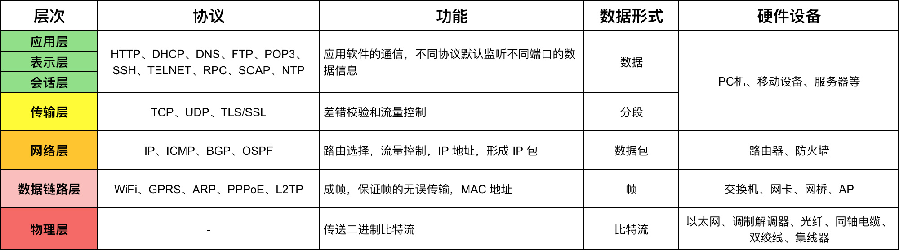
</figure>

### HTTP 版本对比

<figure align="center">
   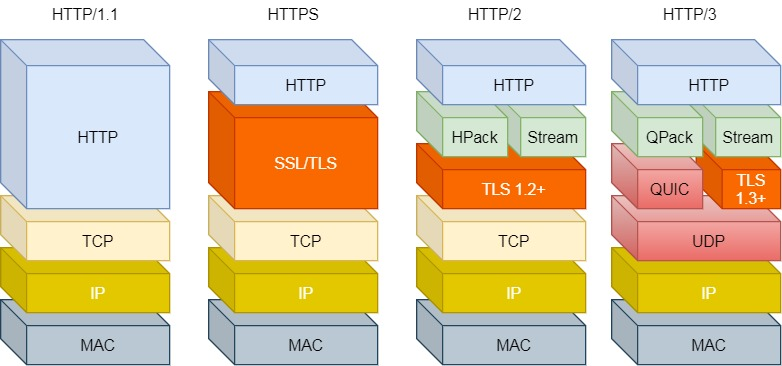
   <figcaption>HTTP 版本对比 (From <a href="https://xiaolincoding.com/network">xiaolincoding.com</a>)</figcaption>
</figure>

### ICMP

ICMP 是封装在 IP 数据包中发送。

4 种常见的 ICMP 差错报告：

1. 终点不可达：路由器不知道如何将报文投递给下个节点，或主机无法交付给应用程序（目标端口号不存在）
2. 时间超时：路由器丢弃 TTL 为 0 的数据包
3. 参数问题
4. 改变路由（重定向）

常见的使用 ICMP 协议的命令：

1. ping（Packet InterNet Groper，分组网间探测）：用于测试主机或路由器间的连通性，应用层直接使用网际层的 ICMP
2. traceroute：用于测试 IP 数据包从源主机到目标主机要经过哪些路由器

### 数据包的奇妙之旅

让我们以一次完整的 HTTPS 网页请求为例，看看一滴数据的生命周期经历了怎样完整的接力流程：

1. **DNS 查询**
   依次检查**浏览器缓存** -> **操作系统缓存** -> **本机 `hosts` 文件**。若均未命中，则向本地配置的 DNS 服务器发起查询。本地 DNS 再通过**根域名服务器**、**顶级域名服务器**进行迭代递归查询，最终找到**权威域名服务器**获取真实的目标 IP 地址。

2. **建立 TCP 连接**
   通信双方通过经典的 **TCP 三次握手**，在不可靠的物理信道上建立起可靠的逻辑通信通道。

3. **TLS 安全握手**
    - 客户端向服务端发起 `ClientHello`（携带本机支持的密码套件与**客户端随机数**）。
    - 服务端返回 `ServerHello`（选定的密码套件、**服务端随机数**）及**服务器端数字证书**。
    - 客户端利用本机预置的受信任根 CA 列表以及 OCSP（在线证书状态协议）确保证书无伪造且未被吊销。
    - 校验成功后，客户端生成一个**预主密钥（Pre-Master Secret）**，并使用有效证书内嵌的非对称公钥对其加密并发送。
    - 服务器用私钥成功解密出预主密钥。此时，双方手中都独立掌握了 _客户端随机数_、_服务端随机数_ 和 _预主密钥_，双方各自用这三个要素推导计算出一致的**主密钥（Master Secret，即后续通讯均使用的对称密钥，如 AES 密钥）**。
    - 双方均使用该最终的对称密钥加密一份 `Finished` 消息发给对方验证通道是否解密正常，握手正式完成。

4. **数据封装**
   客户端从应用层开始发送真实的 HTTP 请求。数据自上而下逐层“穿衣”：
    - **传输层**：切分为 TCP 数据段，附加源/目标端口号（用于区分单台主机上的具体通信进程，确保送达指定的 Web 或 PHP 进程）。
    - **网络层**：附加 IP 头部（用于跨子网定位广域目标主机）。如果处于内网，还要经由边缘路由的 **NAT 协议** 将这列数据包的源 IP 地址替换为路由器的公网 IP。
    - **链路层**：附加 MAC 头部。借由 **ARP 协议** 在子网内部查出网关机器（下一跳）的具体以太网 MAC 硬件地址。

5. **网络流转**
   数据帧被推入网线，经过大量各级路由器、交换机、光纤等传输介质的高速接力。
    - **MAC 的不断撕毁改写**：**数据包每路过一次链路层介质，老旧的 MAC 头部都会被撕掉，并重新改写为下一跳设备的极速通信 MAC 地址**（注：只要源与目标 IP 没被篡改，包裹本质未变）。
    - **TTL 防环路死锁**：每经过一台真正的广域路由器，IP 包头的 `TTL`（Time To Live 存活跳数）会被减 1，一旦降至 0 即直接废弃该包并反馈 ICMP，免得坏种包永远死循环把带宽耗尽。
    - **宏观战略选路**：AS（自治系统，比如电信网）内依靠 OSPF 等协议根据带宽代价挑出近路，跨国跨网的大型 AS 之间则靠 BGP 握手交换地图路由表。

6. **网关接入与负载分发**
   经历接力来到机房，接入反向代理层（如 Nginx）。Nginx 在这里终结 TLS 加密后获取到明文 HTTP 请求，继而利用预设的 **Load Balance 调度策略（轮询或哈希映射等）**，把请求重定向给后端成百上千中某一台待机存活的物理业务应用服务器（如 php-fpm、Java 实例、Go 容器）。

7. **业务逻辑处理**
   应用服务器在拿到解析后的入参后执行业务代码逻辑。期间随时由于业务需要，开辟新的 TCP 通路往 Redis 读取缓存、往 MySQL 下单落盘，或依赖更轻量的 gRPC 框架触发其它平行微服务算力。核心业务结算完后，拼合成最终的 HTML 源码或者 JSON 返回至接入层 Nginx 网关。

8. **返程解包送达客户端**
   Nginx 按来时的沿途原路将响应数据抛给远端的客户端主机系统。等内核网卡将其重新捕上岸，便如剥洋葱般依次**脱掉**链路层、网络层、传输层的外衣，将最终不染尘埃的数据内容平稳注入分配给浏览器的 **Socket 缓冲内存区**，满池后唤醒处于休眠的前端程序继续读取并画出像素。
    - **TCP 的隐形护航**：在去回双向的数据流淌中，TCP 一直在默默做风控检查——巧用**滑动窗口**来推测对端接收能力，依据 RTT 不断微调最合理的**超时重传期**，甚至发现异常时自发降速启动**拥塞控制拥塞避免算法**。

9. **关闭连接**
   网页骨架和附属图片音视载入完成（或者浏览器被直接按掉红叉），数据不再传输交互：
    - 由于单个精美排版的网页往往包含几百个独立的附加资源切片，为避开反复的三回四挥冗长流程，绝大多数场景会默认挂靠在 **Keep-Alive 持久连接机制** （或者 HTTP/2 的多路复用）下静默维持旧隧道的续存状态。
    - 而若确实超时或显性关闭进入**四次挥手**：**只有主动提出断开连接的一方要面对 `TIME_WAIT` 状态（等待 2 倍的 MSL 以防自己留的半路残包重新串线乱来）**，被动配合断流的另一边则短暂停留在 `CLOSE_WAIT` 中自清家产后即刻撒手。

## 硬件设备

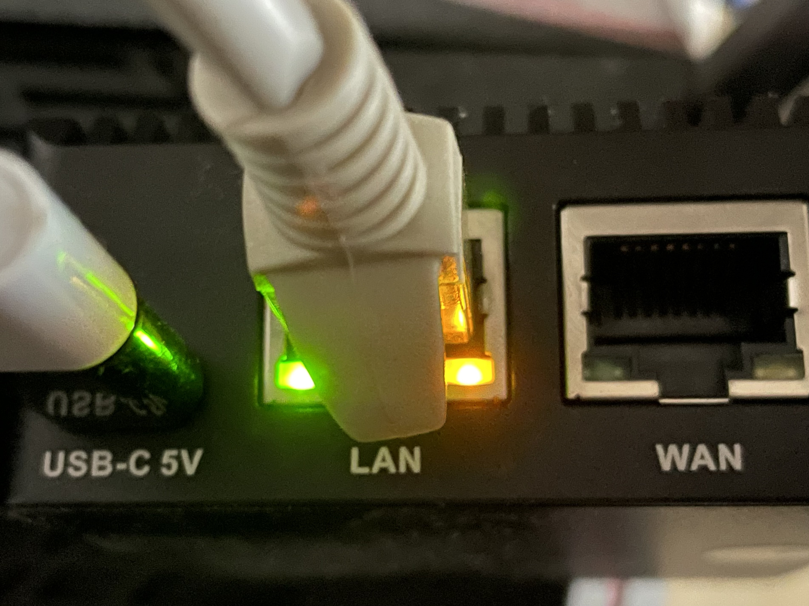{ align=right width=30% }

LAN 口左侧绿灯表示链路状态，常亮表示正常，闪烁表示异常；右侧橙灯表示通信状态，闪烁表示正在通信，熄灭表示无数据传输。

在以太网中，**当没有数据传输时，网络中会填充连接脉冲的脉冲信号**，这使得网络中一直都有一定的信号流过，**从而能够检测到对方是否正常工作**。以太网设备的网线口 LED 指示灯就是表示它是否检测到正常的脉冲信号。

### 交换机

- 交换机的端口没有 MAC 地址
- 交换机根据 MAC 地址表查找 MAC 地址，然后将信号发送到相应的端口。
- 当交换机发现一个包要发送到源端口时，就会直接丢弃这个包。
- 如果接收方 MAC 地址是广播地址（MAC 地址中的 `FF:FF:FF:FF:FF:FF` 和 IP 地址的`255.255.255.255` 都是广播地址），那么交换机会将包发送到除源端口外的所有端口。
- **交换机支持全双工模式，而集线器则不支持**。在使用集线器时，如果多台计算机同时发送信号，信号就会在集线器中发生碰撞，导致无法通信。这也是为什么交换机的效率要比集线器要高的原因。

### 以太网（家用）路由器

- 路由器的每个端口都有 MAC 地址和 IP 地址。
- **交换机通过 MAC 地址判断转发目标，而路由器则通过 IP 判断转发目标**
- **如果在路由表中无法匹配到数据包的下一跳，则路由器就会丢弃这个包，并通过 ICMP 告知发送方**。交换机无法匹配到时，则会向所有设备广播该数据包，但只有正确的目标设备会接收该包，其它设备则会丢弃数据包。**为什么路由器没有和交换机采用相同策略呢？主要原因在于网络的规模**，交换机最多连接几千台设备，而路由器则连接了几十亿的设备，而且规模还在持续扩大，如果路由器将无法转发的数据包广播，就会造成大量无效数据包占用传输容量，导致网络拥塞，因此路由器直接丢弃并配合 TCP 的重传机制可以很好的保证传输质量和效率。
- 路由表中子网掩码为 `0.0.0.0` 的记录表示“默认路由”
- 当数据包每经过一个路由器时，路由器就将 IP 头部中的 TTL 减 1，当 TTL 为 0 时，该数据包将不再被转发，从而避免死循环。
- 地址转换的基本原理是在转发网络包时对 IP 头部中的 **IP 地址和端口号进行改写**。客户端的端口本来就是从空闲端口中随机选择的，因此即使 NAT 改写也不会有问题，同时改写 IP 和端口可以增加 NAT 的映射容量。当数据收发结束，**断开连接时，对应表中的记录就会被删除**。

<figure align="center">
   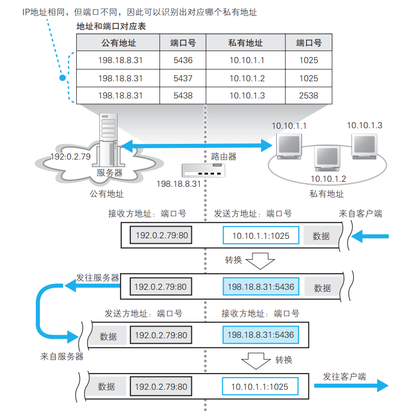
</figure>

- 以下是华硕 RC-AC5300 路由器网络配置信息，该路由器作为家庭局域网的 AP，IP 地址为`192.168.50.1`，另有 OpenWrt 作为旁路由，IP 为 `192.168.50.2`
    - `br0`：桥接接口，将局域网内的流量转发至 OpenWrt
    - `eth0`、`eth1`、`eth2`、`eth3`：分别对应 4 个 LAN 口
    - `lo`：本机环路接口
    - `ppp0`： WAN 口，与光猫通信接口，IP 为运营商的内网 IP

<details>
<summary>RT-AC5300 ifconfig 输出</summary>

    ```bash
    palemoky@RT-AC5300-E8F0:/# ifconfig
    br0       Link encap:Ethernet  HWaddr 04:92:26:84:E8:F0
              inet addr:192.168.50.1  Bcast:192.168.50.255  Mask:255.255.255.0
              inet6 addr: fe80::692:26ff:fe84:e8f0/64 Scope:Link
              inet6 addr: 2409:8a00:797e:6130::1/60 Scope:Global
              UP BROADCAST RUNNING ALLMULTI MULTICAST  MTU:1500  Metric:1
              RX packets:30003484 errors:0 dropped:0 overruns:0 frame:0
              TX packets:27241877 errors:0 dropped:0 overruns:0 carrier:0
              collisions:0 txqueuelen:0
              RX bytes:5833024476 (5.4 GiB)  TX bytes:22721052564 (21.1 GiB)

    eth0      Link encap:Ethernet  HWaddr 04:92:26:84:E8:F0
              inet addr:169.254.138.106  Bcast:169.254.255.255  Mask:255.255.0.0
              UP BROADCAST RUNNING MULTICAST  MTU:1500  Metric:1
              RX packets:81712373 errors:0 dropped:0 overruns:0 frame:0
              TX packets:80451720 errors:0 dropped:0 overruns:0 carrier:0
              collisions:0 txqueuelen:1000
              RX bytes:1855132766 (1.7 GiB)  TX bytes:1427682889 (1.3 GiB)
              Interrupt:181 Base address:0x6000

    eth1      Link encap:Ethernet  HWaddr 04:92:26:84:E8:F0
              inet6 addr: fe80::692:26ff:fe84:e8f0/64 Scope:Link
              UP BROADCAST RUNNING ALLMULTI MULTICAST  MTU:1500  Metric:1
              RX packets:0 errors:0 dropped:0 overruns:0 frame:0
              TX packets:2239149 errors:0 dropped:6 overruns:0 carrier:0
              collisions:0 txqueuelen:1000
              RX bytes:0 (0.0 B)  TX bytes:937536700 (894.1 MiB)

    eth2      Link encap:Ethernet  HWaddr 04:92:26:84:E8:F4
              inet6 addr: fe80::692:26ff:fe84:e8f4/64 Scope:Link
              UP BROADCAST RUNNING ALLMULTI MULTICAST  MTU:1500  Metric:1
              RX packets:0 errors:0 dropped:0 overruns:0 frame:0
              TX packets:126586241 errors:0 dropped:6 overruns:0 carrier:0
              collisions:0 txqueuelen:1000
              RX bytes:0 (0.0 B)  TX bytes:2189311811 (2.0 GiB)

    eth3      Link encap:Ethernet  HWaddr 04:92:26:84:E8:F8
              inet6 addr: fe80::692:26ff:fe84:e8f8/64 Scope:Link
              UP BROADCAST RUNNING ALLMULTI MULTICAST  MTU:1500  Metric:1
              RX packets:0 errors:0 dropped:0 overruns:0 frame:0
              TX packets:17263139 errors:0 dropped:5 overruns:0 carrier:0
              collisions:0 txqueuelen:1000
              RX bytes:0 (0.0 B)  TX bytes:2018140401 (1.8 GiB)

    fwd0      Link encap:Ethernet  HWaddr 00:00:00:00:00:00
              inet6 addr: fe80::200:ff:fe00:0/64 Scope:Link
              UP BROADCAST RUNNING PROMISC ALLMULTI MULTICAST  MTU:1500  Metric:1
              RX packets:127033387 errors:0 dropped:0 overruns:0 frame:0
              TX packets:59036557 errors:0 dropped:0 overruns:0 carrier:0
              collisions:0 txqueuelen:1000
              RX bytes:0 (0.0 B)  TX bytes:2074362890 (1.9 GiB)
              Interrupt:179 Base address:0x4000

    fwd1      Link encap:Ethernet  HWaddr 00:00:00:00:00:00
              inet6 addr: fe80::200:ff:fe00:0/64 Scope:Link
              UP BROADCAST RUNNING PROMISC ALLMULTI MULTICAST  MTU:1500  Metric:1
              RX packets:17234527 errors:0 dropped:0 overruns:0 frame:0
              TX packets:6890073 errors:0 dropped:0 overruns:0 carrier:0
              collisions:0 txqueuelen:1000
              RX bytes:0 (0.0 B)  TX bytes:1970132839 (1.8 GiB)
              Interrupt:180 Base address:0x5000

    lo        Link encap:Local Loopback
              inet addr:127.0.0.1  Mask:255.0.0.0
              inet6 addr: ::1/128 Scope:Host
              UP LOOPBACK RUNNING MULTICAST  MTU:16436  Metric:1
              RX packets:447993 errors:0 dropped:0 overruns:0 frame:0
              TX packets:447993 errors:0 dropped:0 overruns:0 carrier:0
              collisions:0 txqueuelen:0
              RX bytes:94957325 (90.5 MiB)  TX bytes:94957325 (90.5 MiB)

    ppp0      Link encap:Point-to-Point Protocol
              inet addr:10.66.171.191  P-t-P:10.66.128.1  Mask:255.255.255.255
              inet6 addr: 2409:8a00:7907:aba2:bc6c:1b22:3d8c:e66/64 Scope:Global
              inet6 addr: fe80::bc6c:1b22:3d8c:e66/10 Scope:Link
              UP POINTOPOINT RUNNING MULTICAST  MTU:1492  Metric:1
              RX packets:44344361 errors:0 dropped:0 overruns:0 frame:0
              TX packets:35660038 errors:0 dropped:0 overruns:0 carrier:0
              collisions:0 txqueuelen:3
              RX bytes:1040929392 (992.7 MiB)  TX bytes:3148540662 (2.9 GiB)

    vlan1     Link encap:Ethernet  HWaddr 04:92:26:84:E8:F0
              inet6 addr: fe80::692:26ff:fe84:e8f0/64 Scope:Link
              UP BROADCAST RUNNING ALLMULTI MULTICAST  MTU:1500  Metric:1
              RX packets:37299681 errors:0 dropped:0 overruns:0 frame:0
              TX packets:27440260 errors:0 dropped:0 overruns:0 carrier:0
              collisions:0 txqueuelen:0
              RX bytes:7919782985 (7.3 GiB)  TX bytes:22848436038 (21.2 GiB)
    ```

</details>

- 以下是 OpenWrt 的网络配置信息

<details>
<summary>OpenWrt ifconfig 输出</summary>

    ```bash
    root@ImmortalWrt:~# ifconfig
    eth0      Link encap:Ethernet  HWaddr 06:A8:D8:6E:B9:D7
              UP BROADCAST MULTICAST  MTU:1500  Metric:1
              RX packets:0 errors:0 dropped:0 overruns:0 frame:0
              TX packets:0 errors:0 dropped:0 overruns:0 carrier:0
              collisions:0 txqueuelen:1000
              RX bytes:0 (0.0 B)  TX bytes:0 (0.0 B)
              Interrupt:27

    eth1      Link encap:Ethernet  HWaddr A6:DA:96:2B:4A:CD
              inet addr:192.168.50.2  Bcast:192.168.50.255  Mask:255.255.255.0
              inet6 addr: fd4b:c540:a72::1/60 Scope:Global
              inet6 addr: fe80::4a8:d8ff:fe6e:b9d8/64 Scope:Link
              UP BROADCAST RUNNING MULTICAST  MTU:1500  Metric:1
              RX packets:86071547 errors:0 dropped:9 overruns:0 frame:0
              TX packets:94592931 errors:4 dropped:11 overruns:0 carrier:0
              collisions:0 txqueuelen:1000
              RX bytes:58497747969 (54.4 GiB)  TX bytes:57606494741 (53.6 GiB)

    lo        Link encap:Local Loopback
              inet addr:127.0.0.1  Mask:255.0.0.0
              inet6 addr: ::1/128 Scope:Host
              UP LOOPBACK RUNNING  MTU:65536  Metric:1
              RX packets:4426151 errors:0 dropped:0 overruns:0 frame:0
              TX packets:4426151 errors:0 dropped:0 overruns:0 carrier:0
              collisions:0 txqueuelen:1000
              RX bytes:7499632949 (6.9 GiB)  TX bytes:7499632949 (6.9 GiB)
    ```

</details>

### 互联网路由器

- 与以太网路由器不同，互联网接入路由器是按照入网规则来发送包的。
- 互联网数据包会在包头部加上 MAC 头部、PPoE 头部、PPP 头部

<figure align="center">
   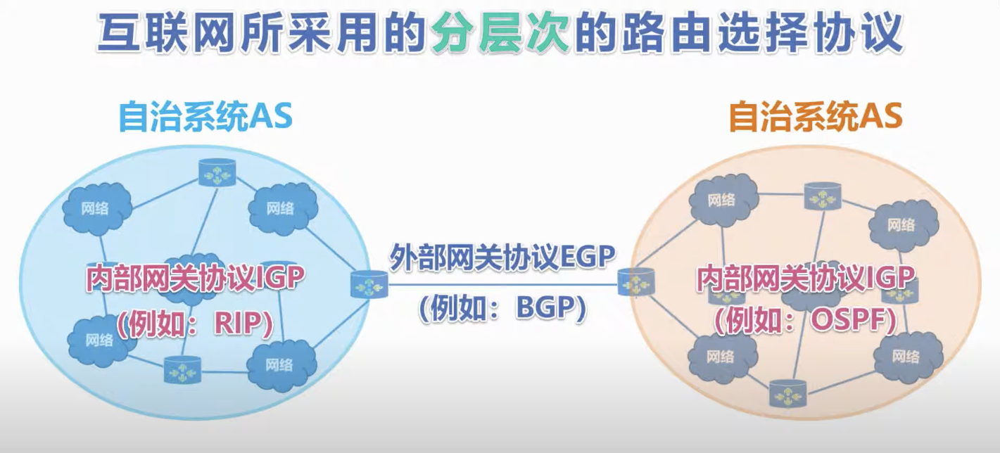
   <figcaption>From <a href="https://www.youtube.com/watch?v=PJTii2ifQ5o">YouTube：路由选择协议</a></figcaption>
</figure>

- **路由器的核心转发机制**：当接收到网络包时，路由器会同步执行两项关键的独立操作：
    1. **二层重装**：根据路由表查出下一跳的 IP，利用 ARP 协议获取该 IP 对应的物理 MAC 地址，并以此重写数据包的 MAC 头部；
    2. **三层管控**：将 IP 头部内的 `TTL`（存活跳数）减 1，以防数据包陷入环路死锁。

路由选择协议分为内部路由选择协议和外部路由选择协议：

- 内部路由选择协议 IGP
    - 路由信息协议 **RIP**。基于**距离向量**算法，使用**跳数**（Hop Count）作为度量，经过多少个路由器就有多少跳数，**距离的取值范围为 0~15**，≥ 16 被定义为无穷大，即网络不可达。在 RIP 协议中，距离越短就会被认为是最佳路径，而不考虑链路带宽等因素，下图 RIP 认为经过 R4 的路由是最佳路径。
    - 开放式最短路径优先 **OSPF**。基于**链路状态**，链路状态是指本路由器和哪些路由器相邻，以及相应链路的代价（cost），代价可以用来表示费用、距离、时延、带宽等。
    - 中间系统到中间系统 IS-IS。该协议是 ISP 骨干网上最常用的 IGP 协议
- 外部路由选择协议 EGP
    - 边界网关协议 BGP。BGP 需要根据策略找到较好的路由。在配置 BGP 时，AS 管理员要至少选择一个路由器作为该 AS 的 BGP 发言人。

!!! info

    Facebook 2021 年 10 月宕机原因就是因为其 BGP 发言人撤销了 AS 前缀，导致其它 AS 不知道如何与其联络， DNS 查询也返回 SERVFAIL，解决办法就是配置多个 BGP 发言人，当其中一个失效时，不会导致整个网络故障。[https://blog.cloudflare.com/zh-cn/october-2021-facebook-outage-zh-cn/](https://blog.cloudflare.com/zh-cn/october-2021-facebook-outage-zh-cn/)

<div class="grid cards" markdown>
-  <figure>
    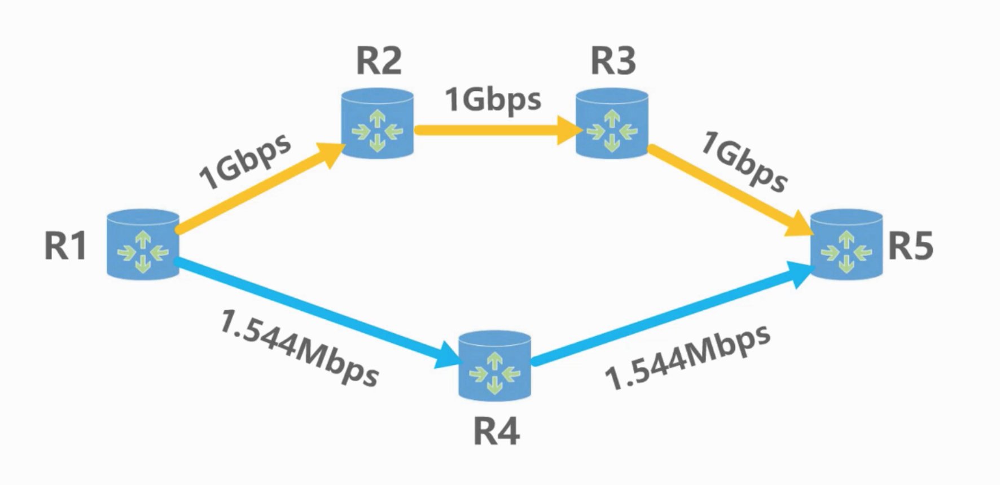
    <figcaption>RIP 协议</figcaption>
</figure>
-  <figure>
    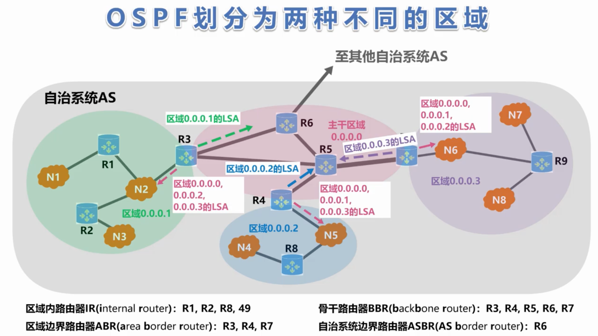
    <figcaption>From <a href="https://www.youtube.com/watch?v=wmR2HwkrSdY">OSPF 协议</a></figcaption>
  </figure>
-  <figure>
    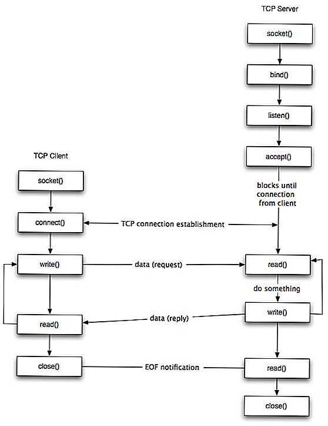
    <figcaption>TCP Socket 通信流程</figcaption>
  </figure>
-  <figure>
    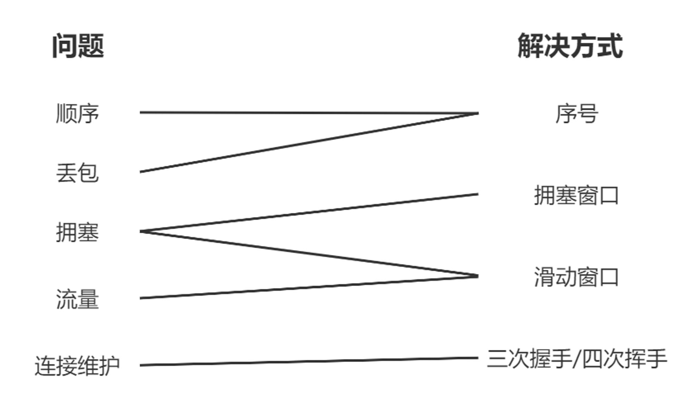
    <figcaption>TCP 可靠传输解决方案</figcaption>
  </figure>
</div>

统计 TCP 状态

```bash
netstat -n | awk '/^tcp/ {++S[$NF]} END {for(a in S) print a, S[a]}'
```

### 网卡

网卡的 MAC 模块将网络包从信号还原为数字信息，校验 FCS 并存入缓冲区，然后触发 CPU 中断。

网卡驱动根据 MAC 头部判断协议类型，并将包交给相应的协议栈。

### 防火墙

防火墙通常根据 MAC 头部、IP 头部、TCP 头部内容，按照规则决定是转发该数据包，还是丢弃。

### 网线

网线中传输的 0/1 信号本质上就是高低电压，随着传输距离的增加，电信号会不断衰减，同时来自环境中电磁波的干扰，会导致信号失真，因此需要通过双绞线等方式来减少干扰。

双绞线的传输距离最远为 100 米，而光线可达数公里。

### 光纤

<figure align="center">
   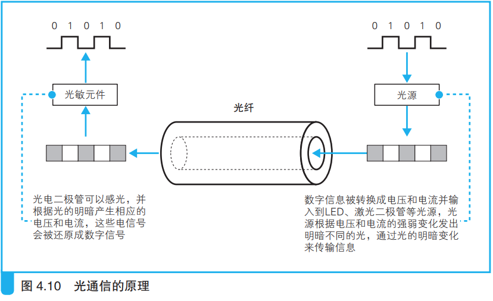
</figure>

- 光纤的优势：
    1. 带宽大，可达到 1Tbit
    2. 传输距离远，目前可达到 0.2dB/km
    3. 抗干扰强，保密性好。电磁波传输需要使用金属罩抗干扰并避免电磁信号的泄露，而光在光纤中全反射传输，因此具有很好的保密性
    4. 廉价。光纤的原材料是沙子，而地球的沙子是无穷无尽的
- 由于光纤铺设和维护成本很大，因此只有有限的大型运营商才拥有光纤，这些公司同时会向那些没有光纤的公司提供租借服务，因为光纤的传输容量是可以复用的。

### ADSL 的分离器

- 由于 ADSL 是在电话线上搭载数据包的，因此用户需要使用分离器将电话和 ADSL 的信号进行分离，如果混合信号进入电话机，ADSL 信号就会变成噪音，导致电话难以听清，调制解调器（Modem）内已经可以将 ADSL 频率外的信号过滤掉的功能。
- 分离器同时可以防止电话对 ADSL 的干扰：当拿起和放下听筒时，电话的电流变化会传导到电话线上，这就会导致 ADSL 重新握手，通信终端几十秒钟，分离器则可以避免这样的问题。

### PPPoE

PPPoE 是 Point-to-Point Protocol over Ethernet，即以太网的点对点协议，常在我们宽带认证时使用。当用户输入账号密码，运营商认证通过后，认证服务会返回公网 IP、DNS、默认网关等配置信息，用户的计算机根据这些信息完成网络配置后，就可以收发 TCP/IP 数据包进行通信了。

专线网络不需要用户认证、配置下发等，参数是根据传真或书面等方式确认后手动配置的。

## CDN

- CDN 公司通过与运营商签约，将服务器的缓存内容放在运营商处，然后再将缓存空间租借给 Web 运营网站。因为用户最先经过的就是运营商，因此能加速用户的访问，同时减少网站的请求流量。
- 用户请求未在 CDN 命中时，CDN 向源站请求拉取最新数据，更新本地缓存的动作称为回源。回源策略的选择非常重要，错误的回源策略可能会加剧网站的负担。
- CDN 通过 HTTP 请求头中的相关字段判断缓存是否过期。更新缓存有 pull（失效回源拉取数据更新）和 push（源站数据变化时主动推送更新）两种方式。
