# 《HTTP 权威指南》

!!! abstract "阅读信息"

    - **评分**：⭐️⭐️⭐️⭐️⭐️
    - **时间**：09/01/2020 → 09/30/2020
    - **读后感**：本书作为 HTTP 协议的权威书籍，与《图解 HTTP》都是非常好的学习资料

## 第 1 章 HTTP 概述

HTTP 通过为 Web 传输的对象打上 MIME 来区分数据类型。MIME 设计之初被用于解决在不同电子邮件间移动报文时存在的问题。MIME 类型通过主要的对象类型与特定的子类型来表示，如：`text/plain`。完整的 MIME 类型参见 [Media Types - IANA](https://www.iana.org/assignments/media-types/media-types.xhtml)

### HTTP 状态码

| 状态码 | 类别          | 说明               |
| ------ | ------------- | ------------------ |
| 1XX    | Informational | 接收的请求正在处理 |
| 2XX    | Success       | 请求正常处理完毕   |
| 3XX    | Redirection   | 重定向             |
| 4XX    | Client Error  | 客户端错误         |
| 5XX    | Server Error  | 服务器端错误       |

??? question "业务状态码应该与 HTTP 状态码混用吗？"

    不建议混用。很多程序员喜欢将 200 作为业务成功返回，catch 作为 500 处理，这会导致 HTTP 状态与业务状态混乱。例如收到 500 响应时，无法区分是服务器资源异常还是业务逻辑错误。

    **建议方案**：以 `0` 作为业务成功码，大于 `0` 的值作为错误码，并按类别分段：

    | 业务错误码 | 含义         |
    | ---------- | ------------ |
    | `0`        | 成功         |
    | `1xxx`     | 传入参数异常 |
    | `2xxx`     | 请求限制相关 |

    当传入非法参数时，HTTP 状态码为 200（网络通讯正常），业务状态码为 1001（业务处理异常），职责清晰。

    错误返回时还应包含简洁的错误描述与纠错提示。面向普通用户时，应重点展示错误码而非文字描述，因为文字容易在传达中偏离原意。关于错误码设计，可参考 [Stripe API Errors](https://docs.stripe.com/api/errors) 和 [Google Cloud API Error Model](https://cloud.google.com/apis/design/errors)。

??? question "应该使用 RESTful 开发吗？"

    建议使用。很多开发者只用 `GET` 或 `POST`，甚至一个 `POST` 走天下，这会导致接口语义不清、代码耦合。HTTP 的多种请求方法天然适合表达不同的资源操作：

    | 方法     | 语义     | 幂等性 |
    | -------- | -------- | ------ |
    | `GET`    | 获取资源 | ✅      |
    | `POST`   | 创建资源 | ❌      |
    | `PUT`    | 整体更新 | ✅      |
    | `PATCH`  | 部分更新 | ❌      |
    | `DELETE` | 删除资源 | ✅      |

    将所有操作糅合在一个 `POST` 中，显然不是良好的设计。

<figure markdown>
  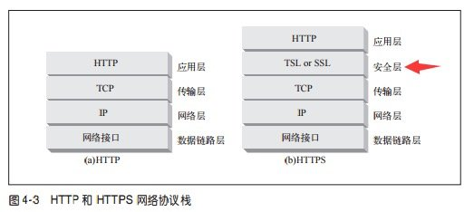{ width="80%" }
</figure>

### Web 的结构组件

- 代理：
    - 隐藏真实访问者，如匿名代理；
    - 实现流量的控制与分析，如通过代理控制某些网站的访问
- 缓存
- 网关：在局域网通过路由接入网络的环境中，网关指用于连接局域网和 Internet。网关也常指把一种协议封装为另一种协议的设备，如语音网关。
- 隧道
- Agent 代理：如搜索引擎的爬虫

## 第 2 章 URL 与资源

### URL 的各种形式

大多数的 URL 语法都建立在`<scheme>://<user>:<password>@<host>:<port>/<path>;<params>?<query>#<frag>`的通用格式上，但最重要的三个部分是由`scheme://host/path`组成。

```
http://www.example.com:80
ftp://ftp.example.com
ssh://example.github.com
mailto:username@example.com
```

以 `http://www.example.com/index.php?item=1245&color=blue` 为例，`?` 后的查询字符串表达了清晰的语义：查询编号为 1245、颜色为蓝色的商品。

## 第 3 章 HTTP 报文

### 常用的 HTTP 方法

| 方法      | 描述                                             | 是否包含主体 |
| --------- | ------------------------------------------------ | ------------ |
| `GET`     | 从服务器获取内容                                 | 否           |
| `POST`    | 向服务器发送需要处理的数据                       | 是           |
| `PUT`     | 将请求主体内容存储在服务器中                     | 是           |
| `DELETE`  | 从服务器删除文件                                 | 否           |
| `HEAD`    | 只从服务器获取文档的首部                         | 否           |
| `TRACE`   | 对可能经过代理服务器传送到服务器上的报文进行追踪 | 否           |
| `OPTIONS` | 决定可以在服务器上执行哪些方法                   | 否           |

POST 与 PUT 的不同之处在于，PUT 表示对资源进行整体覆盖，而 POST 则表示对资源的部分修改。

HEAD 允许客户端在未获取实际资源的情况下，对资源的首部进行检查。我们可以利用 HEAD 来实现：

- 在不获取资源的情况下了解资源的情况，如判断资源类型
- 通过查看响应中的状态码，判断某个对象是否存在
- 通过查看首部，测试资源是否被修改

客户端发起一个请求时，这个请求能要穿过防火墙、代理、网关或者其他一些应用程序。每个中间节点都可能会修改原始的 HTTP 请求，`TRACE` 允许客户端在最终请求发送给服务器时，查看请求的变化。

### 常用 HTTP 状态码

- 301：代表资源被永久移除，响应的 Location 首部中应该包含资源现在所处的 URL。
- 302：代表资源被临时移除（临时重定向）
- 304：代表自从上次请求后，服务端资源未发生变化，可以直接从本地缓存加载，避免带宽的浪费。
- 401：当前请求未被认证，可作为业务状态码，
- 403：请求不被允许。如用户无权限访问某个资源
- 404：请求的资源未找到
- 405：不支持的请求方法，如使用 TRACE 方法请求。使用此状态码时，应该在响应中包含 Allow 首部，以告知客户端对所请求的资源允许的方法
- 408：请求超时
- 429：请求次数过多
- 500：服务器内部错误。建议仅在意外时使用，此时需要人工介入修复。
- 502：网关错误
- 503：服务不可用
- 504：网关超时

### 首部

HTTP 首部字段将定义成缓存代理和非缓存代理的行为，分成 2 种类型：

- 逐跳首部（Hop-by-hop）：分在此类别中的首部只对单次转发有效，会因通过缓存或代理而不再转发。如`Connection`、`Keep-Alive`、`Proxy-Authenticate`、`Proxy-Authorization`、`Trailer`、`TE`、`Transfer-Encoding`、`Upgrade`等 8 个逐跳首部
- 端对端首部（End-to-end）：分在此类别中的首部会转发给请求 / 响应对应的最终接收目标，且必须保存在有缓存生成的响应中，另外规定它必须被转发
    - Connection：
        - 控制不再转发给代理的首部字段。在客户端发送请求和服务器返回响应内，使用 Connection 首部字段，可控制不再转发给代理的首部字段（即 Hop-by-hop 首部）。
        - 管理持久连接。HTTP/1.1 版本的默认连接都是持久连接。当服务器想明确断开连接时，则指定 Connection 首部字段的值为 Close。HTTP/1.1 之前的 HTTP 版本的默认连接都是非持久连接，则需要指定 Connection 首部字段的值为 Keep-Alive。
    - Accept：

        | 首部              | 描述                                                 |
        | ----------------- | ---------------------------------------------------- |
        | `Accept`          | 可处理的媒体类型，如 `text/html`、`application/json` |
        | `Accept-Charset`  | 可处理的字符集，如 `utf-8`、`gbk`                    |
        | `Accept-Encoding` | 可处理的编码方式，如 `gzip`、`deflate`               |
        | `Accept-Language` | 可处理的语言，如 `en-US`、`zh-CN`                    |

    - Upgrade：用于检测 HTTP 协议及其他协议是否可使用更高的版本进行通信，其参数值可以用来指定一个完全不同的通信协议。比如升级到 HTTPS、WebSocket、HTTP/2、HTTP/3等。
    - Via：为了追踪客户端与服务器之间的请求和响应报文的传输路径。报文经过代理或网关时，会先在首部字段 Via 中附加该服务器的信息，然后再进行转发。首部字段 Via 不仅用于追踪报文的转发，还可避免请求回环的发生。所以必须在经过代理时附加该首部字段内容。 Via 首部是为了追踪传输路径，所以经常会和 TRACE 方法一起使用。
    - 条件请求

        | 首部                  | 描述                                              |
        | --------------------- | ------------------------------------------------- |
        | `Expect`              | 客户端希望服务器遵循的特定行为，如 `100-continue` |
        | `If-Match`            | 若匹配则获取该资源                                |
        | `If-Modified-Since`   | 若从某个时间后修改则获取                          |
        | `If-None-Match`       | 若不匹配则获取                                    |
        | `If-Range`            | 指定范围获取                                      |
        | `If-Unmodified-Since` | 若从某个时间后未修改则获取                        |

    - 内容协商

        | 首部               | 描述                                                 |
        | ------------------ | ---------------------------------------------------- |
        | `Content-Encoding` | 主体的编码方式，如 `gzip`                            |
        | `Content-Language` | 主体的最佳语言，如 `en-US`、`zh-CN`                  |
        | `Content-Length`   | 主体的长度或尺寸                                     |
        | `Content-Location` | 资源实际位置                                         |
        | `Content-Type`     | 该主体的对象类型，如 `text/html`、`application/json` |
        | `Content-Range`    | 在整个资源中此实体表示的字节范围                     |

## 第 4 章 连接管理

### TCP 连接

TCP 连接通过`<source ip, source port, destn ip, destn port>` 唯一定义一个连接。

<div class="grid cards" markdown>
-  <figure>
    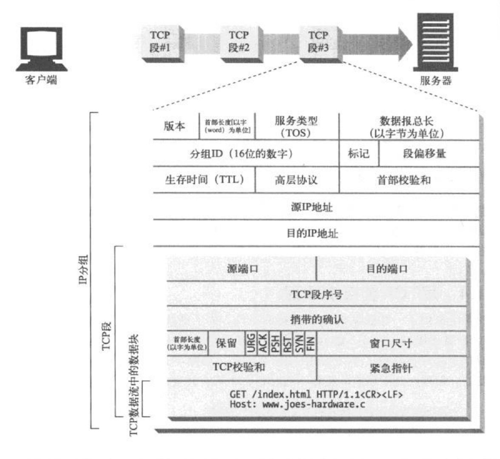
</figure>
-  <figure>
    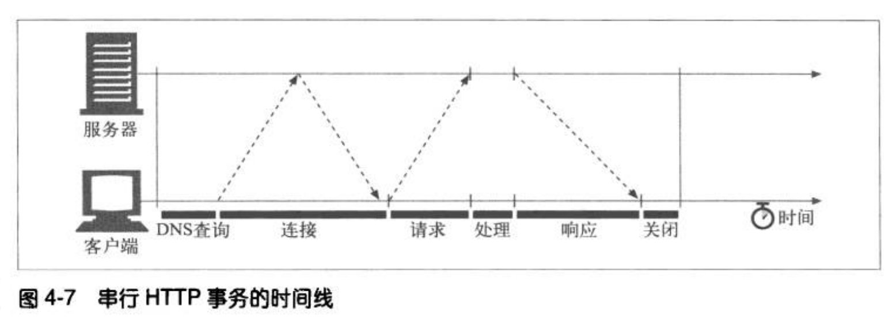
</figure>
</div>

单个 HTTP 时延如图，从图中我们可以看到，与 TCP 的建立、传输请求与响应报文相比，事务处理的时间很短。造成 HTTP 时延的主要原因有：

- DNS 解析
- TCP 连接的建立
- 服务端对请求的处理

常见的影响 TCP 时延的因素包括：

- TCP 连接建立握手
- TCP 慢启动拥塞控制：TCP 连接会随着时间进行自我“调谐”，起初会限制连接的最大速度，如果数据传输成功，会随着时间的推移提高传输的速度。该调谐即为 TCP 慢启动，用于防止因特网的突然过载和拥塞
- 数据聚集的 Nagle 算法：该算法让数据在缓冲到一定尺寸后发送，若大量小块数据则会造成严重的延时。当确保向 TCP 写入大块数据时，可以禁用 Nagle 算法
- 用于捎带确认的 TCP 延迟确认算法：若在指定时间窗口内未收到确认分组，则重新发送分组数据。由于分组数据较少，因此在某个时间窗口内存放于缓冲区，待区满后发送；时间窗口内未满则单独发送。
- `TIME_WAIT` 时延和端口耗尽

### 连接优化

根据以上情况，我们可得到优化的方向：

- 将多个请求进行合并，避免频繁建立连接
- 优化 TCP，加速连接的建立

目前优化 HTTP 资源加载速度的方式有：

- 并行连接
    - 并行连接适用于总数较小（通常是 4 个）的情况，如果一个页面有 100 个图片，使用并行的方式处理的话，每个客户端要打开 100 个连接，100 个用户的请求，服务器则需要处理 10000 个连接，这造成了服务器性能的严重下降。请勿滥用并行连接。
    - 并行连接的缺点
        - 每个事务都会打开/关闭一条新的连接，会耗费时间和宽带
        - 由于 TCP 慢启动特性的存在，每条新的连接性能都会有所降低
        - 可打开的并行连接数量实际上是有限的
- 持久连接
    - 由于初始化了对某服务器 HTTP 请求的应用程序很可能会在不久的将来对那台服务器发起更多的请求（站点局部性 site locality），因此持久连接适用于对同一个站点多次获取资源（如 12306 购票？淘宝购物？）。
    - 重用已对目标服务器打开的空闲持久连接，就可以避开缓慢的连接建立阶段。而且，已经打开的连接还可以避免慢启动的拥塞适应阶段，以便更快速地进行数据的传输。
    - 管理持久连接时要特别小心，避免出现大量空闲连接，耗费本地及远程客户端和服务器的资源
    - **在 HTTP 1.1 中，持久连接是默认激活的， 主动关闭连接时向报文中显式添加`Connection: close`**。客户端与服务器仍可以随时关闭空闲连接，并非不发送 close 就永久保持连接。
    - 一个用户客户端对任何服务器或代理最多只能维护两条持久连接，以免服务器过载。
- 管道化连接
    - 如果 HTTP 客户端无法确认连接是持久的，就不应该使用管道。
    - 必须按照与请求相同的顺序回送 HTTP 响应。
    - HTTP 客户端必须做好连接会在任意时刻关闭的准备，还要准备好重发所有未完成的管道化请求。如果客户端打开了一条持久连接，并立即发出了 10 条请求，服务器可能在处理 5 条请求之后关闭连接。剩下的 5 条请求会失败，客户端必须能够应对这些过早关闭连接的情况，重新发出这些请求。
    - HTTP 客户端不应该用管道化的方式发送会产生副作用的请求(比如 POST)。总之，出错的时候，管道化方式会阻碍客户端了解服务器执行的是一系列管道化请求中的哪一些。由于无法安全地重试 POST 这样的非幂等请求，所以出错时，就存在某些方法永远不会被执行的风险。

如果服务器愿意为下一条请求将连接保持在打开状态，就在响应中包含相同的首部，若响应中没有 `Connection: Keep-Alive` 首部，客户端就认为服务器不支持 keep-alive，会在发回响应报文之后关闭连接。`Keep-Alive:  max=5, timeout=120`首部中的值都仅仅是预估值，并不是承诺值，即，虽然声明服务器可能保持活跃状态在 120s 内，但可能 20s 就关闭了。

现代代理不应该转发的一些 HTTP 首部包括：`Connection`, `Proxy-Authenticate`, `Proxy-Connection`, `Transfer-Encoding` 和 `Upgrade`。

<figure markdown>
  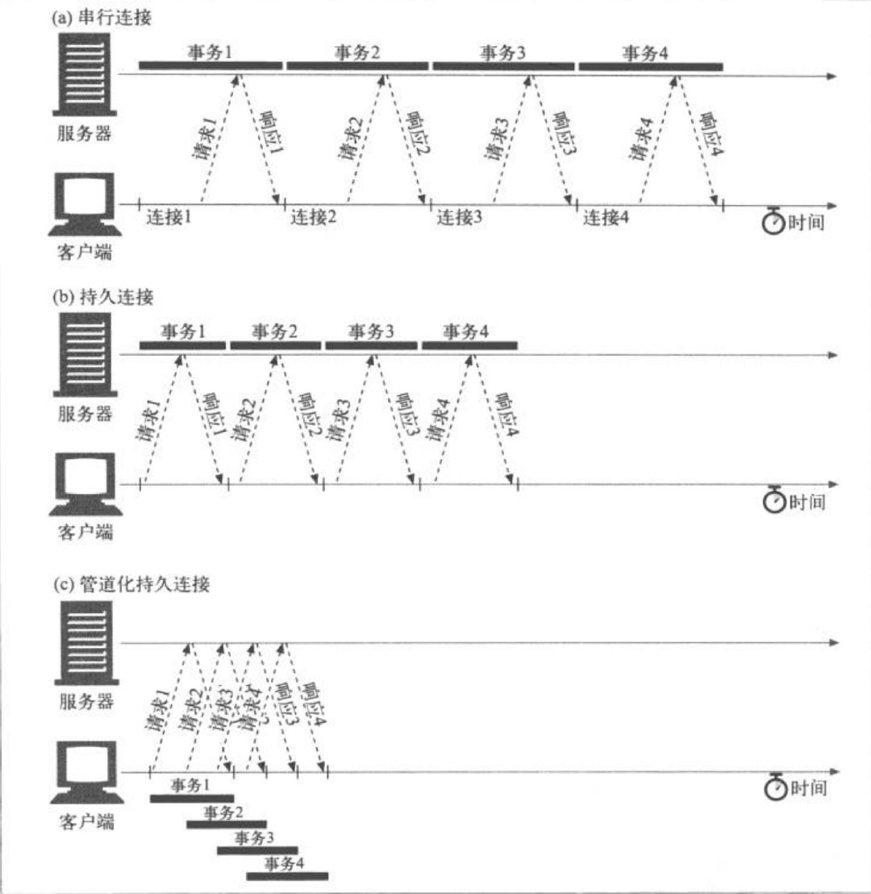{ width=70% }
</figure>

### 关闭连接

所有 HTTP 客户端、服务器或代理都可以在任意时刻关闭一条 TCP 传输连接。在持久连接空闲一段时间之后，服务器可能会决定将其关闭。但是，服务器永远都无法确定在它关闭“空闲”连接的那一刻，在线路那一头的客户端有没有数据要发送。如果出现这种情况，客户端就会在写入半截请求报文时发现出现了连接错误。

每条 HTTP 响应都应该有精确的`Content-Length`首部，用以描述响应主体的尺寸。客户端或代理收到一条随连接关闭而结束的 HTTP 响应，且实际传输的实体长度与`Content-Length`并不匹配（或没有`Content -Length`）时，接收端就应该质疑长度的正确性。如果接收端是个缓存代理，接收端就不应该缓存这条响应（以降低今后将潜在的错误报文混合起来的可能）。代理应该将有问题的报文原封不动地转发出去，而不应该试图去“校正”`Content-Length`，以维护语义的透明性。

即使在非错误情况下，连接也可以在任意时刻关闭。HTTP 应用程序要做好正确处理非预期关闭的准备。如果在客户端执行事务的过程中，传输连接关闭了，那么，除非事务处理会带来一些副作用，否则客户端就应该重新打开连接，并重试一次。对管道化连接来说，这种情况更加严重一些。客户端可以将大量请求放入队列中排队，但源端服务器可以关闭连接，这样就会留下大量未处理的请求，需要重新调度。副作用是很重要的问题。如果在发送出一些请求数据之后，收到返回结果之前，连接关闭了，客户端就无法百分之百地确定服务器端实际激活了多少事务。有些事务，比如 GET 一个静态的 HTML 页面，可以反复执行多次，也不会有什么变化。而其他一些事务，比如向一个在线书店 POST 一张订单，就不能重复执行，不然会有下多张订单的危险。

TCP 是双向的，TCP 连接的每一端都有一个输入队列和一个输出队列，用于数据的读或者写。如果另一端向你已关闭的输入信道发送数据，操作系统就会向另一端的机器回送一条 TCP“连接被对端重置”的报文。实现正常关闭的应用程序首先应该关闭它们的输出信道，然后等待连接另一端的对等实体关闭它的输出信道。当两端都告诉对方它们不会再发送任何数据（比如关闭输出信道）之后，连接就会被完全关闭，而不会有重置的危险。

## 第 5 章 Web 服务器

服务器的工作流程：
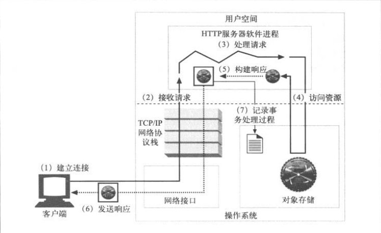{ align=right width=50% }

1. 建立连接：接受一个客户端连接，不希望建立连接则关闭
2. 接收请求：从网络中读取一条 HTTP 请求报文
3. 处理请求：对请求报文进行解释，并采取行动
4. 访问资源：访问报文中指定的资源
5. 构建响应：创建带有正确首部的 HTTP 响应报文
6. 发送响应：将响应回送给客户端
7. 记录事务处理过程：将与已完成事务有关的内容记录在一个日志文件中

## 第 6 章 代理

通常基于以下原因使用代理：
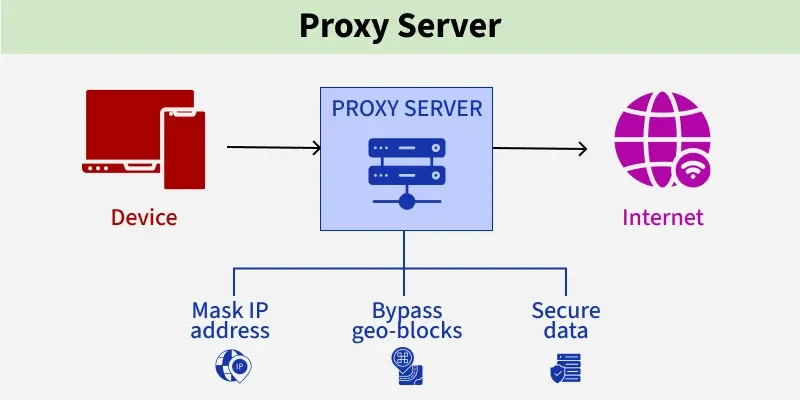{ align=right width=70% }

- 文档访问控制
- 安全防火墙
- Web 缓存
- 反向代理
- 内容路由器
- 转码器
- 儿童过滤器
- 匿名性

匿名代理会主动从 HTTP 报文中删除身份特性，如客户端 IP，From 首部，Referer 首部，cookie，URI 会话 ID 等，从而提供高度私密性和匿名性。

Via 首部字段列出了与报文途经的每个中间节点（代理或网关）有关的信息。

## 第 7 章 缓存

缓存的优点：

- 减少了冗余的数据传输
- 缓解了网络瓶颈的问题
- 降低了对原始服务器的要求
- 降低了距离时延

缓存的缺点：

- 未及时更新的缓存造成信息滞后，如抢购时的库存缓存可能导致超售
- 缓存会占用空间资源

过期日期以 `Expires` 或 `Cache-Control: max-age=86400` 来控制，二者的区别在于，前者是一个绝对时间，如 `Expires: Fri, 05 Jul 2002, 05:00:00 GMT`，后者则是一个相对时间（单位为秒）。我们 **更推荐使用相对时间，因为绝对时间依赖于计算机时钟的正确设置**。

## 第 8 章 集成点：网关、隧道及中继

Web 隧道允许用户通过 HTTP 连接发送非 HTTP 流量，这样就可以在 HTTP 上捎带其它协议数据了。使用 Web 隧道最常见的原因就是要在 HTTP 连接中嵌入非 HTTP 流量，这样，这类流量就可以穿过只允许 Web 流量通过的防火墙了。

Web 隧道是通过 HTTP 的 CONNECT 方法建立起来的。

盲中继可能导致 `keep-alive` 的挂起

<figure markdown>
  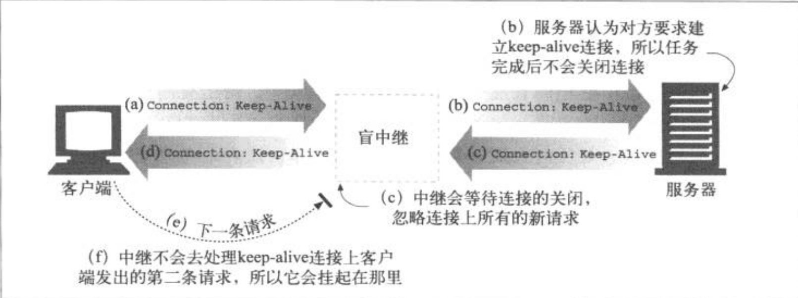{ width=80% }
</figure>

## 第 9 章 Web 机器人

### 爬虫的工作流

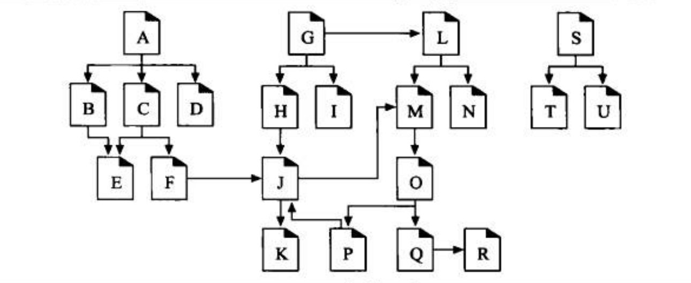{ align=right width=50% }

爬虫从根集开始，爬取所需的大多数页面，在图示中，根集只需要 A、G、S 即可抓取到所有页面。

爬虫在 Web 上移动时，会不停地对 HTML 页面进行解析，它要对所解析的每个页面上的 URL 链接进行分析，并将这些链接添加到需要爬行的页面列表中去。随着爬虫的前进，当期发现需要探查的新链接时，这个列表常常会迅速地扩张。爬虫要通过简单的 HTML 解析，将这些链接提取出来，并将相对 URL 转换为绝对形式。

### 循环陷阱

爬虫在抓取页面时，要特别小心不要陷入循环。爬虫必须知道它们所到之处，以避免环路的出现。一些复杂的爬虫可能会用搜索树或散列表来记录已访问的 URL。

大型爬虫会采用“集群”的方式，每个爬虫分配一个特定的 URL“片”，然后配合抓取整个 Web。

<figure markdown>
  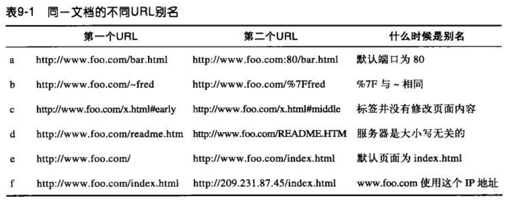{ width=80% }
  <figcaption>URL 别名与机器人环路</figcaption>
</figure>

解决循环陷阱的方法

- 规范化 URL
    - 如果没有指定端口的话，就像主机名中添加":80"
    - 将所有转义符 `%xx` 都转换成等价字符
    - 删除 `#` 标签
- 广度优先的爬行
    - 如果采用了深度优先，很有可能会陷入循环，无法访问其它站点
- 节流
    - 限制一段时间内机器人可以从一个 web 站点获取的页面数量
- 限制 URL 的大小
    - 现在很多站点都会用 URL 来管理用户的状态（如，在一个页面引用的 URL 中存储用户 ID），这可能会让你错过一些东西
- URL/站点黑名单
- 模式检测
- 内容指纹
    - 将采集的内容计算校验和，避免重复采集
- 人工监视
    - 当爬虫遇到困难时可以及时发出警告

**高级爬虫只在内容发生了变化时才重新获取内容**，它们实现了条件 HTTP 请求，即它们会对时间戳或实体标签进行比较，查看最近的内容是否发生变化。

Web 管理者应该记住，**不止用户会访问站点，也会有很多爬虫来访问站点**。

### robots.txt

如果网站不希望爬虫采集某些页面，可以在根目录下放置`robots.txt`文件（因为一些系统中的 URL 是大小写敏感的，所以 robots.txt 的文件名应统一为小写），声明哪些是允许抓取的，哪些是不允许抓取的，如[百度的 robots.txt](https://www.baidu.com/robots.txt)，[必应的 robots.txt](https://bing.com/robots.txt)，[知乎的 robots.txt](https://www.zhihu.com/robots.txt)。该文件并不是规范，只能限制遵循规则的爬虫，并不代表声明禁止抓取的内容一定不会被抓取。

爬虫应该首先访问 `robots.txt` 文件，并根据该文件状态和内容来决定最终的访问。即该文件是 401 或 403 时，表明该网站受限；503 时，表明该网站当前不可用，应推迟访问；404 则表示无任何限制；200 则需要依据文件内容访问网站。

### 搜索

当你在搜索引擎中键入关键字时，可能会有数以亿计的文件中包含该关键字，因此，如何对这些文件排序成为了各搜索引擎的关键。通常来说，用户会点击排名靠前的搜索结果，如何才能让用户最快找到自己想要的呢？很多搜索引擎会将页面的被引用次数作为重要的排名依据，被引用越多，说明该页面价值也高，用户也最可能得到想要的东西。

部分网站为了获取较高的排名，列出了无数的关键字，甚至有些是毫不相干的，因此需要爬虫能够及时识别并过滤此类页面。

## 第 10 章 HTTP-NG

## 第 11 章 客户端识别与 cookie 机制

为了使 Web 站点的登陆更加简便，HTTP 中包含了一种内建机制，可以用 `WWW-Authenticate` 首部和 `Authorization` 首部向 Web 站点传送用户的相关信息。

> 本章 cookie 内容较为简单且已过时，需要当前的浏览器与开发框架对 cookie 的处理及管理，以及未来如何更加准确识别用户，并让保证用户的信息不会被泄露。当前缓解用户在每个网站注册账户的方式是引入用户的社交账户登录，未来是否可以让所有用户以统一方式登录所有网站，而且这些网站获取不到用户的真实信息，eID 或许是未来的一个方向。

## 第 12 章 基本认证机制

服务器对用户进行质询时，会返回一条 401 响应，并在`WWW-Authenticate`首部说明如何以及在哪里认证，如以下示例。其中，`realm`是安全域，帮助用户了解应该使用哪个账号密码（不同资源有不同的访问权限，每个安全域都有不同的授权用户集）

```
HTTP/1.1 401 Unauthorized
WWW-Authenticate: Basic realm="Corporate Financials"
```

当客户端收到 401 时，填写账号密码后，会在`Authorization`首部附加经 base64 编码的`账号:密码`形式的认证信息。如以下请求的认证信息即为`username:passowrd`的编码结果。

<figure markdown>
  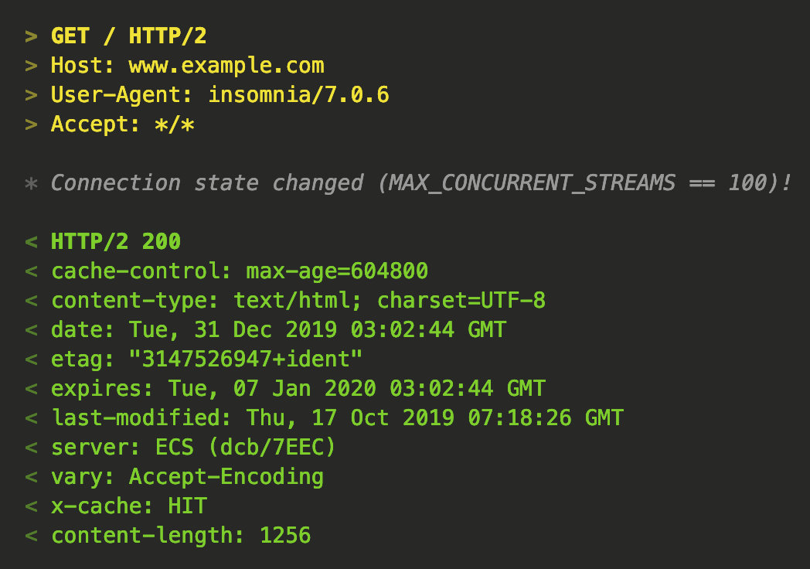{ width=60% }
</figure>

从基本认证的工作流中我们可以看到，用户的账号密码几乎就是明文传输的，这造成了很大的安全隐患，安全使用基本认证的唯一方式就是将其与 SSL 配合使用。

## 第 13 章 摘要认证

摘要认证的箴言是“绝不通过网络发送密码”。客户端不会发送密码，而是会发送一个“指纹”或密码的“摘要”，这是密码的不可逆扰码。客户端和服务器都知道这个密码，因此服务器可以验证所提供的摘要是否与密码相匹配。

摘要是“对信息主体的浓缩”。摘要是一种单向函数，主要用于将无限的输入值转换为有限的浓缩输出值。常见的摘要函数有 MD5、SHA-1、SHA-2 等。

为了防止重放攻击，服务器可以向客户端发送一个称为随机数（nonce）的特殊令牌，这个数会经常发生变化（可能是每毫秒，或者是每次认证都变化）。客户端在计算摘要之前要先将这个随机数令牌附加到密码上去。**摘要认证要求使用随机数来破坏重放攻击**，因为这个小小的重放弱点会使未随机化的摘要认证变得和基本认证一样脆弱，随机数是在`WWW-Authenticate`质询中从服务器传送给客户端的。

随机数过期时，即便老的`Authorization`首部所包含的随机数不再新鲜了，服务器也可以选择接受其中的信息。服务器也可以返回一个带有新随机数的 401 响应，让客户端重试这条请求；指定这个响应为`stale=true`，表示服务器在告知客户端用新的随机数来重试，而不再重新提示输入新的用户名和密码了。（参照微信公众号的 token 过期处理方式）

RFC 2617 建议采用这个假想的随机数公式：`BASE64(time-stamp H(time-stamp ":" ETag ":" private-key))`。其中 time-stamp 是服务器产生的时间或其他不会重复的值，ETag 是与所请求实体有关的 HTTP ETag 首部的值，private-key 是只有服务器知道的数据。

<figure markdown>
  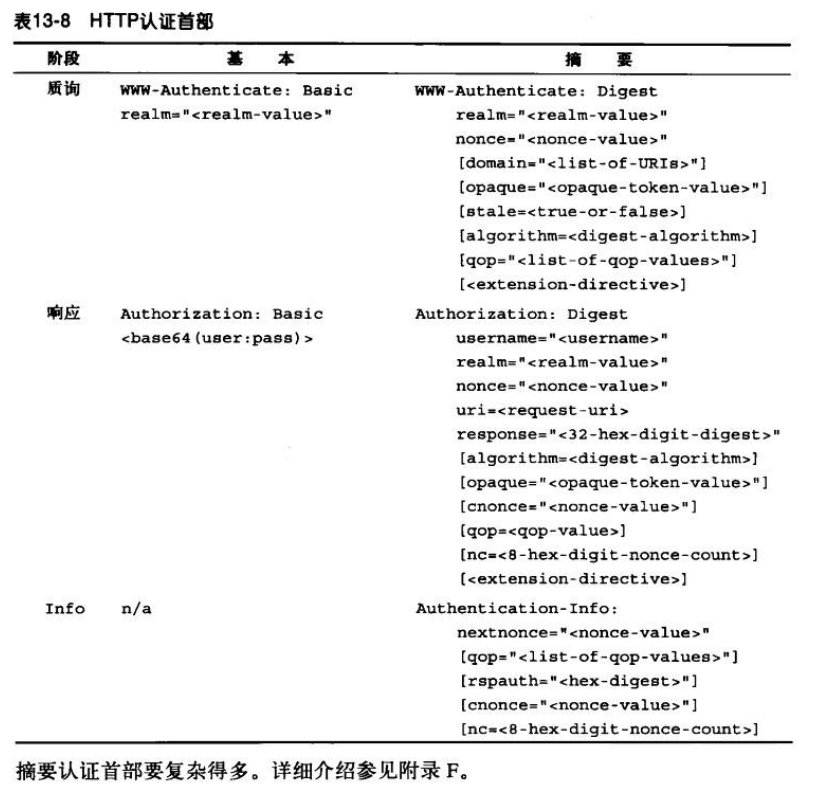{ width=80% }
</figure>

在实际应用中，我们需要考虑到服务器可以对某个资源发起多重质询。比如，如果服务器不了解客户端的能力，就可以既提供基本认证质询，又提供摘要认证质询。客户端面对多重质询时，必须以它所支持的最强的质询机制来应答。另外，如果请求的摘要不匹配，就应该记录一次登录失败。某客户端连续多次失败可能说明有攻击者正在猜测密码。

一种可以完全避免重放攻击的方法就是为每个事务都使用一个唯一的随机数。在这种实现方式中，服务器会为每个事务发布唯一的随机数和一个超时值。发布的随机数只对指定的事务有效，而且只在超时值的持续区间内有效。这种方式会增加服务器的负担，但这种负担可忽略不计。

nonce 用于认证客户端，cnonce 用于认证服务端。

## 第 14 章 安全 HTTP

安全 HTTP 需要满足

- 服务器认证：服务端不会被伪造
- 客户端认证：客户端不会被伪造
- 完整性：数据不会被修改
- 加密：通信内容加密
- 效率：足够快的算法
- 普适性：基本上所有的客户端和服务器都支持这些协议
- 管理的可扩展性：在任何地方的任何人都可以立即进行安全通信
- 适应性：能够支持当前最知名的安全方法
- 在社会上的可行性

早期，人们使用密码机加解密，加密算法和密码机都有可能落入敌人手中，所以大部分机器上都有一些号盘，可以将其设置为大量不同的值以改变密码的工作方式，即使机器被盗，没有正确的号盘设置（密钥），解码器也无法正常工作。

### 对称加密

在对称加密技术中，发送端与接收端要共享相同的密钥才能进行通信。常见的对称加密算法有：AES、3DES、DES(已被证明不安全)等。

可用密钥值的数量取决于密钥中的位数，以及可能的密钥中有多少是有效的。就对称密钥加密技术来说，通常所有的密钥值都是有效的（RSA 中，有效密钥必须以某种方式与质数相关）。8 位的密钥只有 256 个可能的密钥值，40 位的密钥可以有 $2^{40}$ 个可能的密钥值(大约是一万亿个密钥)，128 位的密钥可以产生大约 $3.4 \times 10^{38}$ 个可能的密钥值。

在对称加密中，如果服务器与 100 万个用户进行安全会话，就需要维护 100 万个密钥，这无疑是一笔不小的开销。公开密钥技术避免了对称加密技术中成对密钥数目的 $N^2$ 扩展问题。

### 非对称加密

非对称加密是使用一对密钥进行加解密，分别称为公钥和私钥，使用公钥加密的内容只能用私钥解密，使用私钥加密的内容只能用公钥解密。常见的非对称加密算法有 RSA、DES、ECDSA，其中使用最广泛的算法是 RSA。

RSA 原理资料：

1. [RSA 算法背后的数学原理](https://luyuhuang.github.io/2019/10/24/mathematics-principle-of-rsa-algorithm.html)
2. [RSA 的原理与实现](https://cjting.me/2020/03/13/rsa/)
3. [李永乐老师 11 分钟讲 RSA 加密算法](https://www.bilibili.com/video/av26639065)
4. [基于欧拉函数的 RSA 算法加密原理是什么](https://www.bilibili.com/video/av35557954)
5. [RSA 算法 – 基本原理篇](https://www.bilibili.com/video/av34660391)

ECDSA 原理资料：

1. [椭圆曲线加密与哈希函数是什么？](https://www.bilibili.com/video/av74880228)

> 判定一个整数是否是质数则比分解该整数简单许多（给出两个大因数，很容易就能将它们两个相乘，但是，给出它们的乘积，找出它们的因子就显得不是那么容易了），这就是许多现代密码系统的关键所在。如果能够找到解决整数分解问题的快速方法，几个重要的密码系统将会被攻破，包括 RSA 公钥算法和 Blum Blum Shub 随机数发生器。

## 第 15 章 实体和编码

每天都有数以亿计的各种媒体对象经由 HTTP 发送，HTTP 要确保它所承载的“货物”满足以下条件：

- 可以被正确地识别（Content-type 说明媒体格式，Content-Language 说明语言），以便浏览器等正确处理内容
- 可以被正确地几包（Content-Length 和 Content-Encoding）
- 是最新的（通过实体验证码和缓存过期控制）
- 符合用户的需要（基于 Accept 系列的内容协商首部）
- 在网络上可以快速有效地传输（通过范围请求、差异编码以及其他数据压缩方法）
- 完整到达、未被篡改（通过传输编码首部和 Content-MD5 校验和首部）

HTTP/1.1 定义了以下 10 个基本首部字段：

| 首部               | 说明                                                               | 备注                                                                                                                                                                                                                                                                                                                                                                                                                                                         |
| ------------------ | ------------------------------------------------------------------ | ------------------------------------------------------------------------------------------------------------------------------------------------------------------------------------------------------------------------------------------------------------------------------------------------------------------------------------------------------------------------------------------------------------------------------------------------------------ |
| `Content-Type`     | 实体中所承载对象的类型                                             | `Content-Type` 的值是标准化的 MIME 类型，都是在互联网号码分配机构（IANA）中注册的。                                                                                                                                                                                                                                                                                                                                                                          |
| `Content-Length`   | 所传送实体主体的长度或大小                                         | Content-Length 对于持久连接是必不可少的，如果没有 `Content-Length`，HTTP 应用程序就不知道实体主体在哪里结束，下一条报文从哪里开始。                                                                                                                                                                                                                                                                                                                          |
| `Content-Language` | 与所传送对象最相匹配的人类语言                                     |
| `Content-Encoding` | 对象数据所做的任意变换（如压缩）                                   | 常用值：<br>- gzip：采用 GNU zip 编码<br>- compress：采用 Unix 的文件压缩程序<br>- deflate：采用用 zlib 格式压缩<br>- identity：未对实体编码，无 Content-Encoding 首部时，默认此种情况。<br><br>gzip、compress、deflate 都是无损压缩算法，用于减少传输报文的大小，不会导致信息的损失。其中，gzip 通常效率最高，使用最广泛。gzip 与 deflate 的压缩算法可以阅读 [Gzip 格式和 DEFLATE 压缩算法](https://luyuhuang.github.io/2020/04/28/gzip-and-deflate.html)。 |
| `Content-Location` | 一个备用位置，请求时可通过它获得对象                               |
| `Content-Range`    | 如果这是部分实体，这个首部说明它是整体的哪个部分                   |
| `Content-MD5`      | 实体主体内容的校验和                                               |
| `Last-Modified`    | 所传输内容在服务器上创建或最后修改的日期时间                       |
| `Expires`          | 实体数据将要失效的日期时间                                         |
| `Allow`            | 该资源所允许的各种请求方法，如 GET 或 POST                         |
| `ETag`             | 该文档特定示例的唯一验证码。ETag 未被定义为实体首部                |
| `Cache-Control`    | 指出该文档应该如何缓存，与 ETag 首部类似，也未被定义为正式实体首部 |

#### Accept-Encoding

客户端将支持的编码方式列表放在 `Accept-Encoding`，如果请求中没有该首部，则服务端认为客户端能够接受任何编码形式（等同于 `Accept-Encoding:*`）。

`Accept-Encoding` 字段包含用逗号分隔的支持编码的列表，如

- `Accept-Encoding: compress, gzip`
- `Accept-Encoding: ` （为空时）：等同于 `identity`，明确告知服务端**不要**进行任何压缩。
- `Accept-Encoding: *`
- `Accept-Encoding: compress;q=0.5, gzip;q=1.0`
- `Accept-Encoding: gzip;q=1.0, identity; q=0.5, ;q=0`

客户端可以给每种编码附带 Q (质量)值参数来说明编码的优先级。Q 值的范围从 0.0 到 1.0，0.0 说明客户端不想接受所说明的编码，1.0 则表明最希望使用的编码，缺省时则为 1.0。`*` 表示“任何其他方法”。identity 编码代号只能在 Accept-Encoding 首部中出现，客户端用它来说明相对于其他内容编码算法的优先级。

#### Transfer-Encoding

用于告知接收方为了可靠地传输报文，已经对其进行了何种编码。

#### 新鲜度

服务器可以用 `Expires` 和 `Cache-Control` 首部提供客户端缓存文档的新鲜度。
为了正确使用 `Expires` 首部，服务器与客户端必须时钟同步，这并不总是很容易，而 `Cache-Control` 首部可以用秒数来规定文档的最长使用期，`Cache-Control` 除了使用期或过期时间外，还有其他指令可用：

| 指令             | 报文类型 | 描述                                                                                                                                                                   |
| ---------------- | -------- | ---------------------------------------------------------------------------------------------------------------------------------------------------------------------- |
| no-cache         | 请求     | 在重新向服务验证之前，不要返回文档的缓存副本                                                                                                                           |
| no-store         | 请求     | 不要反悔文档的缓存副本，不要保存服务器的响应                                                                                                                           |
| max-age          | 请求     | 缓存中的文档不能超过指定的使用期                                                                                                                                       |
| max-stale        | 请求     | 文档允许过期，但不能超过指令中的过期值                                                                                                                                 |
| min-fresh        | 请求     | 文档的使用期不能小于这个指定的时间与它的当前存活时间之和。换言之，响应必须至少在指定的这段时间内保持新鲜                                                               |
| no-transform     | 请求     | 文档在发送之前不允许被转换                                                                                                                                             |
| only-if-cached   | 请求     | 仅当文档在缓存中才发送，不要联系原始服务器                                                                                                                             |
| public           | 响应     | 响应可以被任何服务器缓存                                                                                                                                               |
| private          | 响应     | 响应可以被缓存，但只能被单个客户端访问                                                                                                                                 |
| no-cache         | 响应     | 如果该智力高伴随一个首部列表的话，那么内容可以被缓存并提供给客户端，但必须先删除所列出的首部，如果没有指定首部，缓存中的副本在没有重新向服务器验证之前不能提供给客户端 |
| no-store         | 响应     | 响应不允许被缓存                                                                                                                                                       |
| no-transform     | 响应     | 响应在提供给客户端之前不能做任何形式的修改                                                                                                                             |
| must-revalidate  | 响应     | 响应在提供给客户端之前重新向服务器验证                                                                                                                                 |
| proxy-revalidate | 响应     | 共享的缓存在提供给客户端之前重新向服务器验证。私有的缓存可以忽略本指令                                                                                                 |
| max-age          | 响应     | 指定文档可以被缓存的时间以及新鲜度的最长时间                                                                                                                           |
| s-max-age        | 响应     | 指定文档作为共享缓存时的最长使用时间（如果有 max-age 指令的话，以本指令为准）。私有的缓存可以忽略本指令                                                                |

| 请求类型            | 验证码        |
| ------------------- | ------------- |
| If-Modified-Since   | Last-Modified |
| If-Unmodified-Since | Last-Modified |
| If-Match            | ETag          |
| If-None-Match       | ETag          |

#### 范围请求

HTTP 客户端可以通过请求获取实体的某个范围，如：

```
GET /index.html HTTP/1.1
Host: www.google.com
Range: byte=4000-
User-Agent: Mozilla/4.61
```

该示例表示获取文档 4000 字节之后的内容，也可以使用 Range 首部来请求多个范围（这些范围可以任意顺序给出，也可以相互重叠）。对于一个客户端在一个请求内请求多个不同范围的情况，返回的响应也是单个实体，它有一个多部分主体及 `Content-Type: multipart/byteranges` 首部。

并非所有服务器都接受范围请求，服务器可以在响应中包含 Accept-Ranges 首部的形式向客户端说明可以接受的范围请求，其值为计算范围的单位，通常以字节计算，如

```
HTTP/1.1 200 OK
Date: Fri, 05 Nov 2019 22:00:00 GMT
Server: Apache/ 1.2.4
Accept-Ranges: bytes
```

**Range 首部在 P2P 中得到了广泛应用**，他们从不同的对等实体同时下载多媒体文件的不同部分。

## 第 16 章 国际化

服务器通过 Content-Type 中的 charset 和 Content-Language 告知客户端文档的字母表和语言。客户端通过 Accept-Charset 和 Accept-Language 告知服务器它所理解的字符集和语言以及其中的优先顺序。如下示例，表示该用户可以同时接受法语与英语，但法语的优先级更高(q 缺省为 1.0)，同时浏览器支持 iso-8859-1 和 utf-8 字符集。

```
Accept-Language: fr, en;q=0.8
Accept-Charset: iso-8859-1, utf-8
```

编码部分可查看博文[计算机常用编码的二三事](https://blog.palemoky.com/post/computer-encoding/)
语言标准查看 ISO-639，国家代码标准查看 ISO-3166。

## 第 17 章 内容协商与转码

## 第 18 章 Web 主机托管

## 第 19 章 发布系统

## 第 20 章 重定向与负载均衡

## 第 21 章 日志记录与使用情况跟踪

---

## 参考资料

1. [HTTP - MDN](https://developer.mozilla.org/zh-CN/docs/Web/HTTP)
2. [HTTP Status](https://httpstatuses.com/)
3. [HTTP request methods - MDN](https://developer.mozilla.org/en-US/docs/Web/HTTP/Methods)
4. [请求参数用 string 好还是数字好？ - Ivony 的回答](https://www.zhihu.com/question/28469005/answer/40934178)
