# 《TCP/IP 详解：卷 1》

!!! abstract "阅读信息"

    - **评分**：⭐️⭐️⭐️⭐️⭐️
    - **时间**：07/17/2023 → 05/20/2024
    - **读后感**：本书作为网络协议方面最权威和最重要的书籍，非常全面和详细讲解了方方面面的知识点，但其中一些相关性不是很强的内容可以快速略过，把注意力集中于TCP部分。另外，书中使用了大量的Wireshark抓包示意，可根据Wireshark官方文档来学习下抓包分析，加强记忆并具有排查网络故障和性能分析的能力。

<aside>
💡 O’Reilly：[https://learning.oreilly.com/library/view/tcp-ip-illustrated-volume/9780132808200/](https://learning.oreilly.com/library/view/tcp-ip-illustrated-volume/9780132808200/)，附件中的英文版有更清晰的图片

</aside>

## 协议层级

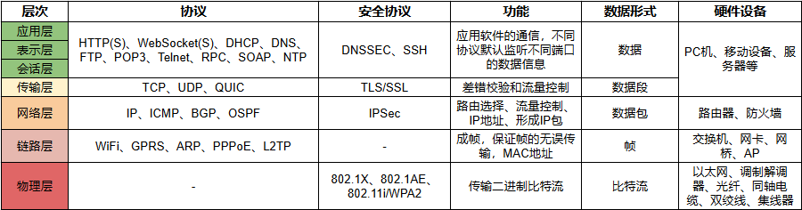

From [https://docs.google.com/spreadsheets/d/1sTYLw9HzZTQsGqP0dCvueZovtSgvQHL_gAMISwc1_XE/](https://docs.google.com/spreadsheets/d/1sTYLw9HzZTQsGqP0dCvueZovtSgvQHL_gAMISwc1_XE/edit?usp=sharing)

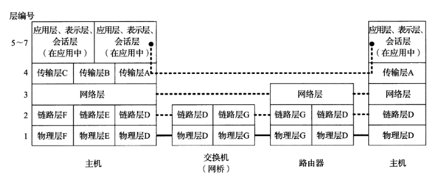

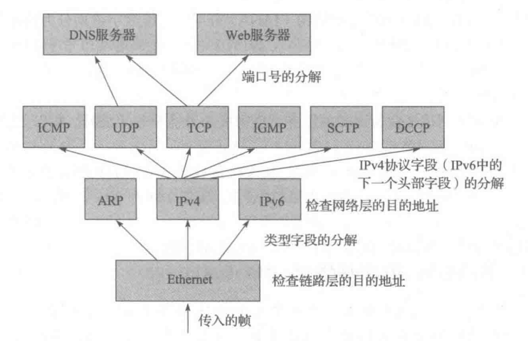

标准的端口号由Internet号码分配机构（IANA）分配。这组数字被划分为特定范围，包括熟知端口号（0~1023）、注册端口号（1024~49151）和动态/私有端口号（49152~65535）。

IPv6 地址中的冒号分隔符可能与其他分隔符混淆，如IP地址和端口号间的冒号，此时需要使用`[]`来包裹IPv6地址，如 `http: //[2001:0db8:85a3:08d3:1319:8a2e:0370:7344]:443/`

广播指一人对所有人通信，组播指一人对多人通信。

## 数据链路层

### ARP

ARP 是 IPv4 的专有协议，IPv6 引入了NDP（Neighbor Discovery Protocol，邻居发现协议）。NDP 提供了与 ARP 类似的功能，用于将 IPv6 地址解析为链路层地址（如 MAC 地址），以便在网络中正确地发送数据包。NDP 协议被合并到 ICMPv6 中。

ARP 协议工作于**局域网**。当访问局域网内服务时，需要在以太网帧中含源主机和目标主机的 MAC 地址。而通过互联网访问远程服务时，只需要在以太网帧中包含源主机的 MAC 地址。一旦数据包离开局域网，并进入到广域网中，它会经过多个网络设备和路由器，最终到达目标主机。在这个过程中，以太网帧中的目标主机 MAC 地址会被替换为下一跳路由器接口的 MAC 地址（这也是数据链路层负载均衡的实现方式），以便正确地将数据包传递给目标主机。

ARP 协议的攻击有欺骗应答和修改静态条目。

## 网络层

### IP

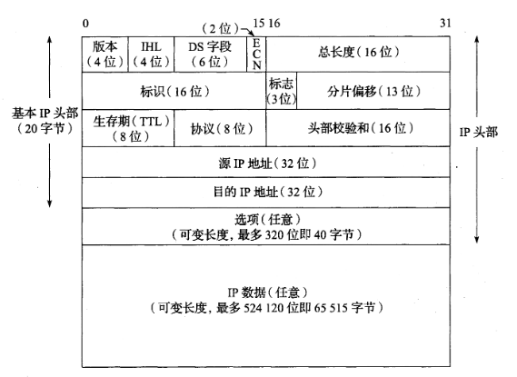

IPv4 头部字段。头部大小可变

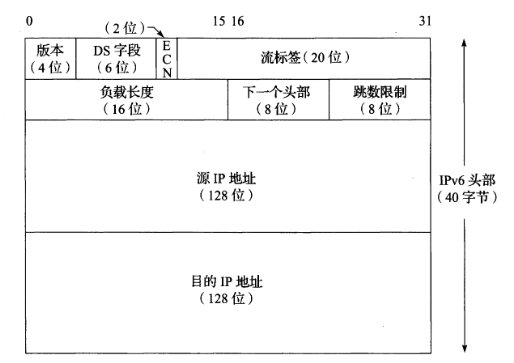

IPv6 头部字段。头部大小固定（40字节）

IPv4 头部与 IPv6 头部除了版本外，再无其它相同字段。

TTL 在每经过一跳时-1，这可防止路由环路中数据包的死循环。

- IPv4 特殊用途地址（2010.1）
  | 前缀 | 特殊用途 | 参考文献 |
  | ------------------ | ----------------------------------------------------------------------------- | -------- |
  | 0.0.0.0/8 | 本地网络中的主机。仅作为源IP地址使用 | RFC1112 |
  | 10.0.0.0/8 | A类专用网络（内联网）的地址。这种地址不会出现在公共Internet中 | RFC1918 |
  | 127.0.0.0/8 | Internet主机回送地址（同一计算机）。通常只用127.0.0.1（可简写为127.1） | RFC1112 |
  | 169.254.0.0./16 | “链路本地”地址，只用于一条链路，通常自动分配（Windows无法连接网络时常有此IP） | RFC3927 |
  | 172.16.0.0/12 | B类专用网络（内联网）的地址。这种地址不会出现在公共Internet中 | RFC1918 |
  | 192.0.0.0/24 | IETF协议分配（IANA保留） | RFC5736 |
  | 192.0.2.0/24 | 批准用于文档中的TEST-NET-1地址。这种地址不会出现在公共Internet中 | RFC5737 |
  | 192.88.99.0/24 | 用于6to4中继（任播地址） | RFC3068 |
  | 192.168.0.0/16 | C类专用网络（内联网）的地址。这种地址不会出现在公共Internet中 | RFC1918 |
  | 198.18.0.0/15 | 用于基准测试和性能测试 | RFC2544 |
  | 198.51.100.0/24 | TEST-NET-2地址。被批准用于文档中 | RFC5737 |
  | 203.0.113.0/24 | TEST-NET-3地址。被批准用于文档中 | RFC5771 |
  | 224.0.0.0/4 | IPv4组播地址（以前的D类），仅作为目的IP地址使用 | RFC1112 |
  | 240.0.0.0/4 | 保留空间（以前的E类），除了255.255.255.255 | RFC0919 |
  | 255.255.255.255/32 | 本地网络（受限的）广播地址 | RFC0922 |
- IPv6 特殊用途地址（2008.4）
  | 前缀 | 特殊用途 | 参考文献 |
  | ------------------- | ------------------------------------------------------------------- | -------- |
  | ::/0 | 默认路由条目。不用于寻址 | RFC5156 |
  | ::/128 | 未指定地址，可作为源IP地址使用 | RFC4291 |
  | ::1/128 | IPv6 主机回送地址，不用于发送出本地主机的数据报中 | RFC4291 |
  | ::ffff:0:0/96 | IPv4 映射地址。这种地址不会出现在分组头部，只用于内部主机 | RFC4291 |
  | ::{ipv4-address}/96 | IPv4 兼容地址。已过时，未使用 | RFC4291 |
  | 2001::/32 | Teredo地址 | RFC4380 |
  | 2001:10::/28 | ORCHI（覆盖可路由加密散列标识符）。这种地址不会出现在公共Internet中 | RFC4843 |
  | 2001:db8::/32 | 用于文档和实例的地址范围。这种地址不会出现在公共Internet中 | RFC3849 |
  | 2002::/16 | 6to4隧道中继的6to4地址 | RFC3056 |
  | 3ffe::/16 | 用于6bone实验。已过时，未使用 | RFC3701 |
  | 5f00::/16 | 用于6bone实验。已过时，未使用 | RFC3701 |
  | fc00::/7 | 唯一的本地单播地址，不用于全球性的Internet | RFC4193 |
  | fe80::/10 | 链路本地单播地址 | RFC4291 |
  | ff00::/8 | IPv6组播地址，仅作为目的IP地址使用 | RFC4291 |

`12.0.0.1` 和 `::1` 可以用 [localhost](http://localhost) 来代替

### 大端序与小端序

- 大端序（Big Endian，也称为高位优先）：在大端序中，高位字节（Most Significant Byte, MSB）放在低地址，低位字节（Least Significant Byte, LSB）放在高地址。
- 小端序（Little Endian，也称为低位优先）：在小端序中，低位字节（LSB）放在低地址，高位字节（MSB）放在高地址。

因此**大端序更符合人类从左向右的阅读习惯，而小端序则更适合低位优先的运算**（如位移、比较、加法等）。

由于x86之前的IBM、Sun Microsystems等系统都采用大端序，且网络协议中的字段采用大端序更有利于人类阅读和理解，因此许多网络传输协议采用了大端序。

虽然采用小端序的x86在接收到采用大端序的网络数据包后需要转换，但这个转换并不会带来明显的性能损失，这是因为现代操作系统和网络堆栈已经优化了这个过程，并且硬件也提供了加速功能，使得字节序的转换变得更加高效。

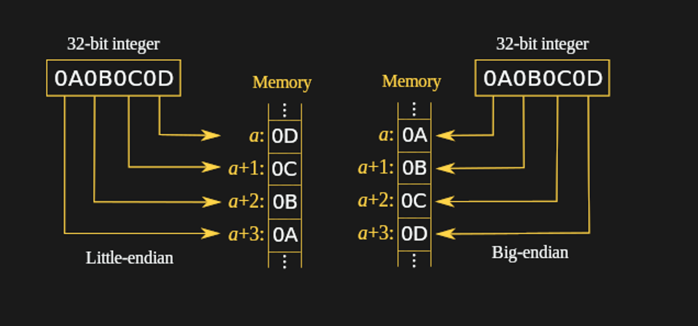

@[端序](https://www.notion.so/92f1cd452dcf41b483993f28c1f2872d?pvs=21)

大端序应用于：

- 网络传输：大部分网络协议采用大端序进行数据传输，例如 TCP/IP 协议栈中的 IP、UDP 和 ICMP 等协议。
- 大整数运算：在一些大整数运算算法中，如 RSA 加密算法

小端序应用于：

- x86 架构：大部分 x86 架构的处理器都采用小端序，包括 Intel 和 AMD 的处理器
- 内存操作：在内存中，小端序的排列方式可以提供更高效的访问。因为低位字节在低地址，与 CPU 的读写操作一致，可以直接按照地址顺序连续读取
- 存储设备：一些存储设备使用小端序来存储数据，如 Intel 架构的硬盘。在这种情况下，使用小端序可以直接将数据从存储设备读入内存

### NAT

NAT 被用于缓解 IPv4 枯竭的问题，但 NAT 的流行严重阻碍了 IPv6 的推进进程。

NAT 需要**重写数据包的寻址信息**，以便私有地址空间的系统和Internet主机之间能够正常通信。

NAT包括基本NAT和NAPT（Network Address Port Translation，网络地址端口转换）。基本NAT指挥重写IP地址，而NAPT则会重写IP和端口。

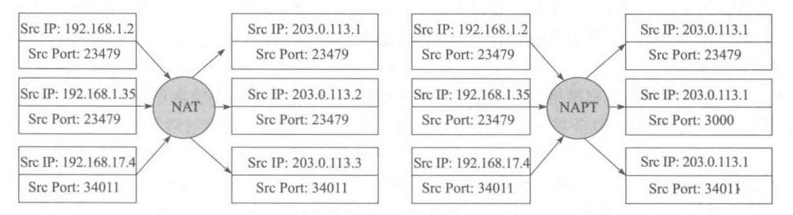

在基本NAT中，只重写IP会导致不同主机相同端口在重写后的端口冲突（如23479的端口），而NAPT则可以避免此问题。

NAT 中的映射关系将**在交换 FIN 数据包后被删除**。

### 防火墙

iptables 是用 NetFilter 的网络过滤功能构建的。iptables 由 table（过滤表）和 chain（过滤链）组成：

- table
  - Filter：主要用于实现防火墙规则，允许或拒绝特定的数据包通过系统中的每个网络接口
  - NAT：主要用于修改数据包的源IP地址和目标IP地址，以便实现端口转发、负载均衡等功能
  - Mangle：用于修改数据包的头部信息。它可以改变数据包的 TTL（Time to Live）、Type of Service（ToS）等字段，还可以标记数据包以供后续处理
- chain（依据流量处理顺序排序）
  - PREROUTING：链在数据包进入路由决策之前进行处理
  - INPUT：链用于处理目标地址是本机的数据包
  - FORWARD：链用于处理转发到其他主机的数据包
  - OUTPUT：链用于处理源地址是本机的数据包
  - POSTROUTING：链在数据包离开系统之前进行处理

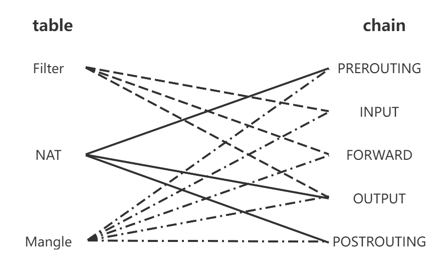

iptables 的 table 与 chain 通过组合使用实现灵活管理网络流量

```bash
iptables -t nat -A POSTROUTING -o eth0 -s 192.168.1.0/24 -j SNAT --to-source <eth0 IP>
```

通过这个规则，内部网络上的流量将被转发到外部网络，并且其源 IP 地址将被更改为 eth0 接口的 IP 地址。这样，从外部网络看，所有来自内部网络的流量都似乎来自于 eth0 的 IP 地址。

nftables（Netfilter Tables）作为 iptables 的工具，具有以下优势：

- 性能更高：与 iptables 相比，nftables 在处理大量规则时性能更好
- 更简洁的语法：nftables 引入了一种新的配置语言，使配置规则更加直观和易读
- 更强大的匹配和过滤：nftables 提供了更多的匹配选项和过滤功能，以便更精确地控制网络流量
- 支持动态更新：nftables 可以动态地添加、修改和删除规则，而无需重新加载整个防火墙配置

### ICMP

ICMP 使用 IP 协议进行传输，严格来说，它是位于网络层与传输层之间的协议。

由于黑客在大量攻击中使用 ICMP 报文，因此网络管理员经常会用防火墙封锁 ICMP 报文，从而导致 `ping`、`traceroute` 等无法正常工作。

## 传输层

### TCP

](imgs/tcp-handshake-process.png)

TCP 握手过程 [https://www.processon.com/diagraming/5ffff2d21e0853437c45317f](https://www.processon.com/diagraming/5ffff2d21e0853437c45317f)

TCP 的握手过程就像打电话一样：

- 建立连接：
  拨号方：你好，你是xxx吧？
  接听方：对
  拨号方：我是xxx，balabala……（最后发送的ACK即可携带通信内容）
- 通话中……
- 断开连接：
  拨号方：那就先这样？
  接听方：好
  接听方：Byebye（注意先由接听方发起结束）
  拨号方：Byebye

从图中可以看出，建立和断开连接都需要4次（客户端与服务端都需要向对方发送自己的状态并确认对方收到，因此两个客户端的状态往返总共需要4次）（在客户端与服务端同时打开连接时可以很清晰看到需要4次），只是在建立时服务端不需要传输数据，而将SYN和ACK合并为一次交换状态。但在断开时则因为服务端还有善后工作处理，因此必须分两次发送，所以需要4次。

服务器会为每个客户端连接创建新的进程或线程，从而达到并发处理的效果。

在Linux中，`net.ipv4.tcp_fin_timeout`和`net.ipv6.tcp_fin_timeout`记录了2MSL状态需要等待的超时时间，该值的取值范围在30~300s。

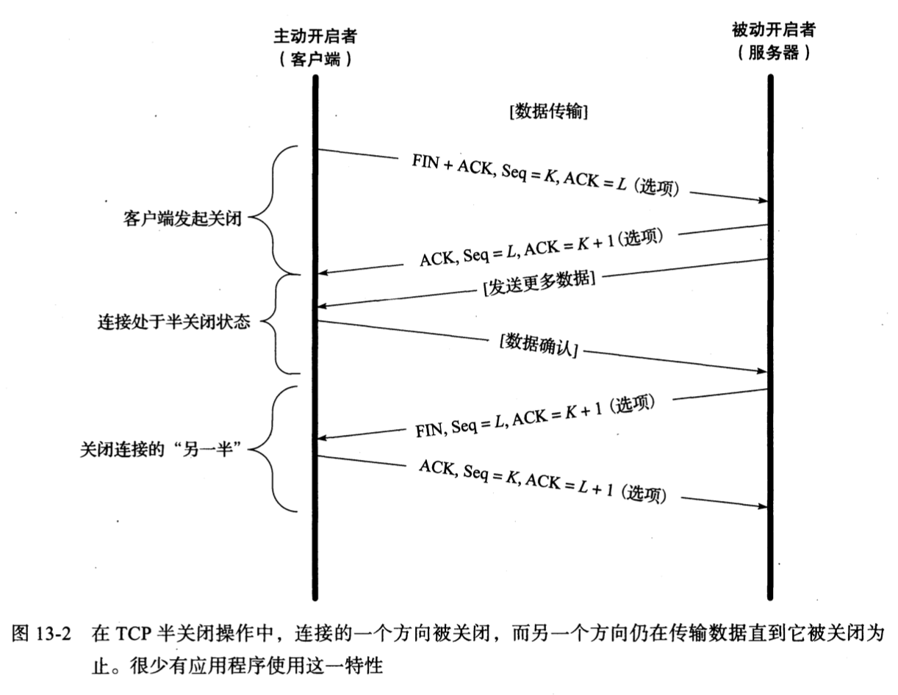

TCP半关闭（少见）

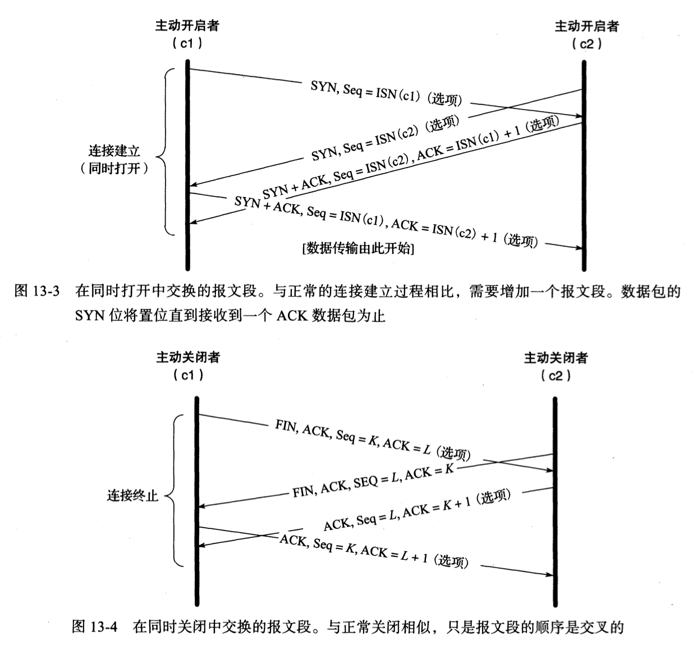

TCP同时连接与关闭（少见）

](imgs/tcp-client-server-interaction.png)

TCP 客户端与服务端通信交互过程 [https://www.processon.com/diagraming/6141d78863768941d275fe0d](https://www.processon.com/diagraming/6141d78863768941d275fe0d)

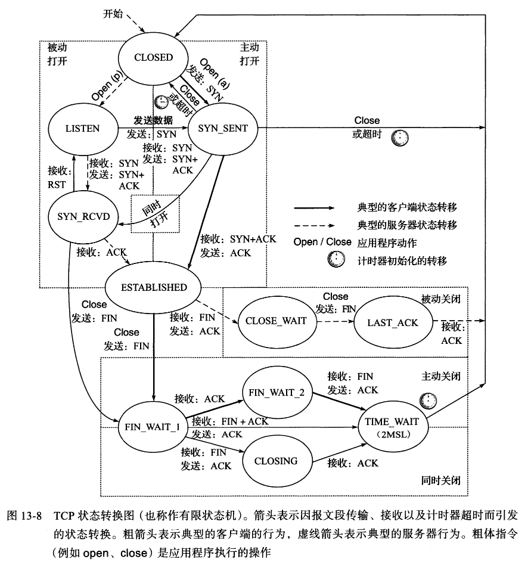

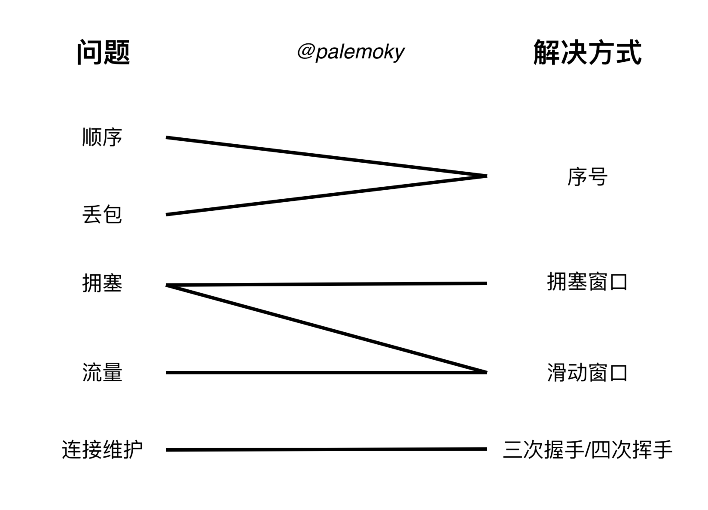

TCP 可靠传输解决方案

Linux系统采用基于时钟的方案，并且针对每个连接为时钟设置随机的偏移量。随机偏移量是在连接标识的基础上利用加密散列函数得到的。散列函数的输入每隔5分钟就会改变一次。在32位的初始序列号中，最高的8位是一个保密的序列号，而剩余的各位则由散列函数生成。该方法所生成的序列号很难被猜出，但依然会随着时间而逐步增加。

RFC0793 将最大段生存期设为2分钟，但通常该值位30s、1m 或 2m。Linux 中可用 `sysctl net.ipv4.tcp_fin_timeout` 来查看 2MSL 状态需要等待的超时时间（秒）

#### 滑动窗口

@[ACK滑动窗口与拥塞窗口](https://www.notion.so/87173f9e936a4267a39d54ea85ea3e21?pvs=21)

因为TCP是全双工协议，因此在建立连接时需要互相交换各自的 seq 和 winsize 等信息。每个TCP活动连接的两段都维护一个发送窗口结构和接收窗口结构。

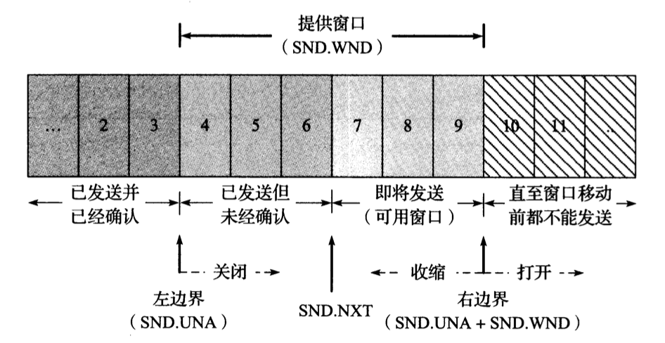

发送端窗口

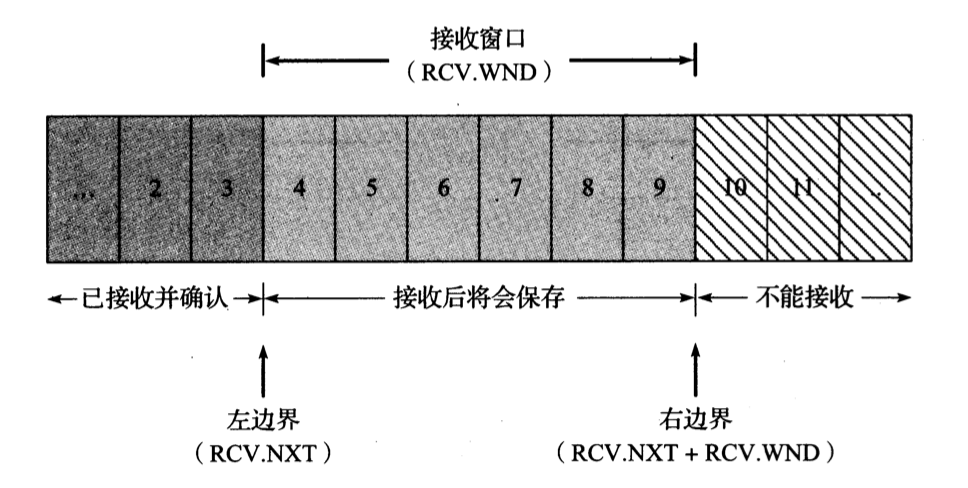

接收端窗口

TCP通过接收端窗口来实现流量控制。当窗口值为0时，可以有效组织发送端继续发送，直到窗口大小恢复为非零值。

为了防止接收端窗口更新的ACK丢失，发送端会采用一个持续计时器间歇性地查询接收端，看其窗口是否已增长。持续计时器会触发窗口探测的传输，强制要求接收端返回ACK (其中包含了窗口大小字段)。

使用相对较大的接收缓存，即使在接收端应用处理数据前也能传输大量的数据。因此Linux在2.6.7之后的版本，支持发送方与接收方的缓存大小自动调整。

发送端与接收端窗口：

1. 发送端不必传输整个窗口大小的数据
2. 接收到返回的ACK的同时可将窗口右移
3. 窗口大小可能减小，但窗口右边界不会左移
4. 接收端不必等到窗口满才发送ACK

接收窗口，rwnd，Receiver Window

拥塞窗口，cwnd，Congestion Window

**发送窗口 = min（接收窗口，拥塞窗口）**

#### 拥塞控制

TCP 拥塞控制的难点在于怎样准确地判断何时需要减缓且如何减缓TCP传输，以及何时恢复其原有的速度。

TCP通信的每一方都需要实行拥塞控制。

在TCP头部的Options中，会携带TSval（Timestamp Value）和 TSecr（Timestamp Echo Reply），其作用如下

1. **拥塞控制**：时间戳选项可以帮助发送方和接收方计算往返时间（RTT，Round-Trip Time），以便更精确地进行拥塞控制。
2. **序列号回环检测**：时间戳也可以用于检测序列号的回环，即确保序列号在回绕时不会被错误地认为是旧的序列号。

需要注意的是，TSval 和 TSecr 的时间戳并不是真实的绝对时间戳，而是在建立连接时各自初始一个随机时间戳，然后开始计时，以避免主机时间设置错误和绝对时间戳时区导致的混乱。

发生拥塞时，通常难以检测，因此一般通过**丢包率**来判断是否发生拥塞。

虽然我们在建立连接时可以得知发送方与接收方的承载能力，但数据包传输过程中的路由器、交换机等设备的承载能力我们无法得知。因此，获得网络传输能力（拥塞窗口）的唯一方法是通过不断提升发送速率来探测，直至丢包（发生拥塞）为止。

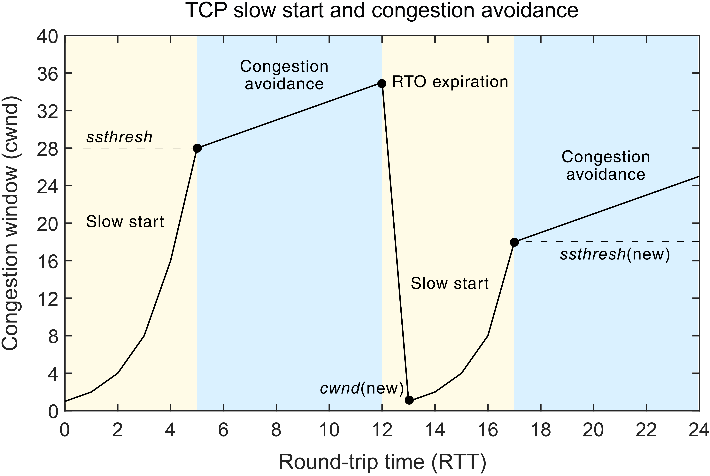

慢启动和拥塞避免。在慢启动阶段，拥塞窗口呈指数增长（cwnd 在每收到一个ACK就会按MSS大小的倍数增加），进入拥塞避免阶段则是线性增长。

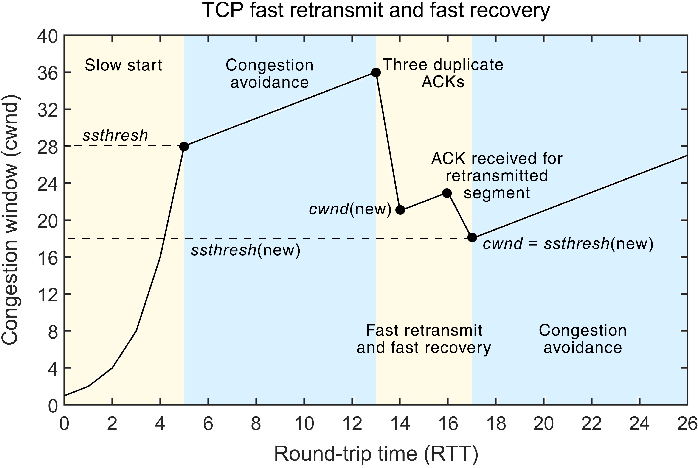

快重传与快恢复。发生拥塞时，拥塞窗口减半，而不是归零（主要解决发送拥塞发送速度掉底的问题）。

Linux中在路径 `/proc/sys/net/ipv4/` 下 `tcp_congestion_control` 和 `tcp_available_congestion_control` 查看默认和支持的拥塞控制算法。

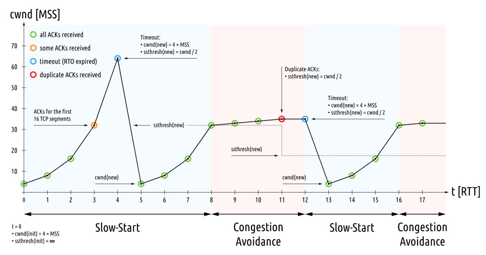

Reno（cwnd表现为锯齿）

）](imgs/tcp-cubic-algorithm.png)

CUBIC算法图（Linux默认拥塞控制算法，[https://www.slideshare.net/deawooKim/cubic-kdw](https://www.slideshare.net/deawooKim/cubic-kdw)）

CUBIC优势：

1. 能快速探测cwnd，在高带宽、高延迟环境下表现更优
2. 能维持在cwnd附近高速传输，而不会像Reno那样不断震荡
3. 能探测并适应带宽更高的cwnd，提升带宽利用率

CUBIC缺点：

1. 根据算法图可知，CUBIC会长时间维持在cwnd附近，因此当带宽发生变化时，cwnd跟随较慢
2. 由于cubic的cwnd快速增长，导致低带宽网络迅速产生拥塞。网络设备的缓冲区被填满也导致了高延迟和抖动

）：在横轴的20附近，CUBIC快速发送超过cwnd和接收方buffer的数据包，随之出现丢包，CUBIC的cwnd也降为一半，然后再逐步提升，并维持在带宽的最优cwnd附近，同时发送的数据包也在接收方buffer内高速传输。](imgs/tcp-cubic-workflow.png)

CUBIC工作图（[https://www.slideshare.net/slideshow/ausnog-2019-tcp-and-bbr/182584771](https://www.slideshare.net/slideshow/ausnog-2019-tcp-and-bbr/182584771)）：在横轴的20附近，CUBIC快速发送超过cwnd和接收方buffer的数据包，随之出现丢包，CUBIC的cwnd也降为一半，然后再逐步提升，并维持在带宽的最优cwnd附近，同时发送的数据包也在接收方buffer内高速传输。

Reference：

1. 常见TCP拥塞控制算法
   1. 视频版：[https://www.youtube.com/watch?v=5h-xci7Brm8](https://www.youtube.com/watch?v=5h-xci7Brm8)
   2. 文字版：[https://zhuanlan.zhihu.com/p/142618130](https://zhuanlan.zhihu.com/p/142618130)、[https://zhuanlan.zhihu.com/p/142835569](https://zhuanlan.zhihu.com/p/142835569)

#### 超时与重传

一、基于计时器的超时重传

在大多数情况下，计时器超时并触发重传是不必要的（也不是期望的），因为RTO的设置通常大于RTT（约2倍或更大），因此基于计时器的重传会导致网络利用率的下降。

二、快速重传

根据收到重复ACK来判断出现丢包并启动重传，而不等待计时器超时。

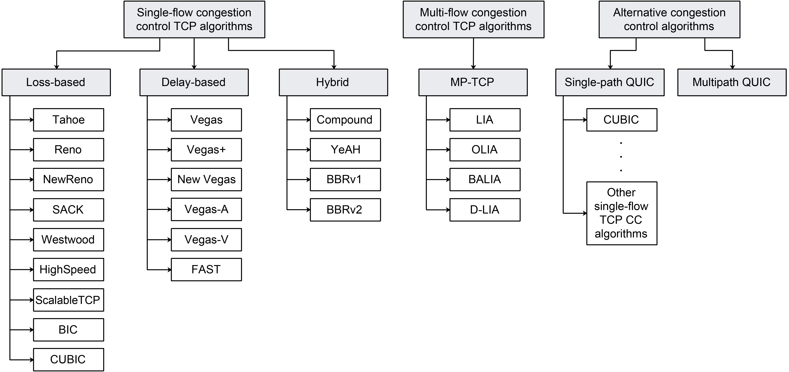

From [https://encyclopedia.pub/entry/12206](https://encyclopedia.pub/entry/12206)

#### 隐喻类比

TCP 中的数据传输就像现实生活中的物流，假设我们有一批货物（数据包）需要从A地（发送方）发到B地（接收方），B地有一个仓库（接收方缓存）。我们第一次发货时需要知道B的地址以及仓库容量，以免发货过多导致B仓库无法容纳（数据包丢弃）。虽然我们可以预知B仓库的容量，但我们无法预知道路的运输能力（受拥堵和路线影响），因此我们通过不断提升发货量来探测道路的运输能力，以便快速运输完所有货物。

#### 保活机制

当计时器被激发，连接一端将发送一个保活报文，另一端接收报文的同时会发送一个ACK作为响应。

Linux中的保活参数设置：

|              | 参数                            | 默认值     |
| ------------ | ------------------------------- | ---------- |
| 保活时间     | `net.ipv4.tcp_keepalive_time`   | 7200s (2h) |
| 保活时间间隔 | `net.ipv4.tcp_keepalive_intvl`  | 75s        |
| 保活探测数   | `net.ipv4.tcp_keepalive_probes` | 9          |

默认情况下TCP不会到保活报文加密，但应用层的保活机制（如SSH）都会被加密，因此避免保活报文攻击。

### UDP

由于 UDP 只是尽最大努力交付，不提供差错纠正、队列管理、重复消除、流量控制和拥塞控制，只提供差错检测，这些需要应用程序自行提供，因而它没有标识位，如用 SYN、FIN 和 RST 这些位来表示一个会话的创建或销毁。

UDP与IP的攻击：

- 由于UDP没有流量控制，因此会被用于DoS攻击
- 重叠分片偏移

| DNS 类型           | 说明                                         |
| ------------------ | -------------------------------------------- |
| A                  | 将域名映射到 IPv4 地址                       |
| AAAA               | 将域名映射到 IPv6 地址                       |
| CNAME              | 将域名解析为另一个域名                       |
| MX (Mail Exchange) | 指定邮件服务器                               |
| TXT                | 用于存储任意文本信息，如验证信息，SPF 记录等 |
| NS (Name Space)    | 指定域名服务器                               |
| PTR                | 反向解析记录，即将IP解析为域名               |

#### QUIC & HTTP3

HTTP3 采用了基于 UDP 的 QUIC 协议，相比基于 TCP 的 HTTP1.1 和 HTTP2 的优势有：

1. 快速建立连接：可在一个RTT内完成连接建立，显著减少延迟
2. 连接迁移：当用户 IP 发生变化时（如WiFi到5G），无需像TCP需要重新建立连接
3. 多路复用：解决HTTP2中的队头阻塞问题
4. 更好的拥塞控制：默认BBR，但可以灵活调整
5. 更高的安全性以及更低的开销：默认启用TLS 1.3，相比建立在TLS上的TCP，省去了握手的复杂性和延迟
6. 开销低：QUIC头部更简洁，减少了传输的开销

### TCP vs UDP

TCP 的交付特点：

- 可靠性：TCP 提供可靠的数据传输，通过使用确认、序列号和重传等机制来确保数据的准确性和完整性。如果数据包丢失或损坏，TCP 会自动重传。
- 有序性：TCP 保证数据的有序交付，即接收方按照发送方的顺序重新组装数据。
- 流量控制：TCP 使用滑动窗口协议来控制发送方与接收方之间的数据传输速率，以防止过载或拥塞。
- 拥塞控制：TCP 通过监测网络拥塞情况和动态调整发送速率，以避免网络拥塞的发生。

UDP 的交付特点：

- 无连接性：UDP 是一种无连接的协议，意味着在通信之前没有建立连接的过程。每个 UDP 数据包都是独立的，相互之间没有关联。
- 不可靠性：UDP 不提供数据传输的可靠性保证，它不重传丢失的数据包，也不对数据包的顺序进行检查和修复。
- 较低的延迟：由于 UDP 的简单性，它具有较低的传输延迟。这使得 UDP 适用于实时应用程序，如音频和视频流媒体，其中时间敏感性较高，而可靠性相对较次要。
- 支持广播和多播：UDP 支持向多个接收方发送相同的数据包，这在某些场景（如实时通信、流媒体分发）中非常有用。

](imgs/tcp-ip-structure.svg)

以太网数据结构 [https://www.processon.com/diagraming/5ffff2d21e0853437c45317f](https://www.processon.com/diagraming/5ffff2d21e0853437c45317f)

## 应用层

### DHCP

DHCP的设计基于一种早期协议——BOOTP（Internet引导程序协议），它目前已过时。

DHCP 常见的租期默认值为12~24h。微软建议较小的网络采用8天，较大的网络采用16~24天。客户机在租期过半时开始尝试续订租约。

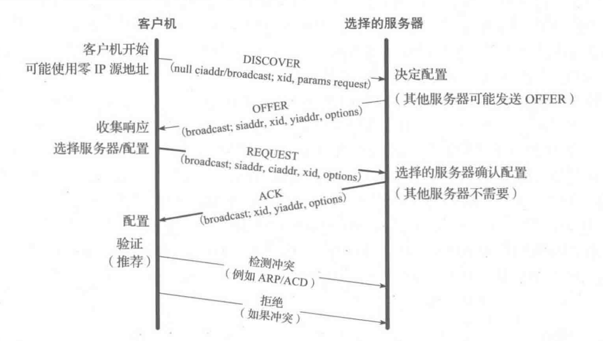

—次典型的 DHCP 交换。客户机通过广播消息发现一组服务器和可提供的地址，它请求自己想获得的地址，并接收到选定服务器的确认。事务ID（xid) 用于将请求和响应匹配，服务器ID指出哪台服务器提供地址，并承诺将它与客户机绑定。如果客户机知道它想获得的地址，该协议可简化为仅使用 REQUEST 和 ACK 消息。

### HTTP & WebSocket

**WebSocket 是应用层协议，Socket 是传输层协议。**

虽然 HTTP 和 WebSocket 都是基于 TCP，但 HTTP 的请求-响应模式通常被视为单工通信，而 WebSocket 则真正实现了全双工通信能力。

WebSocket 实现了在单个 TCP 连接上的全双工通信，适用于聊天、网络游戏等低延时场景。


WebSocket 是与 HTTP 兼容的（与 HTTP 和 HTTPS 使用相同的 TCP 端口），这在防火墙阻止非 Web 网络连接的环境下是有益的。建立 WebSocket 连接时，首先建立一个 HTTP 连接，请求头部 `Upgrade:websocket` 升级为 WebSocket。

`ws`（WebSocket）和 `wss`（WebSocket Secure）类似于 HTTP 和 HTTPS。

## 安全

[《图解密码技术》](https://www.notion.so/d6b0f1dc212e46438d6e8c44852ad563?pvs=21)

### 加密算法

对称加密

- 3EDS（利用两个或三个不同密钥对每个数据块进行三次DES加密）
- AES（通常在书写时也会加上长度，如AES-128、AES-256)

非对称加密

- RSA（安全性基于大质数分解的困难性，不支持前向安全性）
- ECC（Elliptic Curve Cryptography，椭圆曲线加密系统）（在相同安全程度前提下，ECC使用的密钥长度小于RSA的密钥长度，同时支持前向安全性）
- Diffie-Hellman-Merkle 密钥协商协议（在被监听的网络中协商出密钥）

前向安全性

- 定义：攻击者录制加密通信的内容，在某天攻击服务器获得其私钥，便可解密过去和未来与该服务器通信的加密内容
- 由于RSA的私钥固定，因此泄露RSA私钥就会导致前向安全问题，而ECC每次通信的私钥不同，则避免了此问题

由于计算机并不能做到本质上的随机，因此通常把用于模拟随机的数字称为伪随机数。

散列函数：MD5、SHA-1、SHA-2

消息认证码（HMAC）：保证消息完整性的同时，防止消息被伪造

加密套件定义不仅仅是加密算法，还包括特殊的消息认证码算法、伪随机函数族、密钥协商算法、数字签名算法，以及相关的密钥长度和参数。

PKI、CA、X.509（格式有DER、PEM（Base64编码的DER）、PKCS#7、PKCS#12）

### 安全协议

OSI 模型各层安全协议：

| 层数 | 名称   | 协议                                                                     |
| ---- | ------ | ------------------------------------------------------------------------ |
| 7    | 应用层 | **DNSSEC**、DKIM、EAP、Diameter、RADIUS、**SSH**、Kerberos、IPSec（IKE） |
| 4    | 传输层 | TLS、DTLS、PANA                                                          |
| 3    | 网络层 | **IPSec**（ESP）                                                         |
| 2    | 链路层 | 802.1X、802.1AE、802.11i/WPA2                                            |

#### IPSec

L2TP 通常与网络层的 IPSec 结合使用：首先由 IPsec 建立一个加密的、认证的隧道（通常称为 IPsec 隧道）。然后，L2TP 在这个加密的隧道内建立自己的 L2TP 隧道。这种双层隧道结构确保了数据在传输过程中既被封装（L2TP）又被加密（IPsec），可以在公网上安全地传输私密数据，非常适合用于 VPN 服务，确保远程用户能够安全地访问内部网络资源。

目前主流的公司 VPN 解决方案都是通过TLS来实现安全访问内网资源的，如Cisco AnyConnect 和 OpenVPN。TLS 基于以下原因取代了 L2TP/IPsec：

- 在移动设备上的广泛支持
- 由于HTTPS的广泛支持，TLS的配置和部署更简单，尤其在存在NAT或防火墙的网络环境中
- 更好的性能和安全性

#### TLS

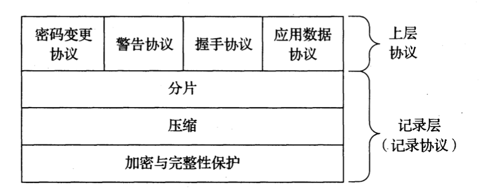

TLS 1.2协议结构

TLS 对数据加密发生在应用层和传输层之间。

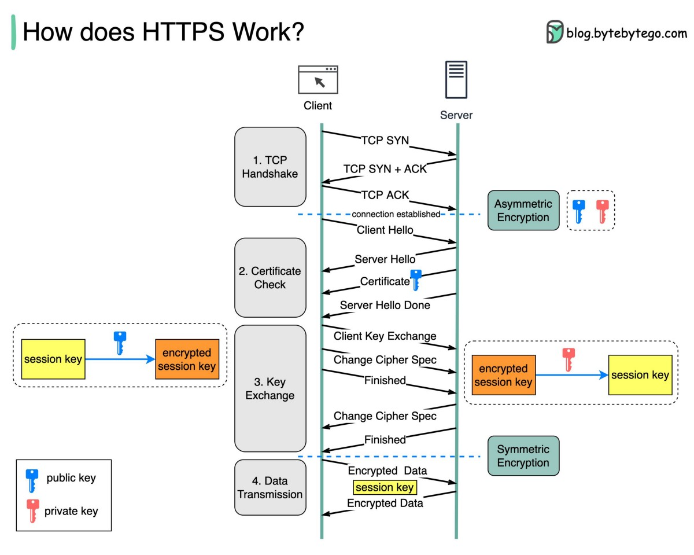

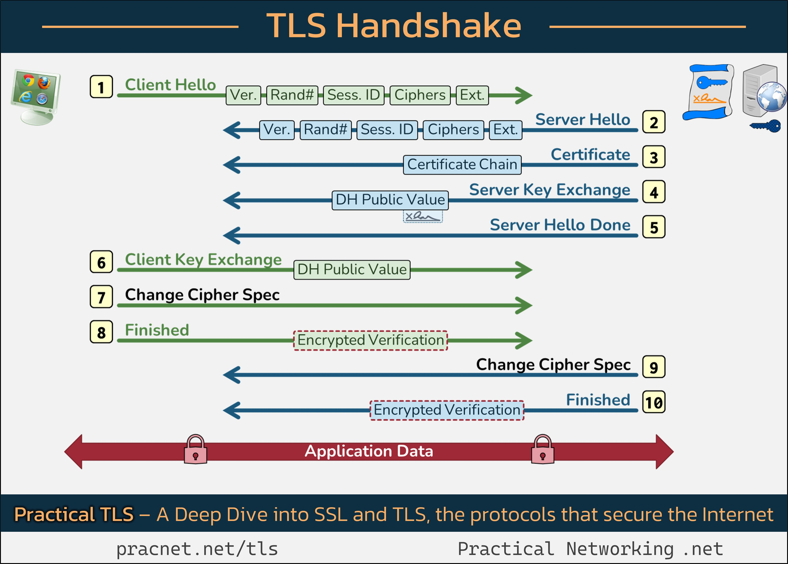

Server在初次握手后会生成一个Session ID给Client，如果之后的Client Hello中携带的Session ID 与Server缓存一致，则可用于会话复用，跳过完整握手的Server Hello之后的阶段，直接开始通信。

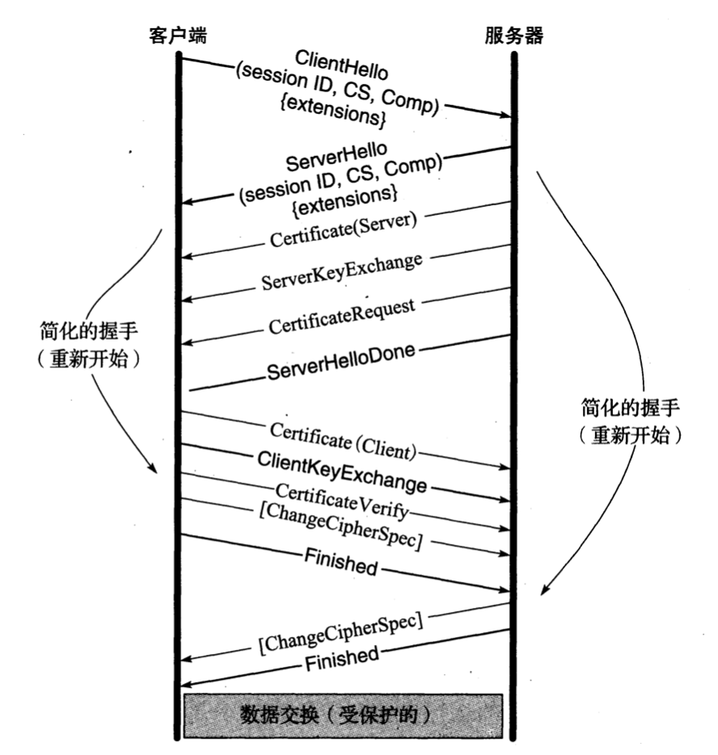

TLS握手过程（不含TCP握手）

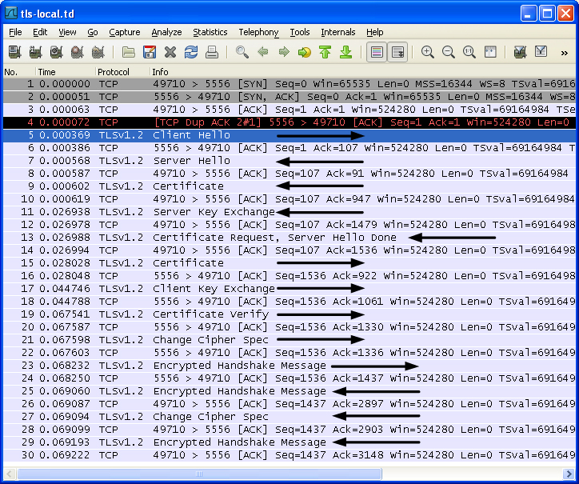

TLS初次握手过程

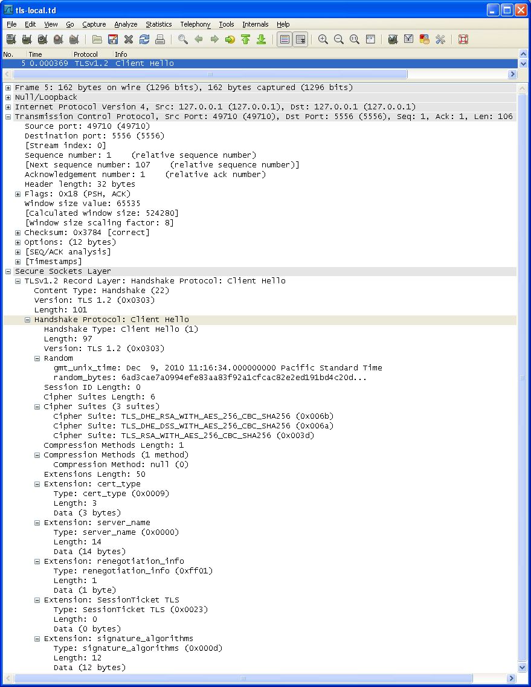

Random.random_bytes 用于产生密钥；由于是初次握手，Session ID Length 为 0；Cipher Suites 显示客户端支持的加密套件，并按推荐排序

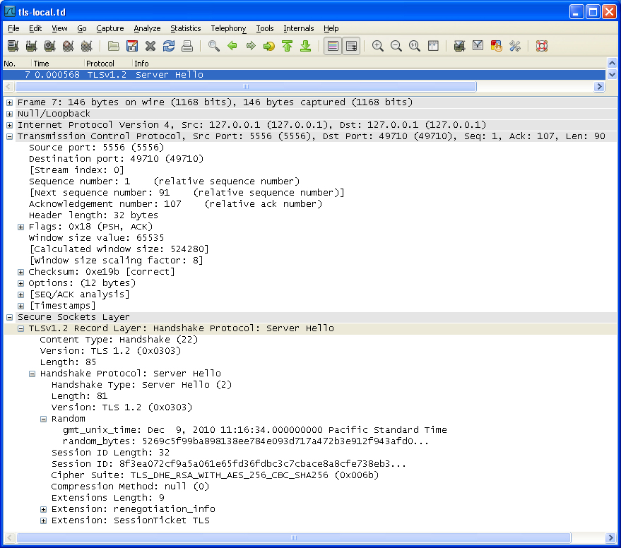

服务器中的 Random.random_bytes 同样用于产生密钥；返回的 Session ID 用于会话复用；Cipher Suite 中选定客户端提供的第一个加密套件（使用RSA证书的DH密钥协商，CBC模式的AES-256算法用于加密，SHA-256算法用于完整性）

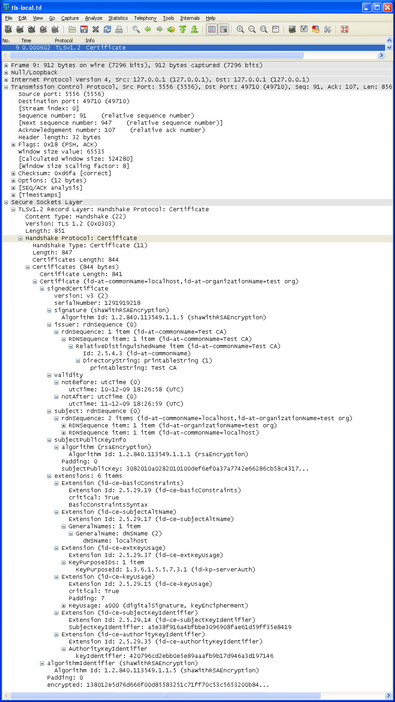

服务端返回经私钥签名的公钥，客户端验证证书链

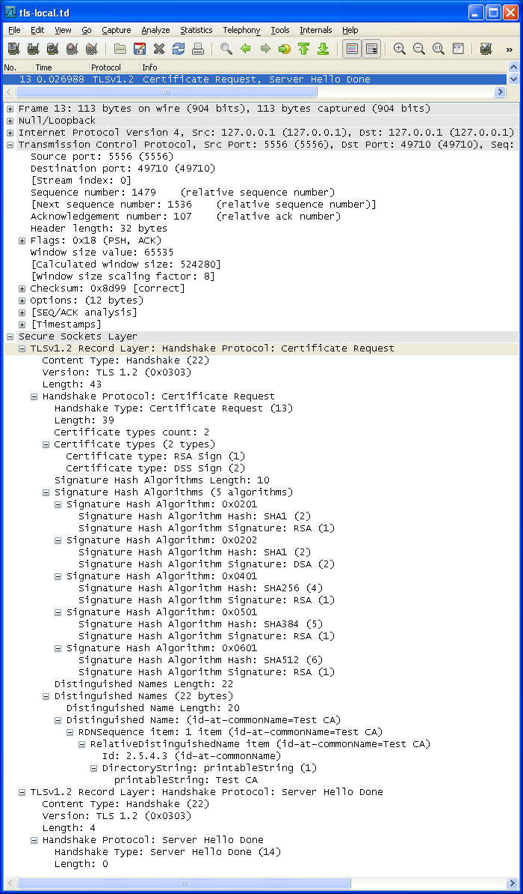

服务器验证客户端身份

#### DNSSEC

目前主流的 DNSSEC 有 DoH（DNS over HTTPS，443端口） 和 DoT（DNS over TLS，853端口）。DoH 相比 DoT 需要多一层的封装，因此性能较差，但其以广泛的支持和能通过大多数的防火墙与代理的优势，也非常常见。

## 关联资料

[《网络是怎样连接的》](../how-networks-work/README.md)

## TODO

- [ ] 3.5 节讲解了WiFi技术及结构，后续可通过kali的破解工具和wireshark来分析WiFi的握手及数据结构

抓包示例：

ip.addr == 192.168.50.15 && tcp.port == 8080
