# 《深入理解计算机系统》（第三版）

!!! abstract "阅读信息"

    - **评分**：⭐️⭐️⭐️⭐️⭐️
    - **时间**：10/11/2021 → 11/17/2021
    - **读后感**：系统性了解计算机基础知识，有助于降低未来的编程门槛

## 第1章 计算机系统漫游

- 什么是二进制文件？实际上，计算机中所有的内容都是以二进制的方式存储的，但我们通常将由 ASCII 字符构成的文件称之为文本文件，而其它文件则成为二进制文件。
- 在计算机系统中，所有的信息都是由一串比特表示， **区分不同数据对象的唯一方法是我们读到这些数据对象时的上下文**。因此字符、视频、音频、图片有不同的编码格式，使用错误的解码方式会获取到人类无法理解的内容。
- GNU项目的目标是开发出一个完整的类 Unix 的系统，其源代码能够不受限制地被修改和传播。GNU 项目己经开发出了一个包含Unix 操作系统的所有主要部件的环境，但内核除外，内核是由 Linux 项目独立发展而来的。GNU 环境包括 EMACS 编辑器、GCC编译器、CDB 调试器、汇编器、链接器、处理二进制文件的工具以及其他一些部件。GCC编译器已经发展到支持许多不同的语言，能够为许多不同的机器生成代码。支持的语言包括C、C++、Fortran、Java Pascel、Objective-C 和 Ada。
- 我们常说的计算机32/64位，就是指总线的位宽，宽度越高，传输性能也越强
- 计算机中从 CPU 到内存、再到磁盘和网络，通过不断缓冲不同设备间的速度差来提升整体效率。这个思想是围绕着计算机程序的 **局部性** 基本属性。

<figure markdown>
  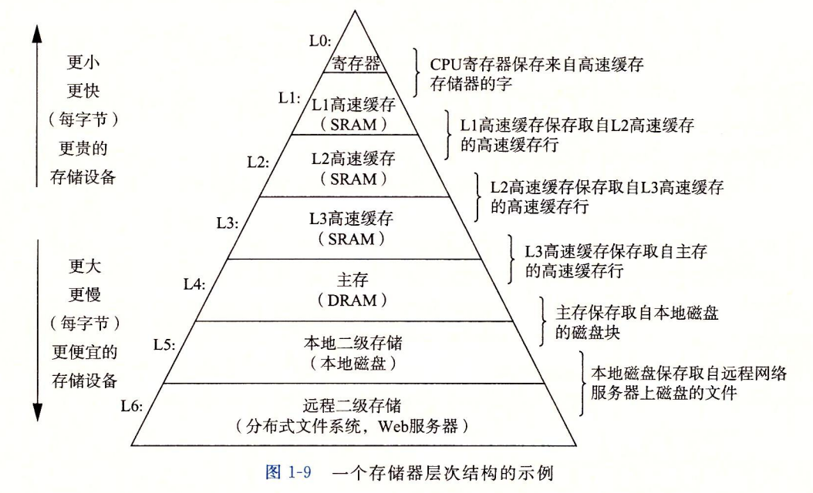{ width="80%" }
</figure>

- 操作系统有两个基本功能：
    - 防止硬件被失控的应用程序滥用；
    - 向应用程序提供简单一致的机制来控制复杂而又通常大不相同的低级硬件设备。操作系统通过几个基本的抽象概念（进程、虚拟内存和文件）来实现这两个功能。
- 进程是操作系统对一个正在运行的程序的一种抽象。在一个系统上可以同时运行多个进程，而每个进程好像都在独占使用硬件。

<figure markdown>
  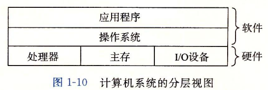{ width="60%" }
</figure>

- 虚拟内存是一个抽象概念，它为每个进程提供了一个假象，即每个进程都在独占地使用主存。每个进程看到的内存都是一致的，称为虚拟地址空间。
- **程序代码和数据**。对所有的进程来说，代码是从同一固定地址开始，紧接着的是和 C 全局变量相对应的数据位置。代码和数据区是直接按照可执行目标文件的内容初始化的
- **堆**。代码和数据区后紧随着的是 **运行时堆**。代码和数据区在进程一开始运行时就被指定了大小，与此不同，当调用像 `malloc()` 和 `free()` 这样的 C 标准库函数时，堆可以在运行时动态地扩展和收缩。
- **共享库**。大约在地址空间的中间部分是一块用来存放像 C 标准库和数学库这样的共享库的代码和数据的区域。
- **栈**。位于用户虚拟地址空间顶部的是用户栈，编译器用它来实现函数调用。和堆一样，用户栈在程序执行期间可以动态地扩展和收缩。特别地， **每次我们调用一个函数时，栈就会增长；从一个函数返回时，栈就会收缩**。局部变量、函数参数、返回值等都在栈区。
- **内核虚拟内存**。地址空间顶部的区域是为内核保留的。不允许应用程序读写这个区域的内容或者直接调用内核代码定义的函数。相反，它们必须调用内核来执行这些操作。

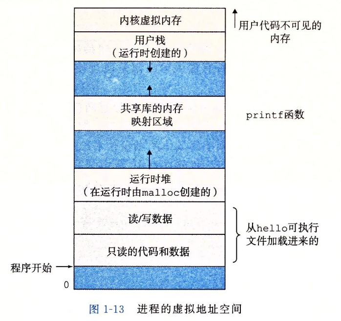{ align=left width=50% }
根据数据类型来说，在大多数编程语言中，数组和对象通常被动态分配在堆上，因为它们的大小不固定，并且需要在运行时进行动态分配和释放内存；字符串的存储位置通常取决于编程语言和字符串的类型。在某些编程语言中，字符串常常是不可变的，因此它们可能存储在常量区或堆上。但在其他情况下，编译器可能会将字符串存储在栈上，特别是对于局部变量的字符串或者短期字符串；基本数据类型（如整数、浮点数）通常会被存储在栈上，因为它们的大小固定。

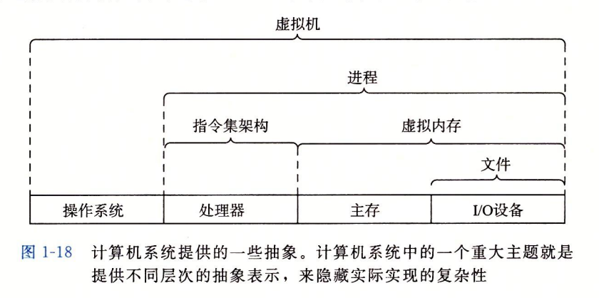{ align=right width=50% }

- **每个I/O设备**，包括磁盘、键盘、显示器，甚至网络， **都可以看成是文件**。文件这个简单而精致的概念是非常强大的，因为它向应用程序提供了一个统一的视图来看待系统中可能含有的所有各式各样的I/O设备。
- 抽象的使用是计算机科学中最为重要的概念之一。 **文件是对I/O 设备的抽象，虚拟内存是对程序存储器的抽象，而进程是对一个正在运行的程序的抽象，虚拟机则是对整个计算机的抽象**。

## 第5章 优化程序性能

- 减少低效循环
- 减少过程调用
- 消除不必要的内存引用

## 第6章 存储器层次结构

### SRAM 与 DRAM

**SRAM 抗干扰性强，而 SRAM 则较弱，因此需不断刷新以保持存储内容。** 由于 SRAM 存储器单元的双稳态特性，只要有电，它就会永远地保持它的值。即使有干扰（例如电子噪音）来扰乱电压，当干扰消除时，电路就会恢复到稳定值。而 DRAM 存储器单元对干扰非常敏感。当电容的电压被扰乱之后，它就永远不会恢复了。暴露在光线下会导致电容电压改变。实际上，数码照相机和摄像机中的传感器本质上就是 DRAM 单元的阵列。很多原因会导致漏电，使得 DRAM 单元在 10~100 毫秒时间内失去电荷。幸运的是计算机运行的时钟周期是以纳秒来衡量的，所以相对而言这个保持时间是比较长的。内存系统必须周期性地通过读出，然后重写来刷新内存每一位。有些系统也使用纠错码，其中计算机的字会被多编码几个位，这样一来，电路可以发现并纠正一个字中任何单个的错误位。

### ROM

由于历史原因，虽然 ROM 中有的额理性既可以读也可以写，但他们整体上都被称为只读存储器(Read-Only Memory)。存储在 ROM 设备中的程序通常被称为固件。

### 磁盘

#### 磁盘构造

磁盘是由 **盘片** （platter）构成的。每个盘片有两面或者称为表面，表面覆盖着磁性记录材料。盘片中央有一个可以旋转的 **主轴** （spindle），它使得盘片以固定的旋转速率（rotational rate）旋转，通常是 5400~15000 转每分钟（Revolution Per Minute, **RPM** ）。磁盘通常包含一个或多个这样的盘片，并封装在一个密封的容器内。图 6-9a 展示了一个典型的磁盘表面的结构。每个表面是由一组称为 **磁道** （track）的同心圆组成的。每个磁道被划分为一组 **扇区** （sector）。每个扇区包含相等数量的数据位（通常是 512 字节），这些数据编码在扇区上的磁性材料中。扇区之间由一些间隙（gap）分隔开，这些间隙中不存储数据位。间隙存储用来标识扇区的格式化位。

磁盘是由一个或多个叠放在一起的盘片组成的，它们被封装在一个密封的包装里，整个装置则被称为磁盘。 **柱面** 是指所有盘片表面上到主轴中心的距离相等的磁道的集合。

- <figure>
    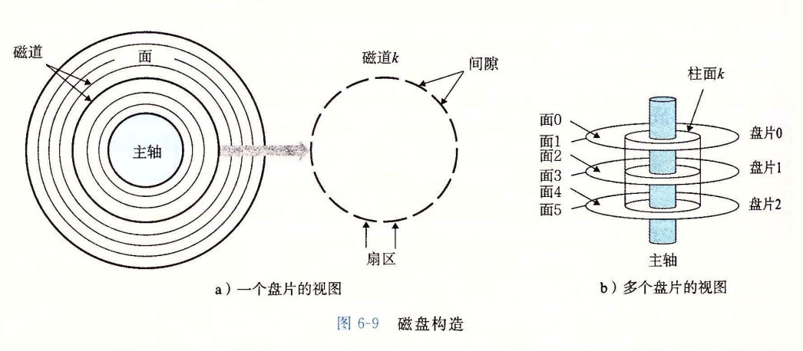
    <figcaption>磁盘表面结构</figcaption>
  </figure>
- <figure>
    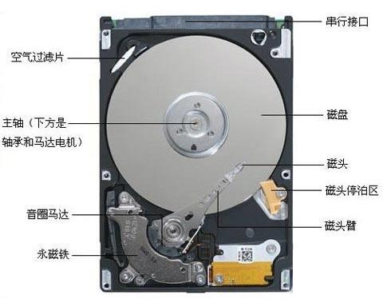
    <figcaption>磁盘几何结构</figcaption>
  </figure>

{ align=right width=30% }
在DOS系统时代，电脑前左右两个盘孔分别是A盘（主驱动器）、B盘（辅助驱动器），分别用于加载操作系统和存储数据应用程序，因此在之后的Windows磁盘分区中，是以C开始的。（图片来自 https://en.wikipedia.org/wiki/PC1512）

#### 磁盘操作

磁盘用读/写头(read/ write head）来读写存储在磁性表面的位，而读写头连接到一个传动臂（actuator arm）一端，如图 6-10a 所示。通过沿着半径轴前后移动这个传动臂，驱动 器可以将读/写头定位在盘面上的任何磁道上。这样的机械运动称为 **寻道** (seek）。一旦读/ 写头定位到了期望的磁道上，那么当磁道上的每个位通过它的下面时，读/写头可以感知到这个位的值（读该位），也可以修改这个位的值（写该位）。有多个盘片的磁盘针对每个盘 面都有一个独立的磁头,如图6-10b所示。磁头垂直排列，一致行动。在任何时刻，所有的磁头都位于同一个柱面上。

磁头在磁盘表面大约 0.1 微米的高度以 80km/h 的速度进行读写操作，即使盘面有一粒灰尘，都会导致磁头损坏，因此磁盘内是真空或氦气等惰性气体封装，一旦暴露在空气中的磁盘就无法使用了。

- <figure>
    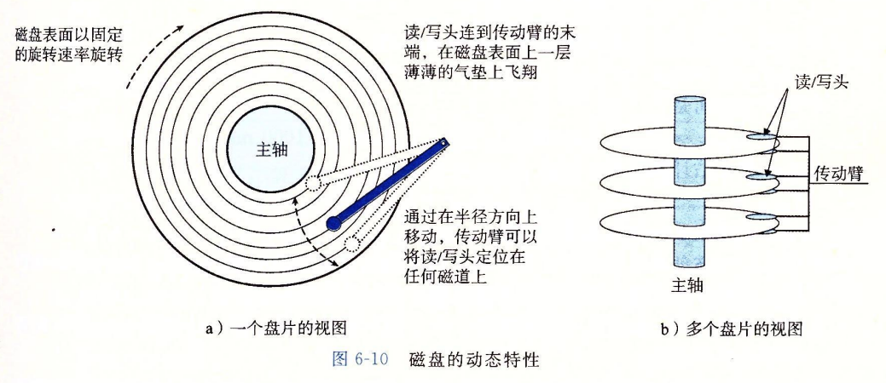
    <figcaption>磁盘读写头</figcaption>
  </figure>
- <figure>
    
    <figcaption>多盘片示意图</figcaption>
  </figure>

磁盘以扇区大小的块来读写数据，读扇区的访问时间有三个主要部分：

- **寻道时间**：为了读取某个目标扇区的内容，传动臂首先将磁头定位到包含目标扇区的磁道上。移动传动臂所需的时间称为寻道时间。寻道时间 T 依赖于读/写头以前的位置和传动臂在盘面上移动的速度。现代驱动器中平均寻道时间通常为 3~9ms。一次寻道的最大时间可以高达 20ms。
- **旋转时间**：一旦磁头定位到了期望的磁道，驱动器等待目标扇区的第一个位旋转到磁头下。这个步骤的性能依赖于当读/写头到达目标扇区时盘面的位置以及磁盘的旋转速度。在最坏的情况下，磁头刚刚错过了目标扇区，必须等待磁盘转一整圈。
- **读写时间**：当目标扇区的第一个位位于磁头下时,驱动器就可以开始读或者写该扇区的内容了。

通过磁盘读取，我们发现：访问一个磁盘扇区中 512 个字节的时间 **主要是寻道时间和旋转延迟。访问扇区中的第一个字节用了很长时间，但是访问剩下的字节几乎不用时间。**

#### CPU 访问磁盘

CPU使用一种称为内存映射I/O的技术来向I/O设备发射命令。在使用内存映射I/O的系统中,地址空间中有一块地址是为与I/O设备通信保留的。每个这样的地址称为一个I/O端ロ。当一个设备连接到总线时，它与一个或多个端口相关联（或它被映射到一个或多个端口）。

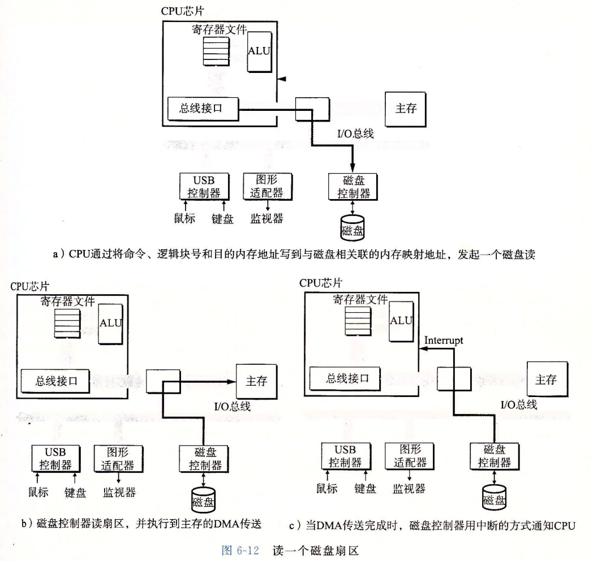

在磁盘控制器收到来自 CPU 的读命令之后，它将逻辑块号翻译成一个扇区地址，读该扇区的内容，然后将这些内容直接传送到主存，不需要 CPU 的干涉（图 6-12b）。设备可以自己执行读或者写总线事务而不需要 CPU 干涉的过程，称为 **直接内存访问** （Direct Memory Access, **DMA** ）。

在 DMA 传送完成，磁盘扇区的内容被安全地存储在主存中以后，磁盘控制器通过给 CPU 发送一个中断信号来通知 CPU（图 6-12c）。基本思想是中断会发信号到 CPU 芯片的个外部引脚上。这会导致 CPU 暂停它当前正在做的工作，跳转到一个操作系统例程。 这个程序会记录下I/O已经完成，然后将控制返回到CPU 被中断的地方。

#### 固态硬盘 (SSD)

SSD 是一种基于闪存的存储技术，因此随着反复擦写，SSD 的寿命不断缩短。相比于 HDD，SSD是由半导体存储器构成，没有移动的部件，因此随机访问时间比旋转磁盘要快，能号更低，同时也更届时。

SSD 读比写快。

通过统计 1985 年至今的内存和磁盘数据发现，内存和磁盘技术的一个基本事实是， **增加密度（从而降低成本）比降低访问时间容易得多**。因此通过空间换时间被广泛在程序中应用。

#### 局部性

局部性通常有两种不同的形式：时间局部性（temporal locality）和空间局部性（spatial locality)

### I/O总线

连接外设的 I/O 总线有 USB、SATA、显卡适配器、网卡适配器等，现在均已被 PCIe 所取代。

## 第8章 异常控制流

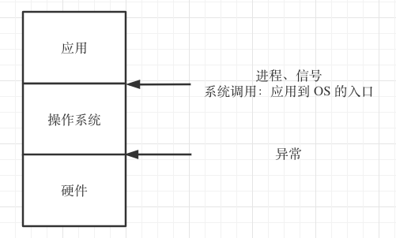{ align=right width=40% }
异常控制流（Exceptional Control Flow， ECF）是操作系统实现 I/O、进程、虚拟内存、并发的基本机制。

| 类别                                                     | 原因                | 同步/异步 | 返回行为             | 说明                                                                                                                                                                                                                                      |
| -------------------------------------------------------- | ------------------- | --------- | -------------------- | ----------------------------------------------------------------------------------------------------------------------------------------------------------------------------------------------------------------------------------------- |
| 中断                                                     | 来自 I/O 设备的信号 | 异步      | 总是返回到下一条指令 | I/O 设备通过向 CPU 引脚发送信号，并将异常号放到系统总线上来触发中断。CPU 在当前指令执行完成后，注意到中断引脚电压变高，就从系统总线读取异常号，然后调用适当的中断处理程序。                                                               |
| 陷阱                                                     | 有意的异常          | 同步      | 总是返回到下一条指令 | 用户程序经常会向内核请求服务，比如读取一个文件（read），创建一个新的进程（fork），加载新的程序（execve），或者终止当前进程（exit）等。CPU 提供了 `syscall n` 指令，当用户程序请求服务 n 时，执行 syscall 会导致一个到异常处理程序的陷阱。 |
| **普通函数运行在用户模式中，系统调用运行在内核模式中。** |
| 故障                                                     | 潜在可恢复的错误    | 同步      | 可能返回到当前指令   | 经典的故障示例就是缺页异常。当指令应用虚拟地址，而其对应的物理页面在内存中不存在，需要从磁盘中取出时，就会发生故障。当从磁盘读取完成，重新执行指令即可正常运行。                                                                          |
| 终止                                                     | 不可恢复的错误      | 同步      | 不会返回             |                                                                                                                                                                                                                                           |

- <figure>
    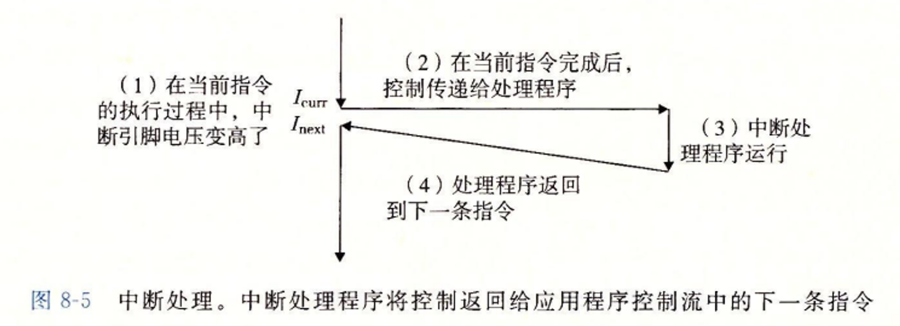
  </figure>
- <figure>
    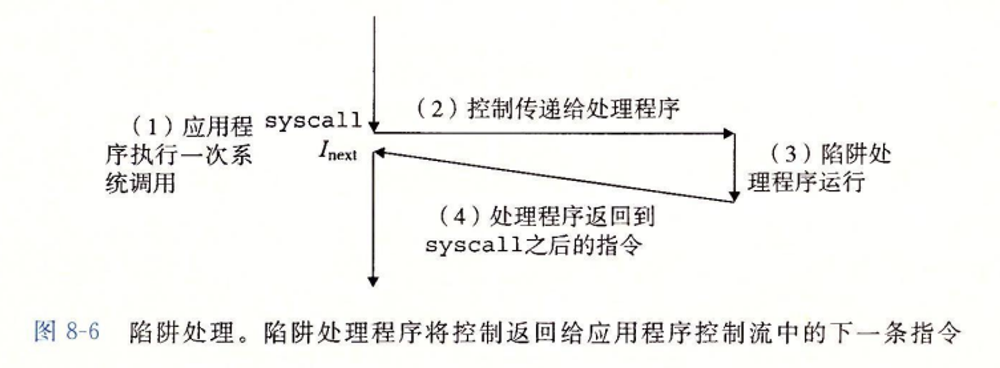
  </figure>
- <figure>
    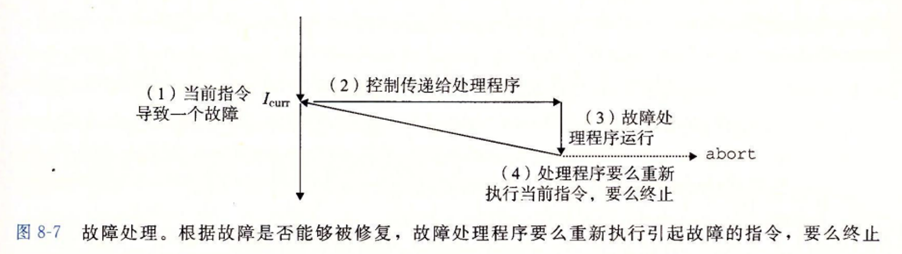
  </figure>
- <figure>
    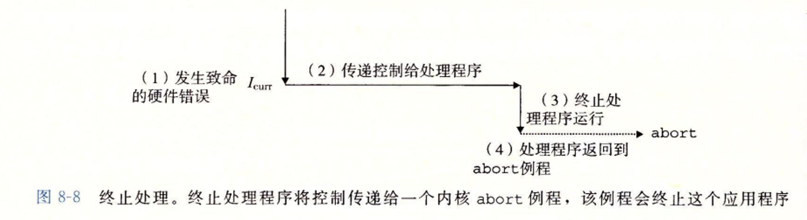
  </figure>

### 进程

进程：一个执行中程序的实例。进程提供了一种假想，好像我们的程序独占地使用 CPU 和内存。

进程运行在用户模式中，用户程序必须通过系统调用接口间接地访问内核代码和数据。

在 Linux 中，/proc 允许用户模式进程访问内核数据结构中的内容，如 CPU 类型（/proc/cpuinfo）。

进程的三种状态：

- 运行。进程要么在 CPU 上执行，要么在等待被执行且最终会被内核调度。
- 停止。进程的执行被挂起，且不会被调度。当收到 SIGSTOP、SIGTSTP、SIGTTIN、SIGTTOU 信号时，进程就停止，直到收到 SIGCONT 信号再次运行
- 终止。进程永远地停止。进程会因为 3 中原因终止：

1. 收到终止进程的信号
2. 从主程序返回
3. 调用 exit 函数

父进程通过调用 fork 函数创建一个新的运行的子进程。父子进程除了各自拥有 PID和独立的地址空间外，子进程继承了父进程的：

- UID 和 GID
- 堆栈
- 共享内存
- 当前目录
- 文件描述符 （意味着子进程可以读写父进程中打开的任何文件）

当一个进程由于某种原因终止时，内核并不是立即把它从系统中清除。相反，进程被保持在一种已终止的状态中，直到被它的父进程回收（reaped）。当父进程回收已终止的子进程时，内核将子进程的退出状态传递给父进程，然后抛弃已终止的进程，从此时开始，该进程就不存在了。 **一个终止了但还未被回收的进程称为僵尸进程** （zombie)

#### 回收子进程

如果一个父进程终止了，内核会安排 init 进程成为它的孤儿进程的养父。init 进程的 PID 为 1，是在系统启动时由内核创建的，它不会终止，是所有进程的祖先。如果父进程没有回收它的僵死子进程就终止了，那么内核会安排 init 进程去回收它们。

一些子进程相关的函数：

- 一个进程可以通过调用 waitpid 函数来等待它的子进程终止或停止。
- sleep 函数可以让进程休眠一段时间，如果请求时间已经到了，sleep 返回 0，否则返回剩余休眠的秒数
- pause 函数可以让进程休眠，直到收到唤醒信号
- execve 函数加载并运行可执行目标文件 filename，且带参数列表 argv 和环境变量列表 envp。只有当出现错误时，例如找不到 filename, execve 会返回到调用程序。所以，与 fork 一次调用返回两次不同，execve 调用一次并从不返。

#### 程序和进程的区别

程序是一堆代码和数据；程序可以作为目标文件存在于磁盘上，或者作为段存在于地址空间中。进程是执行中程序的一个具体的实例；程序总是运行在某个进程的上下文中。

#### fork 与 execve 的区别

fork 函数在新的子进程中运行相同的程序，新的子进程是父进程的一个复制品。execve 函数在当前进程的上下文中加载并运行一个新的程序。它会覆盖当前进程的地址空间，但并没有创建一个新进程。新的程序仍然有相同的 PID，并且继承了调用 execve 函数时已打开的所有文件描述符。

### 信号

Linux 信号允许进程和内核中断其它进程。

=== "⏹️ 终止 (Term)"

    | 序号 | 名称 | 默认行为 | 相应事件 | 备注 |
    | :--- | :--- | :--- | :--- | :--- |
    | 1 | SIGHUP | 终止 | 终端线挂断 | |
    | 2 | SIGINT | 终止 | 来自键盘的中断 | |
    | 9 | SIGKILL | 终止 | 杀死程序 | |
    | 13 | SIGPIPE | 终止 | 向一个没有读用户的管道做写操作 | |
    | 14 | SIGALRM | 终止 | 来自 alarm 函数的定时器信号 | |
    | 15 | SIGTERM | 终止 | 软件终止信号 | |
    | 16 | SIGSTKFLT | 终止 | 协处理器上的栈故障 | |
    | 26 | SIGVTALRM | 终止 | 虚拟定时器期满 | |
    | 27 | SIGPROF | 终止 | 剖析定时器期满 | |
    | 29 | SIGIO | 终止 | 在某个描述符上可执行I/O 操作 | |
    | 30 | SIGPWR | 终止 | 电源故障 | |

=== "💾 终止并转储 (Core)"

    | 序号 | 名称 | 默认行为 | 相应事件 | 备注 |
    | :--- | :--- | :--- | :--- | :--- |
    | 3 | SIGQUIT | 终止并转储内存 | 来自键盘的退出 | |
    | 4 | SIGILL | 终止 | 非法指令 | |
    | 5 | SIGTRAP | 终止并转储内存 | 跟踪陷阱 | |
    | 6 | SIGABRT | 终止并转储内存 | 来自 abort 函数的终止信号 | |
    | 7 | SIGBUS | 终止 | 总线错误 | |
    | 8 | SIGFPE | 终止并转储内存 | 浮点异常 | |
    | 11 | SIGSEGV | 终止并转储内存 | 无效的内存引用（段故障） | |
    | 24 | SIGXCPU | 终止 | CPU 时间限制超出 | |
    | 25 | SIGXFSZ | 终止 | 文件大小限制超出 | |

=== "⏯️ 停止/继续 (Stop/Cont)"

    | 序号 | 名称 | 默认行为 | 相应事件 | 备注 |
    | :--- | :--- | :--- | :--- | :--- |
    | 18 | SIGCONT | 忽略 | 继续进程如果该进程停止 | |
    | 19 | SIGSTOP | 停止直到下一个 SIGCONT | 不是来自终端的停止信号 | |
    | 20 | SIGTSTP | 停止直到下一个 SIGCONT | 来自终端的停止信号 | |
    | 21 | SIGTTIN | 停止直到下一个 SIGCONT | 后台进程从终端读 | |
    | 22 | SIGTTOU | 停止直到下一个 SIGCONT | 后台进程向终端写 | |

=== "🙈 忽略 (Ignore)"

    | 序号 | 名称 | 默认行为 | 相应事件 | 备注 |
    | :--- | :--- | :--- | :--- | :--- |
    | 17 | SIGCHLD | 忽略 | 一个子进程停止或者终止 | 当一个子进程终止或停止时，内核会发送一个 SIGCHLD 信号给父进程 |
    | 23 | SIGURG | 忽略 | 套接字上的紧急情况 | |
    | 28 | SIGWINCH | 忽略 | 窗口大小变化 | |

=== "👤 用户定义 (User)"

    | 序号 | 名称 | 默认行为 | 相应事件 | 备注 |
    | :--- | :--- | :--- | :--- | :--- |
    | 10 | SIGUSR1 | 终止 | 用户定义的信号 | |
    | 12 | SIGUSR2 | 终止 | 用户定义的信号 | |

在任何时刻，同一种待处理信号最多只会有一条，其余都不会排队，而是直接丢弃。

每个进程都只属于一个进程组，进程组是有一个正整数进程组 ID 来标识，`getpgrp` 函数返回当前进程的进程组 ID。默认地，一个子进程和它的父进程同属于一个进程组，一个进程可以通过使用 `setpgid` 函数来改变或其它进程的进程组。

`/bin/kill` 程序可以向另外的进程发送 **任意的信号**。

一个负的 PID 会导致信号被发送到进程组 PID 中的每个进程，如`/bin/kill -9 -1523`

`ls | sort` 会创建两个进程，这两个进程通过 Unix 管道连接起来。

## 第9章 虚拟内存

一个系统中的进程是与其他进程共享 CPU 和主存资源的。然而，共享主存会形成些特殊的挑战。随着对 CPU 需求的增长，进程以某种合理的平滑方式慢了下来。但是如果太多的进程需要太多的内存，那么它们中的一些就根本无法运行。

早期的PC使用物理寻址，现代处理器使用的是虚拟寻址。CPU 中的内存管理单元（Memory Management Unit，MMU）用于实现翻译虚拟地址。

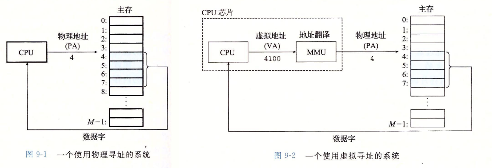

通过虚拟地址访问内存有以下优势：

- 程序可以使用一系列连续的虚拟地址来访问物理内存中不连续的大内存缓冲区。
- 程序可以使用一系列虚拟地址来访问大于可用物理内存的内存缓冲区。 当物理内存的供应量变小时，内存管理器会将物理内存页（通常大小为 4 KB）保存到磁盘文件。 数据或代码页会根据需要在物理内存与磁盘之间移动。
- 不同进程使用的虚拟地址彼此隔离。 一个进程中的代码无法更改正在由另一进程或操作系统使用的物理内存。
- 因为每个进程使用的 RAM 少了，RAM 中可容纳的进程就多了，从而提升 CPU 的利用率

虚拟内存系统将虚拟内存分割为虚拟页，在任意时刻，虚拟页只有以下三种状态：

- <figure>
    
    <figcaption>虚拟页状态</figcaption>
  </figure>
- <figure>
    
    <figcaption>页表</figcaption>
  </figure>

**页表** 用于记录虚拟内存地址与物理内存地址的映射关系，由两部分组成：有效位和 地址段。有效位表明了该虚拟页当前是否被缓存在 DRAM 中。如果设置了有效位，那么地址字段就表示 DRAM 中相应的物理页的起始位置，这个物理页中缓存了该虚拟页。如果没有设置有效位，那么一个空地址表示这个虚拟页还未被分配。否则，这个地址就指向该虚拟页在磁盘上的起始位置。

DRAM 缓存不命中被称为 **缺页** （page fault），缺页发生时，内核异常处理程序会从磁盘读取相应内容，缓存到 DRAM 中，并把虚拟地址重新维护在页表中。

在磁盘和内存间传送页的活动被称作交换（swapping）或页面调度（paging）。现代系统都使用的是按需页面调度。

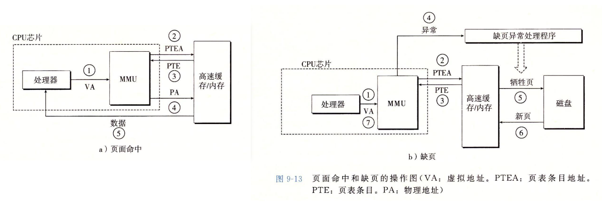
**操作系统为每个进程提供了一个独立的页表**。每个进程又有自己的私有代码、数据、堆以及栈区域，这些是不和其它进程共享的，此时页表将相应的虚拟页映射到不连续的物理页面。当不同进程间需要共享代码和数据时，将不同进程中适当的虚拟页面映射到相同的物理页面，从而使多个进程共享这部分代码的副本，如在右图中，PP6 的物理内存即被进程 $i$ 和 $j$ 共享。

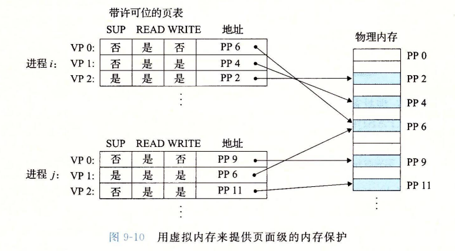

独立地址空间允许每个进程的内存映像使用相同的基本格式，而不管代码和数据实际存放在物理内存的位置。

虚拟内存还可以作为内存保护工具。为了避免不同进程的越界访问，当 CPU 生成一个地址时，地址翻译硬件都会读一个 PTE（Page Table Entry），在 PTE 上添加一些额外的许可位即可控制对虚拟页面内容的访问。如果一个指令 **越界访问**，CPU 就会触发一个一般保护故障，将控制传递给你和中的异常处理程序，Linux Shell 中将这种异常报告称为[段错误](https://www.notion.so/9e4c9963e92d481c930b4c3084213a96?pvs=21)（segmentation fault）。

页面不断地换进换出的现象叫做抖动，此时系统性能会急剧下降。

重启会释放 swap 空间。

通常建议设置swap大小为RAM的 1 ~ 2 倍。

C 语言通过 `malloc()` 函数分配内存块，`free()` 函数释放内存块。在现代的高级语言中，如 Java、Golang、PHP 等，会通过垃圾回收的方式自动回收内存。

碎片：当有未使用的内存，但无法满足分配请求时，就会产生这样的现象，碎片会造成堆利用率低。
**写时复制** （Copy-On-Write，COW）：从一开始大家都在共享同一个内容，当某个人想要修改这个内容的时候，才会真正把内容 Copy 出去形成一个新的内容然后再做修改。CopyOnWrite **只能保证数据的最终一致性**，不能保证数据的实时一致性。所以如果你希望写入的的数据，马上能读到，请不要使用 CopyOnWrite 。

## 第10章 系统级 I/O

文件的操作：

- 打开文件：当应用程序请求内核打开一个文件时，内核返回一个小的非负整数（文件描述符，File Descriptor），它在后续对此文件的所有操作中标识这个文件。 **内核记录有关这个打开文件的所有信息，应用程序只需记住这个描述符**。
- Linux Shell 创建的*每个进程*开始时都有三个打开的文件：
- 标准输入 stdin（fd为 0，链接到 `/dev/fd/0`）
- 标准输出 stdout（fd为 1，，链接到 `/dev/fd/1`）
- 标准错误 stderr（fd为 2，链接到 `/dev/fd/2`）
- 关闭文件：当应用完成了对文件的访问之后，它就通知内核关闭这个文件。作为响应，内核释放文件打开时创建的数据结构，并将这个描述符恢复到可用的描述符池中，无论一个进程因为何种原因终止时，内核都会关闭所有打开的文件并释放他们的内存资源。
- 文本文件是只含有 ASCII 或 Unicode 字符的普通文件，文本文件是特殊的二进制文件。
- 每个进程都有其独立的描述符表。

- <figure>
    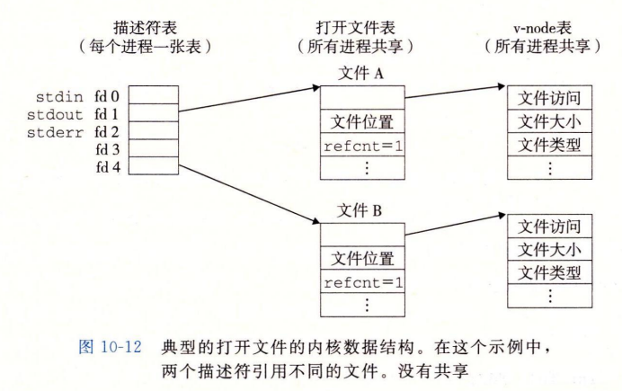
  </figure>
- <figure>
    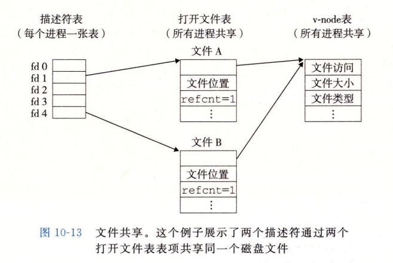
  </figure>
- <figure>
    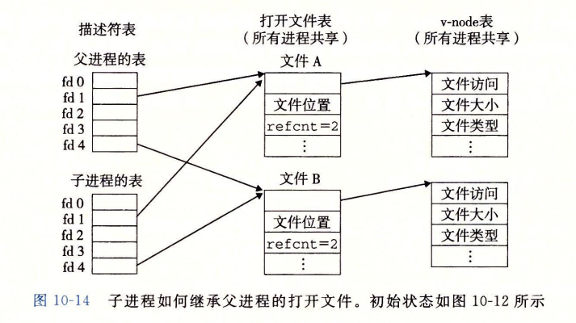
  </figure>
- <figure>
    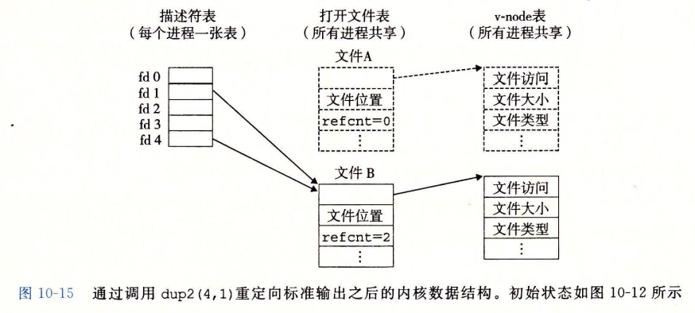
  </figure>

- 标准 I/O 库将一个打开的文件模型化为一个流。对于程序员而言，一个流就是一个指向 FILE 类型的结构的指针。
- **Linux 对 I/O 设备的抽象是文件，网络的抽象则是套接字**（socket，socket 在英文中是插座的意思，网络套接字可以理解为当前计算机连接上因特网后，字节流就可以在网络上流动，就像电器插上插座，电流就会在电线中流动一样）。
  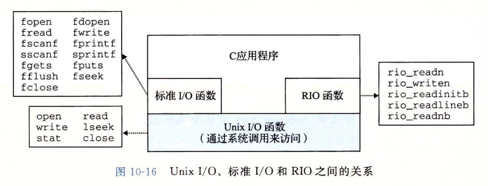

只要有可能就使用标准 I/O，对网络套接字的 I/O 使用 RIO 函数。不要使用 scanf 或 rio_readlineb 来读取二进制文件。

## 第11章 网络编程

- `nslookup`可以用于查询域名信息，如 `nslookup google.com`
- 当客户端发起一个连接请求时，客户端套接字地址中的端口是由内核自动分配的临时端口。
- Linux 文件`/etc/services` 包含一张知名协议与对应端口间的映射表

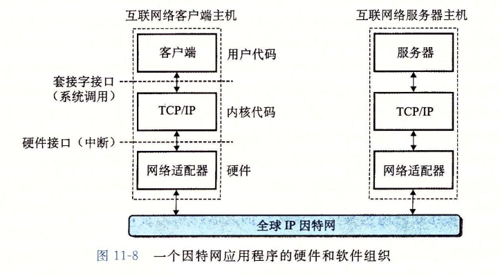

- EOF 是由内核检测到的一种条件。应用程序在它接收到一个由 read 函数返回的零返回码时，它就会发现出 EOF 条件。对于磁盘文件，当前文件位置超出文件长度时，会发生 EOF。对于因特网连接，_当一个进程关闭连接它的那一端时，会发生 EOF_。连接另一端的进程在试图读取流中最后一个字节之后的字节时，会检测到 EOF。

### 端序

 ](imgs/endianness.png)

@[大端序与小端序](https://www.notion.so/76162a602ba947c781dbf013e3da80ea?pvs=21)

- 将一个多位数的低位放在较小的地址处，高位放在较大的地址处，则称 **小端序**；反之则称 **大端序**。
- 在网络应用中，字节序是一个必须被考虑的因素，因为不同机器类型可能采用不同标准的字节序，所以均按照网络标准转化。 **网络传输一般采用大端序**，IP 协议中定义大端序为网络字节序。htonl，htons 用于本机序转换到网络序；ntohl，ntohs 用于网络序转换到本机序。
- 如果需要逐位运算，或者需要到从个位数开始运算，都是小端序占优势。反之，如果运算只涉及到高位，或者数据的可读性比较重要，则是大端序占优势。([字节序探析：大端与小端的比较](https://www.ruanyifeng.com/blog/2022/06/endianness-analysis.html))

### CGI

- 在服务器接收到一个形如 `GET /cgi-bin/adder?15000&123 HTTP/1.1` 的请求后，它调用 fork 来创建一个子进程，并调用 execve 在子进程的上下文中执行`/cgi-bin/adder` 程序。在调用 `execve` 之前，子进程将 CGI 环境变量 `QUERY_STRING` 设置为`15000&123`，adder 程序在运行时可以用 `Linux getenv`函数来引用它。
- CGI 中定义了大量的环境变量，CGI 程序在运行时可设置这些环境变量。在 PHP 中的`$_SERVER`环境变量就是读取 CGI 的环境变量

    | 环境变量         | **描述**                  |
    | :--------------- | :------------------------ |
    | `QUERY_STRING`   | 程序参数                  |
    | `SERVER_PORT`    | 父进程监听端口            |
    | `REQUEST_METHOD` | GET 或 POST               |
    | `REMOTE_HOST`    | 客户端主机名或域名        |
    | `REMOTE_ADDR`    | 客户端 IP                 |
    | `CONTENT_TYPE`   | POST 中的请求体 MIME 类型 |
    | `CONTENT_LENGTH` | POST 中的请求体字节大小   |

- 在子进程加载并运行 CGI 程序前，它使用 Linux dup2 函数将标准输出重定向到客户端关联的已连接描述符。因此，任何 CGI 程序写到标准输出的东西都会直接到达客户端。

## 第12章 并发编程

现代操作系统提供 3 种基本构造并发程序的方法：

1. 进程：
2. I/O 多路复用
3. 线程：运行在一个单一进程上下文中的逻辑流，由内核进行调度

### 进程

如图所示，假设服务器接受了客户端 1 的连接请求，并返回一个已连接描述符(connfd 4), 如图 12-1 所示。在接受连接请求之后，服务器fork一个子进程，这个子进程获得服务器描述符表的完整副本。 **子进程关闭它的副本中的监听描述符 3，** 而 **父进程关闭它的已连接描述符 4 的副本**，因为不再需要这些描述符了。这就得到了图 12-2 中的状态，其中子进程正忙着为客户端提供服务。

因为父子进程中的已连接描述符都指向同一个文件表表项，所以父进程关闭它的已连接描述符的副本是至关重要的。否则，将永不会释放已连接描述符 4 的文件表条目，而且由此引起的内存泄漏将最终消耗光可用的内存，使系统崩溃。

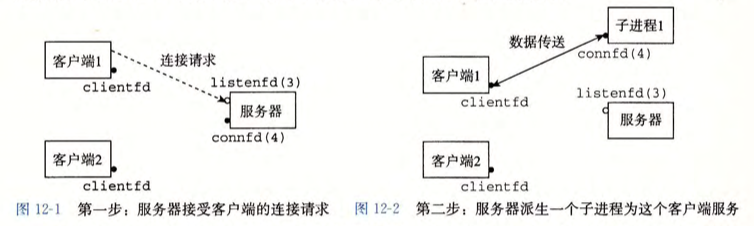
**每个 CPU 同一时刻只能处理一个进程** 线程与 I/O 多路复用均运行在进程中

进程的优劣：

- 优势：进程有独立的地址空间，因此进程不可能意外覆盖另一个进程的虚拟内存
- 劣势：独立的地址空间使进程共享信息变得困难，为了共享信息，它必须显式的使用 IPC（进程间通信）机制，但进程控制和 IPC 开销都很高

### I/O 多路复用

见 [I/O多路复用](https://www.notion.so/Linux-Unix-88e4c8dbb93645d1a08b91170f59ac77?pvs=21)

优点：

- 运行于进程中，共享数据简单
- 不需要进程那样的上下文切换来调度流

缺点：

- 编码复杂
- 无法充分利用多核 CPU

### 线程

多个线程运行在同一个进程的上下文中，每个线程都有自己的线程上下文，线程间共享进程虚拟地址空间的所有内容，但不共享寄存器。

每个进程开始声明周期时都是单一线程，该线程称为主线程（main thread）。在某一时刻，主线程创建一个对等线程 (peer thread)，从这个时间点开始，两个线程就并发地运行。最后，因为主线程执行一个慢速系统调用，例如 read 或者 sleep, 或者因为被系统的间隔计时器中断，控制就会通过上下文切换传递到对等线程。对等线程会执行一段时间，然后控制传递回主线程，依次类推。

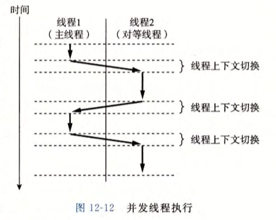{ align=right width=50% }

一个线程可以杀死它的任何对等线程，或者等待它的任意对等线程终止。另外，每个对等线程都能读写相同的共享数据。

**线程是调度的基本单位，进程则是资源拥有的基本单位。**

线程是抢占式多任务，协程则是协作式多任务，协程间切换不涉及任何系统调用或阻塞调用，因此更加轻量。

终止线程：

- 当顶层的线程例程返回时，线程会隐式地终止 。
- 通过调用 pthread_exit 函数，线程会显式地终止 。如果主线程调用 pthread_exit，它会等待所有其他对等线程终止，然后再终止主线程和整个进程，返回值为thread_return。
- 某个对等线程调用 Linux 的 exit 函数，该函数终止进程以及所有与该进程相关的线程 。
- 另一个对等线程通过以当前线程 ID 作为参数调用 pthread_cancel 函数来终止当前线程。

在任何一个时间点上，线程是可结合的 (joinable)或者是分离的 (detached) 。一个可结合的线程能够被其他线程收回和杀死 。 在被其他线程回收之前，它的内存资源(例如栈)是不释放的。相反，一个分离的线程是不能被其他线程回收或杀死的。它的内存资源在它终止时由系统自动释放。默认情况下，线程被创建成可结合的。为了避免内存泄漏，每个可结合线程都应该要么被其他线程显式地收回，要么通过调用 pthread_detach 函数被分离。

在并行编程中，同步开销巨大，要尽可能避免。如果无可避免，必须要用尽可能多的有用计算弥补这个开销 。
**线程安全**：多个并发线程反复地调用时，一直产生正确的结果。

四种线程不安全函数：

1. 不保护共享变量的函数
2. 保持跨越多个调用的状态的函数
3. 返回指向静态变量的指针的函数
4. 调用线程不安全函数的函数

常见的线程不安全库函数：

| 线程不安全函数 | 线程不安全类 | Linux 线程安全版本 |
| --------------- | ------------ | ------------------ |
| rand            | 2            | rand_r             |
| strtok          | 2            | strtok_r           |
| asctime         | 3            | asctime_r          |
| ctime           | 3            | ctime_r            |
| gethostbyaddr   | 3            | gethostbyaddr_r    |
| gethostbyname   | 3            | gethostbyname_r    |
| inet_ntoa       | 3            | 无                 |
| localtime       | 3            | localtime_r        |

多线程的程序必须对任何可行的轨迹线都正确工作。

互斥锁加锁顺序规则：给定所有互斥操作的一个全序，如果每个线程都是以一种顺序获得互斥锁并以相反的顺序释放，那么这个程序就是无死锁的 。

#### **线程池**

线程过多会带来调度开销，进而影响缓存局部性和整体性能。而线程池维护着多个线程，等待着监督管理者分配可并发执行的任务。这避免了在处理短时间任务时创建与销毁线程的代价。线程池不仅能够保证内核的充分利用，还能防止过分调度。可用线程数量应该取决于可用的并发处理器、处理器内核、内存、网络 sockets 等的数量。 例如，线程数一般取 cpu 数量 + 2 比较合适，线程数过多会导致额外的线程切换开销。

#### 抢占式多任务与协作式多任务

协作式环境下，下一个进程被调度的前提是当前进程 **主动放弃** 时间片；抢占式环境下， **操作系统完全决定进程调度方案**，操作系统可以 **剥夺耗时长的进程的时间片**，提供给其它进程。
