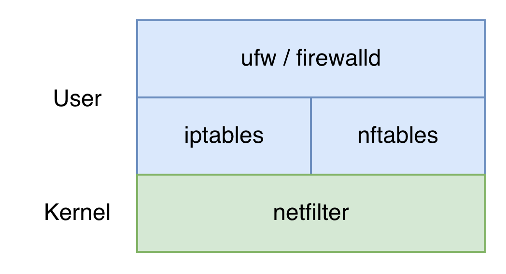

# 《鸟哥 Linux 服务器》

!!! abstract "阅读信息"

    - **评分**：⭐️⭐️⭐️⭐️⭐️
    - **时间**：
    - **读后感**：
    - **链接**：https://linux.vbird.org/linux_server/rocky9/

## 第7章 防火墙设置

防火墙就是通过设置规则，对进出主机的网络数据包进行过滤，比如丢弃数据包、修改数据包的改源/目的 IP 地址、转发数据包等。

就像 F5 和 Nginx 分别是硬件负载均衡和软件负载均衡的代表一样，防火墙也被分为硬件防火墙和软件防火墙，硬件防火墙就是专门的硬件设备，因此具有更好的性能；软件防火墙则是运行在操作系统上的软件，具有更好的灵活性。硬件防火墙以 Cisco、深信服等为代表，软件防火墙以 Linux 的 NetFilter 为代表。

{ align=right width=40% }
在 Linux 的网络安全体系中，功能实现分为清晰的层级：最底层是内核态的 **NetFilter** 框架，负责包过滤、NAT 和流量操控等核心能力；紧贴内核之上的是用于下发控制规则的基础用户态工具，包括历史悠久的 `iptables` 和现代化的 `nftables`；为了进一步降低运维门槛，各大发行版还在它们之上提供了同时兼容 iptables/nftables 的易用性封装，例如 RedHat 生态（CentOS、Fedora、Rocky Linux 等）的 `firewalld`，以及 Debian/Ubuntu 生态的 `ufw`（Uncomplicated Firewall）。

!!! warning "避免绕过高级管理工具"

    一旦在系统中启用了 `firewalld` 或 `ufw` 这样的高级管理工具，**切勿再手动使用 `iptables` 或 `nftables` 命令直接修改底层规则**。因为这些高级工具会强行接管内核的规则链，手动跨层级修改不仅极易引发逻辑链的冲突，且在高级工具重载配置（Reload）时，手动添加的底层规则都会被直接抹除。

### iptables

iptables 是用 NetFilter 的网络过滤功能构建的。如做下图所示，iptables 由 table（过滤表）和 chain（过滤链）组成：

- table（优先级依次降低）
    - Mangle：用于修改数据包的头部信息。它可以改变数据包的 TTL（Time to Live）、Type of Service（ToS）等字段，还可以标记数据包以供后续处理，这种处理能力在分布式服务中具有重要意义，比如在 Service Mesh 透明代理或 K8s 复杂网络策略中，常使用 Mangle 给特定流量打上标记（Mark），结合 ip rule 实现高级策略路由，或者使用 TPROXY 保留真实客户端 IP。
    - NAT：主要用于修改数据包的源 IP 地址和目标 IP 地址，以便实现端口转发、负载均衡等功能，比如在 `PREROUTING` 中做 `DNAT`(REDIRECT)，在 `POSTROUTING` 中做 `SNAT`(MASQUERADE)
    - Filter：主要用于实现防火墙规则，允许或拒绝特定的数据包通过系统中的每个网络接口，比如仅允许 80/443 等特定端口的访问，以及控制 curl/wget 等主动向外部发送数据包
- chain（依据流量处理顺序排序）
    - PREROUTING：在数据包进入路由决策之前进行处理，比如 DNAT 修改目标 IP 或端口
    - INPUT：用于处理目标地址是本机的数据包，控制入站流量
    - FORWARD：用于处理转发到其他主机的数据包，控制转发流量
    - OUTPUT：用于处理源地址是本机的数据包，控制出站流量
    - POSTROUTING：在数据包离开系统之前进行处理，比如 SNAT 修改源 IP 或端口

<div class="grid cards" markdown>
-  <figure>
    
    <figcaption>从 Table（功能块）视角：核心表都挂接在哪些包流转生命周期上</figcaption>
  </figure>
-  <figure>
    
    <figcaption>从数据包的 Chain（流转时间线）视角：每到达一个节点按什么优先级匹配功能表</figcaption>
  </figure>
</div>

如右上图所示，当一个数据包被 `iptables` 处理时，会依次经过 `PREROUTING`、`INPUT`、`FORWARD`、`OUTPUT`、`POSTROUTING` 这五个链，每到达一个链，在按照 table 中 `Mangle`、`NAT`、`Filter` 的优先级匹配过滤（即使表中一条规则都没有），这种 $O(n)$ 复杂度是其性能瓶颈。

语法规则：

```bash
iptables [-[ADI] INPUT] [-i lo|eth0|ens3] [-s IP/Netmask] [-d IP/Netmask] [-p tcp|udp [--sport ports] [--dport ports]] [-j ACCEPT|REJECT|DROP]
```

- `-t <table_name>`：指定操作的表（如 `filter`、`nat`、`mangle`），缺省状态下默认是 `filter` 表。
- `-A <chain_name>`：Append，表示在指定的链（如 `INPUT`、`POSTROUTING`）的**最后面**追加一条新规则。同理还有 `-I`（Insert，插入到规则的最前面）和 `-D`（Delete，删除该规则）。
- `-p <protocol>`：匹配特定协议类型，例如 `tcp`、`udp`、`icmp` 等。
- `-s` / `-d`：分别匹配源（Source）IP / 目标（Destination）IP 或网段。
- `--sport` / `--dport`：分别匹配源端口 / 目标端口（使用前通常必须配合 `-p` 指定具体协议）。
- `-i` / `-o`：分别匹配数据包流入的网卡接口（in-interface，如 `eth0`）和流出的网卡接口（out-interface）。
- `-j <target>`：Jump，决定当包被该规则匹配上之后的**最终动作**。常见的有 `ACCEPT`（放行）、`DROP`（直接丢弃报文）、`REJECT`（拒绝并返回一个错误包给发送方）、`SNAT` 以及 `DNAT` 等。

iptables 规则示例：

```bash
# 查看规则
iptables -L -v -n                 # 查看所有规则（-v 详细，-n 不解析 DNS）
iptables -L -v -n --line-numbers  # 带行号（用于按行号删除规则）
iptables -t nat -L -v -n          # 查看 NAT 表

# 默认策略（白名单模式）
iptables -P INPUT DROP            # 默认丢弃所有入站：未显式 ACCEPT 的包一律丢弃
iptables -P FORWARD DROP
iptables -P OUTPUT ACCEPT         # 默认允许所有出站

# 过滤拦截（Filter）
iptables -A INPUT -p tcp --dport 22 -j ACCEPT    # 放行 SSH
iptables -A INPUT -p tcp --dport 80 -j ACCEPT    # 放行 HTTP
iptables -A INPUT -p tcp --dport 443 -j ACCEPT   # 放行 HTTPS
iptables -A INPUT -p tcp --dport 3306 -j DROP    # 封锁 MySQL 端口（禁止外部直连）
iptables -A INPUT -s 1.2.3.4 -j DROP             # 封禁指定 IP

iptables -I INPUT 1 -p tcp --dport 8080 -j ACCEPT  # 插入到第一行（最高优先级），防止被全局 DROP 提前拦截

# NAT
iptables -t nat -A POSTROUTING -o eth0 -s 192.168.1.0/24 -j SNAT --to-source <eth0 IP>       # SNAT：将内网流量伪装成 eth0 的公网 IP 发出
iptables -t nat -A PREROUTING -p tcp --dport 80 -j DNAT --to-destination 192.168.1.100:8080  # DNAT：将外部 80 端口的流量映射到内网 192.168.1.100:8080

# 删除规则
iptables -D INPUT 3                             # 按行号删除（行号通过 --line-numbers 获取）
iptables -D INPUT -p tcp --dport 80 -j ACCEPT   # 按内容精确匹配删除
iptables -F                                     # 清空所有规则（危险！慎用）
```

### nftables

nftables 的结构：

```text
ruleset
 └── table
      └── chain
           └── rule
```

#### table

与 iptables 预设 table（`filter`、`nat`、`mangle`） 不同，nftables 所有的 table 都是用户自定义的。通过以下命令可以查看 nftables 的所有 table：

```bash
# 查看表
sudo nft list tables
```

以上命令将输出表头为 `table [family] [table_name]` 的表格，其中 `family` 源于 BSD Socket API，为每种网络协议都有其专属的地址家族，如 IPv4 使用 `AF_INET`。这个 `family` 决定了 table 能看到什么样的数据包，常见的 `family` 类型有：

- ip：对 IPv4 的数据包分析
- ip6：对 IPv6 的数据包分析
- inet：同时对 IPv4 和 IPv6 的数据包分析
- bridge：分析来自桥接的数据包
- arp：主要针对 IPv4 的 ARP 数据包做分析
- netdev：处理网卡驱动层面的数据包，在数据包进入路由决策之前进行处理

```bash
# 添加名为 mytable 的 table
sudo nft add table ip mytable
```

#### chain

如上文 iptables 的工作流图所示，iptables 强绑定了预设的 table 与 chain。相比之下，nftables 的设计更为轻量和灵活：所有的 table 和 chain 均由用户按需自定义。原来在 iptables 中由 `table` 决定的功能分类（如 `Filter`、`NAT`），在 nftables 中被抽象成了 `type` 关键字；原来由 `chain` 决定的挂载节点/数据包流向（如 `INPUT`、`PREROUTING`），则被提炼成了 `hook` 关键字。

在 nftables 中，chain 中的 rule 由 `{ type + hook + priority }` 构成：

- `Type`：决定链能干什么事。最常见的是 `filter`（过滤和打标记）、`nat`（地址转换）、`route`（修改包头并重新路由，类似 iptables 的 mangle）。

    | type   | family        | hook                                   | 说明                                                           |
    | :----- | :------------ | :------------------------------------- | :------------------------------------------------------------- |
    | filter | 适用所有格式  | 适用所有流向                           | 主要的标准链格式                                               |
    | nat    | ip, ip6, inet | prerouting, postrouting, input, output | 适用于进行 NAT 的功能！                                        |
    | route  | ip, ip6       | output                                 | 当封包的表头经过修改，经由路由过后，可通过这个链来进行后续分析 |

- `Hook`：即 iptables 中的 chain（`prerouting`, `input`, `forward`, `output`, `postrouting`）。
- `Priority`：数字越小越优先。优先级可以写成数字或文本形式，比如 `priority 0` 或 `priority filter`
  <table>
  <thead>
  <tr><th>优先级文本</th><th>代表的数值</th><th>适用的 IP 格式</th><th>数据包流向功能</th></tr>
  </thead>
  <tbody>
  <tr><td>raw</td><td>-300</td><td rowspan="3">ip, ip6, inet</td><td>all</td></tr>
  <tr><td>mangle</td><td>-150</td><td>all</td></tr>
  <tr><td rowspan="2">dstnat</td><td>-100</td><td>prerouting</td></tr>
  <tr><td>-300</td><td>bridge</td><td>prerouting</td></tr>
  <tr><td rowspan="2">filter</td><td>0</td><td>ip, ip6, inet, arp, netdev</td><td>all</td></tr>
  <tr><td>-100</td><td>bridge</td><td>all</td></tr>
  <tr><td>security</td><td>50</td><td>ip, ip6, inet</td><td>all</td></tr>
  <tr><td rowspan="2">srcnat</td><td>100</td><td>ip, ip6, inet</td><td>postrouting</td></tr>
  <tr><td>300</td><td>bridge</td><td>postrouting</td></tr>
  <tr><td>out</td><td>100</td><td>bridge</td><td>output</td></tr>
  </tbody>
  </table>

policy 就是数据包如何处理，主要有 `accept` 和 `drop`。**如果规则中缺省 policy，其默认行为是 `accept`**。在构建“白名单”防火墙时，通常需要显式将其设置为 `drop`。

---

创建链有两种方式：

=== "Shell 命令"

    > 该方式适用于调试或临时追加。由于命令中包含 `;` 等特殊字符，要么转义，要么单引号包裹。

    ```bash
    nft 'add chain [<family>] <table_name> <chain_name> { type <type> hook <hook> priority <value> ; [policy <policy> ;] [comment "text comment" ;] }'
    ```

=== "配置文件声明"

    在生产环境中，通常像 Nginx 一样，会在主配置文件 `/etc/nftables.conf` 中通过 `include` 指令，按业务模块加载独立的 `.nft` 规则文件（如 `include "/etc/nftables/web.nft"`）：

    ```bash
    table <family> <table_name> {
        chain <chain_name> {
            type <type> hook <hook> priority <value>;
            [policy <policy>;]
            [comment "text comment";]
        }
    }
    ```

!!! warning "与 docker 共存的注意事项"

    在没有使用 docker 时，`/etc/nftables.conf` 的首行应该显式声明 `flush ruleset`，以确保每次加载配置时不会被旧规则干扰；使用 docker 时，则不应该在主配置文件中声明 `flush ruleset`，这会导致 docker 规则被清空，进而容器无法正常通信，应该根据表名精确清理非 docker 表。

    如果在 nftables 中添加了 forward 链，则必须放行 docker 容器的流量，否则会导致 docker 容器无法正常工作。

**核心匹配关键字**

在 nftables 中，匹配数据包特征的关键字（Match Expressions）经过了高度的抽象，相较于 iptables 更加直观。

=== "匹配网卡"

    | 关键字                        | 全称                          | 作用                    | 说明南                                                                                                                                                                                                                                     |
    | :---------------------------- | :---------------------------- | :---------------------- | :----------------------------------------------------------------------------------------------------------------------------------------------------------------------------------------------------------------------------------------- |
    | **`iif`** / **`oif`**         | Input / Output Interface      | 匹配入站 / 出站网卡     | 底层索引匹配（极快）。<br>注意：该方式绑定网卡的底层硬件 ID，如果网卡是动态创建的（如 Docker 的 `veth`、VPN 的 `tun0`），一旦断线重连或容器重启，底层 ID 改变，该规则将直接失效。**只能用于永久存在的物理网卡（如 `lo` 或板载 `eth0`）**。 |
    | **`iifname`** / **`oifname`** | Input / Output Interface Name | 匹配入站 / 出站网卡名称 | 字符串匹配（灵活、安全）。<br>- 针对动态虚拟网卡完美生效，不论驱动如何重载只认名称字符串；<br>- 支持通配符：如 `iifname "eth*"`、`oifname "br-*"` 支持批量匹配。                                                                           |

=== "高阶匹配（Meta 与状态追踪）"

    | 关键字分类       | 关键字             | 用法示例                            | 核心作用                                                                                                                                                                                                                                 |
    | :--------------- | :----------------- | :---------------------------------- | :--------------------------------------------------------------------------------------------------------------------------------------------------------------------------------------------------------------------------------------- |
    | **数据包元标记** | **`meta l4proto`** | `meta l4proto { icmp, ipv6-icmp }`  | 专门在双栈 `inet`（同时囊括 v4 和 v6）表中跨维度同时匹配四层协议的神器。                                                                                                                                                                 |
    | **系统打标匹配** | **`meta mark`**    | `meta mark 1`                       | 匹配 Linux 系统给数据包打上的内部标记（Mark），常配合 `iproute2` 操控高级策略路由（双重分流）。                                                                                                                                          |
    | **连接追踪状态** | **`ct state`**     | `ct state { established, related }` | 基于内核级的强力连接追踪。<br>`new`: 全新发起的连接 <br>`established`: 已完成三次握手的合法数据包 <br>`related`: 由现有关联引发的辅助探测包（如 FTP 辅助端口、ICMP 报错返回） <br>`invalid`: 无效、残缺的恶意探测包（建议直接 `drop`）。 |

    > `iif` 或 `iifname` 的完整名称是 `meta iif` 和 `meta iifname`，只是使用很频繁，所以允许简写。

```bash
# 查看链
sudo nft list chains
table inet nftables_svc {
        chain allow {
        }
        chain INPUT {
                type filter hook input priority 20; policy accept;
        }
}
table ip mytable {
}
```

#### rule

nftables 规则示例：

```bash
# 新增 rule
nft add rule <family> <table_name> <chain_name> <rule>

# 查看规则
sudo nft list ruleset

# 列出所有的规则并显示 handle，以便根据 handle 删除
nft -a list ruleset

# 删除 rule，注意 handle 只在当前 chain 内唯一
nft delete rule <family> <table_name> <chain_name> handle <handle>

# 默认策略（优势：策略在链声明中静态绑定，不像 iptables 需要单独的 -P 命令）
nft 'add chain ip filter input { type filter hook input priority 0 ; policy drop ; }'

# 过滤规则（优势：内置集合 {} 支持 O(1) 哈希匹配）
nft add rule ip filter input tcp dport { 22, 80, 443 } accept   # 这一条规则支持多个端口（iptables 需要 3 条）
nft add rule ip filter input tcp dport 3306 drop
nft add rule ip filter input ip saddr { 1.1.1.1, 2.2.2.2 } drop # 使用 O(1) 哈希查找屏蔽多个 IP

# NAT（优势：masquerade 自动检测出站 IP，无需像 iptables SNAT 那样硬编码 --to-source）
nft add rule ip nat postrouting oifname "eth0" ip saddr 192.168.1.0/24 masquerade  # SNAT
nft add rule ip nat prerouting tcp dport 80 dnat to 192.168.1.100:8080             # DNAT

# 删除规则（优势：强制基于 handle 删除，避免了 iptables 行号漂移的 bug）
nft -a list ruleset                       # 先通过 handle 找到规则
nft delete rule ip filter input handle 5  # 通过 handle 精确删除（例如 handle 5）
```

nftables（Netfilter Tables）作为取代 iptables 的现代工具，具有以下优势：

- 性能更高：与 iptables 相比，nftables 因使用哈希表来匹配规则，在处理大量规则时性能更好
- 更简洁的语法：nftables 引入了一种新的配置语言，使配置规则更加直观和易读
- 更强大的匹配和过滤：nftables 提供了更多的匹配选项和过滤功能，以便更精确地控制网络流量
- 支持动态更新：nftables 可以动态地添加、修改和删除规则，而无需重新加载整个防火墙配置（iptables 即使只更新一条规则，也必须加锁把所有规则拷贝到用户态，修改后再写回内核态覆盖，在分布式服务中这中差异会被无限放大）

!!! info "防火墙也能兼职做软路由"

    结合 NetFilter 强大的包过滤（Filter）与地址转换（NAT）能力，再配合 Linux 内核原生的 IP 转发（IP Forwarding）机制，使得一台配置了防火墙策略的服务器，在拓扑逻辑上完全可以充当一台功能完备的“软件路由器”。
