# 《Linux/Unix 系统编程手册》

!!! abstract "阅读信息"

    - **评分**：⭐️⭐️⭐️⭐️
    - **时间**：11/17/2021 → 11/30/2021
    - **读后感**：学习操作系统非常经典的书籍，强烈推荐！

## 第1章 历史和标准

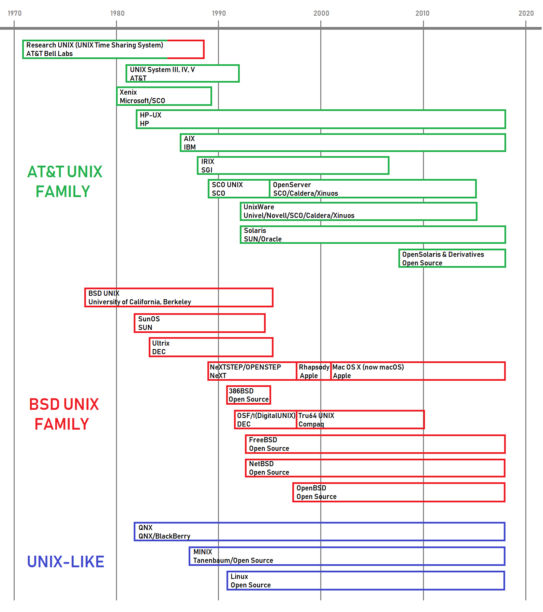

Unix 发展时间轴

GNU 的成果：GPL、Emacs、gcc、glibc、gdb

POSIX（Portable Operating System Interface，可移植操作系统）

SUS（Single UNIX Specification，单一 Unix 规范），扩充了 POSIX 标准，定义了标准 Unix 操作系统。

## 第2章 基本概念

与其它 Unix 系统一样，Linux 属于抢占式多任务操作系统。

进程的当前工作目录继承自其父进程。

伪终端：通过 Telnet、ssh 等工具在不同主机间通过 IPC 的方式交互的终端，因为操作的不是本地，所以被称为伪终端。

## 第6、24~26、37、43、44 章 进程

- PID 的分配机制则因系统而异，一般从 0 开始，init 进程号为 1，然后顺序分配，直到达到一个最大值（`/proc/sys/kernel/pid_max`记录 PID 的最大值），而后又从 300 开始重新分配（低数值 PID 被系统进程和守护进程长期占用，300 内搜索效率太低）。在分配 PID 时，若遇到已分配的 PID，则直接跳过，继续递增查找下一个可分配 PID。
- **系统的所有进程不是由 init fork，就是由其后代进程创建**。init 进程的进程号总为 1，且总以超级用户权限运行。**谁(即使是超级用户)都无法“杀死”init 进程**，只有关闭系统才能终止该进程。
- init 进程会接管所有的孤儿进程，**通过 `getppid()`返回值是否为 1 可以判断子进程是否为孤儿进程**
- 进程的终止分为正常和异常两种。异常终止可能是某些信号引起的，某些信号还可能导致进程产生一个 core dump 文件。调用 `exit()`可以正常终止一个进程，这将会引发经由 `atexit()` 和 `on_exit()`注册的退出处理程序（执行顺序与注册顺序相反），同时刷新 stdio 缓冲区。
- 如果父进程创建了某一子进程，但并未执行 wait()，那么在内核的进程表中将为该子进程永久保留一条记录。如果存在大量此类僵尸进程，它们势必将填内核进程表，从而阻碍新进程的创建。既然无法用信号杀死僵尸进程，那么**从系统中将其移除的唯一方法就是杀掉它们的父进程（或等待其父进程终止），此时 init 进程将接管和等待这些僵尸进程，从而从系统中将它们清理掉**。
- 程序可通过调用 system()函数来执行任意的 shell 命令，使用 system()运行命令需要创建至少两个进程。一个用于运行 shell，另一个或多个则用于 shell 所执行的命令
- 脚本的起始行(以`#!`开头)指定了解释器的路径名，以供识别解释器使用。
- 进程间相互隔离，进程 A 崩溃了完全不会影响到进程 B，所以**现在很多浏览器都采用多进程的方式来实现，打开一个网页对应 fork 一个进程来执行**

### 进程的内存布局

每个进程所分配的内存由很多部分组成，通常称之为“段(segment)”。

- fork：创建子进程
- exit：终止子进程。子进程的终止属于异步事件，父进程无法预知子进程何时终止（因为子进程即便收到 SIGKILL 信号，也要等待下次的 CPU 调用），在子进程终止时，系统会向其父进程发送 SIGCHLD 信号。
- wait：等待子进程终止。父进程调用 wait 获取子进程退出状态后，内核删除僵尸进程（调用前子进程处于僵尸进程）
- execve：加载可执行程序

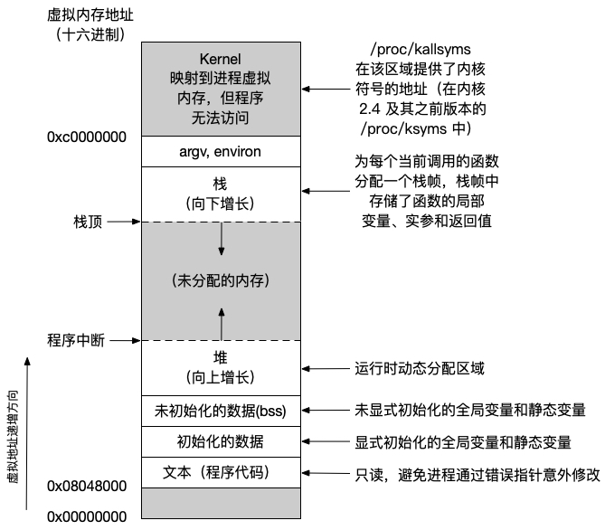

图片来自OmniGraffle

### 进程间通信

- 进程间(IPC, Inter Process Communication)通信方式如右图：
- 由于通信无需系统调用以及用户内存和内核内存之间的数据传输，因此共享内存的速度非常快。
- 信号量：由内核维护的一个整数，其值永远不会小于 0
- Linux 通过 flock()和 fcntl()系统调用来提供文件加锁工具。
- 管道、FIFO 以及 socket 是使用 fd 来实现的，因此这些 IPC 都支持 I/O 多路复用
- socket 也是进程间通信的一种方式，它有两个主要的应用场景：
  1. 本机间不同进程的通信，如 Nginx 与 php-fpm 的通信，MySQL 的通信等
  2. 不同主机间的进程间通信，即通过 TCP/IP 网络的方式通信

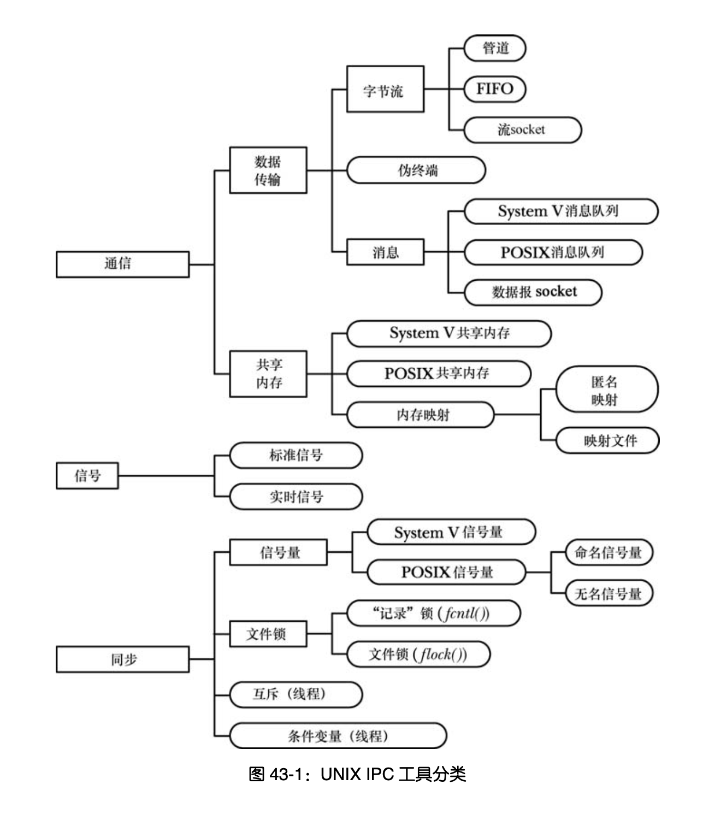

持久性是指一个 IPC 工具的生命周期，有以下三种：

- 进程持久性：只要存在一个进程持有进程持久的 IPC 对象，那么该对象的生命周期就不会终止。如果所有进程都关闭了对象，那么与该对象的所有内核资源都会被释放，所有未读取的数据会被销毁。管道、FIFO 以及 socket 是进程持久的 IPC 工具。
- 内核持久性：只有当显式地删除内核持久的 IPC 对象或系统关闭时，该对象才会销毁。
- 文件系统持久性：具备文件系统持久性的 IPC 对象会在系统重启的时候保持其中的信息，这种对象一直存在直至被显式地删除。唯一一种具备文件系统持久性的 IPC 对象是基于内存映射文件的共享内存。

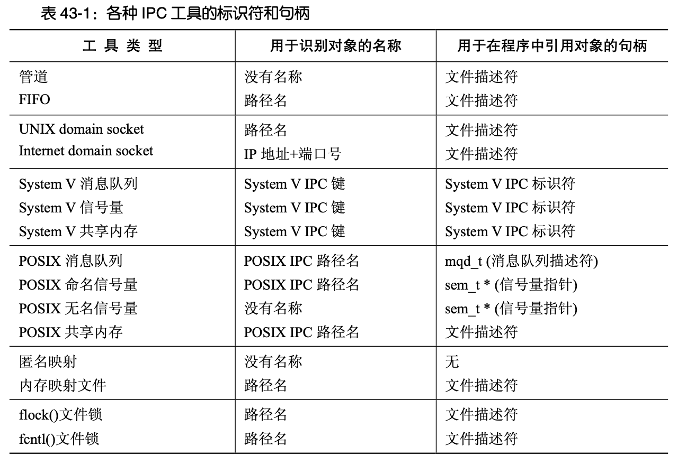

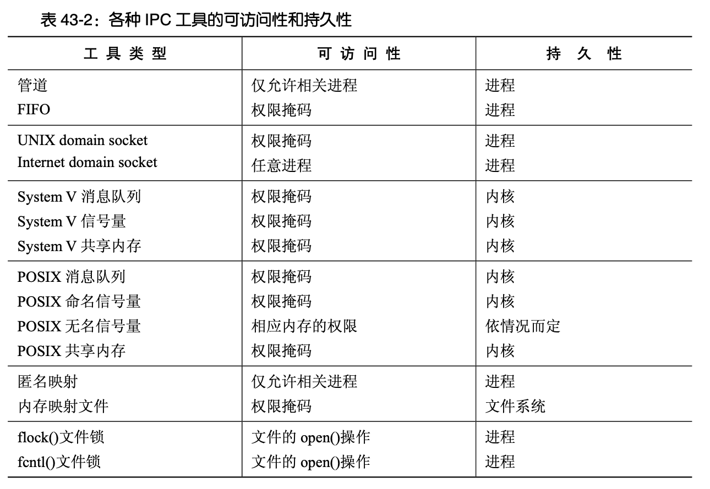

### 守护进程

守护进程是长时间运行并没有控制终端的进程。

### 进程优先级

**在单核 CPU 中**，默认的内核调度算法采用的是循环时间分享策略。默认情况下，此策略下的所有进程都能平等地使用 CPU，但**可以通过设置 nice 值来对优先级设置权重**，nice 值低的进程也会得到 CPU 时间，但所使用的 CPU 时间会变少。

**在多核 CPU 中**，进程可能在一个 CPU 0 执行后，由于 CPU0 处于忙碌状态而被 CPU1 执行，这将导致**进程的 CPU 切换**，在切换 CPU 时，由于 CPU1 中无 CPU0 缓冲区中的数据，导致性能下降。**CPU 亲和力可以在条件允许时让进程重新被调度到原来的 CPU 上运行。**

### 进程资源

`/proc/PID/limits` 能查看到所有进程的资源限制。`ulimit` 可以设置进程的资源。

## 第8章 用户和组

## 第20章 信号

## 第29~33章 线程

- **每个线程都拥有属于自己的栈，用来装载本地变量和函数调用链接信息**。线程间可通过共享的全局变量进行通信。
- 线程创建比进程要快 10 倍甚至更多，Linux 中通过调用 `clone()` 实现线程创建。
- 多线程编程中，需要确保线程安全，并尽量避免使用信号。
- 线程同步通过互斥量和条件变量来实现，互斥量提供了对共享变量的独占式访问。条件变量允许一个或多个线程等候通知：其他线程改变了共享变量的状态。
- 互斥量保证了对任意共享资源的原子访问。
- malloc 库函数的线程安全是通过使用互斥量来实现的。
- 在多线程应用中，保障非线程安全函数安全的手段之一是运用互斥锁来防护对该函数的所有调用。这种方法带来了并发性能的下降，因为同一时点只能有一个线程运行该函数。提升并发性能的另一方法是：仅在函数中操作共享变量（临界区）的代码前后加入互斥锁。
- 死锁的四个条件：
  - 禁止抢占（no preemption）：系统资源不能被强制从一个进程中退出。
  - 持有和等待（hold and wait）：一个进程可以在等待时持有系统资源。
  - 互斥（mutual exclusion）：资源只能同时分配给一个行程，无法多个行程共享。
  - 循环等待（circular waiting）：一系列进程互相持有其他进程所需要的资源。
- **死锁**：进程相互等待对方释放资源。比如：两人互不相让，都在等对方先让开。**可以通过结束其中一个进程来解决死锁**。
- **活锁**：进程彼此释放资源又同时占用对方资源。当此情况持续发生时，尽管资源的状态不断改变，但每个行程都无法获取所需资源，使得事情没有任何进展。比如：两人互相礼让，却恰巧站到同一侧，再次让开，又站到同一侧，同样的情况不断重复下去导致双方都无法通过。

## 第44章 管道和 FIFO

## 第55章 文件加锁

## 第 56~61 章 SOCKET

[分层协议](https://www.notion.so/87173f9e936a4267a39d54ea85ea3e21?pvs=21)如此强大和灵活的其中一个原因是**透明**——每一个协议层都对上层隐藏下层的操作和复杂性，如一个使用 TCP 的应用程序值需要使用标准的是 socket API 并清楚自己正在使用意向可靠的字节流传输服务，而无需理解TCP 操作的细节。

#### IPv4

一个 IP 地址包含两个部分：一个是网络 ID，它指定了主机所属的网络；另一个是主机 ID，它标识出了位于该网络中的主机。

`204.152.189.0/24` 的 `/24` 表示分配的地址的网络 ID 由最左边的 24 位构成，剩余的 8 位用于指定主机 ID。或者在这种情况下也可以说网络掩码的点分十进制标记是 `255.255.255.0`。

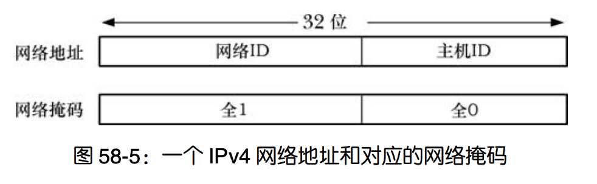

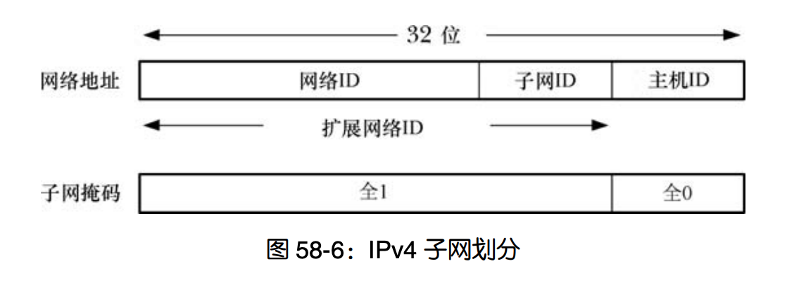

如果希望组织内的所有主机处于不同的网络中，可将进行子网划分。如将`204.152.189.0/24` 的主机 ID 中的 4 位用于表示子网，此时的子网则表示为`204.152.189.0/28`

#### IPv6

IPv6 也像 IPv4 地址那样提供了环回地址（127 个 0 后面跟着一个 1，即`::1`）和通配地址（所有都为 0，可以书写成 `0::0` 或`::`）。

为允许 IPv6 应用程序与只支持 IPv4 的主机进行通信，IPv6 提供了所谓的 IPv4 映射的 IPv6地址，在书写 IPv4 映射的 IPv6 地址时，地址的 IPv4 部分（即最后 4 个字节）会被书写成 IPv4的点分十进制标记。因此与 204.152.189.116 等价的 IPv4 映射的 IPv6 地址是`::FFFF:204.152.189.116`。

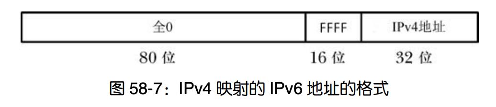

#### 端口号

端口号由 IANA（中央授权机构互联网号码分配局）分配，范围在 0~1023 为特权端口，49152~65535 位动态或私有端口，这些端口供本地程序使用或作为临时端口分配，Linux 中通过 `/proc/sys/net/ipv4/ip_local_port_range` 定义动态端口范围。

**如果在 socket 建立时没有调用 bind() 将 socket 绑定到特定的端口上，TCP/UDP 则会为该 socket 分配一个临时端口。**

#### TCP

慢启动和拥塞避免算法组合起来使得发送者可以快速地将传输速度提升至网络的可用容量，并且不会超出该容量。

当服务器经历高并发请求时，只有少量的连接处于活跃状态，大量不活跃的连接仍然会占用内核进程表中的槽位，而且也会占用内存和交换空间，从而降低了系统负载。守护进程 inetd 可以监视多个socket，并启动合适的服务器进程作为 TCP/UDP 连接的响应，通过 inetd，可以将运行在系统上的网络服务进程数量降到最小，从而降低系统的整体负载。

netstat 中，Recv-Q 表示 socket 接收缓冲区中还未被读取的字节数，Send-Q 则表示发送缓冲区中还未发送的字节数；Local Address 的主机*表示通配 IP 地址；Foreign Address `*:\*` 表示没有对端地址。

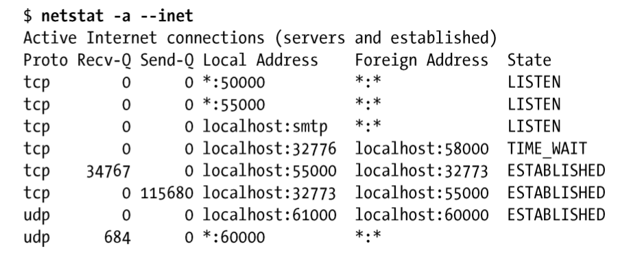

零拷贝传输(zero-copy tranfer)：在使用 **sendfile()** 时，文件内容会直接传送到 socket 上，而不会经过用户空间。

## 第62章 终端

## 第63章 I/O 多路复用

输入输出 (input/output) 的对象可以是文件 (file)， 网络 (socket)，进程之间的管道 (pipe)。在 Linux 系统中，都用文件描述符 (fd) 来表示。

### Unix 的 I/O 模型

| I/O 模型                          | 简介                                                                                     |
| --------------------------------- | ---------------------------------------------------------------------------------------- |
| 阻塞 I/O (blocking I/O)           | 导致请求进程阻塞，直到 I/O 操作完成                                                      |
| 非阻塞 I/O (nonblocking I/O)      | 不导致请求进程阻塞                                                                       |
| I/O 多路复用 (I/O multiplexing)   | select, poll, epoll 等。阻塞请求进程直到指定的多个描述符有状态变更                       |
| 信号驱动 I/O (signal-driven I/O)  | 使用信号让内核在描述符就绪时发送 SIGIO 信号通知我们                                      |
| 异步 I/O (asynchronous operation) | POXIS 的 aio\_ 系列函数。不会导致请求进程阻塞，请求提交后立即返回，在 I/O 操作完成后回调 |

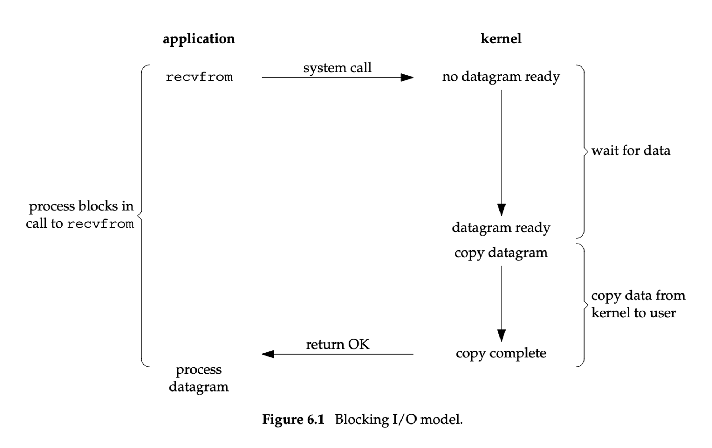

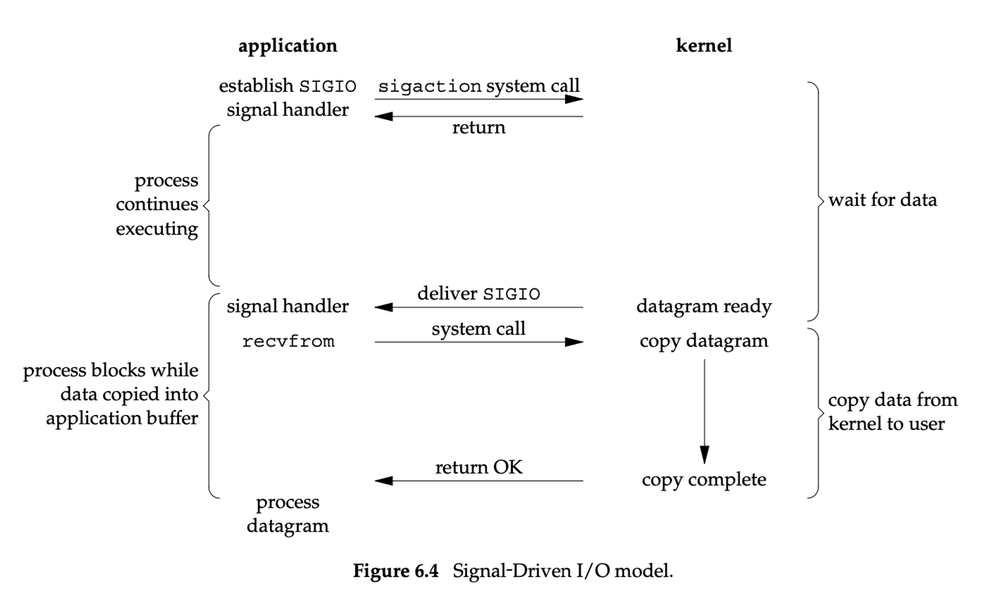

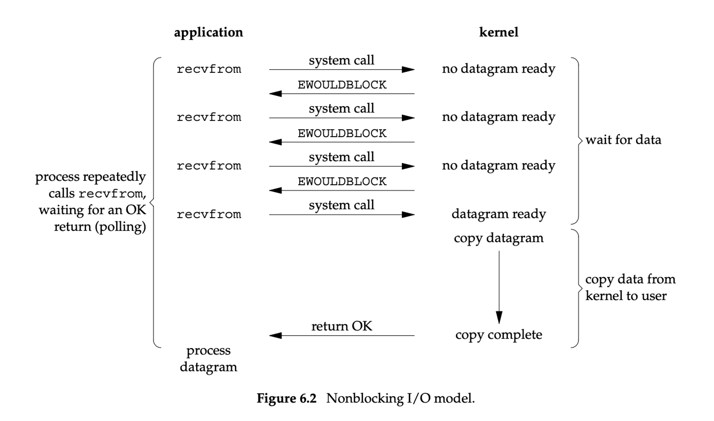

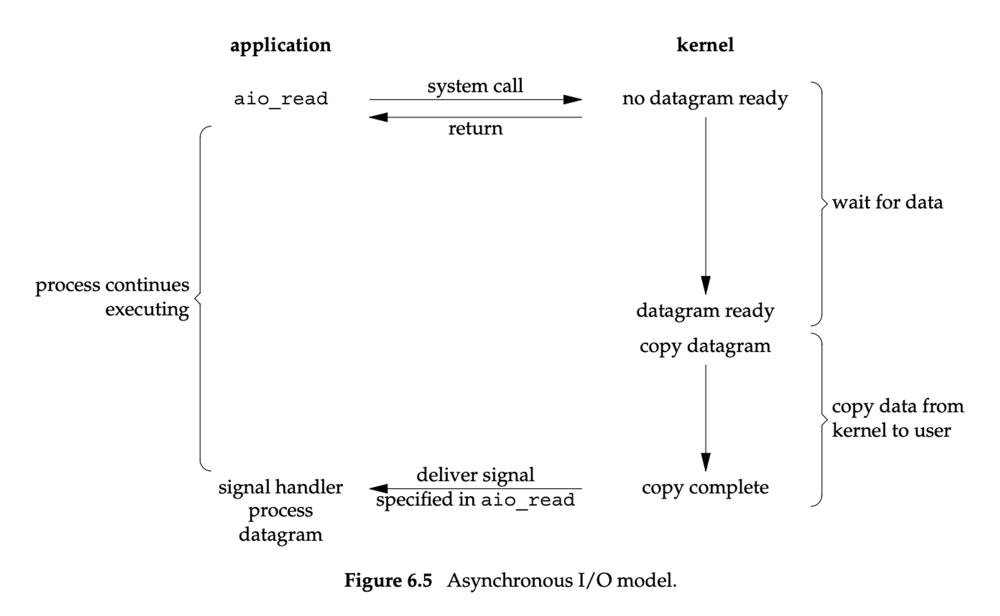

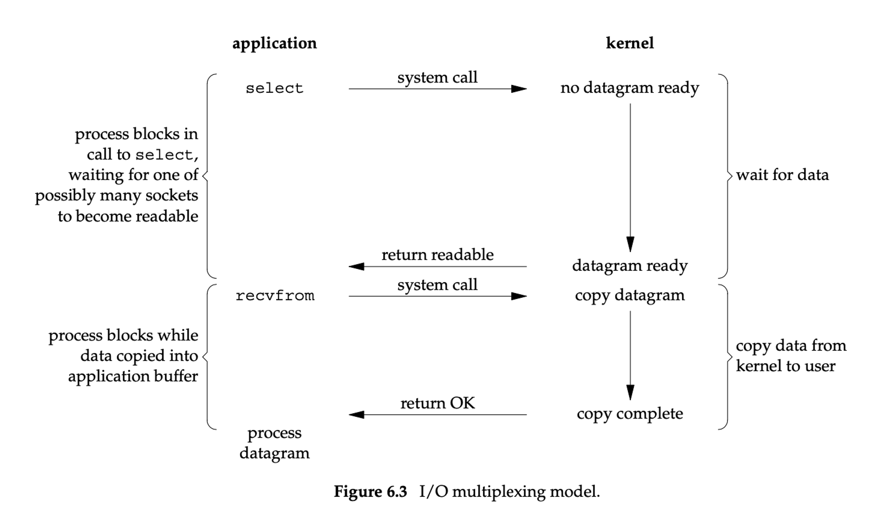

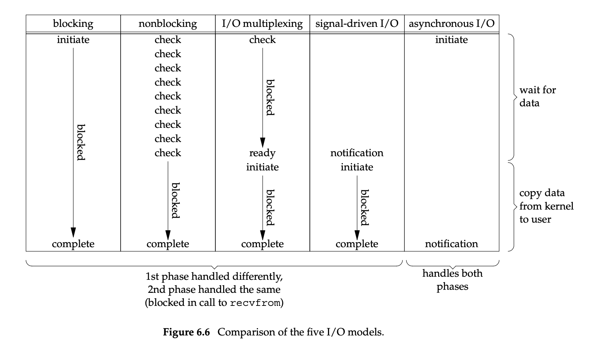

### I/O 多路复用

I/O 多路复用的本质，是通过一种机制（系统内核缓冲 I/O 数据），让单个进程可以监视多个文件描述符，一旦某个描述符就绪（一般是读就绪或写就绪），能够通知程序进行相应的读写操作。

由于非阻塞式 I/O 和多进（线）程都有各自的局限性，下列备选方案往往更可取。

- I/O 多路复用允许进程同时检查多个文件描述符以找出它们中的任何一个是否可执行 I/O 操作。系统调用 `select()`和 `poll()`用来执行 I/O 多路复用。
- 信号驱动 I/O 是指当有输入或者数据可以写到指定的文件描述符上时，内核向请求数据的进程发送一个信号。**进程可以处理其他的任务，当 I/O 操作可执行时通过接收内核信号来获得通知**。当同检查大量的文件描述符时，信号驱动 I/O 相比 select()和 poll()有显著的性能提升。
- epoll API 是 **Linux 专有的特性**，epoll API 允许进程同时检查多个文件描述符，看其中任意一个是否能执行 I/O 操作。

文件描述符就绪状态的转化是通过一些 I/O 事件来触发的，比如输入数据到达，套接字连接建立完成，或者是之前满载的套接字发送缓冲区在 TCP 将队列中的数据传送到对端之后有了剩余空间。

水平触发：如果文件描述符上**可以非阻塞地执行 I/O 系统调用**，此时认为它已经就绪。**如果不作任何操作，内核仍会继续通知**，所以，这种模式编程出错误可能性要小一点。epoll默认是水平触发。

边缘触发：如果文件描述符**自上次状态检查以来有了新的 I/O 活动**（比如新的输入），此时会触发通知，并且**不会再为那个文件描述符发送更多的就绪通知，直到下次有新的数据进来的时候才会再次出发就绪事件**。所以一旦进程被通知 I/O 就绪，我们应该尽可能多地执行 I/O，**如果 IO 空间很大，你要花很多时间才能把它一次读完，这可能会导致饥饿**。举个例子，假设你在监听一个文件描述符列表，而某个文件描述符上有大量的输入（不间断的输入流），那么你在读完它的过程中就没空处理其他就绪的文件描述符。（因为边沿触发模式只会通知一次可读事件，所以你往往会想一次把它读完。）一种解决方案是，程序**维护一个就绪队列**，当 `epoll` 实例通知某文件描述符就绪时将它在就绪队列数据结构中标记为就绪，这样程序就会记得哪些文件描述符等待处理。时间片轮转调度（Round-Robin）循环处理就绪队列中就绪的文件描述符即可。

| I/O模式 | 触发方式 | 底层实现 | 最大连接数           | 优点       | 缺点                                                                                |
| ------- | -------- | -------- | -------------------- | ---------- | ----------------------------------------------------------------------------------- |
| select  | 水平触发 | 数组     | 1024(x86)或2048(x64) | 可移植性好 | 1. 因为采用遍历机制，随着 fd 数量级增大，性能急剧下降，尤其被检查的 fd 集合很稀疏时 |

2. **每次都要遍历并传递全部的并发 fd 到内核，而实际只有少量的 fd 有数据需要处理**，所以效率低下
3. 重复调用待检查的 fd，内核并不会在每次调用成功后记录
4. 有最大连接数限制 |
   | poll | 水平触发 | 链表 | 无上限 | 同 select | 同 select |
   | 信号驱动 | 边缘触发 | | | I/O 就绪后，内核向进程发送信号 | 1. 内核会记录成功调用的 fd 2.有多个I/O事件时，会有多个通知，而epoll会合并为一个 |
   | epoll | 水平触发，边缘触发 | 红黑树（搜索被监控的fd），链表（存储已经就绪的fd） | 无上限 | 1. 相比 select 和 poll 将 fd 拷入内核，再拷出内核遍历就绪的 fd 而言，epoll 通过 **mmap() 的用户和内核共享内存减少内核数据交换开销，并直接返回就绪的 fd**，因此能支持更高数量级的并发
5. 同时支持水平触发和边缘触发
6. epoll **没有最大并发连接的限制**，上限是最大可以打开文件的数目，一般来说这个数目和系统内存关系很大 ，具体数目可以 `cat /proc/sys/fs/file-max` 查看 | 1. Linux 专有
7. epoll适用于监听大量fd，但只有少量处于就绪状态；在连接数少并且连接都十分活跃的情况下，select 和 poll 的性能可能比 epoll 好，毕竟 epoll 的通知机制需要很多函数回调。
8. 需处理好惊群问题（当许多进程等待一个事件，事件发生后这些进程被唤醒，但只有一个进程能获得 CPU 执行权，其他进程又得被阻塞，这造成了严重的系统上下文切换代价） |

epoll 是 Linux 目前大规模网络并发程序开发的首选模型。在绝大多数情况下性能远超 select 和 poll。目前流行的高性能 web 服务器 Nginx 正式依赖于 epoll 提供的高效网络套接字轮询服务。但是，在并发连接不高的情况下，多线程 + 阻塞 I/O 方式可能性能更好。

既然 select，poll，epoll 都是 I/O 多路复用的具体的实现，之所以现在同时存在，其实他们也是不同历史时期的产物：

- select 出现是 1984 年在 BSD 里面实现的
- 14 年之后也就是 1997 年才实现了 poll，其实拖那么久也不是效率问题， 而是那个时代的硬件实在太弱，一台服务器处理 1 千多个链接简直就是神一样的存在了，select 很长段时间已经满足需求
- 2002，Davide Libenzi 实现了 epoll
