# 《性能之巅》

!!! abstract "阅读信息"

    - **评分**：⭐️⭐️⭐️⭐️⭐️
    - **时间**：11/30/2021 → 02/17/2022
    - **读后感**：本书主要学习 Linux 的性能分析工具的使用，如 top、vmstat、iostat 等，可结合极客时间的 [《Linux 性能优化实战》](https://time.geekbang.org/column/intro/140) 课程学习

### 🛠️ Linux 性能工具速查

=== "CPU"

    | 工具 | 功能说明 | 关键参数 |
    | :--- | :--- | :--- |
    | **top** | 综合显示系统负载、进程状态 | `P`(CPU排序), `1`(各核细分) |
    | **pidstat** | 统计进程/线程的资源使用 | `-u`(CPU), `-w`(上下文切换) |
    | **vmstat** | 系统全貌监控 | `r`(就绪队列), `us/sy/id`(CPU占比) |
    | **mpstat** | 多核 CPU 负载平衡分析 | `-P ALL`(查看所有核心负载) |
    | **perf** | 系统性能采样分析工具 | `record` (采集), `report` (分析) |
    | **uptime** | 秒看负载平均值 | 1min, 5min, 15min 负载 |

=== "内存"

    | 工具 | 功能说明 | 备注 |
    | :--- | :--- | :--- |
    | **free** | 系统整体内存快照 | `buff/cache` (缓存), `swap` (交换) |
    | **vmstat** | 监控虚拟内存交互 | `si`/`so` 较高说明内存压力过大 |
    | **pmap** | 进程详细内存映射 | 查看栈、堆、动态共享库分布 |
    | **memleak** | 实时探测内存泄露 | 需通过 BPF 机制追踪内存分配 |
    | **ps** | 内存占用 Top 进程查找 | `ps aux --sort=-%mem` |

=== "磁盘"

    | 工具 | 功能说明 | 关键指标 |
    | :--- | :--- | :--- |
    | **iostat** | 系统 I/O 利用率和延迟 | `%util` (利用率), `await` (延迟) |
    | **iotop** | 实时显示进程 I/O 读写 | `-o` (只显示忙碌进程) |
    | **df / du** | 磁盘容量与文件大小统计 | `-h` (易读), `-sh` (目录汇总) |
    | **lsof** | 查找进程打开的文件/网络项 | `lsof -p <pid>` |
    | **blktrace**| 块层请求详细追踪 | 诊断长尾延迟产生的具体环节 |

=== "网络"

    | 工具 | 功能说明 | 常用场景 |
    | :--- | :--- | :--- |
    | **ss / netstat** | 查看连接状态、路由、统计 | `ss -ntlp` (寻找监听进程) |
    | **tcpdump** | 网络抓包分析 | `tcpdump -i eth1 port 80` |
    | **iftop** | 网口流量实时排行榜 | 找出“偷走”带宽的远端 IP |
    | **nethogs** | 本地带宽占用进程排名 | “按需抓包”锁定占流进程 |
    | **dig / ping** | 网络可达性与 DNS 诊断 | `ping -c 4 google.com` |

=== "进程管理"

    | 工具 | 功能说明 | 备注 |
    | :--- | :--- | :--- |
    | **ps** | 进程全量静态快照 | `ps aux` / `ps -ef` |
    | **pstree** | 进程层级树状显示 | 查找父子进程衍生关系 |
    | **strace** | 跟踪系统调用过程 | 诊断进程卡死或报错的黑盒阶段 |
    | **pstack** | 正在运行进程的调用栈 | 直接打印线程栈状态 |

<div class="grid cards" markdown>
- <figure>
    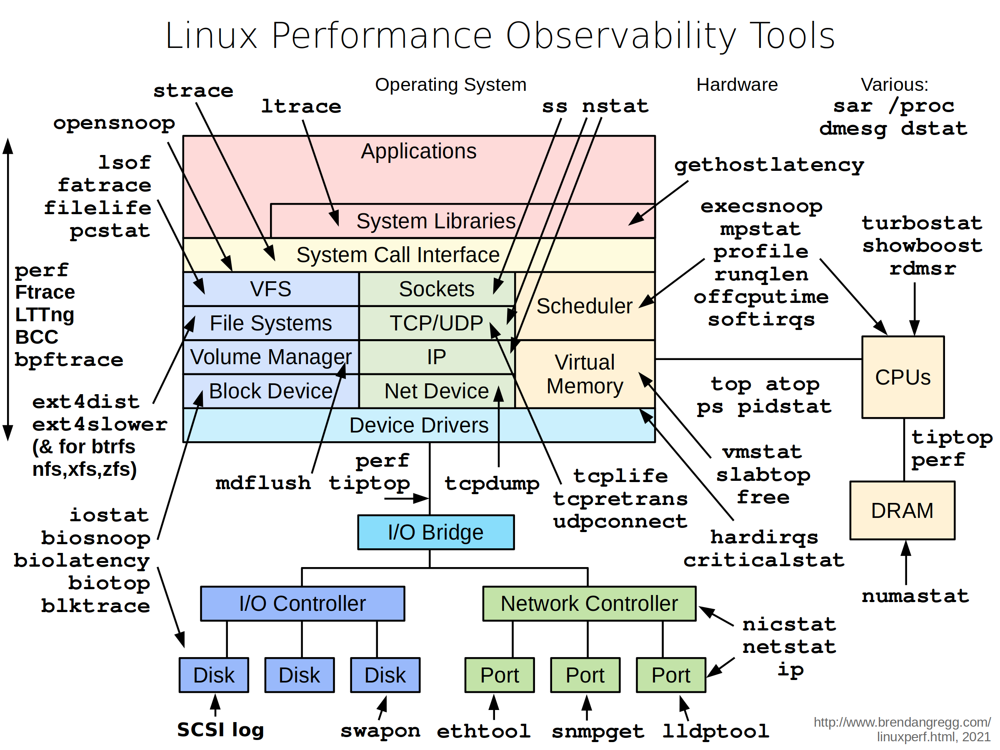
    <figcaption>Linux 下工具一览图</figcaption>
  </figure>
- <figure>
    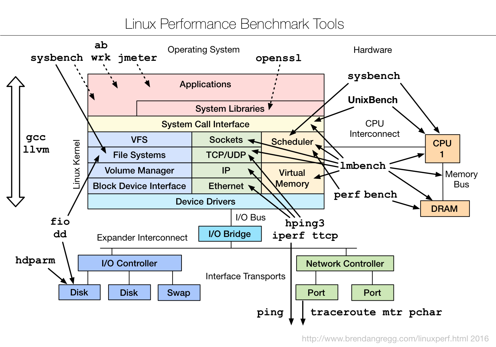
    <figcaption>BPF 性能剖析工具</figcaption>
  </figure>
</div>

<div class="grid cards" markdown>
- <figure>
    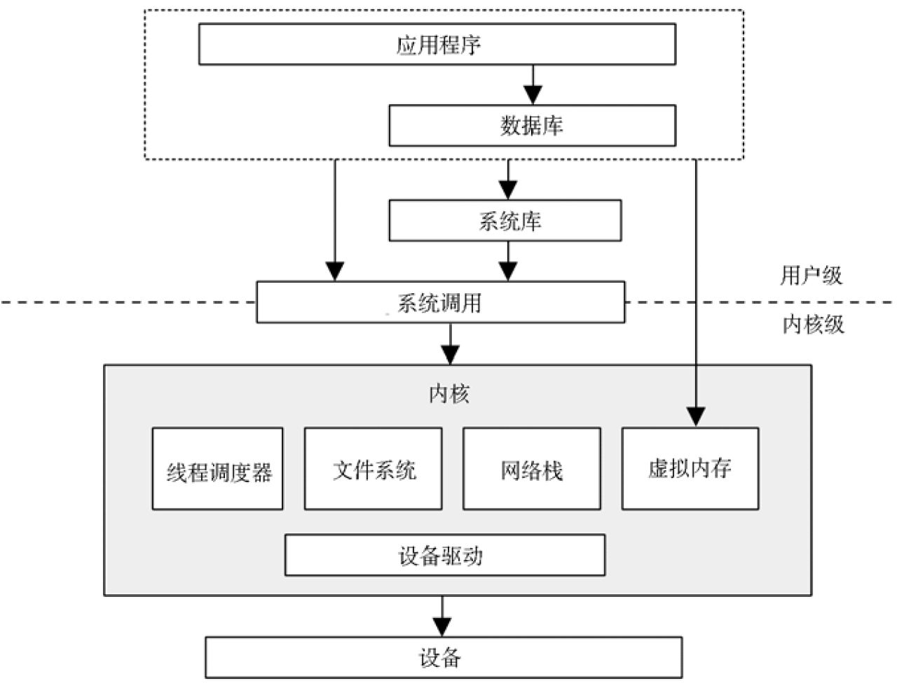
    <figcaption>通用系统软件栈</figcaption>
  </figure>
- <figure>
    
    <figcaption>不同层级的调优对象</figcaption>
  </figure>
- <figure>
    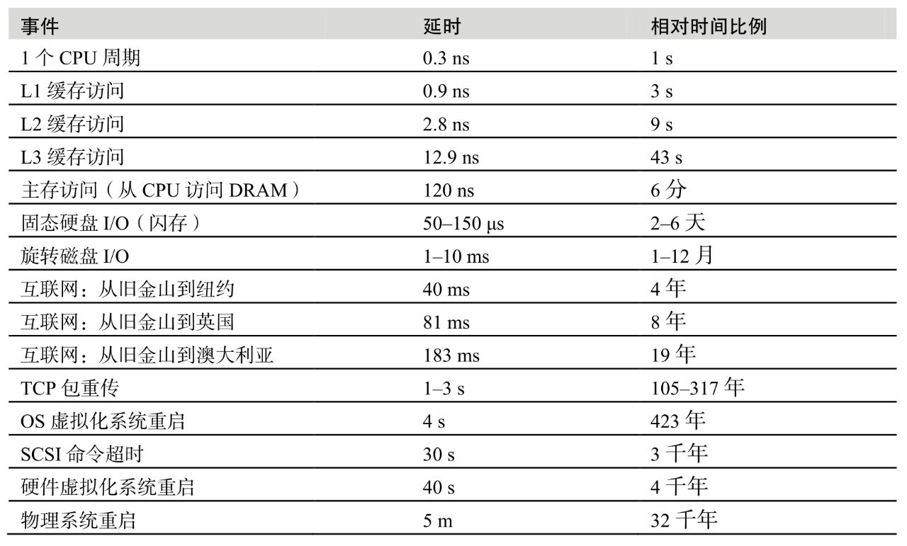
    <figcaption>各层级的延时可视化</figcaption>
  </figure>
- <figure>
    
    <figcaption>缓存命中率和性能</figcaption>
  </figure>
</div>

两个存储层级速度差异越大，曲线倾斜越陡峭。

描述缓存的效率不只是看命中率，同时也要看失效率，计算公式为：运行时间 = (命中率×命中延时) + (失效率×失效延时)

描述缓存状态的词：

- 冷：缓存是空的，或填充的是无用数据。冷缓存的命中率为 0
- 热： 填充的是常用的数据，并有很高的命中率
- 温：填充了有用的数据，但命中率还没有达到预想的高度
- 热度：提高缓存的热度就是提高缓存的命中率

如果资源不可用，应用程序开始返回错误（如 503），响应时间是直线变化的，而不是将工作任务排队。

## 第 3 章 操作系统

### 内核

CPU 竞争时，内核还要选择线程运行在哪颗 CPU 上，内核会选择硬件缓存更热或者对于进程内存本地性更好的 CPU，以显著地提升性能。

### 栈

**当函数被调用时，CPU 当前的寄存器组（保存 CPU 状态）会存放在栈里，在顶部会为线程的当前执行添加一个新的栈帧。函数通过调用 CPU 指令“return”终止执行，从而清除当前的栈，执行会返回到之前的栈，并恢复相应的状态**。

**栈检查是一个对于调试和性能分析非常宝贵的工具**。栈可以显示通往当前的执行状态的调用路径，这一点常常可以解释为什么某些事情会被执行。

### 中断

除了响应系统调用外，内核也要响应设备的服务请求，这称为中断，它会中断当前的执行。

对于 Linux 而言，设备驱动分为两半，上半部用于快速处理中断，到下半部的调度工作在之后处理。上半部快速处理中断是很重要的，因为上半部运行在中断禁止模式（interrupt-disabled mode），会推迟新中断的产生，如果运行的时间太长，就会造成延时问题。下半部可以作为 tasklet 或者工作队列，之后由内核做线程调度，如果需要也可休眠。如果有较多的工作要做，基于 Solaris 的系统会把中断放在中断线程里。

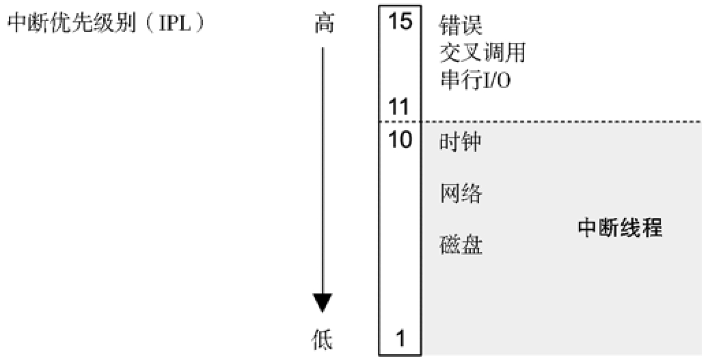{ align=right width=50% }

从中断开始到中断被服务之间的时间叫做中断延时（interrupt latency）。

中断优先级（interrupt priority level，IPL）表示的是当前活跃的中断服务程序的优先级。

串行 I/O 的中断优先级很高，这是因为硬件的缓冲通常很小，需要快速服务以避免溢出。

### 进程

进程是用以执行用户级别程序的环境。它包括内存地址空间、文件描述符、线程栈和寄存器。

一个进程中包含有一个或多个线程，操作在进程的地址空间内并且共享着一样的文件描述符（标示打开文件的状态）。线程是一个可执行的上下文，包括栈、寄存器，以及程序计数器。**多线程让单一进程可以在多个 CPU 上并发地执行**。

正常情况下进程是通过系统调用`fork()`来创建的。`fork()`用自己的进程号创建自身进程的一个复制，然后调用系统调用`exec()`才能开始执行不同的程序。

### 系统调用

**系统调用`fork()`可以用写时拷贝（copy-on-write，COW）的策略来提高性能**。这会添加原有地址空间的引用而非把所有内容都复制一遍。一旦任何进程要修改被引用的内存，就会针对修改建立一个独立的副本。这一策略推迟甚至消除了对内存拷贝的需要，从而减少了内存和 CPU 的使用。

<div class="grid cards" markdown>
- <figure>
    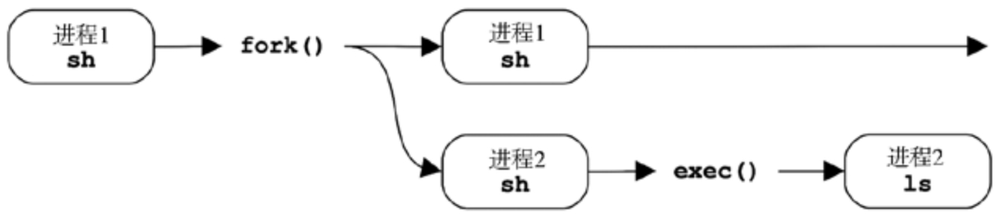
    <figcaption>进程创建</figcaption>
  </figure>
- <figure>
    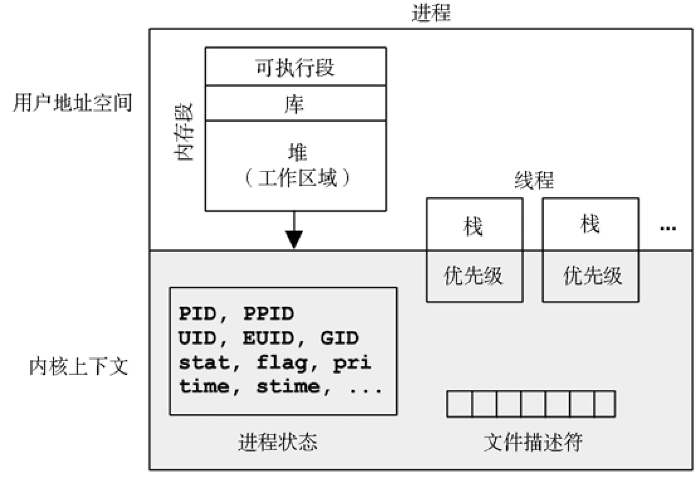
    <figcaption>进程环境</figcaption>
  </figure>
</div>

{ align=right width=45% }
on-proc 状态是指进程运行在处理器（CPU）上。ready-to-run 状态是指进程可以运行，但还在 CPU 的运行队列里等待 CPU。I/O 阻塞，让进程进入 sleep 状态直到 I/O 完成进程被唤醒。zombie 状态发生在进程终止，这时进程等待自己的进程状态被父进程读取，或者直至被内核清除。

<div style="clear: both;"></div>

文件描述符，指向的是打开的文件，这些文件为线程之间所共享（通常来说）。

相对于进程地址空间内核上下文的大小是很小的。

可用的系统调用数目是数百个，但需要努力确保这一数目尽可能地小，以保持内核简单（Unix 理念），更为复杂的接口应该作为系统库构建在用户空间中，在那里开发和维护更为容易。常用的关键系统调用如表所示：

| 系统调用 | 描述       | 系统调用  | 描述                     |
| -------- | ---------- | --------- | ------------------------ |
| read()   | 读取字节   | connect() | 连接到网络主机           |
| write()  | 写入字节   | accept()  | 接受连接                 |
| open()   | 打开文件   | stat()    | 获取文件统计信息         |
| close()  | 关闭文件   | ioctl()   | 设置 I/O 属性            |
| fork()   | 创建新进程 | mmap()    | 把文件映射到内存空间地址 |
| exec()   | 执行程序   | brk()     | 扩展堆指针               |

### 虚拟内存

当虚拟内存用二级存储作为主存的扩展时，**内核会尽力保持最活跃的数据在主存中**。有以下两个内核例程做这件事情。

- 交换：让整个进程在主存和二级存储之间做移动
- 换页：移动称为页的小的内存单元（例如，4KB）

swapping 是原始的 UNIX 方法，会引起严重的性能损耗。paging 是更高效的方法，经由换页虚拟内存的引入而加到了 BSD 中。两种方法，最近最少使用（或最近未使用）的内存被移动到二级存储，仅在需要时再次搬回主存。在 Linux 里，术语 swapping 用于指代 paging。Linux 内核是不支持（老的）UNIX 风格的整体线程和进程的 swapping 的。

**电脑的休眠即为 swap 的应用**，将当前正在运行的程序状态保存至硬盘中，待下次使用时直接从硬盘加载到内存即可快速恢复到之前的工作状态。

如果服务器内存足够大，可以禁用 swap

### 调度器

**调度器基本的意图是将 CPU 时间划分给活跃的进程和线程**，而且维护一套优先级的机制，这样更重要的工作可以更快地执行。调度器会跟踪所有处于 ready-to-run 状态的线程，传统意义上每一个优先级队列都称为运行队列。现代内核会为每个 CPU 实现这些队列，也可以用除了队列以外的其他数据结构来跟踪线程。

**CPU 密集型通常运行时间较长，受到 CPU 资源的限制；I/O 密集型需要低延时响应，受到存储 I/O 或网络资源的限制**。调度器能够识别 CPU 密集型的进程并降低它们的优先级，可以让 I/O 密集型工作负载（需要低延时响应）更快地运行。

虚拟文件系统（virtual file system，VFS）是一个对文件系统类型做抽象的内核界面，VFS 接口让内核添加新的文件系统时更加简单。VFS 主要提供了两个功能：

1. 通过简单的 `read()`、`open()`等函数调用即可屏蔽底层 ext4 和 btrfs 的不同
2. 给文件系统和应用程序的 IO 请求排队，通过重新排序、请求合并等提高磁盘读写效率

<div class="grid cards" markdown>
- <figure>
    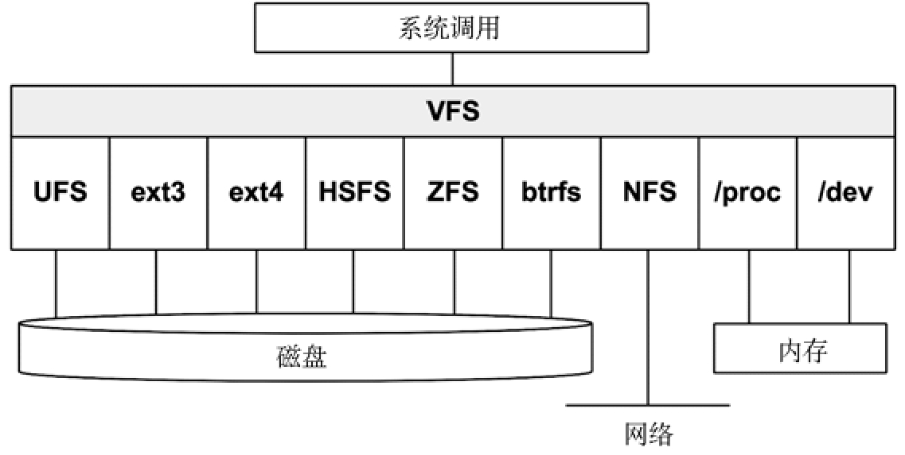
    <figcaption>虚拟文件系统</figcaption>
  </figure>
- <figure>
    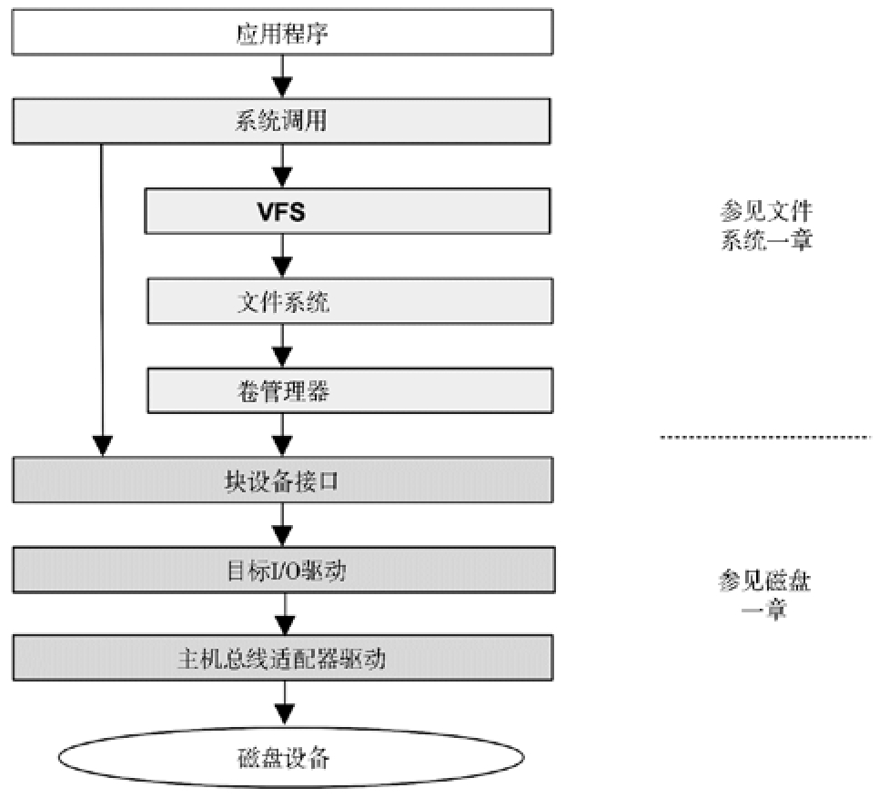
    <figcaption>一般的 I/O 栈</figcaption>
  </figure>
</div>

### 其它

Dtrace 是一套静态和动态跟踪的框架和工具，可以对整个软件栈做近乎无限的观测，实时并且可以应用于生产环境。随 Solaris 10 在 2005 年发布，DTrace 是第一次动态跟踪的广泛成功实现，已经移植到了其他操作系统，包括 Mac OS X 和 FreeBSD。

DynTicks，动态的 tick，当不需要时（tickless），内核定时中断不会触发，这样可以节省 CPU 的资源和电力。

perf 是一套性能观测工具，包括 CPU 性能计数器剖析、静态和动态跟踪。

KVM （Kernel-based Virtual Machine，基于内核的虚拟机）

## 第 4 章 观测工具

<figure markdown>
  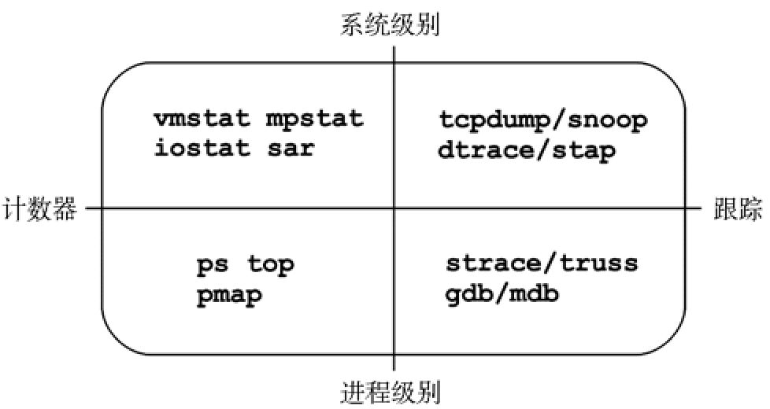{ width=50% }
</figure>

### 计数器

内核维护了各种统计数据，称为计数器，用于对事件计数。计数器的使用可以认为是“零开销”的，因为它们默认就是开启的，而且始终由内核维护。唯一的使用开销是从用户空间读取它们的时候（可以忽略不计）。

下面这些工具利用内核的计数器在系统软硬件的环境中检查系统级别的活动。这些工具通常是系统全体用户可见的（非 root 用户）。这些工具有一个使用惯例，即可选时间间隔和次数，如`vmstat 1 3`表示以 1 秒为间隔，输出 3 次

- vmstat：虚拟内存和物理内存的统计，系统级别。
- mpstat：每个 CPU 的使用情况。
- iostat：每个磁盘 I/O 的使用情况，由块设备接口报告。
- netstat：网络接口的统计，TCP/IP 栈的统计，以及每个连接的一些统计信息。
- sar：各种各样的统计，能归档历史数据。

下面这些工具是以进程为导向的，使用的是内核为每个进程维护的计数器。一般来说，这些工具是从`/proc`文件系统里读取统计信息的

- ps：进程状态，显示进程的各种统计信息，包括内存和 CPU 的使用。
- top：按一个统计数据（如 CPU 使用）排序，显示排名高的进程。基于 Solaris 的系统对应的工具是 prstat(1M)。
- pmap：将进程的内存段和使用统计一起列出。

### 跟踪

跟踪框架一般默认是不启用的，因为跟踪捕获数据会有 CPU 开销，另外还需要不小的存储空间来存放数据。这些开销会拖慢所跟踪的对象。

系统级别的跟踪工具：

- tcpdump：网络包跟踪（用 libpcap 库）。
- snoop：为基于 Solaris 的系统打造的网络包跟踪工具。
- blktrace：块 I/O 跟踪（Linux）。
- iosnoop：块 I/O 跟踪（基于 DTrace）。
- execsnoop：跟踪新进程（基于 DTrace）。
- dtruss：系统级别的系统调用缓冲跟踪（基于 DTrace）。
- DTrace：跟踪内核的内部活动和所有资源的使用情况（不仅仅是网络和块 I/O），支持静态和动态的跟踪。
- SystemTap：跟踪内核的内部活动和所有资源的使用情况，支持静态和动态的跟踪。
- perf：Linux 性能事件，跟踪静态和动态的探针。DTrace 和 SystemTap 都是可编程环境，在它们之上可以构建系统级别的跟踪工具

DTrace 和 SystemTap 都是可编程环境，在它们之上可以构建系统级别的跟踪工具

进程级别的跟踪工具：

- strace：基于 Linux 系统的系统调用跟踪。
- truss：基于 Solaris 系统的系统调用跟踪。
- gdb：源代码级别的调试器，广泛应用于 Linux 系统。
- mdb：Solaris 系统的一个具有可扩展性的调试器。

### 剖析

系统级别和进程级别：

- oprofile：Linux 系统剖析。
- perf：Linux 性能工具集，包含有剖析的子命令。
- DTrace：程序化剖析，基于时间的剖析用自身的 profile provider，基于硬件事件的剖析用 cpc provider。
- SystemTap：程序化剖析，基于时间的剖析用自身的 timer tapset，基于硬件事件的剖析用自身 perf tapset
- cachegrind：源自 valgrind 工具集，能对硬件缓存的使用做剖析，也能用 kcachegrind 做数据可视化。
- Intel VTune Amplifier XE：Linux 和 Windows 的剖析，拥有包括源代码浏览在内的图形界面。
- Oracle Solaris Studio：用自带的性能分析器对 Solaris 和 Linux 做剖析，拥有包括源代码浏览在内的图形界面。

### 监视

虽然 sar 可以报告很多的统计数据，但可能它并不能覆盖所有你真正想要的东西，有时还会有误导。

## 第 5 章 应用程序

性能调整离工作所执行的地方越近越好：最好再应用程序里。

先设定目标

- 延时： 如应用平均延时 5ms；超过 1s 的延时请求为 0；
- 吞吐量：每台服务器吞吐量至少 10k QPS
- 资源使用率：在 10k QPS 下，平均磁盘使用率在 50%以下

再根据目标进行优化

- 根据 I/O 密集型和 CPU 密集型优化
- 使程序可观测
- 增加 I/O 尺寸以提高吞吐量
- 通过缓存提高读性能，缓冲区来提高写性能
- 尽量避免轮询导致的重复检查的 CPU 开销
- 使用并发或并行的方式提升性能
    - 多线程编程能共享同一进程内的地址空间，可通过事件（同步原语）来避免数据因多线程读写而损坏。常见的时间类型有：
        - 互斥锁（Mutex）：阻塞锁，当某线程无法获取锁时，该线程会**被直接挂起**，该线程**不再消耗 CPU 时间**，当其他线程释放锁后，操作系统会激活那个被挂起的线程，让其投入运行
        - 自旋锁 (Spin lock)：非阻塞锁，如果某线程需要获取自旋锁，但该锁已经被其他线程占用时，该线程**不会被挂起**，而是在**不断的消耗 CPU 的时间**，不停的试图获取自旋锁
        - 读写锁：允许多个读者或只允许一个写者
    - 事件一般与哈希表一同使用来提升性能。
        - 当期望锁的竞争能轻一些的时候很适用。创建固定数目的锁，用哈希算法来选择哪个锁用于哪个数据结构。这就避免了随数据结构创建和销毁锁的开销，也避免了只使用单个锁的问题。
        - 理想情况下，为了最大程度的并行，哈希表的桶的数目应该大于或等于 CPU 的数目
        - 对于放置于内存中的相邻的锁列表，当多个锁落在同一个缓存行时会产生性能问题。例如，两个 CPU 更新位于同一个缓存行的不同的锁，会引起缓存一致性开销，每个 CPU 的缓存行在另一个 CPU 那儿都是失效的。这种情况称为**伪共享**（falsesharing），这一问题一般是通过往哈希锁里填充无用字节来解决的，这样在内存中缓存行里只会有一个锁存在。

<figure markdown>
  { width=50% }
  <figcaption>哈希表示例。哈希表中的 4 个项目被称为桶，每个桶都有自己的锁</figcaption>
</figure>

<div class="grid cards" markdown>
- <figure>
    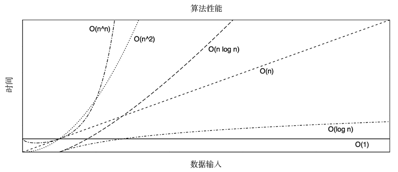
    <figcaption>算法复杂度 (Big O)</figcaption>
  </figure>
- <figure>
    
    <figcaption>具有虚拟机的语言（如 Java 和 Erlang）的代码运作流程通常伴随虚拟机执行和垃圾回收</figcaption>
  </figure>
</div>

垃圾回收让程序编写更简单，同时也导致了：

- 内存增长：GC 程序未能识别垃圾，导致系统换页或内存引用泄露
- CPU 成本： CPU 扫描垃圾所导致的 CPU 时间消耗
- 延时异常： GC 过程导致 CPU 时间被占用，影响正常响应

## 第 6 章 CPU

对于多核 处理器系统，内核通常为每个 CPU 提供了一个运行队列，并尽量使得线程每次都被放到同一队列之中。这意味着线程更有可能在同一个 CPU 上运行，因为 CPU 缓存里保存了它们的数据。

5GHz 的 CPU 表示每秒可以运行 50 亿个时钟周期。

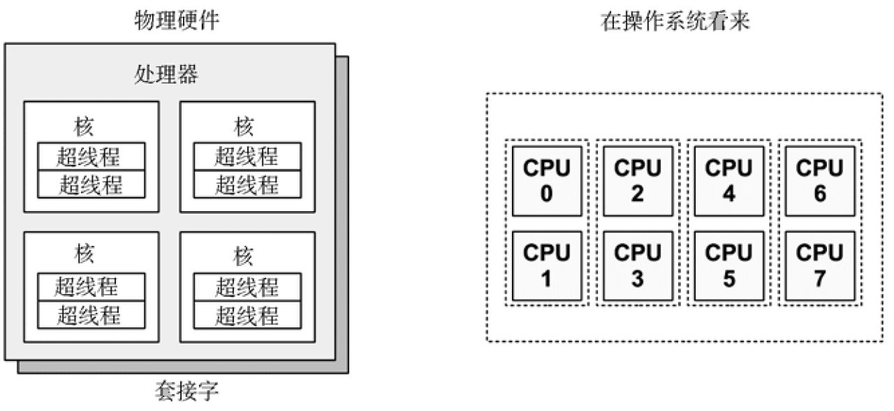{ align=right width=50% }
CPU 的指令步骤包括：

1. 指令预取
2. 指令解码
3. 执行
4. 内存访问
5. 寄存器写回

最后两步是可选的，取决于指令本身。许多指令仅仅操作寄存器，并不需要访问内存。这里每一步都至少需要一个时钟周期来执行。内存访问经常是最慢的，因为它通常需要几十个时钟周期读或写主存，在此期间指令执行陷入停滞（停滞期间的这些周期称为**停滞周期**）。这就是 CPU 缓存如此重要的原因：它可以极大地降低内存访问需要的周期数。

CPI（cycles per instruction，每指令周期数）较高代表 CPU 经常陷入停滞，通常都是在访问内存。内存访问密集的负载，可以通过使用更快的内存（DRAM）、提高内存本地性（软件配置），或者减少内存 I/O 数量。使用更高时钟频率的 CPU 并不能达到预期的性能目标，因为 CPU 还是需要为等待内存 I/O 完成而花费同样的时间。换句话说，更快的 CPU 意味着更多的停滞周期，而指令完成速率不变。

计算密集的应用程序几乎会把大量的时间用在用户态代码上，I/O 密集的应用程序的系统调用频率较高，通过执行内核代码进行 I/O 操作。

<figure markdown>
  { width=60% }
  <figcaption>多进程与多线程</figcaption>
</figure>

控制器（图中标为控制逻辑）是 CPU 的心脏，运行指令预取、解码、管理执行以及存储结果。

平均负载大于 CPU 数量表示 CPU 不足以服务线程，有些线程在等待。如果平均负载小于 CPU 数量，这（很可能）代表还有一些余量。

Linux 目前把**在不可中断状态执行磁盘 I/O 的任务也计入了平均负载**，这意味着平均负载再也不能单用来表示 CPU 余量或者饱和度。

<figure markdown>
  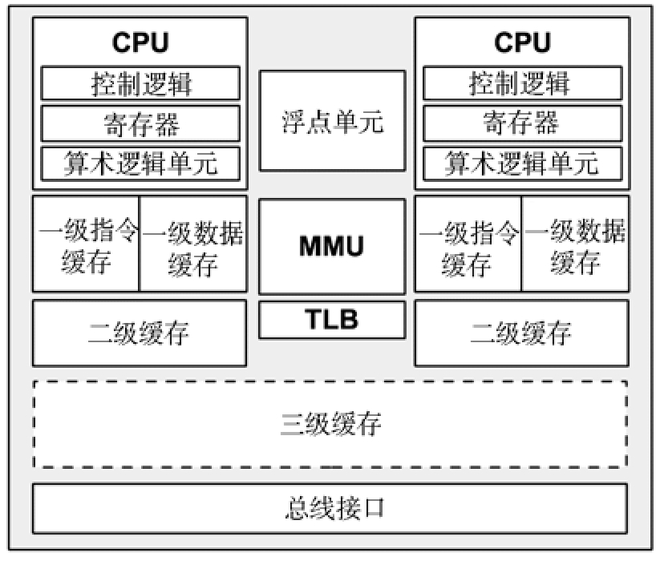{ width=50% }
  <figcaption>通用双核处理器构成</figcaption>
</figure>

<div class="grid cards" markdown>
- <figure>
    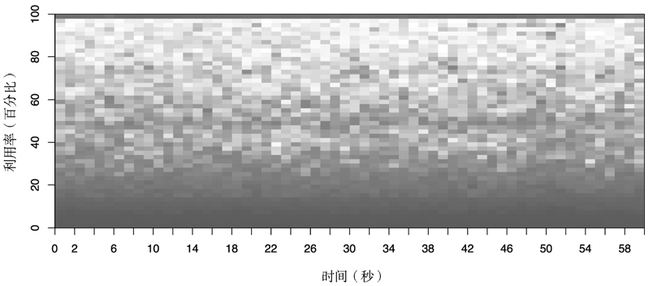
    <figcaption>CPU 使用率热图，5312 颗 CPU</figcaption>
  </figure>
- <figure>
    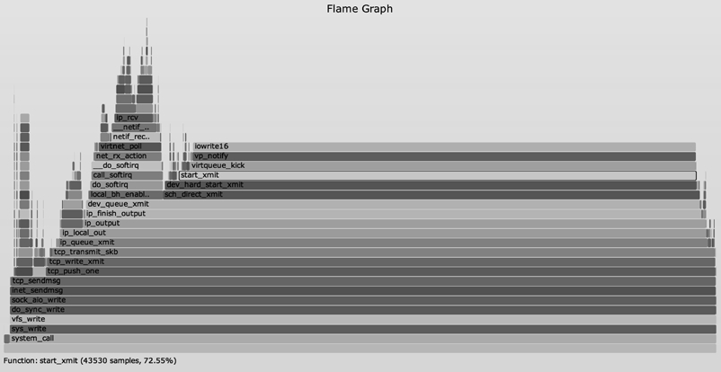
    <figcaption>Linux 内核 perf 分析的火焰图</figcaption>
  </figure>
</div>

```bash
$ lscpu
Architecture:          x86_64                                    # 架构
CPU op-mode(s):        32-bit, 64-bit                            # 运行方式
Byte Order:            Little Endian                             # 字节顺序
CPU(s):                2                                         # 逻辑 CPU 颗数
On-line CPU(s) list:   0,1                                       # 在线 CPU
Thread(s) per core:    2                                         # 每个核心线程
Core(s) per socket:    1                                         # 每个 CPU 插槽核数/每颗物理 CPU 核数
Socket(s):             1                                         # CPU 插槽数
NUMA node(s):          1                                         # 非统一内存访问节点
Vendor ID:             GenuineIntel                              # CPU 厂商 ID
CPU family:            6                                         # CPU 系列
Model:                 63                                        # 型号编号
Model name:            Intel(R) Xeon(R) CPU E5-2680 v3 @ 2.50GHz # 型号名称
Stepping:              2                                         # 步进
CPU MHz:               2494.222                                  # CPU 主频
BogoMIPS:              4988.44
Hypervisor vendor:     KVM                                       # 虚拟化架构
Virtualization type:   full                                      # CPU 支持的虚拟化技术
L1d cache:             32K                                       # 一级缓存(具体为 L1 数据缓存）
L1i cache:             32K                                       # 一级缓存（具体为 L1 指令缓存）
L2 cache:              256K                                      # 二级缓存
L3 cache:              30720K                                    # 三级缓存
NUMA node0 CPU(s):     0,1
```

## 第 7 章 内存

MMU（ Memory Manage Unit，内存管理单元）

## 第 8 章 文件系统

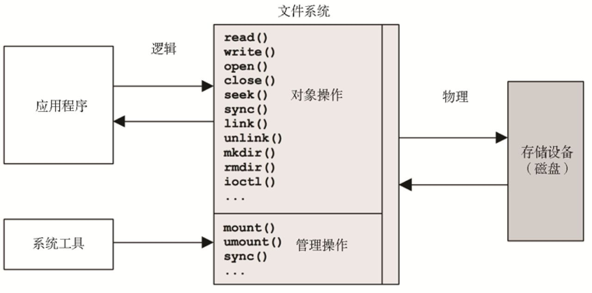{ align=right width=60% }
文件系统用缓存（caching）提高读性能，而用缓冲（buffering）提高写性能。

free 读取的是 `/proc/meminfo` 文件的信息

## 第 9 章 磁盘

**磁盘读写的最小单位是扇区，但扇区只有 512B，为了提升效率，文件系统又将连续的扇区组成了逻辑块，然后每次都以逻辑块为最小单元来管理数据，常见的逻辑块大小为 4KB，也就是由 8 个扇区组成。**

磁盘的吞吐量通常指当前数据传输速率，单位是 B/s

带宽是存储传输或者控制器能够达到的最大数据传输速率。

磁盘 I/O 延时时间尺度示例：

| 事件                                                        | 延时                          | 比例    |
| ----------------------------------------------------------- | ----------------------------- | ------- |
| 磁盘缓存命中                                                | < 100 μs                      | 1s      |
| 读闪存                                                      | 约100 ~1000 μs（I/O由小到大） | 1 ~ 10s |
| 机械磁盘连续读                                              | 约1ms                         | 10s     |
| 机械磁盘随机读（7200转）                                    | 约 8ms                        | 1.3分钟 |
| 机械磁盘随机读（慢，排队）                                  | > 10ms                        | 1.7分钟 |
| 机械磁盘随机读（队列较长）                                  | > 100ms                       | 17分钟  |
| 最差情況的虚拟磁盘I/O（硬盘控制器、RAID-5、排队、随机 I/O） | > 1000ms                      | 2.8小时 |

性能调优的工作就包含识别并通过一些手段排除随机 I/O，例如缓存、分离随机 I/O 到不同的磁盘，以及以减少寻道距离为目的的数据摆放。

一个读频率较高的系统可以通过增加缓存来获得性能提升，而一个写频率较高的系统则可以通过增加磁盘来提高最大吞吐量和 IOPS。

电梯算法（又名电梯寻道）是提高命令队列效率的一种方式。它根据磁盘位置把 I/O 重新排序，最小化磁头的移动。

由于 SAS 支持冗余的连接和架构的双端口设备、I/O 多路径、SAS 域，热插拔以及兼容 SATA 设备， 所以企业环境更倾向于使用 SAS，特别是那些冗余架构的系统。而 SATA 在消费级桌面和笔记本电脑上大量使用。

{ align=right width=40% }
磁盘的性能指标包括：

- 磁盘使用率
- 响应时间

磁盘的 I/O 负载指标包括：

- I/O 频率
- I/O 吞吐量
- I/O 大小
- 随机和连续比例
- 读写比

## 第 10 章 网络

带宽表示对应网络类型的最大数据传输率，通常以 b/s 为单位测量。10GbE 是带宽 10Gb/s 的以太网。

吞吐量表示当前两个网络端点之间的数据传输率，以 b/s 或者 B/s 为单位测量。

<figure markdown>
  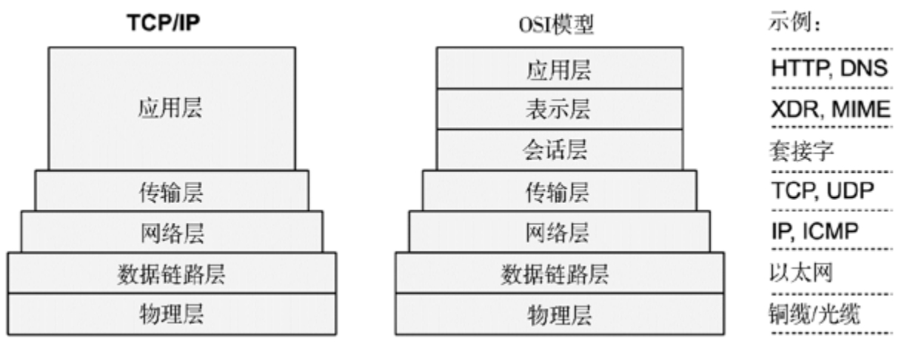{ width=60% }
  <figcaption>协议栈模型</figcaption>
</figure>

通过 IP 与本机通信是 IP 套接字的进程间通信技巧。另一个技巧是 UNIX 域套接字（UDS），它在文件系统中建立一个用于通信的文件。由于省略了 TCP/IP 栈的内核代码以及协议包封装的系统开销，UDS 的性能会更好。**对于 TCP/IP 套接字，内核能够在握手后检测到本地连接，进而为数据传输短路 TCP/IP 栈以提高性能**。这种处理方法在基于 Solaris 的系统中称为 TCP 融合。

由于 TCP 的缓冲和可变滑动窗口机制，即使在高延时的网络中，TCP 也能提供高吞吐量。

TCP 的特性：

- 可变窗口：允许在收到确认前在网络上发送总和小于窗口大小的多个包，以在高延时的网络中提供高吞吐量。窗口的大小由接收方通知以表明当前它愿意接收的包的数量。
- 阻塞避免
- 慢启动：它会以较小的阻塞窗口开始而后按一定时间内接收到的确认（ACK）逐渐增加。如果没有收到，阻塞窗口会降低。
- 选择性确认：它会以较小的阻塞窗口开始而后按一定时间内接收到的确认（ACK）逐渐增加。如果没有收到，阻塞窗口会降低。如发送 1、2、3 数据包，没有收到 2 的确认响应，则超时重传 2 即可。
- 快速重传
- 快速恢复

UDP 的特性：

- 简单：降低计算与长度带来的系统开销
- 无状态：降低连接与传输控制带来的系统开销
- 无重新传输：这些给 TCP 增加了大量的连接延时

UDP 被主要应用于 DNS、视频会议、在线游戏等场景。

---

网络性能监测指标：

- 吞吐量：网络接口接收与传输的每秒字节数
- 连接数：TCP 每秒连接数
- 错误
- TCP 重传
- TCP 乱序数据包

## 第 11 章 云计算

待阅读

## 第 12 章 基准测试

待阅读

## 总结

### CPU

=== "top"

    - top 是一款综合的分析工具，可实时查看系统当前的各种统计指数及活跃的进程，通常是排查问题的第一步，以确定问题的大致范围。在 top 视图中，默认按照 CPU 用量排序，可通过 P（CPU）、T（CPU 使用时间）、M（内存） 来切换不同的指标排序，按 `shift+f` 可对显示的列和排序的列进行调整。更多说明：[https://github.com/me115/linuxtools_rst/blob/master/tool/top.rst](https://github.com/me115/linuxtools_rst/blob/master/tool/top.rst)
    - 多核 CPU 时，按 1 可分别显示每个 CPU 的情况。
    - 需要注意的是，top 自身的 CPU 用量有可能会变得很大，因而应把 top 放到最消耗 CPU 的进程之列！背后的原因在于可用的系统调用——`open()`、`read()`、`close()`——以及当遍历`/proc`里许多进程项目时它们的开销。在 `top` 视图中，按"`b`"可高亮`top`进程的资源占用。
    - `top` 可直接排查占用 CPU 和内存最高的进程，磁盘和网络使用率最高的进程则需要使用 `iotop`、`iostat`、`nethogs`、`iftop` 等工具
    - `top` 的 CPU 信息来自`/proc/stat`
    - 结果中的`VIRT` 表示进程的虚拟内存大小，只要是进程申请过的内存，即使尚未真正分配物理内存，也会计算在内

    ```bash
    $ top
    top - 00:12:46 up 19 days, 14:16,  2 users,  load average: 0.06, 0.06, 0.02
    Tasks: 125 total,   1 running, 124 sleeping,   0 stopped,   0 zombie
    %Cpu(s):  0.2 us,  0.1 sy,  0.0 ni, 99.8 id,  0.0 wa,  0.0 hi,  0.0 si,  0.0 st
    MiB Mem :    923.2 total,     80.0 free,    275.0 used,    568.2 buff/cache
    MiB Swap:    100.0 total,     94.5 free,      5.5 used.    545.5 avail Mem

    PID USER      PR  NI    VIRT    RES    SHR S  %CPU  %MEM     TIME+ COMMAND
    2154 root      20   0  297532 204236  26444 S   1.0  21.6 169:44.08 python3
    21797 pi        20   0   10296   2936   2432 R   0.7   0.3   0:00.08 top
        1 root      20   0   33708   8068   6380 S   0.0   0.9   1:15.90 systemd
        2 root      20   0       0      0      0 S   0.0   0.0   0:03.69 kthreadd
        3 root       0 -20       0      0      0 I   0.0   0.0   0:00.00 rcu_gp
        4 root       0 -20       0      0      0 I   0.0   0.0   0:00.00 rcu_par_gp
        8 root       0 -20       0      0      0 I   0.0   0.0   0:00.00 mm_percpu_wq
    ```

=== "ps"

    `ps`（Process Status）用来列出系统中当前运行的那些进程。ps 命令列出的是当前那些进程的**快照**，如果想要动态的显示进程信息，可以使用 top 命令。选项说明如下：

    - `a`：所有用户
    - `u`：面向用户的扩展信息
    - `x`：没有终端的进程，终端在 tty（电传打字机）显示
    - `-e`：所有进程
    - `-f`：完整信息

    显示列说明如下：

    - `TIME` 列显示了进程自从创建开始消耗的 CPU 总时间（用户态+系统态），格式为“时:分:秒”
    - `%CPU` 列显示了在前一秒内所有 CPU 上的 CPU 用量之和。一个单线程的 CPU 型进程会报告 100%。而一个双线程的 CPU 型进程则会报告 200%

    更多说明：[https://github.com/me115/linuxtools_rst/blob/master/tool/ps.rst](https://github.com/me115/linuxtools_rst/blob/master/tool/ps.rst)

    ```bash
    # 列出目前所有的正在内存中的程序
    $ ps aux
    USER       PID %CPU %MEM    VSZ   RSS TTY      STAT START   TIME COMMAND
    root         1  0.0  0.8  33708  8068 ?        Ss   Jan23   1:15 /sbin/init
    root         2  0.0  0.0      0     0 ?        S    Jan23   0:03 [kthreadd]
    root         3  0.0  0.0      0     0 ?        I<   Jan23   0:00 [rcu_gp]
    root         4  0.0  0.0      0     0 ?        I<   Jan23   0:00 [rcu_par_gp]

    # 显示所有进程信息，连同命令行
    $ ps -ef
    UID        PID  PPID  C STIME TTY      TIME     CMD
    root         1     0  0 Jan23 ?        00:01:15 /sbin/init
    root         2     0  0 Jan23 ?        00:00:03 [kthreadd]
    root         3     2  0 Jan23 ?        00:00:00 [rcu_gp]
    root         4     2  0 Jan23 ?        00:00:00 [rcu_par_gp]
    ```

=== "pstree"

    查看进程树

=== "pidstat"

    `pidstat` 按进程或线程打印 CPU 用量，包括用户态和系统态时间的分解。包名为`sysstat`

    选项说明：

    - `-d`：显示 IO 统计信息
    - `-l`：显示进程名与参数
    - `-p`：指定 pid
    - `-r`：显示内存缺页信息和使用率
    - `-s`：显示堆使用率
    - `-t`：显示线程信息
    - `-u`：显示 CPU 使用率
    - `-v`：显示内核表
    - `-w`：显示 CPU 上下文切换信息
    - `--human`：可读化结果

    ```bash
    $ pidstat 1
    Linux 4.4.0-130-generic (VM-0-3-ubuntu) 	02/12/2022 	_x86_64_	(1 CPU)

    10:03:47 AM   UID       PID    %usr %system  %guest    %CPU   CPU  Command
    10:03:48 AM     0      4104    0.00    0.99    0.00    0.99     0  barad_agent
    10:03:48 AM  1001     13304    6.93    1.98    0.00    8.91     0  php-fpm
    10:03:48 AM  1001     21731    1.98    0.99    0.00    2.97     0  php-fpm
    10:03:48 AM     0     31942    0.00    0.99    0.00    0.99     0  YDService

    10:03:48 AM   UID       PID    %usr %system  %guest    %CPU   CPU  Command
    10:03:49 AM   500       707    0.00    1.01    0.00    1.01     0  pidstat
    10:03:49 AM     0     31942    1.01    0.00    0.00    1.01     0  YDService
    ```

=== "mpstat"

    `mpstat`（multi processor statistics）可查看多核 CPU 的统计信息，在 top 界面按 1 显示的各 CPU 负载基本和 mpstat 一致。包名为`sysstat`

    参数说明如下：

    - `-P` {cpu l ALL}：表示监控哪颗 CPU
    - `internal` 相邻的两次采样的间隔时间
    - `count`采样的次数，count 只能和 delay 一起使用

    显示结果说明如下：

    - `iowait`：I/O 等待
    - `irq`：硬件中断 CPU 用量
    - `soft`：软件中断 CPU 用量
    - `steal`：耗费在服务其他租户的时间
    - `guest`：花在访客虚拟机的时间

    ```bash
    # 列出所有 CPU 并每间隔 1 秒采样
    $ mpstat -P ALL 1
    Linux 5.10.63-v7+ (8f9d5b3433cd)	11/28/10	_armv7l_	(4 CPU)

    04:28:16     CPU    %usr   %nice    %sys %iowait    %irq   %soft  %steal  %guest   %idle
    18:18:08     all    0.00    0.00    0.00    0.00    0.00    0.00    0.00    0.00  100.00
    18:18:08       0    0.00    0.00    0.00    0.00    0.00    0.00    0.00    0.00  100.00
    18:18:08       1    0.00    0.00    0.00    0.00    0.00    0.00    0.00    0.00  100.00
    18:18:08       2    0.00    0.00    0.00    0.00    0.00    0.00    0.00    0.00  100.00
    18:18:08       3    0.00    0.00    0.00    0.00    0.00    0.00    0.00    0.00  100.00

    18:18:08     CPU    %usr   %nice    %sys %iowait    %irq   %soft  %steal  %guest   %idle
    18:18:08     all    0.00    0.00    0.00    0.00    0.00    0.00    0.00    0.00  100.00
    18:18:08       0    0.00    0.00    0.00    0.00    0.00    0.00    0.00    0.00  100.00
    18:18:08       1    0.00    0.00    0.00    0.00    0.00    0.00    0.00    0.00  100.00
    18:18:08       2    0.00    0.00    0.00    0.00    0.00    0.00    0.00    0.00  100.00
    18:18:08       3    0.00    0.00    0.00    0.00    0.00    0.00    0.00    0.00  100.00

    18:18:08     CPU    %usr   %nice    %sys %iowait    %irq   %soft  %steal  %guest   %idle
    18:18:08     all    0.50    0.00    0.00    0.00    0.00    0.00    0.00    0.00   99.50
    18:18:08       0    0.00    0.00    0.00    0.00    0.00    0.00    0.00    0.00  100.00
    18:18:08       1    0.00    0.00    0.00    0.00    0.00    0.00    0.00    0.00  100.00
    18:18:08       2    2.02    0.00    0.00    0.00    0.00    0.00    0.00    0.00   97.98
    18:18:08       3    0.00    0.00    0.00    0.00    0.00    0.00    0.00    0.00  100.00
    ```

=== "perf"

    perf 是一款综合的性能分析工具，可结合火焰图排查系统问题。perf 命令入门：[https://www.ruanyifeng.com/blog/2017/09/flame-graph.html](https://www.ruanyifeng.com/blog/2017/09/flame-graph.html)

=== "uptime"

    系统启动时间、用户信息、平均负载信息

    ```bash
    $ uptime
    23:48:18 up 19 days, 13:52,  2 users,  load average: 7.76, 8.32, 8.60
    ```

=== "time"

    可用于运行命令并报告 CPU 用量

    ```bash
    $ time chksum Fedora.iso
    560560652 63333339904 Fedora.iso

    real	0m5.100s
    user	0m2.810s
    sys	  0m0.300s
    $ time chksum Fedora.iso
    560560652 63333339904 Fedora.iso

    real	0m2.474s
    user	0m2.340s
    sys	  0m0.130s
    # 第一次运行花了 5.1s，其中 2.8s 花在用户模式——计算校验码，以及 0.3s 是系统时间——用来读取文件的系统调用。还有 2.0s 不见了（5.1-2.8-0.3），很可能是花在了等待磁盘 I/O 读上，因为这个文件只有部分被缓存。第二次运行完成得快得多，2.5s，几乎没被阻塞在 I/O 上。这符合预期，因为文件可能在第二次运行时被完全缓存起来了。
    ```

=== "vmstat"

    可分析进程的等待情况、 CPU 上下文切换数、用户时间和内核时间等，详情见内存部分

=== "sar"

    sar（system activity reporter） 是一款总和性能分析工具，可根据历史记录分析性能问题，详细说明：[https://github.com/me115/linuxtools_rst/blob/master/tool/sar.rst](https://github.com/me115/linuxtools_rst/blob/master/tool/sar.rst)

### 内存

=== "vmstat"

    `vmstat`（virtual memory statistics）是一个总和分析工具，可从多个维度分析：

    - 进程状态：
        - `r`(runing or runnable)：运行队列中进程数量
        - `b`(blocked)：等待 IO 的进程数量
    - 内存：容量（缓存、缓冲）
    - swap：
        - `si`：每秒从交换区写到内存的大小
        - `so`：每秒写入交换区的内存大小
    - 磁盘 IO：
        - `bi`：每秒读取的块数
        - `bo`：每秒写入的块数
    - 系统
        - `in`：每秒中断数，包括时钟中断
        - `cs`（context switch）：每秒上下文切换数
    - CPU：
        - `us`：用户进程执行时间 (user time)
        - `sy`：系统进程执行时间 (system time)
        - `id`：空闲时间 (包括 IO 等待时间)
        - `wa`：等待 IO 时间
        - `st`：CPU 在虚拟化的环境下在其他租户上的开销

    更多说明：[https://github.com/me115/linuxtools_rst/blob/master/tool/vmstat.rst](https://github.com/me115/linuxtools_rst/blob/master/tool/vmstat.rst)

    ```bash
    $ vmstat 1
    procs -----------memory---------- ---swap-- -----io---- -system-- ------cpu-----
    r  b   swpd   free   buff  cache   si   so    bi    bo   in   cs us sy id wa st
    15  0   5632  87904  89628 501828    0    0     0     1    4    6  1  0 99  0  0
    15  0   5632  87904  89628 501828    0    0     0     0  342   98  0  0 100  0  0
    15  0   5632  87904  89628 501852    0    0     0     0  356  107  1  0 99  0  0
    ```

=== "free"

    查看内存与 swap 空间信息，数据来自`/proc/meminfo`

    ```bash
    $ free -h
                  total        used        free      shared  buff/cache   available
    Mem:          923Mi       264Mi       210Mi        26Mi       448Mi       570Mi
    Swap:          99Mi        27Mi        72Mi
    ```

=== "pmap"

    查看进程的内存分布

=== "memleak"

    排查内存泄露问题，需安装 [bcc](https://github.com/iovisor/bcc/blob/master/INSTALL.md)

=== "valgrind"

    排查内存泄露问题

=== "top"

    查看内存与 swap 统计信息及按内存占用排序

=== "ps aux"

    查看内存使用率（%MEM）、常驻集合大小（RSS，单位为 KB）、虚拟内存大小（VSZ）

    ```bash
    $ ps aux
    USER       PID %CPU %MEM    VSZ   RSS TTY      STAT START   TIME COMMAND
    root         1  0.0  0.8  33708  7700 ?        Ss   Jan23   1:33 /sbin/init
    root         2  0.0  0.0      0     0 ?        S    Jan23   0:04 [kthreadd]
    root         3  0.0  0.0      0     0 ?        I<   Jan23   0:00 [rcu_gp]
    ```

### 磁盘

=== "iostat"

    查看磁盘的每秒事务数（IOPS）和读写速率，包名为`sysstat`。数据来自于`/proc/diskstats`

    ```bash
    $ iostat
    Linux 5.10.63-v7+ (6bd579026dac) 	01/00/00 	_armv7l_	(4 CPU)

    avg-cpu:  %user   %nice %system %iowait  %steal   %idle
           0.61    0.00    0.16    0.01    0.00   99.22

    Device:            tps   Blk_read/s   Blk_wrtn/s   Blk_read   Blk_wrtn
    mmcblk0           0.27         0.51         5.66    1024236   11253986
    mmcblk0p1         0.00         0.02         0.00      37274         10
    mmcblk0p2         0.27         0.50         5.66     985906   11253976
    ```

=== "iotop"

    查看磁盘 IO 率，排查高 IO 进程。包名为`iotop`

    ```bash
    Total DISK READ :       0.00 B/s | Total DISK WRITE :      19.64 K/s
    Actual DISK READ:       0.00 B/s | Actual DISK WRITE:      54.98 K/s
    TID  PRIO  USER     DISK READ  DISK WRITE  SWAPIN     IO>    COMMAND
    293 be/3 root        0.00 B/s   19.64 K/s  0.00 %  0.41 % [jbd2/vda1-8]
    1 be/4 root        0.00 B/s    0.00 B/s  0.00 %  0.00 % init
    2 be/4 root        0.00 B/s    0.00 B/s  0.00 %  0.00 % [kthreadd]
    3 be/4 root        0.00 B/s    0.00 B/s  0.00 %  0.00 % [ksoftirqd/0]
    5 be/0 root        0.00 B/s    0.00 B/s  0.00 %  0.00 % [kworker/0:0H]
    ```

=== "pidstat -d 1"

    输出磁盘 I/O 统计信息，用于排查程序对磁盘的占用情况

    ```bash
    $ pidstat -d 1
    Linux 4.4.0-130-generic (VM-0-3-ubuntu) 	02/17/2022 	_x86_64_	(1 CPU)
    09:57:35 AM   UID       PID   kB_rd/s   kB_wr/s kB_ccwr/s iodelay  Command
    09:57:36 AM     0       293     -1.00     -1.00     -1.00       1  jbd2/vda1-8
    ```

=== "du & df"

    `du`和 `df` 分别用于查看磁盘已使用和未使用情况

    ```bash
    $ df -h
    Filesystem      Size  Used Avail Use% Mounted on
    /dev/root        59G  4.2G   52G   8% /
    devtmpfs        430M     0  430M   0% /dev
    tmpfs           462M     0  462M   0% /dev/shm
    tmpfs           462M   47M  415M  11% /run
    tmpfs           5.0M  4.0K  5.0M   1% /run/lock
    tmpfs           462M     0  462M   0% /sys/fs/cgroup
    /dev/mmcblk0p1  253M   49M  204M  20% /boot
    tmpfs            93M     0   93M   0% /run/user/1000
    ```

### 网络

=== "netstat（被ss替代）"

    用于统计网络连接情况，常用参数选项如下：

    - `-s` 能查找大量重传的包和乱序的包
    - `-i` 能检查接口的错误统计
    - `-r` 列出路由表
    - `-a` 表示所有连接
    - `-t` 表示 TCP 连接
    - `-u` 表示 UDP 连接
    - `-n` 表示禁用域名解析，只显示 IP
    - `-l` 表示仅显示 `LISTEN` 状态的连接
    - `-p` 表示显示 PID 及进程名，可能需要`sudo`权限
    - `-c` 表示持续输出

    结果解释：

    - `Recv-Q` 与 `Send-Q` 表示接收与发送队列，非 0 时说明有网络包堆积发生
    - 当处于 Established 时，`Recv-Q` 表示套接字缓冲尚未被应用程序取走的字节数，`Send-Q` 表示尚未被远端主机确认的字节数
    - 当处于 Listening 时，`Recv-Q` 表示 syn backlog 的当前值，`Send-Q`则表示最大的 syn backlog 值

    ```bash
    $ sudo netstat -antup
    Active Internet connections (servers and established)
    Proto Recv-Q Send-Q Local Address           Foreign Address         State       PID/Program name
    tcp        0      0 0.0.0.0:8123            0.0.0.0:*               LISTEN      29738/python3
    tcp        0      0 0.0.0.0:22              0.0.0.0:*               LISTEN      587/sshd
    tcp        0      0 192.168.50.4:21064      192.168.50.210:60138    ESTABLISHED 29738/python3
    tcp        0    196 192.168.50.4:22         192.168.50.174:65394    ESTABLISHED 20564/sshd: pi [pri
    tcp6       0      0 :::8123                 :::*                    LISTEN      29738/python3
    tcp6       0      0 :::80                   :::*                    LISTEN      593/apache2
    tcp6       0      0 :::22                   :::*                    LISTEN      587/sshd
    udp        0      0 192.168.50.4:5353       0.0.0.0:*                           29738/python3
    udp        0      0 0.0.0.0:68              0.0.0.0:*                           568/dhcpcd
    udp6       0      0 :::40679                :::*                                374/avahi-daemon: r
    udp6       0      0 :::5353                 :::*                                374/avahi-daemon: r
    ```

    图中与性能相关的指标以加粗强调

    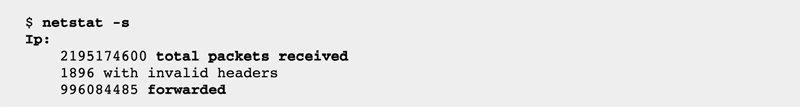

    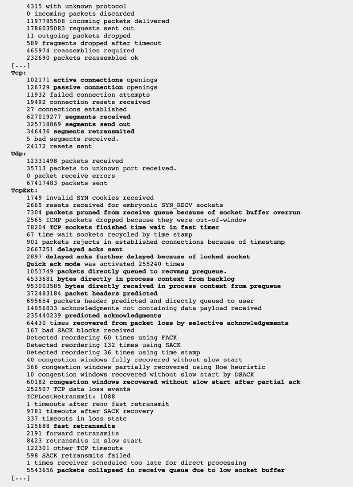

=== "ss"

    与 `netstat` 类似，但性能更好

    ```bash
    $ ss -lntup
    Netid   State    Recv-Q   Send-Q    Local Address:Port      Peer Address:Port
    udp     UNCONN   0        0          192.168.50.4:5353           0.0.0.0:*
    udp     UNCONN   0        0               0.0.0.0:68             0.0.0.0:*
    tcp     ESTAB    0        0          192.168.50.4:34840      39.156.44.8:443
    tcp     ESTAB    0        0          192.168.50.4:21064   192.168.50.174:51777
    tcp     ESTAB    0        0          192.168.50.4:22      192.168.50.174:53060
    ```

=== "ifconfig（被ip替代）"

    查看当前的网络接口配置。包名为`net-tools`

    - 网络接口中没有`RUNNING`时，表示网线被拔掉
    - 当`errors`、`dropped`、`overruns`、`collisions`为非 0 值时说明网络有问题

    ```bash
    $ ifconfig
    eth0      Link encap:Ethernet  HWaddr 02:42:AC:11:00:02
            inet addr:172.17.0.2  Bcast:172.17.255.255  Mask:255.255.0.0
            UP BROADCAST RUNNING MULTICAST  MTU:1500  Metric:1
            RX packets:6230 errors:0 dropped:0 overruns:0 frame:0
            TX packets:3 errors:0 dropped:0 overruns:0 carrier:0
            collisions:0 txqueuelen:0
            RX bytes:2231623 (2.1 MiB)  TX bytes:603 (603.0 B)

    lo        Link encap:Local Loopback
            inet addr:127.0.0.1  Mask:255.0.0.0
            UP LOOPBACK RUNNING  MTU:65536  Metric:1
            RX packets:0 errors:0 dropped:0 overruns:0 frame:0
            TX packets:0 errors:0 dropped:0 overruns:0 carrier:0
            collisions:0 txqueuelen:1000
            RX bytes:0 (0.0 B)  TX bytes:0 (0.0 B)
    ```

=== "ip"

    与`ifconfig`类似，作为`ifconfig`的替代品，查看各网卡的数据包统计信息。包名为`iproute2`

    ```bash
    $ ip -s link
    1: lo: <LOOPBACK,UP,LOWER_UP> mtu 65536 qdisc noqueue state UNKNOWN mode DEFAULT group default qlen 1000
        link/loopback 00:00:00:00:00:00 brd 00:00:00:00:00:00
        RX: bytes  packets  errors  dropped overrun mcast
        1233811    13963    0       0       0       0
        TX: bytes  packets  errors  dropped carrier collsns
        1233811    13963    0       0       0       0
    2: eth0: <BROADCAST,MULTICAST,UP,LOWER_UP> mtu 1500 qdisc pfifo_fast state UP mode DEFAULT group default qlen 1000
        link/ether b8:27:eb:b1:11:66 brd ff:ff:ff:ff:ff:ff
        RX: bytes  packets  errors  dropped overrun mcast
        2688236083 7739271  0       0       0       0
        TX: bytes  packets  errors  dropped carrier collsns
        1793464938 5821278  0       0       0       0
    3: wlan0: <BROADCAST,MULTICAST> mtu 1500 qdisc noop state DOWN mode DORMANT group default qlen 1000
        link/ether b8:27:eb:e4:44:33 brd ff:ff:ff:ff:ff:ff
        RX: bytes  packets  errors  dropped overrun mcast
        0          0        0       0       0       0
        TX: bytes  packets  errors  dropped carrier collsns
        0          0        0       0       0       0
    4: docker0: <BROADCAST,MULTICAST,UP,LOWER_UP> mtu 1500 qdisc noqueue state UP mode DEFAULT group default
        link/ether 02:42:80:4b:99:ca brd ff:ff:ff:ff:ff:ff
        RX: bytes  packets  errors  dropped overrun mcast
        3582       21       0       0       0       15
        TX: bytes  packets  errors  dropped carrier collsns
        3997       31       0       0       0       0
    ```

=== "tcpdump"

    网络数据抓包工具，会有较大的 CPU 开销

    ```bash
    # tcpdump -ni docker0
    tcpdump: verbose output suppressed, use -v or -vv for full protocol decode
    listening on docker0, link-type EN10MB (Ethernet), capture size 262144 bytes
    07:26:23.845397 IP 36.112.109.115.6781 > 172.17.0.3.14430: Flags [S], seq 3344496605, win 65535, options [mss 1200,nop,wscale 6,nop,nop,TS val 2842644611 ecr 0,sackOK,eol], length 0
    07:26:23.845637 IP 172.17.0.3.14430 > 36.112.109.115.6781: Flags [S.], seq 2860208497, ack 3344496606, win 28960, options [mss 1460,sackOK,TS val 276797081 ecr 2842644611,nop,wscale 6], length 0
    07:26:24.129561 IP 36.112.109.115.6783 > 172.17.0.3.14430: Flags [S], seq 2343138436, win 65535, options [mss 1200,nop,wscale 6,nop,nop,TS val 2964386200 ecr 0,sackOK,eol], length 0
    ```

    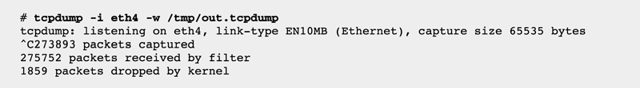

    输出显示出被内核丢弃而没有传给 tcpdump 的数据包数量，这发生在数据包速率过高时

    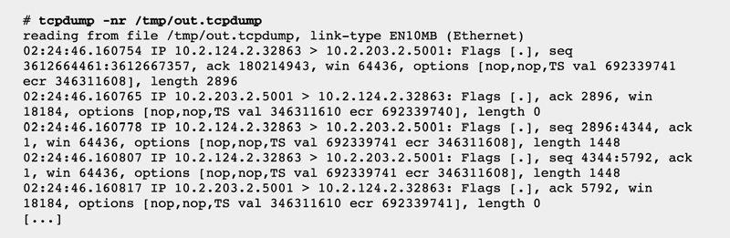

    由于过高的数据包速率导致无法实时研究它们，从导出的文件检查数据包

=== "nethogs"

    查询最占网速的进程

    ```bash
    $ sudo nethogs
    NetHogs version 0.8.5-2

        PID USER     PROGRAM                    DEV        SENT      RECEIVED
    29738 root     python3                    eth0        0.199       0.104 KB/sec
    20581 pi       sshd: pi@pts/0             eth0        0.238       0.067 KB/sec
        ? root     unknown TCP                            0.000       0.000 KB/sec

    TOTAL                                                 0.438       0.171 KB/sec
    ```

=== "iftop"

    查询最占网速的 IP

    ```bash
    $ sudo iftop
    12.5Kb          25.0Kb          37.5Kb          50.0Kb    62.5Kb
    └───────────────┴───────────────┴───────────────┴───────────────┴───────────────
    Pi.lan                     => MBP.lan                    4.66Kb  6.11Kb  5.45Kb
                            <=                             416b    467b    470b
    Pi.lan                     => 111.13.213.29              3.79Kb  3.42Kb  3.42Kb
                            <=                            1.95Kb  2.13Kb  2.13Kb
    Pi.lan                     => 39.156.81.118                 0b   1.68Kb  1.74Kb
                            <=                               0b   1.03Kb  1.12Kb
    Pi.lan                     => 39.156.44.8                   0b   0.98Kb   947b
                            <=                               0b    734b    646b
    Pi.lan                     => r2s.palemoky.com              0b     59b     15b
                            <=                               0b     59b     15b
    192.168.50.255             => CNPF22BC3BZXCC.lan            0b      0b      0b
                            <=                               0b    102b     26b
    Pi.lan                     => 239.255.255.250               0b     94b     24b
                            <=                               0b      0b      0b
    Pi.lan                     => 255.255.255.255               0b     94b     24b
                            <=                               0b      0b      0b
    224.0.0.251                => 192.168.50.117                0b      0b      0b
                            <=                               0b      0b     19b

    ────────────────────────────────────────────────────────────────────────────────
    TX:             cum:   86.7KB   peak:   34.8Kb  rates:   8.44Kb  12.4Kb  11.6Kb
    RX:                    35.9KB           18.0Kb           2.36Kb  4.49Kb  4.39Kb
    TOTAL:                  123KB           52.8Kb           10.8Kb  16.9Kb  16.0Kb
    ```

=== "ifstat"

    查看各网卡的实时速率，包名为`ifstat`

    ```bash
    $ ifstat -tTS
    Time           eth0              docker0           vetha67ed7d            Total
    HH:MM:SS   KB/s in  KB/s out   KB/s in  KB/s out   KB/s in  KB/s out   KB/s in  KB/s out
    18:23:51      0.05      0.20      0.00      0.00      0.00      0.00      0.05      0.20
    ```

=== "speedtest"

    测试网速，需先安装`speedtest-cli`

    ```bash
    $ speedtest
    Retrieving speedtest.net configuration...
    Retrieving speedtest.net server list...
    Testing from Tencent cloud computing (152.136.45.36)...
    Selecting best server based on latency...
    Hosted by China Telecom TianJin-5G (TianJin) [565.12 km]: 7.594 ms
    Testing download speed........................................
    Download: 108.57 Mbit/s
    Testing upload speed..................................................
    Upload: 1.72 Mbit/s
    ```

=== "ping"

    通过 ICMP 协议判断网络的连通性

    ```bash
    $ ping z.cn
    PING z.cn (54.222.60.252) 56(84) bytes of data.
    64 bytes from 54.222.60.252 (54.222.60.252): icmp_seq=1 ttl=242 time=5.95 ms
    64 bytes from 54.222.60.252 (54.222.60.252): icmp_seq=2 ttl=242 time=5.69 ms
    64 bytes from 54.222.60.252 (54.222.60.252): icmp_seq=3 ttl=242 time=5.82 ms
    ^C
    --- z.cn ping statistics ---
    3 packets transmitted, 3 received, 0% packet loss, time 5ms
    rtt min/avg/max/mdev = 5.687/5.819/5.948/0.123 ms
    ```

=== "telnet"

    telnet 是基于 TCP 的协议，所以可以用来判断 TCP 端口是否连通

    ```bash
    $ telnet 192.168.50.4 8123
    Trying 192.168.50.4...
    Connected to pi.lan.
    Escape character is '^]'.
    ```

=== "traceroute"

    跟踪数据包的跳转路径。每一跳显示连续的三个 RTT，它们可用作网络延时统计信息的粗略数据源。

    ```bash
    $ traceroute google.com
    traceroute to google.com (142.251.128.46), 30 hops max, 60 byte packets
    1  r2s.palemoky.com (192.168.50.2)  0.635 ms  0.424 ms  0.541 ms
    2  router.palemoky.com (192.168.50.1)  0.680 ms  0.525 ms  0.582 ms
    3  10.66.128.1 (10.66.128.1)  3.264 ms  3.119 ms  2.973 ms
    4  211.136.88.245 (211.136.88.245)  4.981 ms  4.834 ms  5.008 ms
    5  111.24.14.53 (111.24.14.53)  4.318 ms  4.690 ms  4.544 ms
    6  111.24.2.246 (111.24.2.246)  45.404 ms 111.24.17.106 (111.24.17.106)  11.224 ms 111.24.2.242 (111.24.2.242)  7.497 ms
    ```

=== "nslookup（被dig替代）"

    从 DNS 解析服务器保存的 cache 中查询非权威解答。由于`114.114.114.114`并不是直接管理 `z.cn` 的域名服务器，所以查询结果是非权威的。

    使用`-debug` 参数可调试 DNS 问题

    ```bash
    $ nslookup z.cn
    Server:		114.114.114.114
    Address:	114.114.114.114#53

    Non-authoritative answer:
    Name:	z.cn
    Address: 54.222.60.252
    ```

=== "dig"

    从域名的管理服务器查询结果

    ```bash
    $ dig z.cn

    ; <<>> DiG 9.10.6 <<>> z.cn
    ;; global options: +cmd
    ;; Got answer:
    ;; ->>HEADER<<- opcode: QUERY, status: NOERROR, id: 24962
    ;; flags: qr aa rd ra; QUERY: 1, ANSWER: 1, AUTHORITY: 0, ADDITIONAL: 0

    ;; QUESTION SECTION:
    ;z.cn.				IN	A

    ;; ANSWER SECTION:
    z.cn.			1	IN	A	54.222.60.252

    ;; Query time: 17 msec
    ;; SERVER: 192.168.50.2#53(192.168.50.2)
    ;; WHEN: Tue Feb 15 11:38:10 CST 2022
    ;; MSG SIZE  rcvd: 38
    ```

    使用`+trace` 参数可查看 DNS 的递归查询过程

    1. 从`1.0.0.1`查询到根域名服务器（`.`）的 NS 记录
    2. 从 NS 记录结果中选一个（`a.root-servers.net`）查询顶级域名`com.`的 NS 记录
    3. 从`com.`的 NS 记录结果中选一个（`j.gtld-servers.net`）查询二级域名 `google.com.`的 NS 记录
    4. 从`ns3.google.com`中查询到主机`google.com.`的 A 记录`142.250.176.14`

    ```bash
    $ dig +trace +nodnssec google.com

    ; <<>> DiG 9.11.26-RedHat-9.11.26-6.el8 <<>> +trace +nodnssec google.com
    ;; global options: +cmd
    .			515252	IN	NS	a.root-servers.net.
    .			515252	IN	NS	b.root-servers.net.
    .			515252	IN	NS	c.root-servers.net.
    .			515252	IN	NS	d.root-servers.net.
    .			515252	IN	NS	e.root-servers.net.
    .			515252	IN	NS	f.root-servers.net.
    .			515252	IN	NS	g.root-servers.net.
    .			515252	IN	NS	h.root-servers.net.
    .			515252	IN	NS	i.root-servers.net.
    .			515252	IN	NS	j.root-servers.net.
    .			515252	IN	NS	k.root-servers.net.
    .			515252	IN	NS	l.root-servers.net.
    .			515252	IN	NS	m.root-servers.net.
    ;; Received 811 bytes from 1.0.0.1#53(1.0.0.1) in 1 ms

    com.			172800	IN	NS	e.gtld-servers.net.
    com.			172800	IN	NS	b.gtld-servers.net.
    com.			172800	IN	NS	j.gtld-servers.net.
    com.			172800	IN	NS	m.gtld-servers.net.
    com.			172800	IN	NS	i.gtld-servers.net.
    com.			172800	IN	NS	f.gtld-servers.net.
    com.			172800	IN	NS	a.gtld-servers.net.
    com.			172800	IN	NS	g.gtld-servers.net.
    com.			172800	IN	NS	h.gtld-servers.net.
    com.			172800	IN	NS	l.gtld-servers.net.
    com.			172800	IN	NS	k.gtld-servers.net.
    com.			172800	IN	NS	c.gtld-servers.net.
    com.			172800	IN	NS	d.gtld-servers.net.
    ;; Received 835 bytes from 198.41.0.4#53(a.root-servers.net) in 2 ms

    google.com.		172800	IN	NS	ns2.google.com.
    google.com.		172800	IN	NS	ns1.google.com.
    google.com.		172800	IN	NS	ns3.google.com.
    google.com.		172800	IN	NS	ns4.google.com.
    ;; Received 287 bytes from 192.48.79.30#53(j.gtld-servers.net) in 31 ms

    google.com.		300	IN	A	142.250.176.14
    ;; Received 55 bytes from 216.239.36.10#53(ns3.google.com) in 24 ms
    ```

=== "nfsstat"

    NFS 服务器和客户机统计信息

    ```bash
    $ nfsstat
    Server rpc stats:
    calls      badcalls   badfmt     badauth    badclnt
    851        0          0          0          0

    Server nfs v3:
    null             getattr          setattr          lookup           access
    17        1%     34        3%     0         0%     13        1%     13        1%
    readlink         read             write            create           mkdir
    0         0%     738      86%     0         0%     0         0%     0         0%
    symlink          mknod            remove           rmdir            rename
    0         0%     0         0%     0         0%     0         0%     0         0%
    link             readdir          readdirplus      fsstat           fsinfo
    0         0%     0         0%     7         0%     0         0%     17        1%
    pathconf         commit
    0         0%     12        1%
    ```

=== "strace"

    跟踪套接字相关的系统调用并检查其使用的选项（注意 strace 的系统开销较高）

    ```bash
    $ strace echo 123
    execve("/usr/bin/echo", ["echo", "123"], 0x7eab56c4 /* 24 vars */) = 0
    brk(NULL)                               = 0x358000
    mmap2(NULL, 8192, PROT_READ|PROT_WRITE, MAP_PRIVATE|MAP_ANONYMOUS, -1, 0) = 0x76f35000
    access("/etc/ld.so.preload", R_OK)      = 0
    openat(AT_FDCWD, "/etc/ld.so.preload", O_RDONLY|O_LARGEFILE|O_CLOEXEC) = 3
    fstat64(3, {st_mode=S_IFREG|0644, st_size=54, ...}) = 0
    mmap2(NULL, 54, PROT_READ|PROT_WRITE, MAP_PRIVATE, 3, 0) = 0x76f34000
    close(3)                                = 0
    readlink("/proc/self/exe", "/usr/bin/echo", 4096) = 13
    openat(AT_FDCWD, "/usr/lib/arm-linux-gnueabihf/libarmmem-v7l.so", O_RDONLY|O_LARGEFILE|O_CLOEXEC) = 3
    read(3, "\177ELF\1\1\1\0\0\0\0\0\0\0\0\0\3\0(\0\1\0\0\0\254\3\0\0004\0\0\0"..., 512) = 512
    fstat64(3, {st_mode=S_IFREG|0644, st_size=17708, ...}) = 0
    mmap2(NULL, 81964, PROT_READ|PROT_EXEC, MAP_PRIVATE|MAP_DENYWRITE, 3, 0) = 0x76ef2000
    mprotect(0x76ef6000, 61440, PROT_NONE)  = 0
    mmap2(0x76f05000, 8192, PROT_READ|PROT_WRITE, MAP_PRIVATE|MAP_FIXED|MAP_DENYWRITE, 3, 0x3000) = 0x76f05000
    close(3)                                = 0
    ......
    ```

### 文件

=== "vfsstat"

    查看文件系统的读写速率和频率

=== "lsof"

    一切皆文件，按进程 ID 列出包括套接字细节在内的打开的文件，最常用的是查看端口占用情况。更多 [https://linuxtools-rst.readthedocs.io/zh_CN/latest/tool/lsof.html](https://linuxtools-rst.readthedocs.io/zh_CN/latest/tool/lsof.html)

    ```bash
    # 列出所有的网络连接
    $ lsof -i

    # 列出指定端口的占用情况
    $lsof -i :3306

    # 列出所有 tcp 网络连接信息
    $lsof -i tcp

    # 列出某个用户打开的文件信息
    $lsof -u username

    # 列出某个程序进程所打开的文件信息
    $lsof -c mysql

    # 通过某个进程号显示该进程打开的文件
    $lsof -p 11968
    ```

## 附录：工具自带情况

这些性能工具并非全部是 Linux 发行版“开箱即用”的，通常可以分为以下几类：

=== "基础系统工具"

    这些工具属于 `coreutils` 或 `procps-ng` 等核心工具包，在**几乎所有** Linux 发行版（即使是最小化安装）中都是默认包含的。

    | 工具        | 归属/状态          | 备注                                 |
    | :---------- | :----------------- | :----------------------------------- |
    | **top**     | 自带 (`procps-ng`) | 经典综合监控                         |
    | **uptime**  | 自带 (`procps-ng`) | 查看系统负载                         |
    | **free**    | 自带 (`procps-ng`) | 查看内存快照                         |
    | **vmstat**  | 自带 (`procps-ng`) | 监控虚拟内存、CPU、IO 概况           |
    | **pmap**    | 自带 (`procps-ng`) | 查看进程内存映射                     |
    | **ps**      | 自带 (`procps-ng`) | 静态进程快照                         |
    | **df / du** | 自带 (`coreutils`) | 文件系统/目录大小统计                |
    | **ss**      | 自带 (`iproute2`)  | **现代工具**，取代了老旧的 `netstat` |
    | **ping**    | 自带 (`iputils`)   | 基础网络连通性                       |
    | **pstree**  | 自带 (`psmisc`)    | 树状显示进程结构                     |

=== "常用但可能需要安装（标准仓库提供）"

    在最小化系统（如 Docker 基础镜像或极简云主机）中可能默认不包含，但可通过包管理器（`apt`/`dnf`）轻松安装。

    | 工具        | 软件包名称    | 安装命令示例（Ubuntu）                     | 备注                               |
    | :---------- | :------------ | :----------------------------------------- | :--------------------------------- |
    | **pidstat** | `sysstat`     | `sudo apt install sysstat`                 | 进程资源细分统计                   |
    | **mpstat**  | `sysstat`     | `sudo apt install sysstat`                 | 多核负载分析                       |
    | **iostat**  | `sysstat`     | `sudo apt install sysstat`                 | 磁盘 IO 统计必备                   |
    | **perf**    | `linux-tools` | `sudo apt install linux-tools-$(uname -r)` | **必须与内核版本相匹配**           |
    | **lsof**    | `lsof`        | `sudo apt install lsof`                    | 偶尔在最简系统里不带               |
    | **strace**  | `strace`      | `sudo apt install strace`                  | 跟踪系统调用，开销较高             |
    | **tcpdump** | `tcpdump`     | `sudo apt install tcpdump`                 | 网络抓包利器                       |
    | **dig**     | `dnsutils`    | `sudo apt install dnsutils`                | DNS 查询（CentOS 为 `bind-utils`） |

=== "专业/第三方工具（通常需要单独安装）"

    针对特定场景的强化版工具，基本不随系统附带，可能依赖特定内核特性（如 eBPF）。

    | 工具         | 软件包名称    | 备注                                          |
    | :----------- | :------------ | :-------------------------------------------- |
    | **iotop**    | `iotop`       | 实时查看哪些进程在进行 IO 读写                |
    | **iftop**    | `iftop`       | 实时网卡流量，排查流量去向                    |
    | **nethogs**  | `nethogs`     | 按**进程**统计网络带宽占用                    |
    | **memleak**  | `bpfcc-tools` | **依赖 eBPF (BCC 框架)**，深度排查内存泄露    |
    | **blktrace** | `blktrace`    | 块设备层请求详细追踪                          |
    | **pstack**   | `gdb`         | 很多发行版中它是调用 `gdb` 的脚本，需关联套件 |
