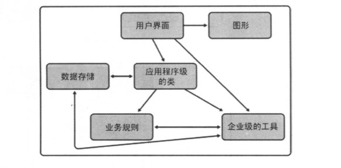
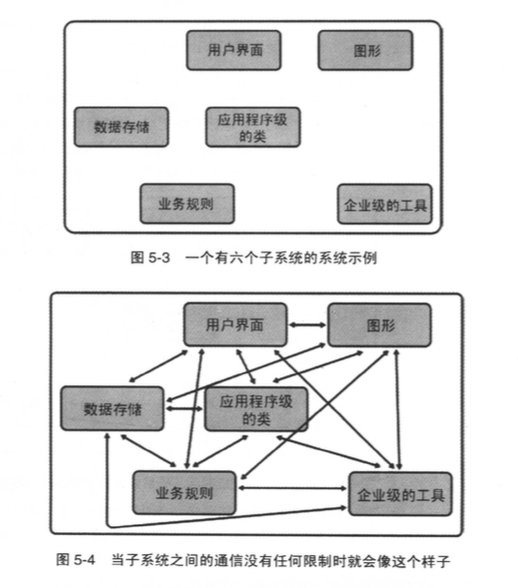
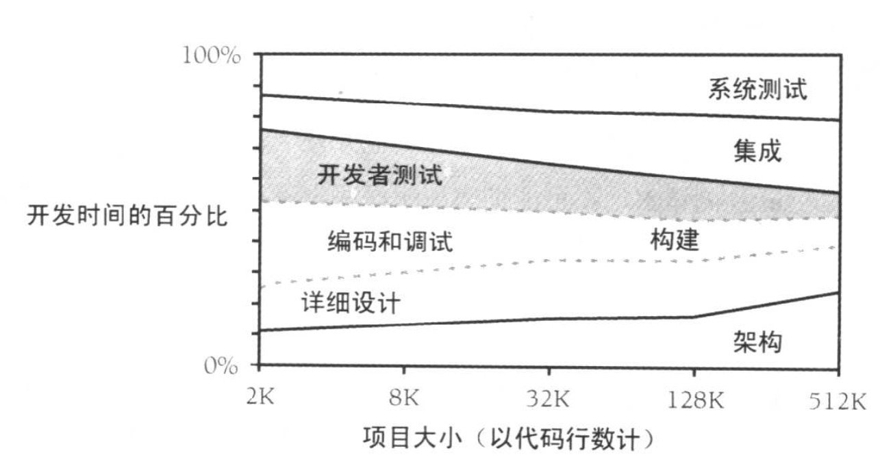
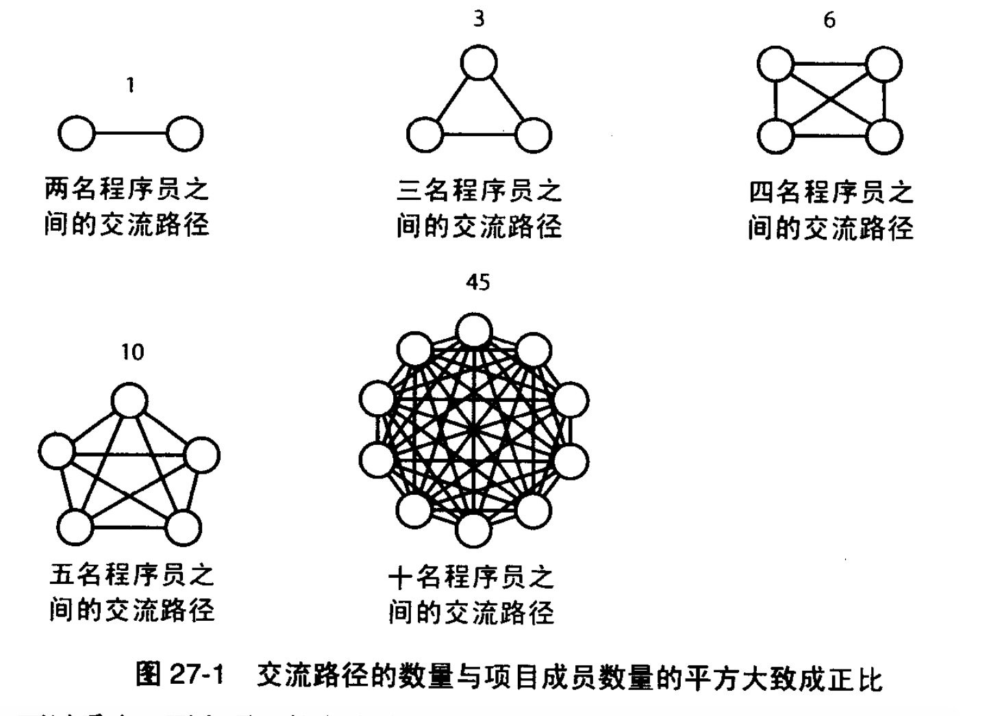
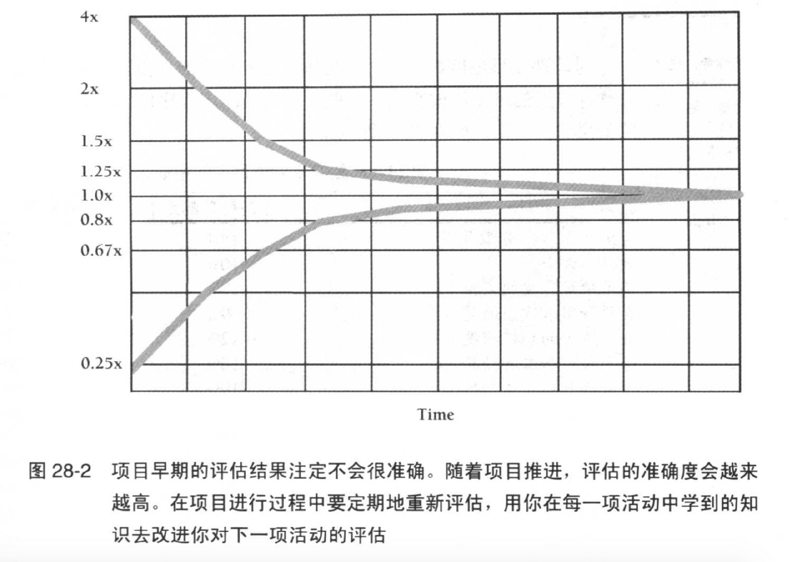

# 《代码大全》

!!! abstract "阅读信息"

    - **评分**：09/2019
    - **时间**：⭐️⭐️⭐️⭐️⭐️
    - **读后感**：推荐给每个开发者，站在巨人的肩膀上看待问题。在编程的世界里，虽然各种语言百花齐放，但我们所遇到的大部分的问题都是相似的。幸好我们处在了技术语言的成熟期，而且所遇到的 99% 的问题 Google 都已经有了答案。在编程中最困难的问题仍然是人的问题，比如团队协作、代码风格、代码质量等。任何竞争的本质都是人的竞争，而人在做任何工作时都要勤于思考，互联网的普及让每个人更加便捷的获取知识。我们只有不断向优秀的人学习，持续思考，才能让每一天都不一样。当我们在向上看到语言框架百花齐放时，更需要向下关注计算机基础，并且不要让自己局限在一门语言中。没有最好的工具，只有最合适的工具。

> 大道至简，少即是多。

## 第 1 章 欢迎进入软件构建的世界

（略）

## 第 2 章 用隐喻来更充分地理解软件开发

精心计划，并不意味着事无巨细的计划或者过的计划。你可以把房屋的结构性的支撑规划清楚，而在日后再决定是用木地板还是地毯，地面漆成什么颜色，屋顶使用什么材料，等等。

**项目的成败很大程度上在构建活动的开始之前就已经注定了。**

## 第 3 章 三思而后行：前期准备

> 本章内容针对架构师。

错误越早引入软件当中，问题就会越复杂，修正这个错误的代价也就越高，因为错误会牵涉到系统的更多部分。

程序员是软件食物链的最后一环，架构师吃掉需求，设计师吃掉架构，而程序员则消化设计。

在软件开发中，如果需求被污染了，那么它就会污染架构，而架构又会污染构建。这样就会导致程序员脾气暴躁，营养失调；开发出的软件具有放射性污染，而且周身都是缺陷。

在一开始就把事情做好是最合算的。进行非必要的改动的代价是高昂的。**在软件开发过程的上游引入的缺陷通常比那些在下游引入的缺陷具有更广泛的影响力。**这也使得早期的缺陷代价更加高昂。

如果你不能向一个六岁小孩解释某件事，那么你自己就没有真正理解它。——爱因斯坦

架构的典型组成部分：

- 程序组织
- 用户界面设计
- 可伸缩性
- 错误处理
- 关于“买”还是“造”的决策

- 主要的类
- 资源管理
- 互用性
- 容错性
- 关于复用的决策

- 数据设计
- 安全性
- 国际化/本地化
- 架构的可行性
- 变更策略

- 业务规则
- 性能
- 输入/输出
- 过度工程

- 架构的总体质量
    - 架构的目标应该清楚的表述
    - 优秀的软件架构很大程度上是与机器和编程语言无关的
    - 架构应该踩在对系统“欠描述”和“过度描述”之间的分界线上
    - 架构应该明确地指出有风险的区域
    - 架构应该包含多个视角
    - 最后，你不应该担忧架构的任何部分。**架构不应该包含任何仅仅为了取悦老板的东西**。它不应该包含任何对你而言很难理解的东西。你就是那个实现架构的人，如果你自己都弄不懂，那又怎么实现呢？

_在软件中，链条的强度不是取决于最薄弱的一环，而是等于所有薄弱环节的乘积。_

_构建活动的准备工作的根本目标在于降低风险。要确认你的准备活动是在降低风险，而非增加风险。_

如果你想开发高质量的软件，软件开发过程中必须由始至终关注质量。在项目初期关注质量，对产品质量的正面影响比在项目末期关注质量的影响要大。

> 优秀的架构不是用更多的东西，而是用更少、更简单的东西来支撑系统。

## 第 4 章 关键的“构建”决策

> 本章内容针对程序员或技术带头人。

本章概述：

- 选择编程语言
- 编程约定：成功编程的关键就在于避免随意的变化，这样你的大脑就可以专注于那些真正需要的变化。
- 你在技术浪潮中的位置：新兴编程语言会让你花很多时间来搞明白它是如何运作的，以及解决很多语言缺陷；成熟的语言则可以用大部分时间稳定持续地编写新功能。
- 选择主要的构建实践方法

主要的构建实践：

- 编码
- 你有没有确定有多少设计工作需要预先进行，多少工作通过编码完成？
- 有没有规定诸如名称、注释、代码格式等“编码约定”？
- 有没有规定特定的由软件架构确定的编码实践？如怎样处理错误条件、如何处理安全性事项、对于类接口有哪些约定、可重用的代码遵循哪些标准、在编码时考虑多少性能因素等？
- 有没有找到自己在技术浪潮中的位置，并相应调整自己的措施？如果必要，你是否知道如何“深入一种语言去编程”，而不受限于语言？
- 团队工作
    - 有没有定义一套集成工具？即，你有没有定义一套工作流，规定程序员在把代码 check in 到 master 之前，必须完成这些步骤？
    - 程序员是结对编程还是独自编程？或者是这二者的某种组合？
- 质量保证 - 程序员在编写代码之前，是否先为之编写测试用例？
    - 程序员会为自己的代码写单元测试吗？
    - 程序员在 check in 代码前，会用调试器单步跟踪整个代码流程吗？
    - 程序员在 check in 代码前，是否进行集成测试？
    - 程序员会 review 或检查别人的代码吗？
- 工具
    - 你是否选用了某种版本控制工具？
    - 你是否选定了一种语言，以及语言的版本或编译器版本？
    - 你是否选定了某个编程框架，或者明确地决定不使用编程框架？
    - 你是否决定允许使用非标准的语言特性？
    - 你是否选定并拥有了其他将用到的工具——编辑器、重构工具、调试器、测试框架、语法检查等。

不同的编程语言只是不同的表达方式。

## 第 5 章 软件构架中的设计

**软件的首要技术使命：管理复杂度。**

### 理想的设计特征

- 最小的复杂度
- 可重用性
- 可扩展性（增强系统的功能而无需破坏其他底层结构）

- 易于维护
- 层次性
- 高扇入（大量的类使用该类）

- 松散耦合
- 标准技术
- 低扇出（一个类中少量使用其他类）

- 精简性
- 可移植性

举例来说，在图 5-3 中，你把一个系统划分成 6 个子系统。在没有定义任何规则时，热力学第二定律就会发生作用，整个系统的熵将会增加。熵之所以增加的一种原因是，如果不对子系统间的通信加以任何限制，那么它们之间的通信就会肆意地发生，如图 5-4 所示。

你可以把子系统间的连接当做水管。当你想去掉某个子系统时，势必会有不少水管连在上面。你需要断开再重新连接的水管数量越多，弄出来的水就会越多。你肯定想把系统的架构设计成这样：如果想把某个子系统取走重用时，不用重新连接太多水管，重新连接起来也不会太难。

有先见之明的话，所有这些问题就不会花太多额外的功夫。只有当“确需了解”——最好还有合理的理由——时，才应该允许子系统间的通信。如果你还拿不准该如何设计的话，那么就应该先对子系统之间的通信加以限制，等日后需要时再放开，这要比先不限制，等子系统间已经有了上百个调用时再加以限制要容易得多。图 5-5 展示了施加少量通信规则后可以把图 5-4 中的系统变成的样子：





### 使用对象进行设计的步骤

1. 辨识对象及其属性（方法和数据）
2. 确定可以对各个对象进行的操作
3. 确定各个对象能对其他对象进行的操作
4. 确定对象的哪些部分对其他对象可见——哪些部分可以是公用（`public`）的，哪些部分应该是私用（`private`）的
5. 定义每个对象的公开接口（`public interface`）

### 类的冰山定律

在设计一个类的时候，一项关键性的决策就是确定类的哪些特性应该对外可见，而那些特性应该隐藏起来。一个类可能有 25 个子程序，但只暴露了其中的 5 个，其余 20 个仅限于在类的内部使用。一个类在内部可能用到了多种数据类型，却不对外暴露有关他们的任何信息。在类的设计中，这一方面也称为“可见性（visibility）”，因为它要确定的就是类的哪些特性对外界是“可见的”或能“暴露”给外界。

类的接口应该尽可能少地暴露其内部工作机制。类很像冰山：八分之七都是位于水面之下，而你只能看到水面上的八分之一。


### 如何应对变化

一个优秀的设计师应该有对变化的预期能力，好的程序设计所面临的最重要挑战之一就是适应变化。目标应该是把不稳定的区域隔离出来，从而把变化所带来的影响限制在一个子程序、类或者包的内部。可采取以下几点措施：

- 找出看起来容易变化的项目
- 把容易变化的项目分离出来
- 把看起来容易变化的项目隔离开来

合理使用设计模式

| 模式     | 描述                                                                                                                     |
| -------- | ------------------------------------------------------------------------------------------------------------------------ |
| 抽象工厂 | 通过制定对象组的种类而非单个对象的类型来支持创建一组相关的对象                                                           |
| 适配器   | 把一个类的接口转变成另一个接口                                                                                           |
| 桥接     | 把接口和现实分离开来，使他们可以独立的变化                                                                               |
| 组合     | 创建一个包含其他同类对象的对象，使得客户代码可以与最上层对象交互而无须考虑所有的细节对象                                 |
| 装饰器   | 给一个对象动态地添加职责，而无须为了每一种可能的职责配置情况去创建特定的子类（派生类）                                   |
| 外观     | 为没有提供一致接口的代码提供一个一致的接口                                                                               |
| 工厂方法 | 做特定基类的派生类的实例化时，除了在工厂方法内部之外均无须了解各派生对象的具体类型                                       |
| 迭代器   | 提供一个服务对象来顺序地访问一组元素中的各个元素                                                                         |
| 观察者   | 使一组相关对象相互同步，方法是让另一个对象负责：在这组对象中的任何一个发生改变时，由它把这种变化通知给这个组里的所有对象 |
| 单例     | 为有且仅有一个实例的类提供一种全局访问功能                                                                               |
| 策略     | 定义一组算法或者行为，使得他们可以动态地相互替换                                                                         |
| 模板方法 | 定义一个操作的算法结构，但是把部分实现的细节留给子类（派生类）                                                           |

### 合作的方式

在设计过程中，三个臭皮匠赛过诸葛亮，而不论组织形式的正式与否。合作可以以下面任意一种方式展开。

- 你随便走到一名同事的办公桌前，向他征求一些意见
- 你和同事坐在会议室里，在白板上画出可选的设计方案
- 你和同事在电脑前用编程语言做出详细的设计，换言之，你们可以采用结对编程（第 21 章“协同构建”中对结对编程有描述）
- 你约一名或多名同事来开会，和他们过一遍你的设计和想法 - 你按照第 21 章中给出的结构来安排一次正式检查
- 你身边没有人能检查你的工作，因此当你做完一些初始工作后，把它们全放进抽屉，一周后再来回顾。这时你会把该忘的都忘了，正好给自己做一次不错的检查
- 你向公司外的人求助：如论坛或交流群

## 第 6 章 可以工作的类

创建高质量的类，第一步，可能也是最重要的一步，就是**创建一个好的接口**。这也包括了创建一个可以通过接口来展现的合理的抽象，并确保细节仍被隐藏在抽象背后。

类接口的抽象能力非常有价值，因为*接口中的每个子程序都在朝着这个一致的目标而工作*。

创建接口的建议 ：

- 类的接口应该展现一致的抽象层次
- 一定要理解类所实现的抽象是什么
- 提供成对的服务（如，开和关，增和减）
- 把不相关的信息转移到其他类中
- 尽可能让接口编程，而不是语义编程
- 谨防在修改时破坏接口的抽象
- 不要添加与接口抽象不一致的公用成员
- 同时考虑抽象性和内聚性

### 良好的封装

- 尽可能地限制类和成员的可访问性
- 不要公开暴露成员数据（通过`set()`和`get()`获取）
- 避免把私用的实现细节放入类的接口中
- 不要对类的使用者做出任何假设（如，请初始化 x, y 为 0 1，否则程序会崩溃）
- 不要因为一个子程序里仅使用公用子程序，就把它归入公开接口
- 让阅读代码比编写代码更方便
- 要格外警惕语义上破坏封装性（语法上只需要将方法设为`private`，而语义上则需要注意不要再次调用已经初始化中完成的方法）
- 留意过于紧密的耦合关系（良好的类应该是黑盒子，而不是玻璃盒子）

**警惕有超过 7 个数据成员的类**。研究表明，人们在做其他事情时能记住的离散项目的个数是`7±2`

使用继承时，需要考虑：

1. 该方法是否对子类可见，是否可被重写
2. 该类属性是否对子类可见及重写

关于类的一些说明：

- 要么使用继承并进行详细说明，要么就不要用它
- 遵循里氏替换原则：派生类必须能通过基类的接口而被使用，且使用者无需了解两者间的差异
- 把共用的接口，数据及操作放到继承树中尽可能高的位置
- 只有一个实例的类是值得怀疑的
- 只有一个派生类的基类也值得怀疑。不要创建任何并非绝对必要的继承结构
- 派生后覆盖了某个子程序，但在其中没有做任何操作
- 避免让继承体系过深。继承不要超过 3 层，基类的派生总数不要超过 7±2。过深的继承会显著导致错误率的增长。过深的继承层次增加了复杂度，而这恰恰与继承所应解决的问题相反，请确保你在用继承来避免代码重复并使复杂度最小
- 尽量使用多态，避免大量的类型检查
- 让所有数据都是`private`

使用类时需要注意的

- 如果多个类共享数据而非行为，应该创建这些类可以包含的共用对象
- 如果多个类共享行为而非数据，应该让它们从共同的基类继承而来，并在基类里定义共用的子程序
- 如果多个类既共享数据也共享行为，应该让它们从一个共同的基类而来，并在基类里定义共用的数据和子程序
- 让类中子程序的数量尽可能少。类中子程序越多，出错的概率也越高
- 禁止隐式地产生你不需要的成员函数和运算符。如构造方法产生的内容
- 减少类所调用的不同子程序的数量。同样的，数量越多，越容易出错
- 对其他类的子程序的间接调用要尽可能的少。即 A 对象可以任意调用自己的所有子程序，如果 A 对象创建了一个 B 对象，也可以 调用任意 B 对象中的公用子程序，但它应该避免再调用 B 对象中其他对象的子程序（尽量减少依赖关系）
- 尽量减少类与类之间相互合作的范围

封装是一个比抽象更强的概念。抽象通过提供一个可以让你忽略实现细节的模型来管理复杂度，而封装则强制阻止你看到细节——即便你想这么做。

成为高效程序员的一个关键就在于，当你开发程序任一部分代码时，都能安全地忽视程序中尽可能多的其余部分。而类就是实现这一目标的首要工具。

为未来要做的工作着手进行准备的最好方法，并不是去创建几层额外的、“没准以后哪天就能用得上的”基类，而是让眼下的工作成果尽可能地清晰、简单、直截了当。也就是说，不要创建任何非绝对必要的继承结构。

创建类的原因

- 为现实世界中的对象建模
- 为抽象的对象建模
- 降低复杂度
- 隔离复杂度。如果在类中出现了错误，只要它还在类的局部而未扩散到其他代码，只需要修改一个地方即可
- 隐藏实现细节
- 限制变动的影响范围。把经常变动的部分隔离起来，这样就能把变动带来的影响限制在一个或几个类的范围内

- 隐藏全局数据。与直接使用全局数据相比，通过访问类的方法来操作全局数据更有好处
- 让参数传递更顺畅
- 建立中心控制点
- 让代码更易于重用
- 为程序族做计划
- 把相关操作包装到一起
- 实现某种特定的重构

应该避免的类

- 避免创建万能类
- 消除无关紧要的类。如果一个类只包含数据但不包含行为的话，就应该认真考虑一下它是一个类吗？同时应该考虑把这个类降级，让它的数据成员成为一个或多个其他类的属性
- 避免用动词命名的类。只有行为而没有数据的类往往不是真正的类

本章要点总结：

- 类的接口应提供一致的抽象。很多问题都是由于违背该原则而引起的。
- 类的接口应隐藏一些信息——如某个系统接口、某项设计决策、或一些实现细节。
- 包含往往比继承更为可取——除非你要对 “是一个/is a” 的关系建模
- 继承是一种有用的工具，但它却会增加复杂度，这有违于软件的首要技术使命——管理复杂度
- 类是管理复杂度的首选工具。要在设计类时给予足够的关注，才能实现这一目标。

### 本章知识点复习

抽象数据类型 —— 你是否把程序中的类都看作是抽象数据类型了？是否从这个角度评估它们的接口了？

抽象

- 类是否有一个中心目的？
- 类的命名是否恰当？其名字是否表达了其中心目的？
- 类的接口是否展现了一致的抽象？
- 类的接口是否能让人清楚明白地知道该如何使用它？
- 类的接口是否足够抽象，使你能不必顾虑它是如何实现其服务的？你能把类看做黑盒吗？
- 类提供的服务是否足够完整，能让其他类无须修改其内部数据
- 是否已从类中去除无关信息？
- 是否考虑过把类进一步分解为组件类？是否已尽可能将其分解？
- 在修改类时是否维持了其接口的完整性？

封装

- 是否把类的成员的可访问性降到最小？
- 是否避免暴露类中的数据成员？
- 在编程语言所许可的范围内，类是否已尽可能地对其他的类隐藏了自己的实现细节？
- 类是否避免对其他使用者，包括其派生类会如何使用它做了假设？
- 类是否不依赖于其他类？它是松散耦合的吗？

继承

- 继承是否只用来建立“是一个/is a”的关系？也就是说，派生类是否遵循 LSP（里氏替换原则）？
- 类的文档中是否记述了其继承策略？
- 派生类是否避免了“覆盖”不可覆盖的方法？
- 是否把公用的接口、数据和行为都放到尽可能高的继承层次中了？
- 继承层次是否很浅？
- 基类中所有的数据成员是否都被定义为`private`而非`protected`的了？

跟实现相关的其他问题

- 类中是否只有大约 7 个或更少的数据成员？
- 是否把类直接或间接调用其他类的子程序的数量减到最少了？
- 类是否只在绝对必要时才与其他的类相互协作？
- 是否在构造函数中初始化了所有的数据成员？
- 除非拥有经过测量的、创建浅层副本的理由，类是否都被设计为当做深层副本使用？

与语言相关的问题

- 你是否研究过所用编程语言里和类相关的各种特有问题？

## 第 7 章 高质量的子程序

良好的子程序应该有：

1. 望文知义的名字
2. 详细的说明注释
3. 良好的代码布局
4. 单一而明确的目的
5. 合理的参数个数（7 个以内）
6. 防范式编程

为什么要创建子程序？

1. 降低复杂度
2. 避免代码重复。如果在两段子程序内编写相似的代码，就意味着代码分解有问题，此时应该把两段子程序中相同部分放入一个基类，再把不同部分放入派生类中。或者将相同部分封装为一个方法
3. 支持子类化
4. 隐藏顺序
5. 隐藏指针操作
6. 提高可移植性
7. 简化复杂的布尔判断
8. 改善性能。一处优化，处处调用受益
9. 确保所有的子程序都最小

编写有效的子程序时，一个最大的心理障碍是不情愿为了一个简单的目的而编写一个简单的子程序，写一个只有两三行代码的子程序可能看起来有些大材小用，但一个小的子程序既能够提高代码的可读性，又能在未来在『简单的操作常常会变成复杂操作』时更好维护。

功能的内聚性是最强也是最好的一种内聚性，也就是让一个子程序仅执行一项操作。

不良的内聚性包括：

1. 过程上的内聚性。即根据业务流程来书写的子程序
2. 逻辑上的内聚性。即若干操作被放在同一个子程序中，通过传入不同的控制标志来选择执行其中的一项操作，这样的子程序可以优化为一个子程序代码仅由一系列 if 或 else 以及调用其他子程序的语句组成，那么这样一个逻辑上的内聚性的子程序通常也是可以的。这种情况下，子程序的唯一功能就是发布命令，其自身并不做任何处理，这种子程序被称为事件处理器
3. 巧合的内聚性。指子程序各操作间没有任何可以看到的关联

如果一个子程序具有不良的内聚性，那最好还是花功夫重新编写，使其具有更好的内聚性，而不是再去花精力精确地诊断问题所在了。

与其限制子程序的长度，不如让以下因素——内聚性，嵌套的层次，变量的数量，决策点的数量，解释子程序的注释及其他一些和复杂度相关的考虑——来决定子程序的长度。但子程序的长度尽量控制在 200 行以内，

子程序参数应该按照“输入-修改-输出”的顺序排列参数。即先列出仅作为输入用途的参数，然后是既作为输入又作为输出用途的参数，最后才是仅作为输出用途的参数。

如果几个子程序都用了类似的一些参数，应该让这些参数的排列顺序保持一致，以便于记忆。反例：php 中的 `array_map()` 和 `array_walk()`

把子程序的参数个数限制在 7 个以内。

函数是指有返回值的子程序，过程是指没有返回值的子程序

确保函数无意外的返回值。可以在函数开头设置默认值来避免这一风险。

不要返回指向局部数据的指针或引用。

> 好的子程序注释应该只用于说明参数，而非业务逻辑。如果需要在注释中说明了你做了什么，要么是你写的太过于复杂，要么产品经理该炒掉。

### 子程序命名

好的子程序名能清晰地描述子程序所做的一切。这里是有效的给子程序命名的一些指导原则：

- 描述子程序所做的所有事情
- 避免使用无意义的、模糊或表述不清的动词
    - 错误的命名：`HandleCalculation()`, `PerformServices()`, `OutputUser()`, `ProcessInput()`, `DelWithOutput()`
    - 正确的命名：`HandleOutput()` ===> `FormatAndPrintOutput()`
- 不要仅通过数字来形成不同的子程序名字
- 根据需要确定子程序名字长度
    - 研究表明，变量名的最佳长度是 9~15 个字符。子程序通常比变量更为复杂，因此，好的子程序名字通常也会更长一些。另一方面，子程序名字通常是跟在对象名字之后，这实际上为其免费提供了一部分名字。总的来说，给子程序命名的重点是尽可能含义清晰，也就是说，子程序名的长短要视该名字是否清晰易懂而定。
- 给函数命名时要对返回值有所描述
- 给过程起名时使用语气强烈的动词加宾语的形式
- 准确使用对仗词：
    - `add`/`remove`
    - `begin`/`end`
    - `create`/`destroy`
    - `first`/`last`
    - `get`/`put`
    - `get`/`set`
    - `increment`/`decrement`
    - `insert`/`delete`
    - `lock`/`unlock`
    - `mix`/`max`
    - `next`/`previous`
    - `old`/`new`
    - `open`/`close`
    - `show`/`hide`
    - `source`/`target`
    - `start`/`stop`
    - `up`/`down`
- 为常用操作确立命名规则

## 第 8 章 防范式编程

在防御式驾驶中要建立这样一种思维，那就是你永远也不能确定另一位司机将要做什么。这样才能确保在其他人做出危险动作时你也不会受到伤害。你要承担起保护自己的责任，哪怕是其他司机犯的错误。防御式编程的主要思想是：子程序应该不因传入错误数据而被破坏，哪怕是由于其他子程序产生的错误数据。

如何做到防范式编程？

- 检查所有来源于外部的数据值
- 检查内部程序的传入参数
- 决定如何处理错误的输入数据

## 第 9 章 伪代码编程过程

伪代码能让你从更宏观的层次了解你即将编写的项目，划定你的开发计划，避免在开发途中逐渐偏离主航道。同时，伪代码也能较为清晰的看出设计方案的缺陷，让错误及早发现和纠正。

请在确信代码是正确的时候执行，避免先东拼西凑，然后通过运行来查看代码是否正常的怪圈，这种方式总是让你花费更多的时间。

## 第 10 章 使用变量的一般事项

- 在靠近第一次使用的位置声明和初始化变量
- 特别注意计数器和累加器`i、j、k、sum`和`total`等变量常用做计数器或累加器，在下一次使用这些变量前忘记重置其值也是一种常见错误。
- 在类的构造函数中初始化该类的数据成员
- 检查是否需要重新初始化，比如`foreach`循环中的值
- 检查输入参数的合法性
- 尽可能将变量的引用集中起来，以提高程序的可读性
- 开始时采用最严格的可见性，然后根据需要扩展变量的作用域。把一个`protected`数据转换为`private`难度比反向要大，因此应该选择变量所能具有的最小的作用域。
- **应该把每个变量定义成只对需要看到它的、最小范围的代码段可见**。如果能把变量的作用于限定到一个单独的循环或者子程序，那最好不过了。如果你无法把作用域限定在一个子程序里，那就把可见性限定到某个类内部的子程序。如果无法你把变量的作用域限定在最该变量承担的最主要的责任的那个类里面，那么就创建一些访问器子程序来让其他类共享该变量的数据。
- 每个变量只用于单一用途，且变量含义明确

减小作用域的一般原则：

- 在循环开始之前再去初始化该循环里使用的变量，而不是在该循环所属的子程序的开始处初始化这些变量
- 直到变量即将被使用时再为其赋值
- 把相关语句放到一起
- 把相关语句组提取成单独的子程序

## 第 11 章 变量名的力量

为变量命名时最重要的考虑事项是：该名字要完全、准确地描述出该变量所代表的事物。通常，对变量的描述就是最佳的变量名，这种名字很容易阅读，而且没有歧义。

**变量名长度在 12 个左右为宜。**

取变量名时，应该以问题为导向，如一条员工的记录可以称作`inputRec`或`employeeData`，前者反映的是输入、记录这些计算概念的计算机术语，后者则直指问题领域，与计算机世界无关。当表示一个打印机状态的位域时，`bitFlag` 要比 `printerReady`更具有计算机特征。

### 变量名中的计算值限定词

很多程序都有表示计算结果的变量：总额、平均值、最大值等等。如果你要用类似于 Total、Sum、Average、Max、Min、Record、String、Pointer 这样的限定词来修改某个名字，那么请记住把限定词加到名字的最后。

这种方法有狠毒偶有点。首先，变量名中最终的那部分，即为这一变量赋予主要含义的部分应当位于最前面，这样，这一部分就可以显得最为突出，炳辉被首先阅读到。其次，采纳了这一规则，你将避免由于同时在程序中使用 totalRevenue 和 revenueTotal 而产生的歧义。这些名字在语义上是等价的，上述规则可以避免将他们当做不同的东西使用。还有，类似 revenueTotal、expenseTotal、revenueAverage、expenseAverage 这组名字的变量具有非常优雅的对称性。而从 totalRevenue、expenseTotal、revenueAverage、averageExpense 这组名字中则看不出什么规律来。总之，一致性可以提高可读性，简化维护工作。

把计算的量放在名字最后的这条规则也有例外，那就是 Num 限定词的位置已经是约定俗成的。Num 放在变量名的开始位置代表一个总数：numCustomers 表示的是员工的总数。Num 放在变量名的结束位置代表一个下标：customerNum 表示的是当前员工的序号。通过 numCustomers 最后代表复数的 s 也能看出这两种应用之间的区别。然而，由于这样使用的 Num 常常会带来麻烦，因此可能最好的办法是避开这些问题，用 Count 或 Total 来代表员工的总数，用 Index 来指代某个特定员工。这样，customerCount 就代表员工的总数，customerIndex 代表某个特定的员工。

### 变量中常用的对仗词

- `begin`/`end`
- `next`/`previous`
- `source`/`target`

- `first`/`last`
- `old`/`new`
- `source`/`destination`

- `locked`/`unlocked`
- `opened`/`closed`
- `up`/`down`

- `min`/`max`
- `visible`/`invisible`

## 第 12 章 基本数据类型

**避免使用“神秘数值”**。神秘数值会导致无法望文知意，相同数值在不同位置含义不同等问题，而使用具名常量来替代则会让代码维护起来更轻松。一条很好的经验法则是：**程序主体中仅能出现的数值就是 0 和 1。任何其他数值都应该转换为具名常量**。如订单状态等场景。

用枚举类型来提高可读性与可靠性，如`chosenColor = 1`用`chosenColor = Color_Red`来替代会更清晰、准确。

## 第 13 章 不常见的数据类型

### 关于指针

如何解释内存中某个位置的内容，是由指针的基类型(base type)决定的。如果某指针指向整数，这就意味着编译器会把该指针所指向内存位置的数据解释为一个整数。当然，你可以让一个整数指针、一个字符串指针和一个浮点数指针都指向同一个内存位置，但其中（最多）只有一个指针能正确地解释该位置的内容。

### 使用指针的一般技巧

对解决很多类型的程序错误来说，最容易的一部分是定位错误，而难的是更正错误。然而指针错误的情况则有所不同。通常，指针错误都产生于指针指向了它不应该指向的位置。当你通过一个坏了的指针变量赋值时，会把数据写入本不该写值的内存区域。这称为“内存破坏”。有时内存破坏会导致可怕、严重的系统崩溃：有时它会篡改程序其他部分的计算结果。有时它会只是你的程序不可预知地跳过某些子程序；而有时候它又什么事情都不做。在最后一种情况下，这种指针错误就像一颗滴答作响的定时炸弹，等着你把程序演示给最重要客户的前 5 分钟时引爆。指针错误的症状常常与引起指针错误的原因无关。因此，更正指针错误的大部分工作量便是找出它的位置。

正确地使用指针要求程序员采用一种双向策略。第一，要首先避免造成指针错误。指针错误很难发现，因此采取一些预防性措施是值得的。其次，在编写代码之后尽快地检测出指针错误来。指针错误的症状飘忽不定，采取一些额外措施来使得这些症状可被预测是非常值得的。

- 把指针操作限制在子程序或者类里面。如不要通过手动操作指针去宾利链表，应该编写一组诸如`NextLink()`、`PreviousLink()`、`InsertLink()`、`DeleteLink()`这样的访问器子程序来完成操作更好些。
- 同时声明和定义指针。在靠近变量声明的位置为该变量赋初始值通常是一项好的编程实践。
- 在与指针分配相同的作用域中删除指针
- 在使用指针之前检查指针
- 先检查指针所引用的变量在使用它
- 用狗牌字段来检测损毁的内存。标记字段（tag flag）或者狗牌（dog tag）是指你加入结构体内的一个仅仅用于检测错误的字段。在分配一个变量的时候，把一个应该保持不变的数值放在它的标记字段里。当你使用该结构的时候——特别是当你释放其内存的时候——检测这个标记字段的取值。如果这个标记字段的取值与预期不符，那么这个数据就被破坏了。在删除指针的时候，就破坏这个字段。把狗牌放置在你所分配的内存区域的开始位置，让你能检查是否多执行了释放该内存的操作，而无需去维护一个包含你所分配的全部内存区域的列表。把狗牌放置在内存区域的后面，让你能检查是否做过超出该内存块末位的覆盖数据操作。你可以同时在前面和后面放狗牌，以便同时达到上述两个目的。
- 增加明显的冗余。另一种代替标记字段的方案，就是某些特定字段重复两次。如果位于冗余字段中的数据不匹配，你就可以确定数据已经被破坏了。如果你直接操作指针，这么做会带来很高的成本。然而，如果你把指针操作限制在子程序里面，那么就只需要少数几处重复的代码。
- 用额外的指针变量来提高代码清晰度。一定不要节约使用指针变量，即不要把同一个变量用于多种用途。这一点对指针变量来说尤为重要。
- 简化复杂的指针表达式
- 画一个图
- 按照正确的顺序删除链表中的指针。在使用动态分配链表时，经常遇到的一个问题是，如果先释放了链表中的第一个指针，就会导致下一个指针无法访问。为了避免这一问题，在释放当前指针前，要确保已经有指向链表中下一个元素的指针。
- 分配一片保留的内存后备区域。如果在你的程序中使用了动态内存，就需要避免发生程序内存忽然被耗尽、用户和数据被丢在 RAM 里的尴尬场景。
- 粉碎垃圾数据
- 在删除或者释放指针之后把它们设置为空值
- 在删除变量之前检查非法指针
- 跟踪指针分配情况
- 编写覆盖子程序，集中实现避免指针问题的策略
- 采用非指针技术

### 全局数据

**使用全局数据的风险比使用局部数据大。**

使用全局数据的一些问题：

- 无意间修改了全局数据
- 在多个线程运行时全局数据保证不会被修改
- 阻碍代码复用。将 A 程序代码移植到 B 代码需要一并移植 A 的全局数据。
- 全局数据破坏了模块化和智力上的可管理性。创建超过几百行代码的程序的核心便是管理复杂度。你能够在智力上管理一个大型程序的唯一方法就是把它拆分成几部分，从而可以只在同一时间只考虑一部分。模块化就是你手中可以使用的最强大的工具。全局数据使得你的模块化大打折扣。如果你使用了全局数据，你不得不关注一个子程序，以及使用了同样全局数据的其他所有子程序。尽管全局数据并没有完全破坏模块化，但却削弱了它。

**只有万不得已的时候才使用全局数据。**

当使用全局数据时，一个好的习惯是，将所有全局数据都冠以`_g`前缀，并且用访问器子程序来管理全局数据，除了该变量的访问器子程序以外，所有的代码都不可以访问`_g`前缀的变量。其他代码均通过访问器子程序来存取该数据。另外，全局数据再设置时，先将每个变量设置为局部变量，仅当必须时再修改为全局。犹如类中先设为`private`，再设为`public`。

不要把所有的全局数据扔在一起。如果把所有的全局数据都堆在一起，然后为它编写一些访问器子程序，你可以消灭所有与全局数据有关的问题，但这也使代码丧失了信息隐藏和抽象数据类型所带来的好处。既然已经在编写访问器子程序，就请花一些时间考虑每一个全局数据所属的类，然后把该数据和它访问器子程序以及其他数据和子程序打包放入那个类。

如何解决全局数据再多线程运行时不会被意外修改呢？我们可以通过锁来控制对全局变量的访问。

**在许多情况下，全局数据事实上就是没有设计好或者没有实现好的类中的数据。在少数情况下，一些数据的确需要作为全局数据，但是可以使用访问器子程序对其进行封装，从而最大限度减少发生问题的几率。在剩余的极少数情况下，你真的需要使用全局数据。**

## 第 14 章 组织直线型代码

**要让程序易于自上而下阅读，而不是让读者目光跳来跳去。**如果有人在阅读你代码时不得不搜索整个程序来找到所需信息，那么就应该重新组织下你的代码了。

直线型代码要把相关的语句组织到一起，好的相关代码结构应该像左侧一样，方块间不会有重叠。


## 第 15 章 使用条件语句

### 使用 if 语句时，请遵循下述指导原则

- 首先写正常代码逻辑，再处理不常见情况
- 确保对于等量判断正确。请不要用`>`代替`>=`或用`<`代替`<=`，在循环中，要仔细考虑避免犯偏差 1 的错误
- 把正常情况的处理放在 if 里而不是在 else 中
- 让 if 中跟一个有意义的语句
- 考虑是否真的需要 else 语句
- 检查 if 与 else 是否弄反了

### 使用 if-else 时请注意

- 利用布尔函数调用简化复杂的检测
- 把最常见的情况放在最前面。易于阅读，执行效率高。
- 确保所有的情况都考虑到了
- 复杂的 if-else 请使用 case 替代

### 使用 case 语句时排序的窍门

- **按照字母或数字顺序排列各种情况**。如果所有情况的重要性都相同，那么就把他们按字母顺序排列，以便提高可读性。
- **把正常的情况放在前面**。如果有一个正常的情况和多个异常情况，那么就把那个正常的情况放在最前面。用注释来说明它是正常情况，而其他的属于非正常情况。
- **按执行频率排列 case 子句**。把最经常执行的情况放在最前面，最不常执行的放在最后。

### 使用 case 语句的诀窍

- 简化每种情况对应的操作。如果某种情况的操作非常复杂，就写一个子程序，并在该情况对应的 case 字句中调用它，而不要把代码本身放进这一 case 子句中。
- 不要为了使用 case 语句而刻意制造一个变量。case 语句应该用于处理简单的、容易分类的数据。如果你的数据并不简单，那么就使用 if-then-else 语句串。为使用 case 而刻意构造出的变量很容易把人搞糊涂，你应该避免使用这种变量。
- **把 default 用于检查真正的默认情况，而不要用于最后需要处理的情况**，这会让人很迷惑并难以维护。
- 利用 default 检查错误

## 第 16 章 控制循环

在代码进入循环时使用下述指导原则：

- 只从一个位置进入循环
- 把初始化代码紧放在循环前面
- 用 `while(true)`表示无限循环，而非`for i = 1 to 999999`
- 在适当的情况下多使用`for`循环。`for` 循环将控制代码都集中在一处，从而有助于写出可读性强的循环。修改 `while` 循环时，常常容易只修改了头部的初始化代码，而忘记修改退出代码，而 `for` 循环的初始化与退出则都在一起
- 在 `while` 更适用时，不要使用 `for` 循环

高效程序员与低效程序员的差别在于：高效程序员会在脑海中模拟程序的执行，并会手动计算来减少差错。而低效程序员则在不停的试验，寻找一种看上去能工作的组合，这样做最终可能会碰出正确的组合来，也可能把原有的错误改成了另一个更微妙的错误。即使这样随意的开发过程能够产生出一个正确的程序，这些程序员也不明白为什么这个程序是正确的。**你需要真正理解你的代码是如何工作的，而不是瞎猜。**

循环下标尽量使其具有可读性，避免使用`i`、`j`、`k`，以及在嵌套循环中重复使用相同的下标名。

### 循环应该有多长？

- 循环要尽可能的短，以便能够一目了然
- 把嵌套限制在 3 层以内
- 把长循环的内容移到子程序里
- 要让长循环格外清晰

## 第 17 章 不常见的控制结构

使用递归的技巧：

- 确认递归能够停止
- 使用安全计数器放置出现无穷递归
- 把递归限制在一个子程序内
- 留心栈空间
- 不要用递归去计算阶乘或者斐波那契数列（[为什么用 递归 计算“阶乘”和“斐波那契数列”是不合适的？](https://blog.csdn.net/code_see/article/details/6327472)）

## 第 18 章 表驱动法

（略）

## 第 19 章 一般控制问题

如何简化复杂的表达式？

- 编写肯定的布尔表达式，尽可能减少诸如`if(!status)`这样的否定判断
- 用括号使布尔表达式更清晰

编程中，0 是一个数值，是空指针的取值，是枚举的第一个元素的取值，是逻辑表达式中的 false，既然它有这么多的用途，因此在代码中应该彰显 0 的明确含义。

### 与 0 比较的指导原则

- 隐式地比较逻辑变量
- 把数字和 0 比较时，应写作 `if(balance != 0)`而非`if(!balance)`
- 在 C 中显示地比较字符和零终止符（`'\0'`）
- 指针与 NULL 比较

_在进行条件判断时，我们常常可能因少写了一个`=`而将`==`写作赋值，因此我们可以把常量写在表达式的左侧，这样，当我们少写了一个`=`时，编译器就会及时捕获到错误。_

### 避免深层嵌套

- 将深层嵌套的判断条件合并
- 将判断条件转换为 if-else 结构
- 使用 case 语句判断
- 将复杂的深层嵌套代码抽取为单独的子程序
- 使用对象和多态
- 用状态变量重写代码
- 重新设计深层嵌套代码

**复杂的代码表明你还没有充分理解你的程序**，所以无法简化它。深层嵌套是一个警告，它说明你要么应该拆分出一个子程序，要么应该重新设计那部分复杂的代码。

**结构化编程的核心思想是指，一个应用程序应该只采用一些单入单出的控制结构**。单入单出的控制结构是指一个代码块，它只能从一个位置开始执行，并且只能结束于一个位置，除此之外再无其他入口或出口。一个结构化的程序将按照一种有序的且有规则的方式执行，不会做不可预知的随便跳转。结构化编程和结构化的、自上而下的设计不完全一样，前者只适用于具体编码层。

程序复杂度的一个衡量标准是，为了理解应用程序，你必须在同一时间记住的实体的数量。有能力的程序员会充分地认识到自己的大脑容量是多么有限，所以他们会非常谦卑地处理编程任务。

### 控制结构的相关事宜

- 表达式中用的是 true 和 false，而不是 1 和 0 吗?
- 布尔值和 true 以及 false 做比较是隐式进行的吗?
- 对数值做比较是显式进行的吗?
- 有没有通过增加新的布尔变量、使用布尔函数和决策表来简化表达式?
- 布尔表达式是用肯定形式表达的吗?
- 括号配对吗?
- 在需要用括号来明确的地方都使用了括号吗?
- 把逻辑表达式全括起来了吗?
- 判断是按照数轴顺序编写的吗?
- 如果适当的话，Java 中的判断用的是`a.equals(b)`方式， 而没有用`a==b`方式吗?
- 空语句表述得明显吗?
- 用重新判断部分条件、转换成 if-then-else 或者 case 语句、把嵌套代码提取成单独的子程序、换用一种更面向对象的设计或者其他的改进方法来简化嵌套语句了吗?
- 如果一个子程序的决策点超过 10 个，那么能提出不重新设计的理由吗?

## 第 20 章 软件质量概述

### 软件质量特性

- 外在特性
    - **正确性(Correctness)**。指系统规范、设计和实现方面的错误的稀少程度。
    - **可用性(Usability)**，指用户学习和使用一个系统的容易程度。
    - **效率 (Efficiency)**。指软件是否尽可能少地占用系统资源，包括内存和执行时间。
    - **可靠性(Reliability)**。指在指定的必需条件下，一个系统完成所需要功能的能力——应该有很长的平均无故障时间。
    - **完整性(Integrity)**。指系统阻止对程序或者数据进行未经验证或者不正确访问的能力。这里的完整性除了包括限制未经授权用户的访问外，还包括确保数据能够正确访问。
    - **适应性(Adaptability)**。指为特定的应用或者环境设计的系统，在不做修改的情况下，能够在其他应用或者环境中使用的范围。
    - **精确性(Accuracy)**。指对于一个已经开发出的系统，输出结果的误差程度,尤其在输出的是数量值的时候。精确性和正确性的不同在于，前者是用来判断系统完成工作的优劣程度，而后者则是判断系统是否被正确开发出来。
    - **健壮性( Robustness)**。这指的是系统在接收无效输入或者处于压力环境时继续正常运行的能力。
- 内在特性
    - **可维护性(Maintainability)**。指是否能够很容易对系统进行修改，改变或者增加功能，提高性能，以及修正缺陷。
    - **灵活性(Flexibility)**。指假如一个系统是为特定用途或者环境而设计的,那么当该系统被用于其他目的或者环境的时候，需要对系统做修改的程度。
    - **可移植性(Portability)**。指为了在原来设计的特定环境之外运行，对系统所进行修改的难易程度。
    - **可重用性(Reusability)**。指系统的某些部分可被应用到其他系统中的程度,以及此项工作的难易程度。
    - **可读性(Readability)**。指阅读并理解系统代码的难易程度，尤其是在细节语句的层次上。
    - **可测试性(Testabiity)**。指的是你可以进行何种程度的单元测试或者系统测试，以及在何种程度上验证系统是否符合需求。
    - **可理解性(Understandability)**。指 在系统组织和细节语句的层次上理解整个系统的难易程度。与可读性相比，可理解性对系统提出了更高的内在一致性要求。

外在特性与内在特性并不完全割裂，在某些层次上内在特性会影响外在特性。

要让所有特性都能表现得尽善尽美是绝无可能的。需要根据一组互相竞争的目标寻找出一套优化的解决方案，正是这种情况使软件开发成为一个真正的工程学科。

### 改善软件质量的方法

- 设定质量目标。根据上一节所提到的软件质量特性，明确定义出软件质量的目标，并要求开发者朝着目标努力。
- 明确定义质量保证工作
- 测试策略
- 软件工程指南
- 非正式技术复查
- 正式技术复查
- 外部审查

### 开发过程

- **对变更进行控制的过程**。实现软件质量目标的拦路虎之一就是失控的变更。需求变更的失控可能使设计和编码工作前功尽弃；设计变更的失控则会造成代码与需求背离，或代码自相矛盾，或是程序员为达到变更后的设计要求，不得不耗费比推进项目更多的时间来修改代码。代码变更的失控则可能造成内部冲突，程序员无法确定哪些代码已经过完全复查和测试，而哪些没有。变来变去的自然影响就是质量不稳定和恶化，因此，**有效地管理变更是实现高质量的一个关键**。
- **结果的量化**。除非质量保证计划的结果经过实际测量，否则你将完全不知道这个计划是否有实效。量化结果能告诉你计划成功与否，并且允许你用可控的方式来调整你的计划，去看你能如何改善它。你也可以度量各种质量特性本身——正确性、可用性以及效率等，这么做是很有用的。
- **制作原型(Prototyping)**。原型是指开发出系统中关键功能的实际模型。对一个开发者来说，开发出一部分用户界面的原型可以判断系统的可用性，开发出关键算法的原型可以确定功能的执行时间，开发出典型数据集的原型能知道程序的内存需求。构建原型能产生更完善的设计，更贴近用户的需求，以及更好的可维护性。

### 不同质量保障技术的相对效能

通过结合多种 bug 检测方式来有效降低 bug 率，如代码 review、单元测试、集成测试、回归测试等。

**检查代码发现 bug 比测试出 bug 的成本更小**，因此，当开发完新功能时，需要先通读本次的开发代码，然后自己进行流程测试。

似乎修正相同 bug 的成本是相同的，但事实并非如此。因为**一个 bug 存在的时间越长，消除它的代价也就越大**，因此能够尽早发现错误的检测方法可以降低修正 bug 的成本。

在一个由超过 400 名程序员创建的 70 万行代码程序中，代码复查的成本效益比测试高出好几倍——前者的回报率为 1.38，后者仅为 0.17。

一个有效的软件质量项目的底线，必须包括在开发的所有阶段联合使用多种技术，下面是一套推荐阵容，通过它们可以获取高于平均水平的质量：

- 对所有的需求、架构以及系统关键部分的设计进行正式检查
- 建模或者创建原型
- 代码阅读或者检查
- 执行测试

**质量保障工作应该贯穿于整个项目周期中，尤其是调研与架构设计阶段，在项目初期引入缺陷，这个缺陷会像核辐射一样污染整个项目。**

**软件产品的业界平均生产效率大约是每人每天 10~50 行最终交付代码，那么每天剩下的时间是怎么度过的呢？**绝大多数项目最大规模的一种活动就是调试以及修正那些无法正常工作的代码。调试和与此相关的重构或者其他返工工作，在传统的不成熟的软件开发周期当中可能消耗大约 50%的时间。只要避免引入错误，就可以减少试时间，从而提高生产力。因此，**效果最明显的缩短开发周期的办法就是改善产品的质量，由此减少花费在调试和软件返工上面的时间总量**。更多质量保证工作能降低 bug 率，但不会增加开发的总成本。IBM 的一个研究也得到了类似的结论：**缺陷最少的软件项目的开发计划时间最短，并拥有最高的开发生产率….消除软件缺陷实际上是最昂贵且最耗时的一种软件工作**(Jones2000)。

> 所有的“功能先上线，优化后期做”都是伪命题。随着项目的发展，越来越多的 bug 引入项目中，导致后期的开发不断被反馈的 bug 打断，无法专注开发，从而造成正在开发功能的 bug，形成恶性循环……

### Key Points

- 开发高质量代码最终并没有要求你付出更多，只是你需要对资源进行重新分配，以低廉的成本来防止缺陷出现，从而避免代价高昂的修正工作。
- **并非所有的质量保证目标都可以全部实现。明确哪些目标是你希望达到的**，并就这些目标和团队成员进行沟通。
- 没有任何一种错误检测方法能够解决全部问题，测试本身并不是排除错误的最有效方法。成功的质量保证计划应该使用多种不同的技术来检查各种不同类型的错误。
- 在构建期间应当使用一些有效的质量保证技术，但在这之前，一些具有同样强大功能的质量保证技术也是必不可少的。**错误发现越早，它与其余代码的纠缠就越少，由此造成的损失也越小**。
- 软件领域的质量保证是面向过程的。软件开发与制造业不一样，在这里并不存在会影响最终产品的重复的阶段，因此，最终产品的质量受到开发软件所用的过程的控制。

## 第 21 章 协同构建

“协同构建”包括结对编程、正式检查、非正式技术复查、文档阅读，以及让其他开发人员共同承担创建代码及其他工作产品责任的技术。

协同构建的首要目的就是改善软件的质量。另一个好处是，它可以缩短开发周期，从而减低开发成本。

### 代码 review 的一些研究案例及收益

- IBM 发现，一小时的代码检查能够节省大约 100 小时的相关工作(测试和缺陷修正)(Holland 1999)。
- 对一些大型程序的一项研究发现，在正式检查上面花一个小时，平均可以避免 33 个小时的维护工作,并且检查的效能是测试的 20 倍以上(Russell1991)。
- 同一组人员开发了 11 个程序，并将它们发布到产品当中。其中的前 5 个没有进行复查，其平均每百行代码存在 4.5 个错误。另外 6 个经过了代码检查，平均每百行代码只有 0.82 个错误。复查消灭了超过 80% 的错误(Freedman and Weinberg 1990)。

### 协同构建有利于传授公司文化以及编程专业知识

软件标准可以写下来并发布出去，但是如果无人去讨论它们，也不鼓励使用这些标准，那么就不会有人去按照这些标准做事情。**复查是一个很重要的机制，它可以让程序员得到关于他们自己代码的反馈。代码、标准以及让代码符合标准的理由等，都是复查讨论中的好主题。**

程序员除了需要得到他们是否很好地遵循了标准的反馈之外，还需要得到程序设计主观方面的回馈，例如格式、注释、变量名、局部变量和全局变量的使用、设计方法以及“我们这里采用的解决方法(the- way-we-do-things-around-here)”等。刚出道的编程人员需要那些有更丰富知识的前辈给予指导，而资深程序员们往往太忙而没时间同他人分享他们的知识。复查为这两种人提供了一个技术交流的平台，所以，无论在未来还是现在，**复查都是培养新人以提高其代码质量的好机会**。

一个采用正式检查的团队报告称，**复查可以快速地将所有开发者的水平提升到最优秀的开发者的高度**(Tackett and Van Doren 1999)。

### 集体所有权适用于所有形式的协同构建

在集体所有权下，所有的代码都属于团队而不是某一个人，并且团队中的所有成员都可以对其进行访问和修改。这会带来一些很有价值的好处。

- 众多双眼睛的检查，以及众多程序员的协力编写，可以使代码的质量变得更好。
- 某个人离开项目所造成的影响更小了，因为每段代码都有多个人熟悉它。
- 总体上缺陷修正周期变短了，因为几个程序员中的任何一个有空，就能随时被指派去修正缺陷。

> 协同构建的思想同样适用于评估、计划、需求、架构、测试以及维护工作等阶段。

### 结对编程的好处

- 与单独开发相比，结对能够使人们在压力之下保持更好的状态。结对编程鼓励双方保持代码的高质量，即使在出现了让人不得不飞快地编写代码的压力时仍然如此。
- 它能够改善代码质量。代码的可读性和可理解性都倾向于上升至团队中最优秀程序员的水平。
- 它能缩短进度时间表。结对往往能够更快地编写代码，代码的错误也更少。这样一来，项目组在项目后期花费在修正缺陷的时间会更少。
- 它还具有协同构建的其他常见好处，包括传播公司文化，指导初级程序员，以及培养集体归属感。

**任何处于开发阶段的代码评审均不应作为员工的表现评审，而应该是基于最终的产品。如果对员工表现进行排名，则应该警告那些处于最低标准以下的员工，而非末位员工。**

### 正式检查

进行详查的目的是发现设计或者代码中的缺陷，而不是探索替代方案，或者争论谁对谁错，其目的绝不应该是批评作者的设计或者代码。对于作者来说，详查的过程应该是正面的，在这一过程中的团队参与使程序得到了明显改善，对所有参与者都是一个学习的过程。这一过程不应该让作者认为团队里面某些人是白痴,或者认为自己应该另谋高就。

有效的详查：

- 你是否有一个核对表，能让评论员将注意力集中于曾经发生过问题的领域?
- 你是否专注于找出错误，而不是修正它们?
- 你是否考虑制定某些视角或者场景，以帮助评论员在准备工作的时候集中注意力?
- 你是否给予评论员足够的时间在详查会议之前进行准备，是否每一个人都做了准备?
- 是否每一个参与者都扮演一个明确的角色——主持人、评论员及记录员等?
- 会议是否以某种高效的速度进行?
- 会议是否限制在两个小时以内?
- 是否所有详查会议的参与者都接受了如何进行详查的针对性培训，是否主持人接受了有关主持技巧方面的针对性培训?
- 是否将每次详查所发现的错误数据都收集起来，使你能调整本组织以后使用的核对表?
- 是否收集了准备速度和详查速度方面的数据，以便你去优化以后的准备和详查工作?
- 是否每次详查中被指派下去的活动都被正确跟进了，无论是通过主持人自己还是一次重新详查?
- 管理层是否理解他们不应该参与详查会议?
- 是否有一个用于保证修正正确性的跟进计划?

NASA 的一项研究表明，通过阅读代码，每小时能发现 3.3 个 bug，而测试只能发现 1.8 个，在整个项目点生命周期中，代码 review 能比各种测试方法多发现 20%~60%的错误。

代码 review 相比于会议形式的代码评审而言，能让评审者更专注于代码的独立复查，而非会议本身。**在会议中，每个人只在一部分时间做贡献。**

## 第 22 章 开发者测试

### 测试包括

- 单元测试

- 组件测试

- 集成测试

- 回归测试

- 系统测试

很多项目将测试作为软件质量的唯一组成部分，这是非常错误的做法，因为各种形式的协同开发时间都表现出比测试更高的错误检测率，而且发现一条错误的成本不到测试的一半。

你必须期望在你的代码里有错误。尽管这种期望似乎有悖常理，但是你应该期望找到这个错误的人是你，而不是别人。

如何开发出高质量的程序？

1. 对开发的功能搭建原型框架，判断是否存在缺陷
2. 采用单元测试
3. 开发完成自我 review 代码，这通常能发现很多问题，避免这些问题在测试中浪费时间。
4. 对开发的功能测试
5. 寻求更有经验的人 review
6. 提交测试



假如你正在写几个子程序，那么你应该一个一个地对它们进行测试。独立进行子程序的测试不是一件容易的事情，但是单独调试它们，比集成之后再进行测试要简单得多。如果将几个没有经过测试的子程序放到一起，结果发现了一个错误，那么这几个子程序都有嫌疑。假如每次只将一个子程序加入到此前经过测试的子程序集合中，那么一旦发现了新的错误，你就会知道这是新子程序或者其接口所引发的问题，调试工作就轻松多了。

完全测试（测试程序每一种可能的输入值）是不可能，也没必要的。我们可以选择那些最有可能找到错误的测试用例：

- 正常情况下的数据
- 正常情况的最小值
- 正常情况的最大值
- 与旧数据的兼容性

绝大多数错误往往与少数几个具有严重缺陷的子程序有关。**80%的错误存在于 20%的类或子程序当中。**

**错误并非平均分布在所有的子程序里，而是集中在少数几个子程序中。**

软件质量的普遍原则：**提高质量就能缩短开发周期，同时降低开发成本。**

### 错误的分类启示

- 大多数错误的影响范围是相当有限的
- 许多错误发生在构建之外。如：缺乏应用领域知识、频繁变动且相互矛盾的需求，以及沟通和协调的失败。
- 大多数的构建期错误是由开发者造成的
- 拼写错误是一个常见的问题根源
- 开发者错误理解设计经常发生
- 大多数错误都很容易修正。大约 85%的错误可以在几小时内修正，15%的错误在几小时到几天内可以修正，只有大约 1%的错误需要花更长的时间修复。
- 总结所在组织中对付错误的经验

### 测试记录应该包括

- 缺陷的管理方面描述(报告日期、报告人、描述或标题、生成编号以及修正错误的日期等)
- 问题的完整描述
- 复现错误所需要的步骤
- 绕过该问题的建议
- 相关的缺陷
- 问题的严重程度——例如致命的、严重的或者表面的
- 缺陷根源:需求、设计、编码还是测试
- 对编码缺陷的分类: off-by-one 错误、错误赋值、错误数组下标，以及子程序调用错误等
- 修正错误所改变的类和子程序
- 缺陷所影响的代码行数
- 查找该错误所花的小时数
- 修正错误所花费的小时数

通过测试记录可以

- 对每一个类中的缺陷数目统计，从最糟糕的类到最好的类依次列出，如果类的规模不同，可能需要对这一数字进行归一化处理
- 按照同样的方式列出每个子程序中的缺陷数，也可能需要根据子程序大小归一化处理
- 发现一个错误平均所需要花费的测试时间
- 每个测试用例所发现缺陷的平均数
- 修正一个缺陷花费的平均编程时间
- 全部测试用例的代码覆盖率
- 在各个严重级别中未处理缺陷的数量

**测试数据本身出错的密度往往比被测代码还要高**。查找这种错误完全是浪费时间，又不能对代码有所改善，因此测试数据里面的错误更加让人烦恼。要像写代码一样小心地开发测试用例，这样才能避免产生这种问题。

## 第 23 章 调试

**请不要通过反复尝试编程！！！**

### 你可以从 bug 中获得以下好处

- **理解你正在编写的程序**。如果你确实已经透彻地理解了它，这个程序就不应该还有 bug。
- **明确你犯了哪种类型的错误**。一旦你发现了错误，请问问自己为什么会犯这样的错误。你如何才能更快地发现这个错误？你如何才能预防此类错误的发生？代码里面还有类似的错误么？你能在这些错误造成麻烦之前改正它们么？
- **从代码阅读者的角度分析代码质量**。代码易读么？它怎样才能更好？用你的结论重构你现在的代码，并让自己下次编写的代码更好。
- **审视自己解决问题的方法**。你自己解决调试问题时用到的方法使你感到自信吗？你的方法管用么？你能够很快地发现缺陷么？或者正是你的方法导致调试工作成效很差？调试过程中你有痛苦和挫败感么？你是在胡乱猜测么？你的调试方法需要改进么？花点时间来分析并改进你的调试方法，可能就是减少程序开发时间的最有效方法。
- **审视自己修正缺陷的方法**。解决方法是否治标不治本呢？是否应该从系统角度进行修正，通过精确的分析对问题的根本原因对症下药呢？

调试其实是一片极其富饶的土地，它孕育着你进步的种子。这片土地也是所有软件构建之路所交织的地方：可靠性、设计、软件质量，凡是你能想到的无所不包。这几乎等同于编写优秀代码所得到的回报。如果你能精于此道，你甚至无须频繁调试。

### 调试之魔魂指南

- **凭猜测找出缺陷**。要找出缺陷，请把`print`语句随机地散布在程序中。检查这些语句的输出来确定缺陷到底在哪里。如果通过 print 语句还是不能找到缺陷，那么就在程序中修改点什么，直到有些东西好像能干活了。不要备份程序的原始版本，也不要记录你做了哪些改变。只有在你无法确定自己的程序正在干什么的时候，编程才比较刺激。请提早准备一些可乐和糖果，因为你会在显示器前度过一个漫漫长夜。
- **不要把时间浪费在理解问题上**。出现的问题不值一提，要解决它们并不需要彻底弄懂程序，只要找出问题就行了。
- **用最唾手可得的方式修正错误**。与其把时间浪费在一个庞大、雄心万丈的，甚至可能影响整个程序的修正工作上，还不如直接去解决你所面对的那个特殊问题。下面是一个完美的例子，如果在这里写一段特例处理代码就可以解决问题，谁会去对`Compute()`寻根究底，弄清与值 17 有关的棘手问题究竟是什么。

```
x = Compute(y)
if (y = 17)
    x = $25.15 // 当 y=17 时，Compute()没有起作用，因此需要修改
```

### 迷信式编程

_毎个团队里都也许有这样一个程序员，他总会遇到无穷的问题：不听话的机器，奇怪的编译器错误，月圆时オ会出现的编程语言的隐藏缺陷，失效的数据，忘记做的重要改劫，一个不能正常保存程序的疯狂的编辑器。_

要知道，**如果你写的程序出了问题，那就是你的原因**，不是计算机的，也不是编译器的。程序不会每次都产生不同的结果。它不是自己写出来的，是你写的，所以，请对它负责。即使某个错误初看似乎不能归咎于你，但出于你自身的利益，最好还是假设它是由你产生的。这样的假设将有助于你的调试。同时避免你先指责别人犯了错，最终却发现错误其实由你而生的尴尬场景。

**在大多数情况下，查找 bug 并理解 bug 通常占用了整个调试工作的 90%。**

### 科学的调试方法

1. 确保 bug 可以稳定复现
2. 确定 bug 位置

    2.1 收集产生 bug 的相关数据

    2.2 分析所收集的数据，并作出 bug 产生的假设

    2.3 确定如何证实或证伪该假设，可以对程序测试或检查代码

    2.4 通过 2.3 方法对假设作出最终结论

3. 修复 bug
4. 对修复结果测试
5. 查找是否存在类似错误

### 查找 bug 的一些建议

- 如果一个错误无法重现，这通常是一个初始化错误，或者是一个同时间有关的问题，或者是空指针问题。
- 如果出现了一个难于确诊的新错误，这个错误通常是同那些最新修改的代码相关。
- 增量式集成。当你每次只对系统添加一个代码片段，调试将变得很容易。如果在这一过程中出现错误，则应将所添加的代码提取出来单独测试。
- **将所有可能的情况罗列出来，并逐一验证，避免在某一种困境中呆的太久。**
- 缩小代码嫌疑。通过打印输出、日志、请求链跟踪等方式进一步精确问题可能发生的位置。
- 扩大嫌疑代码。如果在某个代码范围内没能找到问题，请考虑问题是否的确不在该代码段内。
- **对之前出现过问题的类与子程序保持警惕，它们很可能再次“作案”。**
- 同其他人讨论。**当你向别人解释自己的程序时，常常能发现自己犯下的错误。**
- 抛开问题，休息一下。**如果你调试了很久却毫无进展，只要你尝试完所有的可能，把问题放在一边吧！**出去散散步，做一些其他的事情。回家休息一天，让你的神经在潜意识中释放出问题的解决方案。

### 修复 bug

一项调查显示，**第一次对 bug 的修复有 50% 的几率出错**。以下是一些减少出错的建议：

- 在动手前先理解问题
- 理解程序本身，而不仅仅是问题。对项目的了解越多，越不容易出错；过于庞大的项目至少要了解 bug 的上下文。
- 验证对错误的分析。确定你找到的真正的 bug
- 越是紧急情况下越容易出现问题。如赶火车前突然发现的问题，一个非常小的紧急 bug 不经测试便发布。经验告诉我们，越是慌乱，越容易出问题，如果你无法泰然处之，请与同事一起处理。
- 休息一下。如果你无法确定是否彻底解决了问题，并且时间允许，请放松一下，正确解决问题远比匆忙错误解决问题重要。
- 保存最初的源代码。如果你的修改没有奏效，或者引发了新的问题，请比对一下修改是否正确。
- 治本，而不是治标。如果没有彻底理解问题，就不要去修改代码。如果仅仅治标，你只会把代码搞得更糟糕。
- 一次只做一个改动
- 检查自己的改动
- 增加能暴露问题的单元测试
- 搜索类似的缺陷。如果你想不出如何查找类似缺陷，这就意味着你还没有完全理解问题。

不要让你的代码被特例所纠缠。

## 第 24 章 重构

软件演化就像生物进化一样，有些突变是对物种有益的，另一些则是有害的。良性的软件演化使代码得到了发展。

软件演化的基本准则：演化应当提升程序的内在质量。

### 重构的理由

- 代码重复
- 冗长的子程序
- 循环过长或嵌套过深。循环内部复杂的子程序通常具备转换为子程序的潜质。
- 内聚性太差的类
- 类的接口未能提供层次一致的抽象
- 拥有太多参数的参数列表。如果一个子程序被分解的很好，那么它的子程序应当小巧、定义精确，且不需要庞大的参数列表。
- 变化导致对多个类的相同修改
- 对继承体系同样的修改
- case 语句需要做相同的修改
- 同时使用的相关数据并未以类的方式进行组织
- 成员函数使用其他类的特征比使用自身类的特征还要多
- 过多使用基本数据类型。基本数据类型可用于表示真实世界中实体的任意数量。如果程序中使用了整型这样的数据类型表示某种常见的实体，如货币，请考虑创建一个简单的 money 类，这样编译器就可以对 money 变量执行类型检查，你也可以对赋给 money 的值添加安全检查等功能。
- 某个类无所事事
- 一些列传递流浪数据（数据只是被传来传去而不做任何数据）的子程序
- 如果看到某个类中的绝大部分代码只是去调用其他类中的成员函数，请考虑是否应该把这样的中间人去掉，转而去直接调用其他的类
- **某个类同其他类关系过于亲密**。类的作用是使程序具备更强的可管理行，并最大限度地减少更改代码对周围的连带影响。
- 子程序命名不恰当
- 数据成员被设置为公用
- 某个派生类仅使用了基类的很少一部分成员函数。更完善的封装应该是，把派生类相对于基类的关系从“is-a”转变为“has-a”。即把基类转换为原来的派生类的数据成员，然后仅仅为原来的派生类提供所需要的成员函数。
- 注释被用于解释难懂的代码。“**不要为拙劣的代码编写文档——应当重写代码。**”
- 使用了全局变量
- 程序中的一些代码似乎是在将来的某个时候才会用到。**“超前设计”的代码是画蛇添足**，增加了程序的复杂性，带来了额外的测试、修补缺陷等工作量。对未来需求有所准备的办法并不是去编写空中楼阁式的代码，而是尽可能满足当前需求的代码清晰直白地表现出来，使未来的程序员理解这些代码到底完成了什么功能，没有完成什么功能，从而根据他们的需要进行修改。

> 当一段代码需要用文档才能描述清楚时，要么是你没有理解你所写的代码，要么是你的实现方式过于复杂，此时你应该优化代码，而不是新增文档，文档应该仅用于描述复杂的业务逻辑，或者无法简化的代码。文档看似是万金油，但文档也会有各种弊端，如维护总是滞后、每个人的思维方式不同导致阅读者与表达者无法信息对等、花费更多的时间、维护意愿低，需要强制执行等。当我们发现一件事需要用文档才能描述清楚时，需要考虑一下这件事是不是做复杂了？一个需要读说明书的游戏是没有人会玩儿的。

### 数据级的重构

- 用具名常量替代神秘数值
- 使变量的名字更为清晰且传递更多信息
- 把一个中间变量换成给它赋值的那个表达式本身
- 用函数来替代表达式
- 引入中间变量
- 替换 i、j、k 等同名多用途变量名
- 在局部用途中使用局部变量而不是参数
- 将基础数据类型转换为类。如果一个基础数据类型需要额外的功能或额外的数据，那么就该把数据转换为一个对象，然后再添加你所需要的类行为。
- 将一组类型码转换为类或枚举类型。如`const int SCREEN = 0;`，与其定义这些单独的常量，不如定义一个类，这样你就可以享受严格类型检查所带来的好处。
- 将一组类型码转换为一个基类及其相应派生类。如果与不同类型相关联的不同代码片段有着不一样的功能，请考虑为该类型创建一个基类，然后针对每个类型码创建派生类。如对 OutputType 基类，就可以创建 Screen、Printer 和 File 这样的派生类。
- 把数组转换为对象。如果正在使用一个数组，其中的不同元素具有不同的类型，那么就应该用一个对象来替代它。将数组中的各个元素转化为该类的各个成员。
- 把数据集封装起来。如果一个类返回一个数据集，到处散布的多个数据集实例将会带来同步问题。请让你的类返回一个只读数据集，并且提供相应的为数据集添加和删除元素的子程序。
- 用数据类来代替传统记录。建立一个包含记录成员的类。这样你可以集中完成对记录的错误检查、持久化和其他与该记录相关的操作。

### 语句级的重构

- 分解布尔表达式。通过引入命名准确的中间变量来简化复杂的布尔表达式，通过变量名更好地说明表达式的含义。
- 将复杂布尔表达式转换成命名准确的布尔函数
- 合并条件语句不同部分中的重复代码片段
- 使用 break 或 return 而不是循环控制变量
- 在嵌套的 if-then-else 语句中一旦知道答案就立即返回，而不是去赋一个返回值。一旦知道返回值就迅速退出子程序，这样的代码最容易分析，也不容易出错。如果设置一个返回值，再通过啰嗦的逻辑判断退出循环，你的代码就会难于理解。
- 用多态来替代条件语句(尤其是重复的 case 语句)。结构化程序里很多的 case 语句中的逻辑都可以被放到继承关系中，通过多态函数调用实现。
- 创建和使用`null`对象而不是去检测空值。

### 子程序级重构

- 提取子程序或者方法
- 如果子程序的程序体很简单，且含义不言自明，那么就在使用的时候直接使用这些代码。
- 将冗长的子程序转换为类。
- 用简单算法替代复杂算法。
- 如果子程序需要从调用方获得更多的信息，可以增加它的参数从而为其提供信息。
- 删除冗余参数
- 将查询操作从修改操作中独立出来。查询操作不应改变对象的状态。
- 合并相似的子程序，通过参数区分它们的功能
- 将行为取决于参数的子程序拆分开来。如果一个子程序根据输入参数的值执行了不同的代码，请考虑将它拆分成可几个以被单独调用的、无须传递特定参数的子程序。
- 传递整个对象而非特定成员。如果发现有同一对象的多个值被传递给了一个子程序，考虑是否可修改其接口使之接收整个对象。
- 传递特定成员而非整个对象。如果发现创建对象的唯一理由只是你需要将它传入某个子程序，那么就考虑一下 是否可以修改这个子程序，使之接收特定数据成员而非整个对象。
- 包装向下转型的操作。通常当子程序返回一个对象时，应当返回其已知的最精确的对象类型。这尤其适用于返回迭代器、群集、群集元素等的情况。

### 类接口的重构

- 将成员函数放到另一个类中
- 明确类的职责，拆分承担多个职责的单类
- 删除冗余的类
- 去除委托关系与中间人。A ==> B ==> C，三者的调用关系链是否必须？
- 用委托代替继承。如果某类需要用到另一个类，但又打算获取对该类接口更多的控制权，那么可以让基类成为原派生类的一个成员，并公开它的一组成员函数，以完成一种内聚的抽象。（？？？）
- 用继承代替委托。如果某个类公开了委托类（成员类）所有的成员函数，那么该类应该从委托类继承而来，而不是使用该类。（？？？）
- 引入外部的成员函数。当你调用了一个无法修改的类的额外成员函数时，就可以在调用类中创建新的成员函数方式来提供此功能
- 引入扩展类
- 对暴露在外的成员变量进行封装
- 对于不能修改的类成员，删除相关的 set() 成员函数
- 隐藏那些不会在类之外被用到的成员函数
- 封装不适用的成员函数
- 合并那些实现非常类似的基类和派生类

### 安全的重构

重构是一种改善代码质量的强有力的技术，如果使用不当，重构给你带来的麻烦会比它所带来的好处还要多。

- 保存初始代码
- 重构的步伐请小一些
- 同一时间只做一项重构
- 把要做的事情列出来
- 如果在一次重构中发现需要另一次的重构，你最好先将未来需要重构的地方列出来
- 多使用检查点
- 利用编译器的警告信息
- 重新测试
- 增加测试用例
- 检查对代码的修改。研究表明，相对于大规模修改，小的改动更容易出错。原因很简单：程序员们对于很小的修改常常不以为然。他们不会用纸和笔来推敲程序，也不会让其他人来检查代码。有时甚至根本不会运行这些代码来验证修改工作的正确性。
- 根据重构风险级别来调整重构方法。对于那些有一定风险的重构，谨慎才能避免出错。务必一次只处理一项重构。除了完成通常要做的编译检查和单元测试之外，还应该让其他人来检查你的重构工作，或是针对重构采用结对编程。

### 不宜重构的情况

- **不要把重构当做先写后改的代名词**。重构的含义是在不影响程序行为的前提下改进可运行的代码。那些修补破烂代码的程序员们不是在重构，而是在拼凑代码。
- 避免重构代替重写。如果发现自己处于大规模的重构之中，就应该问问自己是否应该把这部分代码推倒重来，重新设计，重新开发。

### 重构策略

对任何特定程序都能带来好处的重构方法本应是无穷无尽的。和其他的编程行为一样，重构同样受制于收益递减定律，同样也符合二八法则。

- 在增加子程序时进行重构。检查相关的子程序是否都被合理地组织起来了。
- 在添加类的时候进行重构。
- 在修补缺陷的时候进行重构
- 关注易于出错的模块。烫手的山芋彻底解决才是有效的重构策略。
- 关注高度复杂的模块
- 在维护代码时，确保代码在离开你的时候比来之前更健康
- 定义清楚干净代码和拙劣代码之间的边界，然后尝试把代码移过这条边界

### Key Points

- 修改是程序一生都要面对的事情，不仅包括最初的开发阶段，还包括首次发布之后。
- 在修改中软件的质量要么改进，要么恶化。软件演化的首要法则就是代码演化应当提升程序的内在质量。
- 重构成功之关键在于程序员应学会关注那些标志着代码需要重构的众多的警告或“代码臭味”。
- 开发阶段的重构是提升程序质量的最佳时机，因为你可以立刻让刚刚产生的改变梦想变成现实。请珍惜这些开发阶段的天赐良机！

## 第 25 章 代码(性能)调整策略

在极少情况下，程序员能正确确定出程序的瓶颈。但他们可能对这一部分代码痛下重手而顾此失彼，让另一部分代码成为制约性能的关键因素。这样，最终的结果是性能的下降。而如果优化放在整个系统完成之后，那么程序员就可以明确各个问题域以及各自的相对重要性,从而有效地对全部优化所用时间进行分配。（**性能调整放在系统完成后处理**）

在最初的开发阶段中，程序员老是把目光集中在优化上面会干扰自己对其他程序目标的理解和判断,让自己沉浸在那些最终并没有为用户提供多大价值的算法分析和晦涩的讨论中，把对正确性、信息隐藏、可读性等的考虑放到了第二位。实际上，在重视这些之后会更容易实施性能优化。如果首先考虑前者，那么后期优化工作通常只会影响到不足 5%的程序代码。你是愿意回过头去处理 5%代码的效能，还是去改善 100%的程序的可读性?

过早的性能优化会对软件的整体质量产生严重威胁，受到影响的甚至包括软件的性能。

**4%的代码造成了 50%甚至更多的性能瓶颈。**

常见的效率低下之源：

- I/O。尽可能在内存中操作数据，避免磁盘与网络 I/O 操作。
- 内存分页。引发操作系统交换内存页面的运算会比在内存同一页中进行的运算慢很多。
- 系统调用。调用系统子程序的代价常常是十分可观的。这些调用通常会涉及系统的上下文切换——保存程序状态、恢复内核状态，以及相反的操作。
- 解释型语言
- 错误。这些错误可能是没有去掉调试代码、忘记释放内存、数据表库设计失误、轮询并不存在的设备直到超时等

尽管几乎不可能从一种方法中获得十倍的性能改进，但你可以将多种方法有效地结合起来，效果经常是惊人的。

### 程序整体性能提升的方法

- 修改需求
- 修改程序设计
- 修改类的设计
- 减少程序与操作系统的交互
- 避免冗余 I/O 操作
- 使用编译型语言替换解释型语言
- 使用更好的编译器优化
- 使用不同硬件提升性能
- 是否将代码调整看做性能优化的最后一招？

Key Points

- 性能只是软件整体质量的一个方面，通常不是最重要的。相对于代码本身的效率而言，程序的架构、细节设计以及数据结构和算法选择对程序的运行速度和资源占用的影响通常会更大。
- 量化测量是实现性能最优化的关键。量化测量需要找出能真正决定程序性能的部分，在修改之后，应当通过重复测量来明确修改是提高还是降低了软件的性能。
- 绝大多数的程序都有那么一小部分代码耗费了绝大部分的运行时间。如果没有测量，你不会知道是哪一部分代码。
- 代码调整需要反复尝试，这样才能获得理想的性能提高。
- 为性能优化工作做好准备的最佳方式就是在最初阶段编写清晰的代码,从而使代码在后续工作中易于理解和修改。

## 第 26 章 代码调整技术

优化循环的几个方面

- 编写高效循环的关键在于尽可能减少循环内部所做的工作。如果你可以在循环外面计算某语句或某部分语句，而在循环内部只是使用计算结果，那么就把它们放到外面。这是一种很好的编程实践，在很多情况下还可以改善程序的可读性。
- 把循环次数最多的循环放在最内层
- 用更高效的方式运算，如用移位代替乘除，将金额以分为单位进行整型运算，而非浮点数
- 数组维度尽可能浅
- 利用代数的恒等替换。如用`x<y`判断替换`sqrt(x)<sqrt(y)`
- 尽可能将运行前就可确定的值确定下来，以加快运算速度。如一天的秒数固定为 86400s，无需每次运行时计算。

## 第 27 章 程序规模对构建的影响

如果你习惯于开发小项目，那么你的第一个中大型项目有可能严重失控，它不会像你憧憬那样成功，而会变成一头无法控制的野兽。如果你已经习惯于开发大型项目，那么你所用的方法可能对小项目来说太正规了。

**项目越大越容易出错**。这包含成员间复杂的沟通、需求评估的准确性、架构设计的合理性、组织结构、生产效率以及错误率等，你需要比小型项目花费更多的精力才能获得与小型项目一样的错误率。

在软件开发中，人越多，效率就越低！合适的人，合适的配置才能提高效率。高效的大型项目是建立一个分工明确、合作有序的「外科手术式的队伍」。外科手术中，有主刀医生、第一助手、麻醉医生、护士等，软件项目也应该有首席程序员、其他的程序员、管理者，文档编辑人员等。这样，既能获得由少数头脑产生的产品完整性，又能得到多位协助人员的总体生产率，还彻底地减少了沟通的工作量。

> 关于大型项目管理请参看《人月神话》 一点想法：如何评估编程管理是否合理？查看程序员的每天高质量的代码行数以及 bug 率。



## 第 28 章 管理构建

**由一位受人尊敬的架构师来制定标准**。有时项目的架构师只是一名在项目中待的时间非常长的资深闲杂人士，他已经不再接触与产品编码有关的事务了。由这种“架构师”定义出来的标准是会受到程序员怨恨的，因为他根本不了解程序员正在做的工作。

### 鼓励良好的编码实践技术

- 给项目的每一部分分派两个人。如果每行代码都由两个人共同完成，那么你可以保证至少有两个人认为这段代码是能工作的，而且是可读的。两人组队的办法有结对编程、导师带学生、复审等。
- 逐行复查代码。除了能为“原程序员离开项目”这一情况提供一层安全保障外，复查还能改善代码的质量，因为程序员知道会有其他人阅读他的代码。
- 要求代码签名。在认定代码完成之前，高级技术人员必须在代码清单上签字。
- 安排一些好的代码示例供人参考。你可以用一份清楚的样例说明自己的质量目标。类似的，编码标准手册里也可以主要包含一份“最佳代码清单”。这种手册更新起来要比文档容易的多，而且它能很容易地将编码风格中的细微之处表达清楚。
- 强调代码是公有财产。这会让开发者有意识的注意自己的代码质量。
- 奖励好代码。在开发你的激励机制时，请将以下方面考虑进去：
    - 所给予的奖励应该是程序员想要的
    - **只有非常出色的代码才应得到奖励**。至于这位程序员是否有良好的合作态度或者上班是否准时都不重要，**如果你的奖励不符合技术标准，你将失去信誉**。如果你的技术水平还没有高到足以判断代码的优劣，那么就不要判断！这时候千万不要奖励，或者让你的团队来选择该奖励谁。
    - 将奖励设置为每月一次，这样**开发者的努力回报不会因为太久而放弃**，促使大家都在努力提升自己。
- 一份简单的标准。如果你正在管理一个编程项目，并且你具有一定的编程背景，那么有一种方法可以简单有效地获得好的工作成果——你只需要求“**我必须能阅读并理解这个项目里的所有代码**”。管理者不是技术专家这一事实反而有助于阻止产生“聪明的”或者难以理解的代码。

> 小思考：为什么优秀的开源程序的质量很高？ 贡献者在开源前会优化代码的可读性，测试自己的代码质量，开源后会有其他开发者一同审视、运行代码、反馈问题，从而得到正向循环的优化。

控制设计变更的指导原则

- 遵循某种系统化的变更控制手续
- 成组地处理变更请求。当你在开发中有变更想法时，请将它记录下来，集中注意在开发工作中，在开发结束后统一处理这些变更。这避免你的开发工作被打断、不必要的变更，以及错过一些好的变更。
- 评估每项变更的成本。变更控制的实质是确定什么最重要，所以要确定变更的收益与成本是划算的。
- 提防大量的变更请求。尽管变更在一定程度上是不可避免的，变更请求的数量太大仍然是一个很关键的警报信号，它表明需求、架构或者上层设计做得不够好，从而无法有效地支持构建活动。对需求或者架构进行返工也许看上去代价昂贵，但是与“多次构建软件”或者“扔掉不需要的功能的代码”的高昂代价相比,还是值得考虑的。
- 成立变更控制委员会或者类似机构
- 警惕官僚主义，但也不要因为害怕官僚主义而排斥有效的变更控制

### 软件评估的方法

- 建立目标。评估中是否包含会议、休假、节假日、培训以及其他非项目相关的活动？什么样的评估准确度才能达到你的目标？乐观评估与悲观评估会产生截然不同的结果吗？
- 为评估留出时间，并作出计划
- 清楚地说明软件需求。当要做的事情还没有确定时，谁也无法做出准确的评估。
- 在底层细节层面进行评估
- 使用若干不同的评估方法，并且比较其结果。小孩们很早就知道，如果分别向父母索要冰激凌，比仅向父亲或母亲索要的成功率要高，而且可能要到两份。
- 定期做重新评估。项目越接近完成，评估的准确度应该越高。要不时地将评估结果和实际结果进行比价衡量，用这一衡量结果来改善你对项目剩余部分的评估。

一位妇女怀胎十月诞下一子，并不意味着十位妇女能只用一个月时间生下一个孩子。因此，对于某些无法拆分的任务，在落后时添加人手只会让项目延期更久，因为新手需要先熟悉项目才能产出，而熟悉项目又占用了已受训的开发者时间。仅仅增加人员还会导致交流的复杂度和数据也增加。此时，如果可以延长开发时间当然是最好的，如果不能，那就保留必须的功能，或者原有功能的简化版本。



### 工作环境与生产效率的关系

生产力与工作环境间有着很强的关联性。如果开发者旁边坐着电话销售或者售后，他们是无论如何都无法产出高质量代码的。

> 管理者应该关注提升员工的有效生产力。如果能通过一次投入的改善环境来持续提升生产力，何乐而不为呢？比如针对开发者设置格子间办公，自由的工作时间，每周允许员工两天远程办公等。只要员工能够按时高质量完成工作，我觉得工作形式不必拘泥。

> 关于远程办公与办公室办公的一些讨论：远程办公有优势有劣势，对于独立性强的工作、或者个人能力超强的人，这比较合适；但是对于协同非常频繁、或者需要大量组织管理工作的人来说，这只会降低生产力。如果每周允许几天的远程办公，既可以节省上下班时间，又可以提升员工的幸福感。如果完全远程办公，则会导致团队协作效率低下，团队氛围差等问题。

> 关于开放式办公与格子间办公的一些讨论：开放式办公导致噪音污染与视觉混乱，无法集中注意力、影响独立思考，以及剥夺隐私等问题。真正便于员工创造价值的设计在于空间的“可选择性”，即赋予员工更多的自主选择权。员工可以在不同类型的功能区内选择适合自己工作方式的位置，需要静下心来工作时可以独辟一个区域办公，需要沟通合作时围坐在一起协同工作。

### 管理你的管理者

在软件开发中，非技术出身的管理者随处可见，具有技术经验但却落后于这个时代十年以上的管理者也比比皆是。技术出色并且其技术与时俱进的管理者实属凤毛麟角。如果你正在为一位这样的管理者工作，那么就尽可能地保住你的工作吧。这可是非常难得的待遇。

如果你的管理者是很典型的那种，那么你将不得不肩负一项不值得羡慕的责任——管理你的管理者。“管理你的管理者”意味着，你需要告诉他应该这样做而不应该那样做。其要诀在于，你要表现得使你的管理者认为他仍然在管理你。 下面就是一些应对管理者的方法:

- 把你希望做什么的念头先藏起来，等着你的管理者组织一场有关你的想法的头脑风暴集体讨论。
- 把做事情的正确方法传授给你的管理者。这是一项需要持之以恒的工作，因为管理人员经常会被提升、调迁或者解聘。
- 关注你的管理者的兴趣，按照他的真正意图去做，而不要用些不必要的实现细节来分散其注意力。(请把它设想成是对你工作的一种“封装”。)
- 拒绝按照你的管理者所说的去做，坚持用正确的方法做自己的事。
- 换工作。

最佳的长远的解决方案是教育你的管理者。这样做通常很难，但是你可以通过阅读卡内基的《人性的弱点》一书来做好必要的准备。

## 第 29 章 集成

### 从集成中，我们可以获得：

- 更容易诊断缺陷
- 花费更少的时间获得第一个能工作的产品
- 增强士气
- 更准确的现状报告

- 缺陷更少
- 更短的整体开发进度表
- 增加项目完成的机会
- 改善代码质量

- 脚手架更少
- 更好的顾客关系
- 更可靠地估计进度表
- 较少的文档

### 增量集成的益处

- 易于定位错误
- 及早在项目里取得系统级的成果
- 改善对进度的监控
- 改善客户关系。客户喜欢看到产品在一点点的前进
- 更加充分地测试系统中的各个单元
- 能在更短的开发进度计划内构造出整个系统

### 每日构建与冒烟测试

- 项目需要每日构建。可以将每日构建视为项目的脉搏。
- 检查失败的构建
- 每天进行冒烟测试。冒烟测试应该从头到尾演练整个系统。它不必做到毫无遗漏，但是应该能够暴露主要问题。冒烟测试应该足够彻底：如果这一构建通过了测试，那么就能假定它已经足够稳定，可以接受更加彻底的测试了。
- 让冒烟测试与时俱进。随着系统的开发，冒烟测试变得更加彻底。
- 将每日构建与冒烟测试自动化
- 成立构建小组
- 仅当有意义时，才将修订加入构建中
- 但别等太久才将修订加入进来。如果某个开发人员接连两三天都不 checkin 他做的改动，那么这名开发人员所做的工作就是有风险的。频繁的集成有时迫使你将单一功能的构建分为若干阶段进行。这一额外开销是可接受的，是为“减小集成的风险、改善项目状况的能见度、改善可测试性，以及频繁集成的其他益处”而付出的代价。
- 要求开发人员在把他的代码添加到系统之前，进行冒烟测试
- 为即将添加到构建的代码准备一块暂存区。“每日构建过程的成功”部分取决于“知晓哪些构建是好的，哪些是坏的”。在测试自己的代码时，开发人员需要依赖“好的系统”。大多数团队解决这个问题的办法是，为开发人员认为“已准备好添加到构建中”的代码准备一块暂存区。新的代码进入暂存区，构建出新的构建，如果新的构建是可接受的，那么将新的代码合并到主源码中。在小型和中型项目中，版本控制系统可提供这一功能。开发人员将新的代码 check in 到版本控制系统中。对于那些想要使用已知是好的构建的开发人员，他们只需在 checkout 文件时设置一个日期选项，让版本控制系统根据所设日期取回上次的好的构建。
- 惩罚破坏构建的人
- 在早上发布构建。这样可以在工作时间处理构建中发现的问题，避免加班时相关人员不在，或者匆忙解决问题。
- 即使有压力,也要进行每日构建和冒烟测试。当进度压力变大时，维护每日构建所需的工作看起来就像是奢侈的额外开销了。其实相反的观点才是对的。每日构建强调了纪律，并让处于高压锅里的项目不出轨。代码仍然会有变混乱的倾向，不过构建过程每天都在把这种倾向拉回来。

项目越大，增量集成越重要。

## 第 30 章 开发工具

编程未来会被 AI 替代吗？ 答案是不会的。因为编程从根本上说就是困难的——即便有好的工具支援。 无论能用到哪些工具，程序员都必须与凌乱的真实世界较力；我们须得严密地思考前后次序、依赖关系、异常情况；而且我们还要与无法说清楚自己想法的最终用户交往。我们始终要应对连接到其他软件或硬件的定义不清的接口，还要解决规章制度、业务规则以及其他复杂性之源，这些复杂性来自计算机编程之外的世界。

## 第 31 章 布局与风格

实际上，着重逻辑表现通常并不会做出难看的代码——除非代码的逻辑原本就很丑陋。

编程工作量的一小部分是写让机器读的程序，大部分工作是写能让他人看懂的程序。

你无法想象会有这样一本书：其中没有空格隔开单词，不分段落，也没有章节之分。这样的书或许从头至尾还是可以读的，但几乎不可能翻阅去找到某个关键句，或者定位某个重要的段落。更致命的大概是，书的这种布局不能对读者展示作者打算如何组织信息，而作者的组织方法正是理解有关主题逻辑结构的最重要线索。 将书分成一些章节、段落以及句子，就向读者展现出了作者组织主题的思路。如果这一组织不够明确，读者就必须自己去摸索，这将极大地增加读者的负担，或许他们自始至终都无法搞清有关主题的组织方式。 程序里包含的信息密度超过多数书籍里的信息密度。你也许一两分钟就能读完并理解书的一页内容，大部分程序员却不能以类似的速度看懂未经修饰的程序代码清单。程序应该比书提供更多的组织线索，而不是相反。

## 第 32 章 自说明代码

对于精心编写的代码而言，注释不过是美丽衣裳外的小饰物而已。

类

- 你的类接口体现出某种一致的抽象吗?
- 你的类名有意义吗，能表明其中心意图吗?
- 你的类接口对于如何使用该类显而易见吗?
- 你的类接口能抽象到不需考虑其实现过程吗?能把类看成是黑盒吗?

子程序

- 你的每个子程序名都能准确地指示该子程序确切干些什么吗?
- 你的各子程序的任务明确吗?
- 若各子程序中自成一体后更有用，你都将其各自独立出来了吗?
- 每个子程序的接口都清晰明了吗?

数据名

- 类型名描述有助于说明数据声明吗?
- 你的变量名有意义吗?
- 变量只用在其名字所代表意义的场合吗?
- 你的循环变量名能给出更多信息，而不是 i、j、k 之类的吗?
- 你用了名字有意义的枚举类型，而非临时拼凑的标识或者布尔变量吗?
- 用具名常量代替神秘数值或者字符串了吗?
- 你的命名规范能区分类型名、枚举类型、具名常量、局部变量、类变量以及全局变量吗?

数据组织

- 你根据编程清晰的需要，使用了额外变量来提高清晰度吗?
- 你对某变量的引用集中吗?
- 数据类型简化到了最低复杂度吗?
- 你是通过抽象访问子程序(抽象数据类型)来访问复杂数据吗?

控制

- 代码中的正常执行路径很清晰吗?
- 相关语句放在一起了吗?
- 相对独立的语句组打包为子程序了吗?
- 正常情况的处理位于 if 语句之后，而非在 else 子句中吗?
- 控制结构简单明了，以使复杂度最低吗?
- 每个循环完成且仅完成一个功能，是像定义良好的子程序那么做吗?
- 嵌套层次是最少吗?
- 逻辑表达式通过额外添加布尔变量、布尔函数和功能表简化了吗?

布局

- 程序的布局能表现出其逻辑结构吗?

设计

- 代码直截了当吗?是不是避免了自作聪明或新花样?
- 实现细节尽可能隐藏了吗?
- 程序是尽可能采用问题领域的术语，而非按照计算机科学或者编程语言的术语编写的吗?

### 注释的种类

- 重复代码。重复性注释只是用不同文字把代码的工作又描述一次。它除了给读者增加阅读量外，没有提供更多信息。
- 解释代码。解释性注释通常用于解释复杂、敏感的代码块。在这些场合它们能派上用场，但通常正是因为代码含混不清，才体现出这类注释的价值。**如果代码过于复杂而需要解释，最好是改进代码，而不是添加注释**。使代码清晰后再用概述性注释或者意图性注释。
- 代码标记。用于提醒开发者某处的工作未做完或者某些注意事项，如 TODO。代码标记最好有统一的风格，以便后期统一检索处理。
- 概述代码。将若干代码行的意思以一两句话说出来。这种注释比重复性注释强多了，因为读者读注释能比读代码更快。概述性注释对于要修改你代码的其他人来说尤其有用。
- 代码意图说明。目的性注释用来指明一段代码的意图，它指出要解决为问题，而非解决的方法，如`//get current employee information`
- 传达代码无法表达的信息。某些信息不能通过代码来表达，但又必须包含在源代码中。这种注释包括版权声明、保密要求、版本号等杂项信息；与代码设计有关的注意事项；相关要求或者架构文件的索引；联机参考链接；优化注记：诸如 Javadoc、Doxygen 等编辑器要求有的注释，等等。

对于完工的代码，只允许有的三种注释类型：代码无法表述的信息、目的性注释和概述性注释。

### 高效注释

高效注释并不费时。注释太多并不比注释太少好，你很容易达到折中点。

注释占用太多时间通常归因于两点。一是，注释的风格可能耗时或枯燥乏味。如果这样，请另谋新的风格。需要庞大工作量的注释风格维护起来也会令人头痛。如果注释不便修改，人们就不愿意修改。于是乎，注释就会变得不准确，起到误导作用，反而还不如没有注释。二是因为说明程序干什么的话不好想出来，所以写注释太难。这通常是你没有真正理解程序的信号。“写注释”所占用的时间其实都用在了更好地理解程序上面，而不管你写不写注释，这些时间注定是得花的。

- 不要使用，`...`等符号来对齐使注释美观，在修改这样的注释时会平添大量工作。如果花大量时间增删横线只是为了对齐注释，你就不是在编程，而是在浪费时间。去找个高效点的风格吧。有个办法是采取固定长度的横线，不管注释内容有多长。这样的横线不必维护，还能用 IDE 的宏命令方便地添加。
    ```
    //Variable      Meaning
    //--------      -------
    //xPos ........ XCorrdinate Position
    //yPos ........ YCorrdinate Position
    //psblScrMax .. Possible Score Maximum
    ```
- 用伪代码编程法减少注释时间。假如写代码前以注释先勾勒出代码，你就会占尽先机。完成代码之日，也是注释写好之时，不必再去专门花时间注释。由于在填充低层次的编程语言代码前，就已写出高层次的伪代码，因而可以获得所有设计方面的好处。
- 养成边写代码边写注释的好习惯，而不是在编写完代码后再去补注释
- 注释应表达代码的意图
- 代码本身应尽力做好说明
- 注释代码段时应注重“为何做（why）”而不是“怎么做（how）”
- 用注释为后边的内容做铺垫
- 让每个注释都有用。太多的注释只会把阐述的代码搞得含混不清。**与其写很多注释，不如对代码本身的可读性下功夫**。
- 说明非常规做法。如果你用不常用的方法以求提升性能，请用注释说明常用方法是如何实现，并量化你的方法提升了多少性能
- 不要使用缩略语。注释不应有歧义，应该易读且无需猜测缩写的含义。

### 最佳注释量

IBM 研究指出，约每十条语句有一个注释，这样的密度时程序清晰度最高，过高或过低的 密度都会使代码难以理解。

如果熟练运用伪代码编程法，日久天长你就会每几行有个注释。不过，注释数目对方法本身起到副作用。与其操心注释数目，倒不如倾力于检查每个注释有无效用。如果注释说明了写某代码的来由，又符合本章确立的各原则，这样的注释就足够了。

### 注释数据声明

- 注释数值单位。如果某数值表示长度，请指明长度单位是英寸、英尺、米还是千米。不要觉得单位不言自明——新手不知道。比较好的一种方式是，很多情况下可以**将单位写进变量名，而不再用注释**。表达式`distanceToSurface = marsLanderAltidude`也许正确，但`distanceToSurfaceInMeters = marsLanderAltidudeInFeet`则明显不对。
- 对数值的允许范围给出注释。如果变量值有一个期望范围，就应该说明这个范围。
- 注释编码含义。如 1001 表示用户认证错误，1002 表示服务配置错误等
- 注释对输入数据的限制。采用这种方法更能让代码具有自检能力。
- 注释“位标志”。如果变量用作位域，就应该说明每个数据位的含义
- 注释全局数据。如果使用了全局数据，要在其声明处做出注释。注释要指出该数据的目的、为何必须是全局数据。在使用此数据的每一处，都突出它是全局数据。好的命名规范是凸显变量全局性的首选办法，如果欠缺这样的规范，则可以用注释代劳。

### 注释子程序

- 注释应靠近其说明的代码
- 在子程序上边用一两句话说明。如果不能用一两句话说清楚，有必要考虑你到底想让子程序做什么。
- 在声明参数处注释这些参数。注释并非说明的唯一形式，变量名取的足够好就能省掉注释。
- 利用诸如 Javadoc 之类的代码说明工具
- 分清输入与输入数据
- 注释接口假设。写子程序时，若意识到自己在做接口假设，应立即将其记录下来
- 对子程序的局限性做注释。如果子程序提供数值结果，请指出结果的精确度；要是某些条件下的计算没有定义，请标注这些条件；假定子程序碰到麻烦时有默认行为，请说明此行为；若希望子程序只工作于特定大小的数组或表格，请指出这一情况；如果你知道对程序做某些修改会损坏此子程序，请说明是哪些修改；如若开发子程序时想起什么问题，也请注释出来。
- 说明子程序的全局效果。如果子程序会修改全局数据，要确切描述它对全局数据做了些什么。
- 记录所用算法的来源。如果用了从一本书或杂志上得来的算法，请注释其出处的卷号和页码。如果是自行开发的算法，要指出在何处读者可以找到对其的解释。
- 用注释标记程序的各个部分

### 标注类的一般原则

- 说明局限性、用法假设等
- 注释类接口。其他程序员不看类实现就能明白类的用法吗？如果不是，类的封装就有严重问题。类接口应该包含别人使用该类时所需的全部信息。
- 不要在类接口处说明实现细节封装。最重要的一个规则是仅公开那些“需要知道”的信息。若拿不定是否应公开某项信息，就隐藏之。因此，类接口文件应当只有类的用法信息，而不应有需要实现或维护类内操作的信息。

### 注释文件的一般原则

- 说明各文件的意图和内容。如果文件包含多个类，请解释为何这些类需要放到一个文件中。假如将程序划分为多个源文件并非出于模块化的考虑，则对各文件用意的说明将对修改程序的程序员更有帮助。如果别人要找出做某事的子程序在哪儿，文件头注释有助于确定该文件含不含此子程序吗？
- 将姓名、邮件及电话号码等放到注释块中
- 包含版本控制标记
- 将文件命名为与其内容相关的名字

Key Points

- 该不该注释是个需要认真对待的问题。差劲的注释只会浪费时间，帮倒忙；好的注释才有价值。
- 源代码应当含有程序大部分的关键信息。只要程序依然在用，源代码比其他资料都能保持更新，故而将重要信息融入代码是很有用处的。
- 好代码本身就是最好的说明。如果代码太糟，需要大量注释，应先试着改进代码，直至无须过多注释为止。
- 注释应说出代码无法说出的东西——例如概述或用意等信息。
- 有的注释风格需要许多重复性劳动，应舍弃之，改用易于维护的注释风格。

## 第 33 章 个人性格

**代码是 70%的时间在阅读，30%的时间在运行；20%的时间在开发，80%的时间在维护。** 编程首先是与人交流，其次才是与计算机交流。

不要用 8 小时来维护 2 小时不在状态时写的代码。

承认自己的智力有限并通过学习来弥补，你会成为更好的程序员。**你越是谦虚，进步就越快**。

经过大量而长期的零零碎碎的工作，我们才成为实践与科学领域的权威专家。如果你能**满怀信心地每天辛勤工作**，早晚有一天会发现自己已成为这代人的佼佼者。 — 威廉 · 詹姆斯

犯错不是罪过，从中学不到什么才是罪过。

学习编程的一个特别好的途径是研究高手的程序。

技术带头人会为人写代码，而非机器。真正的高手所写的代码，像水晶一样晶莹剔透，还配有文档。他们可不会浪费其宝贵的脑力，去重新组织用一句注释就能说清楚的某块代码逻辑。

诚实：

- 不是高手时不要假装是高手
    - 如果你不懂装懂，还怎么学习新东西呢？最好还是装作自己啥都不懂，听听别人咋说，从他们那里学到新内容，并能了解他们是否真的清楚所讨论的东西
- 乐于承认错误
- 力图理解编译器的警告，而非置之不理
- 透彻理解自己的程序，而不要只是编译看看能否运行
    - 请确保在将程序丢给编译器之前，你已经对其有了较大的把握
- 提供实际的状况报告
- 提供显示的进度方案，在上司面前坚持自己的意见
    - 认真评估项目所需时间，将真实情况汇报，如果上司要求缩短时间，请坚持自己的意见，要么投入更多的人力，要么去掉一部分功能

偷懒表现在一下方面：

- 拖延不喜欢的任务
- 迅速做完不喜欢的任务，以摆脱之
- 编写某个工具来完成不喜欢的任务，以便再也不用做这样的事情了
    - 一劳永逸的懒，无疑是最具产值的偷懒形式

**有效编程中最重要的工作是*思考***，而人思考时通常看上去不会很忙，如果和我共事的程序员总是忙个不停，我会认为他并非优秀的程序员，因为他没有用最有价值的工具——自己的脑袋。

多数时候软件开发中坚持其实就是没有好处的“固执”。当在某段新代码上卡壳时，坚持很难让人称道。不妨另辟蹊径，尝试重新设计类，或者绕过去，以后回头再试试。当一种办法行不通时，正好可以换个办法试试。

调试时，花 4 个小时干掉某个错误肯定会很有满足感；但通常最好只要有一段时间没有进展，比如 15 分钟，就该放弃排错过程，让潜意识仔细品品。想个其他法子将问题绕开：从头编写有麻烦的代码段；清理思绪后再来做。和计算机错误斗气是不明智的，更好的方法是避开它们。

知道何时放弃很难，但这是必须面对的问题。当你遭受挫折时，提出此问题正是时候。提出并不是说这是就放弃，而是该为目前的行为设置底线了：“要是这个方法 30 分钟内还不能解决问题，我就会花十分钟想些其他办法，再用一个小时尝试最可行的办法”。

任何日后出色的程序员前几年就做得很好。从那以后，程序员好坏就定型了。——比尔 · 盖茨

Key Point

- 人的个性对其编程能力有直接影响
- 最有关系的性格为：谦虚、求知欲、诚实、创造性和纪律，以及高明的偷懒
- 程序员高手的性格与天分无关，而任何事都与个人发展相关
- 出乎意料的是，小聪明、经验、坚持和疯狂既有助也有害
- 很多程序员不愿主动吸收新的知识和技术，只依靠工作时偶尔接触新的信息。如果能抽出少量时间阅读和学习编程知识，要不了多久就能鹤立鸡群
- 好性格与培养正确的习惯关系甚大。要成为杰出的程序员，先要养成良好习惯，其他自然水到渠成

## 第 34 章 软件工艺的话题

### 征服复杂性

软件开发的核心是降低系统的复杂度

- 如果采用定义良好的一致的类接口，就无须操心类的实现细节，从而简化自己的工作。
- 采用编码规范主要也是为了降低复杂度。
- 各种形式的抽象对于管理复杂度都是很强大的工具。计算机科学最了不起的成就就是从机器语言跃进到高级语言（程序员不再操心特定的硬件细节，而能专心于编程），子程序的想法则是另一个巨大的进步，随后的进步是类和程序包。
- 以功能对变量命名能提升抽象层次。

### 精选开发过程

- 对于小项目，程序员的个人才能对软件质量影响最大；对于多人协作的项目，组织性的重要超过了个人技能。
- 需求失误的成本远高于构建错误
- 打好地基后再盖房子
- 软件开发中，质量一开始就要逐步建立起来。那种先拼凑代码，再通过测试提出缺陷的思路是完全错误的。
- 不成熟的优化是另一个过程性错误。行之有效的开发过程是在开始时粗调，后来再进行精调。如果你是个雕刻匠，应在打磨细节前就将大致的轮廓刻画出来。过早优化浪费时间，因为你会花时间去精雕细琢原本不必做的代码段。你可能会打磨本已足够短小足够快速的代码段；你可能会润色日后将要丢弃的代码。
- 如果遵照写伪代码再对其填充代码的步骤，就能享受到自上而下的设计好处。你也应确保向代码中加入注释，而不是以后再添加进去。

### 首先为人写程序，其次才是机器

差的程序：好似迷宫一样令人摸不清方向，夹杂着各种花招和无关注释。

好的程序：算法精准，结构紧凑，性能好，注释清晰得体。

- 好的程序在以下方面都有正面影响：
    - 可理解性
    - 容易复查
    - 错误率
    - 调试
    - 可修改性
    - 开发时间——上述因素之综合
    - 外在质量——上述因素之综合
- 可读的代码写起来并不比含糊的代码多花时间，运行时至少不比后者慢。如果你能轻松阅读自己写的代码，确保该代码能工作也会更容易。
- 使代码可读性好并非是开发过程中的可有可无部分，为了节省编写代码的时间而不顾阅读它的时间，是不经济的。你应该努力写好代码,这可以一次做到的；这远比你努力去读坏代码划算，因为那不得不一次次地反复做。
- 提高可读性的方法：好的类名(及子程序名、变量名)、精心的布局、短小的子程序；将复杂的逻辑测试隐藏在布尔函数中；把中间结果赋值给变量，以使复杂运算清晰化等等。任何单一的技术对程序可读性的改善都是些许的，但许多微小的改进迭加起来，就能使程序面貌一新。

### 借助规范集中注意力

- 规范能够精确地传达重要信息。采用命名规范后，区区一个字符就可以区分局部变量、类变量和全局变量；大小写字母能精确区别类型、具名常量和变量；对齐规范能够精确指示出语句间的关系。
- 规范可以使你免除各种风险。通过建立禁止使用危险做法的规范，可以在需要用它们时限制这些做法，或者防范它们可能的危险。例如，通过禁止全局变量或在一行里写多条语句，避免这些危险的用法。通过要求对复杂表达式加括号、在指针被删除后要置空以防误用，防范可能的危险。
- 规范增加了对底层工作的可预见性。对存储器请求、错误、输入/输出和类接口有规范的处理，能够为代码加入有意义的结构，便于其他程序员弄懂你的程序。全局变量让读者变得没有把握。有了好的规范，你和你的读者就有了更好的默契，就能减少必须消化的细节数量，反过来又进一步加深了对程序的理解。
- 在大型项目工作中，有时程序员们会规范过了头。由于设立许多规范和原则,光是记住这些东西都颇花时间。但小型项目的程序员常常缺少规范，则是因为没有充分体会到自觉遵守规范时的好处。应理解其真正价值，并充分利用规范；使用规范以提供所需的结构。

### 当心落石

- 一天写了一大堆代码，之后花两个星期去调试不是巧妙的办法
- 深入一个程序时，应注意那些指示程序中某些地方设计欠佳的警告信息。不容易写注释，不容易命名变量，不容易将问题分解成接口清晰的几个类，都说明编码前还需要再考虑设计。无聊的命名或者无法在注释中精确地描述一段代码的意思，同样是不好的信号。到你对设计胸有成竹时，底层的细节代码就会如泉涌而来。
- 警惕程序出现难以理解的迹象。任何不安都是暗示。要是连你都觉得难，以后的程序员就更不用提了。如果你能费神地改进程序，他们会感激你的。不是看懂代码，而是靠猜测来理解代码，同样也说明代码太复杂。有难度就说明有问题，所以应设法简化之。
- 找不到错误最常见的原因常常是因为忽视错误，这些错误在测试输出中能够看到，却没有人注意。
- 关注警告信息与否也直接影响到最终产品的质量。
