# 《编码》

!!! abstract "阅读信息"

    - **评分**：⭐️⭐️⭐️⭐️⭐️
    - **时间**：04/30/2022 → 05/08/2022
    - **读后感**：本书更像是一本计算机历史书，详细讲解了计算机的一些编码历史以及电路的实现原理及历史。其历史对我们也是非常重要的，不仅有助于理解一些历史原因，更能被前人的智慧与不屈所折服。美国从十九世纪就开始了科学研究，稳定的社会环境不仅让研究成果得以延续，同时吸引全球的人才流向美国，形成正循环，在过去的一百多年里，美国在不断的创新，通过市场的自由竞争和淘汰机制留下适合的产物，所以能不断独领风骚。在阅读到 14、16 章时才发现，大学学习的模电、数电是计算机原理组成的基础知识，当时一直不清楚学这些东西有什么用，就没有认真学习，现在想来，学习一个东西前要先明确目标才能学明白。

## 摩尔斯码

摩尔斯码也被称作二进制码（Binary Code），因为这种编码的组成元素只有两个——“点”和“划”。

莫尔斯编码的一个缺点是，它没有区分大写字母和小写字母。

摩尔斯电码设计时，将常用字符用最简短的方式表示，以高效发送信息。

{ align=left width=50% }

- <figure>
    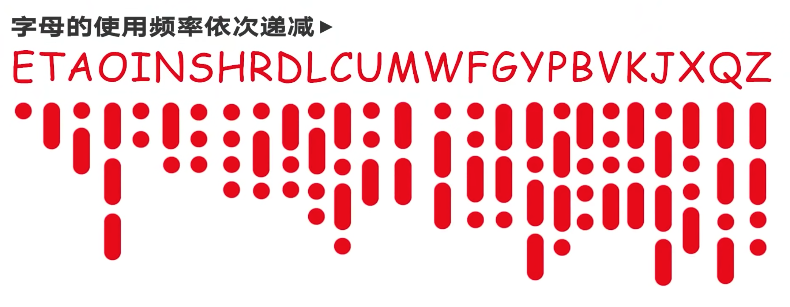
    <figcaption>摩尔斯电码</figcaption>
  </figure>
- <figure>
    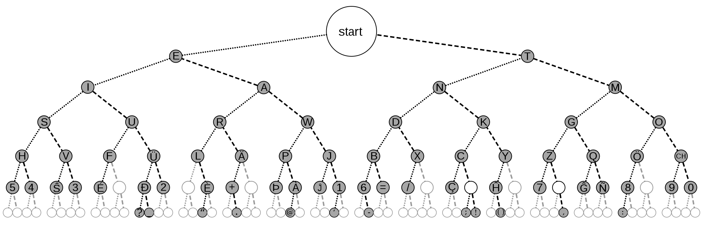
    <figcaption>摩尔斯电码树状图</figcaption>
  </figure>

如上图所示，摩尔斯电码也可以通过二叉树表示，左子树为点（`·`），右子树为划（`-`），直到到达所需要表示的字符为止。

## 布莱叶盲文

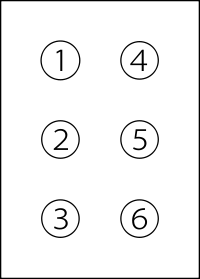{ align=left width=10% }
布莱叶盲文由 6 个点阵排列组成，每个点阵有凸与平两种状态，共能表示 64 种字符。

当部队需要无声交流的时候，即使光线很暗，士兵们也可以通过布莱叶盲文互相传递信息。

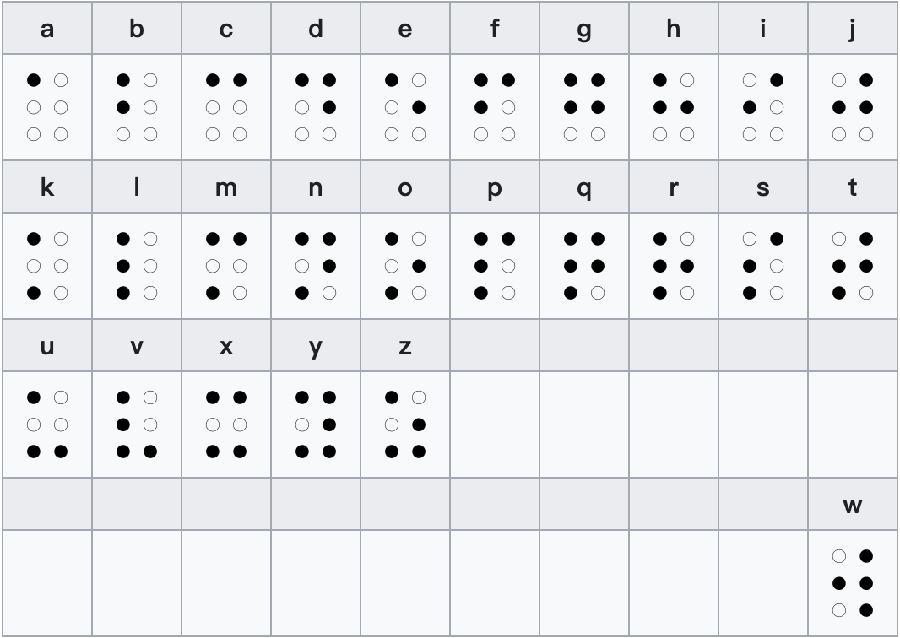{ align=right width=40% }
表中第一行只用 1、2、4、5 四个点，第二行由第一行加 3 点而得，第三行除 “w” 外其余均由第一行加 3、6 点而得，第四行由第一行加 6 点而得。第一行十个字母的符形也有一定规律，前三个字母（abc）和元音字母（aei）只有一个或两个凸点，第 4、6、8、10 个字母（dfhj）有三个凸点，剩下的 g 有四个凸点。

> 图片来自 [盲文-维基百科](https://zh.wikipedia.org/zh-cn/%E7%9B%B2%E6%96%87)

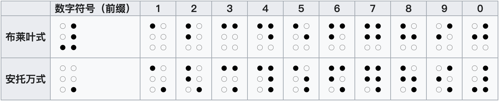{ align=left width=50% }
阿拉伯数字表示法有布莱叶和安托万两种。布莱叶式比较常用，英语盲文、汉语盲文等众多盲文都使用这种形式；安托万式主要用于法语盲文。

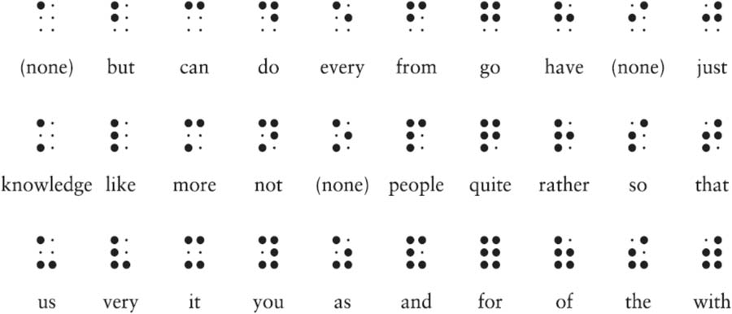{ align=right width=50% }
二级布莱叶盲文使用了很多缩写，以便于保存树型结构和提高阅读速度。

## 十进制

最开始，人们用自己的手指来计数。如果我们人类有 8 个或 12 个手指，那么我们的计数方式就会和现在有所不同。英语中 Digit（数字）这个词同时也有手指、脚趾的意思，并且还有数字的意思，这并不是巧合。而 five（五）和 fist（拳头）这两个单词的拥有相同的词根也是同样的道理。

波斯数学家穆罕默德·伊本穆萨·奥瑞兹穆（根据这个人的名字衍生出英文单词“algorithm”，算法）将阿拉伯数字带入西方。

小小的一个零无疑是数字和数学史上最重要的发明之一。

42,705.684 用 10 的幂来表示就是：$4×10^4+2×10^3+7×10^2+0×10^1+5×10^0+6×10^{-1}+8×10^{-2}+4×10^{-3}$$4×10^4+2×10^3+7×10^2+0×10^1+5×10^0+6×10^{-1}+1×10^{-2}$

101101011010 用 2 的幂来表示就是：$1×2^{11}+0×2^{10}+1×2^9+1×2^8+0×2^7+1×2^6+0×2^5+1×2^4+1×2^3+0×2^2+1×2^1+0×2^0$

## 条形码

### UPC

我们日常生活中最常用的二进制表现形式就是通用产品代码（UPC，Universal Product Code），使用扫码枪扫描商品的条码，扫码枪读取的 UPC 断面如图所示， 通过黑白条块表示二进制信息，再根据编码表解读其中的商品编号，从而获得价格等商品属性信息。

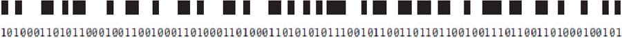

### 条形码的结构

<figure markdown>
  { width=50% }
  <figcaption>条码结构（图自 https://youtu.be/XW8sgT_D0To）</figcaption>
</figure>

- 起始码与终止码：所有条码的固定开头与结尾，代表 101，相同的起始与结束符允许条码正、反扫描，同时让扫码器得知最细宽度，从而得知二、三、四倍宽度，这样就可以让条形码无论以什么比例印刷，都可以正确读取
- 系统码：用于表示商品分类，如 0 表示普通 UPC，2 表示农产品等
- 中间码：作为左右编码的分隔，可防止条形码被篡改或印刷错误，如果无法找到中间码，则无法对条码进行正确解码
  { align=right width=50% }
- 数据码：条形码的主要内容，中间码左右分别有 6 组比特串，每组中含有 7 个比特位。有趣的是，中间码左右的数据码有不同的编码规则，即左侧 1 的个数是奇数，并以 0 开始，以 1 结尾；右侧编码则是左侧编码的反码，1 的个数为偶数，并以 1 开始，以 0 结尾，这样，当扫码枪从左往右扫描到偶数个 1 时，即可确认扫反了，先将二进制位按右侧解码，再按左侧解码即可，最后还原出真实的的条码
  { align=right width=50% }
- 检查码：校验前边 11 位数据是否正确，就像身份证号的最后一位一样。其计算规则如下：
    - $CC=3×(1+2+5+8+8+0)+(1+6+2+1+3)=3×24+13=85$
    - $C=90-85=5$ （90 为大于 85 的最小 10 的整倍数）

### 优缺点

优点：

- 可靠性强。条形码的读取准确率远远超过人工记录，平均每 15000 个字符 才会出现一个错误
- 效率高。条形码的读取速度很快，相当于每秒 40 个字符
- 易于制作。条形码的编写很简单，制作也仅仅需要印刷 ，被称作为「可印刷的计算机语言」
- 易于操作。条形码识别设备的构造简单，使用方便
- 成本低。与其它自动化识别技术相比较，条形码技术仅仅需要一小张贴纸和相对构造简单的光学扫描仪，成本相当低廉

条形码的缺点：

- 条形码的数据容量太小了，二维码则以矩阵形式承载了更多的信息

### FAQ

扫码枪只需要扫描很少的连续一行，为什么还要把条码印刷的那么大？

我们之所以将条码印刷的大于扫码枪的需要面积，是为了增大条码的容错性，即使部分的条码被污损，我们仍然可以正确读取内容。

- <figure>
    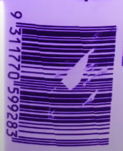
    <figcaption>被污损的条码</figcaption>
  </figure>
- <figure>
    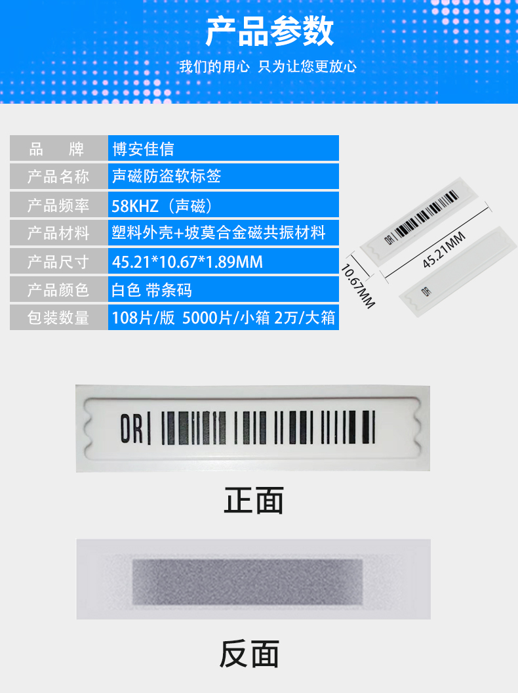
    <figcaption>磁性防盗条码</figcaption>
  </figure>

条形码是否具有防盗的作用？

普通印刷的条码并没有防盗的功能，条码的作用是将下方的数字编码用二进制的方式显示，通过 OCR 快速扫描读取，省去了手工输入的麻烦。当条码无法读取，或系统中不存在时，仍需手动输入编码。当然，也有专用的磁性条码。

## 字节

为什么一个字节是八个二进制位？

全世界大部分书面语言（除了中文、日文以及韩文中使用的象形文字体系）的基本字符数都少于 256，所以字节是一种理想的保存文本的手段。字节同样适合表示黑白图像中的灰度值，这是由于肉眼能区分的灰度约为 256 种。当一个字节无法表示所有信息（如刚提到的中文、日文以及韩文中使用的象形文字体系等），我们只需采用两个字节——就可以表示 216 也就是 65536 个不同的物体——这也是一种很好的解决方案。

- MB（megabyte，mega 希腊语意为宏大）
- GB（gigabyte，giga 希腊语意为巨大）
- TB（terabyte，teras 希腊语意为巨人）

## 计算机发展史：从算盘到芯片

计算机并不是一蹴而就的，后人不断在前人的研究基础上，才最终有了今天的形态，如差分机（大型机械加法器）、解析机（接近于计算机，包含存储部件与运算部件）、美国人口普查局 Herman Hollerith 为了完成统计数据而发明的穿孔机（之后创建 IBM）、图灵为了破译二战时德国情报的 Enigma 机、世界首台计算机 ENIAC（由真空管组成）。

> [Enigma 工作原理](https://www.youtube.com/watch?v=ybkkiGtJmkM)

在这个过程中，有许多先贤做出了巨大的贡献，如图灵的论文中的图灵机，与图灵测试，冯·诺依曼所提出的计算机基础架构、克劳德·香农提出位的概念。

二十世纪五十年代之后的美国，引领了全球信息化的发展。在硬件方面，贝尔实验室发明了晶体管，然后晶体管之父 William Shockley 从贝尔实验室离职并创立了肖克利实验室，然后摩尔等 8 人因不满 Shockley 的管理方法，离职并在 1957 年创立了仙童半导体公司，之后摩尔从仙童离职并在 1968 年创立 Intel，乔布斯则在 1976 年创立了 Apple。在软件方面，贝尔实验室在 1970 年诞生了 Unix 操作系统和 C 语言，比尔盖茨在 1975 年创立微软，赫尔辛基的大学生 Linus 在 1991 年发布了 Linux，1994 年杨致远创立了 Yahoo 标志着互联网时代的来临，1998 年佩奇和布林创立 Google 标志着海量信息检索时代来临，而 2007 年 iPhone 的问世则标志着移动互联网的开始。

回顾信息化革命的发展阶段，美国在蓬勃发展的时候，中国则正忙于三反五反、反右运动、大跃进、上山下乡、三年大饥荒、十年文革等政治运动，这些运动不仅造成了人才的断层，动荡的社会环境也导致了百业凋敝，直至 1978 年逐步改革开放才有所缓解。

总线传输的信号类型：

1. 地址信号：通常是 CPU 对 RAM 寻址操作
2. 控制信号：如 CPU 将数据写入内存
3. 数据输入信号
4. 数据输出信号

## 存储介质

磁带虽然在数据的保存期限上具有优势，但无法快速地移动到磁盘的任一位置，它**只能顺序访问**，频繁地快进和倒带会花费很多时间。

磁带的缺点是不能提供硬盘或半导体存储器那样的快速访问，但是磁带有很多其他优势。首先，磁带存储更节能。一旦记录了所有数据，磁带就会安静地放在磁带库的插槽中，根本不消耗任何电量。磁带也非常可靠，错误率比硬盘低四到五个数量级。磁带非常安全，具有内置的动态加密和介质本身提供的额外安全性。毕竟，如果磁带未安装在驱动器中，就无法访问或修改数据。

磁带还有经济优势。磁带存储的成本，是磁盘上存储相同数据量成本的六分之一

| 介质 | 最大容量 | 寿命   | 优势                                                                                                                                                                                                               | 劣势                                                                                                 |
| ---- | -------- | ------ | ------------------------------------------------------------------------------------------------------------------------------------------------------------------------------------------------------------------ | ---------------------------------------------------------------------------------------------------- |
| SSD  | 1TB      | 十年   | 1. 相比 HDD 有良好的随机读写性能 2. 低功耗 3. 抗震动 4. 无噪音                                                                                                                                            | 1. 寿命较短 2. 受静电影响较大 3. 数据恢复难度较大 4. 长期不通电数据易失 5. 容量较小      |
| HDD  | 16TB     | 十几年 | 1. 容量大，单个硬盘可达几十 TB 2. 廉价 3. 高效的读写效率 4. 读写设备较为普及 5. 数据恢复较为容易                                                                                                       | 1. 寿命较短 2. 震动易损                                                                           |
| 光盘 | ~50GB    | 几年   | 1. 防水 2. 光存储，不受电磁干扰、震动影响                                                                                                                                                                       | 1. 易损。表面磨损或氧化等 2. 寿命不稳定。受环境影响较大 3. 读写速度慢 4. 大多数是一次性写入 |
| 磁带 | 330TB    | 几十年 | 1. 节能。存储后无需消耗任何电量 2. 可靠。错误率比硬盘低 4 到 5 个数量级 3. 安全。如果磁带未安装在驱动器中，就无法访问或修改数据，从物理上避免黑客攻击的风险 4. 廉价。是磁盘上存储相同数据量成本的六分之一 | 1. 不支持随机访问数据，只能顺序访问 2. 磁带机设备昂贵 3. 读写速度慢                            |

## 浮点数

IEEE 浮点数标准定义了两种基本的格式：以 4 个字节表示的单精度格式和以 8 个字节表示的双精度格式。

- <figure>
    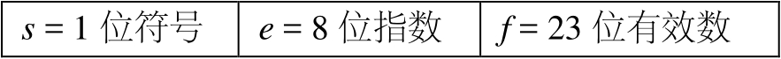
    <figcaption>单精度浮点数格式</figcaption>
  </figure>
- <figure>
    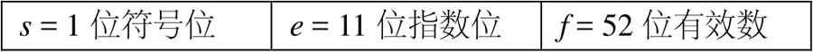
    <figcaption>双精度浮点数格式</figcaption>
  </figure>

!!! question "为什么计算机无法精确存储和计算小数？"

    主要有两个原因：

    1. **进制转换导致的无限循环**（最常见）：很多在十进制下是有限的小数（如 `0.1`），在二进制下是**无限循环小数**（$0.1_{10} = 0.000110011..._2$）。因为二进制只能精确表示分母为 $2^n$ 的分数。
    2. **无理数的无限不循环性**：像 $\pi$ 或 $\sqrt{2}$ 这样的无理数，在任何进制下都是无限不循环小数，自然无法完全精确存储。

    无论是无限循环还是不循环，由于计算机（如 IEEE 754 浮点数）的存储位数是有限的（如 32 位或 64 位），必须对超出部分进行**舍入（Rounding）**，这就产生了微小的精度误差。

## 编程语言发展

- FORTRAN 语言是目前仍在使用的最古老的高级语言。
- COBOL 是第一个成功地为商务系统所使用的程序设计语言。
- BASIC（Beginner’s All-purpose Symbolic Instruction Code）由 Dartmouth 大学为分时系统设计，Bill Gates 在 1975 年曾为 Altair 880 编写了 BASIC 解释器，并于同一年创立微软公司。
- Ada 是为美国国防部开发的语言（由 Pascal 及其它语言扩展而成），以纪念 Ada Lovelace。
- C 语言是由贝尔实验室开发，作为 B 语言的后继者。由于 C 语言充分考虑了可移植性，因此风靡一时
- 所有的类 ALGOL 语言（即大多数常用程序设计语言）其设计模式都是基于冯·诺依曼计算机体系的，而 LISP 则是一种非冯·诺依曼计算机体系的程序语言，主要用于人工智能领域。

早期的程序设计对编程人员的要求很高，所以很多早期的程序员都是科学家或工程师，他们通常利用 FORTRAN 或 ALGOL 中的数学算法来描述并解决各自领域的问题。回顾程序设计语言发展的整个历程时，我们会发现，人们一直在努力开发一种能为更大范围的人群所使用的语言。如今，计算机已走入千家万户，编程开发也不再曲高和寡，智能手机让下到三岁儿童，上至七十老翁都能快速上手。互联网在如今的生活中已经像水和空气一样重要。

流动的信息（数据）才有价值。

## 面向对象程序

在面向对象的程序（Object-Oriented Programming，OOP）设计中，和冯·诺依曼计算机的体系结构所不同的是，对象（object）实际上是**代码和数据的组合**。在对象内部，与其相关联的代码决定了数据存在的意义，要理解数据的存储方式首先需要理解代码。对象如果需要与其他对象通信，则通过发送或接收消息（message）来实现这一过程，比如一个对象可以通过给另一个对象发送指令来获得相应信息。

MIDI 协议是能将乐器的输出数字化的手段，后期可以在电脑上对结果进行润色。
