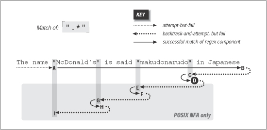
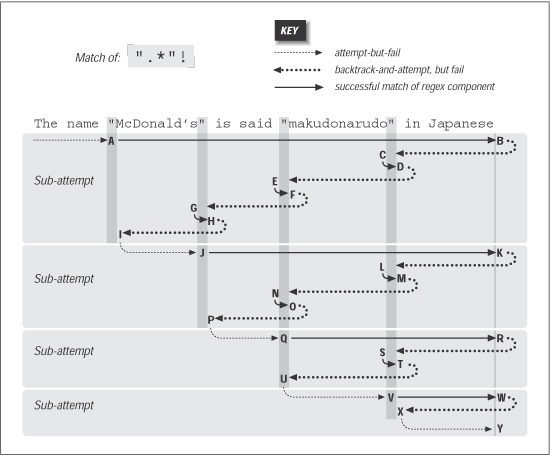
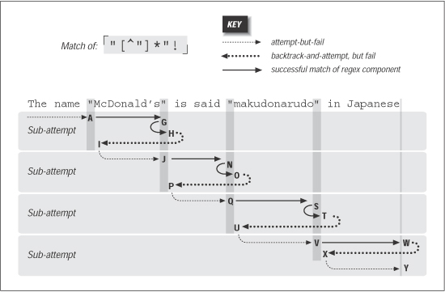

# 《精通正则表达式》（第3版）

!!! abstract "阅读信息"

    - **评分**：⭐️⭐️⭐️⭐️
    - **时间**：02/23/2025 → 03/09/2025
    - **读后感**：在AI流行的2025年阅读此书，其中的不少章节已经过时（比如Perl、PHP），相比那些在线互动式教学而言，书本阅读显得效率很低，但其中关于正则表达式的原理和优化部分仍然很有价值。

## Reference

交互式入门：https://regexlearn.com/zh-cn

可视化工具

- https://regex-vis.com/
- https://regexper.com/

正则验证：

- https://regex101.com/
- https://regexr.com/

## Basic

<figure align="center">
    
</figure>

### 元字符与优先级

| 字符与集合         | 含义                            | 数量限定与排布              | 含义说明                                                        |
| :----------------- | :------------------------------ | :-------------------------- | :-------------------------------------------------------------- |
| `.`                | 除换行符外的任意字符            | `*` (greedy) / `+` (greedy) | ≥ 0 次 / ≥ 1 次                                                 |
| `\w` / `\W`        | 字母、数字、下划线 / 非该类字符 | `?` (lazy)                  | 0 或 1 次                                                       |
| `\s` / `\S`        | 任意空白字符 / 非空白字符       | `{n}` / `{n,}` / `{n,m}`    | n 次 / ≥ n 次 / n ~ m 次                                        |
| `\d` / `\D`        | 数字 / 非数字字符               | `(?=exp)` / `(?!exp)`       | **正向**肯定 / 否定预查 (Lookahead)                             |
| `[abc]` / `[^abc]` | 字符集 / 否定字符集             | `(?<=exp)` / `(?<!exp)`     | **反向**肯定 / 否定预查 (Lookbehind)                            |
| `[a-z]`            | 连续范围                        | **匹配优先级** (高 ➔ 低)    | `\` ➔ `()`, `[]` ➔ `*, +, ?, {}` ➔ `^, $` ➔ <code>&#124;</code> |

### 零宽断言

正向预查（Lookahead）和反向预查（Lookbehind）分别表示向前和向后探查匹配，**使用临时指针完成探查**。

**零宽断言（Lookaround，包括 Lookahead 和 Lookbehind）不消耗字符**，这也就是零宽的含义。**通常用于根据字符串中其他部分的内容来匹配文本，但无需将那些内容包含在匹配结果中**。比如密码强度验证、货币格式校验、Email格式校验、HTML标签内容提取、注释提取等。

### 捕获组与引用

| 捕获组与引用                                      | 含义                                                            |
| ------------------------------------------------- | --------------------------------------------------------------- |
| `(exp)` （未命名捕获，消耗字符，数组存储）        | 匹配exp，并捕获文本到自动命名的组里                             |
| `(?<name>exp)` （命名捕获，消耗字符，哈希表存储） | 匹配exp，并捕获文本到名称为name的组里，也可以写成`(?'name'exp)` |
| `(?:exp)` （不消耗字符）                          | 匹配exp，不捕获匹配的文本，也不给此分组分配组号                 |
| `\n`                                              | 按捕获序号或名称反向引用捕获组                                  |

使用捕获组的代价是匹配的字符需要存储在内存中，大量捕获会降低效率。如果**只是匹配，而不需要反向引用，使用非捕获组`(?:exp)`可以提高效率。**

| 其他分组语法  | 含义                                                                                                                      |
| ------------- | ------------------------------------------------------------------------------------------------------------------------- |
| `(?>exp)`     | [原子组](https://stackoverflow.com/questions/2973436/regex-lookahead-lookbehind-and-atomic-groups) 可以阻止分组内部的回溯 |
| `(?#comment)` | 注释                                                                                                                      |

在某些语言（如Python）和工具中，启用“忽略模式里的空白符”选项，在编写表达式时能任意的添加空格，Tab，换行，而实际使用时这些都将被忽略。如下所示。

```perl
(?<=    # 断言要匹配的文本的前缀
<(\w+)> # 查找尖括号括起来的内容
        # (即HTML/XML标签)
)       # 前缀结束
.*      # 匹配任意文本
(?=     # 断言要匹配的文本的后缀
<\/\1>  # 查找尖括号括起来的内容
        # 查找尖括号括起来的内容
)       # 后缀结束
```

### 锚点与修饰符

| 锚点 | 含义             |
| ---- | ---------------- |
| `^`  | 字符串或行的开始 |
| `$`  | 字符串或行的结束 |
| `\b` | 单词边界         |
| `\B` | 非单词边界       |

| 修饰符           | 含义                                 |
| ---------------- | ------------------------------------ |
| `i` (ignore)     | 忽略大小写                           |
| `g` (global)     | 全局匹配                             |
| `m` (multiline)  | 使`^`和`$`匹配**每一行**的开头和结尾 |
| `s` (singleline) | 使`.`匹配包括`\n`                    |

不开启m模式时，`^`和`$`只匹配整个字符串的开始和结束，开启后则匹配每行的开始和结束

```perl
# /^Line/g
Line\n <- Matched
Line\n
Line

# /Line$/g
Line\n
Line\n
Line   <- Matched

# /^Line/gm
Line\n <- Matched
Line\n <- Matched
Line   <- Matched

# /Line$/gm
Line\n <- Matched
Line\n <- Matched
Line   <- Matched
```

## Tips

- `^[abc]` 表起始位置为a或b或c，`[^abc]` 表排除指定字符abc。
- 元字符是否需要转义取决于上下文，如`-`在`[]`内需要被转义或放在开头，在`[]`外则不需要；`?*+$`在`[]`外需要被转义，在`[]`内则不需要。
- `[abc]`和`(a|b|c)`作用一样，但`[]`只能匹配单字符，而`(|)`可以匹配多字符，如`(a1|b2|c3)`
- 正则性能优化分为以下两方面（注意性能优化要兼顾可读性）：
  - 步骤
    - 表达式的复杂度
    - 回溯：**回溯是导致性能下降的主要原因**。**回溯是正则表达式引擎在匹配失败时的一种机制**，当正则表达式中的某个部分 (例如，一个分支、一个量词、捕获组) 匹配失败时，引擎会“回溯”到之前的状态，尝试不同的匹配路径。例如 `a*` 引擎可能尝试匹配零个、一个、两个或更多个 "a"。 如果某个选择导致后续匹配失败，引擎会回溯到之前的状态，选择其他数量的 "a”。
    - 贪婪/非贪婪：**贪婪量词 (\*, +) 会导致更多的回溯。** 它们会尽可能多地匹配字符，如果后续的匹配失败，就会回溯来减少匹配的字符数量。**非贪婪量词 (\*?, +?) 会减少回溯。** 它们会尽可能少地匹配字符，减少回溯的次数。
    - 避免量词嵌套**:** **量词的嵌套可能会导致指数级的回溯**
    - 选择结构 (`|`)：更具体的模式放在前面，减少选择的次数
    - 字符类: 使用字符类 (例如, `\d`, `\w`) 代替复杂的字符组合
    - 使用锚点: 使用锚点 (例如 `^`, `$`, `\b`) 可以帮助引擎更快地定位匹配的起始位置
    - 避免过度使用捕获组**:** 非捕获组 `(?:exp)` 更好
  - 内存
    - **捕获组:** 捕获组会存储匹配到的字符，占用内存
    - **字符串的长度:** 匹配的字符串越长，消耗的内存越多
    - **引擎的实现:** 不同的引擎有不同的内存管理方式
- .Net 平衡组可匹配HTML标签和配对符（`{[()]}`）

## Examples

| Type                                                                                                         | RegEx                                                                                                                                                                                                                              | Match                                                                                                                   | Mismatch                                              | Key Point                         |
| ------------------------------------------------------------------------------------------------------------ | ---------------------------------------------------------------------------------------------------------------------------------------------------------------------------------------------------------------------------------- | ----------------------------------------------------------------------------------------------------------------------- | ----------------------------------------------------- | --------------------------------- |
| Email                                                                                                        | `^[\w.-]+@\w+(?:\.\w+)+$`                                                                                                                                                                                                          | [test@example.com](mailto:test@example.com)，user_123@domain.co.uk                                                      | plainaddress，@missinglocalpart.com，user@domain..com | Assertions <br>@后可能有多个.后缀 |
| URL                                                                                                          | `http[s]?:\/{2}[w.]*[a-z]+\.[a-z]+[\/\?=\w]+`                                                                                                                                                                                      | [http://example.com](http://example.com/)，[https://www.example.com/path?query=1](https://www.example.com/path?query=1) | htt://example.com，http://.com                        |                                   |
| IPv4                                                                                                         | Solution1: <code>^(25[0-5]&#124;2[0-4]\d&#124;[01]?\d\d?)(\.(25[0-5]&#124;2[0-4]\d&#124;[01]?\d\d?)){3}$</code><br>Solution2: <code>^((2[0-4]\d&#124;25[0-5]&#124;[01]?\d\d?)\.){3}(2[0-4]\d&#124;25[0-5]&#124;[01]?\d\d?)$</code> | 192.168.0.1，255.255.255.255，<br>0.0.0.0                                                                               | 256.256.256.256，192.168.0.999                        | 拆分为0~199、200~249、250~255处理 |
| Password <br> ①至少有1位大写字母、1位小写字母、1位数字；<br>②允许包含!@#$%等特殊字符；<br>③密码长度至少为8位 | `^(?=.*[a-z])(?=.*[A-Z])(?=.*\d)[\w!@#$%^&\-]{8,}$`<br>`?=.*[a-z]`为正向肯定（Positive Lookahead）语法，`._` 表示字符串的任意位置，`._[a-z]` 表示任意位置包含小写字母                                                              | Password123!<br>Abc123!@                                                                                                | password<br>12345678                                  | Assertions                        |
| Current                                                                                                      | `^(?<!\d)\d{1,3}(,\d{3})*(\.\d{2})?(?!\d)$`                                                                                                                                                                                        | 123,789.99<br>1.01                                                                                                      | 0123,789.99<br>123,6789.99<br>123,789.999             | Assertions                        |
| Duplicate Check                                                                                              | `^\b(\w+)\b\s+\1\b$`                                                                                                                                                                                                               | kitty kitty                                                                                                             | kitty                                                 | Groups                            |
| Multiple Checks                                                                                              | `^\b(\w+)\b(?:\s+\1\b)+$`                                                                                                                                                                                                          | kitty kitty kitty kitty                                                                                                 | kitty                                                 |                                   |
| Extract HTML Tag’s Content                                                                                   | `(?<=<h1>).*?(?=<\/h1>)`                                                                                                                                                                                                           | `<h1>Hello World</h1>`                                                                                                  | `<p>Hello World</p>`                                  |                                   |
| Extract Comments                                                                                             | `(?<=\/\/).*`                                                                                                                                                                                                                      | // I’m comment                                                                                                          | I’m comment                                           |                                   |
| **24-hour clock**                                                                                            | <code>(?:0?\d&#124;1\d&#124;2[0-3]):[0-5]\d</code>                                                                                                                                                                                 | 00:00<br>23:59                                                                                                          | 24:00                                                 |                                   |
| **12-hour clock**                                                                                            | <code>/^(?:0?\d&#124;1[0-2]):[0-5]\d[ap]m$/gm</code>                                                                                                                                                                               | 12:00am<br>12:00pm<br>11:59am                                                                                           | 13:00am                                               |                                   |

## 支持正则表达式的 Linux 命令

| 命令                                          | 描述                                                                                                                                                                                        |
| --------------------------------------------- | ------------------------------------------------------------------------------------------------------------------------------------------------------------------------------------------- |
| `grep` <br> (global regular expression print) | 全局文本搜索 `grep "pattern" filename`<br>`-E` 表使用扩展正则表达式<br>`-P` 表使用Perl兼容正则表达式（PCRE）<br>`-i` 忽略大小写<br>`-o` 仅输出匹配的部分<br>`-v` 反向匹配（显示不匹配的行） |
| `sed`                                         | 替换、删除、筛选                                                                                                                                                                            |
| `awk`                                         | 高级文本处理                                                                                                                                                                                |
| `find`                                        | 按文件名匹配                                                                                                                                                                                |
| `egrep`                                       | 相当于 grep -E                                                                                                                                                                              |

## DFA & NFA

|                                      | **DFA（Deterministic Finite Automaton，确定性有限自动机）**                            | **NFA（Nondeterministic Finite Automaton，非确定性有限自动机）**                                                           |
| ------------------------------------ | -------------------------------------------------------------------------------------- | -------------------------------------------------------------------------------------------------------------------------- |
| **回溯、捕获组、零宽断言、反向引用** | ✗                                                                                      | ✓                                                                                                                          |
| **时间复杂度**                       | $O(n)$ （**一条道走到黑**）                                                            | 可能为 $O(2^n)$ （**穷尽所有可能**）<br>https://blog.cloudflare.com/zh-cn/details-of-the-cloudflare-outage-on-july-2-2019/ |
| **支持的编程语言**                   | Golang                                                                                 | PCRE、JavaScript、Python、Java、.NET、sed、awk 等                                                                          |
| **内部实现**                         | 状态机（每个输入字符在当前状态下只有唯一的下一个状态）                                 | 状态图（在某个状态下，相同输入可能有多个可能的下一个状态）                                                                 |
| **适用场景**                         | - 高效处理大文本，无需回溯<br>- 词法分析（如编译器、垃圾右键过滤）<br>- 匹配时间可预测 | - 需要复杂匹配（捕获组、环视、反向引用）                                                                                   |

搜索时（如grep）使用DFA与NFA结合：尽可能使用DFA，只有在使用反向引用时再切换到NFA。

## Backtracking

<div align="center">
  <table>
    <tr>
      <td align="center"  style="vertical-align: bottom;">
        <br />
        <br /><sub class="img-caption">Successful match of ".*"</sub><br />
      </td>
      <td align="center" style="vertical-align: bottom;">
        <br />
        <sub class="img-caption">Failing attempt to match ".*"!</sub>
      </td>
      <td align="center" style="vertical-align: bottom;">
        <br />
        <sub class="img-caption">Failing attempt to match "[^\"]*"!</sub>
      </td>
    </tr>
  </table>
</div>
