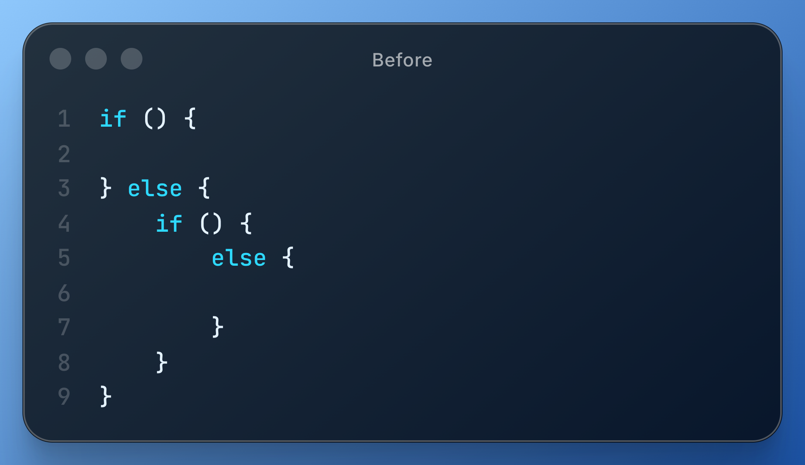
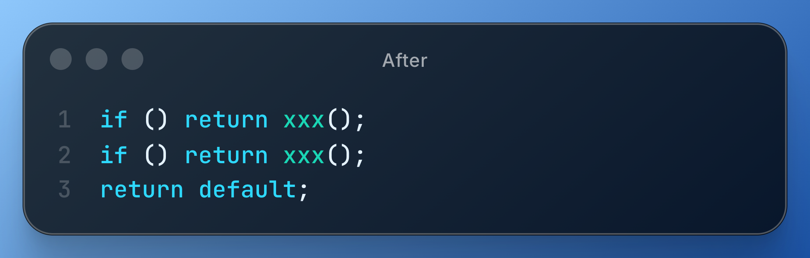

# 《重构》（第一版）

!!! abstract "阅读信息"

    - **评分**：⭐️
    - **时间**：06/26/2021 → 06/30/2021
    - **读后感**：下班时间挑着读了 2、3、6、10 章，第 2、3 章的价值较大，其余章节难以卒读。想要写出优雅的代码，私以为还是要多阅读优秀的开源项目，多实践练习。

重构不是重写，但大多数人都将二者混为一谈，直到项目病入膏肓才不得不推倒重来。真正的重构应当伴随日常编码持续进行，让代码始终跟上业务的演进，保持清晰与优雅。

**程序有两面价值："今天可以为你做什么"和"明天可以为你做什么"。** 大多数时候，我们都只关注自己今天想要程序做什么。不论是修复错误或是添加特性，我们都是为了让程序能力更强，让它在今天更有价值。但是系统当下的行为，只是整个故事的一部分，如果没有认清这一点，你无法长期从事编程工作。如果你为求完成今天的任务而不择手段，导致不可能在明天完成明天的任务，那么最终还是会失败。

设计良好的代码：

1. 易于阅读和理解
2. 所有逻辑都只在唯一地点指定
3. 新的改动不会危及现有行为
4. 尽可能简单表达条件逻辑

良好的接口只向用户展现必须展现的东西。

借债就得付利息，过于复杂的代码所造成的维护和扩展的额外成本就是利息。你可以承受一定程度的利息，但如果利息太高你就会被压垮。把债务管理好是很重要的，你应该随时通过重构来偿还一部分债务。

## 为什么要重构？

1. **改进软件设计**，比如消除重复代码。
2. **使软件更容易理解**。代码 80% 的时间用于阅读，20% 的时间用于运行，易于理解的代码能够提高有效产出。
3. **帮助找到 bug**。检查代码能更高效地发现 bug。
4. **提高编程速度**。事实上，拥有良好设计才可能做到快速开发。如果没有良好设计，或许某一段时间内你的进展迅速，但恶劣的设计很快就让你的速度慢下来。你会把时间花在调试上面，无法添加新功能。修改时间越来越长，因为你必须花越来越多的时间去理解系统、寻找重复代码。随着你给最初程序打上一个又一个的补丁，新特性需要更多代码才能实现。

良好设计是维持软件开发速度的根本。重构可以帮助你更快速地开发软件，因为它阻止系统腐败变质，它甚至还可以提高设计质量。

## 何时开始重构？

重构本来就不是一件应该特别拨出时间做的事情，重构应该随时随地进行。你不应该为重构而重构。

1. **添加功能时**
2. **修复 bug 时**
3. **Code Review 时**。有助于在开发团队中传播知识，也有助于让较有经验的开发者把知识传递给比较欠缺经验的人，并帮助更多人理解大型软件系统中的更多部分。CR 时不仅要写出开发者自己能懂的代码，也要能让审阅者看懂。CR 人员最好是小组内成员，了解相关背景，降低沟通成本（结对编程）。较复杂的 CR 时，直接展示代码往往不是最佳办法，需要结合 UML 讲解。

## 如何说服领导？

受进度驱动的经理要我尽可能快速完事，至于怎么完成，那就是我的事了。

## 代码的坏味道

- **重复的代码**
- **过长函数**。如果代码前有一行注释，就是在提醒你，可以将这段代码替换为一个函数。
- **过大的类**。如果类内的数个变量有着相同的前缀或字尾，这就意味有机会把它们提炼到某个组件内。
- **过长的参数列表**
- **发散式变化**。一个类受多种变化的影响。
- **霰弹式修改**。一种变化引发多个类相应修改。如果需要修改的代码散布四处，你不但很难找到它们，也很容易忘记某个重要的修改。
- **依恋情结**。OOP 是将数据和对数据的操作行为包装在一起。如果某个函数的运行需要某个类中的大量方法，则我们可能需要将此方法放在那个类中。
- **switch 语句**。OOP 一个最明显的特征就是：少用 switch 语句，switch 语句的问题在于重复。大多数时候，一看到 switch 语句，你就应该考虑以多态来替换它。
- **冗余的类**。你所创建的每一个类，都得有人去理解它、维护它，这些工作都是要花钱的。如果一个类的所得不值其身价，它就应该消失。
- **夸夸其谈的未来性**。针对未来的扩展性，无需过度过早地设计，未来的业务发展是难以预料的。
- **过多的注释**。良好的代码应该具有自述的能力，当把注释作为除臭剂来使用时，请先尝试重构，试着让所有注释都变得多余。有些特殊场景或业务说明的注释可以用于帮助未来的维护者，避免踩雷。

提炼函数的意义：如果每个函数的粒度都很小，那么函数被复用的机会就更大；如果函数都是细粒度，那么函数的覆写也会更容易些。

## 简化条件表达式

1. **将复杂的 if、else 分别提炼为独立的函数**。大型函数自身就会使代码的可读性下降，而条件逻辑则会使代码更难以阅读。
2. **将具有相同返回的 if 进行合并**，比如代码中验证参数合法性时的条件尽可能使用或。
3. **将 if 与 else 中公共的部分外移**，这样代码才能更清楚地表达哪些东西随条件变化，哪些东西保持不变。
4. **代码中尽可能不要使用 flag 等控制标记来控制循环的结束**，而以 `break`、`continue` 或 `return` 来表示。
5. **以多态来取代条件表达式**。
6. **条件表达式通常有两种表现形式**。第一种形式是：所有分支都属于正常行为。第二种形式则是：条件表达式提供的答案中只有一种是正常行为，其他都是不常见的情况。这两类条件表达式有不同的用途，这一点应该通过代码表现出来。如果两条分支都是正常行为（同等重要），就应该使用形如 `if...else...` 的条件表达式；如果某个条件极其罕见，就应该单独检查该条件，并在该条件为真时立刻从函数中返回。在工作中，我们经常会看到以下类型的嵌套代码：

- <figure>
    
    <figcaption>重构前</figcaption>
</figure>
- <figure>
    
    <figcaption>重构后</figcaption>
</figure>

这样的嵌套代码让人难以理解，到底哪里才是关注点？大量嵌套的判断让非正常情况的检查掩盖了正常情况的检查。很多这样的代码可以优化为右侧的卫语句形式，也许只是把判断条件进行反转就可以。

## 简化函数调用

1. **重命名函数名**。代码首先是为人写的，其次才是为计算机写的。
2. **简化参数列表**：
    1. 如果多个参数来自于同一个对象，则可以通过保持整体对象将它们替换为单一对象；
    2. 如果函数参数来自该函数可获取的一个对象，则可以通过方法来避免传参；
    3. 如果某些参数被用来在条件表达式中做选择依据，则可以将该参数提取为方法；
    4. 如果有这样的两个函数：它们做着类似的工作，但因少数几个值致使行为略有不同。在这种情况下，你可以将这些各自分离的函数统一起来，并通过参数来处理那些变化情况，用以简化问题。这样的修改可以去除重复的代码，并提高灵活性，因为你可以用这个参数处理更多的变化情况。

## 二八原则

- 20% 的代码耗费了 80% 的运行时间
- 20% 的时间用于运行，80% 的时间用于阅读维护