# 《系统设计面试》（卷 1）

!!! abstract "阅读信息"

    - **评分**：⭐️⭐️⭐️⭐️⭐️
    - **时间**：6/4/2026 → 6/20/2026
    - **读后感**：

## 第一部分：系统设计基础

### 1.1 概览与核心组件

现代分布式系统的核心构建块通常包括以下组件：

- **负载均衡器 (Load Balancer)**：分发网络流量，避免单点过载，提供系统的高可用性与可伸缩性。
- **缓存 (Cache)**：如 Redis、Memcached，用于缓解数据库读压力，提供极低延迟的数据读取。
- **内容分发网络 (CDN)**：将静态资源（如图片、视频、静态文件）分发到地理位置更靠近用户的边缘节点，降低访问延迟。
- **数据库 (Database)**：用于数据的持久化。通常结合主从架构（读写分离）或分库分表（Sharding）来支撑高并发和海量数据。
- **数据中心 (Data Center)**：跨地域部署的物理数据基础设施，提供异地多活和就近接入能力。
- **消息队列 (Message Queue)**：如 Kafka、RabbitMQ，用于系统间的异步解耦、削峰填谷，以及微服务之间的事件驱动通信。
- **可观测性 (Observability)**：包括集中式日志（Logging）、指标监控（Metrics）、链路追踪（Tracing）和自动化告警系统。

### 1.2 估算与推导模板

在系统设计面试中，估算旨在评估你对数据量级、计算瓶颈、网络带宽和存储需求的量化分析能力。无需追求绝对精确，重点在于展示出清晰严密的推导逻辑。

#### 基础常识

##### 数据量级换算

| 单位   | 字节数 (Bytes) | 2 的幂次 | 常见参考实例               |
| :----- | :------------- | :------- | :------------------------- |
| **KB** | $10^3$ B       | $2^{10}$ | 一页纯文本 ≈ 2 KB          |
| **MB** | $10^6$ B       | $2^{20}$ | 一张普通照片 ≈ 2 - 5 MB    |
| **GB** | $10^9$ B       | $2^{30}$ | 一部超清电影 ≈ 2 - 4 GB    |
| **TB** | $10^{12}$ B    | $2^{40}$ | 单块消费级机械硬盘容量     |
| **PB** | $10^{15}$ B    | $2^{50}$ | 大型互联网公司日处理数据量 |

##### 延迟数据

- **L1 缓存读取**：0.5 ns
- **分支预测失败**：5 ns
- **L2 缓存读取**：7 ns
- **互斥锁加锁/解锁**：25 ns
- **内存读取 (RAM)**：100 ns
- **SSD 随机读取**：16,000 ns (16 µs)
- **在 1 Gbps 网络中发送 1 MB 数据**：10,000,000 ns (10 ms)
- **同数据中心内网络往返 (RTT)**：500,000 ns (0.5 ms)
- **跨洋光缆往返 (如中美)**：150 ms

!!! Tip "延迟数据核心结论"

    1. 内存读取速度是磁盘/SSD 读取速度的 100 到 1000 倍以上。
    2. 网络传输是分布式系统的最大瓶颈，尽量避免跨地域（WAN）的同步阻塞网络调用。
    3. 读写顺序数据的性能远好于随机读写。

#### 估算推导模板

我们以社交媒体发帖/微博为例：

1. **确定用户基数与行为特征**：

    - 日活跃用户 (DAU) = 3 亿 (300M)。
    - 用户平均每天浏览信息流 (Feed) = 50 次。
    - 用户平均每天发帖 (Write) = 2 次。

2. **写入 (发帖) QPS 估算**：

    $$
    \begin{aligned}
        &\text{Average QPS} = \frac{3 \times 10^8 \times 2}{86400 \text{ 秒}} \approx 6,944 \text{ QPS} \\
        &\text{Peak QPS} \approx 2 \times \text{Average QPS} \approx 14,000 \text{ QPS}
        \end{aligned}
    $$

3. **读取 (浏览) QPS 估算**：

    $$
    \begin{aligned}
        &\text{Average QPS} = \frac{3 \times 10^8 \times 50}{86400 \text{ 秒}} \approx 173,600 \text{ QPS} \\
        &\text{Peak QPS} \approx 2 \times \text{Average QPS} \approx 350,000 \text{ QPS}
        \end{aligned}
    $$

4. **存储容量估算**：

    - 单条帖子数据：文本内容 (100 字符 ≈ 200 Bytes) + 元数据 (如用户 ID、发帖时间等 100 Bytes) ≈ 300 Bytes。
    - 假设 10% 的帖子包含 1 张图片（平均 1 MB），1% 的帖子包含短视频（平均 10 MB）。
    - 每日新增文本存储：$6\text{亿条} \times 300\text{ B} = 180\text{ GB}$。
    - 每日多媒体存储：
        - 图片：$6\text{亿条} \times 10\% \times 1\text{ MB} = 60\text{ TB}$。
        - 视频：$6\text{亿条} \times 1\% \times 10\text{ MB} = 60\text{ TB}$。
    - **总存储增量**：每天约增加 120 TB 存储空间。5 年期存储需预备 $\approx 220\text{ PB}$（未计副本与多版本）。

5. **带宽 (Bandwidth) 估算**：

    - 出口带宽（主要由浏览产生）：
        - 假设用户浏览时，只有 10% 的时间加载图片，1% 的时间加载视频。
        - 平均每秒浏览数据量：$\text{Read QPS} \times \text{平均单条大小}$。
        - 近似估算出口带宽需求在数百 Gbps 级别，需高度依赖 CDN 分发多媒体资源。

### 1.3 数据库与分片策略

#### 数据库选型对比

| 类型       | 代表数据库                                                                                                      | 优势与特点                                                                                                                                                                                                                 | 劣势与挑战                                                                                                                                                                                                                       | 设计哲学                                                                    |
| :--------- | :-------------------------------------------------------------------------------------------------------------- | :------------------------------------------------------------------------------------------------------------------------------------------------------------------------------------------------------------------------- | :------------------------------------------------------------------------------------------------------------------------------------------------------------------------------------------------------------------------------- | :-------------------------------------------------------------------------- |
| **关系型** | MySQL、PostgreSQL、Oracle 等                                                                                    | - **强一致性**：支持严格的 ACID 事务，保障关键数据的实时准确。<br>- **结构化约束**：强类型与严格的数据范式（Schema），提供主外键、空值等表级约束。<br>- **规范化查询**：基于标准的 SQL，支持复杂的关联查询（JOIN）。       | - **水平扩展难**：主要依赖单机垂直提升硬件，分库分表改造复杂度极高。<br>- **Schema 固化**：大表修改字段（DDL）代价昂贵，不适合存储非结构化数据。<br>- **并发瓶颈**：行/表级锁机制在大并发下易造成锁等待，高频磁盘 I/O 成为瓶颈。 | 牺牲灵活性与水平扩展性，换取强一致性与数据完整性。                          |
| **NoSQL**  | MongoDB、CouchDB（文档型）<br>Redis、DynamoDB（键值型）<br>Cassandra、HBase（列族/宽表型）<br>Neo4j（图数据库） | - **高扩展性**：天然支持水平分区与横向扩展，易于向集群添加节点。<br>- **模式灵活 (Schemaless)**：无需预先定义表结构，完美适配半结构化与高变动数据。<br>- **极速读写**：基于内存或对写入友好的 LSM 树，轻松应对十万级 QPS。 | - **一致性较弱**：受 CAP 定理限制，多采用最终一致性（Eventual Consistency）。<br>- **查询受限**：不支持复杂的 JOIN 操作，需要在应用层进行逻辑关联。<br>- **事务支持弱**：大多只支持单文档/单行级事务，跨分片事务实现极其复杂。   | 依据 CAP 定理，牺牲强一致性与复杂关联，换取极致的扩展性、柔性架构与高性能。 |

#### 数据分片与一致性哈希

在数据库分片（Sharding）中，为了让数据尽可能均匀分布，最直接的方式是对分片键（Sharding Key）取模来确定数据的落点。但一旦节点发生增减，取模基数改变，会导致几乎所有数据都需要重新映射，引发数据迁移风暴。针对该问题，通常有以下两种解决方式：

1. **翻倍扩容**：每次扩容时将节点数量翻倍（如 2 节点扩为 4 节点），这样只需要迁移 50% 的数据，使得迁移规模高度可控且可预测。
2. **一致性哈希 (Consistent Hashing)**：
    - 将物理服务器节点和数据 Key 同时映射到一个大小为 $2^{32}-1$ 的哈希环上，数据沿顺时针方向落入最近的节点。
    - **虚拟节点 (Virtual Nodes)**：若节点在环上分布不均，会导致严重的数据倾斜。为此，引入虚拟节点将每个物理节点映射成多个虚拟点均匀散布在环上，以平衡负载。
    - **架构对比**：Memcached 客户端路由与 Cassandra/DynamoDB 使用了一致性哈希环；而 Redis Cluster 则采用了**哈希槽 (Hash Slots)** 机制（数据被划分为 16384 个槽分管给不同节点），属于一种预分片（Pre-sharding）方案，虽然技术实现不同，但均达到了平滑扩缩容的目的。

{ width=70% }

对于极少数被高频访问的**热点 Key (Hotspot Key)**（例如微博名人热帖），即使合理分片仍可能导致单个分片节点过载。对此类热点 Key 需要采用单独拆分存储、多副本分散读取，或配合多级本地缓存进行处理。

### 1.4 分布式一致性与容错

在分布式多副本架构中，系统必须在 CAP（一致性、可用性、分区容错性）之间权衡，从而衍生出不同的数据一致性模型。

#### 一致性级别

- **强一致性 (Strong Consistency)**：更新操作完成后，任何后续读取都能立即获取最新值。这通常需要使用 Raft/Paxos 协议或分布式锁，但会牺牲一部分系统的延迟和可用性。
- **最终一致性 (Eventual Consistency)**：弱一致性的特例。不保证后续读取立即看到最新值，但保证在没有新更新的前提下，所有副本最终会同步一致。高可用数据库（如 DynamoDB）多采用该模型。

#### 数据冲突解决与版本控制

在多节点并发写入且采用最终一致性时，必然面临数据版本冲突的问题：

- **最后写入者胜 (Last-Write-Wins, LWW)**：依靠物理时钟（如 NTP）覆盖较旧的数据。实现简单，但因各服务器时钟难以做到纳米级精确同步，极易造成数据丢失。
- **向量时钟 (Vector Clock)**：一种逻辑时钟，用于在分布式系统中**检测并发冲突**和确定**因果关系 (Causal Relationship)**。通过在数据上附加一个键值对列表 `[服务器ID, 版本号]`，系统能够识别哪些更新具有因果先后关系，哪些更新在时间上是并行的（冲突状态），从而将冲突交由应用层或用户去裁决。
- **无损协同冲突解决**：在在线文档、共享白板等需要语义无损合并的场景下，单纯的“覆盖”或“二选一”无法接受，需要采用专门的协同算法：
    - **OT (Operational Transformation, 操作转换)**：对用户的编辑操作（如插入、删除）进行位置偏移修正，常用于 Google Docs 等基于中央服务器的协作系统。
    - **CRDT (Conflict-Free Replicated Data Types, 无冲突复制数据类型)**：在数据结构层面满足交换律 and 结合律，无需中央服务器协调，客户端之间两两同步即可直接合并为一致状态，适合 Notion、Figma 等分布式协作系统。

#### 数据读写路径

<div class="grid cards" markdown>
- <figure>
    
    <figcaption>数据写入路径</figcaption>
  </figure>
- <figure>
    
    <figcaption>数据读取路径</figcaption>
  </figure>
</div>

#### 故障检测与处理

在分布式系统中，故障属于常态。系统通常采用基于 **Gossip 协议** 的分布式心跳机制来检测节点故障。针对不同级别的故障，处理策略如下：

- **暂时性故障**：采用**宽松法定人数 (Sloppy Quorum)** 机制，选择哈希环上健康的节点临时写入，并将数据标记为“提示 (Hint)”。一旦故障节点重新上线，通过**提示移交 (Hinted Handoff)** 将离线期间的写操作同步回去。
- **永久性故障**：采用**反熵 (Anti-entropy)** 协议，利用 **Merkle 树 (默克尔树)** 快速比对各个副本之间的数据差异，仅传输不一致的数据块，从而最大程度减少同步时的网络带宽消耗。
- **数据中心故障**：将数据多副本跨多个地理位置的数据中心进行异步复制，确保单数据中心整体瘫痪时，其他数据中心仍可继续提供服务。

## 第二部分：通用服务与组件设计

### 2.1 限流器

常见的限流算法：

| 算法                                           | 原理                                                                                       | 优点                                                               | 缺点                                                             | 典型应用场景                          |
| :--------------------------------------------- | :----------------------------------------------------------------------------------------- | :----------------------------------------------------------------- | :--------------------------------------------------------------- | :------------------------------------ |
| **令牌桶<br>(Token Bucket)**                   | 以固定速率向桶中投放令牌，请求到来时必须先消耗一个令牌；桶满则多余令牌溢出丢弃。           | - 允许短期内的突发流量。<br>- 机制简单，内存占用极小。             | - 需要同时调优“桶容量”和“放入速率”两个参数，配置难度较高。       | Amazon API Gateway<br>Stripe API 限流 |
| **漏桶<br>(Leaking Bucket)**                   | 流量请求注入 FIFO 队列（漏桶），以恒定的速率从小孔漏出并处理。队列满则拒绝新请求。         | - 输出速率绝对平滑，能保护下游敏感服务。                           | - 无法应对瞬时的突发流量；队列堆积可能导致新请求延迟变高。       | Shopify API<br>网络流量整流           |
| **固定窗口计数器<br>(Fixed Window)**           | 将时间划分为固定大小的窗口（如 1 分钟），每个窗口内维护一个计数器。超过限额即拒绝请求。    | - 极易实现，内存消耗低。<br>- 适用于对周期内总量控制的粗粒度限流。 | - 窗口交界处可能发生瞬时流量翻倍问题（即“临界效应”）。           | API 访问总次数限制                    |
| **滑动窗口日志<br>(Sliding Window Log)**       | 记录每个请求的时间戳。新请求到来时，清除窗口外的老时间戳，统计当前日志总量决定是否限流。   | - 极度精确，彻底解决了固定窗口的边界突发问题。                     | - 需存储窗口内所有请求的时间戳，当并发量极大时内存开销难以承受。 | 高安全性、低频的敏感接口              |
| **滑动窗口计数器<br>(Sliding Window Counter)** | 将当前窗口的计数器与前一窗口的计数器，按照时间重叠比例加权求和，近似估算当前的滑动窗口值。 | - 解决了固定窗口的临界效应。<br>- 内存占用非常低，性能好。         | - 只能提供近似值（假设流量是均匀分布的），不适合极度严苛的限流。 | Cloudflare 边缘限流                   |

#### HTTP 响应设计

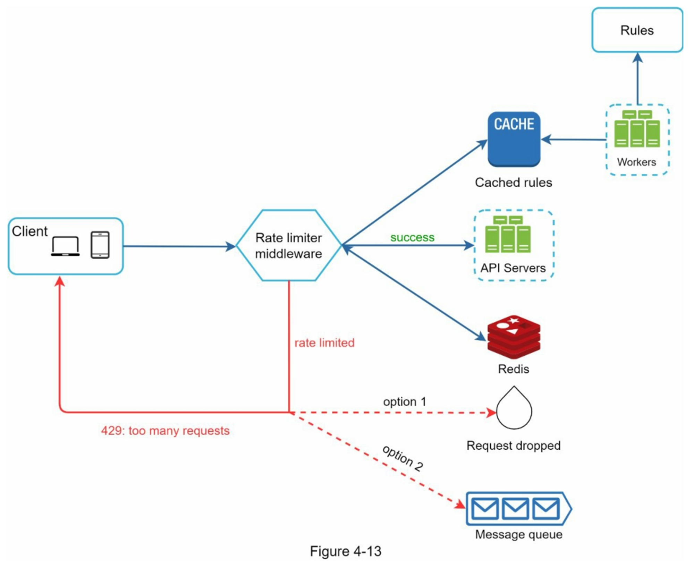{ align=right width=40% }
当客户端请求触发限流阈值时，网关或限流器应向其返回 **`HTTP 429 Too Many Requests`** 状态码，并附带以下标准或约定俗成的响应头：

- **`X-Ratelimit-Limit`**：当前限流窗口内允许的最大调用次数。
- **`X-Ratelimit-Remaining`**：当前窗口内还能发起的剩余请求数。
- **`X-Ratelimit-Retry-After`**：客户端需要等待多少秒后，才能发起下一次不被拒绝的请求。

#### 分布式限流的挑战

在分布式集群中实现限流器，主要面临以下两大技术难题：

1. **竞争条件 (Race Condition)**：在高并发下，多台应用服务器同时读写 Redis 中的限流计数器，容易产生脏读脏写。
    - **解决方案**：避免使用低效的分布式锁，通常采用 **Redis + Lua 脚本**，利用 Redis 执行 Lua 脚本的单线程原子性，确保“读取 - 计算 - 更新”这一串操作的绝对原子化。
2. **状态同步 (Synchronization)**：多台服务器如何低延迟地共享同一份限流状态数据。
    - **解决方案**：避免使用粘性会话（Sticky Sessions，会导致单点故障及负载不均），推荐使用**集中式存储**（如 Redis 集群）来统一存放限流指标，所有应用服务器均通过连接该集中式缓存来进行校验。

### 2.2 分布式 ID

- **UUID**：生成简单、可用性高、碰撞概率极低，易于水平扩展。但其缺点是 128 位长度过长且呈无序状态，不适合作为数据库主键（无序性会导致 B+ 树索引频繁分裂与产生碎片），且无法按时间趋势递增。
- **数据库号段模式**：为克服数据库单点自增的性能瓶颈，每次向主库批量申请一个范围的号段（如 1000 个 ID）并缓存在本地内存中，分发完毕后再去申请。这在保证 ID 唯一与趋势递增的同时，极大地降低了数据库的并发压力（如美团 Leaf 系统的 Segment 模式，配合双 Buffer 优化可实现高可用无卡顿分发）。
- **雪花算法**：生成 64 位 `long` 型整数，完全在内存中计算，不依赖外部数据库，性能与吞吐量极高。如下图所示，ID 由 `1位保留位 (0) + 41位时间戳 + 5位数据中心ID + 5位机器ID + 12位毫秒内序列号` 构成，天然按时间递增。最大缺陷是**强依赖系统时钟**，若服务器发生**时钟回拨 (Clock Skew)**，可能会生成重复 ID，需在代码中进行回拨检测与避让。
    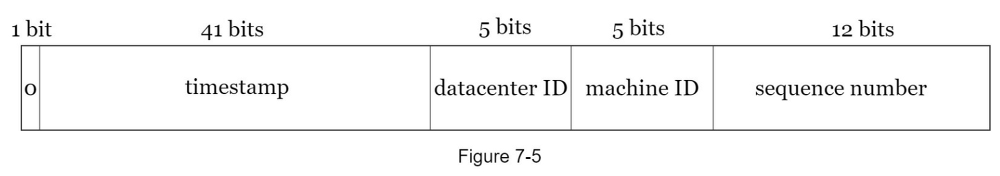{ width=90% }

## 第三部分：系统设计案例

### 3.1 短网址

### 3.2 Feed 流

信息流常见于社交软件中的消息，比如 Facebook、Twitter 等

#### 设计范围

- 信息按时间倒序排列吗？
- 是否分为系统推荐和关注列表？
- 用户数、信息量、扇入扇出比？
- 实时系统吗？如果高负荷下的延迟可以接受吗？
- 是否支持图片、视频等，视频长度有限制吗？

#### 系统架构

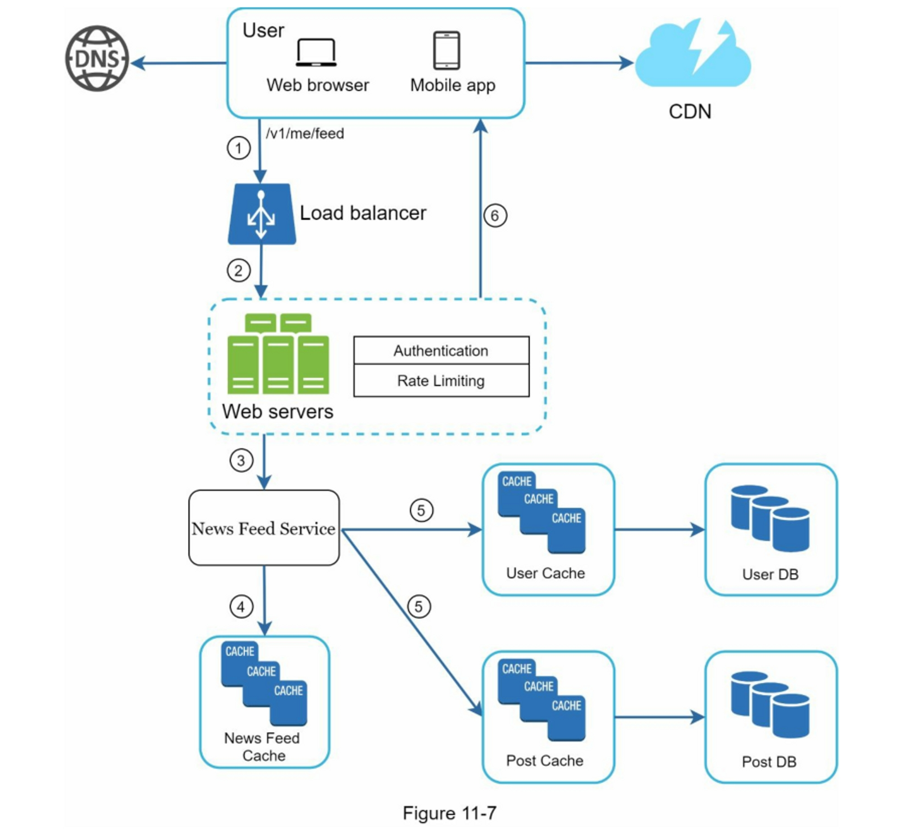{ width=70% }

扇出模型：

- 写扇出 (Push)：发布的帖子立即被推送到所有粉丝的信息流缓存中。优点是用户读取信息流极快（$O(1)$）；缺点是明星用户（粉丝极多）发帖时会产生海量的写操作，造成系统延迟和热点问题。
- 读扇出 (Pull)：用户发帖时仅写入自己的发帖列表。当粉丝打开页面时，系统实时拉取并合并所有关注者的帖子。优点是发帖极其简单快速；缺点是读取信息流时需要实时拉取、合并并排序多路数据，速度较慢。
- 混合扇出：
    - 针对发布者（发帖）：普通用户发帖采用写扇出（主动推给粉丝）；明星/大 V 发帖采用读扇出（不主动推送，等粉丝在线时拉取）。
    - 针对接收者（阅读）：只给活跃用户推送并维护其 Feed 缓存；对不活跃用户过滤掉、不主动推送（以节省内存和写带宽），等他们上线时再通过读扇出（实时拉取合并）动态构建信息流。

### 3.3 网络爬虫

优秀的爬虫具有：

1. 可伸缩性：易于调整爬取规模
2. 健壮性：网络充满陷阱：错误的 HTML、无响应的服务器、崩溃、恶意链接等都很常见，爬虫必须处理所有这些边缘情况。
3. 礼貌：尊重服务器资源，遵守 robots 协议等规则，不要在短时间内向同一网站发出太多请求
4. 可扩展性：只需较少的更改即可支持新的内容类型，比如 文档、图片、音视频等

#### 系统估算

- 假设每月下载 10 亿个网页
- QPS：1,000,000,000/30/24/3600 ≈ 400 页/秒
- 峰值 QPS: 800 页/秒
- 平均网页大小 500KB
- 存储需求：1,000,000,000 * 500KB = 500TB
- 带宽需求：400 页/秒 * 500KB/页 = 200MB/s
- 假设数据存储 5 年，则存储需求为 500TB/月 * 12 月 * 5 年 ≈ 30PB

#### 爬虫系统设计

- Seed URLs：爬虫的起点，通常是网站的首页，或分类的索引页
- URL Frontier：URL 列表，管理待爬取的 URL，分为待爬取、已爬取、待重试等。同时控制请求频率、爬取优先级等。
- HTML Downloader：下载网页
- DNS Resolver：域名解析，要求稳定、解析速度快，如果在国内爬取 Twitter 等网站则需要解决 DNS 污染问题
- Content Parser：解析网页，提取文本、链接等信息
- Content Seen：网页内容去重，比如同一篇文章被不同的网站转载
- Content Storage：存储爬取结果，之后可异步解析、清洗、索引
- URL Extractor：提取抓取结果的 URL，为子页面的爬取做准备
- URL Filter：排除 URL 中的某些类型、扩展名、错误链接、黑名单站点等
- URL Seen：URL 去重，避免重复爬取
- URL Storage：记录已访问的 URL，避免重复访问

<div class="grid cards" markdown>
- <figure>
    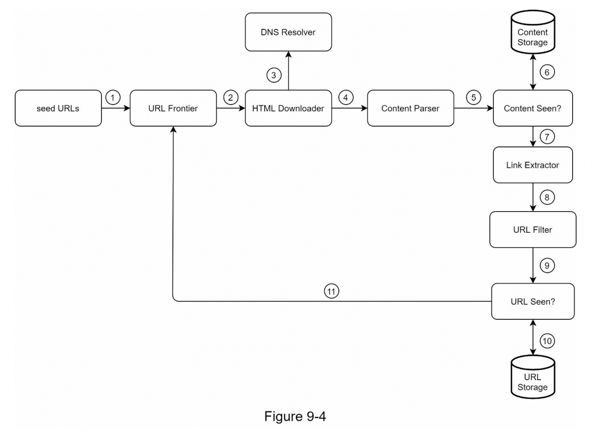
    <figcaption>爬虫架构</figcaption>
  </figure>
- <figure>
    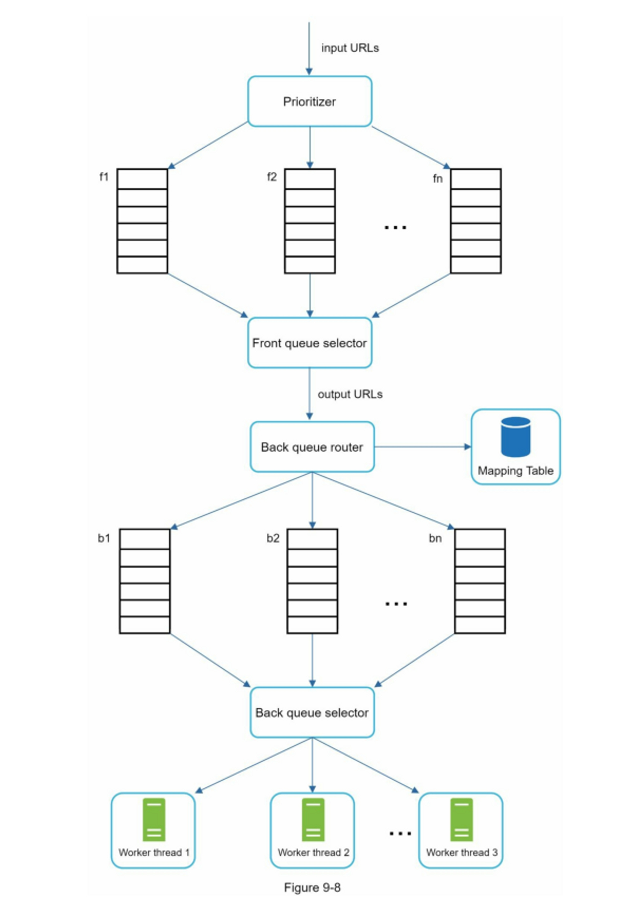
    <figcaption>URL Frontier</figcaption>
  </figure>
</div>

爬取方式有 BFS 和 DFS，DFS 会顺着一个链接无限深入下去，可能导致无限循环（通过设置最大深度避免），因此通常使用 BFS。BFS 会导致短时间内向服务器发送过多的请求，因此引入 URL Frontier 确保同一时间不会向同一个服务器发送过多的请求。另外，BFS 对所有页面一视同仁，无法区分重要页面的爬取，因此可以引入对 URL 进行加权（PageRank 值、流量、更新频率等指标），优先爬取重要页面的 URL。

网页会不断的变化，爬虫需要不断重新抓取来更新数据。抓取时可以根据更新历史、URL 优先级等策略来确定是否需要重新抓取。

#### 组件实现

对于小型分布式爬虫，可以使用 Redis 高性能的内存数据结构来实现核心组件的分布式共享：

- **URL Frontier (待爬取队列)**：
    - **队列与礼貌爬取**：使用 Redis List 为每个目标域名维护独立的 FIFO 队列，配合轮询调度，确保短时间内不会对同一域名发起密集请求。
    - **优先级调度**：使用 Sorted Set (ZSET)，将网页权重（如 PageRank、更新频次等）作为分数（Score），实现高价值 URL 优先抓取。
    - **并发限频**：利用 Redis 的分布式锁与 `EXPIRE` 键过期机制，存储各个域名最近一次爬取的时间戳，控制抓取的安全冷却间隔。
- **URL Seen / Content Seen (去重系统)**：
    - **URL 去重**：使用 Redis Set（存储 URL 的 MD5）或通过原生 RedisBloom 插件启用布隆过滤器 (Bloom Filter)，利用极小的内存空间执行已访问 URL 的判重。
    - **内容去重**：利用网页文本提取的 SimHash（或指纹特征码）存入 Redis 集合，并在存入前做海明距离比对，防止同一篇文章在不同站点被重复下载和索引。
- **缓存**：
    - **DNS 缓存**：为了减少耗时的域名解析请求，可使用 Redis String 缓存 `域名 -> IP` 的映射，并根据 DNS 记录的 TTL 设置过期时间，提高抓取速度并减轻 DNS 服务器压力。
    - **robots.txt 缓存**：为了避免频繁请求单个域名的 `robots.txt` 文件（导致请求频率过高或被封禁），可使用 Redis String 缓存 `域名 -> robots.txt` 的映射，并根据 robots.txt 文件中约定的 `Crawl-delay`（或默认值）设置过期时间，确保爬虫遵守礼貌原则并减少网络开销。
- **Active URL Tracking (运行中 URL 锁定)**：为了避免多个爬虫节点同时拉取并处理同一个 URL（防止在队列出队和去重标记之间的时间窗口内发生重复爬取），下载前先在 Redis 中通过分布式锁（如 `SET key NX EX`）锁定 URL，处理完后释放。
- **指标监控与统计**：使用 Redis Hash 和 `HINCRBY` 实时统计各个节点和各域名的抓取成功数、失败数、网络吞吐量，供监控后台进行展示和实时报警。

大规模爬虫会有内存瓶颈和 ZSET 的时间复杂度等问题，此时通常将 Redis 作为热数据缓冲区，实际的数据存储在 HBase 等分布式数据库中。URL 通过 Redis 进行去重和优先级管理，HBase 存储所有 URL 数据。ContentSeen 使用布隆过滤器减少磁盘 IO 次数。

### 3.4 通知系统

通知系统包含：移动推送、短信、邮件

#### 设计范围

- 通知的类型：移动推送、短信、邮件、站内
- 实时系统吗？如果高负荷下的延迟可以接受吗？
- 支持的设备范围，如 iOS、Android、PC
- 用户是否可以选择拒绝接收通知，比如取消邮件订阅，应用内关闭某类通知
- 每天的通知发送量

#### 系统架构

<div class="grid cards" markdown>
- <figure>
    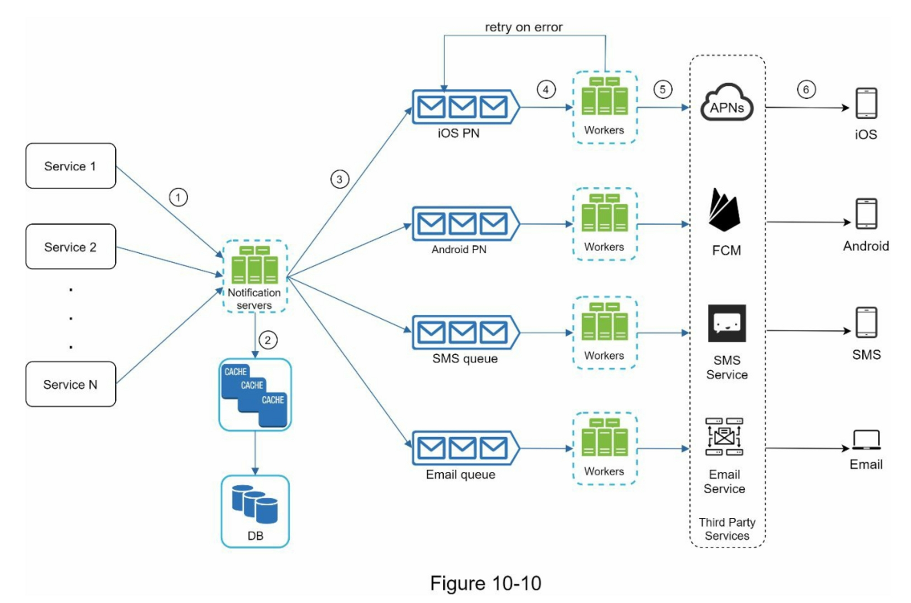
    <figcaption>通知系统高层设计</figcaption>
  </figure>
- <figure>
    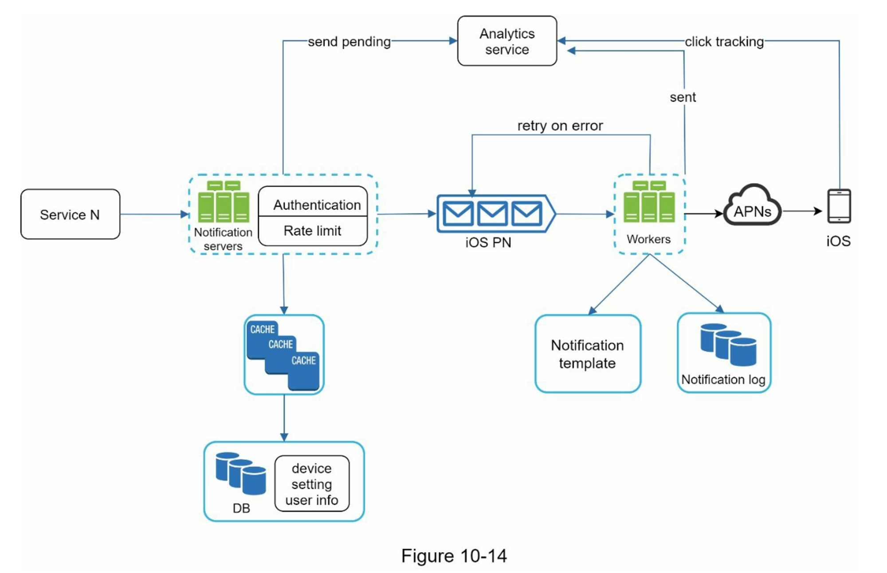
    <figcaption>通知系统详细设计</figcaption>
  </figure>
</div>

*service 包括计费通知、交易通知、营销通知、系统通知等*

通知组件中包括：

- 通知模板：预先格式化通知模板
- 通知设置：用户选择接收通知的时间段、通知类型等
- 速率限制：避免用户被过多的通知淹没
- 重试机制：失败的消息重试，多次重试失败则向开发者发出警报
- 事件跟踪：打开率、点击率等数据方便优化通知内容

### 3.5 聊天系统

#### 设计范围

- 是否支持群聊？群聊人数上限是多少？
- 消息类型是否支持图片等多媒体？
- 消息保存在服务端还是用户本地？
- 是否显示在线状态和已读回执？
- 是否支持跨设备的消息同步？

#### 系统架构

##### 核心组件

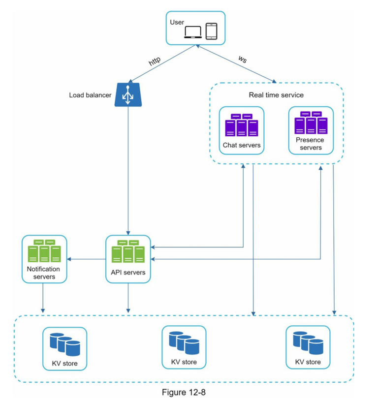{ align=right width=40% }

- 聊天服务器 (Chat Servers)：维护客户端的长连接（WebSocket/TCP），负责实时消息的转发与投递。
- 在线服务器 (Presence Servers)：管理用户的实时在线/离线状态，接收心跳包并判定网络健康状况。
- API 服务器 (API Servers)：处理非实时、基于 HTTP 的经典 Web 业务，如用户登录、好友关系管理、群组配置、个人资料修改等。
- 通知服务器 (Notification Servers)：当接收方离线时，调用系统级推送服务（如 iOS APNs、Android FCM）下发离线通知。
- 键值/宽表存储 (KV Store)：缓存及存储聊天历史记录，提供高性能的随机写入与按时间范围的顺序读取。

##### 通信协议选择

- **WebSocket**：握手阶段基于 HTTP，协议升级后可实现全双工双向通信。适合 Web 网页端以及中轻量级聊天系统的快速开发。
- **TCP 协议自定义私有协议**：现代高性能 IM（如微信、Telegram）在移动端普遍基于 TCP 制定私有协议，主要优化以下方向：
    - **极简握手**：规避标准 TLS 繁琐的多轮往返过程，使用 0-RTT/1-RTT 快速建连。
    - **包体极小**：使用二进制序列化协议（如 Protobuf），深度压缩协议头以节省电量与蜂窝数据流量。
    - **心跳与重连**：针对移动端弱网、断网、IP 漂移场景，在应用层设计快速重连与智能心跳探活机制。
- **UDP 协议的演进**：早期由于 Linux `epoll` 尚未普及，TCP 阻塞 I/O 在面临海量并发（C10K 问题）时内存及句柄开销过高，因而早期系统常用 UDP 来支撑高并发，并通过应用层确认应答模拟可靠传输。随着 `epoll` 和非阻塞 I/O 模型的成熟，现代系统主流已回归 TCP 自定义协议。

##### 存储方案设计

IM 数据通常被划分为两类，采用不同的数据库进行存储：

- **通用元数据**：如用户基本资料、好友列表、群组成员表等。此类数据变动频率低、强依赖事务一致性，推荐使用关系型数据库（如 **MySQL / PostgreSQL**）。
- **聊天历史记录**：此类数据具有“写多读少”、“写吞吐量极大”以及“按时间线顺序读取”的特征。
    - **云端漫游方案**：推荐使用基于 **LSM-Tree 架构** 的分布式 NoSQL 宽表/列族数据库（如 **Cassandra、ScyllaDB、DynamoDB、HBase**），其顺序写性能强悍，易于水平扩展。
    - **本地存储方案**：如微信、WhatsApp 等系统出于隐私或降低云端成本考量，将聊天数据保存在客户端本地。本地通常采用加密的 **SQLite** 数据库进行存储。
    - **警惕 MongoDB 坑点**：虽然 MongoDB 适用于快速开发，但若消息规模达到百亿级，其 **B-Tree 索引** 将极度膨胀并常驻物理内存，导致服务器内存耗尽，系统读写性能出现断崖式下跌。

##### 数据模型与 ID 生成

- **单聊消息表 (1v1 Message)**：
    ```sql
    message_id (Primary Key) -> 全局唯一、趋势递增
    message_from             -> 发送方用户 ID
    message_to               -> 接收方用户 ID
    content                  -> 消息内容
    created_at               -> 创建时间戳
    ```
- **群聊消息表 (Group Message)**：
    ```sql
    channel_id (Partition Key) -> 群组 ID
    message_id (Primary Key)   -> 全局唯一、趋势递增
    user_id                    -> 发送方用户 ID
    content                    -> 消息内容
    created_at                 -> 创建时间戳
    ```

!!! note "关于 message_id"

    `message_id` 不仅需要保证**全局唯一**，还必须满足**时间趋势递增**，以便客户端拉取时进行准确的排序和去重。推荐采用**雪花算法 (Snowflake)** 或高可用的发号器服务生成。

##### 消息分发机制

在 IM 中，可以认为每个人都有一个信箱，发送者把消息投递到接收者的信箱。

- **写扩散（Fan-out on Write / Push）**：
    - **原理**：发送方投递消息时，服务端把该消息复制并写入到所有接收方的“收件箱（Timeline/Inbox）”中。
    - **优点**：接收方拉取极快（只需 $O(1)$ 读取自己专属的收件箱），支持离线消息的秒级投递。
    - **缺点**：若在大群聊（如万人群）中，单发一条消息会导致万次写操作，产生严重的写放大（Write Amplification）和存储空间浪费。
- **读扩散（Fan-out on Read / Pull）**：
    - **原理**：发送方发送消息后，服务器只将消息写入到当前群聊/对话的单独“信箱”中。接收方上线时，主动去每个对话信箱中拉取未读消息。
    - **优点**：写操作极其轻量，群发消息只需写入一次，极大地节省了服务器的存储与写入资源。
    - **缺点**：读操作沉重。用户上线时需要向多个对话拉取并合并消息（多路拉取），可能引发“读放大”和延迟。
- **业界实践**：
    - 若聊天记录**完全保存在本地**（如微信、WhatsApp 等 E2EE 系统），为确保离线可触达性，必须采用**写扩散**。
    - 若聊天记录**支持云端漫游**（如 Telegram、Discord、飞书、钉钉等），群聊场景则普遍采用**读扩散**或“读写结合模式”。

##### 消息同步与多端一致性

IM 消息同步通常通过校验版本号（Sequence/Version ID）来实现：

1. **全局 Sequence 机制**：服务端为每个对话（单聊/群聊）维护单调递增的序列号 `Sequence ID`。
2. **增量同步差异（Delta Update）**：客户端每次重连或上线时，向服务器上报本地缓存的最新 `Sequence ID`。服务端对比后，仅下发差异区间的未读消息，避免全量拉取。
3. **分类同步 (以微信 Sync Key 为例)**：系统将通讯录、聊天消息、朋友圈等业务拆分为不同子域，各自独立维护 Sequence，客户端按需多路并行拉取，提升同步效率。

<div class="grid cards" markdown>
- <figure>
    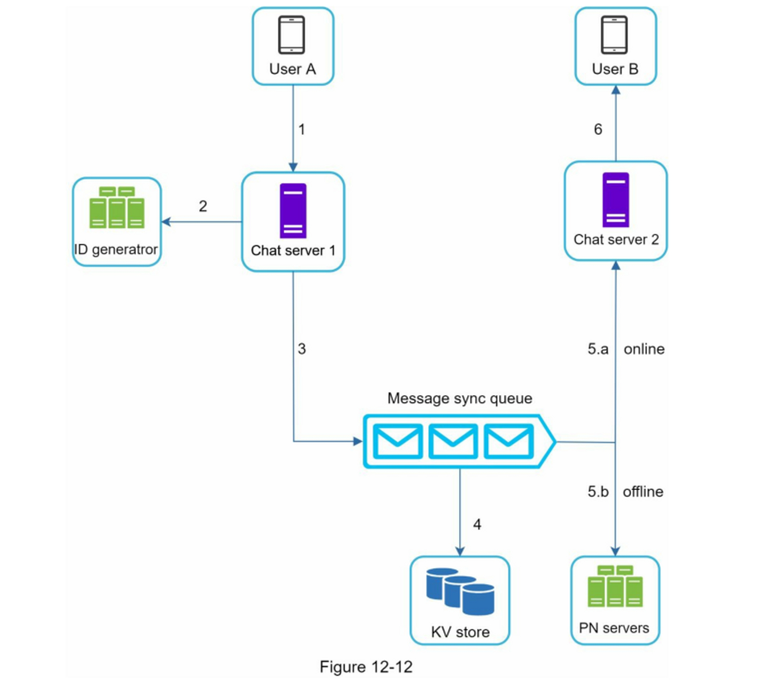
    <figcaption>IM 单聊</figcaption>
  </figure>
- <figure>
    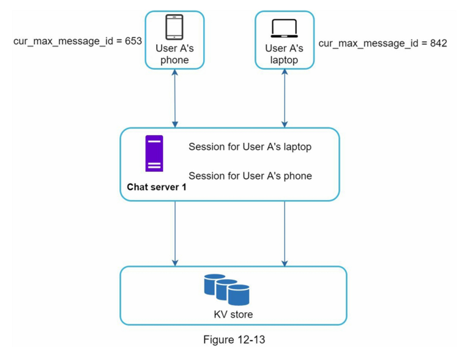
    <figcaption>消息跨设备同步</figcaption>
  </figure>
</div>

<div class="grid cards" markdown>
- <figure>
    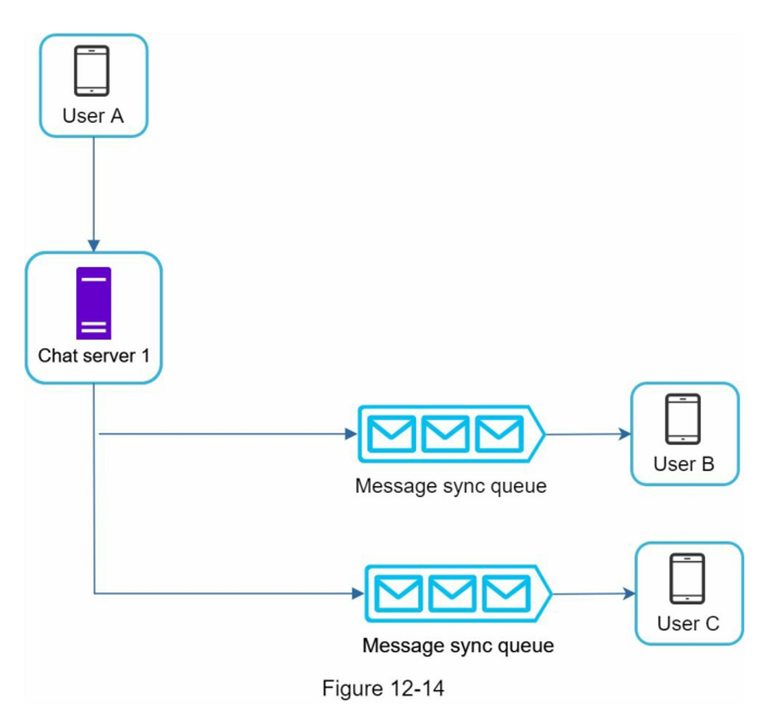
    <figcaption>IM 发送群消息</figcaption>
  </figure>
- <figure>
    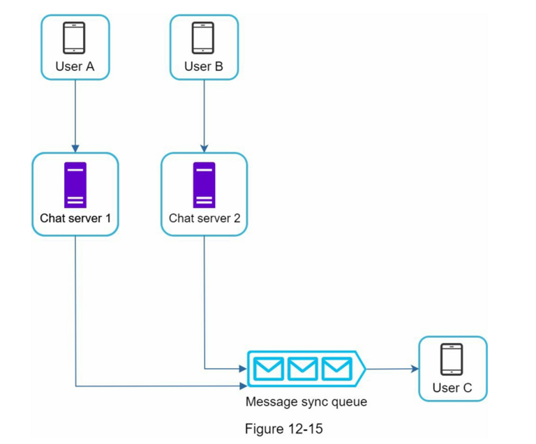
    <figcaption>IM 接收群消息</figcaption>
  </figure>
</div>

##### 在线状态管理

- **心跳检测 (Heartbeat)**：客户端定期（如每 30 秒）向 Presence Server 发送心跳。若服务器在指定窗口期内（如连续 3 次）未收到心跳，则判定用户断开连接并将其状态置为离线。
- **状态分发策略**：
    - **小群/好友列表（主动推送）**：采用 **发布 - 订阅模型 (Pub/Sub)**。用户状态变化时，在线服务器主动将事件推送给其在线的好友和当前所在的小群成员。
    - **万人大群/频道（懒加载机制）**：切忌使用主动推送，否则会引发可怕的 **事件广播风暴 (Event Storm)**（状态变更事件数呈 $O(N^2)$ 级爆发）。大群应采用**懒加载 (Lazy Load)**：只有在用户主动进群、手动刷新列表或拉取前排发言人时，才向服务端单向查询在线状态。

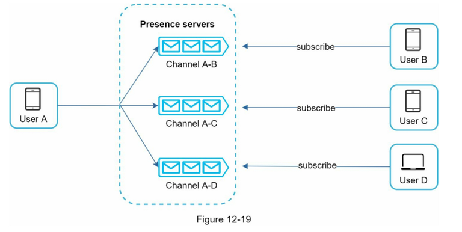

##### 已读回执

单聊和群聊的已读回执在核心思路上都是记录用户最后一条已读消息的序号（Sequence ID）以节约存储，但由于并发量和网络开销的巨大差异，两者的实现机制完全不同。

单聊并发量小，强调高实时性，主要采用基于长连接的**实时推模式（Push）**：

1. **触发已读（接收方）**：接收方打开聊天窗口，客户端检测到最新消息（如 `Msg_100`）已在屏幕上完成渲染。
2. **发送确认（ACK）**：客户端异步发送一个确认包（如 `Read_ACK` 或 `Update_Read_Sequence` 协议包）。
3. **更新服务端进度**：服务端接收请求，将该会话中接收方的已读位置（Read Index / High-Water Mark）更新为 `100`。
4. **实时回执推送**：服务端通过长连接（TCP/WebSocket）向发送方推送一条已读状态通知：“接收方已读至第 `100` 条消息”。
5. **发送端渲染**：发送方的客户端收到该推送，将本地所有消息 ID $\le 100$ 的消息在 UI 上统一批量标记为“已读”。

在大型群聊中，若采用单聊的“Push 广播”模式，当一个 $N$ 人的群产生一条消息时，每个成员已读都会触发一次向群内所有其他人的广播，网络事件开销将呈 **$O(N^2)$ 级指数增长**，极易引发服务器网络 I/O 耗尽（广播风暴）。为了规避该问题，群聊已读通常采用**按需拉模式（Pull）**：

- **数据结构优化**：服务器不记录“每条消息有哪些人已读”，而是为每个群成员维护一条极轻量的读取位置记录：**`[群组 ID, 用户 ID, 最后已读 Sequence ID]`**。在判断某条消息 `Msg_X` 是否已被成员 A 阅读时，只需比对 `A 的最后已读 Sequence ID >= Msg_X` 即可。
- **按需拉取（Pull）优化（以飞书、钉钉为例）**：
    - **常规状态显示**：消息下方仅展示“已读人数/总人数”（如 `已读 8 人`）。此计数可在服务端通过聚合快速计算并推送，开销极低。
    - **详情按需拉取**：只有当发送方**主动点击已读数字**查看详情时，客户端才会向服务端发起一次 Pull 请求（通常称为 `Get_Message_Read_Detail`），获取当前已读/未读的成员具体名单。
    - **效果**：通过这种“在 UI 上将 Push 转为按需 Pull”的交互设计，成功消除了高并发下的推送洪峰，极大减轻了服务端的计算与下行带宽压力。

!!! tip "分布式消息设计的范式"

    1. 消息分发模型：推（Push）与拉（Pull）
        - 推模型 (Push)：高实时性，消息即时触达。但在“多对多”或“高粉丝量”的场景下，极易引发写放大与广播风暴（如明星发帖的写扇出、IM 大群的在线状态推送）。
        - 拉模型 (Pull)：写操作极轻量，接收方按需索取且可自主控制流量。但消息存在延迟，且当用户长时间离线后上线时，容易引发读放大（如拉取大量历史堆积消息）。
        - 典型场景：信息流（Feed 流）、即时通讯（IM 状态/消息分发）、消息队列（MQ）的订阅消费。
    2. 可达性保障：借鉴 TCP 的累积确认（ACK）机制
        - 累积确认：为保证消息的“至少一次投递”或精准追踪阅读状态，无需对单条消息进行繁琐的逐一确认，而是采用类似于 TCP 序列号的滑动窗口累积确认机制，接收方只需确认当前已处理的最大消息序列号（Sequence ID / Offset），即代表该序列号之前的所有消息已全部确认完毕。
        - 典型场景：IM 中的已读回执（标记已读至 Msg ID $\le N$）、消息队列中消费位移的提交（Commit Offset）。

### 3.6 搜索建议系统

搜索建议功能在生活中很常见：搜索引擎、购物网站、社交搜索、输入法等，它能很大程度上提升用户体验。

#### Trie 结构

实现搜索建议最简单的方式是采用数据库的`LIKE`查询，但是这种方式存在性能问题，不适合做搜索建议系统。更好的方式则是采用 [Trie 树](https://algo.palemoky.com/data_structures/trie)来存储和检索关键字。

<div class="grid cards" markdown>
- <figure>
    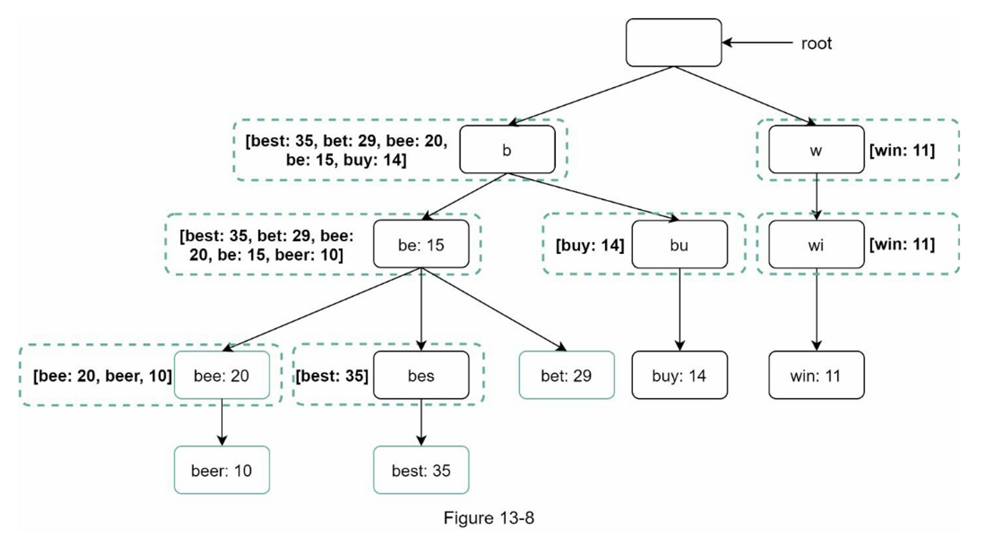
    <figcaption>带频率前 K 个缓存的 Trie 树</figcaption>
  </figure>
- <figure>
    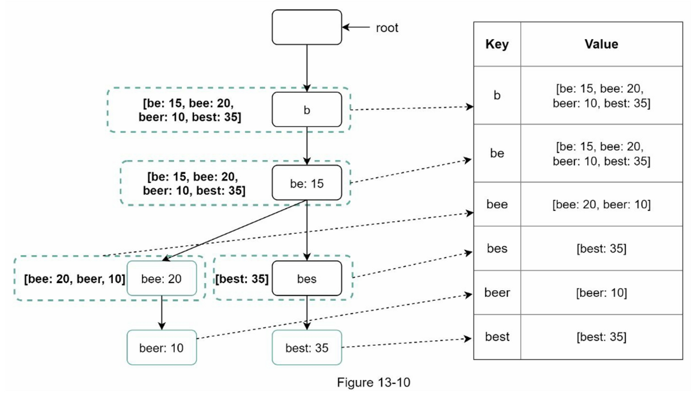
    <figcaption>Trie 与哈希表映射</figcaption>
  </figure>
</div>

当用户输入搜索查询时，自动完成的建议必须足够快地显示出来。一篇关于 [Facebook 自动完成系统的文章](https://www.facebook.com/notes/10158791367817200/)显示，该系统需要在 100 毫秒内返回结果，否则会造成卡顿。为了避免遍历整个 trie，我们在每个节点存储前 k 个最常用的查询，这样可以把查询的时间复杂度从 $O(N)$ 降低到 $O(k)$。

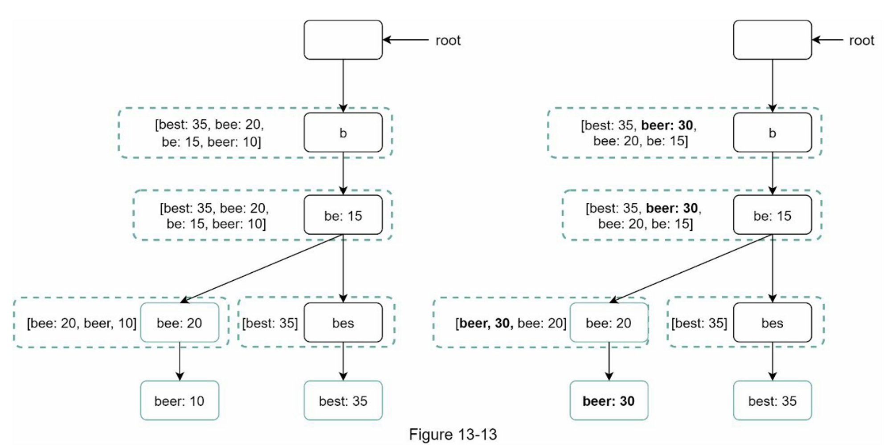{ align=right width=50% }
Trie 的更新尽量全部更新，尽量避免局部更新，因为局部更新需要更新其所有祖先，效率非常低下。

如果需要支持多语言，那么可以把 Unicode 字符存储在 Trie 节点。

为了避免 Trie 的数据倾斜，可以对 Trie 的值进行哈希后分片存储，同时兼容所有语言。

#### 数据收集

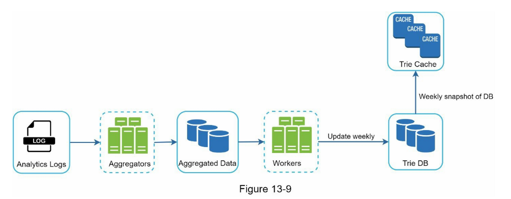

- Analytics Logs：搜索查询的原始数据
- Aggregators：把日志处理为正确的格式，以便后续构建 Trie 树。聚合频率可以根据业务需求来定，比如 Twitter 这样的实时应用程序需要最新的自动完成建议，而许多 Google 关键字的自动完成建议每天可能不会有太大变化
- Aggregated Data：聚合日志，例如统计每种查询前缀的出现次数，这些聚合数据可用于更新 Trie 树
- Workers：定时、异步构建的 Trie 数据并存储到 Trie DB 中
- Trie Cache：分布式缓存，把 Trie 保存到内存，以便快速读取
- Trie DB：可以采用文档数据库或键值数据库

另外，为了避免仇恨、暴力、色情的内容出现在建议列表中，应该在 Aggregators 阶段过滤掉这些不合规的内容。

#### 查询服务

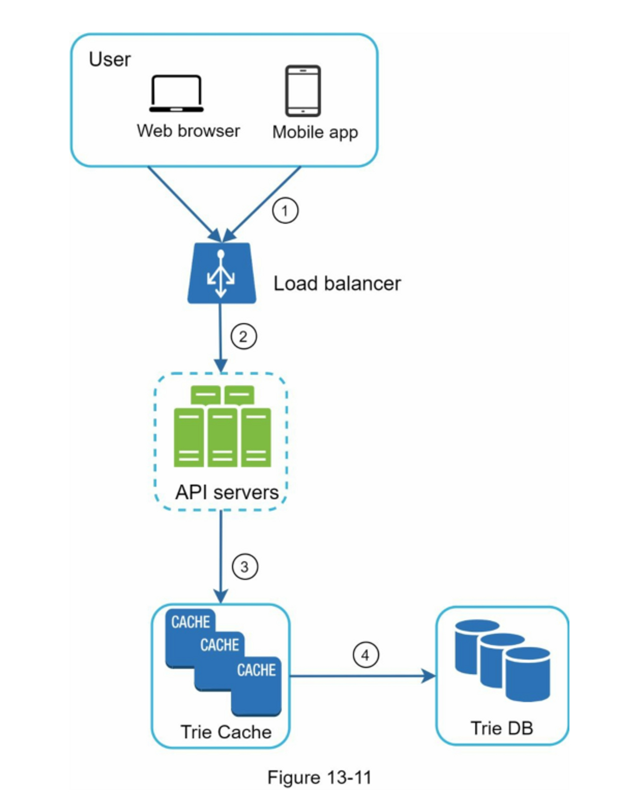{ align=right width=25% }
为了继续优化速度，还可以：

- 使用 AJAX 请求，实时反馈用户输入
- 对于变化不大的应用，可以使用浏览器缓存，或者使用 CDN 将静态数据缓存到离用户最近的节点

### 3.7 视频流媒体服务

#### 视频转码

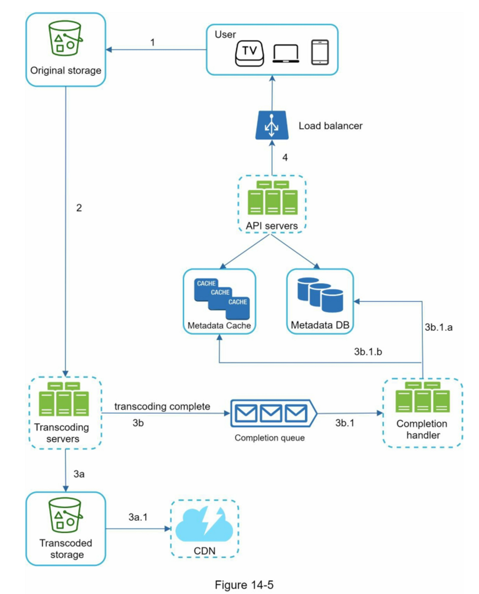{ align=right width=50% }

视频转码的必要性：

- 减少原始视频的分辨率和比特率，节省存储空间
- 提供多种格式和清晰度的视频，适应不同设备和网络环境
- 支持流式传输，提供更好的用户体验

<div style="clear: both;"></div>

??? info "视频格式相关的知识"

    常用的视频流媒体协议：

    | 协议名称      | 全称                                                                | 传输层     | 典型延迟 | 核心特点                                                                                                                                   | 典型使用场景                                                                                  |
    | ------------- | ------------------------------------------------------------------- | ---------- | -------- | ------------------------------------------------------------------------------------------------------------------------------------------ | --------------------------------------------------------------------------------------------- |
    | HLS           | HTTP Live Streaming                                                 | TCP (HTTP) | 5 ~ 30秒 | 苹果主导，生态极度完善，几乎所有移动端、浏览器和智能电视都原生支持。通过将视频切分为 `.ts` 文件并通过 M3U8 索引进行分发，对 CDN 极其友好。 | 跨平台视频点播（VOD，如在线教育、常规短视频）、对延迟要求不高的常规网络直播分发。             |
    | MPEG-DASH     | Moving Picture Experts Group - Dynamic Adaptive Streaming over HTTP | TCP (HTTP) | 5 ~ 30秒 | 国际标准，不绑定特定厂商，支持跨平台的自适应码率控制（ABR）和主流的数字版权管理（DRM），编码格式选择更灵活。                               | 商业化长视频点播平台（如 YouTube、Netflix、爱优腾等），对画质自适应和版权保护有强需求的场景。 |
    | LL-HLS / DASH | Low-Latency HLS / DASH                                              | TCP (HTTP) | 2 ~ 5秒  | 分别是 HLS 和 DASH 的低延迟演进版。通过将大分片细切为微小切片（Parts），使客户端能提前获取未写完的分片，兼顾了 CDN 分发优势与低延迟。      | 互动性要求较高的体育赛事直播、游戏电竞直播、高码率画质优先的在线演艺直播。                    |

    常见的直播流协议：

    | 协议名称 | 全称                         | 传输层     | 典型延迟 | 核心特点                                                         | 典型使用场景                                                    |
    | -------- | ---------------------------- | ---------- | -------- | ---------------------------------------------------------------- | --------------------------------------------------------------- |
    | RTMP     | Real-Time Messaging Protocol | TCP        | 1 ~ 3秒  | 传统直播霸主，稳定且延迟较低，但浏览器端基本废弃（需要 Flash）。 | **主播端向平台推流**（如 OBS、直播伴侣推流）。                  |
    | HTTP-FLV | Flash Video over HTTP        | TCP (HTTP) | 1 ~ 3秒  | 将 FLV 直播流封装在 HTTP 长连接中进行流式传输，加载极快。        | 国内传统直播平台**拉流播放端**（如斗鱼、B站直播的网页/APP端）。 |
    | WebRTC   | Web Real-Time Communication  | UDP        | < 1秒    | 基于 UDP 传输，具备极强的弱网对抗与超低延迟能力，支持双向通话。  | **超低延迟互动直播**（如带货直播连麦、在线课堂、视频会议）。    |

    常见的视频编码：

    | 编码格式     | 英文全称                     | 特点                                                                               | 典型应用场景                                                       |
    | ------------ | ---------------------------- | ---------------------------------------------------------------------------------- | ------------------------------------------------------------------ |
    | H.264 /AVC   | Advanced Video Coding        | 编码效率高，兼容性极强（移动端、PC、Web原生支持）。                                | 绝大多数视频点播、短视频、直播分发（最常用）。                     |
    | H.265 / HEVC | High Efficiency Video Coding | 在同等画质下，码率比 H.264 降低约 50%，压缩效率极高，但编解码计算量更大。          | 超高清 4K/8K 内容、对带宽敏感的直播/点播。                         |
    | AV1          | AOMedia Video 1              | 互联网巨头（Google/Apple/Meta 等）力推的新一代开源免版税标准，压缩效率优于 H.265。 | 追求极致压缩比的在线视频平台（如 YouTube、Netflix 正在大力推广）。 |
    | ProRes       | Apple ProRes                 | 专业的视频编码格式，色深高（10bit+）、码率高但损耗低，适合后期编辑。               | 苹果生态的视频制作、高质量视频素材存储。                           |

    常见的视频格式：

    > 视频内容通常被称为容器，其中包含视频、音频（多语言音轨）、元数据。

    | 格式名称 | 英文全称         | 特点                                                                                                                                                                                                                                                                                                                                                              | 典型应用场景                              |
    | -------- | ---------------- | ----------------------------------------------------------------------------------------------------------------------------------------------------------------------------------------------------------------------------------------------------------------------------------------------------------------------------------------------------------------- | ----------------------------------------- |
    | MP4      | MPEG-4 Part 14   | 容器格式，支持 H.264/H.265 等多种编码，兼容性极佳。                                                                                                                                                                                                                                                                                                               | 绝大多数视频点播、短视频。                |
    | MKV      | Matroska         | 容器格式，支持无限音轨/字幕，编码灵活。                                                                                                                                                                                                                                                                                                                           | 电影、高清收藏、蓝光rip。                 |
    | MOV      | Apple QuickTime  | 苹果生态的容器格式，支持高质量编码。                                                                                                                                                                                                                                                                                                                              | Final Cut Pro 剪辑、Apple设备播放。       |
    | TS       | Transport Stream | 最初为广播电视和卫星直播设计（比如机顶盒），其设计之初就很好的兼容了丢包，因此被广泛应用在网络视频流中。它是一种音视频封装格式，支持错误校验、自适应码率、任意进度拖拽，适合直播分发。`.ts` 通常会伴随`.m3u8`文件一起使用，`.m3u8`文件是一种文本文件，它记录了`.ts`文件的地址，以及播放顺序等信息，适合直播分发，比如IPTV、网络电视直播源就是`.m3u8`/`.m3u`文件。 | HLS 直播切片（`.ts`）。                   |
    | M4S      | Media Segment    | DASH 的分片格式，通常用于自适应码率流媒体传输                                                                                                                                                                                                                                                                                                                     | DASH 直播分片（`.m4s`），类似 HLS 的`.ts` |
    | WebM     | Web Media File   | Google 主导的开源容器格式，支持 VP9/AV1。                                                                                                                                                                                                                                                                                                                         | Web 视频播放。                            |

视频转码的流程：

<div class="grid cards" markdown>
- <figure>
    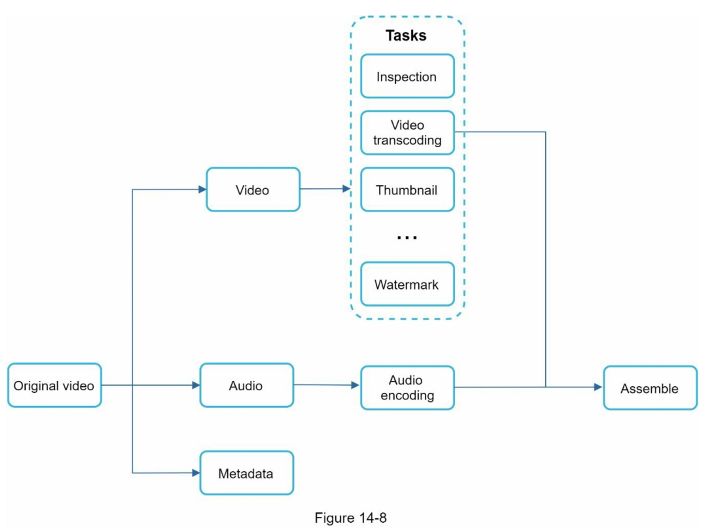
    <figcaption>视频转码的 DAG 图</figcaption>
  </figure>
- <figure>
    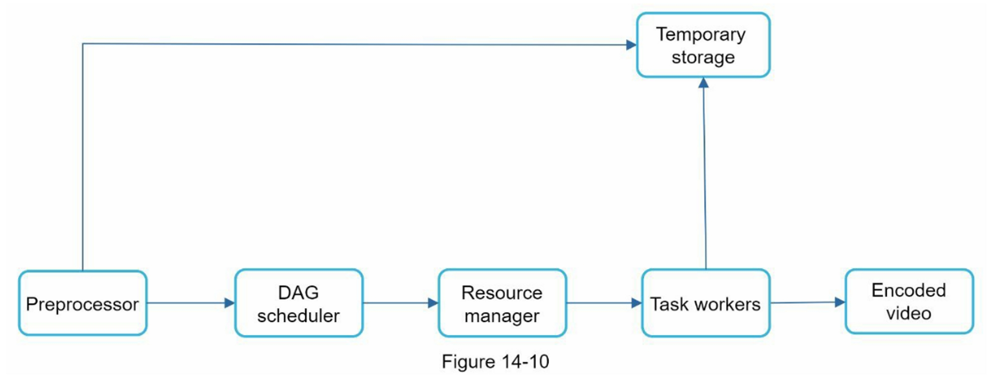
    <figcaption>视频转码架构图</figcaption>
  </figure>
</div>

- Preprocessor：
    - 视频切分：视频流会被切分为一系列对齐的图像组（GOP）。GOP 是由一组按特定顺序排列的视频帧组成的序列。每个切片（Chunk）都是一个可以独立播放的单元，长度通常为几秒钟
    - 一些旧的移动设备或浏览器可能不支持视频分割。预处理器通过 GOP 对齐方式为其分割视频
    - DAG 生成。预处理器根据客户端配置文件生成 DAG
    - 缓存数据：预处理器是分段视频的缓存。为了获得更好的可靠性，预处理器将 GOP 和元数据存储在临时存储中。如果视频编码失败，系统可以使用持久化数据进行重试操作
- DAG scheduler：把 DAG 图分割成各阶段的任务，并把它们放在资源管理器的任务队列中。如图 14-8 所示，原始视频被分割成三个阶段。第 1 阶段：视频、音频和元数据。视频文件在第 2 阶段被进一步分成两个任务：视频编码和缩略图。音频文件需要进行音频编码，作为第 2 阶段任务的一部分
- Resource manager：
    1. task scheduler 从 task queue 中获取最高优先级任务
    2. task scheduler 从 worker queue 中获得最佳的 task worker 来运行任务
    3. task scheduler 指示所选的 task worker 运行该任务
    4. task scheduler 绑定任务/工作信息并将其放到 running queue
    5. 一旦工作完成，task scheduler 把工作从 running queue 中移除
        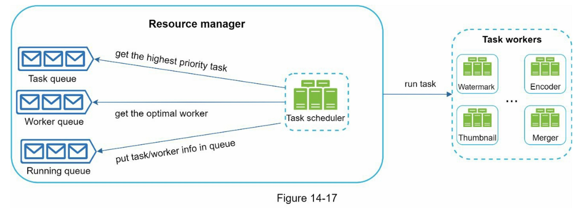
- Task workers：运行在 DAG 中定义的任务
- Temporary storage：此处使用了多种存储系统，存储系统的选择取决于数据类型、大小、访问频率、数据寿命等因素
- Encoded video：输出编码后的视频，如 `funny_720p.mp4`

####系统优化

- 并行化视频上传：如图 14-23
- CDN：将上传中心放在靠近用户的位置，并针对不同地区的热门视频缓存
- 视频处理并行化：引入消息队列对不同的模块进行异步解耦

<div class="grid cards" markdown>
- <figure>
    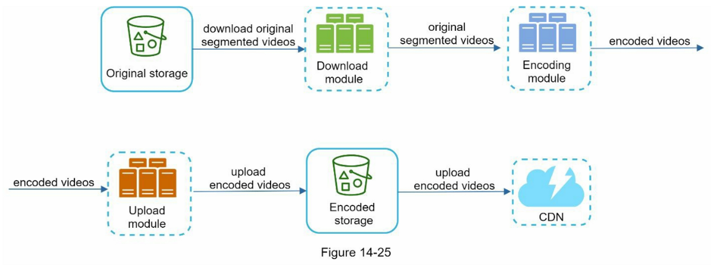{width=10%}
    <figcaption>串行处理</figcaption>
</figure>
- <figure>
    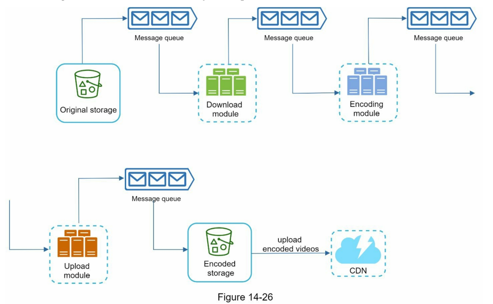
    <figcaption>并行处理</figcaption>
</figure>
</div>

- 视频保护：包括 DRM 版权保护、AES 加密、视频水印等方式
- 预签名上传：确保只有授权用户才能上传文件，如图 14-27

<div class="grid cards" markdown>
- <figure>
    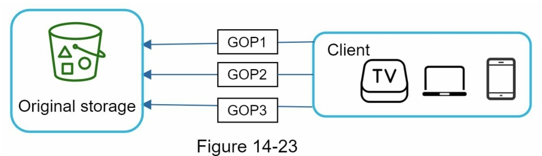
    <figcaption>并行化视频上传</figcaption>
</figure>
- <figure>
    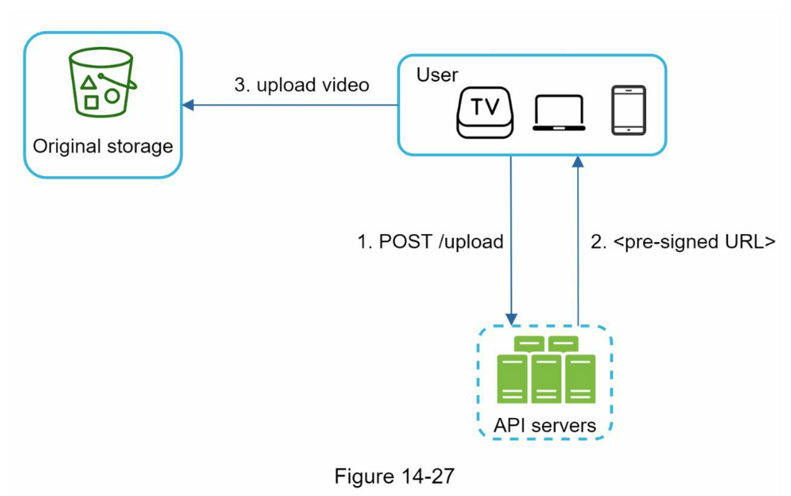
    <figcaption>预签名上传</figcaption>
</figure>
</div>

### 3.8 在线网盘

设计一个像 Dropbox 或 Google Drive 这样的云存储服务，核心解决的是**海量文件可靠存储**、**断点续传**、**秒传（去重）**和**多端实时同步**。

#### 核心架构组件

- **客户端**：
    - **分块器**：将大文件拆分为固定大小（如 4MB）的块（Block），以便于并行上传和断点续传。
    - **索引器**：在本地维护一个轻量数据库（如 SQLite），记录文件块的哈希值与修改状态。
    - **同步管理器**：监听本地与云端的变更，触发上传或下载。
- **元数据服务器**：处理用户登录、文件目录结构、共享权限、块索引等元数据管理。使用具有强一致性事务的数据库（如 Sharded MySQL）。
- **文件分块服务器**：负责接收客户端上传的文件块，执行**压缩**、**加密**和**去重 (Deduplication)**，然后转储到对象存储。
- **对象存储**：如 AWS S3，存储实际的加密文件块。
- **通知服务**：基于 HTTP 长轮询或 WebSocket，将云端文件更新实时推送到客户端以触发同步。

#### 核心技术设计

##### 增量同步与分块传输

不上传整个文件，而是仅对修改过的文件块进行计算并上传。

- 当文件修改时，客户端的分块算法重新计算受影响分块的 Hash。
- 仅将有变动的分块上传到云端，在服务器端完成合并/版本更新。

##### 秒传与数据去重

为了节省存储空间和带宽，在文件块级别进行哈希比对：

- 在上传任何分块前，客户端向元数据服务发送该分块的哈希值（如 SHA-256）。
- 如果该哈希值已存在于系统数据库中（其他用户已上传过），则**跳过该块的物理上传**，仅在元数据中建立引用关系。

##### 冲突解决

当多台设备同时离线编辑同一个文件并上线同步时，会产生版本冲突：

- **策略**：系统无法自动合并复杂的二进制文件，因此通常保存“先提交者”的版本，并将后提交者的版本另存为副本文件（例如 `document_conflict_copy.docx`），由用户手动合并。

### 3.9 在线协作文档

在线协作文档（如 Google Docs、Notion）的核心挑战是：在多用户高并发并发编辑同一份文档时，如何保证**实时同步**与**内容一致性**，避免编辑冲突。

#### 通信协议选择

由于协作需要极低的数据延迟与双向实时通信，协议的选择如下：

- **WebSocket**：首选协议。提供全双工、基于 TCP 的长连接，延迟低，且支持服务器向客户端实时推送其他用户的编辑操作。
- **HTTP 长轮询 / Server-Sent Events (SSE)**：可作为降级备选，但实时性和开销表现不及 WebSocket。

#### 冲突解决技术

这是协作文档最核心的设计决策，通常有以下两套技术路线：

| 技术方案                                                              | 工作原理                                                                                                                                                                     | 优点                                                                     | 缺点                                                                           | 代表产品                     |
| :-------------------------------------------------------------------- | :--------------------------------------------------------------------------------------------------------------------------------------------------------------------------- | :----------------------------------------------------------------------- | :----------------------------------------------------------------------------- | :--------------------------- |
| **操作转换<br>(OT - Operational Transformation)**                     | 客户端的编辑行为被抽象为操作（如：在位置 3 插入 "A"）。当多操作冲突时，**服务器作为仲裁者**，根据版本历史对操作进行转换（Transform），调整偏移量后再应用并广播给其他客户端。 | - 客户端逻辑相对轻量<br>- 数据模型简单，容易与传统关系型数据库结合       | - 高度依赖中央服务器作为单点仲裁<br>- 算法复杂度极高，边界情况极难处理         | Google Docs、Etherpad        |
| **无冲突复制数据类型<br>(CRDT - Conflict-Free Replicated Data Type)** | 任何字符都有一个全局唯一的逻辑标识符（如包含路径/分数值的分数索引）。数据结构设计满足结合律、交换律和幂等性。**无须服务器仲裁**，各个副本只需合并即可达到最终一致。          | - 去中心化，天然支持 Peer-to-Peer 协作与离线编辑<br>- 算法逻辑清晰且健壮 | - 内存和带宽开销大（每个字符都有庞大的元数据）<br>- 文档历史较长时性能退化严重 | Figma、Notion、Yjs/Automerge |

#### 架构设计

```
                    ┌─────────────────────────┐
                    │      Client Browser     │
                    └────────────┬────────────┘
                                 │ WebSocket (Operation Stream)
                                 ▼
                    ┌─────────────────────────┐
                    │      API Gateway        │
                    └────────────┬────────────┘
                                 │
                                 ▼
                    ┌─────────────────────────┐
                    │    WebSocket Servers    │
                    └────────────┬────────────┘
                                 │ Pub/Sub
                                 ▼
          ┌───────────────────────────────────────────────┐
          ▼                                               ▼
 ┌─────────────────┐                             ┌─────────────────┐
 │ Document Server │ ─── (Real-time conflict) ──►│    Redis Cache  │
 │ (OT/CRDT Engine)│                             │ (Active Docs &  │
 └────────┬────────┘                             │ Operation Logs) │
          │                                      └─────────────────┘
          │ Async Persistence
          ▼
 ┌─────────────────┐
 │   Database      │ (Document Snapshot & Edit History)
 └─────────────────┘
```

- **文档服务器**：每个处于活跃编辑状态的文档在内存中由一个服务实例维护其状态（或通过 Redis 订阅发布进行多实例同步），保证 OT 转换的序列化执行。
- **存储设计**：
    - **文档快照**：定期（如每 10 秒或 50 次操作）生成当前文档全文的快照，存储在 NoSQL（如 MongoDB）中。
    - **操作日志**：增量保存所有的编辑命令（以追加方式写入），便于回滚和历史追溯。

#### 高延迟/离线场景下的典型冲突与解决

在高延迟或离线编辑的边缘场景下，经常会出现**逻辑上冲突但技术上被强制合并**的尴尬体验（例如：“A 删除了表单，而尚未感知到删除的 B 仍在往表单里写内容”）。

##### 技术底层的合并表现

- **OT (操作转换)**：服务器在时刻 $t$ 接收并应用了 A 的“删除表单”操作。当收到 B 延迟发出的“往表单插入字符”操作时，OT 引擎根据版本链检测到目标容器（表单 ID）已被标记为删除，转换后的操作会变成**空操作 (No-op)**，从而使 B 的编辑数据丢失。
- **CRDT (无冲突复制类型)**：数据的层级结构在本地即可合并。合并后表单节点被置为“已删除（或隐藏）”，由于 B 插入的字符节点是表单节点的子节点，合并后这些字符在界面上也会随之**不可见**。

##### 面试加分解决策略

单纯技术层面的合并通常会导致 B 的输入无声无息地消失，这在产品体验上是不可接受的。对此可采用以下组合解决方案：

1. **墓碑机制与历史暂存**：数据删除时并不进行物理抹除，而是标记为 Tombstone。当 B 在已被 A 删除的区块中输入时，系统能够保留 B 的修改历史，支持一键“撤销删除”以恢复 A 删除的区块，并将 B 的内容重新关联展现。
2. **影子草稿备份**：当客户端的同步引擎发现 B 提交的操作由于目标容器缺失而被判定为 No-op 时，客户端不会直接丢弃内容，而是将 B 刚刚输入的文本捕获并转换为“本地影子草稿”，同时在 UI 边缘弹出警示：“*检测到您正在编辑的区域已被其他协作者删除，已为您将最近输入的内容暂存至草稿箱/剪贴板。*”
3. **协作感知与轻量级意向锁**：
    - **实时位置广播**：通过 WebSocket 极速同步光标位置（Presence），在表单等关键组件上显示高亮的编辑者状态（例如“*A 正在编辑此表单...*”），从而利用社会学协作规范降低冲突概率。
    - **细粒度行/块级锁**：为特定表单或块引入临时独占锁。当 A 的光标聚焦在某个特定表单或段落时，该表单/段落暂时对 B 变为只读状态，直至 A 失去焦点或同步超时释放锁。
