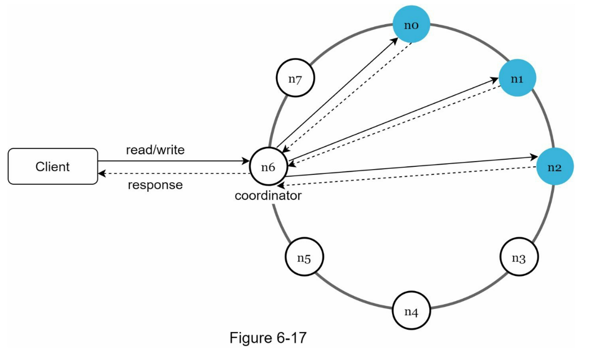
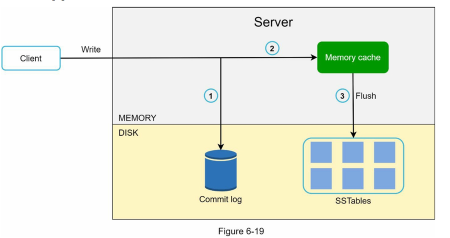
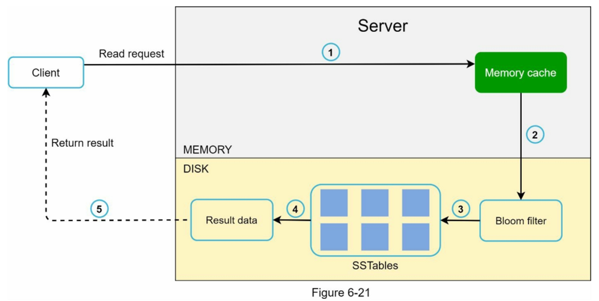

# 《系统设计面试》

> 本文包含了卷 1 和卷 2 两本内容

!!! abstract "阅读信息"

    - **评分**：⭐️⭐️⭐️⭐️⭐️
    - **时间**：6/4/2026 → 6/30/2026
    - **读后感**：

## 第一部分：系统设计基础

### 概览与核心组件

现代分布式系统的核心构建块通常包括以下组件：

- **负载均衡器 (Load Balancer)**：分发网络流量，避免单点过载，提供系统的高可用性与可伸缩性。
- **缓存 (Cache)**：如 Redis、Memcached，用于缓解数据库读压力，提供极低延迟的数据读取。
- **内容分发网络 (CDN)**：将静态资源（如图片、视频、静态文件）分发到地理位置更靠近用户的边缘节点，降低访问延迟。
- **数据库 (Database)**：用于数据的持久化。通常结合主从架构（读写分离）或分库分表（Sharding）来支撑高并发和海量数据。
- **数据中心 (Data Center)**：跨地域部署的物理数据基础设施，提供异地多活和就近接入能力。
- **消息队列 (Message Queue)**：如 Kafka、RabbitMQ，用于系统间的异步解耦、削峰填谷，以及微服务之间的事件驱动通信。
- **可观测性 (Observability)**：包括集中式日志（Logging）、指标监控（Metrics）、链路追踪（Tracing）和自动化告警系统。

______________________________________________________________________

### 估算与推导模板

在系统设计面试中，估算旨在评估你对数据量级、计算瓶颈、网络带宽和存储需求的量化分析能力。无需追求绝对精确，重点在于展示出清晰严密的推导逻辑。

#### 基础常识

##### 数据量级换算

| 单位   | 字节数 (Bytes) | 2 的幂次 | 常见参考实例               |
| :----- | :------------- | :------- | :------------------------- |
| **KB** | $10^3$ B       | $2^{10}$ | 一页纯文本 ≈ 2 KB          |
| **MB** | $10^6$ B       | $2^{20}$ | 一张普通照片 ≈ 2 - 5 MB    |
| **GB** | $10^9$ B       | $2^{30}$ | 一部超清电影 ≈ 2 - 4 GB    |
| **TB** | $10^{12}$ B    | $2^{40}$ | 单块消费级机械硬盘容量     |
| **PB** | $10^{15}$ B    | $2^{50}$ | 大型互联网公司日处理数据量 |

##### 延迟数据

- **L1 缓存读取**：0.5 ns
- **分支预测失败**：5 ns
- **L2 缓存读取**：7 ns
- **互斥锁加锁/解锁**：25 ns
- **内存读取 (RAM)**：100 ns
- **SSD 随机读取**：16,000 ns (16 µs)
- **在 1 Gbps 网络中发送 1 MB 数据**：10,000,000 ns (10 ms)
- **同数据中心内网络往返 (RTT)**：500,000 ns (0.5 ms)
- **跨洋光缆往返 (如中美)**：150 ms

!!! Tip "延迟数据核心结论"

    1. 内存读取速度是磁盘/SSD 读取速度的 100 到 1000 倍以上。
    2. 网络传输是分布式系统的最大瓶颈，尽量避免跨地域（WAN）的同步阻塞网络调用。
    3. 读写顺序数据的性能远好于随机读写。

#### 估算推导模板

我们以社交媒体发帖/微博为例：

1. **确定用户基数与行为特征**：

    - 日活跃用户 (DAU) = 3 亿 (300M)。
    - 用户平均每天浏览信息流 (Feed) = 50 次。
    - 用户平均每天发帖 (Write) = 2 次。

2. **写入 (发帖) QPS 估算**：

    $$
    \begin{aligned}
        &\text{Average QPS} = \frac{3 \times 10^8 \times 2}{86400 \text{ 秒}} \approx 6,944 \text{ QPS} \\
        &\text{Peak QPS} \approx 2 \times \text{Average QPS} \approx 14,000 \text{ QPS}
        \end{aligned}
    $$

3. **读取 (浏览) QPS 估算**：

    $$
    \begin{aligned}
        &\text{Average QPS} = \frac{3 \times 10^8 \times 50}{86400 \text{ 秒}} \approx 173,600 \text{ QPS} \\
        &\text{Peak QPS} \approx 2 \times \text{Average QPS} \approx 350,000 \text{ QPS}
        \end{aligned}
    $$

4. **存储容量估算**：

    - 单条帖子数据：文本内容 (100 字符 ≈ 200 Bytes) + 元数据 (如用户 ID、发帖时间等 100 Bytes) ≈ 300 Bytes。
    - 假设 10% 的帖子包含 1 张图片（平均 1 MB），1% 的帖子包含短视频（平均 10 MB）。
    - 每日新增文本存储：$6\text{亿条} \times 300\text{ B} = 180\text{ GB}$。
    - 每日多媒体存储：
        - 图片：$6\text{亿条} \times 10\% \times 1\text{ MB} = 60\text{ TB}$。
        - 视频：$6\text{亿条} \times 1\% \times 10\text{ MB} = 60\text{ TB}$。
    - **总存储增量**：每天约增加 120 TB 存储空间。5 年期存储需预备 $\approx 220\text{ PB}$（未计副本与多版本）。

5. **带宽 (Bandwidth) 估算**：

    - 出口带宽（主要由浏览产生）：
        - 假设用户浏览时，只有 10% 的时间加载图片，1% 的时间加载视频。
        - 平均每秒浏览数据量：$\text{Read QPS} \times \text{平均单条大小}$。
        - 近似估算出口带宽需求在数百 Gbps 级别，需高度依赖 CDN 分发多媒体资源。

### 数据库与分片策略

#### 数据库选型对比

| 类型       | 代表数据库                                                                                                      | 优势与特点                                                                                                                                                                                                                 | 劣势与挑战                                                                                                                                                                                                                       | 设计哲学                                                                    |
| :--------- | :-------------------------------------------------------------------------------------------------------------- | :------------------------------------------------------------------------------------------------------------------------------------------------------------------------------------------------------------------------- | :------------------------------------------------------------------------------------------------------------------------------------------------------------------------------------------------------------------------------- | :-------------------------------------------------------------------------- |
| **关系型** | MySQL、PostgreSQL、Oracle 等                                                                                    | - **强一致性**：支持严格的 ACID 事务，保障关键数据的实时准确。<br>- **结构化约束**：强类型与严格的数据范式（Schema），提供主外键、空值等表级约束。<br>- **规范化查询**：基于标准的 SQL，支持复杂的关联查询（JOIN）。       | - **水平扩展难**：主要依赖单机垂直提升硬件，分库分表改造复杂度极高。<br>- **Schema 固化**：大表修改字段（DDL）代价昂贵，不适合存储非结构化数据。<br>- **并发瓶颈**：行/表级锁机制在大并发下易造成锁等待，高频磁盘 I/O 成为瓶颈。 | 牺牲灵活性与水平扩展性，换取强一致性与数据完整性。                          |
| **NoSQL**  | MongoDB、CouchDB（文档型）<br>Redis、DynamoDB（键值型）<br>Cassandra、HBase（列族/宽表型）<br>Neo4j（图数据库） | - **高扩展性**：天然支持水平分区与横向扩展，易于向集群添加节点。<br>- **模式灵活 (Schemaless)**：无需预先定义表结构，完美适配半结构化与高变动数据。<br>- **极速读写**：基于内存或对写入友好的 LSM 树，轻松应对十万级 QPS。 | - **一致性较弱**：受 CAP 定理限制，多采用最终一致性（Eventual Consistency）。<br>- **查询受限**：不支持复杂的 JOIN 操作，需要在应用层进行逻辑关联。<br>- **事务支持弱**：大多只支持单文档/单行级事务，跨分片事务实现极其复杂。   | 依据 CAP 定理，牺牲强一致性与复杂关联，换取极致的扩展性、柔性架构与高性能。 |

#### 数据分片与一致性哈希

在数据库分片（Sharding）中，为了让数据尽可能均匀分布，最直接的方式是对分片键（Sharding Key）取模来确定数据的落点。但一旦节点发生增减，取模基数改变，会导致几乎所有数据都需要重新映射，引发数据迁移风暴。针对该问题，通常有以下两种解决方式：

1. **翻倍扩容**：每次扩容时将节点数量翻倍（如 2 节点扩为 4 节点），这样只需要迁移 50% 的数据，使得迁移规模高度可控且可预测。
2. **一致性哈希 (Consistent Hashing)**：
    - 将物理服务器节点和数据 Key 同时映射到一个大小为 $2^{32}-1$ 的哈希环上，数据沿顺时针方向落入最近的节点。
    - **虚拟节点 (Virtual Nodes)**：若节点在环上分布不均，会导致严重的数据倾斜。为此，引入虚拟节点将每个物理节点映射成多个虚拟点均匀散布在环上，以平衡负载。
    - **架构对比**：Memcached 客户端路由与 Cassandra/DynamoDB 使用了一致性哈希环；而 Redis Cluster 则采用了**哈希槽 (Hash Slots)** 机制（数据被划分为 16384 个槽分管给不同节点），属于一种预分片（Pre-sharding）方案，虽然技术实现不同，但均达到了平滑扩缩容的目的。

{ width=70% }

对于极少数被高频访问的**热点 Key (Hotspot Key)**（例如微博名人热帖），即使合理分片仍可能导致单个分片节点过载。对此类热点 Key 需要采用单独拆分存储、多副本分散读取，或配合多级本地缓存进行处理。

### 分布式一致性与容错

在分布式多副本架构中，系统必须在 CAP（一致性、可用性、分区容错性）之间权衡，从而衍生出不同的数据一致性模型。

#### 一致性级别

- **强一致性 (Strong Consistency)**：更新操作完成后，任何后续读取都能立即获取最新值。这通常需要使用 Raft/Paxos 协议或分布式锁，但会牺牲一部分系统的延迟和可用性。
- **最终一致性 (Eventual Consistency)**：弱一致性的特例。不保证后续读取立即看到最新值，但保证在没有新更新的前提下，所有副本最终会同步一致。高可用数据库（如 DynamoDB）多采用该模型。

#### 数据冲突解决与版本控制

在多节点并发写入且采用最终一致性时，必然面临数据版本冲突的问题：

- **最后写入者胜 (Last-Write-Wins, LWW)**：依靠物理时钟（如 NTP）覆盖较旧的数据。实现简单，但因各服务器时钟难以做到纳米级精确同步，极易造成数据丢失。
- **向量时钟 (Vector Clock)**：一种逻辑时钟，用于在分布式系统中**检测并发冲突**和确定**因果关系 (Causal Relationship)**。通过在数据上附加一个键值对列表 `[服务器ID, 版本号]`，系统能够识别哪些更新具有因果先后关系，哪些更新在时间上是并行的（冲突状态），从而将冲突交由应用层或用户去裁决。
- **无损协同冲突解决**：在在线文档、共享白板等需要语义无损合并的场景下，单纯的“覆盖”或“二选一”无法接受，需要采用专门的协同算法：
    - **OT (Operational Transformation, 操作转换)**：对用户的编辑操作（如插入、删除）进行位置偏移修正，常用于 Google Docs 等基于中央服务器的协作系统。
    - **CRDT (Conflict-Free Replicated Data Types, 无冲突复制数据类型)**：在数据结构层面满足交换律 and 结合律，无需中央服务器协调，客户端之间两两同步即可直接合并为一致状态，适合 Notion、Figma 等分布式协作系统。

#### 数据读写路径

<div class="grid cards" markdown>
- <figure>
    
    <figcaption>数据写入路径</figcaption>
  </figure>
- <figure>
    
    <figcaption>数据读取路径</figcaption>
  </figure>
</div>

#### 故障检测与处理

在分布式系统中，故障属于常态。系统通常采用基于 **Gossip 协议** 的分布式心跳机制来检测节点故障。针对不同级别的故障，处理策略如下：

- **暂时性故障**：采用**宽松法定人数 (Sloppy Quorum)** 机制，选择哈希环上健康的节点临时写入，并将数据标记为“提示 (Hint)”。一旦故障节点重新上线，通过**提示移交 (Hinted Handoff)** 将离线期间的写操作同步回去。
- **永久性故障**：采用**反熵 (Anti-entropy)** 协议，利用 **Merkle 树 (默克尔树)** 快速比对各个副本之间的数据差异，仅传输不一致的数据块，从而最大程度减少同步时的网络带宽消耗。
- **数据中心故障**：将数据多副本跨多个地理位置的数据中心进行异步复制，确保单数据中心整体瘫痪时，其他数据中心仍可继续提供服务。

## 第二部分：通用服务与组件设计

### 限流器

常见的限流算法：

| 算法                                           | 原理                                                                                       | 优点                                                               | 缺点                                                             | 典型应用场景                          |
| :--------------------------------------------- | :----------------------------------------------------------------------------------------- | :----------------------------------------------------------------- | :--------------------------------------------------------------- | :------------------------------------ |
| **令牌桶<br>(Token Bucket)**                   | 以固定速率向桶中投放令牌，请求到来时必须先消耗一个令牌；桶满则多余令牌溢出丢弃。           | - 允许短期内的突发流量。<br>- 机制简单，内存占用极小。             | - 需要同时调优“桶容量”和“放入速率”两个参数，配置难度较高。       | Amazon API Gateway<br>Stripe API 限流 |
| **漏桶<br>(Leaking Bucket)**                   | 流量请求注入 FIFO 队列（漏桶），以恒定的速率从小孔漏出并处理。队列满则拒绝新请求。         | - 输出速率绝对平滑，能保护下游敏感服务。                           | - 无法应对瞬时的突发流量；队列堆积可能导致新请求延迟变高。       | Shopify API<br>网络流量整流           |
| **固定窗口计数器<br>(Fixed Window)**           | 将时间划分为固定大小的窗口（如 1 分钟），每个窗口内维护一个计数器。超过限额即拒绝请求。    | - 极易实现，内存消耗低。<br>- 适用于对周期内总量控制的粗粒度限流。 | - 窗口交界处可能发生瞬时流量翻倍问题（即“临界效应”）。           | API 访问总次数限制                    |
| **滑动窗口日志<br>(Sliding Window Log)**       | 记录每个请求的时间戳。新请求到来时，清除窗口外的老时间戳，统计当前日志总量决定是否限流。   | - 极度精确，彻底解决了固定窗口的边界突发问题。                     | - 需存储窗口内所有请求的时间戳，当并发量极大时内存开销难以承受。 | 高安全性、低频的敏感接口              |
| **滑动窗口计数器<br>(Sliding Window Counter)** | 将当前窗口的计数器与前一窗口的计数器，按照时间重叠比例加权求和，近似估算当前的滑动窗口值。 | - 解决了固定窗口的临界效应。<br>- 内存占用非常低，性能好。         | - 只能提供近似值（假设流量是均匀分布的），不适合极度严苛的限流。 | Cloudflare 边缘限流                   |

#### HTTP 响应设计

{ align=right width=40% }
当客户端请求触发限流阈值时，网关或限流器应向其返回 **`HTTP 429 Too Many Requests`** 状态码，并附带以下标准或约定俗成的响应头：

- **`X-Ratelimit-Limit`**：当前限流窗口内允许的最大调用次数。
- **`X-Ratelimit-Remaining`**：当前窗口内还能发起的剩余请求数。
- **`X-Ratelimit-Retry-After`**：客户端需要等待多少秒后，才能发起下一次不被拒绝的请求。

#### 分布式限流的挑战

在分布式集群中实现限流器，主要面临以下两大技术难题：

1. **竞争条件 (Race Condition)**：在高并发下，多台应用服务器同时读写 Redis 中的限流计数器，容易产生脏读脏写。
    - **解决方案**：避免使用低效的分布式锁，通常采用 **Redis + Lua 脚本**，利用 Redis 执行 Lua 脚本的单线程原子性，确保“读取 - 计算 - 更新”这一串操作的绝对原子化。
2. **状态同步 (Synchronization)**：多台服务器如何低延迟地共享同一份限流状态数据。
    - **解决方案**：避免使用粘性会话（Sticky Sessions，会导致单点故障及负载不均），推荐使用**集中式存储**（如 Redis 集群）来统一存放限流指标，所有应用服务器均通过连接该集中式缓存来进行校验。

### 分布式 ID

## 第三部分：具体系统设计案例

*(案例按照高频、经典程度及面试常见度由高到低重排)*

### 短网址

### 新闻摘要 / 信息流

### 聊天系统

### 通知系统

### 在线网盘存储

设计一个像 Dropbox 或 Google Drive 这样的云存储服务，核心解决的是**海量文件可靠存储**、**断点续传**、**秒传（去重）**和**多端实时同步**。

#### 核心架构组件

- **客户端**：
    - **分块器**：将大文件拆分为固定大小（如 4MB）的块（Block），以便于并行上传和断点续传。
    - **索引器**：在本地维护一个轻量数据库（如 SQLite），记录文件块的哈希值与修改状态。
    - **同步管理器**：监听本地与云端的变更，触发上传或下载。
- **元数据服务器**：处理用户登录、文件目录结构、共享权限、块索引等元数据管理。使用具有强一致性事务的数据库（如 Sharded MySQL）。
- **文件分块服务器**：负责接收客户端上传的文件块，执行**压缩**、**加密**和**去重 (Deduplication)**，然后转储到对象存储。
- **对象存储**：如 AWS S3，存储实际的加密文件块。
- **通知服务**：基于 HTTP 长轮询或 WebSocket，将云端文件更新实时推送到客户端以触发同步。

#### 核心技术设计

##### 增量同步与分块传输

不上传整个文件，而是仅对修改过的文件块进行计算并上传。

- 当文件修改时，客户端的分块算法重新计算受影响分块的 Hash。
- 仅将有变动的分块上传到云端，在服务器端完成合并/版本更新。

##### 秒传与数据去重

为了节省存储空间和带宽，在文件块级别进行哈希比对：

- 在上传任何分块前，客户端向元数据服务发送该分块的哈希值（如 SHA-256）。
- 如果该哈希值已存在于系统数据库中（其他用户已上传过），则**跳过该块的物理上传**，仅在元数据中建立引用关系。

##### 冲突解决

当多台设备同时离线编辑同一个文件并上线同步时，会产生版本冲突：

- **策略**：系统无法自动合并复杂的二进制文件，因此通常保存“先提交者”的版本，并将后提交者的版本另存为副本文件（例如 `document_conflict_copy.docx`），由用户手动合并。

### 视频流服务

### 在线协作文档

在线协作文档（如 Google Docs、Notion）的核心挑战是：在多用户高并发并发编辑同一份文档时，如何保证**实时同步**与**内容一致性**，避免编辑冲突。

#### 通信协议选择

由于协作需要极低的数据延迟与双向实时通信，协议的选择如下：

- **WebSocket**：首选协议。提供全双工、基于 TCP 的长连接，延迟低，且支持服务器向客户端实时推送其他用户的编辑操作。
- **HTTP 长轮询 / Server-Sent Events (SSE)**：可作为降级备选，但实时性和开销表现不及 WebSocket。

#### 冲突解决技术

这是协作文档最核心的设计决策，通常有以下两套技术路线：

| 技术方案                                                              | 工作原理                                                                                                                                                                     | 优点                                                                     | 缺点                                                                           | 代表产品                     |
| :-------------------------------------------------------------------- | :--------------------------------------------------------------------------------------------------------------------------------------------------------------------------- | :----------------------------------------------------------------------- | :----------------------------------------------------------------------------- | :--------------------------- |
| **操作转换<br>(OT - Operational Transformation)**                     | 客户端的编辑行为被抽象为操作（如：在位置 3 插入 "A"）。当多操作冲突时，**服务器作为仲裁者**，根据版本历史对操作进行转换（Transform），调整偏移量后再应用并广播给其他客户端。 | - 客户端逻辑相对轻量<br>- 数据模型简单，容易与传统关系型数据库结合       | - 高度依赖中央服务器作为单点仲裁<br>- 算法复杂度极高，边界情况极难处理         | Google Docs、Etherpad        |
| **无冲突复制数据类型<br>(CRDT - Conflict-Free Replicated Data Type)** | 任何字符都有一个全局唯一的逻辑标识符（如包含路径/分数值的分数索引）。数据结构设计满足结合律、交换律和幂等性。**无须服务器仲裁**，各个副本只需合并即可达到最终一致。          | - 去中心化，天然支持 Peer-to-Peer 协作与离线编辑<br>- 算法逻辑清晰且健壮 | - 内存和带宽开销大（每个字符都有庞大的元数据）<br>- 文档历史较长时性能退化严重 | Figma、Notion、Yjs/Automerge |

#### 架构设计

```
                    ┌─────────────────────────┐
                    │      Client Browser     │
                    └────────────┬────────────┘
                                 │ WebSocket (Operation Stream)
                                 ▼
                    ┌─────────────────────────┐
                    │      API Gateway        │
                    └────────────┬────────────┘
                                 │
                                 ▼
                    ┌─────────────────────────┐
                    │    WebSocket Servers    │
                    └────────────┬────────────┘
                                 │ Pub/Sub
                                 ▼
          ┌───────────────────────────────────────────────┐
          ▼                                               ▼
 ┌─────────────────┐                             ┌─────────────────┐
 │ Document Server │ ─── (Real-time conflict) ──►│    Redis Cache  │
 │ (OT/CRDT Engine)│                             │ (Active Docs &  │
 └────────┬────────┘                             │ Operation Logs) │
          │                                      └─────────────────┘
          │ Async Persistence
          ▼
 ┌─────────────────┐
 │   Database      │ (Document Snapshot & Edit History)
 └─────────────────┘
```

- **文档服务器**：每个处于活跃编辑状态的文档在内存中由一个服务实例维护其状态（或通过 Redis 订阅发布进行多实例同步），保证 OT 转换的序列化执行。
- **存储设计**：
    - **文档快照**：定期（如每 10 秒或 50 次操作）生成当前文档全文的快照，存储在 NoSQL（如 MongoDB）中。
    - **操作日志**：增量保存所有的编辑命令（以追加方式写入），便于回滚和历史追溯。

#### 高延迟/离线场景下的典型冲突与解决

在高延迟或离线编辑的边缘场景下，经常会出现**逻辑上冲突但技术上被强制合并**的尴尬体验（例如：“A 删除了表单，而尚未感知到删除的 B 仍在往表单里写内容”）。

##### 技术底层的合并表现

- **OT (操作转换)**：服务器在时刻 $t$ 接收并应用了 A 的“删除表单”操作。当收到 B 延迟发出的“往表单插入字符”操作时，OT 引擎根据版本链检测到目标容器（表单 ID）已被标记为删除，转换后的操作会变成**空操作 (No-op)**，从而使 B 的编辑数据丢失。
- **CRDT (无冲突复制类型)**：数据的层级结构在本地即可合并。合并后表单节点被置为“已删除（或隐藏）”，由于 B 插入的字符节点是表单节点的子节点，合并后这些字符在界面上也会随之**不可见**。

##### 面试加分解决策略

单纯技术层面的合并通常会导致 B 的输入无声无息地消失，这在产品体验上是不可接受的。对此可采用以下组合解决方案：

1. **墓碑机制与历史暂存**：数据删除时并不进行物理抹除，而是标记为 Tombstone。当 B 在已被 A 删除的区块中输入时，系统能够保留 B 的修改历史，支持一键“撤销删除”以恢复 A 删除的区块，并将 B 的内容重新关联展现。
2. **影子草稿备份**：当客户端的同步引擎发现 B 提交的操作由于目标容器缺失而被判定为 No-op 时，客户端不会直接丢弃内容，而是将 B 刚刚输入的文本捕获并转换为“本地影子草稿”，同时在 UI 边缘弹出警示：“*检测到您正在编辑的区域已被其他协作者删除，已为您将最近输入的内容暂存至草稿箱/剪贴板。*”
3. **协作感知与轻量级意向锁**：
    - **实时位置广播**：通过 WebSocket 极速同步光标位置（Presence），在表单等关键组件上显示高亮的编辑者状态（例如“*A 正在编辑此表单...*”），从而利用社会学协作规范降低冲突概率。
    - **细粒度行/块级锁**：为特定表单或块引入临时独占锁。当 A 的光标聚焦在某个特定表单或段落时，该表单/段落暂时对 B 变为只读状态，直至 A 失去焦点或同步超时释放锁。

### 网络爬虫

### 临近服务

### 酒店预定系统

### 支付系统

### 分布式消息队列

### 搜索系统

### 指标监控与告警系统

### 实时游戏排行榜

### 数字钱包

### 地图服务

### 广告点击事件聚合

### 股票交易所
